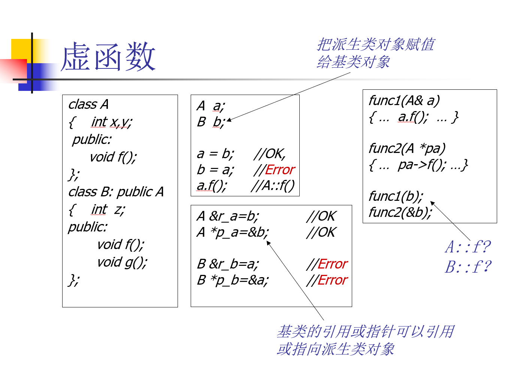
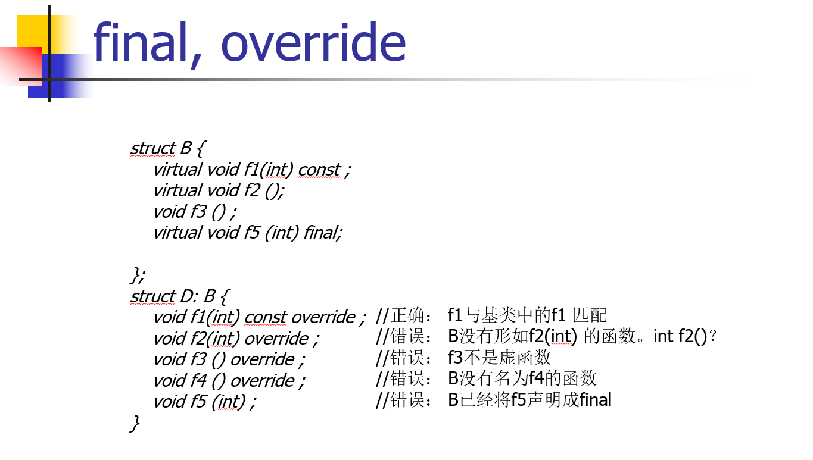
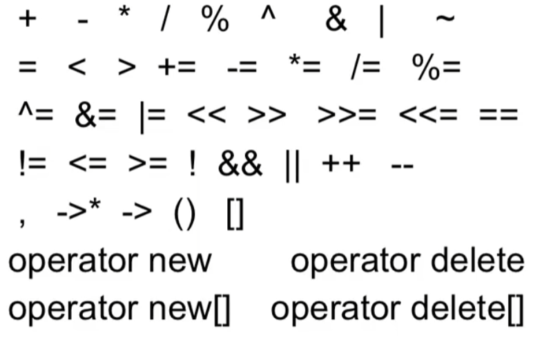
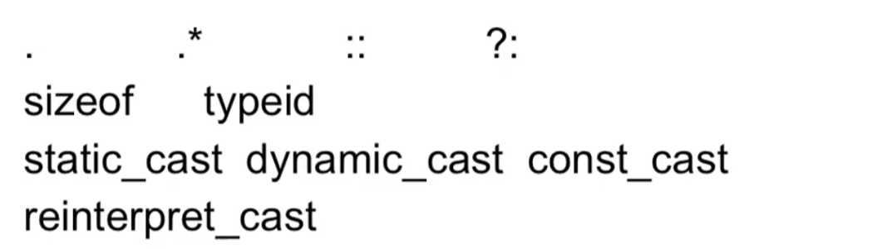
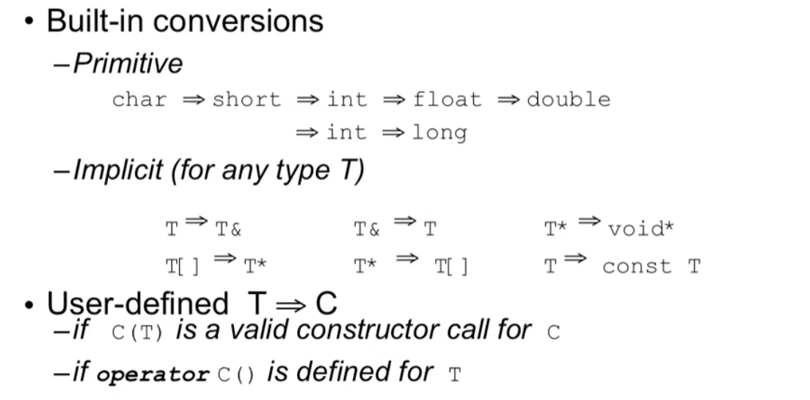
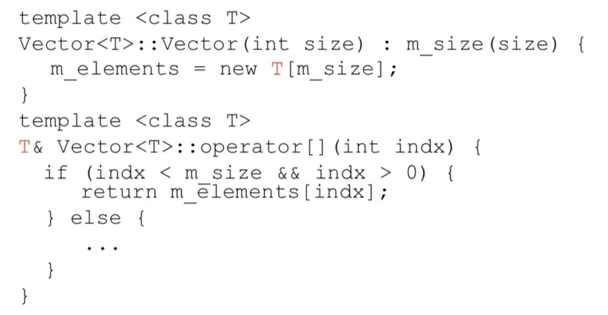
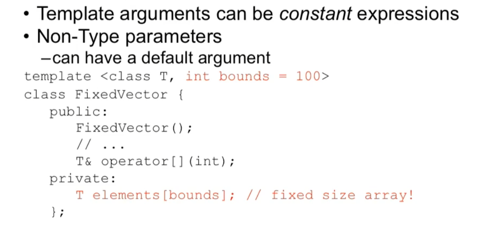

# 基本语法与数据结构

## 1. 编译/执行

```c++
#include <iostream>
using namespace std;
int main()
{
    cout << "Hello, world!" << endl;
    return 0;
}
```

## 2. 数字

数学运算

```C++
#include <iostream>
#include <cmath>
using namespace std;
 
int main ()
{
   // 数字定义
   short  s = 10;
   int    i = -1000;
   long   l = 100000;
   float  f = 230.47;
   double d = 200.374;
 
   // 数学运算
   cout << "sin(d) :" << sin(d) << endl;
   cout << "abs(i)  :" << abs(i) << endl;
   cout << "floor(d) :" << floor(d) << endl;
   cout << "sqrt(f) :" << sqrt(f) << endl;
   cout << "pow( d, 2) :" << pow(d, 2) << endl;
 
   return 0;
}
```

随机数

```c++
#include <iostream>
#include <ctime>
#include <cstdlib>
 
using namespace std;
 
int main ()
{
   int i,j;
 
   // 设置种子
   srand( (unsigned)time( NULL ) );
 
   /* 生成 10 个随机数 */
   for( i = 0; i < 10; i++ )
   {
      // 生成实际的随机数
      j= rand();
      cout <<"随机数： " << j << endl;
   }
 
   return 0;
}
```

常数

```c++
#include <cmath>
#include <iostream>

int main() {
    std::cout << "pi: " << std::numbers::pi << std::endl;
    std::cout << "e: " << std::numbers::e << std::endl;
    std::cout << "phi: " << std::numbers::phi << std::endl;	// 黄金比例
}
```

## 3. 字符串

下面的声明和初始化创建了一个 **RUNOOB** 字符串。由于在数组的末尾存储了空字符，所以字符数组的大小比单词 **RUNOOB** 的字符数多一个。

```c++
char site[7] = {'R', 'U', 'N', 'O', 'O', 'B', '\0'};
```

依据数组初始化规则，上面的语句写成以下语句：

```c++
char site[] = "RUNOOB";
```

C++ 中有大量的函数用来操作以 null 结尾的字符串:

| 序号 | 函数 & 目的                                                  |
| :--- | :----------------------------------------------------------- |
| 1    | **strcpy(s1, s2);** 复制字符串 s2 到字符串 s1。              |
| 2    | **strcat(s1, s2);** 连接字符串 s2 到字符串 s1 的末尾。连接字符串也可以用 **+** 号，例如: `string str1 = "runoob"; string str2 = "google"; string str = str1 + str2;` |
| 3    | **strlen(s1);** 返回字符串 s1 的长度。                       |
| 4    | **strcmp(s1, s2);** 如果 s1 和 s2 是相同的，则返回 0；如果 s1<s2 则返回值小于 0；如果 s1>s2 则返回值大于 0。 |
| 5    | **strchr(s1, ch);** 返回一个指针，指向字符串 s1 中字符 ch 的第一次出现的位置。 |
| 6    | **strstr(s1, s2);** 返回一个指针，指向字符串 s1 中字符串 s2 的第一次出现的位置。 |

下面的实例使用了上述的一些函数：

```C++
#include <iostream>
#include <cstring>
 
using namespace std;
 
int main ()
{
   char str1[13] = "runoob";
   char str2[13] = "google";
   char str3[13];
   int  len ;
 
   // 复制 str1 到 str3
   strcpy( str3, str1);
   cout << "strcpy( str3, str1) : " << str3 << endl;
 
   // 连接 str1 和 str2
   strcat( str1, str2);
   cout << "strcat( str1, str2): " << str1 << endl;
 
   // 连接后，str1 的总长度
   len = strlen(str1);
   cout << "strlen(str1) : " << len << endl;
 
   return 0;
}
```

当上面的代码被编译和执行时，它会产生下列结果：

```C++
strcpy( str3, str1) : runoob
strcat( str1, str2): runoobgoogle
strlen(str1) : 12
```

## 4. 指针

```C++
#include <iostream>
 
using namespace std;
 
int main ()
{
   int  var = 20;   // 实际变量的声明
   int  *ip;        // 指针变量的声明
 
   ip = &var;       // 在指针变量中存储 var 的地址
 
   cout << "Value of var variable: ";
   cout << var << endl;
 
   // 输出在指针变量中存储的地址
   cout << "Address stored in ip variable: ";
   cout << ip << endl;
 
   // 访问指针中地址的值
   cout << "Value of *ip variable: ";
   cout << *ip << endl;
 
   return 0;
}
```

## 5. C++ 日期 & 时间

下面是 C/C++ 中关于日期和时间的重要函数。所有这些函数都是 C/C++ 标准库的组成部分，您可以在 C++ 标准库中查看一下各个函数的细节。

| 序号 | 函数 & 描述                                                  |
| :--- | :----------------------------------------------------------- |
| 1    | [**time_t time(time_t \*time);**](https://www.runoob.com/cplusplus/c-function-time.html) 该函数返回系统的当前日历时间，自 1970 年 1 月 1 日以来经过的秒数。如果系统没有时间，则返回 -1。 |
| 2    | [**char \*ctime(const time_t \*time);**](https://www.runoob.com/cplusplus/c-function-ctime.html) 返回一个指向字符串的指针，字符串内容表示本地时间，格式为：`Www Mmm dd hh:mm:ss yyyy\n\0`其中：`Www`：星期（如 Tue）`Mmm`：月份（如 Jul）`dd`：日（如 29）`hh:mm:ss`：时间（24 小时制）`yyyy`：年份（如 2025）最后包含换行符 `\n` 和结束符 `\0`示例返回值：`"Tue Jul 29 19:12:15 2025\n\0"` |
| 3    | [**struct tm \*localtime(const time_t \*time);**](https://www.runoob.com/cplusplus/c-function-localtime.html) 该函数返回一个指向表示本地时间的 **tm** 结构的指针。 |
| 4    | [**clock_t clock(void);**](https://www.runoob.com/cplusplus/c-function-clock.html) 该函数返回程序执行起（一般为程序的开头），处理器时钟所使用的时间。如果时间不可用，则返回 -1。 |
| 5    | [**char \* asctime ( const struct tm \* time );**](https://www.runoob.com/cplusplus/c-function-asctime.html) 该函数返回一个指向字符串的指针，字符串包含了 time 所指向结构中存储的信息，返回形式为：day month date hours:minutes:seconds year\n\0。 |
| 6    | [**struct tm \*gmtime(const time_t \*time);**](https://www.runoob.com/cplusplus/c-function-gmtime.html) 该函数返回一个指向 time 的指针，time 为 tm 结构，用协调世界时（UTC）也被称为格林尼治标准时间（GMT）表示。 |
| 7    | [**time_t mktime(struct tm \*time);**](https://www.runoob.com/cplusplus/c-function-mktime.html) 该函数返回日历时间，相当于 time 所指向结构中存储的时间。 |
| 8    | [**double difftime ( time_t time2, time_t time1 );**](https://www.runoob.com/cplusplus/c-function-difftime.html) 该函数返回 time1 和 time2 之间相差的秒数。 |
| 9    | [**size_t strftime();**](https://www.runoob.com/cplusplus/c-function-strftime.html) 该函数可用于格式化日期和时间为指定的格式。 |

下面的实例获取当前系统的日期和时间，包括本地时间和协调世界时（UTC）。

```C++
#include <iostream>
#include <ctime>
 
using namespace std;
 
int main( )
{
   // 基于当前系统的当前日期/时间
   time_t now = time(0);
   
   // 把 now 转换为字符串形式
   char* dt = ctime(&now);
 
   cout << "本地日期和时间：" << dt << endl;
 
   // 把 now 转换为 tm 结构
   tm *gmtm = gmtime(&now);
   dt = asctime(gmtm);
   cout << "UTC 日期和时间："<< dt << endl;
}
```

当上面的代码被编译和执行时，它会产生下列结果：

```
本地日期和时间：Sat Jan  8 20:07:41 2011

UTC 日期和时间：Sun Jan  9 03:07:41 2011
```

**tm** 结构在 C/C++ 中处理日期和时间相关的操作时，显得尤为重要。tm 结构以 C 结构的形式保存日期和时间。大多数与时间相关的函数都使用了 tm 结构。下面的实例使用了 tm 结构和各种与日期和时间相关的函数。

在练习使用结构之前，需要对 C 结构有基本的了解，并懂得如何使用箭头 -> 运算符来访问结构成员。

```c++
#include <iostream>
#include <ctime>
 
using namespace std;
 
int main( )
{
   // 基于当前系统的当前日期/时间
   time_t now = time(0);
 
   cout << "1970 到目前经过秒数:" << now << endl;
 
   tm *ltm = localtime(&now);
 
   // 输出 tm 结构的各个组成部分
   cout << "年: "<< 1900 + ltm->tm_year << endl;
   cout << "月: "<< 1 + ltm->tm_mon<< endl;
   cout << "日: "<<  ltm->tm_mday << endl;
   cout << "时间: "<< ltm->tm_hour << ":";
   cout << ltm->tm_min << ":";
   cout << ltm->tm_sec << endl;
}
```

当上面的代码被编译和执行时，它会产生下列结果：

```
1970 到目前时间:1503564157
年: 2017
月: 8
日: 24
时间: 16:42:37
```

## 6. 输入输出

**标准输出流（cout）**

预定义的对象 **cout** 是 **iostream** 类的一个实例。cout 对象"连接"到标准输出设备，通常是显示屏。**cout** 是与流插入运算符 << 结合使用的，如下所示：

```c++
#include <iostream>
 
using namespace std;
 
int main( )
{
   char str[] = "Hello C++";
 
   cout << "Value of str is : " << str << endl;
}
```

当上面的代码被编译和执行时，它会产生下列结果：

```
Value of str is : Hello C++
```

C++ 编译器根据要输出变量的数据类型，选择合适的流插入运算符来显示值。<< 运算符被重载来输出内置类型（整型、浮点型、double 型、字符串和指针）的数据项。

流插入运算符 << 在一个语句中可以多次使用，如上面实例中所示，**endl** 用于在行末添加一个换行符。

**标准输入流（cin）**

预定义的对象 **cin** 是 **iostream** 类的一个实例。cin 对象附属到标准输入设备，通常是键盘。**cin** 是与流提取运算符 >> 结合使用的，如下所示：

```c++
#include <iostream>
 
using namespace std;
 
int main( )
{
   char name[50];
 
   cout << "请输入您的名称： ";
   cin >> name;
   cout << "您的名称是： " << name << endl;
 
}
```

当上面的代码被编译和执行时，它会提示用户输入名称。当用户输入一个值，并按回车键，就会看到下列结果：

```
请输入您的名称： cplusplus
您的名称是： cplusplus
```

C++ 编译器根据要输入值的数据类型，选择合适的流提取运算符来提取值，并把它存储在给定的变量中。

流提取运算符 >> 在一个语句中可以多次使用，如果要求输入多个数据，可以使用如下语句：

```
cin >> name >> age;
```

这相当于下面两个语句：

```
cin >> name;
cin >> age;
```

## 7. vector

C++ 中的 vector 是一种序列容器，它允许你在运行时动态地插入和删除元素。

vector 是基于数组的数据结构，但它可以自动管理内存，这意味着你不需要手动分配和释放内存。

与 C++ 数组相比，vector 具有更多的灵活性和功能，使其成为 C++ 中常用的数据结构之一。

vector 是 C++ 标准模板库（STL）的一部分，提供了灵活的接口和高效的操作。

**基本特性:**

- **动态大小**：`vector` 的大小可以根据需要自动增长和缩小。
- **连续存储**：`vector` 中的元素在内存中是连续存储的，这使得访问元素非常快速。
- **可迭代**：`vector` 可以被迭代，你可以使用循环（如 `for` 循环）来访问它的元素。
- **元素类型**：`vector` 可以存储任何类型的元素，包括内置类型、对象、指针等。

**使用场景：**

- 当你需要一个可以动态增长和缩小的数组时。
- 当你需要频繁地在序列的末尾添加或移除元素时。
- 当你需要一个可以高效随机访问元素的容器时。

要使用 vector，首先需要包含 **<vector>** 头文件：

```
#include <vector>
```

创建一个 vector 可以像创建其他变量一样简单：

```
std::vector<int> myVector; // 创建一个存储整数的空 vector
```

这将创建一个空的整数向量,也可以在创建时指定初始大小和初始值：

```
std::vector<int> myVector(5); // 创建一个包含 5 个整数的 vector，每个值都为默认值（0）
std::vector<int> myVector(5, 10); // 创建一个包含 5 个整数的 vector，每个值都为 10
```

或：

```
std::vector<int> vec; // 默认初始化一个空的 vector
std::vector<int> vec2 = {1, 2, 3, 4}; // 初始化一个包含元素的 vector
```

可以使用 push_back 方法向 vector 中添加元素：

```
myVector.push_back(7); // 将整数 7 添加到 vector 的末尾
```

可以使用下标操作符 [] 或 at() 方法访问 vector 中的元素：

```
int x = myVector[0]; // 获取第一个元素
int y = myVector.at(1); // 获取第二个元素
```

可以使用 size() 方法获取 vector 中元素的数量：

```
int size = myVector.size(); // 获取 vector 中的元素数量
```

可以使用迭代器遍历 vector 中的元素：

```
for (auto it = myVector.begin(); it != myVector.end(); ++it) {
    std::cout << *it << " ";
}
```

或者使用范围循环：

```
for (int element : myVector) {
    std::cout << element << " ";
}
```

可以使用 erase() 方法删除 vector 中的元素：

```
myVector.erase(myVector.begin() + 2); // 删除第三个元素
```

可以使用 clear() 方法清空 vector 中的所有元素：

```
myVector.clear(); // 清空 vector
```

以下是一个完整的使用实例，包括创建 vector、添加元素、访问元素以及输出结果的代码：

```c++
#include <iostream>
#include <vector>

int main() {
  // 创建一个空的整数向量
  std::vector<int> myVector;

  // 添加元素到向量中
  myVector.push_back(3);
  myVector.push_back(7);
  myVector.push_back(11);
  myVector.push_back(5);

  // 访问向量中的元素并输出
  std::cout << "Elements in the vector: ";
  for (int element : myVector) {
    std::cout << element << " ";
  }
  std::cout << std::endl;

  // 访问向量中的第一个元素并输出
  std::cout << "First element: " << myVector[0] << std::endl;

  // 访问向量中的第二个元素并输出
  std::cout << "Second element: " << myVector.at(1) << std::endl;

  // 获取向量的大小并输出
  std::cout << "Size of the vector: " << myVector.size() << std::endl;

  // 删除向量中的第三个元素
  myVector.erase(myVector.begin() + 2);

  // 输出删除元素后的向量
  std::cout << "Elements in the vector after erasing: ";
  for (int element : myVector) {
    std::cout << element << " ";
  }
  std::cout << std::endl;

  // 清空向量并输出
  myVector.clear();
  std::cout << "Size of the vector after clearing: " << myVector.size() << std::endl;

  return 0;
}
```

以上代码创建了一个整数向量，向其中添加了几个元素，然后输出了向量的内容、元素的访问、向量的大小等信息，接着删除了向量中的第三个元素，并输出删除元素后的向量。最后清空了向量，并输出清空后的向量大小。

输出结果为：

```
Elements in the vector: 3 7 11 5 
First element: 3
Second element: 7
Size of the vector: 4
Elements in the vector after erasing: 3 7 5 
Size of the vector after clearing: 0
```

## 8. 数据结构

链表

```c++
struct Node {
    int data;
    Node* next;
};
Node* head = nullptr;
Node* newNode = new Node{10, nullptr};
head = newNode; // 插入新节点
```

栈

```c++
stack<int> s;
s.push(1);
s.push(2);
cout << s.top(); // 输出 2
s.pop();
```

队列

```c++
queue<int> q;
q.push(1);
q.push(2);
cout << q.front(); // 输出 1
q.pop();
```

双端队列

```c++
deque<int> dq;
dq.push_back(1);
dq.push_front(2);
cout << dq.front(); // 输出 2
dq.pop_front();
```

哈希表

```c++
unordered_map<string, int> hashTable;
hashTable["apple"] = 10;
cout << hashTable["apple"]; // 输出 10
```

映射

```c++
map<string, int> myMap;
myMap["apple"] = 10;
cout << myMap["apple"]; // 输出 10
```

集合

```c++
set<int> s;
s.insert(1);
s.insert(2);
cout << *s.begin(); // 输出 1
```

# 面向对象设计

```cpp
class Point3d {
public:
	Point3d(float x, float y, float z);
	print();
private:
	float x;
	float y;
	float z;
}

Point3d a(1,2,3);
a.print();
```

## 示例：TicketMachine

`TicketMachine.h`

```cpp
#ifndef CLASS_TICKETMACHINE_H
#define CLASS_TICKETMACHINE_H

class TicketMachine {
public:
    TicketMachine() ;
    virtual ~TicketMachine();
    
    void showPrompt();
    void insertMoney(int money);
    // ...
private:
    int balance
    // ...
};

#endif //CLASS_TICKETMACHINE_H

```

`TicketMachine`

```cpp
#include "ticketmachine.h"

TicketMachine::TicketMachine() {
    // TODO: Auto generated constructor stub
}

TicketMachine::~TicketMachine() {
    // TODO: Auto generated destructor stub
}

void TicketMachine::showPrompt(){
    std::cout << "Something..." << endl;
}

void TicketMachine::insertMoney(int money){
    balance += money;
}
```

> **作用域解析符 `::`** 	访问某个命名空间或类/结构体/枚举内的成员
>
>
> 注意：对于变量的声明，需要加上**extern前缀**！
>
> `int global`是definition，而`extern int global`才是declaration！

## 1. 头文件

`#ifndef CLASS_TICKETMACHINE_H`
`#define CLASS_TICKETMACHINE_H`
`#endif // CLASS_TICKETMACHINE_H`
头文件保护，**防止头文件被重复包含而导致编译报错**

假设工程中有多个文件：
```
A.cpp
B.cpp
TicketMachine.h
```

并且 `A.cpp` 和 `B.cpp` 都 include 了 `TicketMachine.h`：

还可能彼此 include， 比如：
```
// A.cpp
#include "B.h"
#include "TicketMachine.h"

// B.h
#include "TicketMachine.h"
```

此时会有报错： `error: redefinition of 'class TicketMachine'`，因为 C++ 不允许一个类、函数、变量在同一个编译单元被重复定义

## 2. 成员变量

```cpp
// A.cpp
// ...
class A {
public:
	int i;
private:
	void f(){
		i = 20;
		cout << i;
	}
}

// main.cpp
A a;
A aa;
a.i = 10;
aa.i = 100;
a.f();
aa.f();
```

**成员变量是属于对象的，而方法是属于类的**

同一类下的所有对象各自**拥有自己的成员变量**，但所有对象**共用同样的方法**，不过**方法可以事先得知对哪个对象使用方法（`this`指针）**

实际上，`f()`在编译时会变成这样：

```cpp
void A::f(A* this){
    this.i = 10;
    cout << this.i;
}
```

## 3. 构造与析构

### constructor/destructor

构造函数，在对象“出生”时自动执行的函数，负责初始化成员变量、分配资源、确保可用等。

```cpp
TicketMachine::TicketMachine() {
    balance = 0;
}
```

```cpp
TicketMachine t;	// ← 这里自动调用构造函数
```

析构函数，在对象“死亡/被销毁”时自动执行的函数，负责释放资源（关闭文件、释放内存）

```cpp
TicketMachine::~TicketMachine() {
    // ...
}
```

```cpp
{						// 规定t的scope
    TicketMachine t;    // ← 这里构造
}              			// ← 程序块结束，这里自动析构
```

### 问题：跳过某些初始化

```cpp
void f(){
	if(i < 10) goto jump1;
	X x1;
	
jump1:
	X x2;
}
```

这里会出现错误，因为`x1` 的内存分配发生在程序**进入其作用域**时（编译器静态决定的），而构造需要执行到`X x1`这一句才进行。然而，当程序执行到作用域结尾时，会调用所有该作用域里**已分配的对象**的析构函数，但**未构造的对象是不能析构的！**

### struct

**C 语言中 struct 不能有构造函数**，但在 **C++ 中 struct 和 class 本质上没有区别**。

```cpp
struct Point {
    int x;
    int y;

    Point(int a, int b) {
        x = a;
        y = b;
    }
};
```

```cpp
Point p(3, 4);
```

## 4. 访问限制

### private

private里的变量不允许client访问，想要访问可以通过在public里构造get和set完成

### 友元

**友元（friend）** 是 C++ 中的一个关键字，用来 **让某个函数或某个类可以访问本类的 private / protected 成员**。

```cpp
struct X; // 前向声明，让编译通过
  
struct Y {
    void f(X*);
};

struct X{
private:
    int i;
public:
    void init();
    friend void g(X*, int);
    friend void Y::f(X*);
    friend struct Z;
    friend void h();
}
```

此时friend的方法或类可以直接访问`X.i`

## 5. 初始化列表

初始化列表（initializer list）是 C++ 构造函数中的一种语法，用来在构造对象时 **直接初始化成员变量**，而不是在构造函数体内进行赋值。

```cpp
ClassName::ClassName(int a, int b) : x(a), y(b)   // ← 初始化列表
{
    // 构造函数体
}
```

或者是：

```cpp
class A {
public:
    A(int v) : value(v) { }	// 当对象被创建时，用参数 v 来直接初始化 value。
private:
    int value;
};
```

**和赋值的区别**：

```cpp
Student::Student(string s):name(s) {}
Student::Student(string s){name = s;}
```

赋值实际上做了两件事：**先初始化，然后再赋值**。而初始化列表则是在对象**被分配时立即对其赋值，是在constructor之前完成的**

有些成员 **必须** 用初始化列表，否则编译不了

- `const`变量

  ```cpp
  class A {
      const int x;
  public:
      A(int v) : x(v) {}  // ✔ 必须用初始化列表
  };
  ```

- 引用变量
  ```cpp
  class A {
      int& r;
  public:
      A(int& x) : r(x) {}  // ✔ 必须用初始化列表
  };
  ```

- **没有默认构造函数的成员对象**

  ```cpp
  class B {
  public:
      B(int x) {}
  };
  
  class A {
      B b;
  public:
      A() : b(10) {}  // ✔ 必须显式构造
  };
  ```

  **成员对象在进入构造函数体之前就必须“被构造出来”**，而如果这个成员对象 **没有默认构造函数**，编译器就不知道应该怎么“先构造它”，所以就必须由你在 **初始化列表** 中明确告诉编译器用什么构造方式来构造这个成员。

  假设 B 只有一个带参数的构造函数：

  ```cpp
  class B {
  public:
      B(int x);  // ✔ 只有这个构造函数
  };
  ```

  它 **没有默认构造函数**。

  现在你写：

  ```cpp
  class A {
      B b; 
  public:
      A() { 
          // 想在这里赋值？太晚了！
          // b = B(10);  // ❌ 不可行
      }
  };
  ```

  问题出现：

  在 **进入 A() 的构造函数体之前**，编译器必须把 b 构造出来。

  但编译器发现：

  - B 没有默认构造函数（B()）
  - 又没有在初始化列表中告诉它怎么构造 B

  于是：

  > 🛑 **编译错误：b 无法被默认构造。**

## 5. 对象组合

组合 = 一个类“拥有”另一个类作为成员。

```cpp
class Engine {
public:
    Engine() { cout << "Engine constructed\n"; }
};

class Car {
private:
    Engine engine;  // Car 组合了 Engine
public:
    Car() { cout << "Car constructed\n"; }
};
```

## 6.  拷贝构造

### 拷贝构造方法

```cpp
static int objectcount = 0;

class HowMany {
public:
	HowMany() {objectcount++ ; print("HowMany()");}
	void print(const string& msg = "") {
		if(msg.size()!=0) count << msg << ":";
		cout << "objectcount = " << objectcount << endl;
	}
	~HowMany() {
		objectcount--;
		print("~HowMany()");
	}
}

HowMany f(HowMany x) {		// <- 注意这里传的是对象而不是指向对象的指针
	cout << "begin of f" << endl;
	x.print("x argument inside f()");
	cout << "end of f" << endl;
	return x;
}

int main(){
	HowMany h;
	h.print("after construction of h");
	HowMany h2 = f(h);
	h.print("after call to f()");
}
```

输出：

```bash
HowMany(): objectcount = 1
after construction of h: objectcount = 1
begin of f
x argument inside f(): objectcount = 1
end of f
~HowMany(): objectcount = 0
after call to f(): objectcount = 0
~HowMany(): objectcount = -1
~HowMany(): objectcount = -2
```

注意到，析构函数被调用了三次，说明创建了三个对象，其中只有`h`是正常构造的（obj++）；程序没有报错，说明`x`和`h2`肯定是被构造了的，只是没有走过规定的构造函数。

那如果这样改呢：

```cpp
HowMany h2 = h;
```

结果：

```bash
HowMany(): objectcount = 1
after construction of h: objectcount = 1
after call to f(): objectcount = 1
~HowMany(): objectcount = 0
~HowMany(): objectcount = -1
```

还是没有经过我们的构造函数

那这样呢，加一个构造函数`HowMany(const HowMany& o)`

```cpp
HowMany(const HowMany& o){ objectcount++ ; print("HowMany(HM)");}
```

此时的输出:

```bash
HowMany(): objectcount = 1
after construction of h: objectcount = 1
HowMany(HM): objectcount = 2
after call to f(): objectcount = 2
~HowMany(): objectcount = 1
~HowMany(): objectcount = 0
```

正常了！说明此时`HowMany h2 = h`这一句在构造时经过了`HowMany(const HowMany& o)`这个构造方法！

那此时我们再回复`HowMany h2 = f(h)`，此时的输出：

```bash
HowMany(): objectcount = 1
after construction of h: objectcount = 1
HowMany(HM): objectcount = 2
begin of f
x argument inside f(): objectcount = 1
end of f
HowMany(HM): objectcount = 3
~HowMany(): objectcount = 2
after call to f(): objectcount = 2
~HowMany(): objectcount = 1
~HowMany(): objectcount = 0
```

形如`T::T(const T&)`的构造方法就是**拷贝构造**。

如果没有显式地给出拷贝方法，c++会自动帮你补充一个。

### 浅拷贝与深拷贝

编译器会拷贝每个成员变量，包括对象；**拷贝对象时，会让那个类的拷贝构造方法来拷贝构造那个对象**；如果被拷贝的对象里有其他的对象，这个构造会**递归地进行下去**。

这是**在成员级别上的拷贝，而不是字节级别的拷贝**，拷贝的基本单位是成员，而不是按字节一个一个复制过来。

如果成员有指针，会发生指针的拷贝，这**两个指针会指向同一变量**；同理如果有reference的话，这两个reference会捆绑同一个变量。

以上，就是**浅拷贝**，拷贝指针时，两个对象的指针指向同一块内存，没有任何“新内存”被分配。

```
新对象.p = 旧对象.p   （指针的地址被直接复制）
```

而**深拷贝**，就是**复制指针所指向的内容，分配新内存，让两个对象互不影响**

```
新对象.p = new int(*旧对象.p)
```

```cpp
Person::Person(const Person& w){
    name = new char[::strlen(w.name)+1];
    ::strcpy(name, w.name);
}
```

为name分配了新的内存，这是深拷贝

> 之前说，方法是属于类的，同为Person类，这里是可以直接访问w.name的

## 7. 左值引用与右值引用

### 左值引用

先看一下传统的左值引用。

```cpp
int a = 10;
int &b = a;  // 定义一个左值引用变量
b = 20;      // 通过左值引用修改引用内存的值
```

*左值引用在汇编层面其实和普通的指针是一样的；*定义引用变量必须初始化，因为引用其实就是一个别名，需要告诉编译器定义的是谁的引用。

```cpp
int &var = 10;
```

上述代码是无法编译通过的，因为10无法进行取地址操作，无法对一个立即数取地址，因为立即数并没有在内存中存储，而是存储在寄存器中，可以通过下述方法解决：

```cpp
const int &var = 10;
```

使用常引用来引用常量数字10，因为此刻内存上产生了临时变量保存了10，这个临时变量是可以进行取地址操作的，因此var引用的其实是这个临时变量，相当于下面的操作：

```cpp
const int temp = 10; 
const int &var = temp;
```

根据上述分析，得出如下结论：

- 左值引用要求右边的值必须能够取地址，如果无法取地址，可以用常引用；
  但使用常引用后，我们只能通过引用来读取数据，无法去修改数据，因为其被const修饰成常量引用了。

那么[C++11](https://zhida.zhihu.com/search?content_id=109714504&content_type=Article&match_order=1&q=C%2B%2B11&zhida_source=entity) 引入了[右值引用](https://zhida.zhihu.com/search?content_id=109714504&content_type=Article&match_order=1&q=右值引用&zhida_source=entity)的概念，使用右值引用能够很好的解决这个问题。

### 右值引用

C++对于左值和右值没有标准定义，但是有一个被广泛认同的说法：

- 可以取地址的，有名字的，非临时的就是左值；
- 不能取地址的，没有名字的，临时的就是右值；

可见立即数，函数返回的值等都是右值；而非匿名对象(包括变量)，函数返回的引用，const对象等都是左值。

从本质上理解，创建和销毁由编译器幕后控制，程序员只能确保在本行代码有效的，就是右值(包括立即数)；而用户创建的，通过作用域规则可知其生存期的，就是左值(包括函数返回的局部变量的引用以及const对象)。

定义右值引用的格式如下：

```text
类型 && 引用名 = 右值表达式;
```

右值引用是C++ 11新增的特性，所以C++ 98的引用为左值引用。右值引用用来绑定到右值，绑定到右值以后本来会被销毁的右值的生存期会延长至与绑定到它的右值引用的生存期。

```text
int &&var = 10;
```

在汇编层面右值引用做的事情和常引用是相同的，即产生临时量来存储常量。但是，唯一 一点的区别是，右值引用可以进行读写操作，而常引用只能进行读操作。

右值引用的存在并不是为了取代左值引用，而是充分利用右值(特别是临时对象)的构造来减少对象构造和析构操作以达到提高效率的目的。

用C++实现一个简单的顺序栈：

```cpp
class Stack
{
public:
    // 构造
    Stack(int size = 1000) 
	:msize(size), mtop(0)
    {
	cout << "Stack(int)" << endl;
	mpstack = new int[size];
    }
	
    // 析构
    ~Stack()
    {
	cout << "~Stack()" << endl;
	delete[]mpstack;
	mpstack = nullptr;
    }
	
    // 拷贝构造
    Stack(const Stack &src)
	:msize(src.msize), mtop(src.mtop)
    {
	cout << "Stack(const Stack&)" << endl;
	mpstack = new int[src.msize];
	for (int i = 0; i < mtop; ++i) {
	    mpstack[i] = src.mpstack[i];
	}
    }
	
    // 赋值重载
    Stack& operator=(const Stack &src)
    {
	cout << "operator=" << endl;
	if (this == &src)
     	    return *this;

	delete[]mpstack;

	msize = src.msize;
	mtop = src.mtop;
	mpstack = new int[src.msize];
	for (int i = 0; i < mtop; ++i) {
	    mpstack[i] = src.mpstack[i];
	}
	return *this;
    }

    int getSize() 
    {
	return msize;
    }
private:
    int *mpstack;
    int mtop;
    int msize;
};

Stack GetStack(Stack &stack)
{
    Stack tmp(stack.getSize());
    return tmp;
}

int main()
{
    Stack s;
    s = GetStack(s);
    return 0;
}
```

运行结果如下：

```cpp
Stack(int)             // 构造s
Stack(int)             // 构造tmp
Stack(const Stack&)    // tmp拷贝构造main函数栈帧上的临时对象
~Stack()               // tmp析构
operator=              // 临时对象赋值给s
~Stack()               // 临时对象析构
~Stack()               // s析构
```

为了解决浅拷贝问题，为类提供了自定义的拷贝构造函数和赋值运算符重载函数，并且这两个函数内部实现都是非常的耗费时间和资源(首先开辟较大的空间，然后将数据逐个复制)，我们通过上述运行结果发现了两处使用了拷贝构造和赋值重载，分别是tmp拷贝构造main函数栈帧上的临时对象、临时对象赋值给s，其中tmp和临时对象都在各自的操作结束后便销毁了，使得程序效率非常低下。

那么我们为了提高效率，是否可以把tmp持有的内存资源直接给临时对象？是否可以把临时对象的资源直接给s？

在C++11中，我们可以解决上述问题，方式是提供带右值引用参数的拷贝构造函数和赋值运算符重载函数.

```cpp
// 带右值引用参数的拷贝构造函数
Stack(Stack &&src)
    :msize(src.msize), mtop(src.mtop)
{
    cout << "Stack(Stack&&)" << endl;

    /*此处没有重新开辟内存拷贝数据，把src的资源直接给当前对象，再把src置空*/
    mpstack = src.mpstack;  
    src.mpstack = nullptr;
}

// 带右值引用参数的赋值运算符重载函数
Stack& operator=(Stack &&src)
{
    cout << "operator=(Stack&&)" << endl;

    if(this == &src)
        return *this;
	    
    delete[]mpstack;

    msize = src.msize;
    mtop = src.mtop;

    /*此处没有重新开辟内存拷贝数据，把src的资源直接给当前对象，再把src置空*/
    mpstack = src.mpstack;
    src.mpstack = nullptr;

    return *this;
}
```

运行结果如下：

```cpp
Stack(int)             // 构造s
Stack(int)             // 构造tmp
Stack(Stack&&)         // 调用带右值引用的拷贝构造函数，直接将tmp的资源给临时对象
~Stack()               // tmp析构
operator=(Stack&&)     // 调用带右值引用的赋值运算符重载函数，直接将临时对象资源给s
~Stack()               // 临时对象析构
~Stack()               // s析构
```

程序自动调用了带右值引用的拷贝构造函数和赋值运算符重载函数，使得程序的效率得到了很大的提升，因为并没有重新开辟内存拷贝数据。

可以直接赋值的原因是临时对象即将销毁，不会出现浅拷贝的问题，我们直接把临时对象持有的资源赋给新对象就可以了。

上面说的构造方法，就是**移动构造**，即**偷**右值对象的资源（如内存指针），再把原对象的指针置空，避免 double delete.

此外，还有**移动赋值**：

```cpp
MyArray& operator=(MyArray&& other) {
    size = other.size;
    arr = other.arr;
    other.arr = NULL;
    return *this;
}
```

而`std::move`的作用，就是把左值显式转换成右值引用，从而触发移动语义。

## 8. 动态内存与动态对象

### new 和 delete

| 语言 | 申请     | 释放   | 调用构造/析构？              |
| ---- | -------- | ------ | ---------------------------- |
| C    | malloc() | free() | ❌ 不会调用构造函数/析构函数  |
| C++  | new      | delete | ✔ 自动调用构造函数与析构函数 |

```c
p = (A*) malloc(sizeof(A));  // malloc 不调用构造函数
free(p);                     // free 不调用析构函数
```

```c
A* p = new A;   // 调用 A() 构造函数
delete p;       // 调用 ~A() 析构函数
```

**new 的行为**：

1. 在 heap 上申请 sizeof(A) 的内存

2. 调用 A 的构造函数初始化那块内存

3. 返回这块对象的地址（指向 heap 对象的指针）

动态对象就是**通过 new 在堆上创建的对象**

### 动态对象数组

```cpp
A* p;
p = new A[100];   // 调用100次默认构造
delete [] p;      // 调用100次析构 + 释放数组
```

数组删除必须写 `delete [] p;`（不能省略方括号）

类要有 **默认构造函数** 才能 `new A[100]`

**动态二维数组**：

```cpp
char** chArray2 = new char*[ROWS];

for(int row = 0; row < ROWS; row++)
    chArray2[row] = new char[COLUMNS];
```

释放：

```cpp
for(int row = 0; row < ROWS; row++) {
    delete [] chArray2[row];
    chArray2[row] = NULL;
}
delete [] chArray2;
chArray2 = NULL;
```

## 9. Const

### Const成员

将**`const`**修饰的“成员函数”称之为const成员函数，const修饰类成员函数，实际修饰该成员函数隐含的**this指针**，**表明在该成员函数中不能对类的任何成员进行修改** 

```cpp
class Date
{
public:
	//构造函数
	Date(int year, int month, int day)
	{
		_year = year;
		_month = month;
		_day = day;
	}
	void Printf()
	{
		cout << _year << "年" << _month << "月" << _day << "日" << endl;
	}
private:
	int _year;
	int _month;
	int _day;
};
 
void Func(const Date& d)
{
	d.Printf();
}
 
int main()
{
	Date d1(2023, 11, 1);
	d1.Printf();
	Date d2(2023, 11, 2);
	Func(d2);
	return 0;
}
```

此时`d1`不会报错，但`Func(d2)`里的`d.print()`会报错，怎么回事呢？

`Printf()`隐含的默认`this`指针是`void Printf(Date* const this)`，这里`this`指针是`Date*`类型的

而我传入的是`const Date*` 类型，传入的过程中权限被扩大了！

可以这样修改：

```cpp
	void Printf() const	// 编译器默认处理成：void Print(const Date* const this)
	{
		cout << _year << "年" << _month << "月" << _day << "日" << endl;
	}
```

这样权限不变，就不会报错了

**const对象不能调用非const成员函数，非const对象可以调用const成员函数，const成员函数内不能调用其它的非const成员函数，非const成员函数内可以调用其它的const成员函数**

如果const 成员函数中想修改“内部状态”，可以使用mutable

```cpp
struct Fib {
    Fib(int n) : n_(n) {}
    int value() const {
        if (!cached) {
            cache  = fib(n_);
            cached = true;
        }
        return cache;
    }

    int n_;
    mutable bool cached = false;
    mutable int  cache  = 0;
};
```

const 成员函数理论上不能修改成员变量，但“缓存”属于内部实现细节，不影响对象的逻辑外部状态，所以用 `mutable` 让这两个成员在 const 函数里可以修改

### Const表达式

constexpr 修饰函数：

- 如果传入常量表达式 → 在编译期计算
- 否则 → 在运行期计算，也合法

```cpp
constexpr int sqr(int x) { return x * x; }

constexpr int A = sqr(10);  // 编译期计算
int y = 3;
int B = sqr(y);             // 运行期计算
```

consteval：

- 必须在编译期求值，调用点不是常量表达式就报错

```cpp
consteval int pow2(int n) { return 1 << n; }

constexpr int M = pow2(8);    // ✔ OK
int r = pow2(y);              // ❌ y不是常量表达式 → 编译错误
```

## 10. 静态成员

类刻画了一组具有相同属性的对象
问题：**同一个类的不同对象如何共享变量**？

- 如果把这些共享变量定义为全局变量 → 缺乏数据保护，名污染

```cpp
class A {
    int x, y;
    static int shared;
};
int A::shared = 0;
A a, b;
```

> ❗静态成员变量的定义必须在类外再写一遍：`int A::shared = 0;`
>
> 或者`inline static int shared = 0;`（C++17）

**静态成员函数**

```cpp
class A {
    static int shared;
    int x;
public:
    static void f() { … shared … }
    void q() { … x … shared … }
};
```

静态成员函数**没有 this 指针**，因此 **不能访问非静态成员变量**（例如 x），但可以访问静态成员变量（shared）

静态成员函数可以通过对象访问（`a.f()`），也可以通过类访问（`A::f()`）

典型应用——单例模式：

```cpp
class singleton {
protected:
    singleton() {}
    singleton(const singleton &);

public:
    static singleton* instance() {
        return m_instance == NULL ?
            m_instance = new singleton :
            m_instance;
    }

    static void destroy() {
        delete m_instance;
        m_instance = NULL;
    }

private:
    static singleton* m_instance;
};

singleton* singleton::m_instance = NULL;
```

## 11. 继承

```cpp
class Base {
public:
    void func();
};

class Derived : public Base {
    // Derived “继承自” Base
};
```

**构造顺序**：

1. **父类构造函数先执行**
2. **再执行子类构造函数**

```
Base() -> Derived()
```

**析构顺序（相反）**：

1. **子类析构函数先执行**
2. **再执行父类析构函数**

```
~Derived() -> ~Base()
```

**基类构造函数的调用**

- 缺省执行基类默认构造函数

- 如果要执行基类的**非默认构造函数**，则必须在派生类构造函数的**成员初始化表**中指出

```cpp
class A
{    int x;
  public:
     A() { x = 0; }
     A(int i) { x = i; }
};
class B: public A
{   int y;
public:
   B() { y = 0; }
   B(int i) { y = i; }
   B(int i, int j):A(i) 
   {   y = j;  }
};

B b1; 			//执行A::A()和B::B()
B b2(1); 	   //执行A::A()和B::B(int)
B b3(0,1); 		//执行A::A(int)和B::B(int,int)
```

**虚函数**

``` cpp
class Base {
public:
    virtual void show() { std::cout << "Base show\n"; }
};

class Derived : public Base {
public:
    void show() override { std::cout << "Derived show\n"; }
};

Base* p = new Derived();
p->show();   // 输出 Derived show（动态绑定）

```

典型使用场景：

1. 多态接口

```cpp
class Shape {
public:
    virtual void draw() = 0; // 纯虚函数
};
```

2. 统一处理不同子类对象

```cpp
std::vector<Shape*> shapes;
shapes.push_back(new Circle());
shapes.push_back(new Square());

for (auto s : shapes)
    s->draw();   // 自动调用正确对象的 draw
```

3. 用于析构函数（必须 virtual）

如果父类作为多态基类，其析构函数必须是 virtual：

```cpp
class Base {
public:
    virtual ~Base() {}
};
```

这样 delete Base* 指向 Derived 时，才会调用 Derived 的析构。



> 类的成员函数才可以是虚函数
>
> 静态成员函数不能是虚函数
>
> 内联成员函数不能是虚函数
>
> 构造函数不能是虚函数
>
> 析构函数可以（往往）是虚函数



**友元（friend）与 protected 的关系**

- protected 成员对子类和友元开放
- 一个类的 friend 只能访问该类的 private/protected
- 无法访问基类的 protected（除非该基类也声明其为 friend）

## 12. 多继承

```cpp
class D : public B1, public B2 {
public:
    D() : B1(), B2() {}
};
```

构造顺序：B1 → B2 → D，析构相反

如果两个基类都有同名成员，会冲突，例如：

```cpp
class B1 { public: void f(); };
class B2 { public: void f(); };

class D : public B1, public B2 { };
```

调用时必须显式指定：

```cpp
D d;
d.B1::f();
d.B2::f();
```

**重复基类问题**：

```
    A
   / \
  B   C
   \ /
    D
```

虚继承（virtual inheritance），虚基类**只保留一份副本**，不会重复

```cpp
class B : virtual public A { };
class C : virtual public A { };
class D : public B, public C { };
```

虚基类的构造函数由**最新派生类**调用
 虚基类构造函数总是优先于非虚基类构造函数执行

```cpp
class A {};
class B : virtual public A {};
class C : virtual public A {};
class D : public B, public C { };
```

构造 D 时，A 的构造由 D 负责：A → B → C → D，只构造一次，确保唯一 A

## 13. 运算符重载

### 基本规则

**可以被重载的运算符**：



**不能被重载的运算符**：



重载运算符方法可以说是成员函数，此时指的是`this`和传入的参数做运算（ `const String String::operator+ (const string& that)`表示this和that做加运算）

也可以是全局方法，此时要写完整的传入参数

对于作为**成员函数**的重载运算符方法来说，存在一个隐式的第一参数（即`this`），比如说：

```
Integer x(1),y(2),z;
x+y	====> x.operator+(y)
```

此时x为**receiver**，对receiver是不做type conversion（类型转换）的，因此形如`z=3+y`的方法是错误的，因为3不会被类型转换成Integer；而`z=y+3`是可行的，因为3可以被初始化成Integer

一元的运算符重载类似，只不过不接受参数，只有一个隐式的this作为参数

```Cpp
const Integer operator-() const{
	return Integer(-i);
}

z = -x // z.operator=(x.operator-())
```

作为**全局函数**时，需要显式地保留所有参数（注意如果要访问类的private变量需要声明友元或者给出getter和setter）

```Cpp
const Integer operator+(const Integer& rhs, const Integer& lhs);

z = x + y // opperator+(x, y)
```

此时，类型转换会发生在所有参数上，也就是说，形如`z=3+y`的函数在这里是可行的

特殊的，形如`z=3+7`也是可行的，只不过这里的`+`是默认的int的加号，而不是自定义的重载的加号。但是`=`是重载的，因此结果10会被类型转换成Integer，依然是成立的。

> Tips.
>
> 对于Unary运算符（如！、-等），建议作为成员函数完成，直接对this操作
>
> 对于`=、()、[]、->、->*`**必须**作为成员函数完成
>
> 对于其他的一般的二元运算符，推荐作为全局函数完成

对于不修改算子的操作符，一定要加const；修改算子的操作符（如`++,--,+=,-=`等），不能加const

### 原型

运算符重载的返回类型：

- `+ = * / % ^ & | ~`
  - `const T operatorX(const T& l, const T& r) const`

- `! && || < <= == > >=`
  - `bool operatorX(const T& l, const T& r) const`

- `[]`
  - `T& T::operator[](int index)`
  - `operator[]` 的目标是**模拟内置数组的行为**，如果是`T operator[](int index)`，那么对于`a[i] = value`，语义上等价于`operator[](a, i) = value`，然而`operator[](a, i)`返回的是一个**临时对象**而不是左值，临时对象是不能赋值的，因此要加上`&`；至于加不加`const`，取决于你希不希望有`a[0] = 3`这样的行为

那么对于`++,--`，返回值和原型是怎样的呢？

我们规定：

1. **前置**自增/自减（prefix:`++a`,`--a`）

   ```
   T& operator++();   // ++x
   T& operator--();   // --x
   ```

2. **后置**自增/自减（postfix:`a++`,`a--`）

   ```
   T operator++(int); // x++
   T operator--(int); // x--
   ```

后置中的多出来的`int`参数是用于区分两种重载的，不会实际使用

prefix返回`T&`，是因为prefix返回的是**被修改后的那个对象本身**，是先修改再赋值；而postfix返回`T`，是因为postfix返回的是**被修改前的旧值**，是先赋值再修改，自然不可能返回引用

实际实现如下：

```cpp
class Counter {
    int value;
public:
    Counter(int v = 0) : value(v) {}

    // prefix ++
    Counter& operator++() {
        ++value;
        return *this;
    }

    // postfix ++
    Counter operator++(int) {
        Counter old(*this);	// 拷贝构造
        ++(*this);	// 用prefix来构造postfix
        return old;
    }
};
```

### 类型转换

```cpp
class PathName {
public:
    PathName(const std::string&);
};

std::string abc("abc");
PathName xyz;

xyz = abc;
```

上述赋值是可行的，`xyz=abc`等价于`xyz.operator=(abc)`，于是编译器会寻找`PathName`类的`operator=`，没有定义，但C++会**自动生成一个拷贝赋值运算符**

```cpp
PathName& operator=(const PathName&);
```

于是问题的核心就在于`string`能否类型转换成`PathName`，这一点在构造函数里是实现了的，因此这样的赋值成立

因此下述代码是可以发生的：

```cpp
class One{
public:
	One(){}
};

class Two{
public:
	Two(const One&){}
};

void f(Two){};

int main(){
	One one;
	f(one);	//可以正常运行，因为One可以类型转换成Two
}
```

**那如果我不希望这样的自动转换呢？**

New keyword：`explicit`

```cpp
class PathName {
public:
    explicit PathName(const std::string&);	// 禁止类型转换
};

std::string abc("abc");
PathName xyz;

xyz = abc;	// error！！
```

```cpp
class One{
public:
	One(){}
};

class Two{
public:
	explicit Two(const One&){}
};

void f(Two){};

int main(){
	One one;
	// f(one);	错误！
	f(Two(one))	// 正确，但是这就不是类型转换了，而是重新构造了一个Two的临时变量
}
```

此外还有一种方法，就是直接定义**类型转换成员函数**

```cpp
operator T() const;	// 将 this 转换成 T 的方法
```

没有参数、explicit和返回类型

**总结：C++里的类型转换：**



```cpp
#include <iostream>
using namespace std;
class A
{
public:
    operator int() { return 1; }
    operator char*() { return NULL; }
};
int main()
{
    A a;
    int n;
    char* p = "New Dragon Inn";
    n = static_cast <int> (3.14);  // n 的值变为 3
    n = static_cast <int> (a);  //调用 a.operator int，n 的值变为 1
    p = static_cast <char*> (a);  //调用 a.operator char*，p 的值变为 NULL
    n = static_cast <int> (p);  //编译错误，static_cast不能将指针转换成整型
    p = static_cast <char*> (n);  //编译错误，static_cast 不能将整型转换成指针
    return 0;
}
```

### 自我赋值检查

```cpp
class String {
    char* data;
public:
    String(const char* s) {
        data = new char[strlen(s) + 1];
        strcpy(data, s);
    }

    ~String() {
        delete[] data;
    }

    String& operator=(const String& rhs) {
        delete[] data;
        data = new char[strlen(rhs.data) + 1];
        strcpy(data, rhs.data);
        return *this;
    }
};
```

此时出现问题，如果有：

```cpp
String s("hello");
s = s;   // 自我赋值
```

`delete[] data`导致产生悬空指针，因此，赋值号重载时一定要检查rhs是不是自身（看地址是否相同）

```cpp
String& operator=(const String& rhs) {
    if (this == &rhs)
        return *this;

    delete[] data;
    data = new char[strlen(rhs.data) + 1];
    strcpy(data, rhs.data);
    return *this;
}
```

### 二维数组

```cpp
Matrix m;
m[1][2] = 42;
```

语义上等价于：

```cpp
(m.operator).operator
```

此时`int& operator[](int i, int j)`的写法就是错误的，要用一个**代理**隔开

```cpp
#include <vector>
#include <cstddef>

class Matrix {
    std::vector<int> data;
    std::size_t rows, cols;

public:
    Matrix(std::size_t r, std::size_t c)
        : data(r * c), rows(r), cols(c) {}

    class RowProxy {
        int* row;
    public:
        RowProxy(int* r) : row(r) {}

        int& operator[](std::size_t j) {
            return row[j];
        }
    };	// 在类里在定义一个代理类

    RowProxy operator[](std::size_t i) {
        return RowProxy(&data[i * cols]);
    }
};
```


## 14. 模板

程序设计中经常会用到一些程序实体：它们的实现和所完成的功能基本相同，不同的仅仅是所涉及的数据类型不同。而模板正是一种专门处理不同数据类型的机制。

模板是泛型程序设计的基础（泛型generic type——通用类型之意）。

```
template<typename T1, typename T2,......,typename Tn>
返回值类型 函数名(参数列表)
{
    //……
}
注意：typename是用来定义模板参数关键字，也可以使用class(切记：不能使用struct代替class)
```

因此，Swap可以这样写：

```cpp
template<typename T>
void Swap(T& left, T& right)
{
	T temp = left;
	left = right;
 	right = temp;
} 
```

这样，编译器就会检查你的代码，如果你的代码中用到了该方法，编译器就会实例化一个当前类型的函数

比如，你在后面的代码里写道到了`Swap(a,b)`，这里的a和b是int类型，那么编译器就会实例化一个`void Swap(int& left, int& right)`；如果此时又有`Swap(c,d)`，而c和d是double类型的，就会再实例化一个`void Swap(double& left, double& right)`，只有在“用到”时才会生成代码

并且，对于模板生成的函数，所有的类型检查都发生在编译器而不是动态检查，因此模板是很安全的

一般来说，不指定类型的情况下，模板函数是**隐式实例化**的：

```cpp

template<class T>
T Add(const T& left, const T& right)
{
	return left + right;
}
int main()
{
	int a1 = 10, a2 = 20;
	double d1 = 10.0, d2 = 20.0;
	Add(a1, a2); //编译器推出T是int
	Add(d1, d2); //编译器推出T是double
    return 0;
}
```

然而，这样调用时就会出错：

```cpp
    int a1 = 10, a2 = 20;
	double d1 = 10.0, d2 = 20.0;
	Add(a1, d1); //err 编译器推不出来
```

对此，我们可以采用**显式实例化**的方式

```cpp

template<class T>
T Add(const T& left, const T& right)
{
	return left + right;
}
int main()
{
	int a1 = 10, a2 = 20;
	double d1 = 10.0, d2 = 20.0;
    //显示实例化
	Add<int>(a1, d1); //double隐式类型转换成int 
	Add<double>(a1, d2); 
    return 0;
}
```

当然，模板支持**多参数**：

```cpp

template<class K, class V> //两个模板参数
void Func(const K& key, const V& value)
{
	cout << key << ":" << value << endl;
}
int main()
{
	Func(1, 1); //K和V均int
	Func(1, 1.1);//K是int，V是double
	Func<int, char>(1, 'A'); //多个模板参数也可指定显示实例化不同类型
}
```

类模板里的每一个函数都是函数模板：





```cpp
template <class A> 
class Derived: public List<A>{}
```

“定义一个类模板 `Derived`，它以类型 `A` 作为模板参数；对于任意给定的 `A`，`Derived<A>` 都是一个**公有继承自 `List<A>` 的类**。”

### 例

```cpp
#include <vector>
#include <cstddef>

template <class T>
class Box {
    T value;

public:
    /* ---------- 构造 ---------- */

    Box() : value{} {}

    explicit Box(const T& v) : value(v) {}

    /* ---------- 显式类型转换 ---------- */

    explicit operator T() const {
        return value;
    }

    /* ---------- 复合赋值 ---------- */

    Box& operator+=(const Box& rhs) {
        value += rhs.value;
        return *this;
    }

    Box& operator+=(const T& rhs) {
        value += rhs;
        return *this;
    }

    /* ---------- 前置 ++ ---------- */

    Box& operator++() {
        ++value;
        return *this;
    }

    /* ---------- 后置 ++ ---------- */

    Box operator++(int) {
        Box old(*this);
        ++value;
        return old;
    }

    /* ---------- 下标运算符 ---------- */

    auto operator[](std::size_t i)
        -> decltype(value[i]) {
        return value[i];
    }

    auto operator[](std::size_t i) const
        -> decltype(value[i]) {
        return value[i];
    }

    /* ---------- 非成员运算符需要访问 value ---------- */

    template<class U>
    friend Box<U> operator+(const Box<U>&, const Box<U>&);

    template<class U>
    friend Box<U> operator+(const Box<U>&, const U&);

    template<class U>
    friend Box<U> operator+(const U&, const Box<U>&);

    template<class U>
    friend bool operator==(const Box<U>&, const Box<U>&);

    template<class U>
    friend bool operator==(const Box<U>&, const U&);

    template<class U>
    friend bool operator==(const U&, const Box<U>&);
};

/* ---------- 非成员 + ---------- */

template<class T>
Box<T> operator+(const Box<T>& lhs, const Box<T>& rhs) {
    return Box<T>(lhs.value + rhs.value);
}

template<class T>
Box<T> operator+(const Box<T>& lhs, const T& rhs) {
    return Box<T>(lhs.value + rhs);
}

template<class T>
Box<T> operator+(const T& lhs, const Box<T>& rhs) {
    return Box<T>(lhs + rhs.value);
}

/* ---------- 非成员 == ---------- */

template<class T>
bool operator==(const Box<T>& lhs, const Box<T>& rhs) {
    return lhs.value == rhs.value;
}

template<class T>
bool operator==(const Box<T>& lhs, const T& rhs) {
    return lhs.value == rhs;
}

template<class T>
bool operator==(const T& lhs, const Box<T>& rhs) {
    return lhs == rhs.value;
}

```


