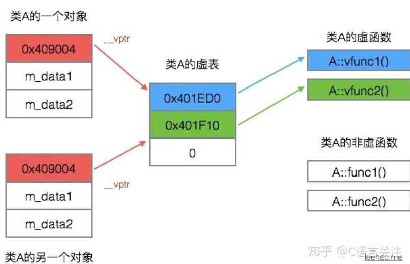

> _program = data structure + algorithm (computation+control flow)_

# 简答题

### C++程序设计语言的设计理念

- 效率
- 实用性优于艺术性严谨性
- 允许一个有用的特征比防止各种错误使用更重要（相信程序员）

### C++发展中的重要人物

- | 人                           | 成就                                                         |
  | ---------------------------- | ------------------------------------------------------------ |
  | John Backus                  | 发明了 **FORTRAN**，使得编程更贴近于问题本身 （第一个被广泛成功使用的高级编程语言） |
  | Dijkstra                     | 发明了编译器，提出 goto 有害论，创建了**结构化编程**         |
  | Kristen Nygaard              | 创建 **Simula67** （面向对象编程（OOP）的起源性语言）        |
  | Ole-Johan Dahl               | 创建 **OO** 编程                                             |
  | Dennis Ritchie、Ken Thompson | 创建 C 语言                                                  |
  | Bjarne Stroustrup            | 1980 创建 C with Classes，并最终形成 C++                     |
  | Rick Mascitti                | 发明 C++，并 1983 正式命名                                   |
  | Barbara Liskov               | 关于高层复用做出很大的贡献（里氏替换原则：子类型必须能够替换其基类型，而不破坏程序正确性） |

### C++发展的三条主要脉络

- 

- **脉络一：Algol 68 结构化编程的部分的继承**
  - *Niklaus Wirth*[瑞士]：发明了 PASCAL，适用于教学
  - *Donald E.Knuth*[高德纳]：与 Dijkstra 一同提 goto 有害性
  - C++ 继承了这部分关于**结构化编程**的特性

- **脉络二：系统化编程的继承**
  - BCPL：贴近计算机，写出高效的程序，将 IO 作为类成分而不是语言成分，以提高语言可移植性

  - *Ken Thompson*[美国，ken]：发明 B 语言
  - *Dennis Ritchie*[美国，dmr]：发明 C 语言
  - C++ 继承了这部分关于**系统编程**的特性

- **脉络三：OO 部分的继承**
  - *Kristen Nygaard*[挪威]：发明 Simula67

  - *Ole-Johan Dahl*[挪威]：最先提出 OO
  - *Barbara Liskov*[美国，女]：关于高层复用做出很大的贡献
  - C++ 继承了这部分关于面向对象编程的特性


### C与C++的关系

- 代码层面：C++ 完全包含了 C 语言成分，支持 C 支持的全部编程技巧，C 是建立 C++ 的基础，同时 C++ 还添加了 OOP 的完全支持。
- 运行：任何 C 程序都能被 C++ 用基本相同的方法编写，并具有相同的运行效率和空间。
- 功能：C++ 还引入了重载、内联函数、异常处理等功能，对 C 中过程化控制及其功能并扩充。

### C++ 编译与链接过程

- C++ 源代码想通过 cpp 预处理后再通过 Cfront 翻译成 C 语言，最后通过 C 编译器来使程序运行。

### C 和 C++ 混合编程应该注意的问题

- 名变换：如果调用 C 语言库中的函数，则需要附加 `"extern C"`，限制 C++ 编译器进行名变换，便于可以连接
- 静态初始化：C++ 静态的类对象和定义在全局的、命名空间中的或文件体中的类对象的构造函数通常在 `main` 被执行前就被调用；尽可能把主函数写在 cpp 文件当中
- 内存动态分配：C++ 使用 `new/delete`，C 使用 `malloc/free`，需要注意匹配
- 数据结构兼容：将在两种语言间传递的东西限制在用 C 编译的数据结构的范围内；这些结构的 C++ 版本可以包含非虚成员函数，不能有虚函数。
- C 语言不支持函数重载。
  - 在 C++ 中 `f(int, int)` 与 `f(int, double)` 是不同的函数，都重载了函数 `f()`；但是在 C 语言中却被认为是相同的函数。因为在编译时，C 语言给这几个函数的命名为 `f_`；而 C++ 命名分别为 `f_int_int`、`f_int_double`、`f_`，以表示区别；所以混合编程时应注意重载函数的问题；
- 在 C++ 中也允许在 `struct` 和 `union` 中定义函数，他们也具有类的基本功能，与 `class` 所不同的是，`struct` 和 `union` 的成员的默认访问控制为 `public`

### 结构化程序设计的缺点和OO的优点

* 结构化程序的缺点：
  * 数据与操作分离，代码可读性差，难以理解;
  * **代码重用**性差
* OO的优点：提高开发效率和软件质量
  * 更高层次的抽象
  * **数据封装**
  * 更好地模块化⽀持
  * 软件复用
  * 对需求变更有更好的适应性

### 结构化程序设计的基本控制结构有哪几种？

- 顺序、循环、条件

### OO设计的主要特点，为什么要采用OO？

- 主要特点：**封装**、**继承**、**多态**；通过消息传递实现程序运转
- 原因：
  * 良好的封装保护数据——隐藏细节；减少耦合；提高复用
    * 谁能拥有这些数据？——类成员函数（函数和数据封装在一起）
    * 设置逻辑上的访问权限——类访问修饰符private/public/protected
    * 在编译时控制不同权限的变量的地址的获得
  * 继承和多态抵消基于对象带来的负面影响——继承不变的部分，多态降低变化部分的副作用，提高修改效率

### 什么是ADT？

* abstract data type，用于指定逻辑特性而不指定实现细节的数据结构
* 包含一个数学模型以及定义在此数学模型上的一组操作，需要通过固有数据类型(编程语言中已实现的数据类型)来实现

### C++设计类是依附于什么原则将我们定义的成员函数定义为纯虚/虚/非虚函数

* 纯虚函数：只有函数**接口**会被继承；子类**必须继承**函数接口；（必须）提供**实现**代码

  * 有纯虚函数的类叫做**抽象类**。它不能用于创建对象，而只能用于为派生类提供框架；派生类提供抽象基类的**所有成员函数的实现**。
* 虚函数：函数接口及缺省实现代码都会被继承；子类必须继承函数接口；可以继承缺省实现代码
* 非虚函数：函数接口和其实现代码都会被继承；必须同时继承接口和实现代码

### 请给出你认为最有价值的C++程序设计应该遵守的5条原则，并分析其意义

* Guard against potential ambiguity ：_应避免设置模棱两可的继承关系，使用虚继承来解决菱形继承问题_
* Never treat arrays polymorphically ：_数组不支持虚功能，不应试图将数组视为基类的多态类型_
* Make non-leaf classes abstract：_非叶子类通常是设计中的基类，定义了其他类应实现的接口；应将这类类设为抽象类，从而不允许直接实例化，强制派生类实现其接口_
* Strive for exception-safe code：_编写异常安全的代码可以确保在异常发生时程序仍能保持一致状态，防止内存泄漏和资源损坏_
* **“RAII”**： _resources acquisition is initialization，通过在构造时获取资源，在析构时释放资源，避免了手动管理内存和其他资源带来的复杂性。_
* Use destructor to prevent resource leaks：_使用析构函数确保当对象超出作用域时，自动释放与对象关联的资源_
* use const whenever possible
* declaration before use：_变量和函数的声明应当在其首次使用之前，确保编译器能够识别它们的类型_

### 影响表达式的值的因素有哪些？

* 优先级：指表达式在不同级计算时的优先计算顺序  a+b\*c
* 结合性：在同级计算时的优先计算顺序  a+b-c
* 求值次序  (a+b)\*(a-b)
* 类型转换  int x,float y,x\*y

### 什么是引用？主要作用是什么？什么时候需要把一个函数的返回值类型定义为引用类型？如果随意将函数的返回值类型定义为引用类型会有什么危害？

* 概念：为一块已有的内存空间取一个**别名**
* 作用：避免耗费资源，提高访问效率。
* 主要用于函数参数传递和动态变量命名；返回对象本身
* 危害：如果函数返回值的类型是引用或指针类型，不应该把局部量或局部量的地址作为返回值。

### 引用类型与指针类型相比的优势在哪里？

* 引用是采用直接访问形式，指针则采用间接访问形式——**效率高**;
* 引用与被引用变量共享内存，而指针有自⼰的内存空间——**内存占用少**;
* 在作为函数参数类型时，引用类型参数的实参是一个变量，而指针类型参数的实参是一个变量的地址——代码可读性好;
* 引用类型一旦定义后不能改变，而指针变量定义后可以指向其他同类型的变量——安全；
* 大多数编译程序往往把引用类型作为指针类型来实现，它对使用者而言是透明的；

### inline函数的作用？随意使用可能导致的问题？阐述合理使用的建议

inline function告诉编译器在所有的函数调用处**直接展开**函数体，而不进行函数调用的压栈操作等，这种技术也被称为**内联展开**

* 作用：
  * 提高程序的可读性；提高程序的运行效率；可以弥补**宏定义不能进行类型检查**的缺陷
* 导致的问题：
  * 增大目标代码，因为在调用时，必须在调用该函数的每个文本文件中定义；
  * 病态换页；降低指令快取装置的命中率
* 建议：
  * 仅对使用频率较高的小段代码使用内联；
  * 在内联函数中不能含有负复杂的结构控制语句，如switch、while等；
  * 递归函数不能用来做内联函数；
  * 将内联函数的定义放到头文件中_（保证在每个文件中都能看到内联函数的定义）_；

### 给出C++中关键字const的几种使用方法，并给出实例

const可以用来修饰数据类型，指针，函数，对象等

* 修饰数据类型时，表明该数据类型在程序运行的过程中，值不应当被改变；并且声明的时候就必须进行初始化
* 修饰指针时，有3种不同的用法：“指针常量，常量指针，常量指针常量”
* 修饰函数时，有2种不同的用法：“Type f() const{}，Type f(const T & t){}”；前者表示告诉编译器不会修改常量值；后者指不修改传递的常量参数
* 修饰对象时，主要是修饰对象中成员变量；应当在构造函数中使用**成员初始化表**来对常量成员变量进行初始化_（在类的成员变量声明时，不应该初始化变量的值）_

### struct和union有何区别？

* `union` 是一种特殊的数据结构，它允许在相同的内存位置存储不同的数据类型。`union` 的大小是其成员中最大的成员的大小。其核心思想就是**共享内存**。如果某一组合体最近被写入为某一个成员变量的类型，那么就只能按这一类型读取，否则会出现未定义行为。

  * ```cpp
    union Data {
        int i;
        float f;
        char c;
    };
    
    int main() {
        Data d;
        d.i = 10;     // 当前有效成员是 i
        d.f = 3.14f; // 覆盖同一内存，此时 i 的值不再有效
    }
    ```

* `struct` 是一种用户自定义的数据类型，它可以包含不同类型的数据成员。和 `class` 一样，`struct` 也是类关键词。但 `struct` 的**默认访问权限**（成员访问和基类访问）是 `public`，而 `class` 的默认访问权限是 `private`。除此之外，`struct` 和 `class` 在 C++ 中是相同的。

* 区别：

  * 在**任何同一时刻, `union`中只存放了一个被选中的成员**（所有成员共用一块地址空间）, 而`struct`的所有成员都存在（不同成员的存放地址不同）
  * 对于`union`的不同成员赋值, 将会对其它成员**重写**, 原来成员的值就不存在了, 而对于结构的不同成员赋值是互不影响的。
  * `struct`的内存大小可能比所有成员之和要大：`struct`存在**alignment 地址对齐** _(结构体里存在padding填充 “11001100”——“烫”)_

### 函数副作用的危害是什么，以及如何消除？

* 函数副作用是指在函数执行过程中，除了返回值之外，对**外部状态**造成的任何影响_(修改全局变量、改变参数值（如果是引用或指针）、对文件进行读写、发起网络请求等)_
* 危害
  * 不可预测性：副作用使得函数的行为变得不可预测，尤其当函数依赖于或修改全局状态时，可能导致难以调试的错误
  * 可复用性降低：存在副作用的函数通常无法独立使用，因为它们依赖于外部状态，降低了代码的复用性和模块化水平
  * 并发问题：在多线程环境中，副作用可能导致数据竞争和资源争用，增加了死锁和不一致状态的风险
  * 测试和维护困难：具有副作用的函数更难单元测试，因为需要设置和恢复外部状态，增加了测试的复杂性。
* 如何避免
  * **限制全局状态的使用**：尽量避免在函数中使用全局变量，可以将需要的数据作为参数传递，这样函数的行为更容易追踪和理解。
  * **使用返回值代替修改参数**：避免在函数内部修改传入的参数，尤其是通过引用或指针。这有助于保持函数的简洁性和可预测性。
  * **常量指针**

### 静态全局变量的作用是什么？

静态全局变量在程序的整个运行期间保持有效，直至程序结束。它们在程序开始执行时被初始化，直到程序结束时才释放内存。__仅限于定义它们的文件__，其他文件无法访问这些变量，即使它们是全局变量。

* **数据隐藏**：静态全局变量可以防止名称冲突和数据泄露，因为它们的作用域局限于其定义的文件，使得变量与其他文件中的同名变量不冲突
* **状态保留/值可靠**：可以用来在函数之间保留状态。静态全局变量允许多个函数共享状态，而不必显式地传递参数
* **资源管理**：可以在函数或模块之间安全地共享资源，如缓冲区、计数器等，便于管理
* **便利性**：在模块化程序设计中，可以简化复杂模块的状态管理，使代码更加清晰易懂

### 为什么要引入模板函数？

* 泛型编程其他方法的缺点：
  * 宏实现的缺陷：只能实现简单的功能;没有类型检查;重复计算
  * 函数重载的缺陷：需要定义的重载函数太多；定义不全
  * 函数指针的缺陷：需要定义额外参数; 大量指针运算; 实现复杂; 可读性差
* 模板是 `C++` 中的一种泛型编程工具，它允许我们编写通用代码，以便在**不同的数据类型**上使用
  * 模板的基本思想是将类型参数化，使得可以在**编译前**指定类型，并由编译器自动生成实际代码
  * 还可以用来实现元编程meta programming**_(编译时静态生成代码)_**

### 为什么要引入异常处理机制？

* 往往发现异常之处与处理异常之处不一致
* 如果使用函数参数传递异常信号，程序结构不清楚；避免了不断上交现场信息

### 简述右值引用与左值引用的异同点

* 左值引用是指向一个**可被修改的对象**的引用，通常指向一个具名变量；常用于函数参数，传递大的对象（如类对象）以避免拷贝，提高性能
* 右值引用是指向一个**临时对象**（右值）的引用，通常指向不具名的临时值；常用于移动构造函数和移动赋值运算符，以高效地管理资源（如内存、文件句柄等）
* 共同点
  * 引用类型：两者都是引用，用于引用对象而不是值
  * 提高性能：两者都可以用于提高程序性能，避免不必要的拷贝
  * 基本语法相似：都可以用于定义引用类型，但语法符号不同

### C++ compiler赋予一个空类哪些成员函数？

* 构造函数，析构函数
* 拷贝赋值运算符，拷贝构造函数

  * 取址运算符重载函数

  * 移动赋值运算符，移动构造函数

  * ```cpp
          Empty();
          ~Empty();
          Empty(const Empty&);
          Empty& operator=(const Empty&);
          Empty* operator&();
          const Empty* operator&() const;
    ```

### 在C++中重用一段代码有哪两种方法？分别有什么特点？

- 在 C++ 中，重用一段代码主要有两种方法：**继承**和**组合**。
- **继承**是指通过派生类继承基类的成员和接口来实现代码重用，体现“is-a”关系。其特点是可以直接复用基类的实现，支持运行期多态，但类之间耦合度较高，继承层次固定，灵活性较差。
- **组合**是指在一个类中包含另一个类的对象作为成员，通过成员对象来复用已有功能，体现“has-a”关系。其特点是结构灵活、耦合度低、易于扩展和维护，但本身不直接支持多态，通常需要配合接口使用。

### 什么是静态绑定和动态绑定？

* 静态绑定/前期绑定：通过**模板**实现的多态
  * 发生在**编译**时刻，依据对象的静态类型进行，效率高，但灵活性差
  * 常常用于非虚函数的调用
* 动态绑定/后期绑定：通过**继承**实现的多态
  * 发生在**运行**时刻，依据对象的实际类型动态进行，灵活性高，但效率低
  * 常常用于通过基类指针或引用调用虚函数时
* C++中**默认为前期绑定**，后期绑定需显式地指出

### 多态的作用是什么？举例说明C++多态的几种表现方式？有哪些实现多态的方式？

_多态：同一论域中一个元素可有多种解释，或者同一接口在不同对象上表现出不同的行为_

* 多态的表现方式：

  * 虚函数、函数重载、操作符重载、模板、继承、函数指针

  * 可分为四类：重载多态、强制多态、包含多态和参数多态

  * > 重载多态：同一个名字，根据**参数类型或数量不同**，绑定到不同实现。
    >
    > 强制多态：通过**隐式或显式类型转换**，使不同类型以统一方式参与运算。
    >
    > 包含多态：子类型对象可以通过**基类型接口**使用，运行时表现出不同的行为。
    >
    > 参数多态：算法对类型参数**完全抽象**，对所有类型“一视同仁”。 通常由模板或泛型实现

* 作用：

  * 提高语言的灵活性;
  * 实现高层软件的复用

* 实现方式

  * `template`
  * `Overloading`：_有同名但__**参数不同**__的函数，与继承无关_
  * `Overriding`：_子类有与父类同名且__**参数相同**__的函数，在类继承中出现_
  * 操作符重载：_通过定义相关操作符的具体操作（即操作符重载函数），让自定义类的对象可以像普通内置类型的变量一样进行运算_

### 如何利用析构函数防止内存漏洞？请给出auto_ptr的基本定义、实现，及应用实例

- 对象消亡时，在系统收回他所占的存储空间之前，系统将自动调用析构函数。一般情况下不需要定义析构函数，但是如果对象在创建后申请了一些资源（_指针成员指向的空间_）并且没有归还这些资源，则应定义析构函数来在对象消亡时归还对象申请的资源

- auto_ptr:
  `auto_ptr` 是 C++ 标准库早期提供的一种**智能指针模板**（定义于 `<memory>`），用于**管理动态分配对象的生命周期**，通过 **RAII（资源获取即初始化）** 机制在对象析构时自动释放所管理的内存，从而避免内存泄漏。
  拷贝构造和赋值操作会**转移所有权**

  ```cpp
  //当一个程序有很多出口时，没有全局的garbage collection，每次new资源时都wrap成栈上资源的初始化
  template<T>
  class autoptr{
      T* ptr;
    public:
      autoptr(T* p):ptr(p); 
      ~autoptr(){delete ptr;}
  };
  ```

### 如何利用->操作符重载将堆上对象封装在栈上的自定义对象里，实现RAII？

- ```cpp
  class A{
  public:
    	void f();
    	int g(double);
    	void h(char);
  };
  
  class AWrapper{
    	A* p;
  public:
    	AWrapper(A *p){ this->p = p;}
    	~AWrapper(){ delete p;}
    	A* operator->(){ return p;}
  };
  ```

- 让栈上的对象包含一个指向堆上资源的指针，初始化时分配堆，析构时删除，实现资源获取即初始化

### 什么是纯虚函数、虚函数和非虚函数？合理定义这三种成员函数应该遵循的基本原则？给出一个实例

* 纯虚函数：只给出函数声明而没有给出函数实现的虚成员函数；形式为在虚函数后加`= 0`
* 虚函数：即在成员函数前加关键字`virtual`来标志
  * 类的成员函数才可以是虚函数
  * 静态成员函数、内联成员函数、构造函数不能是虚函数
  * 析构函数可以（往往）是虚函数
* 非虚函数：即一般的成员函数

- > ```cpp
  > struct Base {
  >  void f();                 // 非虚函数
  >  virtual void g();         // 虚函数
  >  virtual void h() = 0;     // 纯虚函数
  > };
  > 
  > Base* p = new Derived;
  > p->f();   // 调用 Base::f(),调用的是指针类型的方法(Base),不看真实类型
  > p->g();   // 调用 Derived::g(),调用的是真实类型的方法(Derived)
  > ```

### 如果虚函数是有效的，为什么不把所有函数都设为虚函数？

- 虚函数是有代价的，由于每个虚函数的对象都要维护一个**虚函数表**，因此在使用虚函数的时候都会产生一定的系统开销，这是没有必要的

### 继承层次中为什么基类析构函数是虚函数？

- 在继承层次中，当通过**基类指针或引用删除派生类对象**时，若基类析构函数不是虚函数，将只调用基类析构函数而不会调用派生类析构函数，导致**资源泄漏或未定义行为**。

### 为什么构造函数不能是虚函数？

- 虚函数采用一种虚调用的方法。虚调用是一种可以在只有部分信息的情况下工作的机制。如果创建一个对象，则需要知道对象的准确类型。
- 构造函数的目的是在对象创建时完成初始化，而不是在运行时决定调用哪个构造函数。
- 在对象的构造过程中，虚函数表尚未建立，即使构造函数被声明为虚的，编译器也无法在构造过程中正确调用虚函数

### 什么是“菱形继承问题”？继承与虚继承的区别？虚继承的构造上有什么特点

- 菱形继承是指在多重继承中，**两个派生类继承自同一个基类，而又有一个更派生的类同时继承这两个派生类**，继承关系图呈菱形结构，因此称为菱形继承。

- > ```
  >       Base
  >      /    \
  >   Derived1  Derived2
  >      \    /
  >       Final
  > ```
  >
  > `Final` 中将包含 **两份 `Base` 子对象**，分别来自`Derived1`和`Derived2`，此时访问`final.baseFunc()`会产生二义性

* 继承：一个类可以继承另一个类的属性和方法；与内嵌类在内存上相同，区别在与基类在逻辑上可以表示派生类
* 虚继承 "has a"：用**指针指向基类对象**，而不是直接拷贝到派生类
  * 用于解决多重继承中出现的**菱形继承问题**，即当一个类从两个基类分别继承自同一个基类时，会导致重复继承的问题。
  * 通过在基类前加上 `virtual` 关键字，可以虚继承该基类，以确保只存在一个基类的实例；在派生类中只存在一个基类指针，所有的继承者共享同一个基类部分。

- 虚继承下**最派生类（Final）负责构造虚基类 `Base`**，而中间类不再负责 `Base` 的构造

### 有虚函数是否就一定是动态绑定？

- 不一定：
  * 如果在类设计中，某个类的虚函数实际上没有通过**基类的指针或引用调用**，而是通过派生类直接调用，则会导致静态绑定。
  * **静态上下文中的调用**：如果在<u>编译时能够确定对象的类型</u>，编译器可以进行静态绑定_(直接通过对象名调用虚函数，或在明确的对象上下文中调用虚函数)_

### 什么是虚函数表？怎么实现的后期绑定？

- 以如下代码为例：

  ```cpp
  Base* p = new Derived;
  p->func();
  ```

  动态绑定执行流程为：

  1. 通过指针 `p` 找到对象
  2. 读取对象中的 **vptr**
  3. 通过 vptr 找到 **Derived 的 vtable**
  4. 在 vtable 中定位 `func` 对应的函数地址
  5. 调用该地址指向的函数（`Derived::func`）

  👉 函数选择发生在**运行期**，这就是后期绑定。

- 

- **对象的虚表指针用来指向自己所属类的虚表，虚表中的指针会指向其继承的最近的一个类的虚函数**

### 请分析OO中引入构造函数机制的原因，并举例说明给出控制一个类创建实例个数的手段

* 原因：成员初始化的需要

  * 类的封装性：由于访问权限控制，一部分数据是不能让外界访问的，通常不能直接赋值，所以初始化类的成员变量应该有类的成员函数来完成
  * 若使用普通成员函数，一方面需要显式地调用，使用不便，另一方面可能导致未调用初始化函数就使用对象，不安全
  * 在构造对象实例时，希望由系统自动调用，而不是⼈为的去调用，同时根据类的唯一性和对象的多样性，则使用类名作为构造函数的名字

* 可以利用_静态成员可以被所有该类的对象所共享_的性质来控制该类创建实例的个数

* ```cpp
  class singleton{ 
  protected: 
      singleton(){ } 
      singleton(const singleton &); 
  public: 
      static singleton * instance(){ 
          return m_num == 0? m_instance = new singleton:
          m_instance; 
      } 
      static void destroy() { 
          delete m_instance; 
          m_instance = NULL; 
      } 
  private: 
      static singleton * m_instance; 
      Static int m_num; 
  }; 
  singleton * singleton ::m_instance= NULL;
  ```

### 请说明new、delete、malloc、free分别在C++程序中的作用和使用场合，及他们的不同之处

* malloc/free是C/C++标准库函数，new/delete是C++运算符；他们都可以用于动态申请和释放内存
* 对于内置类型数据而言：malloc申请内存的时候要制定分配内存的字节数，而且不会做初始化；new申请的时候有默认的初始化，同时可以指定初始化；
* 对于类类型的对象而言：对象在创建的时候要自动执行构造函数，消亡之前要调用析构函数。由于malloc/free是库函数而不是运算符，不在编译器控制之内，不能把执行构造函数和析构函数的任务强加给它，因此，C++还需要new/delete。

### new/delete重载的意义是什么？

* 频繁调用系统的存储管理，影响效率
* 程序自⾝管理内存，提⾼效率

### 为什么要实现两个版本的下标运算符重载？

- 在 C++ 中需要同时提供**常量版本和非常量版本的下标运算符 `operator[]`**，是为了**保持 const 正确性（const-correctness）**，既保证常量对象不能被修改，又允许非常量对象进行读写操作。

- ```cpp
  class Array {
  public:
      // 非常量版本：可读可写
      int& operator[](size_t i) {
          return data[i];
      }
  
      // 常量版本：只读
      const int& operator[](size_t i) const {
          return data[i];
      }
  
  private:
      int data[10];
  };
  ```

### 在类的多层次继承结构中，类之间的哪些函数是按作用域规则处理的，哪些是按多态性规则处理的？

* 一般成员函数是按作用域规则处理的
* 虚函数是按多态性规则中的动态绑定处理的

### 拷贝构造函数有几个参数？有类型转换的作用吗？调用拷贝构造函数的场景有哪些？什么时候要自定义？

_如果原来对象的成员有指针，我们一般应当执行__**深拷贝**__；否则，当原对象消亡时，新对象的指针就会指向一个不存在的内存区域_

* 拷贝构造函数具有一个参数，即为该类对象的引用
* 拷贝构造函数**没有类型转换**作用_（__只有一个参数的构造函数__可以实现隐式类型转换）_
* 场景有：
  * `A b = a` **初始化赋值**时；
  * 函数**按值传参**时`func(a) `；
  * 函数**返回一个类对象**时；
* 何时自定义拷贝构造函数？
  * 申请额外资源时，避免默认的构造函数带来的悬挂指针—>**深拷贝**

### 友元函数能访问类中的保护成员吗？友元函数访问类中私有成员与成员函数访问私有成员的形式相同吗？

_友元也可能是类/类成员函数，定义在类外部，但有权访问类的所有私有（private）成员和保护（protected）成员；尽管友元函数的原型有在类的定义中出现过，但是友元函数并不是类的成员函数（因此没有this）_

* 能，相同

### 常对象可以引用非常成员函数吗？非常对象可以引用常成员函数吗？

_如果一个对象被声明为 __`const`__，那么它的__**所有成员变量**__都不可以被修改。这一对象中的成员函数，有的是可以调用的，有的不行，其区别在于__**是否修改了成员变量**__。_

* 不可以，可以

### 在类中定义了多个子对象，其构造函数调用子对象的构造函数的顺序取决于什么？

- 构造函数调用子对象的顺序取决于**定义子对象的顺序**；与构造函数的成员初始化列表中给出的子对象顺序⽆关

### 简述Lambda表达式的作用，并比较它与重载了函数调用操作符的函数对象的差别

* lambda表达式一般用于定义一些**简短**的**匿名函数**。这样可以是整个程序更加简洁且紧凑，提高可读性
* `std::sort(vec.begin(), vec.end(), [](const Item& v1, const Item& v2){ return v1.a < v2.a; });`
* 差别：
  * Lambda 表达式是一种内联的、匿名的函数，直接在作用域内定义。语法简单：`[捕获列表](参数列表) { 函数体 }`；通常更简洁且方便使用，适合短小的操作；可以通过捕获机制灵活地访问周围的变量
  * 函数对象（Functor）是一个实现了 `operator()` 的类实例。定义相对较冗长，通常需要编写一个完整的类，包括构造函数和成员函数；适用于更复杂的操作或者需要持有状态（数据）的情况；可以有多个重载的 `operator()` 更灵活地处理不同的输入

### 运算符重载使用成员函数方法和全局函数方法是否都可以？有区别的吗？

_运算符重载实际上通过函数来重新定义运算符的功能_

* 两种方法都可以；参数个数不同
  * 全局函数带有类参数；重载输出流符号**必须是全局函数**
* 返回值类型：除了重载输出流符号返回`ostream&`外；其他**按值返回**，不需要额外优化_（本就存在__返回值优化__）_

> 对于作为**成员函数**的重载运算符方法来说，存在一个隐式的第一参数（即`this`），比如说：
>
> ```
> Integer x(1),y(2),z;
> x+y	====> x.operator+(y)
> ```
>
> 此时x为**receiver**，对receiver是不做type conversion（类型转换）的，因此形如`z=3+y`的方法是错误的，因为3不会被类型转换成Integer；而`z=y+3`是可行的，因为3可以被初始化成Integer
>
> 一元的运算符重载类似，只不过不接受参数，只有一个隐式的this作为参数
>
> ```Cpp
> const Integer operator-() const{
> 	return Integer(-i);
> }
> 
> z = -x // z.operator=(x.operator-())
> ```
>
> 作为**全局函数**时，需要显式地保留所有参数（注意如果要访问类的private变量需要声明友元或者给出getter和setter）
>
> ```Cpp
> const Integer operator+(const Integer& rhs, const Integer& lhs);
> 
> z = x + y // opperator+(x, y)
> ```
>
> 此时，类型转换会发生在所有参数上，也就是说，形如`z=3+y`的函数在这里是可行的

### 什么是“五三原则”

- (三原则)如果一个类需要**自定义以下任意一个函数**，通常也需要自定义另外两个：
  1. **析构函数**
  2. **拷贝构造函数**
  3. **拷贝赋值运算符**

- (五原则)引入移动构造，如果一个类需要自定义资源管理行为，通常需要定义以下五个函数：
  1. 析构函数
  2. 拷贝构造函数
  3. 拷贝赋值运算符
  4. **移动构造函数**
  5. **移动赋值运算符**

### 什么是“野指针”？应该如何避免？

**内存泄露**指一块内存没有任何指向它的指针，那么它的位置信息也就丢失了。此时，如果程序不关闭，这一块内存就再也无法分配给其他对象，也就无法被使用了。因此，解决办法是在最后一个指向他的指针消失前，把内存释放

* **野指针**指指针指向的那块内存不可用，这很可能是因为指针没有正确初始化，或先前指向的内存区域已经被释放。
* 前者的解决办法是严格遵循 RAII 原则，后者的解决办法是**在每次 `delete`时把相应的指针全部设为 `NULL`**。
* 智能指针也可以自动管理内存，避免内存泄露和野指针的问题
  * `unique_ptr` 是**独占式**智能指针。在任意时刻**只能有一个指针拥有该资源**。可以在对象生命期结束时（例如，**超出作用域**时）自动调用析构函数
  * `shared_ptr` 是**共享所有权**的智能指针，在当最后一个持有对象的 `shared_ptr` 被销毁或被赋值为另一指针时，对象会被销毁
  * `weak_ptr` 是不拥有资源的弱引用指针，持有被 `shared_ptr` 管理的对象的非拥有性「弱」引用：当某个对象只有存在时才需要被访问，且随时可能被他人删除时，可以使用 `weak_ptr` 来跟踪该对象

### 什么是对象切片？

- **对象切片**是指在继承体系中，**用基类对象（而不是引用或指针）接收派生类对象**时，派生类中超出基类的那部分数据和行为被“切掉”，只保留基类子对象的现象。
- 解决办法：使用**基类引用或指针**，容器中存放**指针或智能指针**，或者将基类设计为**抽象类**（含纯虚函数）

### 当类中未自主定义构造函数，compiler会提供默认构造函数，Why？

* 当一个类定义时，编译器需要能够创建该类的对象，默认构造函数的存在确保了类可以被实例化，即使用户没有定义任何构造函数；
* 可以自动初始化类的成员变量：如果类的成员变量是基本数据类型（如 `int`, `float`），在默认构造函数中，它们的值未经过用户定义，可能会导致未定义的行为。编译器生成的默认构造函数会将这些基本类型的成员初始化为未定义状态（不同编译器可能有所不同），确保它们具有每个对象实例所期望的状态。
* 在 C++ 中，所有对象都有其生命周期，构造函数和析构函数负责这种生命周期的管理。自动生成的默认构造函数可以确保对象在被创建时获得有效的状态，以帮助防止潜在的错误和未定义行为。

### When构造函数、析构函数被定义为private？友元、static成员的使用，When？

* 构造函数如果用private修饰——**只能在类内创建对象**——单例模式

  ```c++
  class A{
      A(); //只能在类内创建对象
      public:
      A* getA();
  };
  
  A::getA(){
      //getA可进行权限认证，限制某些对象才能使用
  }
  
  ```

* 析构函数如果声明为private——用于强制自主控制对象存储分配在**堆**上，优化程序效率

  * 额外声明一个public的destroy函数

* 友元函数定义在类外部，但有权访问类的所有私有（private）成员和保护（protected）成员

  * 数据保护和数据存取效率之间的平衡
  * 希望在某个类中访问另一个类的**私有成员变量**，并且不希望破坏被访问类的私有性

* static成员提供了**同一个类中不同对象间共享变量**的方法；一个静态成员就是一个带有类名空间的全局变量

  * 如果我们直接把它定义为全局变量，那么就丧失了 OOP 的数据保护，还会导致**名空间污染**

### Why引入成员初始化表？ Why初始化表执行次序只与类数据成员的定义次序相关？

* 成员初始化表是构造函数的补充，减少编译器负担；执行先于构造函数体，是按照类成员的声明顺序进行初始化
  * const常量成员只能在声明的同时定义，即只能在初始化表里初始化
  * static成员只能在类外定义；static const只能在声明的同时定义
* 任何不一致的初始化顺序都可能导致不可预测的结果。规定成员的初始化顺序为类成员的声明顺序消除了这种不确定性。

### 为什么引入拷贝构造、移动构造和赋值操作符重载？

* Copy constructor：当一个对象管理动态分配的资源（例如，内存、文件句柄、网络连接等）时，需确保在拷贝对象时，分配新的资源，**避免多个对象共享同一资源**，导致资源冲突或内存泄漏
* move constructor：在处理大型对象（如容器、字符串等）时，**复制整个对象可能会消耗大量时间和内存**。移动构造函数通过转移资源，大大提高效率；避免了不必要的拷贝，直接将资源转移到目标对象
* = 操作符重载：**类似于拷贝构造函数**，赋值运算符需要防止浅拷贝，确保正确管理动态资源，在实际赋值时，需要释放原有资源，并分配新资源；还可以支持链式赋值（即a = b = c），这在许多情况下使代码更简洁和灵活

### 动态绑定是什么？C++如何实现动态绑定？何时使用虚函数？

* 动态绑定，即在**运行时根据对象的实际类型来确定调用**
* 实现动态绑定的函数就是**虚函数**。虚函数可以通过在函数声明前加 `virtual` 关键字来定义。
  * 如果基类（或派生类）的某一函数被定义为虚函数，则它的派生类对其重定义的函数**均为虚函数**。这一属性可以一直**传递**下去。
  * 虚函数在**完成构造后才会绑定**。如果在**基类构造（析构）函数内直接调用当前正在构造（析构）对象的虚函数**，则还是会调用**基类的虚函数**（派生类仍未构造完成）
  * `override` 关键字可以**明确**告知编译器当前函数是覆盖基类中的一个虚函数
  * 除了纯虚函数，虚函数可以有**默认实现**。如果派生类不重写，就会调用基类的默认实现。

* **静态、内联、构造**函数**不能**是虚函数。事实上，构造函数也没有必要是虚函数，因为它不涉及对象的指针和引用。
* 析构函数可以（也应该）是虚函数。**如果派生类申请了资源，则一定要定义虚析构函数。**

### public继承和private继承的区别？

* _public继承才是真正意义上的"is a"关系，派生类对象可以当作基类对象使用_
* 非公有继承：
  * **private 继承：**基类 public 成员，protected 成员，private 成员的访问属性在派生类中分别变成：private, private, private。简单来说派生类可以访问基类的public, protected成员，继承过来之后变成自己私有的。
  * **protected 继承：**基类 public 成员，protected 成员，private 成员的访问属性在派生类中分别变成：protected, protected, private

### 为什么= () [] -> 不能作为全局函数重载?

* = () \[] ->第一个参数是对象，对象先于其他参数；**涉及特定于对象的行为和对象内部状态访问，都应该在类内部实现**
* 全局函数主要的用处是作为类成员函数的补充，增加符号的**完备性**

### 何时成员函数能返回& ？

* 允许外部代码对类的私有成员进行直接修改
* 返回其他对象的引用，这在实现链式调用（chain calls）时很常见

### 何时以及如何重载new、delete？

* 有时针对某些系统的功能，我们希望手动管理动态内存的使用，而不使用 `C++` 内置的 `new` 和 `delete` 的内存管理。这时，可以考虑重载 `new` 和 `delete`，先一开始申请大块内存空间，然后**自行管理**。
* `new` 重载的语法是 `void *operator new (size_t *size, …)`，其中 `size` 是系统**自动计算**申请对象的**大小**，后面的变长参数列表是传给 `new` 的**其他形参**。
* `delete` 重载的语法是`void operator delete(void *p, size_t size)`，其中 `p` 是被撤销对象的**地址**，`size` 参数是可选的，代表撤销对象的**大小**。
* 同样，如果重载了 `new/delete`，那么通过 `new/delete` 动态创建该类的对象时将不再调用内置的（预定义的）`new/delete`。

### 简述 C++ 的内存管理机制。栈区、堆区、静态存储区的区别？

- C++ 采用分区内存管理，主要包括栈区、堆区和静态存储区。
- 栈区由编译器自动分配和回收，存放局部变量和函数参数，效率高但生命周期短；
- 堆区由程序员通过 `new/delete` 管理，生命周期灵活但易产生内存泄漏；
- 静态存储区用于存放全局变量、静态变量和常量，程序整个运行期间存在。

### C++ 中数组和指针的区别？如何用指针操作数组元素？

- 数组是连续内存空间的集合，大小固定；指针是变量，保存地址，可指向任意内存。
- 数组名在表达式中常退化为指向首元素的指针，但本身不是指针。
- 可通过指针算术访问数组元素，如 `*(p + i)` 等价于 `a[i]`。

### 虚函数如何实现多态？如何确保调用正确的函数？

- 虚函数通过运行期动态绑定实现多态。
- 基类声明虚函数，派生类重写，通过基类指针或引用调用时，根据对象的动态类型查虚函数表，调用对应派生类函数，从而确保调用正确实现。

### C++ 中隐式类型转换和显式（强制）类型转换的区别？

- 隐式类型转换由编译器自动完成，如整型提升、算术转换；
- 显式类型转换由程序员指定，如 `static_cast`、`dynamic_cast`。
- 显式转换更安全、可控，能避免隐式转换带来的歧义或错误。

### 拷贝构造函数与移动构造函数的区别？何时调用拷贝构造函数？

- 拷贝构造函数用于复制已有对象，移动构造函数用于“窃取”临时对象资源。
- 拷贝构造在按值传参、返回对象、用已有对象初始化新对象时被调用；
- 移动构造通常在处理临时对象或即将销毁的对象时调用，以提高效率。

### 内联函数与宏的区别？内联函数的优点和缺点？

- 宏是纯文本替换，不做类型检查；内联函数是函数，受编译器检查。
- 内联函数可避免函数调用开销，类型安全、易调试；
- 缺点是可能导致代码膨胀，且是否内联由编译器决定。

### explicit的作用是什么？解决什么问题？

- `explicit` 关键字用于修饰构造函数，用来**禁止隐式类型转换和拷贝初始化**，只允许显式构造对象。其目的是避免由于编译器自动类型转换而产生的歧义或潜在错误，提高程序的安全性和可读性。
- 被 `explicit` 修饰的构造函数仍可用于直接初始化，但不能用于参数的隐式传递或赋值初始化。

