# 大纲

| 论文题目                                                     | 代码是否开源                                | 方向         | 备注                                                |
| ------------------------------------------------------------ | ------------------------------------------- | ------------ | --------------------------------------------------- |
| **Enhanced Infrared-Visible Image Fusion Method with an ISP Based Degradation Model** | 无                                          | 数据生成     | 由高质量图源生成低质量图像对                        |
| 一种基于实测数据温差扰动的红外图像实时生成方法               | 无                                          | 数据生成     | 分块平均灰度拟合与温差扰动叠加                      |
| **PID: Physics-Informed Diffusion Model for Infrared Image Generation** | https://github.com/fangyuanmao/PID          | 数据生成     | PID：由RGB生成红外图像，加入物理规律。基于Diffusion |
| **InfraGAN: A GAN architecture to transfer visible images to infrared domain** | 无                                          | 数据生成     | 同样是生成，基于GAN                                 |
| **MWIRSTD: A MWIR Small Target Detection Dataset**           | https://github.com/avinres/MWIRSTD          | 数据生成     | 中波红外小目标检测数据集                            |
| **Infrared Image Enhancement: A Review**                     | 无                                          | 数据增强     | 可见光引导的跨模态增强                              |
| **Diff-Mosaic: Augmenting Realistic Representations in Infrared Small Target Detection via Diffusion Prior** | https://github.com/YupeiLin2388/Diff-Mosaic | 数据增强     | 使用扩散模型提高多样性与现实感                      |
| **Synthetic Data Augmentation for Infrared Small Target Detection via Exploring Frequency Components and Targets Prior** | 无                                          | 数据增强     | 在弱小、低信噪比场景下表现出更高的鲁棒性            |
| **GAN-Based Synthetic Data Augmentation for Infrared Small Target Detection** | 无                                          | 数据增强     |                                                     |
| **A real-time infrared imaging simulation method with physical effects modeling of infrared sensors** | 无                                          | 红外传感模拟 | 纯理论                                              |
| **Scene simulation and modeling of InfraRed search and track sensor for air-borne long range point targets** | 无                                          | 红外传感模拟 | 等效辐射模型计算物理信息                            |
| **Multiview angle UAV infrared image simulation with segmented model and object detection for traffic surveillance** | https://github.com/microsoft/AirSim         | 红外传感模拟 |                                                     |
| **A Lightweight Real-Time Infrared Object Detection Model Based on YOLOv8 for Unmanned Aerial Vehicles** | 无                                          | 红外目标检测 |                                                     |

# 关键词

- **数据扩增：Data Augmentation**

  **数据生成：Data Generation**

- **数据增强：Data Enhancement**

- **红外传感模拟：Infrared Sensor Simulation （重点）**

- **红外目标检测：Infrared Object Detection**

# 文章

## 1. [A real-time infrared imaging simulation method with physical effects modeling of infrared sensors - ScienceDirect](https://www.sciencedirect.com/science/article/abs/pii/S1350449516302456)

### 1.1 引言

提出了一种实时红外成像方法，通过考虑实际红外成像系统的完整物理过程，重现红外成像链的各个环节。**旨在实现仿真精度与实时渲染之间的最佳平衡。**

### 1.2实时红外成像仿真流程

**零距离辐射建模**：通过建立热平衡方程，可以求解目标的温度场和辐射场。

**大气传输建模**：红外辐射会根据大气条件受到影响，主要对红外辐射产生衰减作用。

**红外传感器建模**：主要用于**模拟红外传感器在信号转换和空间传输过程中引入的不同效应**。红外传感器主要包括光学系统、探测器系统和信号处理系统。因此，应**模拟**这些系统中信号响应过程和信号空间传输的典型**物理效应**，如光学系统的衍射和像差效应、探测器系统的时域/空域滤波效应和空间采样效应，以及信号处理系统的线性滤波和信号传递效应。此外，红外传感器的时域噪声（主要由探测器系统产生）会对实际红外图像造成干扰。

**松耦合结构**

### 1.3 红外传感器效应建模框架

1. **光学系统（Optical System）**
   - 空间域：渐晕（边缘光衰减）、几何畸变（镜头变形）
   - 频域：衍射（光波干涉）、像差（透镜缺陷）
2. **探测器系统（Detector System）**
   - 空间域：运动模糊、噪声、非线性效应
   - 频域：时空滤波（信号平滑处理）
3. **信号处理系统（Signal Processing System）**
   - 空间域：灰度量化（像素值数字化）
   - 频域：高频提升（锐化轮廓）、CCD信号转换

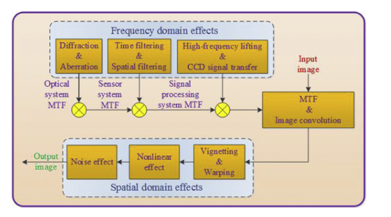

**红外探测器信号响应的非线性特性**

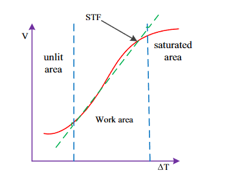

红外探测器**仅在有限温差范围（Work Area）内保持线性响应**

### 1.4 改进卷积法

## 2. [Infrared Image Enhancement: A Review](https://ieeexplore.ieee.org/document/10817543)

### 2.1 引言

系统性地梳理了红外成像技术的应用背景、技术瓶颈及解决方案。文章首先指出红外成像在夜间、雨雾等恶劣环境下相比可见光成像具有显著优势，且成本低于雷达技术，因此在军事侦察、医疗诊断、工业检测及农业监测等领域应用广泛。然而，红外图像普遍存在纹理细节缺失和分辨率低的问题，主要源于红外波长较长导致的衍射极限、目标与环境热辐射相互干扰产生的"重影效应"，以及大气中水分子对红外辐射的吸收散射（图1通过辐射能量组成和大气衰减过程示意图说明该问题）。为突破此局限，论文全面回顾了近年来的红外图像增强技术进展。

### 2.2 红外增强方法

在方法论层面，研究将现有技术归纳为五大类：

**传统方法**基于经典图像处理理论，包括直方图均衡化（通过灰度分布调整提升对比度）、滤波处理（分离基座层与细节层以抑制噪声）、小波变换（图4展示通过多尺度分解分别增强低频对比度与高频细节）、二维经验模态分解（自适应分解图像为模态函数）和Retinex理论（通过反射分量建模恢复纹理信息）；

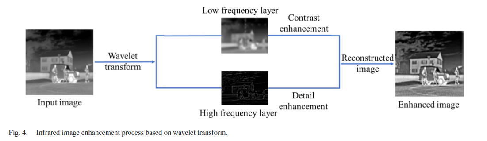

**深度学习方法**利用数据驱动策略，涵盖CNN（通过卷积核提取局部特征）、Transformer（基于自注意力机制捕获全局上下文）和GAN（展示生成器与判别器对抗训练框架）等架构，其中成像机理驱动的方法将物理模型与网络结合，从源头优化纹理恢复；

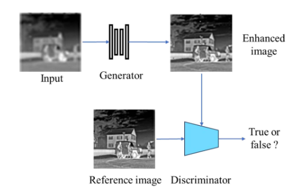

**传统与深度学习结合方法**如小波分解与网络协同处理不同频率分量，兼顾稳定性与特征提取能力；

**可见光引导方法**（展示跨模态引导流程）通过融合可见光图像的丰富纹理信息补充红外图像缺失的细节，采用注意力机制或特征对齐解决模态差异问题；

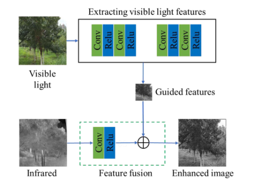

**任务驱动方法**针对特定场景（如弱小目标检测）设计自适应特征增强模块。

### 2.3 红外图像数据集和定量指标

基于**无人机**的红外图像数据集

**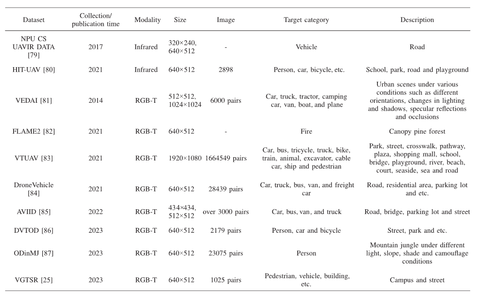**

不同场景下拍摄的**单模态**红外图像（非无人机）

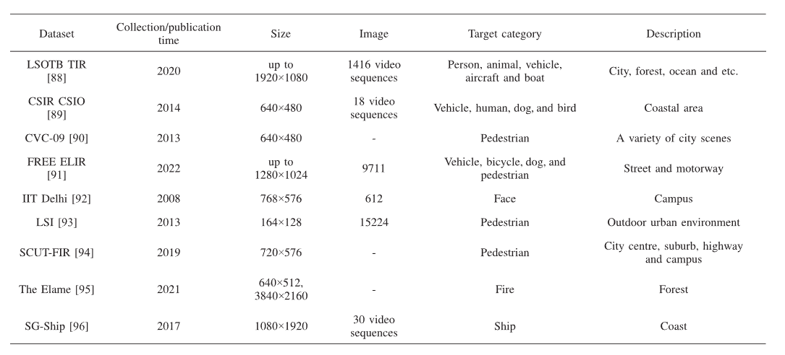

不同场景下拍摄的**多模态**红外图像（非无人机）

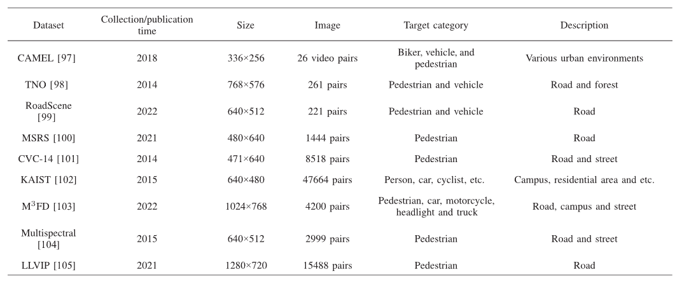

**无参考**图像质量评价指标

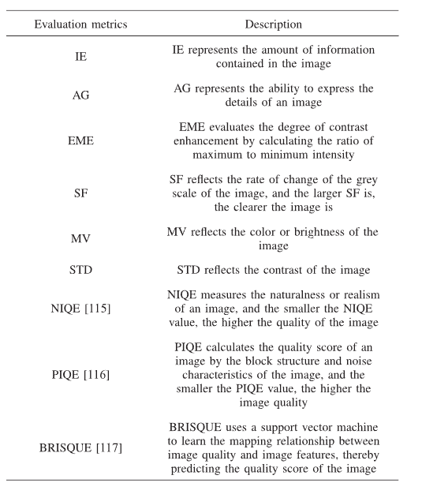

**全参考**红外图像增强评价指标

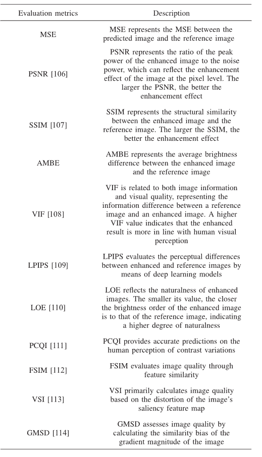

### 2.4 实验

在ODinMJ和VGTSR数据集上的实验表明：可见光引导的SwinFuSR方法在纹理增强方面表现最优（定性对比显示其输出最接近真实高分辨率图像），而小波变换表现出最强的泛化能力（量化对比其跨数据集稳定性）。Transformer和GAN分别在细节重构和训练稳定性方面各具优势。

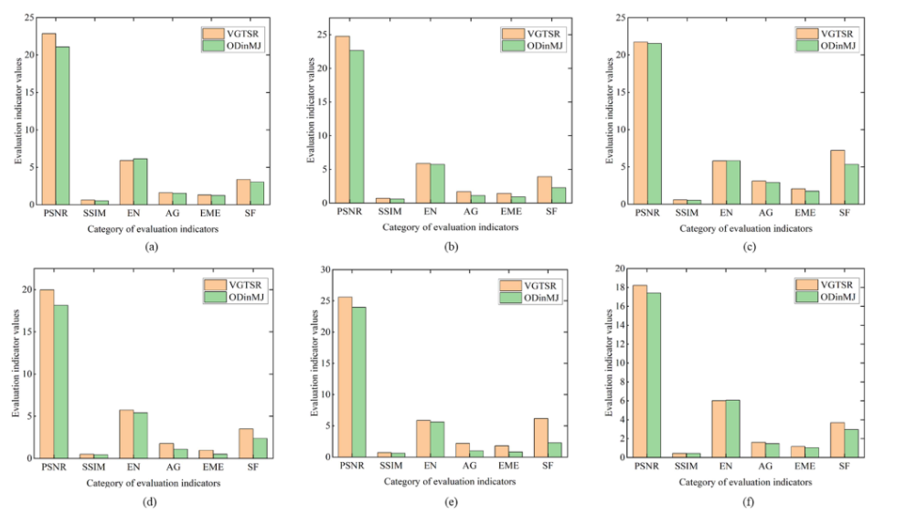

## 3. [一种基于实测数据温差扰动的红外图像实时生成方法](http://hwjs.nvir.cn/cn/article/id/hwjs201710008)

### 3.1 引言

本文旨在提出一种**实时性强**且**逼真度高**的红外图像生成方法，通过利用实测数据并关联环境温度，快速生成不同时段（特别是不同温度条件下）的红外图像。

### 3.2 算法核心

**关键假设：** 对于同一材质，其红外图像区域的平均灰度值代表该区域的整体辐射水平（与温度强相关），而区域内各像素点灰度值与平均灰度的**差值（即温差扰动）** 分布特性可近似认为不随时间变化。

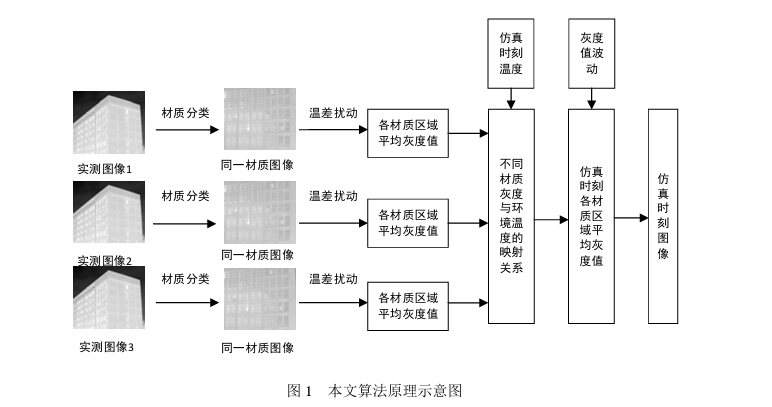

- 核心思想：
  - **材质分割：** 首先对目标场景（本文以建筑物为主）的红外图像进行材质分类（如墙面、屋顶、窗户、树木/草丛等）。文中采用成熟的**K均值聚类算法**进行分割，因其适用于灰度图像且计算简便。
  - **区域平均灰度与环境温度关联：** 获取一系列不同时刻（不同环境温度下）的实测红外图像。对每个材质区域，计算其**平均灰度值**。分析该区域的平均灰度值序列与环境温度序列之间的关系，并进行**曲线拟合**，建立平均灰度值与环境温度的映射模型。
  - **温差扰动保留：** 计算每个材质区域内各像素点灰度值与当前时刻该区域平均灰度的**差值（扰动）** 。
  - 实时生成新时刻图像：
    - Step 1: 固定区域划分（对不同时刻图像保持相同分割）。
    - Step 2: 对每个区域，计算其在不同实测图像中的平均灰度值`G_1a`和对应的灰度扰动`G_1a(i,j) = f_1a(i,j) - G_1a`。
    - Step 3: 利用多幅图像同一区域的平均灰度值`G_a`与对应时刻的环境温度进行**拟合**，得到灰度-温度关系曲线。
    - Step 4: 根据拟合曲线和**仿真时刻的环境温度**，预测该区域在仿真时刻的**平均灰度值`G_b`**。
    - Step 5: 生成仿真时刻该区域的灰度图像：`G_b(i,j) = G_b + G_1a(i,j)`。即使用预测的新平均灰度值`G_b`加上最近一次实测图像的**灰度扰动**`G_1a(i,j)`。
    - Step 6: 对所有区域重复步骤2-5，组合得到完整的仿真时刻红外图像。

### 3.3 结论

通过将图像区域平均灰度与环境温度直接关联，并用分块计算代替逐像素计算，显著提高了运算速度，满足了实时仿真需求。利用实测数据的温差扰动信息，并结合温度-灰度映射关系，生成的红外图像**逼真度高**，目标与背景具有与实测图像相同的温度变化趋势。

## 4. [Scene simulation and modeling of InfraRed search and track sensor for air-borne long range point targets](https://ieeexplore.ieee.org/document/9581635)

### 4.1 引言

针对现代红外搜索跟踪（IRST）系统的复杂性，本文提出了一种简化的红外场景生成模型。该模型专注于**空中远程点目标探测**，旨在解决传感器、目标、背景及大气环境交互的模拟难题。IRST系统通常需要在宽视场（FOR）内持续扫描，传统方法难以高效处理此类场景的实时建模需求。

### 4.2 理论模型

这篇文章的核心理论目的是：**建立一个可以模拟“空中红外搜索与跟踪系统”（IRST）的场景生成模型**。这个系统用来发现很远处的小目标，比如远处的飞机或导弹。由于这些目标太小、太远，在红外图像中几乎只是一个“点”，所以需要特别设计的模拟方法来生成这种场景，以便研究和测试。

文章主要包含以下几个理论部分：

   1. **背景建模（Background Modeling）**

   - 背景就是目标所处的大环境，比如天空、地面、海面等。
   - 为了模拟真实情况，作者使用**真实红外图像**作为背景素材，这些图像来自卫星或空中平台拍摄。
   - 背景图像经过处理，比如亮度调整、大气效应叠加等，使其更贴近真实红外环境。

   2. **目标建模（Target Modeling）**

   - 点目标指的是在图像中看不出形状、只是一个发光点的远距离目标（如远处导弹）。
   - 为了模拟目标的红外特征，作者使用了**物理辐射模型**，来计算目标在红外波段的能量。
   - 这涉及几个因素：
     - 目标的表面温度；
     - 目标的尺寸（虽然小，但仍有实际面积）；
     - 与传感器的距离；
     - 光线穿过大气的过程（会被削弱或吸收）。

   3. **传感器建模（Sensor Modeling）**

   - 红外传感器并不是“看得见一切”，它有自己的性能限制，比如探测灵敏度、视场角（FOV）、帧率等。
   - 作者在仿真中引入了这些参数，比如红外波段范围（例如3~~5μm 或 8~~12μm）、分辨率、背景噪声等。
   - 这样可以模拟目标在“红外相机”中出现的真实模样，而不是理想状态。

   4. **场景融合（Scene Composition）**

   - 作者将“真实背景”与“模拟目标”叠加到一起，生成完整的图像序列（仿真视频）。
   - 这就相当于你在一张真实天空照片上叠加一个用红外模型计算过的“热点”，但这个热点是按物理原理生成的，不是随便画上去的。

   5. **大气模型（Atmospheric Transmission）**

   - 模拟过程中使用了**大气传输模型**，这是用来模拟红外信号在空气中传播的变化。
   - 因为在现实中，红外辐射在传输过程中会被水汽、尘埃等吸收或散射，必须考虑进去，否则目标会“太亮”或“太假”。

### 4.3 模型验证

1. **背景距离影响**

模拟5-40公里云层辐射变化（固定大气传输系数），显示距离增加导致背景强度衰减：

- **5公里**：高杂波干扰
- **40公里**：目标信噪比显著提升

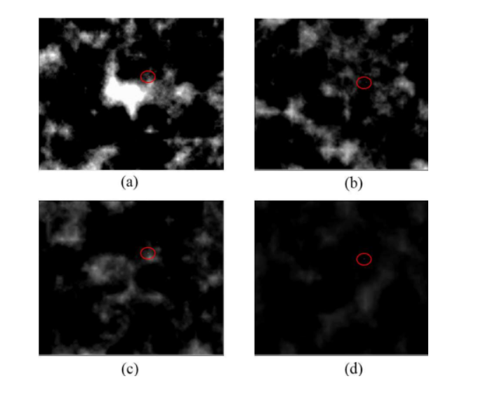

2. **扫描机制实现**

水平扫描（10°/s）生成8帧序列覆盖60°方位角，验证FOR动态构建能力：

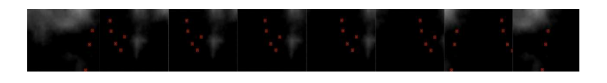

3. **目标跟踪演示**

GNN算法在双目标交叉场景中成功维持轨迹关联：

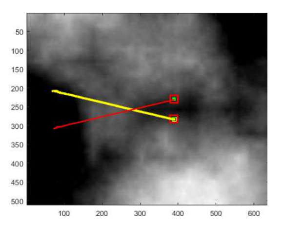

## 5. [Enhanced Infrared-Visible Image Fusion Method with an ISP Based Degradation Model](https://ieeexplore.ieee.org/document/10898110)

### 5.1 引言

红外与可见光图像融合技术在计算机视觉领域具有重要应用价值，旨在整合不同传感器的互补信息生成高质量融合图像，为后续目标检测等任务提供支持。然而，实际应用中源图像常受低亮度、低对比度、噪声污染和目标模糊等退化因素影响，导致融合效果显著下降。现有方法面临关键瓶颈：缺乏成对的低质量源图与高质量融合图作为训练数据，制约了深度学习模型的性能提升。

### 5.2 核心方法

本研究提出一种创新性的图像处理流水线（ISP）逆向退化模型，通过反转ISP标准流程中的关键步骤，并融入多类型退化因素，实现**从高质量源图生成逼真的低质量图像对**。该模型设计包含五阶段退化流程：

1. **亮度退化**：仅作用于可见光图像，通过乘性系数降低整体亮度，模拟光照不足场景。
2. **反向伽马校正**：削弱图像对比度，采用随机强度参数增强数据多样性。
3. **噪声注入**：融合高斯噪声与量化噪声。
4. **模糊退化**：随机选择核类型以模拟光学系统失焦或运动模糊。
5. **反向色调映射**：逆转ISP的色调优化过程，恢复原始场景的动态范围失真。

### 5.3 实验验证

研在LLVIP（暗环境数据集）、M3FD（多场景数据集）和Road Scene（道路监控数据集）上进行了系统验证。通过11项客观指标（如边缘强度、信息熵、噪声抑制度等）和视觉对比分析，证明该方法显著超越主流模型：

- **定量结果**：在LLVIP数据集上9项指标领先，其中边缘强度提升85%（64.76 vs 34.93），标准差提升75%（57.72 vs 32.96）；在M3FD数据集10项指标登顶，细节保留度提升28%（5.10 vs 3.97）。消融实验证实退化模型对各项指标均有正向贡献。
- **视觉提升**：如图2所示，该方法在LLVIP数据中显著优化行人轮廓与垃圾桶纹理，消除模糊伪影；图3展示M3FD场景的文本标识锐化效果，轮胎结构完整保留；图4呈现道路场景中栏杆与路标的自然对比度增强。相较于现有方法，融合图像表现出更均衡的亮度分布、更精细的细节保留和更低的噪声干扰。

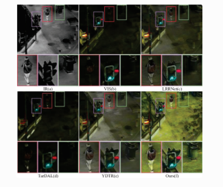

> 验证暗光环境下行人轮廓与物体纹理的优化效果

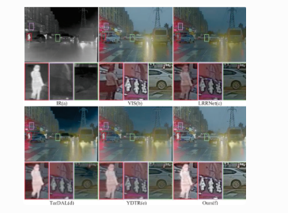

> 展示文本标识与轮胎结构的细节保留能力

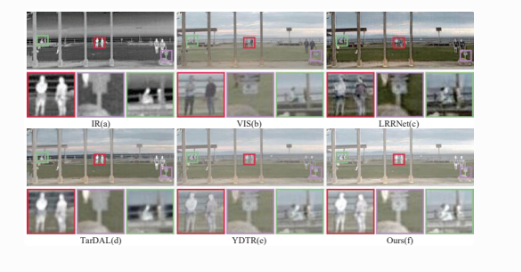

> 体现道路场景中结构物的自然对比度增强

## 6. [PID: Physics-Informed Diffusion Model for Infrared Image Generation](https://arxiv.org/abs/2407.09299)

### 6.1 引言

本文针对可见光至红外图像转换任务中物理规律缺失的问题，提出了一种基于物理约束的扩散模型（PID）。传统方法如生成对抗网络（GAN）和变分自编码器（VAE）常将红外图像视为风格迁移结果，忽略其内在物理规律（如热辐射特性），导致生成图像在真实场景应用中存在偏差。例如，现有方法可能违反基础热力学原理——如图1所示，EGGAN生成的图像错误地呈现树木比行驶车辆温度更高的非物理现象。为突破这一局限，PID创新性地将红外物理定律融入潜在扩散模型（LDM）训练框架。

> PID 的任务是：**从 RGB 图像生成一个真实、物理合理的红外图像。**优势在于：加入了物理模型，学习热的本质规律

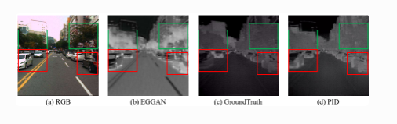

方法的核心在于**物理约束的集成机制**。受TeX方法启发，作者提出TeV分解理论，将红外图像解耦为温度（T）、发射率（e）和热纹理（V）三个物理量，建立光谱积分模型

> 假设我们想从一张 RGB 图中生成一个人站在太阳下的红外图。如果只模仿“红外风格”，可能只是把画面染红，腿暗、脸亮。但通过 TeV 分解，模型能理解“脸部因为直射阳光温度高，衣服因为遮阳温度低”，同时区分皮肤与衣服发射率不同，从而生成物理上更可信的图像。

### 6.2 实验

实验在KAIST、FLIR和VEDAI三个红外数据集验证PID的有效性。如表1所示，在KAIST数据集上，PID-f8(s=20)相较最优GAN方法（InfraGAN）显著提升SSIM（0.8097 vs 0.76）并降低FID（44.81 vs 222.96）。尤其在夜间场景（图4），PID成功克服低照度干扰，生成符合热辐射规律的行人轮廓，而EGGAN因物理失准产生冷区伪影。跨数据集测试中，PID在FLIR夜间数据（图5）准确刻画轮胎摩擦生热等细节，且在近红外的VEDAI数据集（图6）保持细节生成优势，证明其波长泛化能力。

消融实验揭示了物理约束的关键作用：当移除LRec或LTeV时，FID指标分别恶化约20%（表5）。图8进一步可视化TeV分量的物理对齐效果——CycleGAN虽视觉相似，但其温度场与真实物理量（如行人热辐射）存在显著差异，而PID的分量分布与真实红外图像高度一致。值得注意的是，损失权重比例（*k*1=50,*k*2=5）可平衡生成质量与过拟合风险。

尽管PID在长波红外数据表现优异，其在近红外数据提升有限（表3），表明TeV分解对波长特性敏感。未来研究需优化物理约束的普适性，并降低扩散模型的计算开销。本工作首次将热力学定律嵌入生成模型，为红外成像的物理一致性设定了新标准，对自动驾驶、机器人感知等需精确热辐射建模的领域具有重要应用价值。

## 7. [InfraGAN: A GAN architecture to transfer visible images to infrared domain](https://www.sciencedirect.com/science/article/pii/S0167865522000332#sec0008)

###  7.1 简介

这篇论文提出了一种名为 **InfraGAN** 的生成对抗网络架构，旨在将普通可见光图像自动转换为相应的红外图像，以弥补大多数领域缺乏配对红外图像数据集的问题。作者构建了一个生成器–判别器结构，其中生成器采用 U-Net 样式的编码器-解码器网络来从 RGB 图像学习红外热辐射特征，而判别器不仅判断整张图像的真实性，还在像素级别上对图像进行细致鉴别，从而提高生成图的局部结构真实性。为了进一步增强结果质量，模型引入结构相似性（SSIM）作为附加损失函数，使生成图在整体结构上更接近真实红外图。通过在三个数据集上的比较，InfraGAN 在结构相似性等五项评估指标上都领先于此前的 Pix2Pix 和 ThermalGAN 方法，特别是在 VEDAI 数据集上，SSIM 提升了约 16%，比 ThermalGAN 高出 8%。该研究表明，InfraGAN 成功将红外图像域建模加入判别阶段、并结合结构度量，实现了更逼真、更具信息价值的可见光→红外图像翻译，为依赖红外图像训练的计算机视觉任务（如目标检测与监控）提供了实用且高效的数据增强手段。

### 7.2 InfraGAN和PID

| 对比维度         | **InfraGAN**                     | **PID**                                |
| ---------------- | -------------------------------- | -------------------------------------- |
| **理论基础**     | 图像风格迁移 + 对抗学习          | 扩散概率模型 + 物理建模                |
| **建模重点**     | 更关注图像外观和视觉结构         | 更关注热物理机制（温度、发射率）       |
| **输入输出关系** | RGB 图 → 红外图（学像素）        | RGB 图 → 红外图（学温度+物理场）       |
| **可解释性**     | 结果像红外图，但无法解释为什么热 | 结果物理可解释（热是怎么来的）         |
| **生成质量控制** | 借助判别器 + SSIM 等结构损失     | 融合 TeV 分解 + 物理损失函数约束       |
| **技术深度**     | 图像层面风格迁移                 | 高阶潜在空间建模 + 热辐射建模          |
| **应用场景**     | 适用于简单数据增强、红外图伪造   | 适用于红外仿真、模拟训练、物理可信生成 |

## 8. [Edge-YOLO: Lightweight Infrared Object Detection Method Deployed on Edge Devices](https://www.mdpi.com/2076-3417/13/7/4402)

### 8.1 Edge-YOLO简介

Edge-YOLO致力于解决红外目标检测在边缘设备部署的三大瓶颈：

1. **算力约束突破**：针对嵌入式设备（如车载平台、安防终端）有限的计算资源，重构轻量化网络架构
2. **实时性保障**：消除传统模型（如YOLOv5）在红外场景的延迟问题，实现毫秒级响应
3. **环境适应性**：克服红外图像固有的低对比度、噪声干扰及条状目标（行人/自行车）特征模糊等挑战

## 9. [Diff-Mosaic: Augmenting Realistic Representations in Infrared Small Target Detection via Diffusion Prior](https://ieeexplore.ieee.org/document/10542973)

### 9.1 引言

*近期，研究者们提出了多种深度学习方法，旨在精准检测具有形状模糊、纹理不显著特征的红外目标。由于红外数据集的多样性有限，训练出具备良好泛化能力的深度学习模型面临挑战。为扩充红外数据集，研究者采用数据增强技术，通常通过融合不同数据集的图像来生成新图像。然而，这些方法存在两方面不足：在真实性层面，基于混合方法生成的图像缺乏真实感，难以有效模拟复杂的现实场景；在多样性层面，相较于真实世界场景，从其他数据集迁移知识本质上存在多样性局限。当前，扩散模型作为一种创新性生成方法脱颖而出。经过大规模训练的扩散模型具备强大的生成先验能力，可对图像进行真实世界建模，从而生成多样化且逼真的图像。本文提出 Diff-Mosaic——一种基于扩散模型的数据增强方法。 该模型通过扩散先验有效缓解了数据增强方法在多样性和真实性方面的挑战。具体而言，我们的方法包含两个阶段：首先引入名为像素先验（Pixel-Prior）的增强网络，通过像素协调生成高度协调且逼真的马赛克图像；第二阶段提出扩散先验（Diff-Prior）增强策略，利用扩散先验对真实场景中的图像进行建模，进一步提升图像的多样性和真实感。大量实验表明，我们的方法显著提升了检测网络的性能。*

### 9.2 简介

该研究提出了一种名为 Diff‑Mosaic 的双阶段数据增强框架，旨在弥补红外小目标检测数据集在真实性和多样性上的不足。第一阶段，作者设计了 Pixel‑Prior 网络，它通过对“马赛克”形式拼接混合图像进行像素级协调，提升图像拼接后的视觉一致性，使红外图在目标周围的纹理衔接自然且不突兀。第二阶段，Diff‑Prior网络引入预训练的潜在扩散模型（Latent Diffusion Model），利用扩散模型强大的真实场景先验，对上述图像进行深度增强，通过逐步去噪恢复和生成现实感更强的视觉效果，从而极大提高数据的多样性与逼真度。实验结果表明，在NUDT-SIRST和SIRST等红外小目标检测数据集上，使用 Diff‑Mosaic 增强后的训练数据明显提升了检测模型的性能，IoU、检测概率等指标均显著高于传统混合增强方法；特别是在 SIRST 数据集上的检测概率接近 100%，并且误报率显著降低。此外，文章公开了 MIT 许可的代码仓库，便于社区复现与扩展 。总的来说，Diff‑Mosaic 探索了将扩散先验引入红外图像增强的路径，不仅实现了更高的图像真实性，也显著提升了红外小目标检测的精度和可靠性。

### 9.3 核心流程

**马赛克拼接增强（Pixel-Prior）**

作者先把多个图像拼起来，比如把一个图像中间的小目标（比如远处的热飞机）剪下来，贴到另一张图上。
 这种拼接本身很粗糙，容易看出来是“P 上去的”。所以他们设计了一个叫 **Pixel-Prior** 的模型，让目标和背景“融合得自然”，比如修补边缘、调整亮度、模糊过渡，让它看起来不像贴上去的，而是“本来就在那”。

**扩散模型修图（Diffusion Prior）**

拼接完之后，这张图虽然更丰富，但可能还有点“不真实”或细节不够丰富。
 这时候，作者再用一个预训练的扩散模型（可以理解成一个“AI 修图师”），对图像进行**去噪重绘**。这个过程就像让 AI 一点点修改照片，加入真实纹理、热光感、背景细节等。最终生成的图像比真实图还真实，目标融入得非常自然。

**传统增强方法**可能只是简单复制粘贴或旋转图像，容易让模型“背答案”，但实际检测时就容易出错。

**Diff-Mosaic**先让拼接的图自然，然后用扩散模型增强细节和真实感，让模型“见过更多复杂情况”，自然更聪明。

## 10. [Synthetic Data Augmentation for Infrared Small Target Detection via Exploring Frequency Components and Targets Prior](https://ieeexplore.ieee.org/document/10687546)

### 10.1 简介

本文提出了一种基于频率成分分析与目标先验知识的红外小目标检测数据增强方法。红外小目标具有信号弱、尺寸小、与背景对比度低等特点，因此常规的数据增强手段（如旋转、裁剪或直接拼接）难以生成真实有效的训练样本。为了解决这一问题，作者设计了一个双分支的图像合成框架，分别在频域和空域两个层面进行建模。首先，在频域增强方面，方法将真实红外图像进行高低频分解，提取出小目标的典型频率分布特征，再通过频率合成的方法将目标嵌入背景图中，以保留目标的真实物理结构和细节。其次，在空域增强中，方法利用目标先验（即目标的形状、强度分布、空间分布特征等）控制目标在合成图像中的位置、大小与热特征，从而生成更贴近实际红外成像规律的合成数据。此外，为避免合成图出现突兀过渡，作者还设计了多尺度边缘融合策略，使目标与背景过渡更自然。

### 10.2 实验与验证

实验结果表明，该增强方法不仅能有效提升红外小目标检测算法的精度，尤其在弱小、低信噪比场景下表现出更高的鲁棒性，而且合成数据还能显著提高训练集的多样性，增强模型的泛化能力。与多种现有方法相比，该方法在多个公开红外小目标数据集（如 SIRST 和 IRSTD）上均取得了更优的检测性能。综上，本文从频率建模与先验设计两个角度创新性地构建了一个实用的红外图像增强框架，为解决真实红外小目标样本稀缺问题提供了新思路。

## 11. [Multiview angle UAV infrared image simulation with segmented model and object detection for traffic surveillance](https://www.nature.com/articles/s41598-025-89585-x)

### 11.1 技术路线

该研究基于开源的 AirSim 平台，提出了一套改进的 UAV 红外图像模拟方法，旨在低成本、高效率地生成多角度、多目标的交通监控红外图像数据。

作者首先通过 3ds Max 构建了包含行人、自行车、汽车、公交车等七类交通目标的细分 3D 模型，每个模型依据材质和热分布被拆分为多个区域，如汽车的发动机、车身和车窗等，然后在 Unreal Engine 中还原真实场景并导入 AirSim。通过对各区域依据物理红外辐射模型（如玻尔兹曼或普朗克定律）计算灰度值，并添加适量噪声，生成更具细节和物理正确性的红外图像 。最终构建了名为 IR‑TSS 的多角度 UAV 交通红外图像数据集，并进一步提出 EfficientNCSP‑Net 检测模型，该模型在这一数据集上的 mAP₅₀ 超过 96%，相较 YOLOv10、RT‑DETR 等现有方法展现出更优的目标检测性能。

### 11.2 实验

实验结果显示，新方法在近距离红外仿真中提升了目标细节表现，而目标检测模型也成功识别多类交通对象，验证了模拟方法在实用场景下的有效性。作者指出，尽管仍有灰度渐变等细节模拟上的不足，但该工作为 UAV 红外模拟与交通监控目标检测提供了一个可扩展、低成本且具参考价值的完整方案 。

## 12. [A Lightweight Real-Time Infrared Object Detection Model Based on YOLOv8 for Unmanned Aerial Vehicles](https://www.mdpi.com/2504-446X/8/9/479)

### 12.1 LRI-YOLO简介

该研究提出了一种名为 **LRI‑YOLO** 的轻量级实时红外目标检测模型，专门针对无人机（UAV）平台的资源受限环境进行了优化。作者以 YOLOv8n 为基础，对网络结构进行了多处轻量化改造：在主干网络的 C2f 模块中引入部分卷积（PConv）和点卷积（PWConv），同时用最大池化（Max Pooling）替代常规卷积进行下采样，以保留更多特征信息；检测头则采用组卷积（GConv）替代普通卷积，极大提升了推理速度。此外，文中还将二元交叉熵损失 (BCELoss) 替换为他们提出的 EMASlideLoss，通过关注难分类样本来增强分类能力。这一系列结构简化使得模型参数减少了约 46.7%、FLOPs 降低约 53.1%，同时在 HIT‑UAV 高空红外人车检测数据集上实现了 94.1% 的 mAP，检测速度在只使用 CPU 的中端硬件上达到了 42 FPS，显著高于其他主流模型。

LRI‑YOLO 的优势不仅在于速度，更在于平衡了**轻量化与精度**。作者在仅使用 CPU 的环境下完成实时检测，体现出其高实用性。而在 GPU 上测试，其达到 231 FPS 的速度也展示了该模型在实际部署中的潜力。总之，LRI‑YOLO 为在 UAV 等资源受限平台上部署红外检测系统提供了一套结构高效、性能稳定的解决方案，特别适用于实时侦察、巡检与监控等应用场景。

### 12.2 类似工具

**Edge-YOLO**：解决传统模型计算量大且模型庞大，难以部署在边缘设备上的问题
**LFIR-YOLO**：提升夜间交通场景中红外目标检测的精度
**YOLO-SRMX**：专为无人机红外图像设计的轻量化实时检测框架，降低计算成本
**Light-YOLO**：轻量化船舶小目标检测模型 ，针对海上目标

**TBC-Net**：基于语义约束的红外小目标实时检测器，从红外图像中提取小目标以及在训练过程中对提取的目标图像进行分类
**EFLNet**：单帧红外小目标检测，提出了一种增强特征学习网络（EFLNet），解耦目标与背景并采用自适应机制调整损失权重
**UIU-Net**：将微型 U-Net 嵌入到更大的 U-Net 主干网络中

# 引用

[A real-time infrared imaging simulation method with physical effects modeling of infrared sensors - ScienceDirect](https://www.sciencedirect.com/science/article/abs/pii/S1350449516302456)

[Infrared Image Enhancement: A Review | IEEE Journals & Magazine | IEEE Xplore](https://ieeexplore.ieee.org/document/10817543)

[李敏, 解鸿文, 徐中外, 邢宇航. 一种基于实测数据温差扰动的红外图像实时生成方法[J]. 红外技术, 2017, 39(10): 914-919.](http://hwjs.nvir.cn/cn/article/id/hwjs201710008)

[易诗, 周思尧, 沈练, 朱竞铭. 基于增强型轻量级网络的车载热成像目标检测方法[J]. 红外技术, 2021, 43(3): 237-245.](http://hwjs.nvir.cn/article/id/e58223a9-7347-4fab-828d-663b93eaa92f)

[Scene simulation and modeling of InfraRed search and track sensor for air-borne long range point targets | IEEE Conference Publication | IEEE Xplore](https://ieeexplore.ieee.org/document/9581635)

[Enhanced Infrared-Visible Image Fusion Method with an ISP Based Degradation Model | IEEE Conference Publication | IEEE Xplore](https://ieeexplore.ieee.org/document/10898110)

[PID: Physics-Informed Diffusion Model for Infrared Image Generation](https://arxiv.org/abs/2407.09299)

[InfraGAN: A GAN architecture to transfer visible images to infrared domain - ScienceDirect](https://www.sciencedirect.com/science/article/pii/S0167865522000332#sec0008)

[Edge-YOLO: Lightweight Infrared Object Detection Method Deployed on Edge Devices](https://www.mdpi.com/2076-3417/13/7/4402)

[Diff-Mosaic: Augmenting Realistic Representations in Infrared Small Target Detection via Diffusion Prior | IEEE Journals & Magazine | IEEE Xplore](https://ieeexplore.ieee.org/document/10542973)

[Synthetic Data Augmentation for Infrared Small Target Detection via Exploring Frequency Components and Targets Prior | IEEE Conference Publication | IEEE Xplore](https://ieeexplore.ieee.org/document/10687546)

[Multiview angle UAV infrared image simulation with segmented model and object detection for traffic surveillance | Scientific Reports](https://www.nature.com/articles/s41598-025-89585-x)

[A Lightweight Real-Time Infrared Object Detection Model Based on YOLOv8 for Unmanned Aerial Vehicles](https://www.mdpi.com/2504-446X/8/9/479)
