# **[An Infrared Sequence Image Generating Method for Target Detection and Tracking](https://www.frontiersin.org/journals/computational-neuroscience/articles/10.3389/fncom.2022.930827/full)**

（分析基于deeppaper.ai生成）

## 研究问题

本文旨在解决以下问题：

- **红外序列图像数据匮乏问题：** 深度学习训练红外目标检测和跟踪模型需要大量红外序列图像，但真实红外图像获取成本高昂。
- **传统仿真方法真实性不足问题：** 传统的红外图像仿真方法难以保证数据的真实性，无法满足深度学习模型训练的需求。
- **现有方法无法灵活编辑目标和轨迹的问题：** 现有的基于深度学习的红外图像生成方法无法根据需要添加红外目标，也无法编辑飞行轨迹和姿态，这限制了红外目标数据集的生成。

## 方法

本文提出了一种结合真实红外图像和模拟3D红外目标的新型红外数据仿真方法，主要步骤如下：

- **红外背景拼接：** 将真实红外图像拼接成全景图像，作为仿真背景，避免了复杂的地物红外建模。
- **红外目标建模：** 基于红外辐射理论，对3D飞机的尾喷管、蒙皮和尾焰等关键部位进行红外特性模拟，生成具有真实红外辐射特征的目标。
-  **Unity3D融合：** 基于 Unity3D 引擎，将背景和目标融合，并提供飞行轨迹编辑工具，可以自由编辑飞机轨迹和姿态，生成丰富的多目标红外数据。
-  **实验验证：** 通过主观视觉分析和客观算法性能测试，验证了生成图像的真实性和有效性。使用了两个算法（Tianjun et al., 2019; Xianbu et al., 2019）在真实红外数据和模拟数据上进行测试，并比较了准确检测率 (Acc)、正确检测率 (Corr)、漏检率 (Miss) 和误报率 (FA) 等指标。

## 关键结果

本文的主要研究结果和贡献包括：

- **提出了一种结合真实背景和模拟目标的红外数据生成方法：** 该方法能够生成具有高真实性的多目标红外仿真数据，避免了复杂的地物红外建模问题。
-  **实现了基于Unity3D的红外场景融合和目标编辑：** 该方法可以自由添加飞机类型和数量，编辑飞机轨迹和姿态，生成丰富的多目标红外仿真数据。
-  **验证了生成数据的有效性：** 实验结果表明，生成的仿真图像在视觉上与真实红外图像相似，并且在目标检测算法性能方面与真实红外图像表现出一致性。
-  **为深度学习模型提供训练和测试样本：** 该方法可以为红外目标检测和跟踪的深度学习模型提供训练和测试样本。

## 深度解析

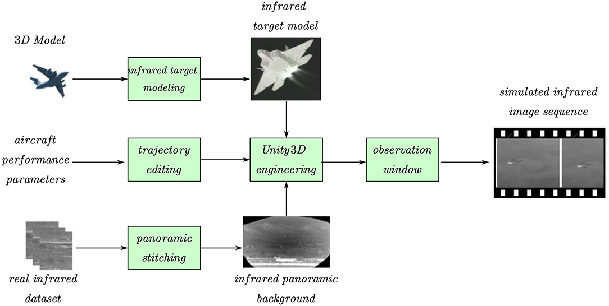

```
│   ├── 处理层
│   │   ├── 核心算法
│   │   │   ├── 3D目标红外辐射建模
│   │   │   │   ├── 尾喷管辐射模型
│   │   │   │   │   └── 基于普朗克定律，考虑温度和材料辐射率
│   │   │   │   ├── 飞机蒙皮辐射模型
│   │   │   │   │   └── 考虑大气环境温度和摩擦生热
│   │   │   │   └── 尾焰辐射模型
│   │   │   │       └── 考虑喷注气体温度和压力
│   │   │   └── 基于Unity3D的融合
│   │   │       └── 将3D目标和全景背景融合
│   │   └── 处理流程
│   │       ├── 建立3D模型
│   │       ├── 建立红外辐射模型
│   │       ├── 全景图拼接
│   │       ├── 轨迹编辑
│   │       └── Unity3D融合
```

# [Infrared Dim and Small Target Sequence Dataset Generation Method Based on Generative Adversarial Networks](https://www.mdpi.com/2079-9292/12/17/3625)

## 研究问题

本文旨在解决红外微弱小目标检测中数据集覆盖不足和实际拍摄成本高昂的问题。核心研究问题是：如何利用生成对抗网络（GANs）生成高质量的红外微弱小目标序列数据集，以有效扩展图像数据，为红外小目标检测和识别算法提供测试集，并提高基于深度学习的红外微弱小目标检测的准确性和效果。具体包括：
\* 如何生成逼真的红外天空背景图像？
\* 如何模拟红外小目标的特征，并将其与背景图像合理融合，生成包含目标运动参数变化的序列图像？
\* 生成的数据集能否有效提升现有深度学习模型的检测精度？

## 方法

本文采用基于生成对抗网络（GANs）的方法生成红外微弱小目标序列数据集，具体步骤如下：
\* **红外天空背景生成：** 使用改进的深度卷积生成对抗网络（ISD-DCGAN），通过ResNet残差模块和Wasserstein距离损失函数，提升模型训练的稳定性和生成图像的质量，生成256x256的红外天空背景图像。
\* **红外小目标模型创建：** 使用3ds Max软件建模飞机和导弹等目标，并添加热源效果，模拟目标的红外辐射强度。
\* **目标-背景图像序列构建：** 基于改进的条件生成对抗网络，结合多尺度特征提取和融合机制以及注意力机制，将目标和背景图像进行合成，并根据目标的空间位置和大小等约束参数，生成合理的序列图像。U-net结构被用于生成器，跳跃连接技术被用于保留原始图像信息。
\* **数据集标签生成：** 使用LabelImg工具手动标注目标区域，生成数据集标签。
实验部分，作者使用生成的20,000个数据集，以及MDvsFA数据集，分别训练Dense Nested Attention Network (DNANET), Attention-Guided Pyramid Context Network (AGPCNet) 和 Interior Attention-Aware Network (IAANET)模型，并在SIRST数据集上进行测试，以验证生成数据集的有效性。使用结构相似性指数度量 (SSIM) 评估生成图像的质量。

## 关键结果

本文的主要研究结果如下：
\* 提出了基于ISD-DCGAN的红外天空背景生成方法，通过引入ResNet残差模块和Wasserstein距离，有效提升了生成图像的质量和训练稳定性。实验结果表明，改进后的网络结构能够更好地收敛到稳定状态。
\* 提出了基于改进的条件GAN的目标-背景图像序列构建方法，通过多尺度特征提取和融合以及注意力机制，实现了目标与背景的合理合成，并模拟了目标运动过程中的参数变化。
\* 生成的数据集具有较高的结构相似性（SSIM）与真实红外图像，表明生成的数据集具有较高的质量。
\* 使用生成的数据集训练深度学习模型，在SIRST数据集上的测试结果表明，与使用MDvsFA数据集训练的模型相比，检测精度有所提升，验证了生成数据集的有效性。例如，使用生成的数据集训练的IAANET模型，目标检测率Pd从0.642提升到0.705，虚警率Fa从0.811降低到0.753。
总而言之，本文提出的方法能够有效地生成高质量的红外微弱小目标序列数据集，为红外目标检测领域提供了新的数据来源，并有助于提升现有深度学习模型的检测性能。

## 深度解析

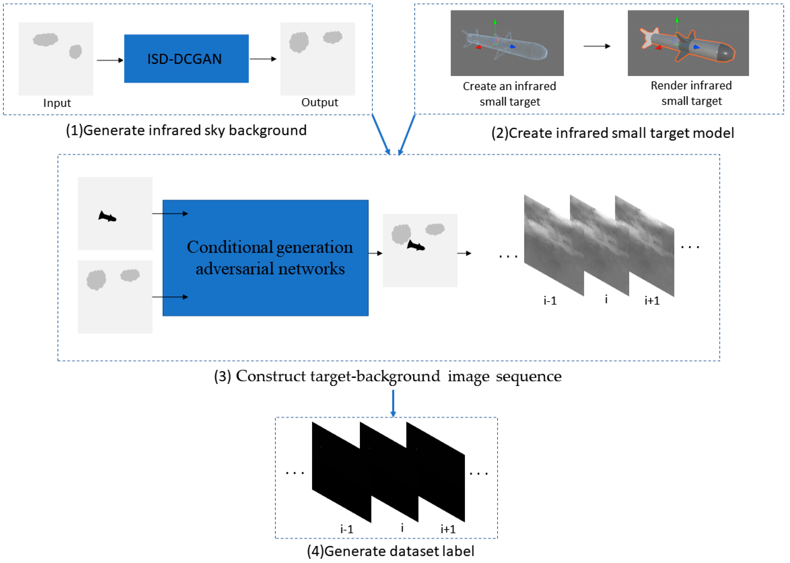

```
处理层
│   │   ├── 核心算法
│   │   │   ├── 改进的深度卷积生成对抗网络 (ISD-DCGAN) (Improved Deep Convolutional Generative Adversarial Network)
│   │   │   └── 改进的条件生成对抗网络 (Improved Conditional Generative Adversarial Networks)
│   │   └── 处理流程
│   │       ├── 1. 使用ISD-DCGAN生成红外天空背景图像 (Generating infrared sky background images using ISD-DCGAN)
│   │       ├── 2. 使用3ds Max创建红外小目标模型 (Creating infrared small target models using 3ds Max)
│   │       ├── 3. 通过改进的条件GAN，将目标和背景融合，生成目标-背景图像序列 (Fusing target and background using improved conditional GAN to generate target-background image sequences)
│   │       └── 4. 使用LabelImg工具手动标注数据集 (Manually labeling the dataset using LabelImg)
```

# [**THERMAL TEXTURE GENERATION AND 3D MODEL RECONSTRUCTION USING SFM AND GAN**](https://isprs-archives.copernicus.org/articles/XLII-2/519/2018/isprs-archives-XLII-2-519-2018.pdf)

## 研究问题

本研究旨在解决红外图像中特征点缺失和传感器分辨率低导致的难以自动生成3D模型的问题。核心目标是提出一种新方法，利用可见光图像，结合运动结构重建(Structure from Motion, SfM)流程和生成对抗网络(Generative Adversarial Networks, GAN)，生成具有热纹理的逼真3D模型。
\* 如何利用可见光图像生成具有热纹理的逼真3D模型，克服红外图像的局限性？
\* 如何改进GAN的训练方法，使其能够更有效地进行可见光图像到热红外图像的转换，并避免生成不真实的伪影？

## 方法

该研究提出了一种新的流程，包括以下步骤：
\* **数据收集：** 使用FLIR ONE PRO相机收集包含2000对可见光和红外图像的数据集，涵盖人、猫、狗、汽车、建筑物五个类别。
\* **3D模型生成：** 使用可见光图像，通过SfM流程生成稀疏点云和稠密点云，并使用AgiSoft Photoscan软件进行处理。
\* **GAN训练：** 使用pix2pix框架，并对其进行改进，包括修改U-Net生成器架构和设计新的损失函数。
\* **迭代训练方法：** 提出一种迭代训练方法，在传统的GAN训练流程中引入“专家”角色，通过手动选择前一轮生成的非真实热图像作为负样本，提供给判别器网络，从而提高判别器的性能。
\* **热纹理生成：** 将可见光图像输入训练好的生成器网络，生成热纹理，并将其应用于3D模型。
\* **模型评估：** 使用真实红外图像的测试集，通过计算均方根误差(Root Mean Square Error, RMS)评估生成的热图像质量。同时，使用PASCAL VOC 2012数据集评估生成器的泛化能力，并通过视觉检查评估合成图像的质量。

## 关键结果

该研究的主要发现和贡献包括：
\* 提出了一种新的基于SfM和GAN的3D模型生成方法，能够利用可见光图像生成具有逼真热纹理的3D模型。
\* 提出了一种改进的GAN训练方法，通过引入“专家”角色和负样本，提高了GAN在可见光到热红外图像转换任务中的性能，降低了热图像重建误差。实验结果表明，相较于传统的pix2pix方法，该方法在汽车、房屋、人类等类别上均取得了更低的RMS误差（例如，汽车类别的RMS误差从18.191降低到14.740）。
\* 构建了一个包含2000对可见光和红外图像的数据集，为热图像合成和相关研究提供了数据基础。
\* 验证了该方法在3D模型生成和热纹理生成方面的有效性，生成的3D模型和热纹理在热辐射率和几何形状上都与真实模型相似。Škoda Fabia模型的RMS误差为8 ADU，Citroën C3模型的RMS误差为6 ADU。

## 深度解析

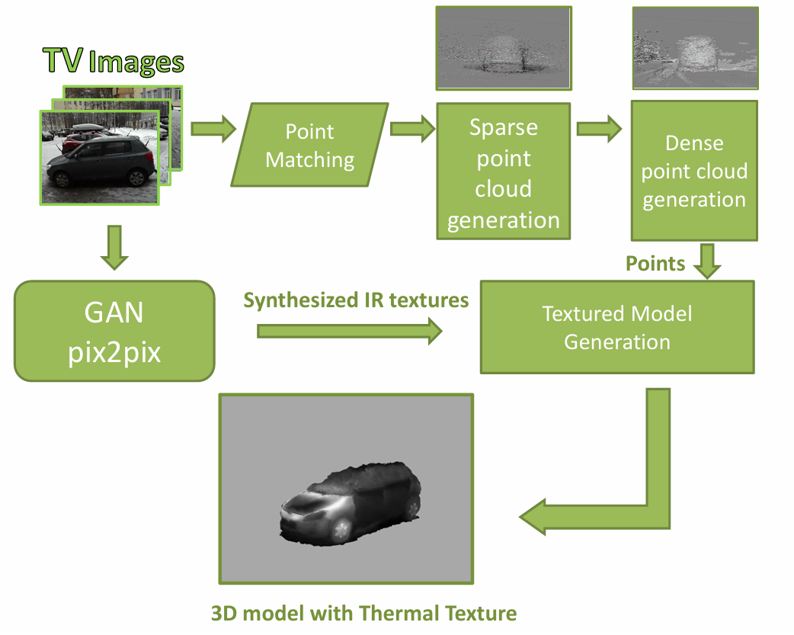

```
│   ├── 处理层
│   │   ├── 核心算法
│   │   │   ├── SfM (Structure from Motion)
│   │   │   │   └── 使用 Agisoft Photoscan 软件生成稀疏和稠密点云 (generate point pairs, a sparse point cloud, and a dense point cloud)
│   │   │   └── ThermalGAN
│   │   │       ├── 生成器 (Generator): 基于 U-Net 的改进版本 (modified version of the U-Net)
│   │   │       ├── 判别器 (Discriminator): 基于 PatchGAN 分类器 (based on PatchGAN classifier)
│   │   │       └── 损失函数 (Loss function): 改进的 GAN 损失函数 L_GAN3 (modified loss function L_{GAN3})
│   │   └── 处理流程
│   │       ├── 可见光图像用于 SfM 生成点云 (Visible images for SfM point cloud generation)
│   │       └── 可见光图像输入 ThermalGAN 生成热红外图像 (Visible images input to ThermalGAN for thermal image generation)
```

# [A real-time aircraft infrared imaging simulation platform - ScienceDirect](https://www.sciencedirect.com/science/article/pii/S0030402612007218#:~:text=PRISM (Physically Reasonable Infrared Signature Model) has been,model based on the first law of thermodynamics.)

## 温度场模型（Section 4.2）

温度场模型用于实时计算飞机表面温度分布，基于热平衡方程和有限元方法思想，通过GPU顶点着色器实现。

- **核心公式**：
  $$
  q_o+q_i−εσ(T_s^4−T_{amb}^4)=q_{cv}+\frac{T_s−T_e}{R_NA_N}
  $$
  

  其中对流热传递 *q**c**v* 定义为：
  $$
  q_{cv}=\frac{0.332Re^{1/2}Pr^{1/3}λ(T_s−T_{aw})}{x}
  $$
  

  求解方法：牛顿迭代法（Newton iterative method）。

- **变量解析**：

  |   变量    | 类型 |             描述             |                           取值方法                           |
  | :-------: | :--: | :--------------------------: | :----------------------------------------------------------: |
  |   $T_s$   | 输出 |           表面温度           | 通过迭代求解输出，初始值从纹理图像获取（基于离线计算的初始温度）。 |
  |   $q_o$   | 输入 | 发动机热源到达内表面的热能量 | 由发动机当前工作状态决定（如转速、功率），通过环境参数设置。 |
  |   $q_i$   | 输入 |    周围大气环境的辐射能量    | 从环境参数获取（如太阳辐射、大气温度），在仿真中作为外部输入。 |
  |    $ε$    | 参数 |         表面辐射效率         |                   固定为0.65（文档指定）。                   |
  |    $σ$    | 常数 |     Stefan-Boltzmann常数     |                标准值（5.67 × 10⁻⁸ W/m²K⁴）。                |
  | $T_{amb}$ | 输入 |           环境温度           |           从环境参数设置（如飞行高度、气候条件）。           |
  | $T_{aw}$  | 输入 |          绝热壁温度          |      与环境温度相关，计算基于气流状态（如速度、压力）。      |
  |   $Re$    | 输入 |          Reynolds数          | 从飞行状态获取（如速度 *v*、空气密度 *ρ*、特征长度 *x*，公式 *R**e*=*μ**ρ**vx*)。 |
  |   $Pr$    | 输入 |          Planck常数          |             标准值（空气约0.7），或从温度计算。              |
  |    $λ$    | 输入 |         空气导热系数         |              从温度计算（标准值约0.024 W/mK）。              |
  |    $x$    | 输入 |     目标长度（特征长度）     |                从几何模型获取（如顶点距离）。                |
  |   $T_e$   | 输入 |      发动机内部热源温度      |             由发动机模型提供（如工作状态参数）。             |
  |   $R_N$   | 输入 |           等效热阻           |               从材料属性获取（如热传导系数）。               |
  |   $A_N$   | 输入 |           等效面积           |                从几何模型计算（子网格面积）。                |

- **取值方法总结**：

  - **环境依赖变量**：如 $T_{amb}$, $R_e$, $P_r$, $λ$ 通过飞行状态和环境参数实时输入（如速度1.8 Mach时，对应高温区域）。

  - **模型参数**：*ε*=0.65 固定；其他常数使用标准物理值。

  - **实现细节**：温度场通过纹理图像（VTF技术）存储初始值，GPU顶点着色器实时迭代求解。温度值编码为颜色值，用于后续辐射计算。

  - 相关图片：温度模型实现流程（Fig.4）展示GPU处理流程，紧邻公式描述。

    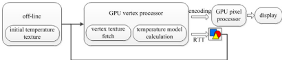

## 零距离红外辐射模型（Section 4.3）

零距离辐射模型计算飞机在探测器方向的红外辐射，包括自辐射、反射辐射和方向辐射，通过GPU像素着色器实现。

- **自辐射公式**：

  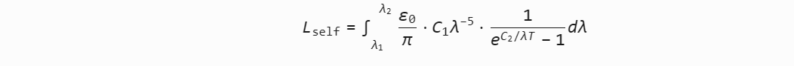

  简化近似公式（误差 <1%）：

  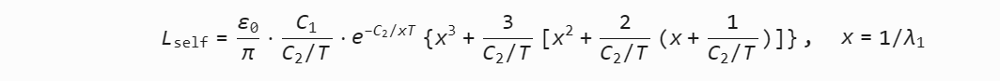

- **反射辐射公式**：

  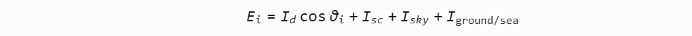

  其中子公式：

  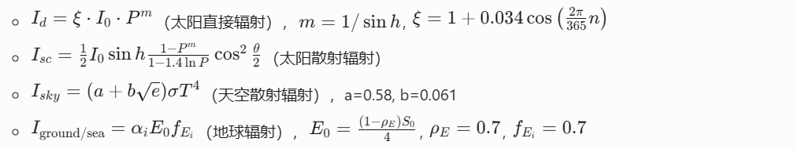

- **探测器方向辐射公式**：

  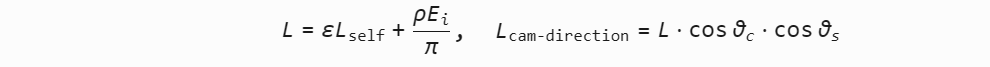

- **变量解析**：

  |        变量         | 类型 |             描述              |                       取值方法                        |
  | :-----------------: | :--: | :---------------------------: | :---------------------------------------------------: |
  |     $L_{self}$      | 输出 |          自辐射强度           |         从温度 *T* 计算，输入来自温度场模型。         |
  |        $E_i$        | 输出 |          总入射辐射           |              综合太阳、天空和地球辐射。               |
  | $L_{cam-direction}$ | 输出 |        探测器方向辐射         |             最终输出，用于大气模型输入。              |
  |        $ε_0$        | 输入 |            发射率             |             材料属性（如金属取0.8-0.9）。             |
  |         $T$         | 输入 |             温度              |           从温度场模型获取（如顶点温度）。            |
  |      $λ_1,λ_2$      | 参数 |           红外波段            |           探测器波段（3-5 μm 或 8-12 μm）。           |
  |      $C_1,C_2$      | 常数 |           辐射常数            | 标准值（*C*1=3.7418×10−16W m2, *C*2=1.4388×10−2m K)。 |
  |        $I_0$        | 常数 |           太阳常数            |                      1353 W/m²。                      |
  |         $P$         | 输入 |          大气透明度           |               环境参数（如气候模型）。                |
  |         $h$         | 输入 |          太阳高度角           |                  从时间和位置计算。                   |
  |       $θ_i,θ$       | 输入 |      太阳入射角和平面角       |           几何计算（顶点法向和太阳方向）。            |
  |         $e$         | 输入 |           水蒸气压            |                 大气参数（如湿度）。                  |
  |        $α_i$        | 参数 |           吸收系数            |                    固定或经验值。                     |
  |         $ρ$         | 参数 |            反射率             |          假设与 *ε*0 相关（如 *ρ*=1−*ε*0）。          |
  |      $θ_c,θ_s$      | 输入 | 角度（法向-探测器连线和视线） |     从几何模型实时计算（顶点位置和探测器位置）。      |

- **取值方法总结**：

  - **波段相关**：*λ*1,*λ*2 根据应用需求设置（如军事探测用8-12 μm）。
  - **环境变量**：如 *P*,*h*,*e* 从大气模型或环境参数输入。
  - **经验参数**：a, b, *ρE*, *fEi* 固定（文档指定值），简化实时计算。
  - **实现细节**：在GPU像素着色器中计算；背景辐射（如太阳辐射）在CPU预处理。温度值从颜色值解码。

## 大气传输模型（Section 5）

大气传输模型模拟大气对红外辐射的衰减和路径辐射，使用MODTRAN软件作为外部模块，结合GPU实时处理。

- **核心公式**：

  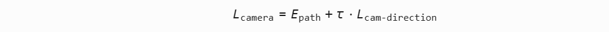

  其中 *E*path 和 *τ* 由MODTRAN计算。

- **变量解析**：

  |       变量        | 类型 |           描述           |               取值方法                |
  | :---------------: | :--: | :----------------------: | :-----------------------------------: |
  |   $L_{camera}$    | 输出 |     到达探测器的辐射     |       最终输出，用于成像系统。        |
  |    $E_{path}$     | 输入 |         路径辐射         |    由MODTRAN计算（基于大气参数）。    |
  |        $τ$        | 输入 |        大气透射率        | 由MODTRAN计算（基于距离和大气条件）。 |
  | $L_cam-direction$ | 输入 |        零距离辐射        |          从零距离模型获取。           |
  |       距离        | 输入 |    探测器到目标的距离    |       实时几何计算（如2 km）。        |
  |     大气参数      | 输入 | 如温度、湿度、气溶胶模型 |  环境设置（如热带模型、海洋系数）。   |

- **取值方法总结**：

  - **MODTRAN依赖**：*E*path 和 *τ* 通过MODTRAN计算；初始化阶段（>500 ms）处理大气参数（如地理模型、气溶胶），迭代阶段（~20 ms）处理位置参数。
  - **实时处理**：位置参数实时发送到MODTRAN线程；大气参数变化时使用上一帧数据避免延迟。
  - **典型值示例**：如热带模型（15°N）τ=0.276，北温带冬季（60°N）τ=0.967（Table 1）。

## 红外成像系统模型（Section 6.1）

成像系统模型模拟探测器效应，包括能量损失、渐晕和噪声，通过OGRE Composer框架实现。

- **能量损失公式**：

  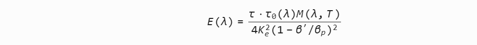

- **渐晕效应公式**：

  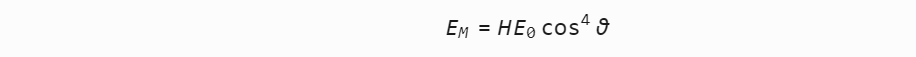

- **噪声效应公式**：
  高斯噪声模型：

  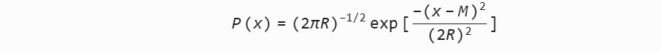

  最终像素输出：

  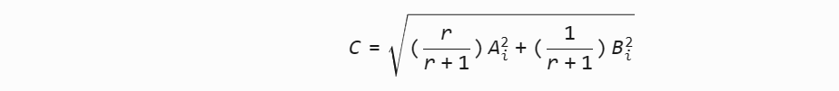

- **变量解析**：

  |   变量    | 类型 |         描述         |              取值方法               |
  | :-------: | :--: | :------------------: | :---------------------------------: |
  |    $E$    | 输出 | 辐照度（能量损失后） |     输入为辐射强度 *L*camera。      |
  |   $E_M$   | 输出 |     渐晕后辐照度     |     输入为 *E*0（轴心辐照度）。     |
  |    $C$    | 输出 | 最终像素值（噪声后） | 输入为信号电压 *A* 和噪声电压 *B*。 |
  | $τ_0(λ)$  | 参数 |     光学系统衰减     |   传感器硬件特性（固定或查表）。    |
  |   $K_e$   | 参数 |       有效光阑       |     传感器参数（如孔径大小）。      |
  | $β^′,β_p$ | 参数 |      光学放大率      |          传感器模型提供。           |
  |    $H$    | 参数 |     离轴渐晕系数     |          经验值（如0.8）。          |
  |    *θ*    | 输入 |        入射角        |       几何计算（光轴方向）。        |
  |    *M*    | 参数 |     噪声平均电压     |     高斯分布均值（硬件相关）。      |
  |    *R*    | 参数 |      噪声标准差      |     高斯分布方差（硬件相关）。      |
  |    *r*    | 参数 |        信噪比        |       传感器特性（如10:1）。        |

**取值方法总结**：

- **传感器参数**：如 *τ*0,*Ke*,β′ 从硬件模型获取（预设值）。
- **噪声实现**：使用噪声纹理（Fig.7）动态生成高斯噪声；纹理坐标随机偏移。
- **伪彩渲染**：电压值归一化到[0,1]，通过一维纹理（Fig.8）映射到颜色。

# PRISM 模型

## **PRISM模型：物理合理的红外特征建模**

**1. 核心原理**

PRISM（**Physically Reasonable Infrared Signature Model**）是一种**基于热力学第一定律的表面温度场预测模型**（文档Section 2），其核心思想为：

- 热节点网络法：将目标表面离散为节点网格，每个节点通过热平衡微分方程描述能量交换：

  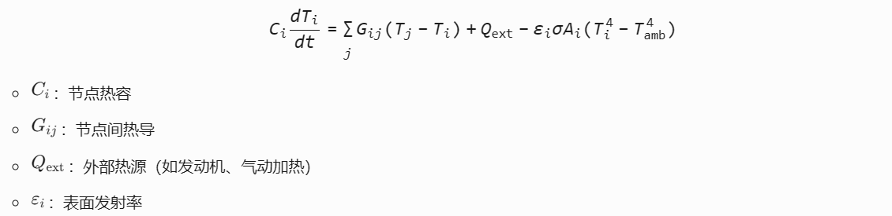

- 参数输入：

  - 物体材质属性（导热系数、比热容）
  - 环境参数（气温、风速、太阳辐射）
  - 大气条件（湿度、云层）

**2. 在本文中的技术映射**

- **温度场求解基础**：本文Section 4.2的CFD有限元方法借鉴了PRISM的热节点思想，但将顶点作为计算单元（而非网格节点）。
- **实时性优化**：PRISM依赖CPU求解微分方程（计算耗时），本文通过GPU顶点着色器并行化（文档Fig.4）。

**3. 验证与应用**

- **实验验证**：通过实测数据验证坦克、飞机等目标的红外特征（文献Fig.3-5）。
- **局限性**：计算效率低，难以满足实时仿真需求（>分钟级/帧）。

# Small Aircraft Infrared Radiation  Measurements Supporting the Engine  Airframe Aero-thermal Integration

### **红外辐射基础理论**

1. **辐射源分类**
   - 机体热部件辐射（引擎排气、蒙皮）
   - 环境辐射反射（日光、天空光、地面辐射）
   - 气动加热效应

2. **核心物理定律**

   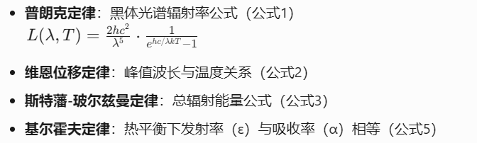

   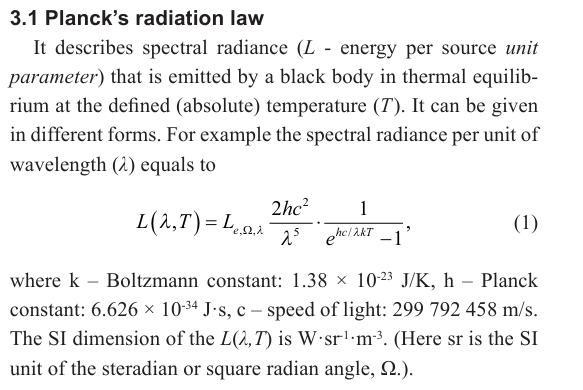

   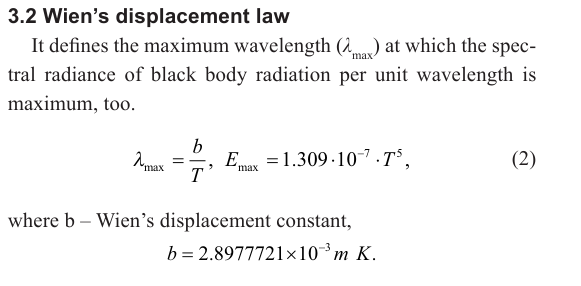

   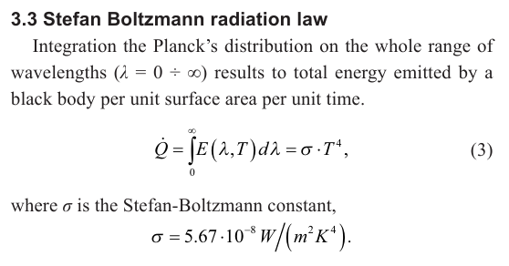

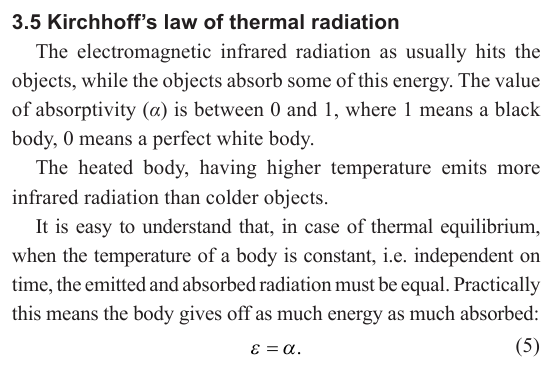

# MuSES

[MuSES | ThermoAnalytics](https://thermoanalytics.com/muses)