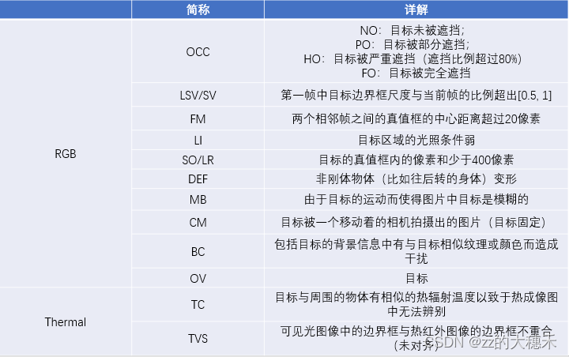

# 1. KAIST

[KAIST行人数据集](https://github.com/SoonminHwang/rgbt-ped-detection)总共包括95328张图片，每张图片都包含**RGB彩色图像**和**红外图像**两个版本。总共包含103128个密集注释。数据集分别在白天和晚上捕获了包括校园、街道以及乡下的各种常规交通场景。图片大小为640×480。数据集总共分为12个文件夹set00-set11。前6个文件夹为训练集包含50187张图片，后6个文件夹为测试集包含45141张图片。

数据集的标签中包含person、people和cyclist三个类别。比较好区分的个体则被标注为person，不太好分辨的多个个体则被标注为people，骑行的人则被标注为cyclist。当标注的时候，连我们标注者都分不清那块区域到底是行人还是什么其他的物体时，则被标注为person

# 2. FLIR

[FLIR](https://oem.flir.com/solutions/automotive/adas-dataset-form/)免费启动器热数据集为目标检测神经网络的开发提供了完全注释的热和可见光谱帧。这些数据的构建是为了鼓励可见光+热光谱传感器融合算法(“RGBT”)的研究，以提高自动驾驶汽车的安全性。总共26,442个完全注释的帧包含15个不同的对象类。

## 2.1 数据组成与设备

| **Content**                       | A total of **26,442** fully annotated frames with **520,000** bounding box annotations across 15 different object categories. |
| --------------------------------- | ------------------------------------------------------------ |
| **Images**                        | 9,711 thermal and 9,233 RGB training/validation images with a suggested training/validation split. Includes 16-bit pre-AGC frames. |
| **Videos**                        | 7,498 total video frames recorded at 24Hz. 1:1 match between thermal and visible frames. Includes 16-bit pre-AGC frames. |
| **Frame Annotation Label Totals** | Over 375,000 annotations in the thermal and visible spectrum. |
| **Video Annotation Label Totals** | Over 145,000 annotations in the thermal and visible spectrum |
| **Label Categories**              | 1. Person 2. Bike 3. Car 4. Motorcycle 5. Bus 6. Train 7. Truck 8. Traffic light 9. Fire Hydrant 10. Street Sign 11. Dog 12. Skateboard 13. Stroller 14. Scooter 15. Other Vehicle |
| **Thermal Camera Specifications** | Teledyne FLIR Tau 2 640x512, 13mm f/1.0 (HFOV 45°, VFOV 37°) |
| **Visible Camera Specifications** | Teledyne FLIR Blackfly S BFS-U3-51S5C (IMX250) camera and a 52.8° HFOV Edmund Optics lens |
| **Dataset File Format**           | Thermal - 14-bit TIFF (no AGC) Thermal 8-bit JPEG (AGC applied) RGB - 8-bit JPEGMSCOCO formatted annotations (JSON) Conservator formatted annotations (JSON) |

## 2.2 注释

给定split(文件夹)的所有注释都提供在一个名为index.json的文件中。该文件格式是为Teledyne FLIR的专有数据集管理工具Conservator创建的。它类似于Microsoft的COCO注释文件格式，但是允许使用帧级和注释级属性提供更丰富的注释。除了Conservator JSON文件外，我们还包括了名为coco的coco格式Json文件，其中包含一个过滤版本的注释。过滤后的版本重新映射或删除了一些多余或冗余的类，如“脸”和“车牌”。所包含的Conservator JSON文件提供了来自注释器的原始/未经过滤的数据，而COCO JSON文件是可供试验的改进版本。

训练模型建议使用coco格式的文件(coco.json)。报告的指标是基于在coco格式文件上训练的模型。

## 2.3 基准模型

使用针对640 X 640图像设计的YOLOX-m神经网络建立目标检测的基线精度。RGB和热探测器都在MSCOCO数据[YOLOX: Exceeding YOLO Series in 2021](https://arxiv.org/abs/2107.08430)和[YOLOX工具](https://github.com/Megvii-BaseDetection/YOLOX)上进行了预训练。基础神经网络在该数据集中提供的训练集数据上进行训练，并在该数据集中提供的视频测试数据上进行测试。准确性评估标准使用[detection-eval](http://cocodataset.org/#detection-eval)。

AP @ IoU=0.5分如下:

- RGB：
- person：51.42
- car：55.79
- Thermal：
- person：75.33
- car：77.23

# 3. GTOT

[学习灰度热跟踪的协作稀疏表示 | IEEE 期刊与杂志 | IEEE Xplore --- Learning Collaborative Sparse Representation for Grayscale-Thermal Tracking | IEEE Journals & Magazine | IEEE Xplore](https://ieeexplore.ieee.org/document/7577747)

数据集包括带统计偏差的50个视频对（以灰度图片-热红外图片对的序列）、视频对应的每帧GroundTruth注释、两个评估指标。

- 视频对是对齐的灰度图片和热红外图。视频拍摄场景有16个，包括实验室、校园道路、操场、水池等等。
- 

## 3.1 统计特征

**数据集的统计特性**包括：

(a)数据集的属性分布

(b)第一帧中目标大小的统计分布

(c)所有帧中目标大小的统计分布

(d)连续帧中目标移动距离

(e)相对于第一帧边界框的相对面积

(f)所有帧中目标的宽高比

(g)第一帧中目标的宽高比

(h)所有帧中目标宽度

(i)所有帧中目标高度

由(b)©特性可知这个数据集大多是小目标。

## 3.2 评价指标

***Precision Score*** 预测框与真值框之间的中心位置距离。由于是小目标，所以这里阈值也由常用的20像素改成5像素。
***Success plot*** 预测框与真值框之间的交并比。AUC表示Success plot的曲线下距离。

# 4. RGBT210

[*Weighted Sparse Representation Regularized Graph Learning for RGB-T Object Tracking.* ](https://dl.acm.org/doi/pdf/10.1145/3123266.3123289)

1. 数据集规模更大了。包括了210个视频，总计210K，其中最长的视频有8K帧，适用于长时追踪。
2. 视频对的对齐没有前置或后置操作，意味着得到的视频对将是完整的对齐图片，而不是GTOT中有点图片因为对齐会有些黑色区域导致图片不完整。
3. 详细的遮挡标注来测试不同目标追踪器的遮挡鲁棒性。

**缺点**：

1. 缺少在天气热的时候的序列。
2. 两个模态下的视频对的真值GroundTruth是相同的位置。然而由于对齐多多少少有误差，所以这样的真值本身就带有误差。

# 5. RGBT234

这个数据集出自2019 Pattern Recognition (PR)的[*RGB-T Object Tracking: Benchmark and Baseline.* ](https://arxiv.org/pdf/1805.08982)

## 5.1 特性

数据集包括234个RGB-T视频序列对及其对应真值GroundTruth。视频序列标注中有12个属性。总的帧数为234K，最长的视频序列有8K。
标注序列第一帧的真值格式(x,y,box-width,box-height)
一个有5个评估指标，其中包括了VOT中的评估指标。（1）Maximum Precision Rate (MPR)：Precision 还是那个Precision，只是考虑到对齐的误差问题，所以用MPR代替PR，就是说RGB图片的预测边界框和热力图的预测边界框的中心距离取更小的那个。(2) Maximum Success Rate (MSR)：Success Rate还是那个Success Rate，是考虑到对齐的误差问题，所以用MSR代替SR。再用AUC计算SR的曲线下面积。(3) Accuracy：衡量预测为真的这些帧的平均IOU。(4) Robustness：衡量追踪器追到（预测框与真值框之间IOU大于阈值）的频率。(5) Expected Average Overlap (EAO)：期望平均IOU结合了追踪器的准确度与鲁棒性两个评估指标。具体公式计算见[这篇博客](https://blog.csdn.net/qq_42312574/article/details/124137464)。

图中第一行的RGB图像，下一行是对应的热红外图。

由（a）组图片可知，当高光照条件、低分辨率条件下热力图中目标可见度更高，为RGB图的补充了许多目标位置相关信息。
由（b）组图片可知，当出现Themal Crossover（热交叉）问题，RGB图像也为热红外图提供更多外观上的信息。

# 6. VOT2019/2020

[VOT2019 Challenge |Dataset](https://www.votchallenge.net/vot2019/dataset.html)

根据论文中叙述，VOT-2019与VOT-2020的RGB-T赛道都是相同的数据集，且产生的这个数据集有公共数据集和隔离数据集（VOT保密数据集用于裁决最后的winner）是从RGBT234中挑选出来的。

原文里说 原始数据集包含轴对齐的注释，但为了获得更高的结果意义，rgbt数据集也使用旋转的边界框进行了注释。 但是实际数据集其实是轴对称。
而且针对这种多模态的Challenge，有两个难点需要注意：

不同的传感器（可见光相机和热红外相机）不可能在完全相同的拍摄角度，所以其实RGB-T的序列对的图片并不是完全对齐的。
因为两个传感器是分开的电子设备，靠软件进行对齐，所以在同一帧的图片对中给出的GroundTruth真值框可能不一致。
为了解决以上的同步问题，论文中定义红外线channel作为主模态，可见光channel作为辅助模态。所以GT以红外线channel的为准。这样的同步问题使得多模态追踪的性能上限降低为EAO=0.75。

# 7. LasHeR

[BUGPLEASEOUT/LasHeR: A Large-scale High-diversity Benchmark for RGBT Tracking](https://github.com/BUGPLEASEOUT/LasHeR)

[2104.13202](https://arxiv.org/pdf/2104.13202)论文中分析了LasHeR数据集的特点，并测试了12个Tracker在该数据集上的效果

## 7.1 特性

包含1224个对齐RGB-T视频序列，一共730K个图片对（总计2*730K帧），其中包括了32个目标类别和19个挑战属性。有测试集和训练集【看文中没说专门怎么分，应该是自己挑一些？】。
数据集还给出了非对齐的RGB-T序列。因为对齐这个过程是很耗费精力的，而且alignment-free的RGBT追踪才更有现实意义。
评估指标采用了RGB的Benchmark常用的Precision Rate、Normalized Precision Rate、Success Rate。
这个数据集还剖析了热成像相机生成的热红外图本身的问题，总结了除了对齐之前，设备存在的问题。

（1）热红外成像对透明物体的穿透能力非常弱，所以一旦目标被透明物体遮挡就很难在热红外图中显现。

（2） 热红外成像相机的内置矫正器，用于矫正拍摄照片中温度信息，所以会发生帧丢失。

## 7.2 测试

量化实验：在9个深度追踪器上，测试3个非常具有挑战的序列*bluebuscoming*、*leftbasketball*、*dotat43* 上的结果。

从LasHeR选出训练集和测试集（文中并没有说怎么选），对深度RGBT追踪器重新训练再测试。效果如下：

测试LasHeR的挑战性，所以用RGB追踪器在RGB的benchmark *LaSOT*、*TrackingNet* 对比效果：可以看到这个准确度都不太高说明LasHeR的挑战性还是比这俩强一点的。

# 8. VTUAV

文中提出了一个RGB-T的追踪器Baseline（HMFT）和benchmark（VTUAV）。

## 8.1 特性

1. VTUAV一共包含500个序列，1700K个图片对，且是1920*1080的高分辨率图片。
2. 可以应用到短期追踪、长期追踪、目标分割预测。所有序列按照目标的缺失情况（目标消失是否超过20帧）分为适用于长期追踪的序列和短期追踪的序列。
3. 【测试集】250个序列，其中74个序列属于长期追踪集，176个属于短期追踪集。
4. 【训练集】250个序列，其中43个序列属于长期追踪集，207个属于短期追踪集。
5. 【mask标注的集合】从100个短期追踪集中选出50个序列作训练集、50个作测试集。
6. 数据集中有5个目标超类——行人、车辆、动物、火车、轮船；13个个子类。包含两个城市的15个场景，时间跨度一年，包含了各种天气情况。（里圈是超类，外圈是子类）
7. 粗粒度（序列属性的标注——这个序列里面含不含遮挡、尺度变化等待）到细粒度（帧属性的标注——这一帧里面含不含遮挡、尺度变化等待）的全方位标注。13个挑战属性。
8. 边界框的评价指标是Maximum Precision Rate (MPR) 和 Maximum Success Rate (MSR) ; mask的评价指标是Jaccard index（衡量像素级别的IOU）和 F-score（像素级别的准确率和召回率）。

## 8.2 VTUAV与LasHeR

- VTUAV的图片分辨率更高，视频序列的帧数的更多；
- LasHeR侧重于短期追踪，而VTUAV可以短期追踪【追踪准确性】、长期追踪【追踪目标重检测】、目标分割预测【像素级的目标估计】。
- 提供了基于每一帧属性的标注，适用于challenge-aware的追踪器。
- VTUAV的对齐并不是像LasHeR对每一帧操作对齐，VTUAV是对每个序列的第一帧对齐，相应对齐参数应用到该视频的所有帧。（文中说大部分对齐的效果不错）

## 8.3 详解与对比

# 9. MFNet

作者构建并公开了一个全新的RGB-热红外（RGB-Thermal）语义分割数据集，以支持自动驾驶场景下多光谱图像的语义理解研究。该数据集共包含 1569 张城市道路场景图像，其中 820 张为白天拍摄，749 张为夜间拍摄，每张图像均具备像素级别的语义标注，涵盖了 8 类常见障碍物（如汽车、行人、自行车、弯道、停车标志、护栏、交通锥和减速带）。图像采集使用的是 InfRec R500 设备，分别获取了可见光（RGB）和热红外（IR）图像，均具有 480×640 的空间分辨率。为保证视场一致性，作者对RGB图像进行裁剪以与红外图像对齐。该数据集是首个公开的用于自动驾驶语义分割的 RGB-热红外多光谱数据集，有助于提升在低照度或夜间条件下的环境感知能力，并对图像分割算法的鲁棒性提出更高要求。

# 参考与引用

[红外与可见光图像融合数据集（2025 持续更新）_fmb数据集-CSDN博客](https://blog.csdn.net/weixin_43312117/article/details/147834992)

