# 六、并发程序设计

> 1. 了解程序的并发性与并发程序设计 
> 2. 掌握临界区互斥及其解决方案 
> 3. 熟练使用PV进行程序设计 
> 4. 掌握Hoare管程 
> 5. 掌握消息传递

​	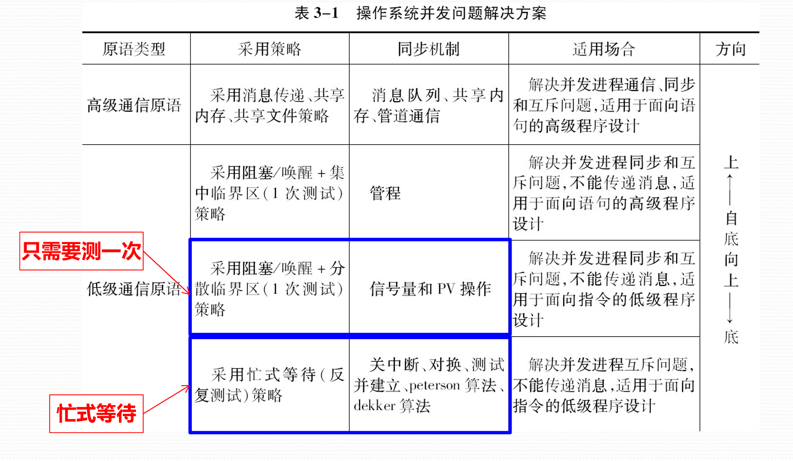

## 并发进程

### 概念

程序设计的一般习惯是顺序程序设计，**顺序程序设计**具有顺序性、封闭性、确定性、可再现性。

多道程序设计允许多个进程**并发执行**。OS 保证按照“顺序程序设计”方法编制的程序在并发执行时不受影响，如同独占计算机。这些按照顺序程序设计思想编制的进程在中并发执行属于**无关的并发进程**。

==使一个程序分成若干个可同时执行的程序模块的方法称 **并发程序设计(concurrent programming)**==

​	并发性、共享性、交往性

### 制约关系

**无关**的并发进程：一组并发进程分别在**不同的变量集合**上运行

> 并发进程的无关性是进程的执行与时间无关的一个充 分条件，又称为 **Bernstein 条件**
>
> Pi：进程，R：读，W：写
> $$
> ((R(p1)∩W(p2))∪(R(p2)∩W(p1))∪(W(p1)∩W(p2))= \emptyset
> $$
> 则并发进程的执行与时间无关

**交往**的并发进程：一组并发进程**共享某些变量**， 一个进程的执行可能影响其他并发进程的结果

**时间相关的错误：结果错误、永远等待**

### 竞争与协作

进程之间存在两种基本关系：**竞争关系和协作关系**

第一种是竞争关系，一个进程的执行可能影响到同其竞争资源的其他进程，如果两个进程要访问同一资源，那么，一个进程通过操作系统分配得到该资源，另一个将不得不等待

> 竞争带来的问题：**死锁和饥饿**
>
> ==进程的互斥(mutual exclusion) 是解决进程间竞争关系(间接制约关系 )的手段。==

第二种是协作关系，某些进程为完成同一任务需要分工协作，由于合作的每一个进程都是独立地以不可预知的速度推进，这就需要相互协作的进程在某些协调点上协调各自的工作。当合作进程中的一个到达协调点后，在尚未得到其伙伴进程发来的消息或信号之前**应阻塞自己**，直到其他合作进程发来协调信号或消息后方被唤醒并继续执行。

> ==进程的同步(Synchronization)是解决进程间协作关系(直接制约关系)的手段。==
>
> 进程互斥关系是一种特殊的进程同步关系， 即逐次使用互斥共享资源，是对进程使用资源次序上的一种协调

## 临界区管理

==**临界资源：互斥共享变量所代表的资源**，即一次只能被一个进程使用的资源==

**临界区指并发进程中与互斥共享变量相关的程序段**

### 临界区管理的尝试

​	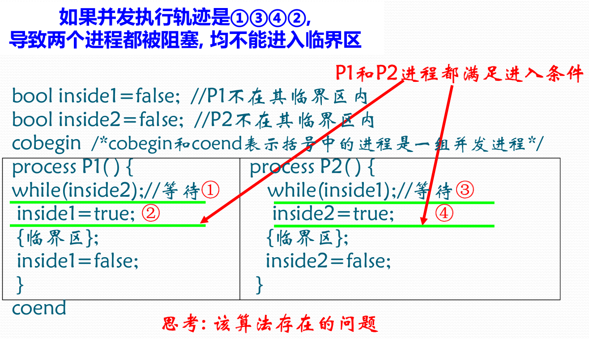

​	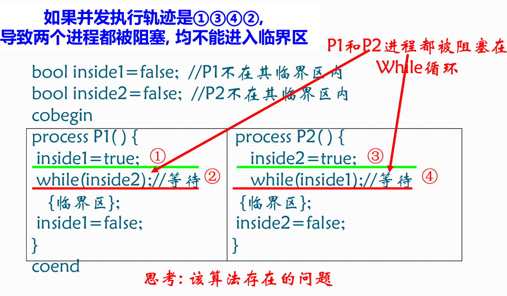

### Peterson算法

​	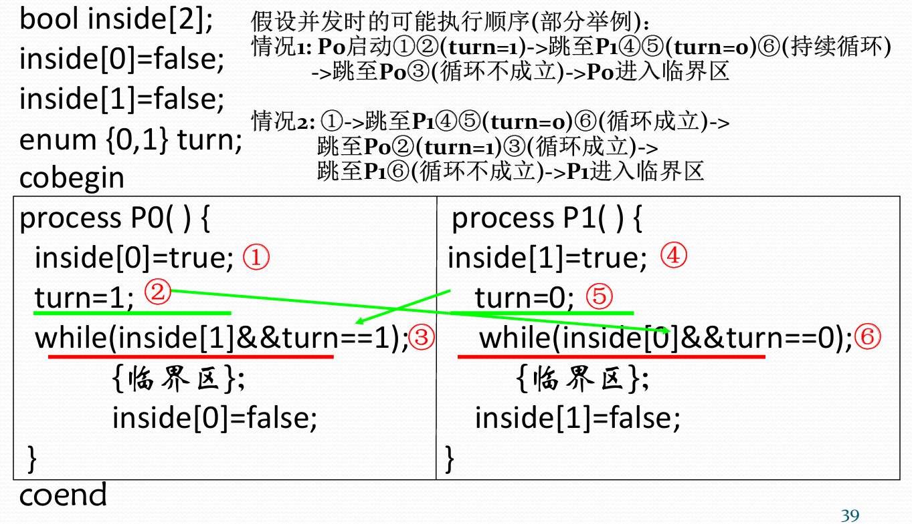

只能交替进入临界区，不能连续进入

## 临界区管理实现的硬件方式

1. **关中断**：最简单，直接在访问临界区时禁止中断
2. **测试并建立指令**

   ​	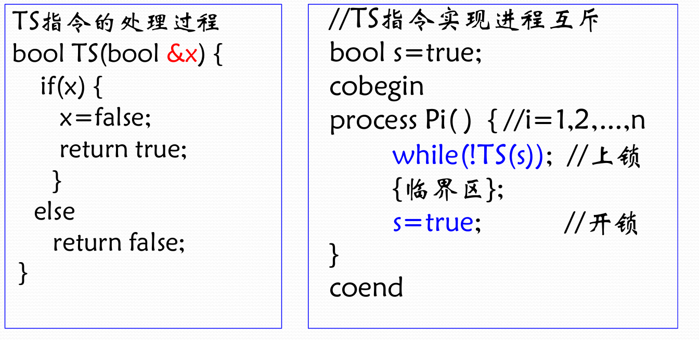
3. **互换指令**

   ​	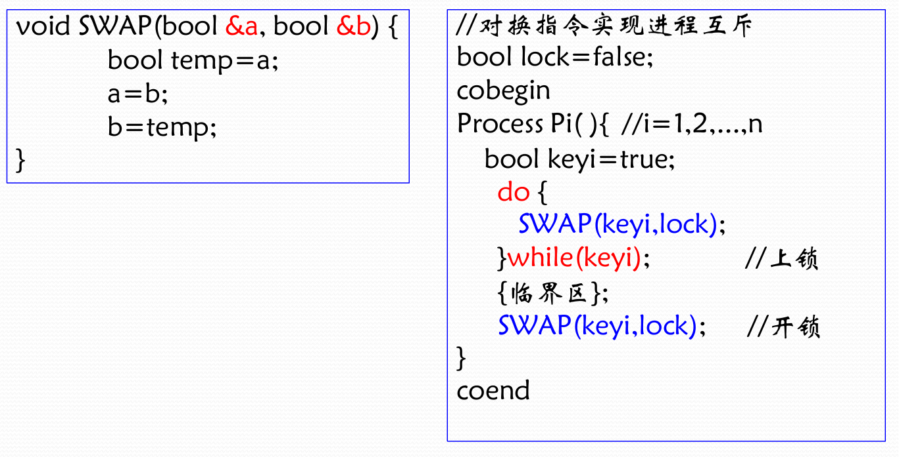

## ⭐⭐**信号量与PV操作**

### 数据定义

设**s**为一个**记录型数据结构**,一个分量为整型量value,另一个为**信号量队列queue**, P和V操作原语定义：

- **P(s)**：将信号量**s减去1**，若结果**小于0**，则调用P(s)的进程被置成**等待**信号量s的状态
-  **V(s)**：将信号量**s加1**，若结果**不大于0**，则**释放(唤醒)**一个等待信号量s的进程，使其**转换为就绪态**

> 原语：CPU处于内核态，在<u>关中断</u>环境下执行的一段指令序列
>
> 原子性：不被中断，确保安全且完整执行这段指令序列

### 信号量与进程状态转换模型及其队列模型

​	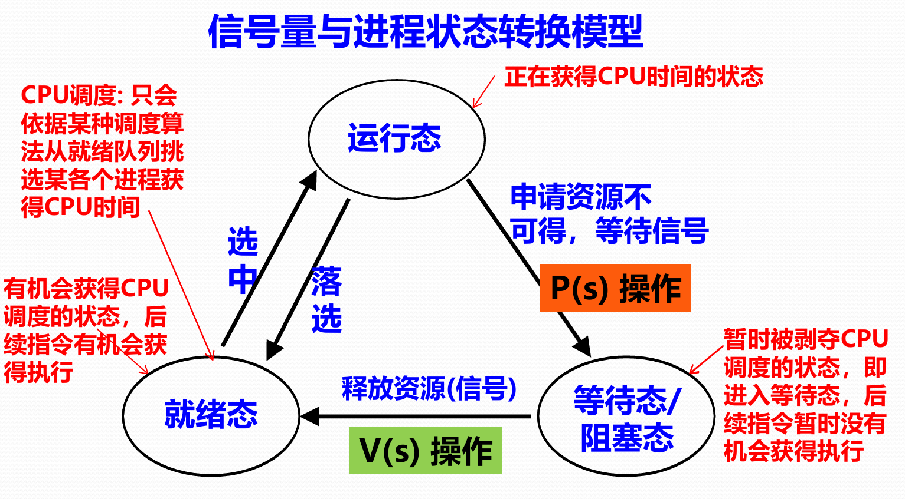

​	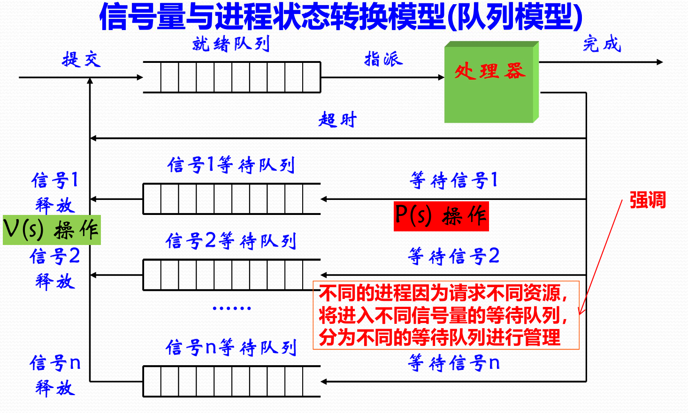

> 推论
>
> - 信号量s为正值，表示还可进行的P操作次数，也代表剩余空闲资源数
>
> - 信号量s为负值，绝对值等于等待进程数
>
> P操作意味着**请求**一个资源，V操作意味着**释放**一个资源；P操作代表**阻塞进程操作**，而V操作代表**唤醒被阻塞进程**的操作

### **哲学家就餐问题**

有五个哲学家围坐在一圆桌旁，桌中央有一盘通心面，每 人面前有一只空盘子，每两人之间放一把叉子。每个哲学家思考、饥 饿、然后吃通心面。为了吃面，每个哲学家必须获得两把叉子，且每人只能直接从自己左边或右边去取叉子 。

```c
semaphore fork[5];
for (int i=0;i<5;i++)
 	fork[i]=1;
cobegin
process philosopher_i( ) {   //i= 0,1,2,3,4
while(true) {
 	think( );
	P(fork[i]);
	P(fork[(i+1)%5]);  // 两个P操作间可能产生死锁：所有人同时举起左手边的叉子
 	eat( );
 	V(fork[i]);
 	V(fork[(i+1)%5]);
 	}
}
coend
```

**解决方法**：

1. **(C. A. R. Hoare方案)**至多允许四个哲学家同时取叉子

   ```c
   room = 4；
   P(room) // 房间里最多四人
   	P(fork[i]);
   	P(fork[(i+1)%5]);
    	eat( );
    	V(fork[i]);
    	V(fork[(i+1)%5]);
   V(room)
   ```

2. 奇数号先取左手边的叉子，偶数号先取右手边的叉子

   ```c
   P(fork[i]); 
   P(fork[(i+1) % 5]);
   
   P(fork[(i+1) % 5]); 
   P(fork[i]);	// 邻座二人必然对抗
   ```

   也可以简单一点，只让**其中一个哲学家先取右手**，这样也不会陷入死锁。

3. **(AND型信号量)**每个哲学家取到手边的两把叉子才吃，否则一把叉子也不取(**管程求解**)

### **生产者与消费者问题**

环形缓冲区，一个生产者放，一个消费者拿；消费者要在生产者放了的缓冲区拿，生产者要在空的缓冲区放。

1. **一个生产者 / 一个消费者 / 一个缓冲单元**

   ```c
   sput=1; // 表示初始允许放入一件产品
   sget=0; // 目前没有产品
   
   Process producer
    begin
    L1: 
   	produce a product; 
   	P(sput);  	// sput - 1,  表示申请一个空位，put之后空位消失；若无空位则阻塞
   	B=product; 
   	V(sget);	// sget + 1,  表示释放一个正在等待get的进程，也就是唤醒消费者
   	goto L1; 
   end; 
   
   Process consumer
    begin
    L2: 
   	P(sget); 	// sget - 1,  表示申请一个可get位，get后再次为空；若无法get则阻塞
   	product=B; 
   	V(sput); 	// sput + 1,  表示释放一个正在等待put的进程，即唤醒生产者
   	consume a product; 
   	goto L2; 
   end;
   ```

   > 最简单的生产者-消费者模型，是之后所有变体的基础

2. **一个生产者 / 一个消费者 / 多个缓冲单元**

   ```c
   sput = k // 允许放入k个
   sget = 0
   
   P(sput);  	
   B[putptr]=product;	
   putptr = (putptr+1)%k;	
   V(sget);	
   
   P(sget);  	
   product=B[getptr];
   getptr = (getptr+1)%k;
   V(sput);	
   ```

   > put和get各自维护一个指针，随着put或get的进行向前进

3. **多个生产者 / 多个消费者 / 多个缓冲单元**

   ```c
   s1 = 1; s2 = 1; // 多个进程共享putptr和getptr，所以需要互斥使用
   
   P(sput);  	
   	p(s1);	// 拒绝其他写进程使用putptr
   	B[putptr] = product;	
   	putptr = (putptr+1)%k;
   	V(s1);
   V(sget);	
   
   
   P(sget);  	
   	p(s2);	// 拒绝其他读进程使用getptr
   	product = B[getptr];
   	getptr = (getptr+1)%k;
   	V(s2);
   V(sput);
   ```

   > 如果只用一个互斥信号量s，在读的时候也拒绝了写的进程。

### **苹果橘子问题**

一个盘子，爸爸放苹果，妈妈放橘子；女儿取苹果，儿子取橘子。盘子里只能放一个水果。

```c
sp = 1; // 初始盘子允许放一个水果
sg1 = 0; //  没有橘子
sg2 = 0; //  没有苹果

process father:
begin:
	L1 : 削苹果
		P(sp);	// 请求空盘子
		放苹果;
		V(sg2);  // 可以拿苹果了
    goto L1;
end;

process mother:
begin:
	L2 : 削橘子
		P(sp);	// 请求空盘子
		放橘子;
		V(sg1);  // 可以拿橘子了
    goto L2;
end;

process son:
begin:
	L3 : 
		P(sg1);	// 请求橘子
		拿橘子;
		V(sp);  // 盘子空了
    goto L3;
end;

process daughter:
begin:
	L4 : 
		P(sg2);	// 请求橘子
		拿苹果;
		V(sp);  // 盘子空了
    goto L4;
end;
```

> 同一个信号量的P操作和V操作可能分散，但一定是逻辑上闭环的。有P就有V。找到什么资源在被谁共享、会怎样变化就行。

### **读者写者问题**

读之间不互斥，读与写、写与写之间互斥

​	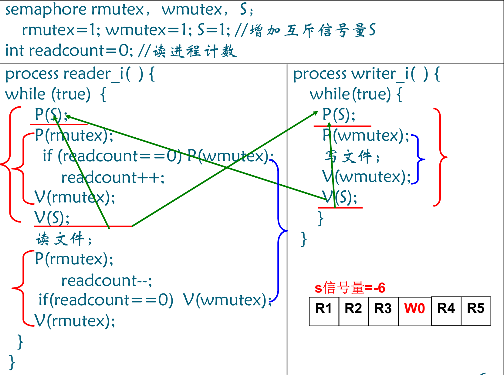

> 一个混淆性极强的例子。可以这样想：
> **假设读读、读写、写写都互斥**，读和写应该都共用**一个**信号量**rw=1**，有：
>
> ```c
> Reading: P(rw); 读; V(rw);
> Writing: P(rw); 写; R(rw);
> ```
>
> 然而由题设，读和读是不互斥的。这里是怎么解决的呢？
>
> **但凡有一个进程在读时**，**其他的读进程都可以随便进来读**，只有写进程不能进来。那么就**只有第一个读进程需要申请信号量**，其他读进程跟着喝汤就行了。当**所有读进程都离开**，才轮到写进程进入。
>
> 于是，我们定义readcount=0，表示**目前在读的进程数**。
>
> 当readcount>0时，说明**至少有一个读进程正在读**，那再来几个读进程也无妨。当readcount==0时，说明**读进程已经全部退出了**，这时就可以释放rw，表示现在**允许写**了。
>
> ```c
> Reading:
> 	if(count==0) P(rw);  // 第一个读进程，要申请资源
> 	count++;			// 不是第一个，直接进入
> 	读;
> 	count--;			// 读完就退出
> 	if(count==0) V(rw);  // 没有读进程正在读了，释放资源，允许写
> 
> Writing:
> 	P(rw);
> 	写;
> 	V(rw);
> ```
>
> 这个时候出现一个问题，count是一个多个读进程的**共享变量**，又是一个新的临界区，于是我们需要一个互斥信号量mutex=1来保护它。
>
> ```c
> Reading:
> 	P(mutex);
>      if(count==0) P(rw);  
>      count++;		
>  V(mutex);
>      读;
>  P(mutex);
>      count--;			
>      if(count==0) V(rw);  
>  V(mutex);
> ```
>
> 这就是混淆的地方，课件里给出的两个信号量是rmutex和wmutex，很容易让人以为一个处理读、一个处理写。事实上，最终决定读写资源分配的只有wmutex（也就是这里的rw），rmutex是用来保护count的！
>
> 最后还有一个问题，上面说的到count==0时释放资源，然后才轮到写进程。在count>0的大部分时间里，写进程的请求都被阻塞了。**只要读进程一直读，写进程就永远在等待**。
>
> 于是我们再定义信号量S=1；
>
> ```c
> Reading:
> 	P(S);
> 	P(mutex);
> 	...		
>  	V(mutex);
> 	V(S);
> 	读;
> 	P(mutex);
> 	...		
>  	V(mutex);
> 
> Writing:
> 	P(S);
> 	P(rw);
> 	写;
> 	V(rw);
> 	V(S);
> ```
>
> 加上这一个S的效果是什么呢？就是**让所有读和写进程按申请顺序一起排队**，当一个写进程前面的读进程执行完了，就立马执行这个写进程。至于在该写进程之后申请的读进程呢，因为被P(S)拦截，不能再进入读的过程，只有当它前面的写进程结束了释放S的时候，才会轮到它再次去读。这样就保证了**公平性**。
>
> **最终代码如课件所示。**
>
> 补充：**写者优先**
>
> ​	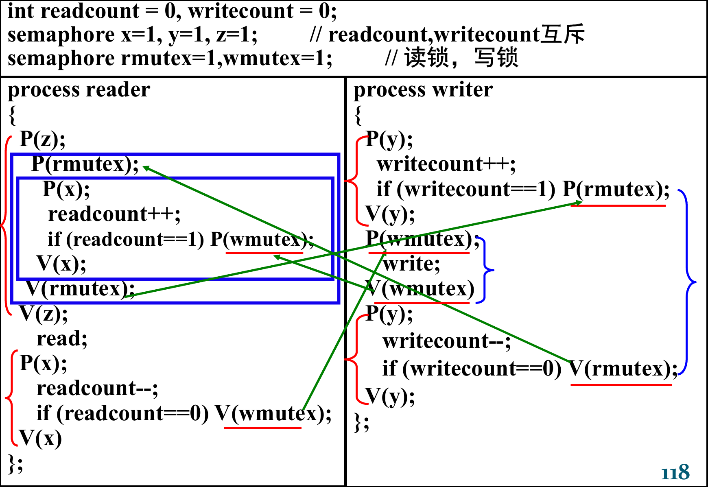	

### **睡眠的理发师问题**

理发店理有一位理发师、一把理发椅和n把供等候理发的顾客坐的椅子。如果没有顾客，理发师便在理发椅上睡觉。一个顾客到来时，叫醒理发师。如果理发师正在理发时又有顾客来到，则如果有空椅子可坐，就坐下来等待，否则就离开。

​	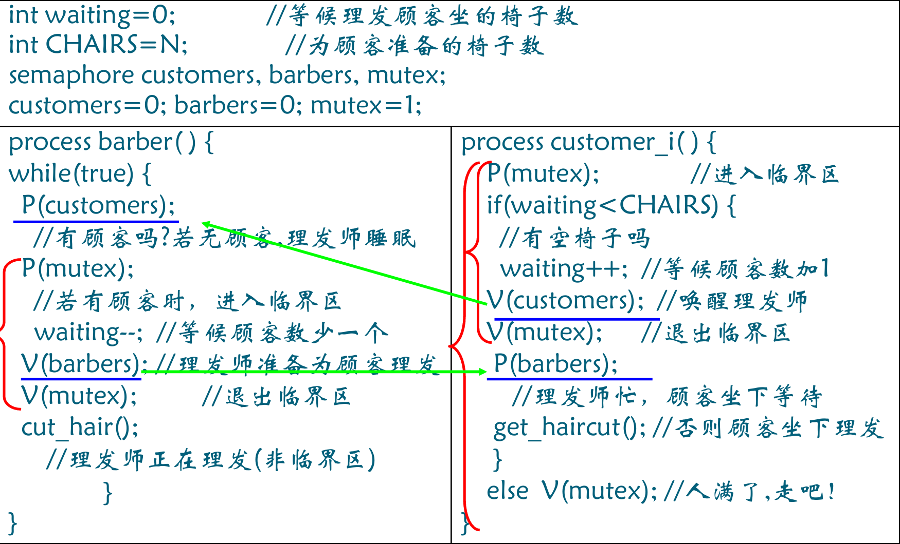

> **生产者-消费者模型**的一个变体
>
> 把理发椅看成盘子，顾客是生产者，理发师是消费者
>
> 只不过顾客初始为0，所以要先进行V操作增加顾客数量

### **农夫猎人问题**

有一个铁笼子，每次只能放入一个动物。猎手向笼中放入老虎，农夫向笼中放入羊；动物园等待取笼中的老虎，饭店等待取笼中的羊。

​	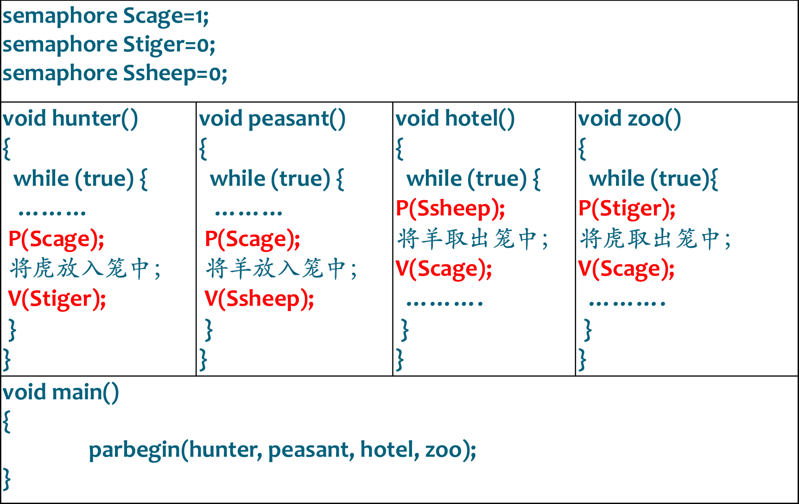

> 典型的苹果-橘子问题，不多说

### **银行业务问题**

某大型银行办理人民币储蓄业务，由n个储蓄员负责。每个顾客进入银行后先至取号机取一个号，并且在等待区找到空沙发坐下等着叫号。取号机给出的号码依次递增，并假定有足够多的空沙发容纳顾客。当一个储蓄员空闲下来，就叫下一个号。

​	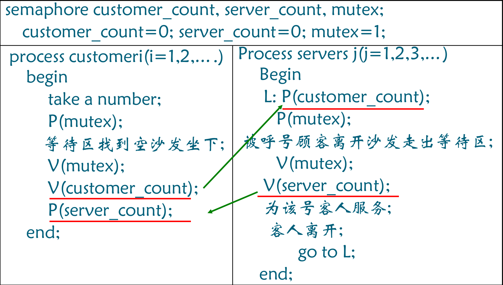

> 和睡眠的理发师问题一样，只不过这次理发师（储蓄员）有多个，但是这个多个体现在进程多可能并行，不影响代码结构。代码几乎和理发师模型一样。
>
> 还是要注意**长时间作业尽量不要放临界区里**。

### **缓冲区管理**

有n个进程将字符逐个读入到一个容量为80的缓冲区 中(n>1)，当缓冲区满后，由输出进程Q负责**一次性取走**这80个字符。

​	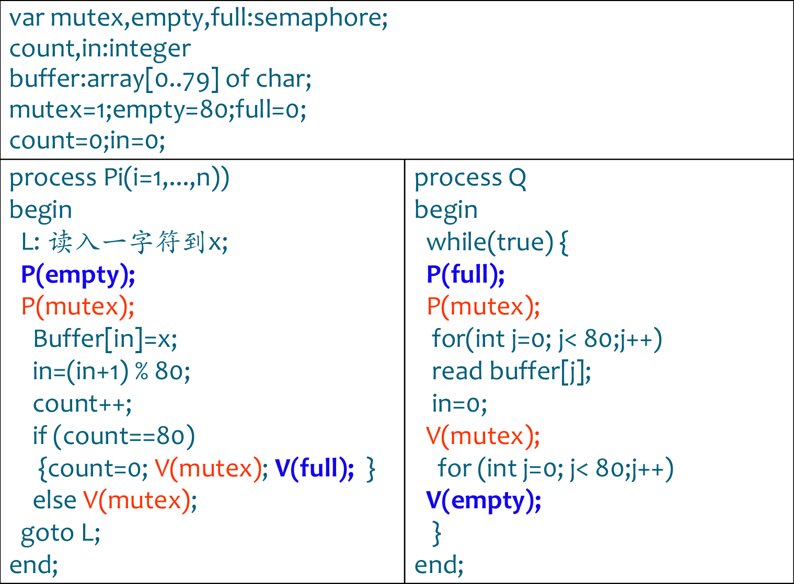

> 依然是交叉式的生产者-消费者模型，只不过加了限制条件。根据条件设置信号量值。

### **售票问题**

汽车司机与售票员之间必须协同工作，一方面只有售票员把车门关好了司机才能开车，因此，售票员关好门应通知司机开车，然后售票员进行售票。另一方面，只有当汽车已经停下，售票员才能开门上下客，故司机停车后应该通知售票员。假定某辆公共汽车上有一名司机与两名售票员，汽车当前正在始发站停车上客。

​	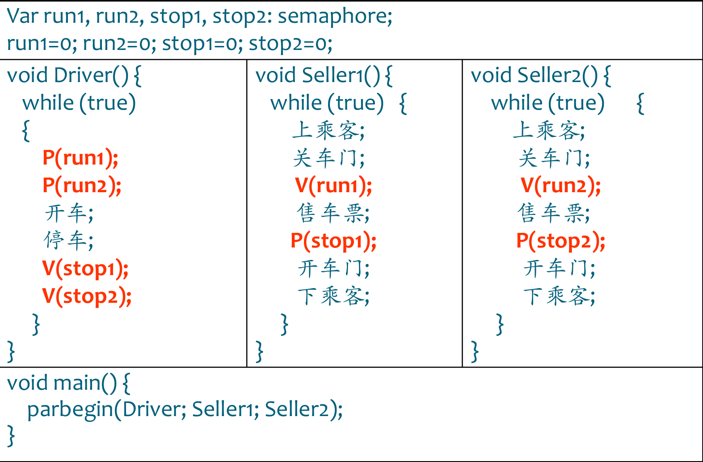

> 简单的同步问题

### **吸烟者问题**

三个吸烟者在一个房间内，还有一个香烟供应者。为了制造并抽掉香烟，每个吸烟者需要三样东西：烟草、纸和火柴， 供应者有丰富货物提供。三个吸烟者中，第一个有自己的烟草，第二个有自己的纸和第三个有自己的火柴。供应者随机地将两样东西放在桌子上，允许一个吸烟者进行对健康不利的吸烟。当吸烟者完成吸烟后唤醒供应者， 供应者再把两样东西放在桌子上，唤醒另一个吸烟者。

​	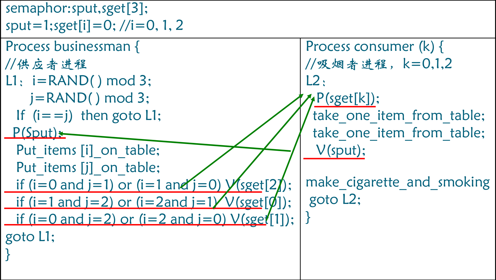

> 题目很复杂，代码很简单。也是生产者-消费者问题的变种，只不过**生产者会选择消费者**。

### **独木桥问题**

1. 东西向汽车过独木桥，为了保证安全，只要桥上无车，则允许一方的汽车过桥，**待一方的车全部过完后**， 另一方的车才允许过桥。

   ​	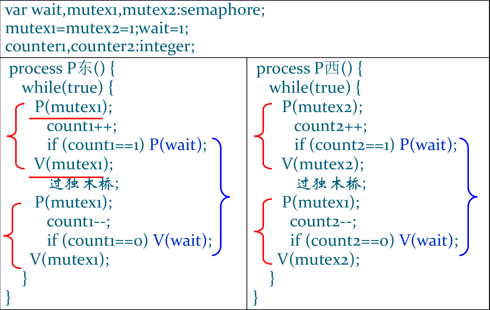
   
   > 一个双向的读者-写者问题。“待一方的车全部过完后”就是指**需要偏袒**正在运行的进程。
   
2. 在独木桥问题1中，**限制桥面上最多可以有k辆汽车通过**。

   ​	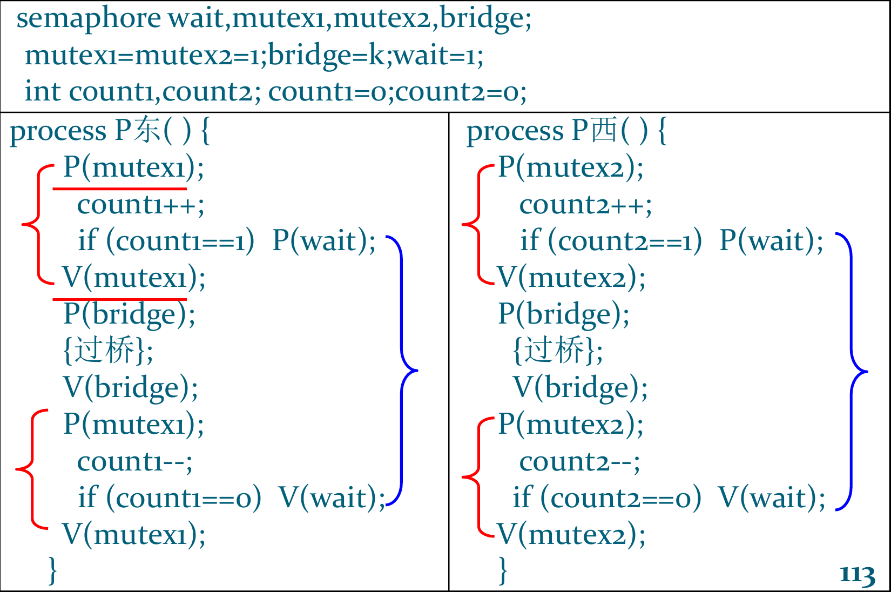
   
   > 限制同步进程的数量，只要给过桥设立一个信号量bridge=k即可
   
3. 在独木桥问题1中，以**三辆汽车为一组**，要求保证东方和西方以组为单位**交替**通过汽车。

   ​	
   
   > 三辆一组，就在if条件里再加一条判断有没有经过三辆
   >
   > 交替：设立互斥量S1,S2，交替PV
   
4. 在独木桥问题1中，要求各方向的汽车**串行**过桥，但当另一方提出过桥时， 应能**阻止对方未上桥**的后继车辆，待桥面上的汽车过完桥后，另一方的汽车开始过桥。

   ​	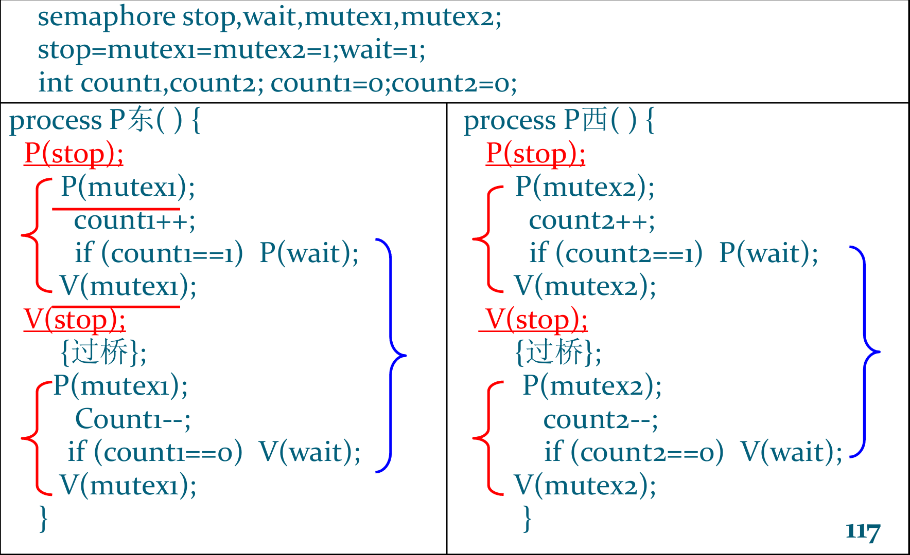
   
   > 仔细推敲，发现其实这就是一个**公平性问题**。要求东西两方向的车辆按到来的顺序排队，先来的车先上。

## ⭐⭐**管程**

###  概述

引入管程的**目的**：

- **集中管理**分散的临界区

- 防止进程的**违法同步**操作
- 便于**高级语言**编程

​	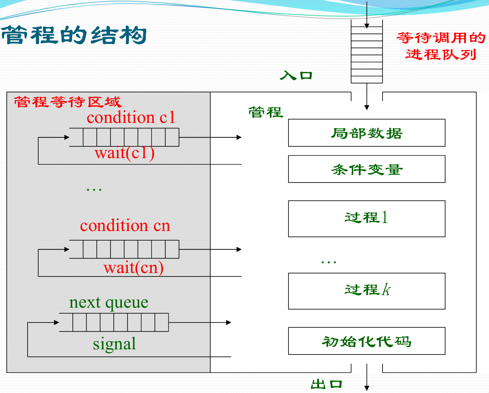

定义：管程是由局部于自己的若干**公共变量**及其说明和所有访问这些公共变量的过程所组成的软件模块

```
type 管程名=monitor {
	局部变量说明；
	条件变量说明；
    初始化语句；
define 管程内定义的，管程外可调用的过程或函数名列表；
use 管程外定义的，管程内将调用的过程或函数名列表；
过程名/函数名(形式参数表) { 
	<过程/函数体>;
 }
	 …
过程名/函数名(形式参数表) {
 	<过程/函数体>;
 }
}
```

**条件变量 (condition variables)**-是出现在管程内的一种数据结构，且只有在管程中才能被访问，它对管程内的所有过程是全局的，<u>只能通过两个原语操作来控制它</u>;  当调用管程过程的进程无法运行时，用于阻塞进程的信号量。

**wait( )**-<u>**阻塞**调用进程并**释放**管程</u>，<u>直到另一个进程在该条件变量上执行signal( )</u>; 当一个管程过程发现无法继续时(如发现没有可用资源时)，它在某些条件变量上执行wait，这个动作引起调用进程阻塞。

**signal( )**-如果存在其他进程由于对条件变量执行wait( ) 而被阻塞，<u>便释放之</u>；如果没有进程在等待，那么，信号不被保存; <u>用于释放在条件变量上阻塞的进程</u>。

> 使用signal释放等待进程时，可能出现**两个进程同时停留在管程内**，导致时间错误。解决思路：
>
> - **执行signal的进程等待**，直到被释放进程退出管程或等待另一个条件变量（**Hoare**，1974）
> - **被释放进程等待**，直到执行signal的进程退出管程或等待另一个条件

### **霍尔管程**

​	不要求signal操作是过程体的最后一个操作，且wait和signal操作可被设计成**可以中断**的过程。

### 数据结构

1. **mutex (初值为1)**

   进程调用管程中的任何过程时，应执行`P(mutex)`；进程退出管程时，需要判断是否有进程在next信号量等待， 如果有(即next_count>0)，则通过`V(next)`唤醒一个**发出 signal的进程**，否则应执行`V(mutex)`开放管程，以便让其他调用者进入。

   为了使进程在等待资源期间，其他进程能进入管程，故在wait操作中也必须执行V(mutex)。

2. **next(初值为0)和next-count**

   凡发出signal操作的进程应该用`P(next)`**阻塞自己**，直到<u>被释放进程退出管程</u>或产生其他等待条件。

   进程在退出管程的过程前，须检查是否有别的进程在信号量next上等待，若有，则用`V(next)`唤醒它。

3. **x-sem(初值为0)和x-count**

   申请资源得不到满足时， 执行`P(x-sem)`阻塞。由于释放资源时，需要知道是否有别的进程在等待资源，用计数器x-count(初值为0)记录等待资源的进程数。

   执行signal操作时，应让等待资源的诸进程中的某个进程**立即恢复运行**，而不让其他进程抢先进入管程，这可以用`V(x-sem)`来实现。

### ⭐具体实现

```c
typedef struct InterfaceModule { //InterfaceModule是结构体名字
	semaphore mutex;   //进程调用管程过程前使用的互斥信号量
	semaphore next;    //发出signal的进程阻塞自己的信号量
	int next_count;    //在next上等待的进程数
};
mutex=1; next=0; next_count=0;   //初始化语句
```

```c
void enter(InterfaceModule &IM) {
 P(IM.mutex);  	// 控制进出管程的mutex
}
```

```c
void leave(InterfaceModule &IM) {
 	if (IM.next_count>0)       
		V(IM.next);    //有就释放一个发出过signal的进程
	else
 		V(IM.mutex);  //否则开放管程
}
```

```c
void wait(semaphore &x_sem, int &x_count, InterfaceModule &IM) {
 	x_count++;  //等资源进程个数加1，x_count初始化为0 
	if (IM.next_count>0) //判断是否有发出过signal的进程 
		V(IM.next); //有就释放一个 
	else 
		V(IM.mutex);  //否则开放管程 
	P(x_sem);  //等资源进程阻塞自己，x_sem初始化为0 
	x_count--;  //等资源进程个数减1    
}
```

```c
void signal(semaphore &x_sem, int &x_count,  InterfaceModule &IM) {
 	if(x_count>0) {  //判断是否有等待资源的进程 
		IM.next_count++;  //发出signal进程个数加1 
		V(x_sem);      
			//释放一个等资源的进程 
		P(IM.next);     //发出signal进程阻塞自己  
		IM.next_count--;  //发出signal进程个数减1 
	}
    // 没有进程等待资源就不处理
}
```

> next信号量与资源无关，是为了防止错误设立的临时队列
>
> 不能简单把wait，signal和P，V对应。**wait操作是真正的等待**，而**P操作是有则过、无则阻**。
>
> wait的条件一般要显式地**通过if语句指明**，而P操作本身暗含判断逻辑。

### 解决互斥与同步问题

#### 管程-读者写者问题

```c
TYPE  read-write=monitor
 	int rc,wc;
 	semaphore R,W;R=0;W=0;
	int R_count,W_count;
 	rc=0; wc=0;
 	InterfaceModule IM;
DEFINE  start_read, end_read, start_write, end_write;
USE  wait,signal,enter,leave;
```

​	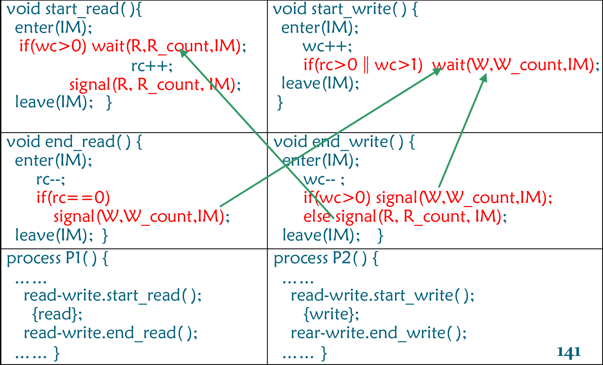

> 这个解法偏袒写进程，`if(wc>0) signal(W,W_count,IM);`如果一直写就没得读。

#### 管程-哲学家就餐问题

​	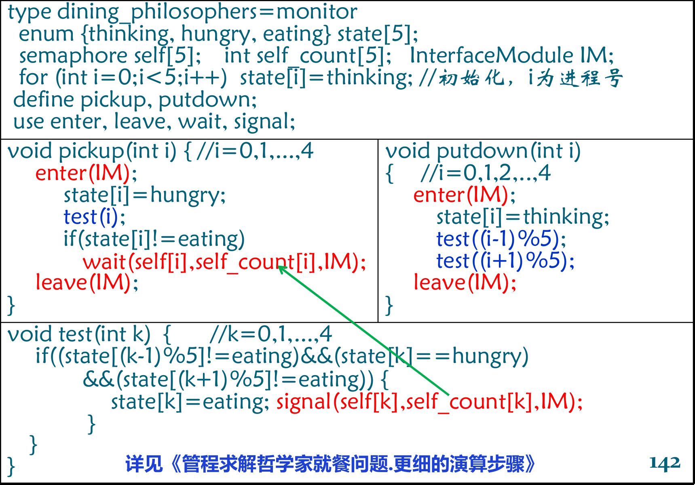

**调用方式：**

```c
cobegin              
process philosopher_i( ) {  //i=0,…,4
   while(true) {
    thinking( );
	dining_philosophers.pickup(i);        
	eating( );
	dining_philosophers.putdown(i);
   }
}
coend
```

> 这种解法不会产生死锁，因为本质上是**要么两把叉子一起取到，要么都不取**。
>
> **❗强烈建议结合具体演算步骤理解**

#### 管程-生产者消费者问题

​	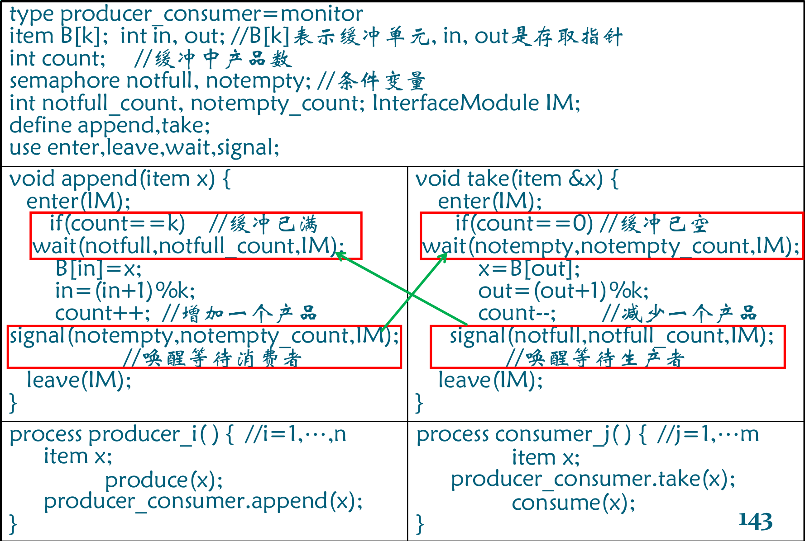

#### 管程-苹果橘子问题

​	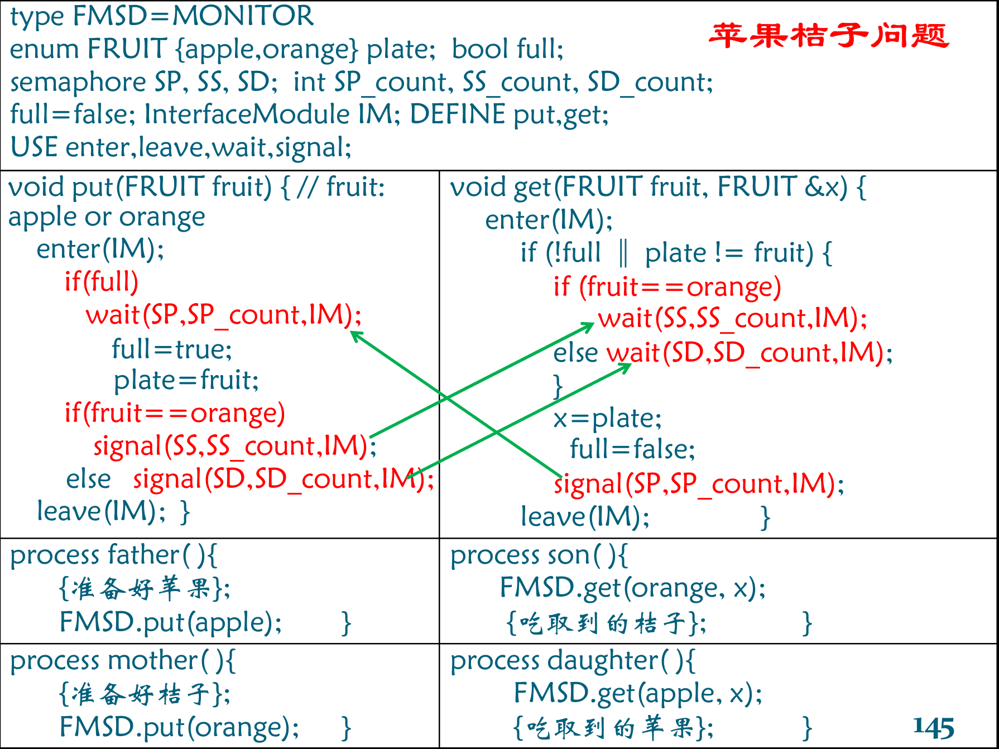

## 进程通信

1. **进程直接通信**
2. **进程间接通信**

**消息传递原语**

- **send**  发送消息的原语
- **receive** 接收消息的原语

### 进程直接通信

1. **对称直接寻址**，发送进程和接收进程必须**命名**对方以便通信。` send(P, messsage) `,` receive(Q, message) `
2. **非对称直接寻址**，只要**发送者命名**接收者，而接收者不需要命名发送者`send(P, messsage)`,`receive(id, message)`

本质上是要**内核**开辟存储空间，发出方写到指定区域再由内核转到接收方

**消息格式**：

- **消息头**：消息类型；目标ID；源ID；消息长度；控制消息
- **消息内容**：正文

### 进程间接通信

​	消息不是直接从发送者发送到接收者，而是发送到由临时保存这些消息的队列组成的一个**共享数据结构**，这些队列通常成为**信箱(mailbox)**。

​	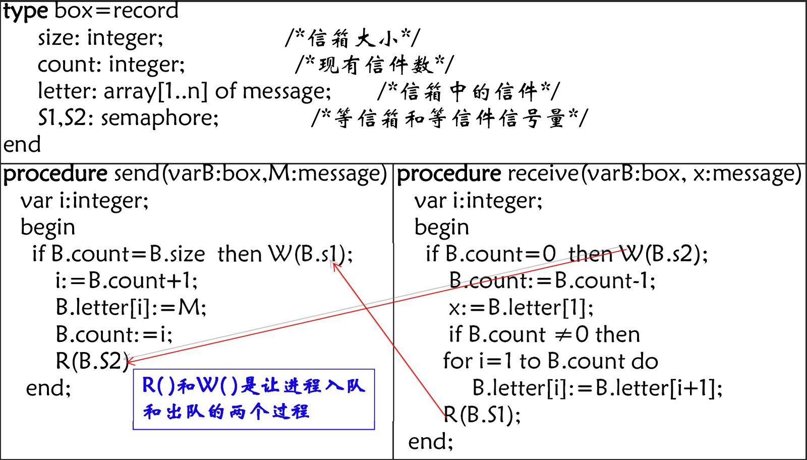

#### 生产者消费者问题

​	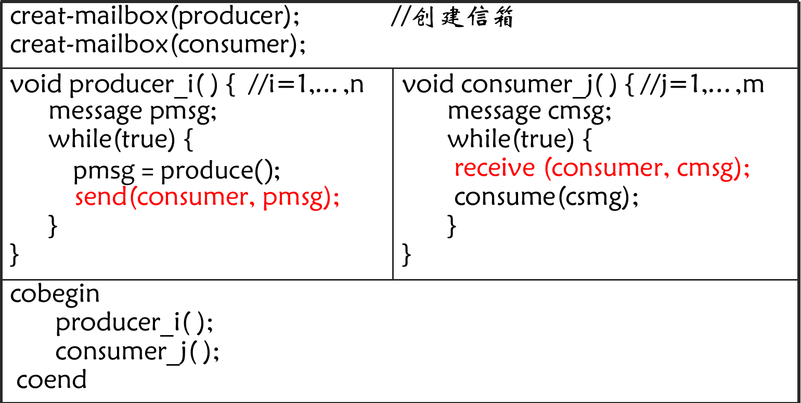

### 消息缓冲通信

​	**发送原语Send**：申请一个消息缓冲区，把发送区内容复制到这个缓冲区中；找到接收进程的PCB，执行互斥操作P(mutex)；把缓冲区挂到接收进程消息队列的尾部，执行V(sm)、即消息数加1；执行V(mutex)。

​	**接收原语Receive**：执行P(sm)查看有否信件；执行互斥操作P(mutex)，从消息队列中摘下第一个消息， 执行V(mutex)；把消息缓冲区内容复制到接收区， 释放消息缓冲区。

​	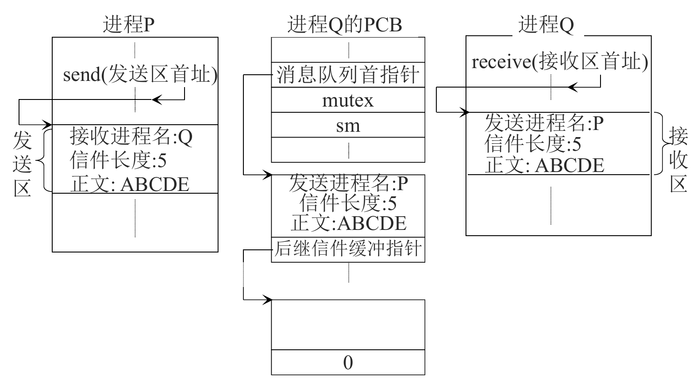

### 管道和套接字

管道(pipeline)是Unix和C的传统通信方式

**管道和套接字都是基于信箱的消息传递方式的一种变体**，它们与传统的信箱方式等价，区别在于**没有预先设定消息的边界**。

### 高级进程通信机制

#### 基于流的进程通信

​	多个进程使用一个**共享的消息缓冲区**（可称为管道、多路转接器、套接字）

​	信息交换单位基于**字符流**，长度任意

#### 远程过程调用RPC

​	采用**客户/服务器**计算模式，实现跨越机器边界的通信目标

​	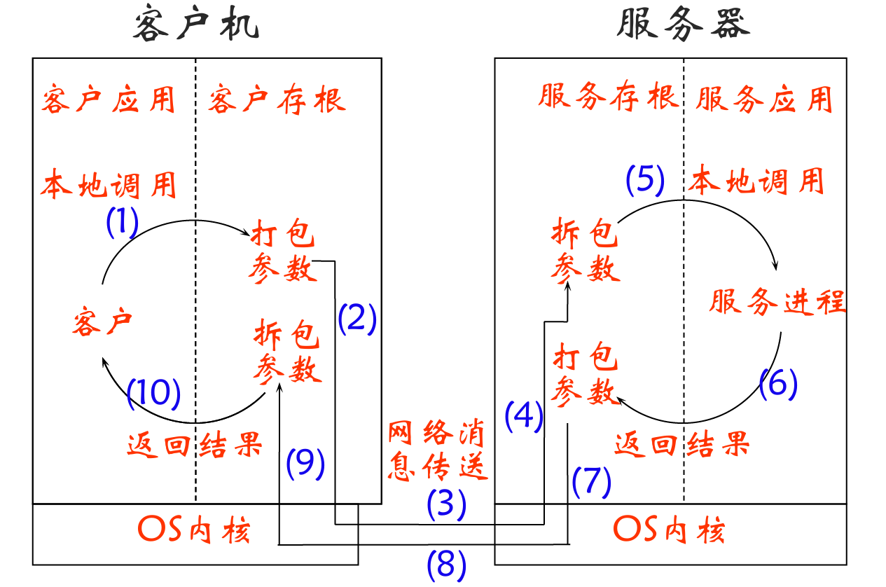

## 死锁

### 死锁的产生

1. 进程推进顺序不当产生死锁
2. PV操作使用不当产生死锁
3. 资源分配不当引起死锁（如资源数小于进程所要求的总数）
4. 对临时性资源使用不加限制引起死锁（独木桥）

**定义**：如果在**一个进程集合**中的**每个进程**都在等待只能由**该集合中的其他一个进程**才能引发的事件，则称一组进程或系统此时发生死锁。

### 死锁的防止

​	**死锁产生**的四大**必要条件**：

1. **互斥**条件（解决：**同时访问**，但某些资源天然互斥）
2. **占有和等待**条件（解决：**静态分配**，但是很浪费）
3. **不剥夺**条件（**剥夺式**调度，比如说进程申请失败时主动释放自己的资源）
4. **循环等待**条件

**层次分配策略(破坏条件2和4)**

​	资源被分成多个层次，当进程得到某一层的一个资源后，它只能再申请**较高层次**的资源；当进程要释放某层的一个资源时，必须**先释放占有的较高层次**的资源；当进程得到某一层的一个资源后，它想申请该层的另一个资源时，必须先释放该层中的已占资源。

### ⭐死锁的避免-银行家算法

​	银行家比喻操作系统，周转资金是资源，贷款人就是进程

一个系统有**n个进程**和**m种不同类型**的资源,定义包含以下向量和矩阵的数据结构：

- **Ri：资源i的总数**
- **Vi：资源i的剩余可分配数**

- **最大需求矩阵Claim**--每个进程对每类资源的最大需求量, **Cij 表示进程Pi需Rj类资源最大数**。

- **分配矩阵Allocation**—表示进程当前已分得的资源数, **Aij表示进程Pi已分到Rj类资源的个数**。

**下列关系式确保成立**

1. 表示所有资源要么已被分配、要么尚可分配（**守恒**）

$$
R_i = V_i + \sum A_{ki}
$$

2. 表示进程申请资源数不能超过系统拥有的资源总数（**有限**）

$$
C_{ki} \le R_i
$$

3. 表示进程申请任何类资源数不能超过**声明**的最大资源需求数

$$
A_{ki} \le C_{ki}
$$

4. 系统中若要**启动一个新进程**工作,其对资源Ri的需求仅当满足下列不等式：

$$
R_i \ge C_{(n+1)i}+\sum C_{ki}
$$


>  即应满足**所有进程对资源Ri的最大资源需求**加上**启动的新进程的最大资源需求**数不超过系统拥有的最大数

5. **系统安全性**：存在进程序列P1...Pn，对每个进程Pk满足：

$$
C_{ki} - A_{ki} \le V_i + \sum^k_{j=1} A_{ji}
$$


> 即进程k**还需的资源i的数量Cki-Aki**不超过**在它之前的所有进程回收的资源数加上一开始剩余的资源数**

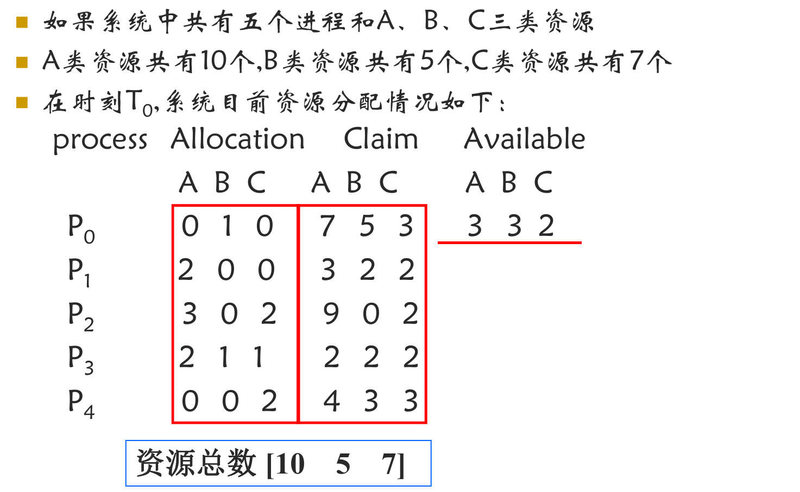

> Available=(V1,V2,…,Vn) 表示各资源剩余数；Allocation和Available对应项相加就是资源总数。
>
> 对比Claim和Available可知：**P1、P3是完全可以先分配的，因为可分配资源数大于声明数**。

​	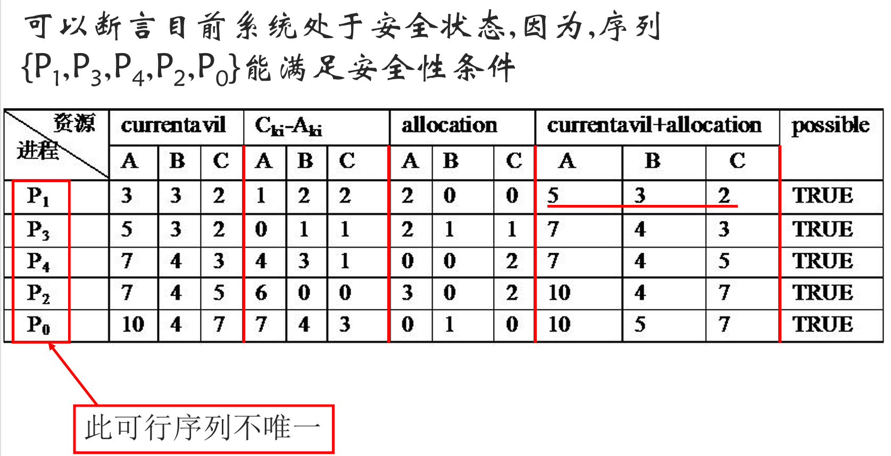

> 分析：
>
>  先分配P1、P3，然后尽早回收P1、P3的资源（可分配数+已分配数）。回收后的资源再作为**下一个进程的可分配资源数**继续分配。发现分配都是可行的（$currentavil >= Cki-Aki$），即系统是安全的。

**银行家算法的基本思想**

​	在安全状态下系统收到进程的资源请求后，先把资源**试探性分配**给它。

​	系统用剩下的可用资源和进程集合中其他进程**还要的资源数**作比较，在进程集合中找到**剩余资源能满足最大需求量**的进程，从而，保证这个进程运行完毕并**归还全部资源**。

​	把这个进程从集合中去掉，系统的剩余资源更多了，反复执行上述步骤。

​	最后，检查进程集合，若为空表明本次申请可行，系统处于安全状态，可实施本次分配；否则，有进程执行不完，系统处于不安全状态，本次资源分配暂不实施，让申请进程等待。

### 死锁的检测和解除

#### 死锁的检测

约定Pi→Rj为请求边，Rj→Pi为分配边。

​	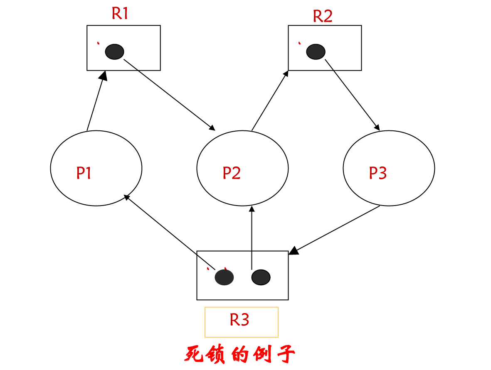

​	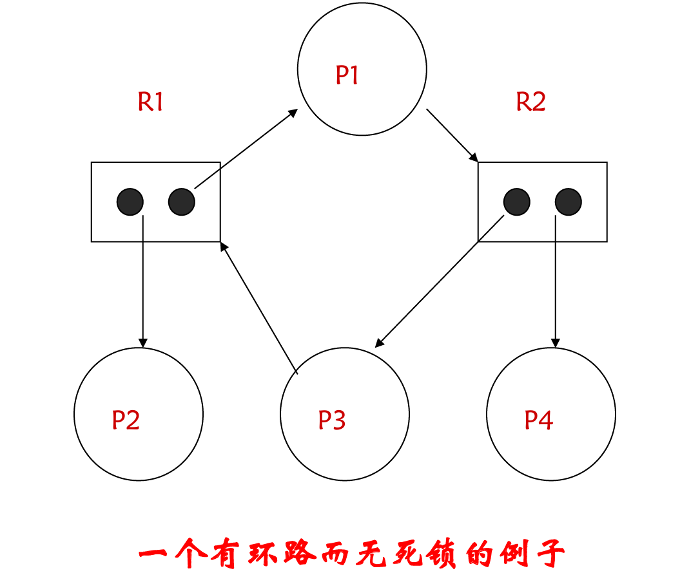

> 1. 如果进程-资源分配图中无环路，则此时系统没有发生死锁；
> 2. 如果进程-资源分配图中有环路，且**每个资源类中仅有一个资源**，则系统中发生了**死锁**；
> 3. 如果进程-资源分配图中有环路，且涉及的资源类中**有多个资源**，则环路的存在只是产生死锁的必要条件而不是充分条件；
>
> 如果能在进程-资源分配图中消去此进程的所有请求边和分配边，成为孤立结点。经一系列简化，使所有进程成为孤立结点，则该图是可完全简化的；否则则称该图是不可完全简化的。**不可完全简化是死锁的充分条件**。

**死锁的检测算法**与死锁的避免算法是类似的，不同在于前者考虑了检查每个进程还需要的所有资源能否满足要求；而后者则仅要根据进程的当前申请资源量来判断系统是否进入了不安全状态。

#### 死锁的解除

1. 剥夺陷入死锁的进程的资源但不撤销它。
2. 回退所有进程直到解除。
3. 释放未卷入死锁的进程的资源。

