# 计算机操作系统

# 一、计算机系统概览

## 计算机系统的组成	

分为**硬件子系统**和**软件子系统**

### 硬件系统

- **中央处理器** 
  - 运算单元 
  - 控制单元 
- **主存储器** 
- **外围设备** 
  - 输入设备 
  - 输出设备 
  - 存储设备 
  - 网络通信设备 
- **总线**

**存储程序计算机（冯诺依曼）**：以**运算单元**为中心，控制流由指令流产生；采用**存储程序**原理，面向主存组织数据流；主存是**按地址访问**、**线性编址**的空间；指令由**操作码和地址码**组成；数据以**二进制**编码。

**总线**：各功能部件的公共通信干线，包括**一组控制线、一组数据线、一组地址线**。分为**内部（CPU）总线、系统总线、通信总线**。（南北桥）

**中央处理器（CPU）**：运算核心（Core） 和控制单元（ Control Unit）

1. 运算逻辑部件
2. 寄存器部件
3. 控制部件

**I/O控制方式**：**轮询、中断、DMA（直接内存访问）**

### 软件系统

**组成**：**系统软件（+支撑环境）+应用软件**

​	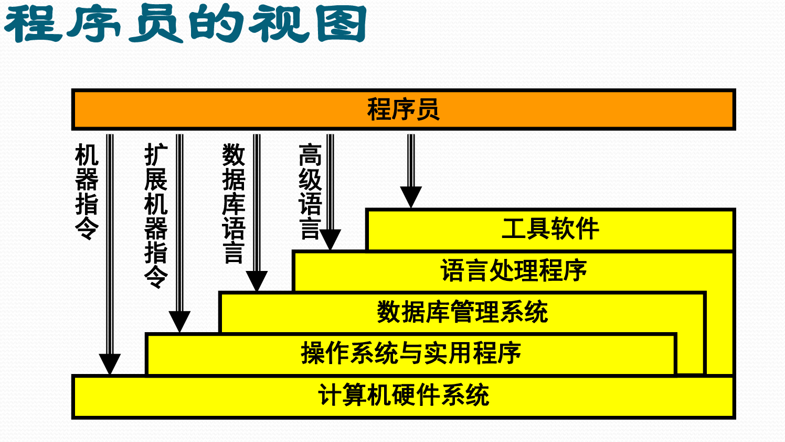

**软件开发的不同层次**：

1. 计算机**硬件资源**：机器语言
2. 操作系统之**资源管理**：机器语言+广义指令
3. 操作系统之**文件系统**：机器语言+系统调用
4. **数据库**管理系统： + 数据库语言
5. **语言处理**程序：面向问题的语言

## 计算机系统的层次结构

​	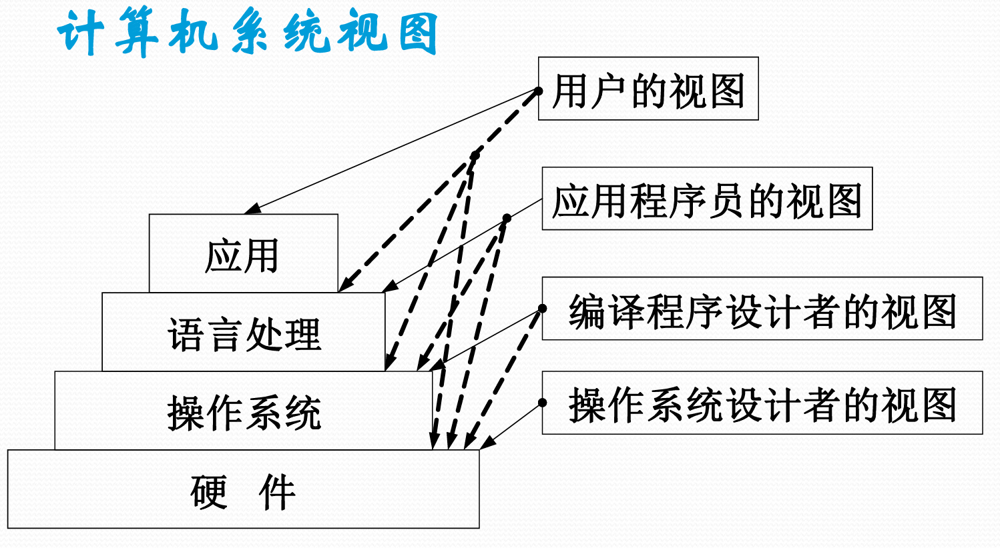

​	

## 计算机操作系统

###  概念

计算机系统最基础的系统软件，管理软硬件资源、控制程序执行，改善人机界面，合理组织计算机工作流程，为用户使用计算机提供良好运行环境

<u>**OS**是计算机系统的公共软件基础设施，所有应用程序共用OS服务，且OS内核是反应式**reactive机制（中断驱动的）**</u> 

### 类型

1. **多道批处理操作系统(把作业成批地交给计算机)**
   - **成批**处理作业 
   - **作业控制语言**与**作业说明书** 
   - **脱机**工作方式 
   - 追求系统效率与吞吐量
2. **分时操作系统(多终端访问)**
   - 用户通过**终端**直接控制程序执行 
   - **交互式**工作方式 
   - 交互型、友善性、**快速响应** 
   - 今天最常见的计算机操作方式
3. **实时操作系统(系统响应时间的重要性超过协同资源的利用率，必须在规定时间内完成任务，广泛用于卫星、火箭等)**
   - 过程控制系统 
   - 信息查询系统 
   - 事务处理系统
   - 过程控制系统的处理步骤：数据采集、加工处理、操作控制、反馈处理

### 资源管理视角

**共享方式**

 独占使用、并发使用

**分配策略**

 静态分配、动态分配、抢夺与回滚

### 控制程序执行的视角-多道程序设计 ⭐

CPU速度与I/O速度不匹配的矛盾 -> **多道程序设计**

​	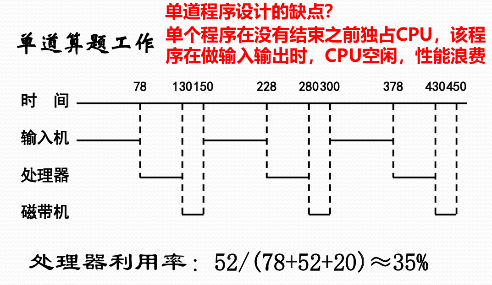

​	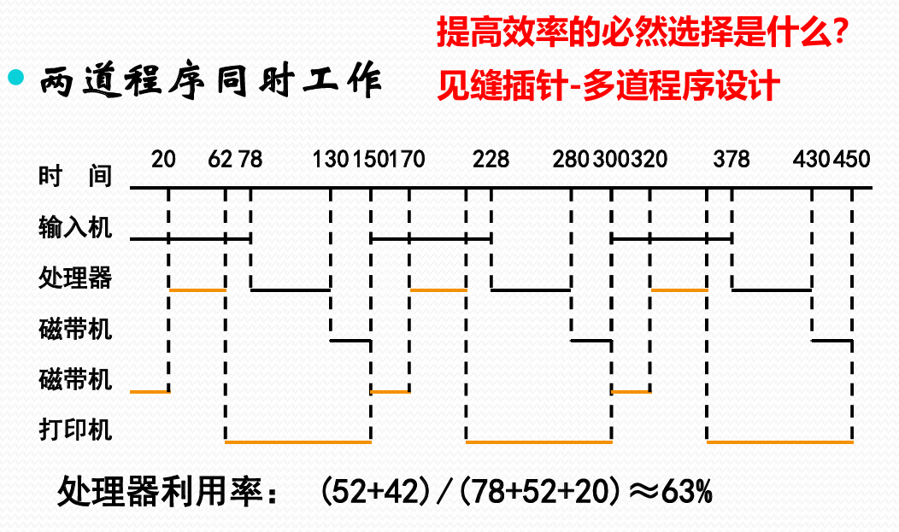

==多道程序设计的实现：进程==

**实现要点：**

 **如何使用资源**：调用操作系统提供的服务例程(如何陷入操作系统)

 **如何复用CPU**：调度程序(在CPU空闲时让其他程序运行)

 **如何使CPU与I/O设备充分并行**：设备控制器与通道(专用的I/O处理器)

 **如何让正在运行的程序让出CPU**：中断(中断正在执行的程序，引入OS处理)

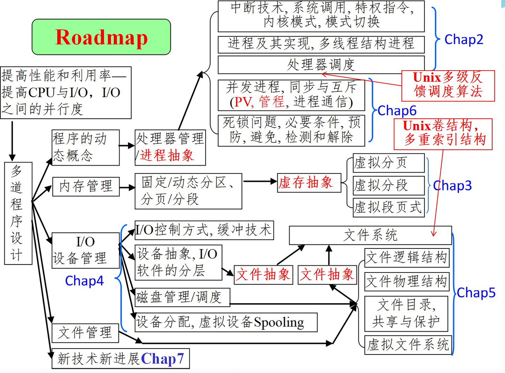

### 操作控制计算机的视角

OS的操作接口——**系统程序**

OS的两类**作业级接口**：

​	 **脱机**作业控制方式(offline)：通过**作业控制语言**编写**脚本或作业描述文件**交给系统自动执行。例如批处理、脚本

​	 **联机**作业控制方式(online)：通过**操作控制命令**与系统交互，输入指令得到反馈。例如**分时**OS的交互控制方式

### 人机交互视角

趋势: 行命令->全屏->GUI界面

**WIMP界面**: 窗口(Windows) 、图标(Icons)、 菜单(Menu) 和指示装置(Pointing  Devices)为基础的图形用户界面

### 程序接口视角-系统调用⭐

**系统调用**：**操作系统**实现的完成某种特定功能的过程；为所有运行程序提供访问操作系统的接口

**陷入处理机制**：计算机系统中**控制和实现系统调用**的机制

陷入指令：也称访管指令，或异常中断指令，计算机系统为实现系统调用而引起处理器中断的指令

每个系统调用都事先规定了**编号**，并在**约定寄存器**中规定了传递给内部处理程序的**参数** 

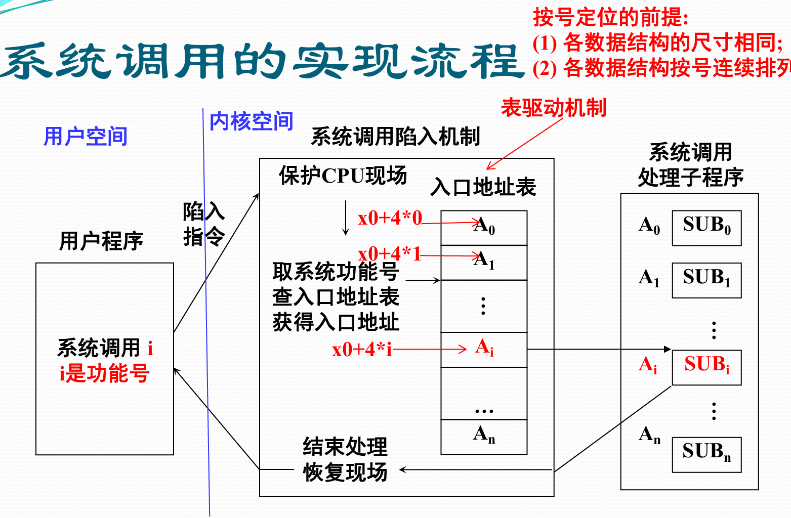

### 系统结构的视角

操作系统**内核**：

1. 单内核
2. 微内核
3. 混合内核
4. 外内核

# 二、处理器管理

## 处理器

### 处理器与寄存器

寄存器分为三类：  **用户程序可见**寄存器、 **控制与状态**寄存器、 **程序状态字PSW**

1. **用户程序可见寄存器**
     	1. 数据寄存器：通用寄存器
      2. 地址寄存器：索引、栈指针、段地址等寄存
2. **控制与状态寄存器**
   1. 程序计数器PC：存储将取指令的地址
   2. 指令寄存器IR：存储最近使用的指令
   3. 条件码CC：CPU为指令操作结果设置的位， 标志正/负/零/溢出等结果
   4. 标志位：中断位、中断允许位、中断屏蔽位、 处理器模式位、内存保护位、…，等
3. **程序状态字PSW**
   1. PSW既是一个**概念**：指记录当前程序运行的动态信息，例如控制与状态寄存器内的一些内容
   2. PSW也是计算机系统的**寄存器**：通常设置一组控制与状态寄存器，也可以专设一个PSW寄存器

###  指令与处理器模式

- **特权指令**：只能被操作系统**内核**使用的指令

- **非特权指令**：能够被所有程序使用的指令

设置**处理器模式**实现**特权指令管理**

  计算机一般设置0、1、2、3等四种运行模式， 建议分别对应：0操作系统内核、1系统调用、 2共享库程序、3用户程序等保护级别

  每种运行模式可以规定执行的指令**子集**

## 中断管理

 **操作系统是“中断驱动”的**，换言之，**中断是激活操作系统的唯一方式**（广义）

###  中断驱动与进程状态转换⭐

​	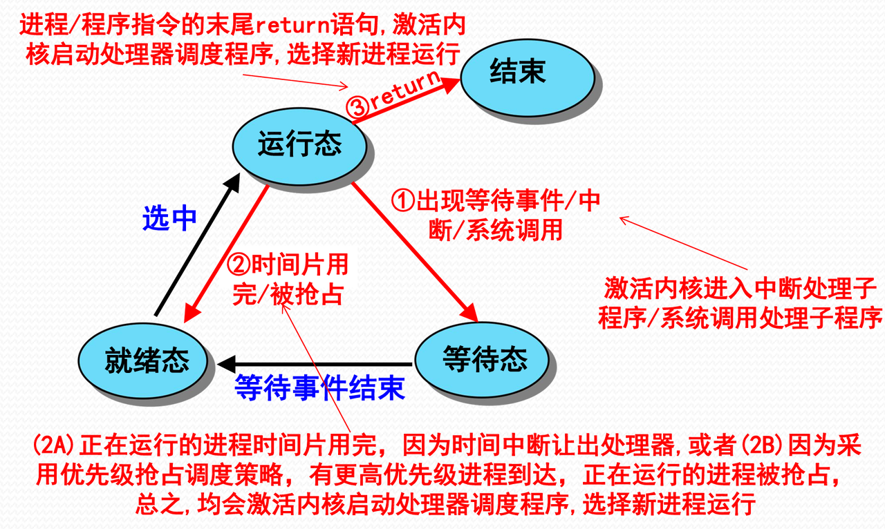

**中断（狭义）**：处理器**外**的中断事件

**异常**：运行指令的中断

**系统异常**：经陷入指令触发**系统调用**

###  中断源

1. 处理器硬件故障中断事件
2. **程序性**中断事件（如算术异常、指针越界等执行机器指令时的问题）
3. **自愿性中断**，即**系统调用**（处理流程是：陷入OS，保护现场，根据功能号查入口地址，跳转具体处理程序）
4. I/O中断事件
5. 外部中断

### 中断系统

响应和处理中断的系统，包括**硬件子系统（响应）**和**软件子系统（处理）**两部分

- **中断响应处理与指令执行周期**：可以在指令执行周期最后增加一个**微操作**， 以响应中断

- **中断装置**：**发现并响应**中断/异常的**硬件**装置
- **中断控制器**：中断请求 -> 中断寄存器内设置中断 -> 指令处理结束前检查是否有中断 -> 查询中断向量表 -> 引出中断处理程序
- **陷阱与系统陷阱**：指令的逻辑和实现线路的一部分
- **中断响应过程**：
  - 1. 发现中断源，提出中断请求
       1. 发现中断寄存器中记录的中断
       2. 决定这些中断是否应该屏蔽 
       3. 当有多个要响应的中断源时，根据规定的优先级选择一个
    2. 中断当前程序的执行 ，**保存当前程序的PSW/PC到核心栈 （进程映像的组成部分）**
    3. 转向操作系统的中断处理程序
- **中断处理程序**：**处理中断事件**和**恢复正常操作**
  - 处理中断事件：保护处理器状态、分析PSW、处理中断
  - 恢复正常操作：直接返回 或者 根据进程调度选择新的进程
- **多中断的响应与处理**：**优先级**和**中断嵌套**

## 进程管理

==**进程**是一个具有一定独立功能的**程序**关于某个**数据集合**的一次运行活动==

进程是操作系统进行**资源分配和调度的一个独立单位**（在多线程技术中有所变化）

### 进程状态模型

​	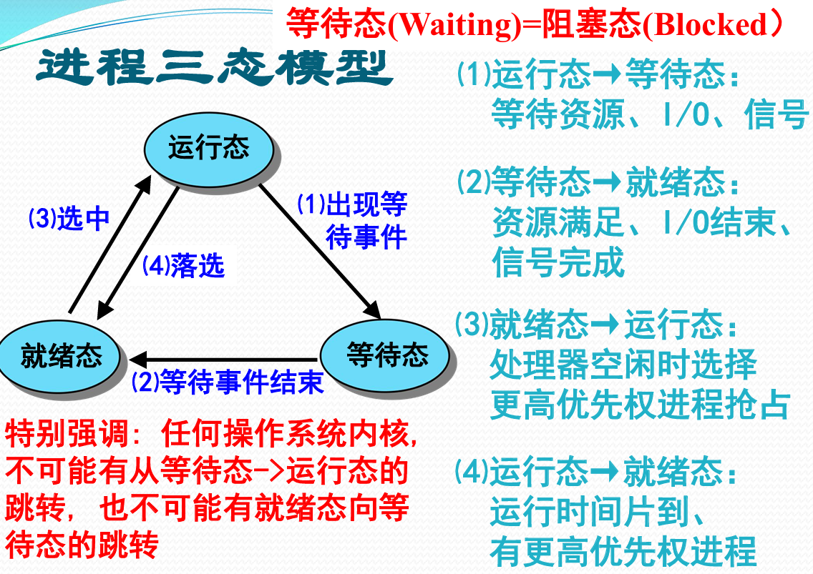

（可联系到第六章**信号量与PV操作**）

 **进程挂起：OS无法预期进程的数目与资源需求，计算机系统在运行过程中可能出现资源不足（低性能，死锁）的情况**

​	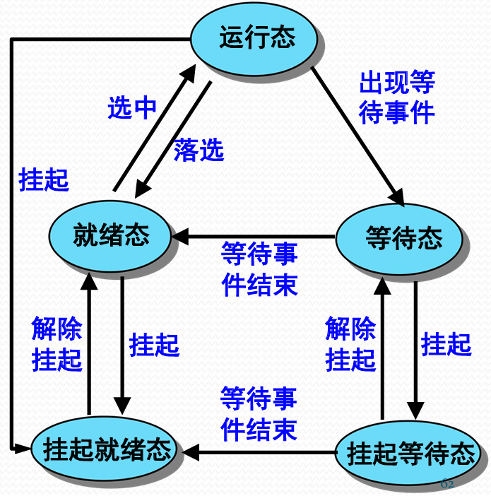

**挂起态与等待态**有着本质区别，后占有已申请到的资源处于等待，前者**没有任何资源**

### 进程的数据描述

==进程控制块PCB==：记录与刻画进程状态与环境信息的数据结构

​	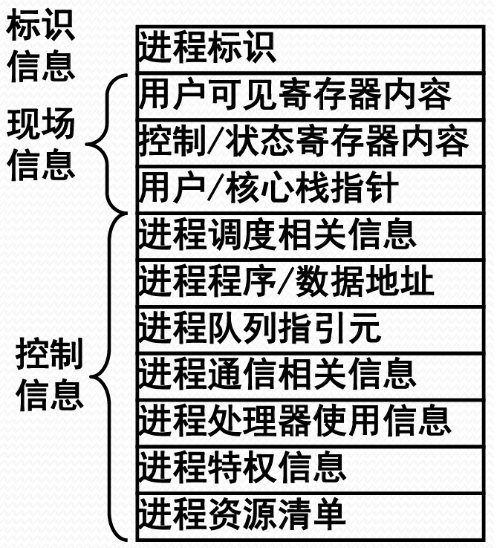

**标识信息**：存放唯一标识该进程的信息

**现场信息**：存放该进程运行时的处理器现场信息（寄存器内容、核心栈及用户栈指针等）

**控制信息**：存放与管理、调度进程相关的信息

### 进程映像⭐

<u>某一时刻进程的内容及其执行状态集合</u>，是进程在内存中的**完整表示**，包含程序执行所需的**所有数据和代码**。

- **进程控制块(PCB)**: 保存进程的标识信息、状态信息和控制信息
- **进程程序块**: 进程执行的程序空间 
- **进程数据块**: 进程处理的数据空间，包括数据、处理函数的用户栈和可修改的程序 
- **核心栈**:  进程在内核模式下运行时使用的堆栈，中断或系统调用使用

​	==**进程映像是内存级的物理实体，又称为进程的内存映像； 进程映像 ≠ 进程控制块(PCB)**==

​	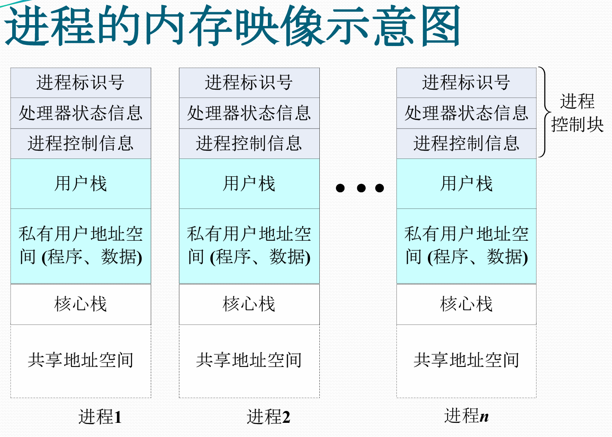

> **区分进程映像、进程控制块、程序状态字：**
>
> | 特征     | 程序状态字                             | 进程控制块                                               | 进程映像                                         |
> | :------- | :------------------------------------- | :------------------------------------------------------- | :----------------------------------------------- |
> | **本质** | CPU **硬件寄存器**                     | 操作系统内核维护的**核心数据结构**                       | 内存中**数据和代码的区域集合**                   |
> | **目的** | 反映 **CPU 当前执行瞬间** 的状态       | **管理系统内所有进程**（唯一标识、状态、资源、调度信息） | 定义**进程在内存中的布局和内容**（代码数据堆栈） |
> | **焦点** | CPU 计算状态、下一条指令地址、执行模式 | 进程所有关键信息（状态、标识、上下文、资源）             | 指令和数据的物理存储位置                         |

### 进程上下文

进程的执行需要环境支持，包括**CPU现场**和**Cache中的执行信息**

**进程上下文 = 进程物理实体 + 支持进程运行的环境**：

1. **用户级上下文**：用户程序块/用户数据区/用户栈/用户共享内存
2. **寄存器上下文**：PSW/栈指针/通用寄存器
3. **系统级上下文**：PCB/内存区表/核心栈

### 进程管理的实现-原语

为防止与时间有关的错误，应使用**原语** （联系后面的信号量与PV操作内容）

### 进程切换与模式切换

- **用户模式到内核模式**：由**中断/异常/系统调用**中断用户进程执行而触发
- **内核模式到用户模式**：OS执行**中断返回指令**将控制权交还用户进程而触发

## ⭐多线程技术

### 多线程环境

问题：单线程进程开销大，效率低，粒度低

解决：把进程的两项功能，即“**独立分配资源**”与 “**被调度分派执行**”分离开来。

**进程作为系统资源==分配和保护==的独立单位，不需要频繁地切换；**

**线程作为系统==调度和分派==的基本单位，能轻装运行，会被频繁地调度和切换** 

在多线程环境中，进程是操作系统中进行保护和资源分配的独立单位。具有:  

1. 用来容纳进程映像的**虚拟地址空间** （联想第三章的虚存管理）
2. 对进程、文件和设备的**存取保护机制**

线程是进程的一条执行路径，是**调度的基本单位**（处理器调度最终落在线程一级）

线程状态有**运行、就绪和睡眠**，线程不必要设计**挂起态**（不独立享有资源）

### KLT与ULT

#### 内核级线程

 线程管理的所有工作由**OS内核**来做，OS提供了一个应用程序设计接口API，供开发者使用KLT  

 **OS直接调度KLT**

 特点：

- 进程中的一个线程被阻塞了，内核能调度**同一进程的其它线程**占有处理器运行
- 多处理器环境中，内核能同时调度同一进程中多个线程**并行**执行
- <u>同一进程中，控制权从一个线程传送到另一个线程时需要**模式切换**， 系统开销较大</u>

#### 用户级线程

 **用户空间**运行的**线程库**，提供多线程应用程序的开发和运行支撑环境 

 任何应用程序均需通过线程库进行程序设计， 再与线程库连接后运行 

 线程管理的所有工作都由**应用程序**完成，**内核没有意识到线程的存在**

 特点：

- <u>线程**切换不需要内核模式**</u>，能节省模式切换开销和内核的宝贵资源
- 允许进程按应用特定需要选择调度算法
- 能运行在任何OS上
- 不能利用多处理器的优点，OS调度进程， 仅有一个ULT能执行；一个ULT的阻塞，将引起整个进程的阻塞

​	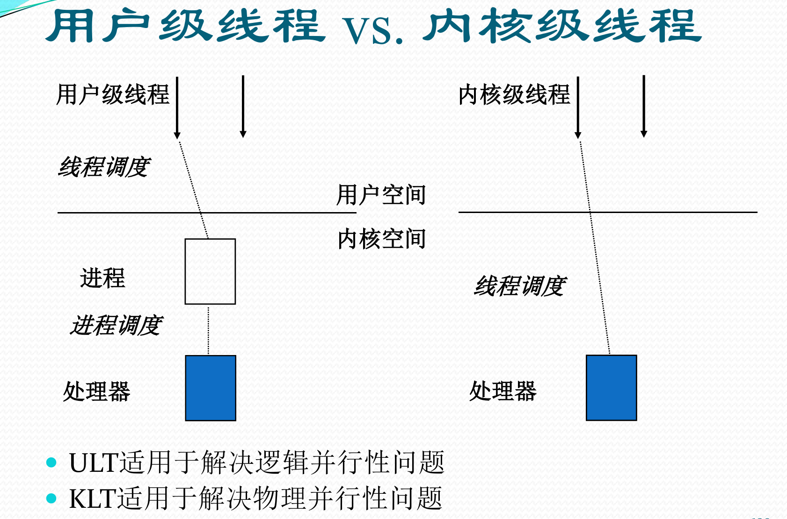

#### Jacketing技术

 当线程陷入**系统调用**时，执行jacketing程序 

 由jacketing 程序来检查资源使用情况， 以决定**是否执行进程切换或传递控制权**给另一个线程

### 多线程实现的混合策略

​	**线程创建**是完全在**用户空间**做的，线程的**调度和同步**也在**应用程序**中进行（ULT）

​	单应用的**多个ULT可以映射成一些（少于ULT数目）KLT**，通过**调整KLT数目**， 可以达到较好的并行效果（KLT）

​	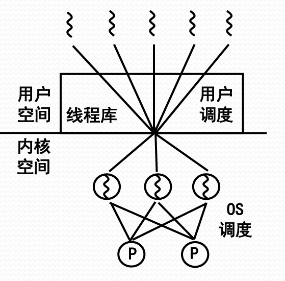

**KLT三态，系统调度负责**

**ULT三态，用户调度负责**

> ULT活跃态绑定KLT的三态 ；活跃态ULT运行时可激活用户调度
>
> 阻塞系统调用可使用Jacketing启动用户调度， 调整活跃态ULT

​	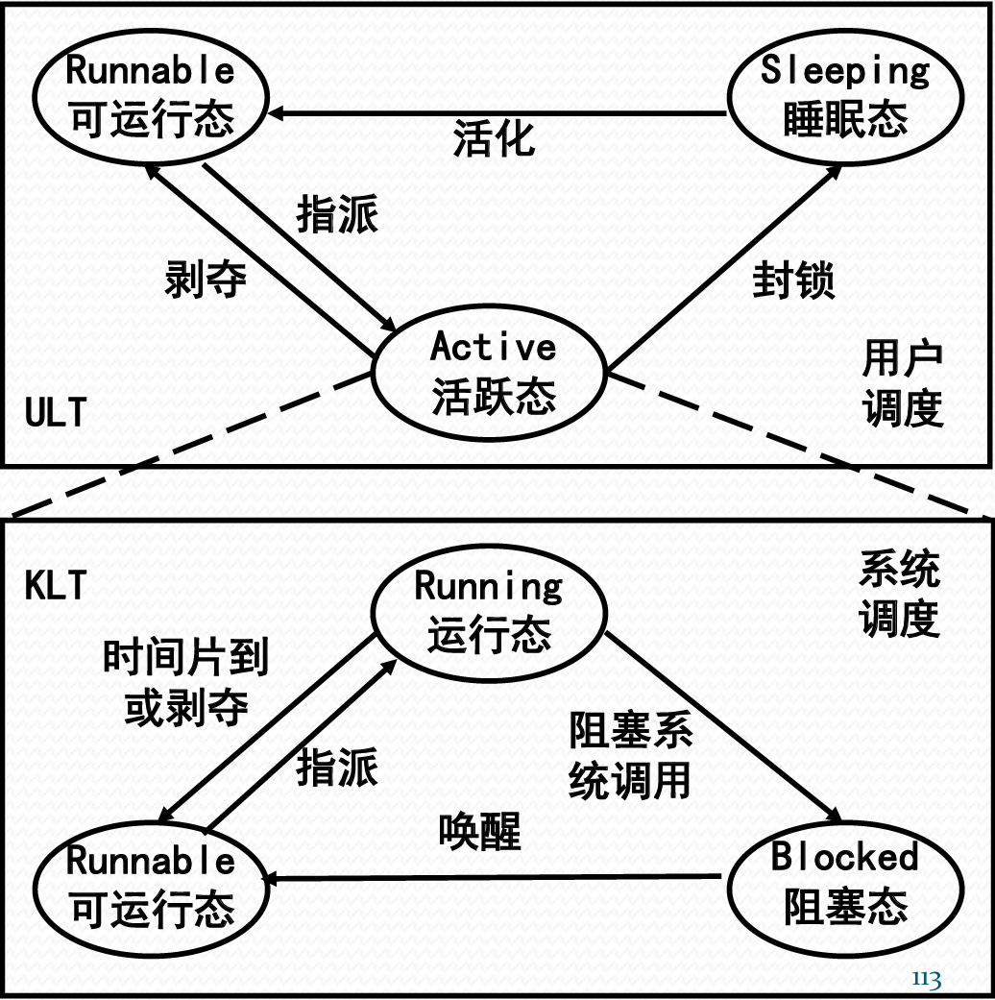

> 为什么是活跃态绑定 KLT 的三态？

> 因为如果绑定的 KLT 不再运行，则也不再运行。活跃态代表了 KLT，可能是运行态、可运行态、阻塞态

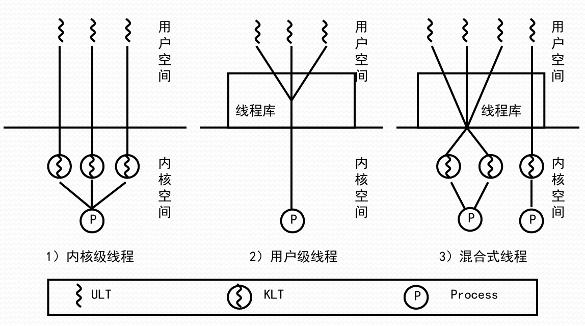

## 处理器调度

### 处理器调度的层次

**高级调度、中级调度、初级调度**

> 高级调度，又称长程调度，作业调度 ，决定能否加入到执行的进程池中 ；	有关**作业**
>
> 中级调度，又称平衡负载调度 ，决定主存中的可用进程集合 ；		 有关**挂起**
>
> 低级调度，又称短程调度，进程调度 ，决定哪个可用进程占用处理器执行 ；      有关**三态**

​	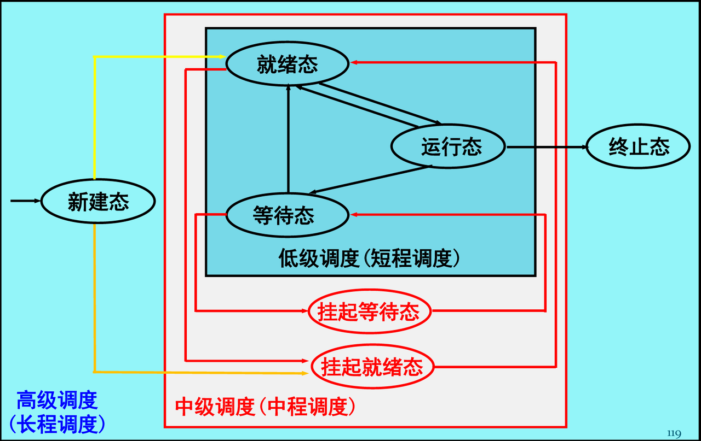

### 处理器调度算法

==FCFS先来先服务==

​	非抢占式，不会饥饿

​	**对短进程不利**

==SPN最短进程优先==

​	优先处理所需时间短的，抢占，会饥饿

==HRRN最高响应比优先==
$$
\text{响应比}=  \frac{\text{等待时间} + \text{期待(预估)处理器的服务时间}}{\text{期待(预估)处理器的服务时间}}
$$
​	非抢占，要等一个进程计算结束后，再计算其他等待进程的响应比来决定运行哪个进程

==SRT最短剩余时间优先==

​	选择预期剩余时间更短的进程，抢占，会饥饿

==RR时间片轮转调度算法⭐==

​	根据各个进程进入就绪队列的时间先后轮流占有CPU一个时间片

​	选择长短合适的时间片, 过长则退化为先来先服务算法,  过短则调度开销大 

==分级调度算法Feedback⭐==

​	 又称多队列策略，反馈循环队列，多级反馈队列调度算法 

​	同样是分配时间片，但是设有多级队列；初始进入最高优先级队列，若时间片用完进程还未结束，则进入下一级队列的队尾（若已在最下级，则重新进入该级队尾）

# 三、存储管理

## 基础

### 主要模式、功能与虚拟存储器

​	逻辑地址：用户编程所使用的地址空间

​	物理地址：程序执行所使用的地址空间

**段式程序设计**：把一个程序设计成多个段 ，代码段、数据段、堆栈段等等

**主存复用**：按照分区复用、按照页框(页架)复用（**分区大小固定或可变、页框大小固定**）

**基本模式**：**单连续存储管理、段式存储管理、页式存储管理、段页式存储管理**

> 1. 单连续存储管理：**一维逻辑地址**空间的程序占用**一个**主存固定**分区**或可变分区，<u>不可虚拟</u>
> 2. 段式存储管理：**段式二维**逻辑地址空间的程序占用**多个**主存**可变分区**，<u>可虚拟</u>
> 3. 页式存储管理：**一维逻辑地址**空间的程序占用**多个主存页架**区，<u>可虚拟</u>
> 4. 段页式存储管理：**段式二维逻辑**地址空间的程序占用**多个主存页架**区，<u>可虚拟</u>

存储管理的功能

​	**地址转换：静态重定位，动态重定位**（区别在于是装入内存时转换还是CPU执行时转换）

​	分配与去配、共享、保护、扩充

虚拟存储器

​	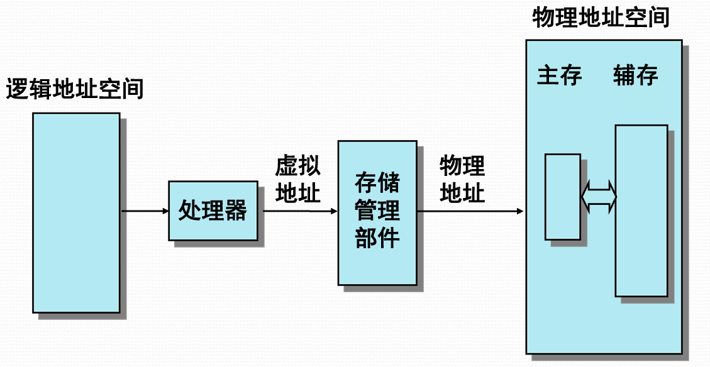

### 存储器硬件

**Cache**：介于CPU和主存储器间的高速小容量存储器，由静态存储芯片SRAM 组成。根据成本控制，划分为L1、L2、L3三级。

- L1 Cache：分为数据缓存和指令缓存。32-256KB
- L2 Cache：分内置和外置两种，后者性能低一些；512KB-8M
- L3 Cache：多为外置。但总线改善比设置L3更加有利于提升系统性能

**动态重地位的硬件支撑**：处理器将逻辑地址与限长寄存器比较是否越界，再与基址寄存器相加得到物理地址。

​	定义允许访问的地址范围: (基址寄存器, 限长寄存器)

## 单连续分区存储管理

### 单连续管理

每个进程占用一个物理上完全连续的存储空间(区域)，分区有固定和可变两种

主存区域划分为**系统区与用户区**，设置一个**栅栏寄存器**界分两个区域，一般采用**静态重定位**进行地址转换

### 可变分区存储管理

==最先适应分配算法(First fit) ：第一个足够大的==

==邻近适应分配算法(Next fit)： 上次位置继续找==

==最优适应分配算法(Best fit)： 最小足够大的==

==最坏适应分配算法(Worst fit)： 最大的==

> **固定分区**方式会产生**内存内零头**
>
> **可变分区**方式会产生**内存外零头**
>
> <u>最优适配算法最容易产生外零头</u>，任何适配算法都**不能避免**产生外零头

## 页式存储管理

### 地址转换

​	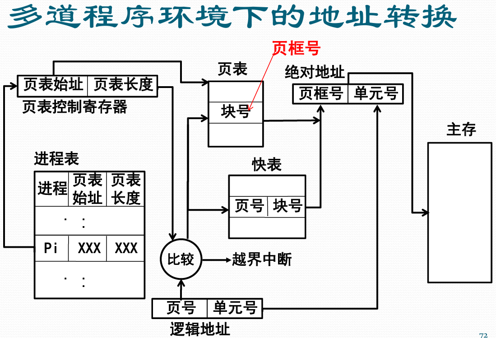

值得一提的是，**页表表项不包含页号**，可以把页表理解成数组（当然这里忽略了一些标识位），页号作为**索引**，由页表始址找到页表的位置

而快表表项包含**页号和页框号**（还有一些标识位），因为快表是要更新的，页号没有办法作为索引

### 页式虚拟存储

> 抖动：将要被用到之前扔出，操作系统又不得不很快把它取回来

现代OS的**主流存储管理技术**；首次只把进程第一页信息装入主存， 称为**请求页式存储管理**

​	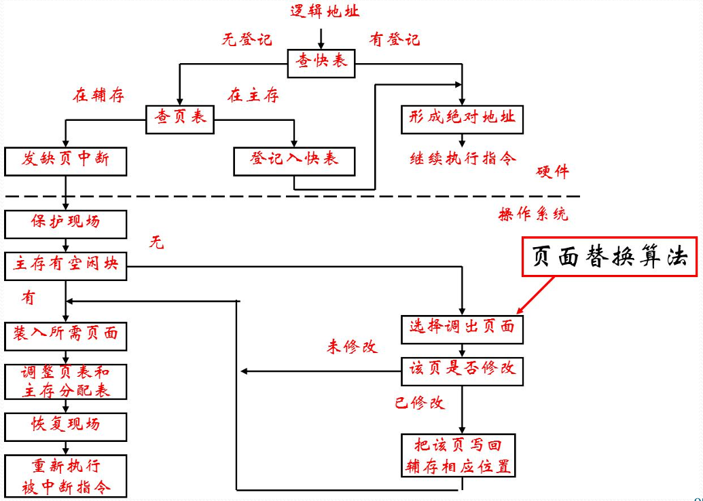

### 页面调度⭐

==OPT页面调度算法==

​	理想假设，选择最长时间后再访问的页，只可模拟，不可实现

==先进先出FIFO页面调度算法==

​	淘汰最先调入主存的那一页

==最近最少用LRU页面调度算法==

​	淘汰最近一段时间较久未被访问的那 一页

​	**实现**：建一个引用标志位，初始0（表示未使用）；**在一定时钟周期内中断一次，将引用位强制置0**；访问页时，将该页的引用位置1（**表示该页在本次统计周期内被访问过**）；需要淘汰页时随机从引用位为0的页中选择。

==最不常用LFU页面调度算法==

​	淘汰最近一段时间内访问次数较少的页面

​	**实现**：同样基于**时间间隔中断**，重置计数器；每访问页1次就给计数器加1；选择计数值最小的页面淘汰。

==时钟CLOCK页面调度算法==

​	循环队列机制，使用页引用标志位

​	**实现**：**页面调入或访问时，引用位置1**；淘汰页面时，循环扫描队列，遇到1就置0，遇到0就淘汰。

​		

> Belady's Anomaly (Belady异常)：分配更多的帧，反而缺页率更高。新增的帧反而迫使某些关键页面被提前换出。

**==局部最佳页面替换算法==**

​	如果该页面在时间间隔(t, t+τ)内未被再次引用，那么就移出；否则，该页被保留在进程驻留集中。（看未来）

​	τ为一个系统常量，间隔(t, t+τ)称作**滑动窗口** 。

​	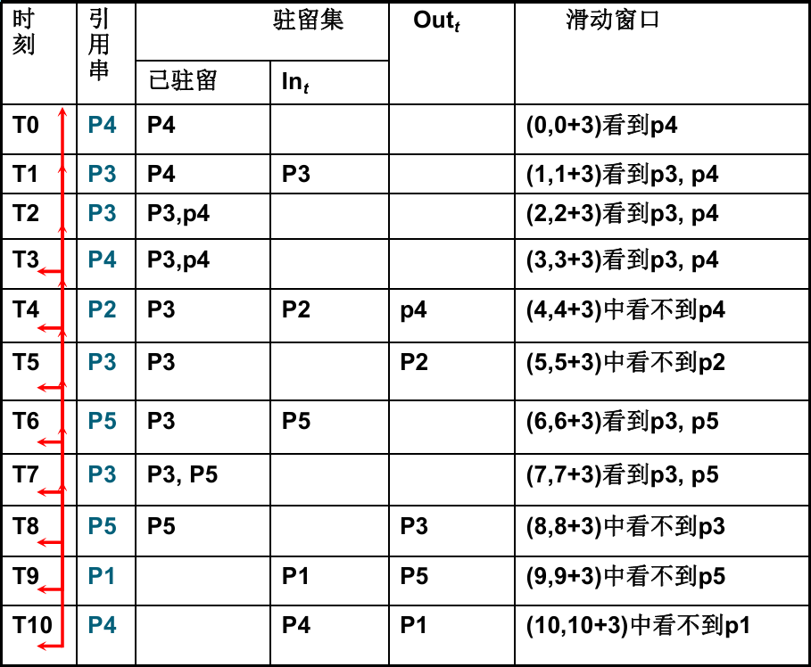

**==工作集置换算法==**

​	W(t，Δ)表示在时刻t-Δ到时刻t之间(t-Δ，t)所访问的页面集合，进程在时刻t的工作集。

​	在t时刻，**保留工作集内的页，淘汰工作集外的页**。

​	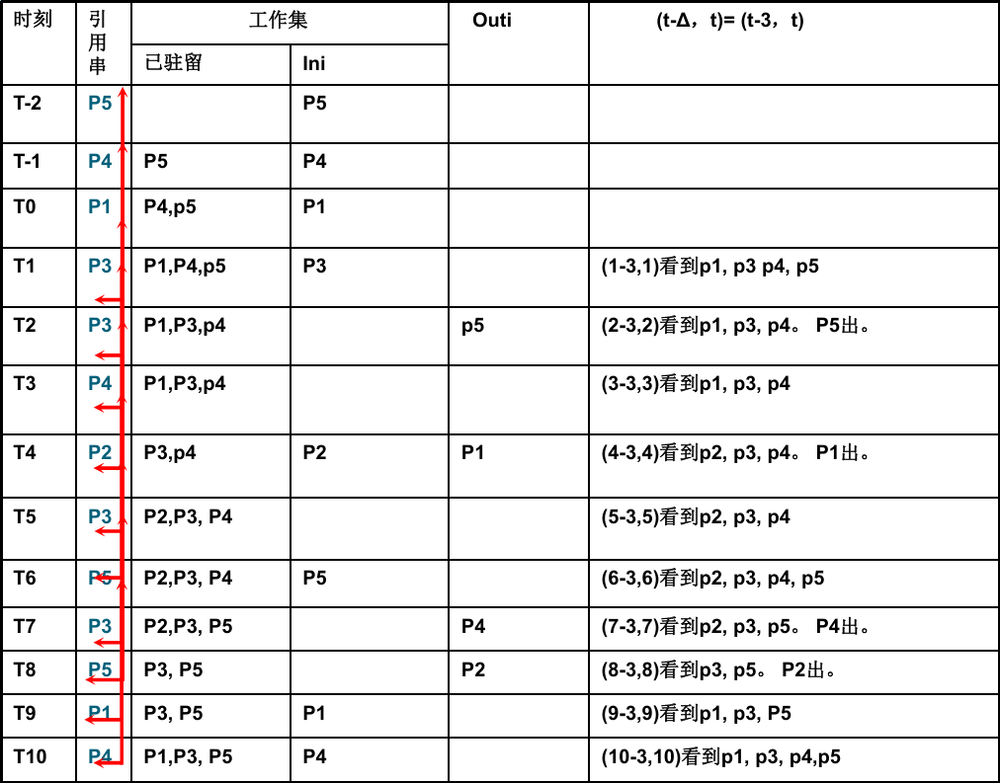

>  **伙伴系统**：不停折半直到找到能刚好容纳的区域，释放时再对于伙伴空闲区进行合并。

### 反置页表

**二级页表**：页目录表，它的每个表项对应一个页表页，而页表页的每个表项给出了页面和页框的对应关系。在此基础上有**多级页表**的概念

**反置页表IPT**：**针对内存中的每个页框建立一个页表， 按照块号排序**

反置页表的页表项：虚拟地址页号、进程标志符、标志位、链指针

>  反置页表全OS只有一个，外部页表每个进程一个。

**反置页表地址转换**：

​	MMU通过哈希表把进程标识和虚页号转换成一个哈希值，指向IPT的一个表目；

​	<u>遍历链指针找到所需进程的虚页号， 该项的**索引**就是页框号</u>

> 同样，IPT本身表项不包含页框号，而是以索引指示页框号。
>
> 哈希函数是为了限制查找范围，减少查找时间。当然也可以直接从头开始查找，只不过效率低。

​	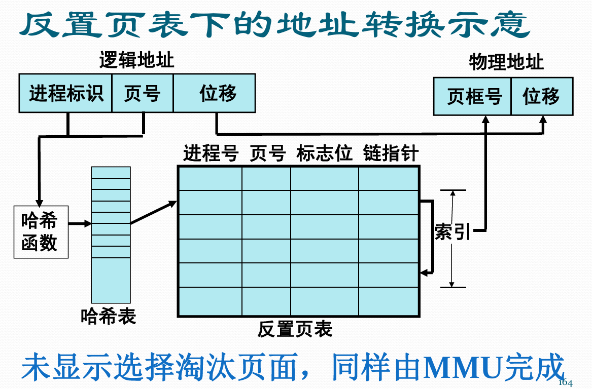

> 为什么要反置页表？
>
> 页表的一大问题是：设置的虚拟地址空间越大，页表的大小也越大，因为页表一项对应一个**虚拟页**，大小与虚拟页数直接挂钩。
>
> 而反置页表的思想是：**给出一个虚拟地址，试问有没有哪个物理页面映射了它，如果有，找出来**。因此反置页表只需一张，并且大小只与实存页相关，与设置了多少虚拟页无关。

## 段式存储管理

### 段式程序设计

​	每个程序可由若干段组成，每一段都 可以从“0”开始编址，段内的地址是连续的

​	逻辑地址由两部分组成：  **段号：单元号**

段式存储管理基于**可变分区**存储管理实现，一个进程要占用多个分区

硬件需要增加一组用户可见的**段地址寄存器**（代码段、数据段、堆栈段，附加段），供地址转换使用

存储管理需要增加设置一个**段表**，每个段占用一个段表项，包括：**段始址**、**段限长**，以及**标志位**。

**流程**：得到逻辑地址，查段表，得到段始址和限长，判断越界，然后**<u>绝对地址=段始址+单元号</u>**。

### 段式虚拟存储

​	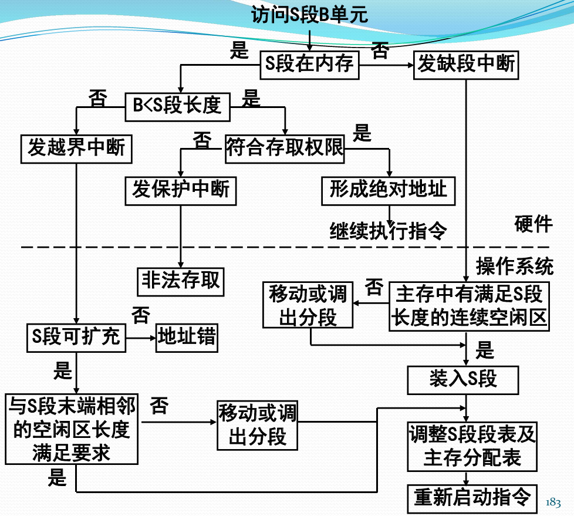

### 段页式存储管理

段式存储管理可以**基于页式存储管理实现**，每一段不必占据连续的存储空间，可存放在不连续的主存页框中

​	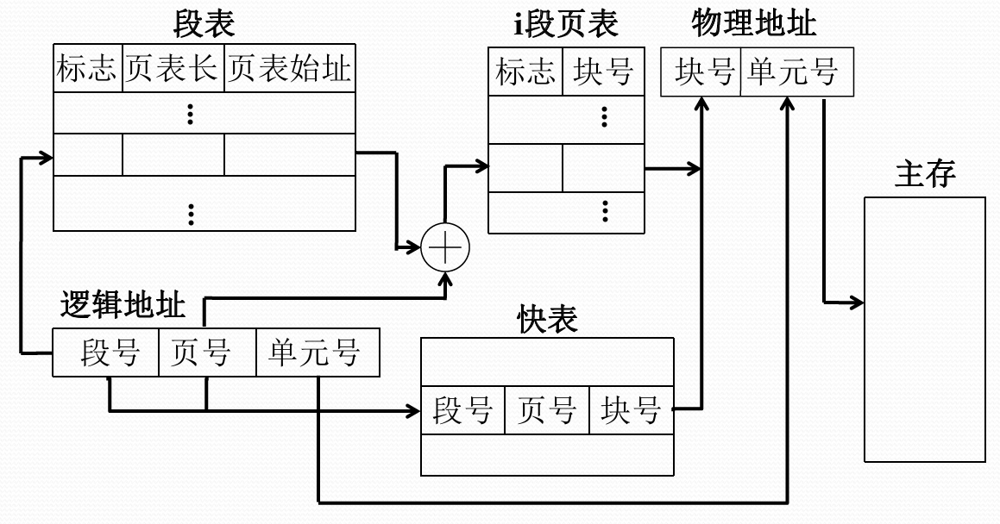

> **分段与分页**
>
> |      | 单位 | 用户可见 | 长度决定 | 起始地址     | 连结后地址 |
> | ---- | ---- | -------- | -------- | ------------ | ---------- |
> | 分段 | 逻辑 | 可见     | 用户     | 任意         | 二维       |
> | 分页 | 物理 | 不可见   | 系统     | 页大小整数倍 | 一维       |