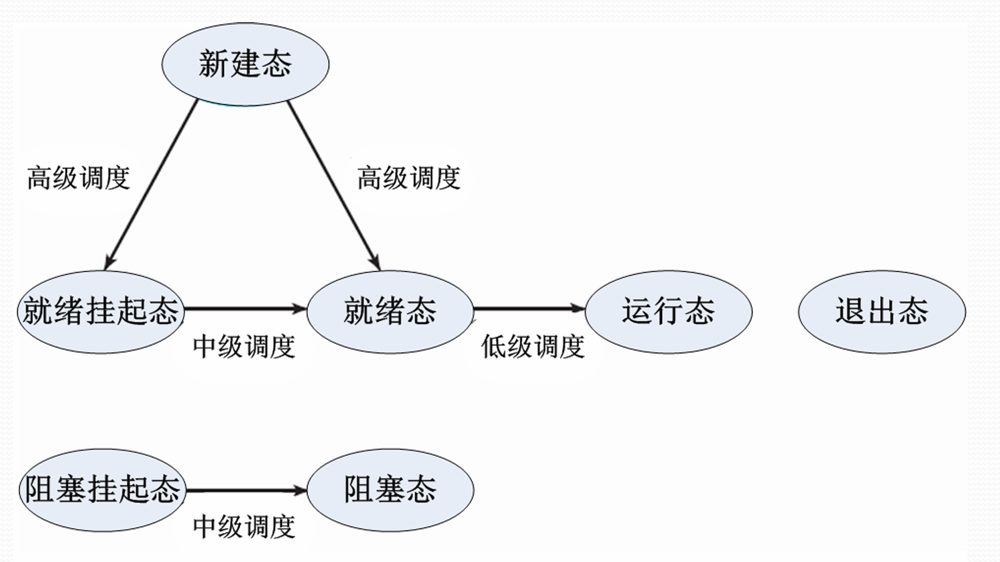
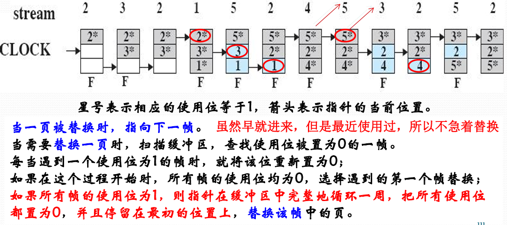
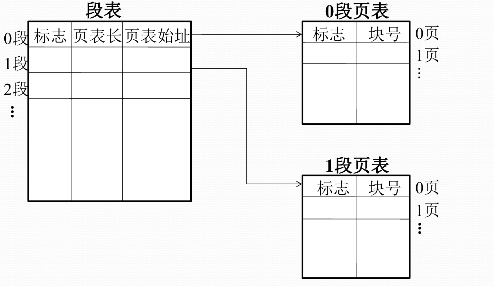

# 一、计算机系统概览

> 1. 了解计算机硬件与操作技术的发展 
>    - 概念: 分时操作系统、实时操作系统 
>
> 2. 掌握多道程序设计的概念 
> 3. 掌握计算机系统的组成 
> 4. 了解计算机体系结构与计算机总线、处理器、存储器、I/O设备以及I/O控制方式 
> 5. 掌握计算机系统的层次结构

## 计算机系统的组成	

==分为**硬件子系统**和**软件子系统**==

### 计算机硬件系统

- **中央处理器** 
  - 运算单元 
  - 控制单元 
- **主存储器** 
- **外围设备** 
  - 输入设备 
  - 输出设备 
  - 存储设备 
  - 网络通信设备 
- **总线**

**存储程序计算机（冯诺依曼）**：以**运算单元**为中心，控制流由指令流产生；采用**存储程序**原理，面向主存组织数据流；主存是**按地址访问**、**线性编址**的空间；指令由**操作码和地址码**组成；数据以**二进制**编码。

**总线**：各功能部件的公共通信干线，包括**一组控制线、一组数据线、一组地址线**。分为**内部（CPU）总线、系统总线、通信总线**。（南北桥）

**中央处理器（CPU）**：运算核心（Core） 和控制单元（ Control Unit）

1. 运算逻辑部件
2. 寄存器部件
3. 控制部件

**I/O控制方式**：**轮询、中断、DMA（直接内存访问）**

### 计算机软件系统

**组成**：**系统软件（+支撑环境）+应用软件**

​	

**软件开发的不同层次**：

1. 计算机**硬件资源**：机器语言
2. 操作系统之**资源管理**：机器语言+**广义指令**
3. 操作系统之**文件系统**：机器语言+**系统调用**
4. **数据库**管理系统： + 数据库语言
5. **语言处理**程序：面向问题的语言（高级语言）

## 计算机系统的层次结构

​	

​	

## 计算机操作系统

###  OS概念

计算机系统最基础的系统软件，管理软硬件资源、控制程序执行，改善人机界面，合理组织计算机工作流程，为用户使用计算机提供良好运行环境

==**OS**是计算机系统的公共软件基础设施，所有应用程序共用OS服务，且OS内核是反应式**reactive机制（中断驱动的）**==

### ⭐类型-操作控制角度

1. **多道批处理操作系统(把作业成批地交给计算机)**
   - **成批**处理作业 
   - **作业控制语言**与**作业说明书** 
   - **脱机**工作方式 
   - 追求系统效率与吞吐量
2. **分时操作系统(多终端访问)**
   - 用户通过**终端**直接控制程序执行 
   - **交互式**工作方式 
   - 交互型、友善性、**快速响应** 
   - 今天最常见的计算机操作方式
3. **实时操作系统(系统响应时间的重要性超过协同资源的利用率，必须在<u>规定时间</u>内完成任务，广泛用于卫星、火箭等)**
   - 过程控制系统 
   - 信息查询系统 
   - 事务处理系统 
   - 过程控制系统的处理步骤：数据采集、加工处理、操作控制、反馈处理

> 常见操作系统：
>
> **嵌入式**：LiteOS, 翼辉SylixOS…
>
> **移动端**：Android, iOS, 鸿蒙OS…
>
> **PC机器**：微软的桌面系统Windows
>
> **服务器**：CentOS，Ubuntu等Linux各类发行版, EulerOS, ...

### 资源管理视角

**驱动程序**：最底层的、直接控制和监视各类硬件(或文件)资源的部分；<u>隐藏底部硬件实现细节，向其他部分提供一个通用的、抽象的接口。</u>

**共享方式**

 <u>独占使用、并发使用</u>（一段时间内可以被几个进程使用）

**分配策略**

 <u>静态分配（进程运行前）、动态分配（使用资源前）、资源抢占式（被抢夺的进程需要回滚）</u>

### ⭐控制程序执行的视角-多道程序设计 

CPU速度与I/O速度不匹配的矛盾 -> **多道程序设计** -> **让多个程序同时进入计算机的主存储器进行计算**

​	

==多道程序设计的实现：为进入内存执行的程序建立管理实体——进程==

**实现要点：**

 **如何使用资源**：调用操作系统提供的服务例程(如何陷入操作系统)

 **如何复用CPU**：调度程序(在CPU空闲时让其他程序运行)

 **如何使CPU与I/O设备充分并行**：设备控制器与通道(专用的I/O处理器)

 **如何让正在运行的程序让出CPU**：中断(中断正在执行的程序，引入OS处理)

### 操作控制计算机的视角

OS的操作接口——**系统程序**

OS的两类**作业级接口**：

​	 **脱机**作业控制方式(offline)：通过**作业控制语言**编写**脚本或作业描述文件**交给系统自动执行。例如批处理、脚本

​	 **联机**作业控制方式(online)：通过**操作控制命令**与系统交互，输入指令得到反馈。例如**分时**OS的交互控制方式

### 人机交互视角

趋势: 行命令->全屏->GUI界面

**WIMP界面**: 窗口(Windows) 、图标(Icons)、 菜单(Menu) 和指示装置(Pointing  Devices)为基础的图形用户界面

### ⭐程序接口视角-系统调用

==**系统调用**：**操作系统**实现的完成某种特定功能的过程；为所有运行程序提供访问操作系统的接口==

**陷入处理机制**：计算机系统中**控制和实现系统调用**的机制

**陷入指令**：也称访管指令，或异常中断指令，计算机系统为实现系统调用而引起处理器中断的指令

每个系统调用都事先规定了**编号**，并在**约定寄存器**中规定了传递给内部处理程序的**参数** 

### 系统结构的视角

操作系统**内核**：

1. **单内核**：内核中各部件杂然混居
2. **微内核**：结构性部件与功能性部件的分离
3. **混合内核**：单内核与微内核的折中
4. **外内核**：嵌入式

## 操作系统的结构

1. **单体式**结构：全部操作系统在内核态以**单一程序**运行，网状结构易死锁
2. **层次式**结构：将OS的功能分为不同层次
3. **虚拟机**结构：单个计算机部件抽象为几个不同的执行部件，仿佛一台计算机上有多个**独立的执行环境**。
4. **微内核**结构：只有一个核心模块——微内核——运行在内核态，其他模块作为用户进程
5. **客户/服务器**结构：操作系统最基本的部分放在内核，其它绝大部分功能都放在微内核外的一组服务器（进程）中实现。它们运行在用户态。

# 二、处理器管理

> 1. 了解处理器寄存器 
> 2. 掌握处理器状态、特权指令、程序状态字 
> 3. 掌握指令执行周期 
> 4. 了解指令流水线 
> 5. 掌握中断和中断源 
> 6. 掌握中断响应和处理的过程 
> 7. 掌握中断的优先级和多重中断

## 处理器

### 处理器与寄存器

寄存器分为三类：  **用户程序可见**寄存器、 **控制与状态**寄存器、 **程序状态字PSW**

1. **用户程序可见寄存器**
     	1. 数据寄存器：通用寄存器
      2. 地址寄存器：索引、栈指针、段地址等寄存
2. **控制与状态寄存器**
   1. 程序计数器PC：存储将取指令的地址
   2. 指令寄存器IR：存储最近使用的指令
   3. 条件码CC：CPU为指令操作结果设置的位， 标志正/负/零/溢出等结果
   4. 标志位：中断位、中断允许位、中断屏蔽位、 处理器模式位、内存保护位、…，等
3. **程序状态字PSW**
   1. PSW既是一个**概念**：指记录当前程序运行的动态信息，包含：PC、IR、CC、**中断字、中断屏蔽**等
   2. PSW也是计算机系统的**寄存器**：通常设置一组**控制与状态**寄存器，也可以专设一个PSW寄存器

###  指令与处理器模式

**机器指令**：计算机系统执行的基本命令，是**中央处理器执行的基本单位**。操作码+操作数+状态码（特征码）

#### 指令周期与指令流水线

​	

#### ⭐处理器状态

- **管理状态**(**特权**状态、系统模式、特态或**管态**)：处理器可以执行**全部指令**，使用所有资源，并具有改变处理器状态的能力

- **用户**状态(目标状态、用户模式、常态或**目态**)：处理器只能执行**非特权指令**

- **特权指令**：只能被操作系统**内核**使用的指令（有可能对计算机造成**损害**的指令），如启动I/O指令、置PC指令等

- **非特权指令**：能够被**所有程序**使用的指令

设置**处理器模式**实现**特权指令管理**

  计算机一般设置0、1、2、3等四种运行模式， 建议分别对应：0操作系统内核、1系统调用、 2共享库程序、3用户程序等保护级别（现代OS一般只有0和3）

  每种运行模式可以规定执行的指令**子集**

### 处理器模式切换

​	同**进程管理**-**进程切换与模式切换**

​	==用户模式 -> 内核模式 : 中断==

​	==内核模式 -> 用户模式 : 中断返回指令==

## 中断管理

中断是指程序执行过程中，遇到急需处理的事件时，暂时中止CPU上现行程序的运行，转去执行相应的事件处理程序，待处理完成后再返回原程序被中断处或调度其他程序执行的过程.

**操作系统是“中断驱动”的**，换言之，**中断是激活操作系统的唯一方式**（广义）

### 中断与指令周期

​	

###  ⭐中断驱动与进程状态转换

​	

### 中断、异常、系统异常

**中断（狭义）**：处理器**外**的中断事件，I/O、时钟等

**异常**：运行指令的中断，地址异常、算数异常等

**系统异常**：经陷入指令触发**系统调用**

###  中断源

处理原则为：**保护现场，停止设备，停止CPU**，向操作员报告，等待人工干预

1. 处理器硬件故障中断事件
2. **程序性**中断事件（如算术异常、指针越界等执行机器指令时的问题）
3. **自愿性中断**，即**系统调用**（处理流程是：陷入OS，保护现场，根据功能号查入口地址，跳转具体处理程序）
4. I/O中断事件
5. 外部中断

### ⭐中断系统

响应和处理中断的系统，包括**硬件子系统（响应）和软件子系统（处理）**两部分

#### 中断响应处理与指令执行周期

​	可以在指令执行周期最后增加一个**微操作**， 以响应中断（图见“中断与指令周期”）

#### 中断装置

发现并响应**中断/异常的**硬件装置，不同装置处理不同中断

- 处理器外的中断：中断控制器
- 处理器内的异常：陷阱
- 请求OS服务的系统异常：系统陷阱

#### 中断控制器

​	CPU中的一个控制部件，包括**中断控制逻辑线路和中断寄存器**

1. 外部设备向其发出**中断请求IRQ**，在**中断寄存器**中设置已发生的中断
2. 指令处理结束前，会**检查中断寄存器**，若有**不被屏蔽的中断**产生，则改变处理器内操作的顺序，引出操作系统中的**中断处理程序 (查询中断向量表)**
3. **中断向量表(interrupt vector table)包含中断服务程序地址**的特定内存区域，这些服务程序是处理中断请求的代码

#### 陷阱与系统陷阱

​	**指令的逻辑和实现线路的一部分**

1. **执行指令出现异常**后，会根据异常情况转向操作系统的**异常处理程序**
2. **虚拟地址异常**后，需要**重新执行指令**， 往往**越过陷阱**设置页面异常处理程序
3. 执行**陷入指令**后，越过陷阱处理，触发**系统陷阱**，激活**系统调用**处理程序

#### 中断响应过程

1. 发现中断源，提出**中断请求**
   1. 发现**中断寄存器**中记录的中断
   1. 决定这些中断是否应该**屏蔽** 
   1. 当有多个要响应的中断源时，根据规定的**优先级**选择一个
2. 中断当前程序的执行 ，**保存当前程序的PSW/PC到核心栈 （进程映像的组成部分）**
3. 转向操作系统的**中断处理程序**

> 当出现中断事件后，把被中断进程的PSW保存为**旧PSW**，即完成断点信息保护。
>
> 操作系统**中断处理程序**的**新PSW**送到PSW寄存器中，成为当前的PSW。
>
> 这就是交换**新旧PSW**

#### 中断处理

**处理中断事件**和**恢复正常操作**

- 处理中断事件：保护处理器状态、分析PSW、处理中断
- 恢复正常操作：直接返回 或者 根据进程调度选择新的进程

#### 多中断的响应与处理

决定中断的次序

**中断屏蔽**，**优先级**和**中断嵌套**（中断处理的过程中再响应其他中断，会改变中断处理次序，需要限制层数）

Linux的中断

​	

## 进程管理

> 1. 掌握进程的概念，可再入过程 
> 2. 掌握进程的状态、进程的挂起，以及队列实现模型 
> 3. 掌握操作系统的控制结构 
> 4. 掌握进程描述与控制的数据结构 
> 5. 掌握处理机模式的概念 
> 6. 掌握进程创建、模式切换、进程切换、进程队列、 进程原语等进程实现的原理 
> 7. 了解操作系统的执行模型

### 进程概念

==**进程**是一个具有一定独立功能的**程序**关于某个**数据集合**的一次运行活动==

进程是操作系统进行**资源分配和调度的一个独立单位**（在多线程技术中有所变化）

进程的组成：**数据结构P + 内存代码C + 内存数据D + 通用寄存器信息R + 程序状态字PSW**

==共享的代码称为可再入程序==，如编辑器；可再入程序是**纯代码**的

### ⭐进程状态模型

​	

（可联系到第六章**信号量与PV操作**）

 **进程挂起：OS无法预期进程的数目与资源需求，计算机系统在运行过程中可能出现资源不足（低性能，死锁）的情况**

​	

**挂起态与等待态**有着本质区别，后占有已申请到的资源处于等待，前者**没有任何资源**

### 进程的数据描述

==进程控制块PCB==：记录与刻画进程状态与环境信息的数据结构

​	

1. **标识信息**：存放唯一标识该进程的信息

2. **现场信息**：存放该进程运行时的处理器现场信息（寄存器内容、核心栈及用户栈指针等）

3. **控制信息**：存放与管理、调度进程相关的信息

### 进程映像⭐

<u>某一时刻进程的内容及其执行状态集合</u>，是进程在内存中的**完整表示**，包含程序执行所需的**所有数据和代码**。

- **进程控制块(PCB)**: 保存进程的标识信息、状态信息和控制信息
- **进程程序块**: 进程执行的程序空间 
- **进程数据块**: 进程处理的数据空间，包括数据、处理函数的用户栈和可修改的程序 
- **核心栈**:  进程在内核模式下运行时使用的堆栈，中断或系统调用使用

​	==**进程映像是内存级的物理实体，又称为进程的内存映像； 进程映像 ≠ 进程控制块(PCB)**==

​	

> **区分进程映像、进程控制块、程序状态字：**
>
> | 特征     | 程序状态字                             | 进程控制块                                               | 进程映像                                         |
> | :------- | :------------------------------------- | :------------------------------------------------------- | :----------------------------------------------- |
> | **本质** | CPU **硬件寄存器**                     | 操作系统内核维护的**核心数据结构**                       | 内存中**数据和代码的区域集合**                   |
> | **目的** | 反映 **CPU 当前执行瞬间** 的状态       | **管理系统内所有进程**（唯一标识、状态、资源、调度信息） | 定义**进程在内存中的布局和内容**（代码数据堆栈） |
> | **焦点** | CPU 计算状态、下一条指令地址、执行模式 | 进程所有关键信息（状态、标识、上下文、资源）             | 指令和数据的物理存储位置                         |

### 进程上下文

进程的执行需要环境支持，包括**CPU现场**和**Cache中的执行信息**；进程上下文刻画了进程的**执行情况**。

**进程上下文 = 进程物理实体 + 支持进程运行的环境**：

1. **用户级上下文**：用户程序块/用户数据区/用户栈/用户共享内存
2. **寄存器上下文**：PSW/栈指针/通用寄存器
3. **系统级上下文**：PCB/内存区表/核心栈

### 进程管理的实现

**队列管理模块**是操作系统实现进程管理的核心模块

为防止与时间有关的错误，应使用**原语** （联系后面的信号量与PV操作内容）

原语的执行可以通过**关中断**实现

进程控制原语 + 进程通信原语

### 进程的控制与管理

**进程创建**

​	**进程表加一项**，**申请PCB**并初始化， 生成标识，**建立映像**，分配资源，移入**就绪队列**

> 相对的是**进程撤销**，从队列中移除，归还资源，撤销标识，回收PCB，移除进程表项

**进程阻塞**

​	**保存现场**信息，**修改PCB**，移入**等待**队列，调度其他进程执行

> 相对的是**进程唤醒**，等待队列中移出，修改PCB，移入就绪队列（该进程优先级高于运行进程触发抢占）

**进程挂起**

​	**修改状态**并出入相关队列，**收回内存**等资源送至对换区

> 相对的是**进程激活**，分配内存，修改状态并出入相关队列

### 进程切换与模式切换（处理器状态切换）

进程切换实质上就是**被中断运行进程与待运行进程的上下文切换**

进程切换需要在内核模式下，这就需要模式切换：

- **用户模式到内核模式**：由**中断/异常/系统调用**中断用户进程执行而触发，保存PSW/PC
- **内核模式到用户模式**：OS执行**中断返回指令**将控制权交还用户进程而触发，弹出PSW/PC

## ⭐多线程技术

> 1. 掌握多线程环境下进程和线程的概念 
> 2. 掌握线程的三种实现模型
> 3. 了解Windows的进程和线程管理 
> 4. 掌握Solaris的进程和线程管理模型

### 多线程环境

问题：单线程进程开销大，效率低，**并发开销大**

解决：把进程的两项功能，即“**独立分配资源**”与 “**被调度分派执行**”分离开来。

**进程作为系统资源==分配和保护==的独立单位，不需要频繁地切换；**

**线程作为系统==调度和分派==的基本单位，能轻装运行，会被频繁地调度和切换** 

> 操作系统中引入**进程**的目的是为了使多个程序**并发执行**，以改善资源使用率和提高系统效率；
>
> 操作系统中再引入**线程**，则是为了减少程序**并发执行**时所付出的时空**开销**

在多线程环境中，进程是操作系统中进行保护和资源分配的独立单位。具有:  

1. 用来容纳进程映像的**虚拟地址空间** （联想第三章的虚存管理）
2. 对进程、文件和设备的**存取保护机制**

​	

### 线程

​	线程是进程的一条执行路径，是**调度的基本单位**（处理器调度最终落在线程一级）

​	线程状态有**运行、就绪和睡眠**，线程不必要设计**挂起态**（不独立享有资源）

​	它具有：

- 线程执行状态
- 受保护的线程上下文
- 独立的程序指令计数器
- 执行堆栈
- 容纳局部变量的静态存储器

### KLT与ULT

#### 内核级线程

 线程管理的所有工作由**OS内核**来做，OS提供了一个应用程序设计接口API，供开发者使用KLT  

 **OS直接调度KLT**

 特点：

- 进程中的一个线程被阻塞了，内核能调度**同一进程的其它线程**占有处理器运行
- 多处理器环境中，内核能同时调度同一进程中多个线程**并行**执行
- <u>同一进程中，控制权从一个线程传送到另一个线程时需要**模式切换**， 系统开销较大</u>

#### 用户级线程

 **用户空间**运行的**线程库**，提供多线程应用程序的开发和运行支撑环境 

 任何应用程序均需通过线程库进行程序设计， 再与线程库连接后运行 

 线程管理的所有工作都由**应用程序**完成，**内核没有意识到线程的存在**

 特点：

- <u>线程**切换不需要内核模式**</u>，能节省模式切换开销和内核的宝贵资源
- 允许进程按应用特定需要选择调度算法
- 能运行在任何OS上
- 不能利用多处理器的优点，OS调度进程， 仅有一个ULT能执行；一个ULT的阻塞，将引起整个进程的阻塞

​	

#### Jacketing技术（是否切换或传递）

 当线程陷入**系统调用**时，执行jacketing程序 

 由jacketing 程序来检查资源使用情况， 以决定**是否执行进程切换或传递控制权**给另一个线程

### 多线程实现的混合策略

​	**线程创建**是完全在**用户空间**做的，线程的**调度和同步**也在**应用程序**中进行（ULT）

​	单应用的**多个ULT可以映射成一些（少于ULT数目）KLT**，通过**调整KLT数目**， 可以达到较好的并行效果（KLT）

​	

**KLT三态，系统调度负责**

**ULT三态，用户调度负责**

> ULT活跃态绑定KLT的三态 ；活跃态ULT运行时可激活用户调度
>
> 阻塞系统调用可使用Jacketing启动用户调度， 调整活跃态ULT

​	

> 为什么是活跃态绑定 KLT 的三态？

> 因为如果绑定的 KLT 不再运行，则也不再运行。活跃态代表了 KLT，可能是运行态、可运行态、阻塞态

## 处理器调度

> 1. 掌握调度的层次 
> 2. 掌握进程的挂起态 
> 3. 掌握低级调度及其策略 
> 4. 掌握作业调度及其策略

### 处理器调度的层次

**高级调度、中级调度、初级调度**

> 高级调度，又称长程调度，作业调度 ，决定能否加入到执行的进程池中 ；	有关**作业**
>
> 中级调度，又称平衡负载调度 ，决定**主存**中的可用进程集合 ；		 有关**挂起**
>
> 低级调度，又称短程调度，进程调度 ，决定哪个可用进程占用处理器执行 ；      有关**三态**

​	

​	

### 处理器调度算法

**原则**：

1. **资源利用率**
2. **响应时间**
3. **周转时间**：提交给系统开始到执行完成
4. **吞吐量**：单位时间处理的进程数
5. **公平性**

**优先级调度**

​	调度器总是选择优先级较高的进程，提供多个就绪队列 (一组就绪队列) 代表各个级别的优先级

​	低优先级有可能饥饿

==FCFS先来先服务==

​	**非抢占式**，**不会饥饿**

​	**对短进程不利**

==SPN最短进程优先==

​	优先处理所需时间短的，**非抢占**，**会饥饿**

==HRRN最高响应比优先==
$$
\text{响应比}=  \frac{\text{等待时间} + \text{期待(预估)处理器的服务时间}}{\text{期待(预估)处理器的服务时间}}
$$
​	**非抢占**，要**等一个进程计算结束后**，再计算其他等待进程的响应比来决定运行哪个进程

==SRT最短剩余时间优先==

​	选择**预期剩余时间**更短的进程，**抢占**，**会饥饿**

==RR时间片轮转调度算法⭐==

​	根据各个进程进入就绪队列的时间先后轮流占有CPU一个时间片

​	选择长短合适的时间片, 过长则退化为先来先服务算法,  过短则调度开销大 

==分级调度算法Feedback⭐==

​	 又称多队列策略，反馈循环队列，多级反馈队列调度算法 

​	**同样是分配时间片**，但是设有多级队列；初始进入最高优先级队列，若时间片用完进程还未结束，则进入**下一级队列的队尾**（若已在最下级，则重新进入该级队尾）

### Unix调度

​	传统Unix系统的调度：**多级反馈队列**，每个优先级队列使用时间片轮转

​	Unix SVR4调度算法：**分时优先级层次**——优先数和时间片是可变的，从0优先数的100ms到59优先数的10ms

# 三、存储管理

> 1. 掌握存储管理的基本内容 
> 2. 掌握固定分区存储管理 
> 3. 掌握可变分区存储管理 
> 4. 掌握对换、重定位、地址等概念 
> 5. 初步掌握段式存储管理 
> 6. 初步掌握页式存储管理 (页表、多级页表、反置页表) 
> 7. 掌握Cache的工作原理
> 8. 了解虚拟存储管理的基本特点(程序局部性原理) 
> 9. 掌握页式虚拟存储管理 
> 10. 掌握段式虚拟存储管理 
> 11. 掌握页面调度策略与算法 5. 
> 12. 了解Pentium的地址转换机构

## 基础

### ⭐主要模式、功能与虚拟存储器

​	**逻辑地址**：**用户编程**所使用的地址空间

​	**物理地址**：**程序执行**所使用的地址空间

==**段式程序设计**：把一个程序设计成多个段 ，代码段、数据段、堆栈段等等==

- 用户可以自己应用**段覆盖**技术扩充内存空间使用量（一种程序设计技术，非OS功能）

**主存复用**

1. 按照**分区**复用
   - 主存划分为多个**固定/可变**尺寸的**分区**
   - 一个**程序/程序段**占用**一个**分区
2. 按照**页架**复用
   - 主存划分成多个**固定**大小的**页架**
   - 一个**程序/程序段**占用**多个**页架

### 基本模式

==**单连续存储管理、段式存储管理、页式存储管理、段页式存储管理**==

> 1. **单连续存储管理**：**一维逻辑地址**空间的程序占用**一个**主存固定**分区**或可变分区，<u>不可虚拟</u>
> 2. **段式存储管理**：**段式二维**逻辑地址空间的程序占用**多个**主存**可变分区**，<u>可虚拟</u>（==段式无内碎片==）
> 3. **页式存储管理**：**一维逻辑地址**空间的程序占用**多个主存页架**区，<u>可虚拟</u>（==页式无外碎片==）
> 4. **段页式存储管理**：**段式二维逻辑**地址空间的程序占用**多个主存页架**区，<u>可虚拟</u>
>
> 关于一维二维：实际上分页和分段都可以是二维的，都是**页(段)号+偏移量**的形式。只不过页架的大小是固定的，可以看作一个常量，而段号需要指定。

​	

###  ⭐存储管理的功能

​	==**地址转换**：**重定位**，即把逻辑地址转换成绝对地址==

​		**静态重定位**：在程序**装入**内存时进行地址转换

​		**动态重地位**：在**CPU执行**程序时进行地址转换

​	**主存储器空间的分配与去配**

​		**分配**：进程装入主存时进行分配，设置一个**表格**记录分配情况

​		**去配**：某个进程撤离或主动归还主存资源时，收回资源，修改分配表

​	**主存储器空间的共享**

1. 多个进程共享主存储器**资源**
2. 多个进程共享主存储器的**某些区域**

​	==**存储保护**：为避免主存中的**多个进程相互干扰**，必须对主存中的程序和数据进行保护==

- CPU检查是否允许访问，不允许则产生**地址保护异常**

​	**存储扩充**：把磁盘作为主存扩充

- **对换技术**：把部分不运行的进程调出
- **虚拟技术**：只调入进程的部分内容
- CPU处理到不在主存的地址，发出**虚拟地址异常**

​	

### 虚拟存储器

==把进程全部信息放在辅存中， 执行时先将其中一部分装入主存，以后根据执行行为随用随调入==

==如主存中没有足够的空闲空间，存储管理需要根据执行行为把主存中暂时不用的信息调出到辅存上去==

​	

### 存储器硬件

**Cache**：介于CPU和主存储器间的**高速小容量存储器**，由静态存储芯片**SRAM** 组成。根据成本控制，划分为L1、L2、L3三级。

- L1 Cache：分为数据缓存和指令缓存。32-256KB
- L2 Cache：分内置和外置两种，后者性能低一些；512KB-8M
- L3 Cache：多为外置。但**总线改善比设置L3更加有利于提升系统性能**

**地址转换/存储保护的硬件支撑**：处理器将逻辑地址与限长寄存器比较是否越界，再与基址寄存器相加得到物理地址。

​	定义允许访问的地址范围: (基址寄存器, 限长寄存器)

​	

## 单连续分区存储管理

每个进程占用一个**物理上完全连续**的存储空间(区域)，分区有固定和可变两种

### 单用户连续分区管理

主存区域划分为**系统区与用户区**，设置一个**栅栏寄存器**界分两个区域，一般采用**静态重定位**进行地址转换

### 固定分区存储管理

多个分区、数量固定、大小固定，可使用静态重定位

**地址转换（动态）：**

​	

### 可变分区存储管理

==最先适应分配算法(First fit) ：第一个足够大的==

==邻近适应分配算法(Next fit)： 上次位置继续找==

==最优适应分配算法(Best fit)： 最小足够大的==

==最坏适应分配算法(Worst fit)： 最大的==

> **固定分区**方式会产生**内存内零头**
>
> **可变分区**方式会产生**内存外零头**
>
> <u>最优适配算法最容易产生外零头</u>，任何适配算法都**不能避免**产生外零头

**地址转换（动态）**：

​	

### 伙伴系统

**伙伴系统**：不停折半直到找到能刚好容纳的区域，释放时再对于伙伴空闲区进行合并。

Linux基于伙伴的**slab分配器**：内核在很多情况下，**需要的主存量远远小于页框大小**；充分利用主存，减少内部碎片

### 移动技术（程序浮动技术）

 移动分区以解决**内存外零头**；需要**动态重定位**支撑

## 页式存储管理

### 页式存储概念

==存储器有页架，程序有页，大小固定；页表用于维系进程的主存完整性==

**页的共享**：

- 数据共享：不同进程可以使用不同页号共享数据页
- 程序共享：不同进程必须使用相同页号共享代码页

### 地址转换

​	逻辑地址结构： 页号 + 单元号

​	物理地址结构： 页架号 + 单元号

​	**地址转换可以通过查页表完成**

​	**快表**：存放在高速存储器中的页表部分（按照内容寻址，而非按照地址访问）

​	进程占有处理器运行时，其**页表起始地址**和**长度**送入**页表控制寄存器**

​	

> 值得一提的是，**页表表项不包含页号**，可以把页表理解成数组（当然这里忽略了一些标识位），页号作为**索引**，由页表始址找到页表的位置
>
> 而快表表项包含**页号和页框号**（还有一些标识位），因为快表是要更新的，页号没有办法作为索引

### 页式虚拟存储管理

> 抖动：将要被用到之前扔出，操作系统又不得不很快把它取回来
>
> 程序的局部性原理：指令地址或操作数地址分别局限于一定的存储区域中。又可细分时间局部性和空间局部性。

#### 页式虚拟存储基本思想

必须有**分页**或者**分段**的硬件支持；必须有移动页或段在主存和辅存之间的软件

把进程全部页面装入虚拟存储器，执行时先把部分页面装入实际内存，然后，根据执行行为，动态调入不在主存的页，同时进行必要的页面调出

现代OS的**主流存储管理技术**；首次只把进程第一页信息装入主存， 称为**请求页式存储管理**

#### 地址转换和缺页中断

​	

### 页面调度⭐

选择淘汰页的工作称为页面调度；页面调度算法设计不当，会出现**抖动**。

缺页中断率定义为：f=F/A

==OPT页面调度算法==

​	理想假设，选择最长时间后再访问的页，只可模拟，不可实现

==先进先出FIFO页面调度算法==

​	淘汰最先调入主存的那一页

==最近最少用LRU页面调度算法==

​	淘汰最近一段时间较久未被访问的那 一页

​	**实现**：建一个引用标志位，初始0（表示未使用）；**在一定时钟周期内中断一次，将引用位强制置0**；访问页时，将该页的引用位置1（**表示该页在本次统计周期内被访问过**）；需要淘汰页时随机从引用位为0的页中选择。

==最不常用LFU页面调度算法==

​	淘汰最近一段时间内访问次数较少的页面

​	**实现**：同样基于**时间间隔中断**，重置计数器；每访问页1次就给计数器加1；选择计数值最小的页面淘汰。

==时钟CLOCK页面调度算法==

​	循环队列机制，使用页引用标志位

​	**实现**：**页面调入或访问时，引用位置1**；淘汰页面时，循环扫描队列，遇到1就置0，遇到0就淘汰。

​		

> **Belady's Anomaly (Belady异常)**：分配更多的帧，反而缺页率更高。新增的帧反而迫使某些关键页面被提前换出。
>
> 典型的就是**FIFO**

**==局部最佳页面替换算法==**

​	如果该页面在时间间隔(t, t+τ)内未被再次引用，那么就移出；否则，该页被保留在进程驻留集中。（看未来）

​	τ为一个系统常量，间隔(t, t+τ)称作**滑动窗口** 。

​	

**==工作集置换算法==**

​	W(t，Δ)表示在时刻t-Δ到时刻t之间(t-Δ，t)所访问的页面集合，进程在时刻t的工作集。

​	在t时刻，**保留工作集内的页，淘汰工作集外的页**。

​	

**基本替换算法的比较**

​	

### 反置页表

#### 反置页表概念

**二级页表**：页目录表，它的**每个表项对应一个页表页**，而页表页的每个表项给出了页面和页框的对应关系。在此基础上有**多级页表**的概念

**反置页表IPT**：**针对内存中的每个页框建立一个页表， 按照块号排序**

反置页表的页表项：虚拟地址页号、进程标志符、标志位、链指针

>  反置页表全OS只有一个，外部页表每个进程一个。

#### 反置页表地址转换

​	逻辑地址：**进程标识** + 页号 + 位移

​	物理地址：页框号 + 位移

​	MMU通过哈希表把**进程标识和虚页号**转换成一个哈希值，指向IPT的一个表目；

​	<u>遍历链指针找到所需进程的虚页号， 该项的**索引**就是页框号</u>

> 同样，IPT本身表项不包含页框号，而是以索引指示页框号。
>
> 哈希函数是为了限制查找范围，减少查找时间。当然也可以直接从头开始查找，只不过效率低。

​	

> 为什么要反置页表？
>
> 页表的一大问题是：设置的虚拟地址空间越大，页表的大小也越大，因为页表一项对应一个**虚拟页**，大小与虚拟页数直接挂钩。
>
> 而反置页表的思想是：**给出一个虚拟地址，试问有没有哪个物理页面映射了它，如果有，找出来**。因此反置页表只需一张，并且大小只与实存页相关，与设置了多少虚拟页无关。
>
> 通过这个结构，哈希表和反向表中只有一项对应于一个**实存页(面向实存)**，而不是**虚拟页(面向虚存)**。

## 段式存储管理

### 段式程序设计

​	**每个程序可由若干段组成，每一段都可以从“0”开始编址，==段内的地址是连续的==**

​	逻辑地址由两部分组成：  **段号：单元号**

段式存储管理基于**可变分区**存储管理实现，一个进程要占用**多个分区**

硬件需要增加一组用户可见的**段地址寄存器**（代码段、数据段、堆栈段，附加段），供地址转换使用

存储管理需要增加设置一个**段表**，每个段占用一个段表项，包括：**段始址**、**段限长**，以及**标志位**。

**流程**：得到逻辑地址，查段表，得到段始址和限长，判断越界，然后**<u>绝对地址=段始址+单元号</u>**。

**段的共享**：不同进程段表中的项指向同一个**段基址**来实现

### 段式虚拟存储

#### 段式虚拟存储基本思想

​	==（同页式虚拟存储）==把进程的所有分段都存放在辅存中，进程运行时先把当前需要的一段或几段装入主存，在执行过程中访问到不在主存的段时再把它们动态装入

#### 段式虚拟地址转换

​	

​	

### 段页式存储管理

段式存储管理可以**基于页式存储管理实现**，==每一段不必占据连续的存储空间，可存放在不连续的主存页框中==

也可以扩充为**段页式虚拟存储管理**，装入部分段或者段中部分页面

#### 段表和页表

​	

#### 段页式存储地址转换

​	

> **分段与分页**
>
> |      | 单位 | 用户可见 | 长度决定 | 起始地址     | 连结后地址 |
> | ---- | ---- | -------- | -------- | ------------ | ---------- |
> | 分段 | 逻辑 | 可见     | 用户     | 任意         | 二维       |
> | 分页 | 物理 | 不可见   | 系统     | 页大小整数倍 | 一维       |