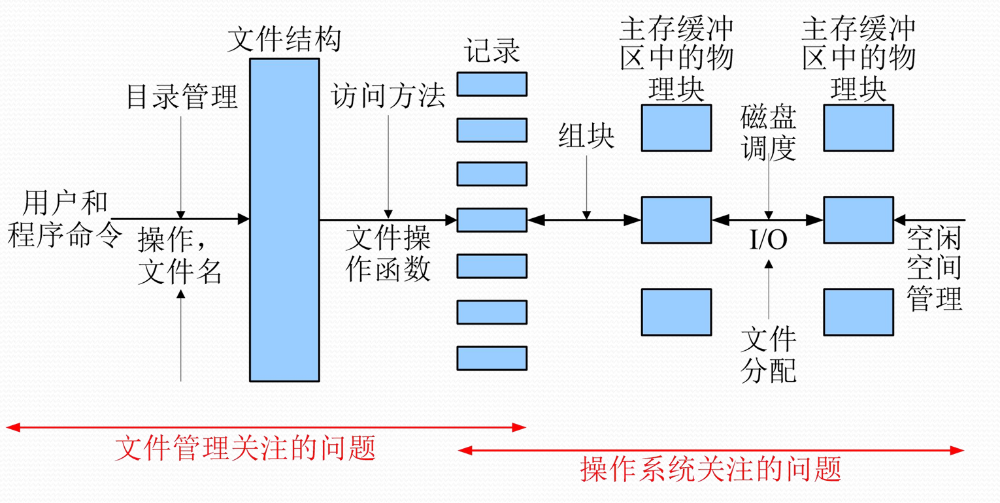

# 四、设备管理

> 1. 复习、了解I/O设备、I/O控制方式 
> 2. 掌握I/O缓冲区的设计 
> 3. 掌握磁盘调度 
> 4. 掌握I/O软件系统的设计与实现 
> 5. 掌握虚拟设备

## 基础

### 设备管理概述

**I/O设备**

1. 信息传输视角
   - 输入设备
   - 输出设备
   - 输入输出设备
2. 交互功能视角
   - 人机交互设备
   - 存储设备
   - 机机通信设备
3. 设备管理视角
   - 字符设备
   - 块设备
   - 网络设备

**I/O操作**：**内存和外设间的信息传送操作**

**<u>设备管理的目标：解决设备和CPU速度的不匹配，使主机和设备充分并行工作，提高设备使用效率</u>**

**实现层次：I/O硬件、I/O软件**

### I/O控制方式

为达到模块化和通用性的设计目标，通常分开设置设备的机械部件和**电子部件**，电子部件称为**设备控制器**

设备控制器：CPU与设备之间的接口

**I/O控制的方式**：

​	**轮询**：重复查询直至设备就绪

​	**中断**：处理器向控制器发出具体I/O 命令，然后继续执行后续指令；控制器检查设备状态，就绪后发出中断

​	**DMA**：直接存储器访问；DMA模块替代处理器来控制主存和设备控制器间的数据交换

​			

| CPU作用 | 等待设备 | 内存数据交换 |
| ------- | -------- | ------------ |
| 轮询    | 需要     | 参与         |
| 中断    | 不需要   | 参与         |
| DMA     | 不需要   | 不参与       |

**I/O通道**：与DMA控制方式类似，也是一种以内存为中心，实现设备与内存直接交换数据的控制方式。CPU与通道**高度并行**工作

### 总线与I/O

**单总线**：简单易扩充，但共用总线导致多设备压力大，且<u>慢速外设占带宽多</u>。

​	

**三级总线**：主存通过**主存总线**连接Cache，主存总线通过<u>扩展总线接口</u>连接**扩展总线**上的外设，Cache和CPU间有**局部总线**。活动分离，支持设备多；但<u>不适用于外设速率差太大的情形</u>。

​	

**南北桥**：通过**存储总线**、**PCI总线**、**E(ISA)总线**分别连接主存、高速I/O设备和低速I/O设备。可以支持不同速率。

​	

**通道**：CPU、主存和多个I/O通道之间的数据传送

​	

###  ⭐I/O软件的实现层次

要考虑的的问题：

​	设备无关性、出错处理、**同步/异步传输（CPU在启动I/O操作后是否继续工作）**、**缓冲技术**

**层次（自底向上）**：

1. **I/O中断处理程序**：判断中断原因， 根据I/O操作完成情况进行相应处理

2. **设备驱动程序**：逻辑I/O请求转化为物理 I/O操作，与硬件直接相关；可以分层实现，高层处理类设备，低层处理具体设备

3. **独立于设备的I/O软件**：执行**适用于所有设备的常用I/O功能**，并向用户层软件提供一致性接口。
   - **设备命名**
   - **设备保护**
   - **提供与设备无关的数据单位**
   - **缓冲技术**
   - **分配和状态跟踪**
   - **错误处理/报告**

4. **用户空间的I/O软件**：**库函数**和**虚拟设备软件**

​	

### ⭐I/O缓冲

解决CPU与设备之间速度不匹配的矛盾，协调逻辑记录大小和物理记录大小不一致的问题 ，提高并行性，减少中断

**I/O缓冲区**：在内存中开辟的存储区， 专门用于**临时存放I/O操作的数据**；写操作或读操作

1. **单缓冲技术**：就一个缓冲区。

2. **双缓冲技术**：两个缓冲区，交替切换使用。生产者填满 Buffer A 后，立即切换到 Buffer B 继续写入，同时消费者处理 Buffer A 的数据，反之亦然。
3. **循环缓冲技术**：一组缓冲区，每个缓冲区有指向 下个缓冲区的链接指针，构成循环缓冲。

## 独占型外围设备

### 设备独立性

**设备独立性**：用户通常不指定物理设备， 而是指定**逻辑设备**，使得用户进程和物理设备分离开来，再通过其它途径建立 <u>逻辑设备和物理设备之间的映射</u>。设备管理中需要将逻辑设备名转换为物理设备名，需要**表**。

### 独占设备的分配

独占型外围设备： 一次只能由一个进程独占使用**（互斥管理需求）**

- **静态分配**：进程运行前申请（防止系统发生死锁，但会降低设备利用率）
- **动态分配**：进程随用随申请（**结合信号量与PV操作**，可能死锁）

**设备分配的数据结构**：

​	**设备类表**（包括设备类，总台数，空闲台数，设备表起始地址等）

​	**设备表**（包括物理设备名，逻辑设备名，占有设备的进程，分配标志，好/坏标志等）

## 共享型外围设备

### 磁盘

基本概念：盘片、盘面、磁道（同心圆）、柱面（同一位置上的磁道）、扇区、簇（相邻扇区）

读写过程（略）：寻道、旋转、数据传送

**存取时间**：$T_a = T_s + \frac{1}{2r}+\frac{b}{rN}$，Ts：寻道时间，r：磁盘旋转速度（单位：转/秒），b：要传送的字节数，N：一个磁道中的字节数。

### 磁盘驱动调度策略⭐

1. **移臂调度**：使移动臂的移动时间最短
   1. **先来先服务FCFS**：不太合适
   1. **最短查找时间优先（最小短距法）SSTF**：会饥饿
   1. **单向扫描C-SCAN**：一个方向扫描，到终点返回，归途不扫描
   1. **双向扫描SCAN**：归途也扫描
   1. **电梯调度LOOK**：改进的双向扫描，只要到了该方向的最后一个请求就返回

2. **旋转调度**：使得旋转延迟的总时间最少
    1. 循环排序：优化I/O请求排序，在**最少旋转圈数内**完成位于同一柱面的访问请求
    2. 优化分布：优化逻辑记录在物理块上的分布，减少旋转

> **N-step-SCAN**
>
> ​	重复请求同一磁道会垄断整个设备，"造成**磁头臂的粘性**"，采用分步扫描可避免这类问题
>
> ​	把磁盘请求队列分成长度为**N的子队列**，每一次用**SCAN**处理一个子队列
>
> ​	在处理一个队列时，新请求必须添加到其他某个队列中
>
> ​	当N很大时，N-step-SCAN的性能接近SCAN；当N=1 时，实际上是FIFO
> **FSCAN**
>
> ​	两个子队列
>
> ​	开始扫描时，所有请求都在一个队列中；扫描过程中，所有**新到的请求都被放入另一个队列**中

### 补充

**RAID**：把相同的数据存储在多个硬盘的不同位置的方法

1. RAID0：无冗余
2. RAID1：镜像
3. RAID2：海明码冗余校验（n个信息位，k个校验位，满足$2^k≥n+k+1$）
4. RAID3：交错位奇偶检验（一个冗余盘）
5. RAID4：块奇偶检验（与3相比数据被分成更大的块，存结构化数据3快，普通数据4快）
6. RAID5：块分布奇偶检验（奇偶校验码循环分布在每个盘上）
7. RAID6：双重冗余（与5相比存在两份奇偶校验）
8. RAID10：组成RAID1后，再组成RAID0（兼顾速度和安全性）

**替换策略**：**LRU、LFU**

## ⭐虚拟设备

==虚拟设备技术：使用一类物理设备模拟另一类物理设备的技术==

### SPOOLing（外部设备联机并行操作）系统

​	也叫==“假脱机技术”==，是一种**以共享型磁盘设备模拟独占型物理设备的技术，也是一种速度匹配技术**

用**高速的磁盘设备来模拟慢速的字符设备**，缩短进程在内存中的驻留时间

- **预输入程序**：预先把数据从输入设备传送到**磁盘输入井**
- **缓输出程序**：把数据从**磁盘输出井**传送到输出设备
- **井管理程序**：控制作进程和井之间的数据交换(事实上是**I/O重定向**)

​	

> I/O设备的速度通常比CPU慢得多，直接连接会导致CPU浪费很多时间等待I/O设备。于是先把I/O设备的输入传送到**输入井**（位于磁盘），CPU通过快速的磁盘读取输入。输出时同样，输出结果先存放到**输出井**（磁盘），再由输出井通过I/O缓慢地输出。

### 批处理系统的作业管理

作业说明语言、作业说明书、作业状态、**作业调度**、**作业调度算法**

​	

# 五、文件管理

> 1. 掌握文件和文件系统的概念 
> 2. 了解文件系统的实现层次 
> 3. 掌握文件目录 
> 4. 掌握文件的组织与定位 
> 5. 掌握文件记录成组技术 
> 6. 掌握文件共享技术

## 文件系统概述

​	

### 文件

==文件是具有符号名的，在逻辑上具有完整意义的一组相关信息项的序列==

**文件命名**一般包括文件名和扩展名，前者用于识别文件，后者用于标识文件特性

**引入文件的好处**：用户使用方便，**按名存取**；文件**安全可靠**；可**备份、转储**；可**共享**

### 文件系统

==文件系统是操作系统中负责存取和管理信息的模块==

文件系统中的文件：同一个文件必须从**逻辑文件**和**物理文件**两个侧面来观察它

文件系统**面向用户的功能**：文件的**按名存取** 、文件的**共享和保护** 、文件的**操作和使用**

为了实现这些功能，OS必须考虑：

1. **文件目录的建立和维护**
2. **存储空间的分配和回收**
3. **数据的保密和保护**
4. **监督用户存取和修改文件的权限**

​	

## 文件的组织

### 文件的存储

**卷**是存储介质的**物理单位**；**块**是存储介质上连续信息所组成的一个区域， 也叫做**物理记录**（==块也是主辅存信息交换的物理单位==）

**两个相邻块之间必须留有间隙**

**顺序存取设备**：严格依赖信息的物理位置，<u>磁带机</u>，广泛用于**存档**

**直接（随机）存取存储设备**：<u>磁盘</u>，存取时间几乎不依赖于位置

### 文件的逻辑结构

**逻辑文件**，又称为文件的逻辑结构：

1. **流式文件**， 文件内的数据不再组成记录，只是由一串依次的字节组成的**信息流序列**。按**长度**读取或者插入**分界字符**
2. **记录式文件**，若干**逻辑记录**信息组成，==逻辑记录是文件中按信息在逻辑上的独立含义所划分的信息单位==

数据库管理系统也支持逻辑记录

### 记录的成组与分解

若干个**逻辑记录合并成一组**，写入一个块叫记录的成组，每块中的**逻辑记录数**称**块因子**

**记录的成组操作**: 输出缓冲区内，==记录成一组了再写入存储介质==

**记录的分解操作**：物理记录读进输入缓冲区后，==把逻辑记录从块中分离==

> **定长记录**：固定记录长度，每个块末尾可能有**内部碎片**
>
> **变长记录（非跨越）**：如果下一条记录比块中剩余的未使用的空间大，则无法使用这一部分
>
> **跨块记录**：紧缩到块中，不够就拆到另一个块里，从而使**某些记录可能会跨越两个块**。需要指针指向后继。**块中没有未使用空间**。

优点：节省存储空间，还能减少输入输出操作次数

会出现**提前读**和**推迟写**现象。

> 提前读：一次读入一整个物理块，可能使得别的逻辑记录提前被读取了
>
> 推迟写：成组才能写入造成推迟

### 文件的物理结构

1. **顺序文件**：将一个文件中**逻辑上连续**的信息存放到存储介质的**依次相邻的块**中。*存取速度快，但增改插困难，还要预先确定长度。*
2. **连接文件（串联文件）**：文件目录给出第一块地址，每一块的**连接字**指出了文件的下一个物理块位置。*易增删改查，但要额外空间存指针；仅使用顺序存取。*（**输入井、输出井**）
3. **直接文件（散列文件）**：建立关键字与地址的关系。可能有**冲突**（用拉链、循环探查、二次散列等方法解决）。
4. **索引文件**：每个文件建立了一张**索引表**，每个表目包含一个记录的键(或逻辑记录号)及其存储地址。**索引表的地址可由文件目录指出**。是连接结构的一种扩展，缺点是索引表本身的开销。

**索引文件的访问**：文件存储器有**索引区**和**数据区**。第一步查找索引表，第二步获得记录物理地址。

**索引文件的组织**：一级索引、两级索引、**多级索引（经常考）**

​	

**⭐多级索引的计算**：

​	

## 文件目录

### 文件目录结构

文件目录是实现文件的“**按名存取**” 的关键数据结构。文件目录需要永久保存，因此也组织成文件存放在磁盘上，称**目录文件**。

1. **一级目录结构**：用户与文件众多，易重名。
2. **二级目录结构**：第一级**区分用户**，每一项有指向该用户的文件目录的地址；第二级与一级目录结构相同。

   
3. **树形目录结构**：倒向的有根树。

   - **不同文件可重名**，只要它们不位于同一末端子目录中，易于规定不同层次或子目录中文件的不同存取权限，**便于文件的 保护、保密和共享**

- Windows里，不同盘对应不同子树，用逻辑盘符区分；Unix里，多棵子树被嫁接成一棵巨树

> **纯树形**：**父目录唯一**。文件共享不是对称的。
>
> **有向无环图**：**允许多父目录**。可以对称方式实现文件共享。维护更复杂。需为每个文件维护一个**引用计数**，用来记录文件的父目录个数，仅当引用计数为1时，删除操作才移去文件，否则仅仅把相关记录从父目录中删去。。
>
> **Linux支持多父目录**，其中一个为主父目录，其他的通过link来引用文件；Windows实现被称作**“快捷方式”**的多父目录连结。

### 文件目录的管理

#### 文件查找

**按名查找**：系统根据用户提供的**文件路径名**来搜索各级文件目录，找到该文件

**目录项查找**：顺序查找法；二分查找法；杂凑法

#### 活动文件表

​	当一个文 件经过许多目录节点时，使用很不方便；系统在沿路径查找目录时，往往要多次访问文件存储器，使访问速度大大减慢

**活动文件表**：通过**“打开”**操作，**目录信息->主存**，有关信息填入**活动文件表**，建立用户进程和该文件索引的联系；“**关闭**”切断用户进程和这个文件的联系，更新目录。

> **Inode**：Linux系统中的**FCB（文件控制块）**将<u>文件名</u>和<u>其他管理信息</u>再分开，其他信息单独组成一个数据结构，称为**索引节点 inode**。由inode号标识该结构的位置。由此将目录项简化为
>
> ​	文件名（最长256B） ： inode号（4B）
>
> inode结构里的**i_data[15]** 数组给出数据块地址索引：**前12为直接索引，13为一次间接，14二次，15三次**。
>
> **活动inode**：同样的，为了减少开销，把一部分inode复制到主存。访问某文件先查活动inode，如果没有就开辟一个新的活动inode，把需要的inode复制过来。
>
> 磁盘 inode 反映文件静态特性，活动 inode  反映文件动态特性。
>
> 
>
> 

## 文件的共享、保护和保密

### 文件的安全与保护

**文件共享**是指不同用户共同使用某些文件

**文件保护**是指防止文件被破坏（**动态多副本、转储**，与数据库类似；**存取控制矩阵/表**）

> 存取控制矩阵：系统为每个用户设置访问每个文件对象的存取属性，简化得存取控制表，仅记录有权限的部分
>
>  **chmod**命令可以改变文件属性 ；**chown**命令用于变更文件属主 ；**chgrp**命令用于变更用户伙伴

**文件保密**则是指防止文件及其内容被其他用户窃取

## 文件的使用

### 存取方法

1. **顺序存取**：推进读/写指针，允许跳读/写
2. **直接存取**
3. **索引存取**：基于索引文件，信息块的地址都可以通过查找记录键而换算出

### 使用

1. **建立文件**
2. **撤销文件**
3. **打开文件**
4. **关闭文件**
5. **读/写文件**
6. **定位文件**

**文件操作的实现**

​	0#：**引导块**

​	1#：**超级块**：有**盘位示图**的功能，又记录整个文件卷的控制数据，比如各部分所占盘块数，又或者空闲块号

​	2#～k+1#块：**Inode区**，存放inode表

​	k+2#～n#：**数据区**，存放**数据项和目录项**

⭐**<u>重点理解概念及变量含义：</u>**

​	**用户打开文件表**：进程的PCB结构中保留一个**files_struct**，称为用户打开文件表或文件描述符表，表项的**序号(索引)**为**文件描述符fd**，该登记项内登记 **系统打开文件表** 的一个入口指针**fp**，通过此 系统打开文件表项 连接到打开文件的活动inode。

​	**系统打开文件表**：解决共享问题。主存专门开辟最多可登记256项的系统打开文件表区，当打开一个文件时， 通过此表项==把**用户打开文件表的表项**与文件**活动inode** 联接起来==，以实现数据的访问和信息的共享。

​	**主存活动inode表**：解决频繁访问磁盘索引节点inode表的效率问题

​	

> 关于用户打开文件表、系统打开文件表、主存活动inode表的相关数据解释：
>
> - `fd` ： 用户打开文件表的索引
>
> - `fp` ： 用户打开文件表的表项，指向系统打开文件表的一个打开文件的file
>
> - `f_count` ：**引用次数**，表示的是**有多少文件描述符指向该struct file**。当f_count为0时，表示**没有任何文件描述符引用这个struct file了**。内核会**释放**它所占用的内存。
> - **f_inode** ：指向一个活动inode的指针
> - `i_count` ：**引用次数**，表示的是**有多少系统打开文件表的struct file（或者其他内部结构）指向该活动inode**。**i_count** 变为 **0** 时，表示**没有任何内核对象引用这个内存中的活动inode了**。内核会**将这个 inode 从活动 inode 表中移除**（可能还会将脏的元数据写回磁盘 inode），并**释放**其占用的内核内存。但这**并不删除文件数据本身**。
> - `i_nlink(i_link)` ：**硬链接计数**，表示文件系统中指向这个**磁盘 inode** 的**目录项（文件名）** 的数量。**i_nlink** 变为 **0** 时，表示**文件系统中没有任何目录项（文件名）指向这个磁盘 inode 了**。==当i_nlink和i_count都为0的时候（没有进程正打开这个文件）==，才可以**删除文件**。

​	

### ⭐文件系统的调用

1. **创建**

   ```c
   int fd, mode;
   char *filenamep;
   fd = create (filenamep, mode);
   ```

   ① （==建立目录和inode==）分配inode和活动inode，filename + inode号 –>新目录项，记到目录中。

   ② （==初始化inode==）活动inode置初值，如置**存取权限 i_mode**，连接计数i_nlink等。

   ③ （==初始化表项==）分配 <u>用户打开文件表项</u> 和 <u>系统打开文件表项</u> ，置表项初值， **读写位移f_offset清“0”。**

   ④ （==连接指针，返回==）把各表项及文件对应的活动inode用指针连接起来，把**文件描述字**返回给调用者。

2. **删除**

   ```c
   unlink(filenamep);
   ```

   ①（==i_link==）如果没有连接用户(**i_link 为“1”**)，还要把文件占用的存储空间释放

   ②（==写权限==）删除要求**写权限**

   > 把指定文件从所在的**目录文件**中除去，要不要彻底删除要看i_link和i_count

3. **打开 **

   ```c
   int fd, mode;
   char * filenamep;
   fd = open (filenamep, mode);
   ```

   ① （==活动inode==）检索目录，把它的外存inode复制到活动inode表。

   ② （==权限==）根据参数mode核对权限

   ③ （==分配和初始化表项==）分配 <u>用户打开文件表项</u> 和 <u>系统打开文件表项</u> ，并为表项设置初值。通过指针建立这些表项与活动inode间的联系。返回fd。

4. **关闭**

   ```c
   int fd;
   close (fd);
   ```

   ① （==找到表项==）根据fd找到用户打开文件表项，再找到系统打开文件表项。释放用户打开文件表项。

   ② （==f_count==）f_count - 1，为0就释放；非0表示还有进程共享该表项，直接返回。

   ③ （==i_count==）i_count - 1，为0就**把该活动节点的内容复制回原inode**，释放；非0表示还有进程共享该节点，直接返回。

5. **读**

   ```c
   int nr, fd, count;
   char buf [  ];
   nr = read (fd, buf, count);
   ```

   ①（==合法性==）根据**f_flag**中的信息，检查读操作合法性

   ②（==读==）根据当前位移量**f_offset**值，要求读出的字节数， 及活动索引节点中i_data[15]指出的文件物理块存放地址，把相应的物理块读到缓冲区中，然后再送到bufp指向的用户主存区中。

6. **写**

   ```c
   int nw, fd, count;
   char buf [  ];
   nw = write (fd, buf, count);
   ```

   ​	（==写==）**buf**是信息传送的源地址，即把buf所指向的用户主存区中的信息，写入到文件中。

7. **随机存取**

    ```c
    long lseek;
    long offset;
    int whence, fd;
    lseek (fd, offset, whence);
    ```

   “打开”时f_offset会清零，以后的读写都依据offset就是顺序存取了。

   **lseek允许用户事先改变f_offset的指向**

   文件描述字fd指向一个已经打开的文件，

   ​	- 当whence是“0”时，则f_offset 被**置为**offset，

   ​	- 当whence是“1”时，则f_offset 被置为文件当前位置**加上**offset。
8. **总结**

    ``` c
    int fd, mode;
    char *filenamep;
    char buf [  ]; //buf 是主存地址, 写操作的源地址, 读操作的目标地址
    
    fd = create (filenamep, mode);
    fd = open (filenamep, mode);
    unlink (filenamep);
    close (fd);
    nr = read (fd, buf, count);
    nw = write (fd, buf, count);
    lseek (fd, offset, whence);
    ```

## 文件系统的实现

### 辅存空间管理

分配方式：**连续、非连续**

**位示图**：0表空闲，1表占用

### ⭐实现层次

1. **用户接口**：接受**系统调用**，检查语法，进入**逻辑文件控制子系统**
2. **逻辑文件控制子系统**： 根据路径名搜索目录，建立活动文件表，转换地址（相对物理块号和块内相对地址）
3. **文件保护子系统**：识别身份，验证权限
4. **物理文件控制子系统**：管理缓冲区，相对物理块号转为实际物理块号，分配空间
5. **I/O控制子系统**：执行操作

### 文件共享

**静态共享**

```c
chat * oldnamep, * newnamep;
link (oldnamep, newnamep);

unlink (filenamep) // 解除链接调用
```

① （==找inode==）检索目录找到oldnamep所指向文件的索引节点**inode 编号**。

② （==构成新目录项==）再次检索目录找到newnamep所指文件的**父目录文件**， 并把已存在文件的索引节点**inode编号与别名构成一个目录项**，记入到该目录中去。

③ （==i_link+1==）把已存在文件索引节点inode的连接计数**i_nlink + 1**。

**动态共享**

1. **同一用户父、子进程协同完成任务**，**使用同一读/写位移**，同步地对文件进行操作。

   当用系统调用fork建立子进程时，<u>父进程的PCB结构被复制到子进程的PCB结构中</u>，使两个进程的打开文件表指向同一活动的索引节点，达到共享同一位移指针的目的。

​	

2. **多用户共享文件**，**为每个用户进程分别设置一个读、写位移指针**。位移指针应放在每个进程**系统打开文件表的表目**中。

   ​	

**符号链接共享（软链接）**

​	多个物理/逻辑磁盘时，Windows选择分配盘符作为路径的一部分，而**UNIX/Linux的每个分区有自己的文件目录树**。

​	不同树可能有相同inode号，为了防止合并后冲突，**拒绝创建跨越文件系统的硬链接**。

​	**符号链接**只有文件名，不指向inode。

### 主存映射文件

文件的读写和内存的读写有很大不同，可以**把文件直接映射到内存上，跳过文件系统调用**：

1. **映射文件**，有两个参数：一个**文件名**和一个**虚拟地址**， **把一个文件映射到进程地址空间**。

2. **移去映射文件**，让文件与进程地址空间断开，**并把映射文件的数据写回磁盘文件**。

### 虚拟文件系统

#### VFS概念

它是**内核的一个子系统**，提供一个**通用文件系统模型**，该模型概括所能见到的**文件系统常用功能和行为**，处理一切**和底层设备驱动相关的细节**，为应用程序**提供标准的接口**(文件系统API)。

1. **应用层**

   无需考虑具体文件系统特性和物理存储介质，通过VFS访问文件系统

2. **虚拟层**

   对所有具体文件系统的**共同特性**进行抽象的基础上，形成一个与具体文件系统实现无关的虚拟层，并在此层次上定义**与用户的一致性接口**。

3. **实现层**

   使用类似开关表技术进行**具体文件系统转接**，实现各种具体文件系统的细节，每一个是自包含的，包含文件系统实现的各种设施

> 第一个VFS：**SunOS**

==VFS实质上是一种**存在于主存中**的，**支持多种类型具体文件系统**的运行环境==

#### VFS的组成

1. **超级块**——代表一个文件系统

2. **索引节点对象**——代表一个文件

   可把具体文件系统存放在磁盘上的inode称为**静态节点**，它的内容被读入主存VFS的inode才能工作，后者也称为**动态节点** 

3. **目录项对象**——代表路径中的一个组成部分

   存放目录项与对应文件进行链接的各种信息

4. **文件对象**——代表由进程已打开的一个文件

   这些信息仅当进程访问文件期间才存于主存中


**EXT2文件系统**：EXT2把它所占用的磁盘逻辑分区划分为块组，每个块组依次包括超级块、组描述符表、块位示图、inode位示图、inode表以及数据块。