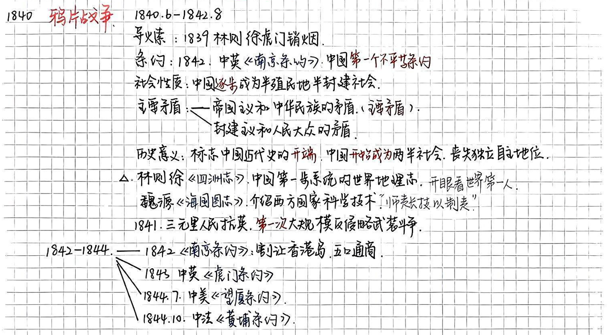
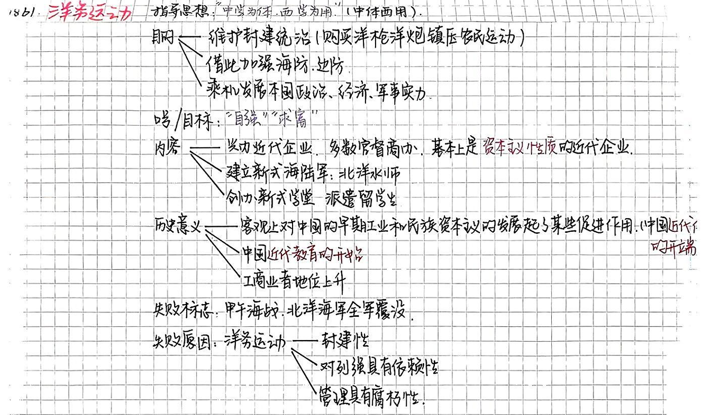
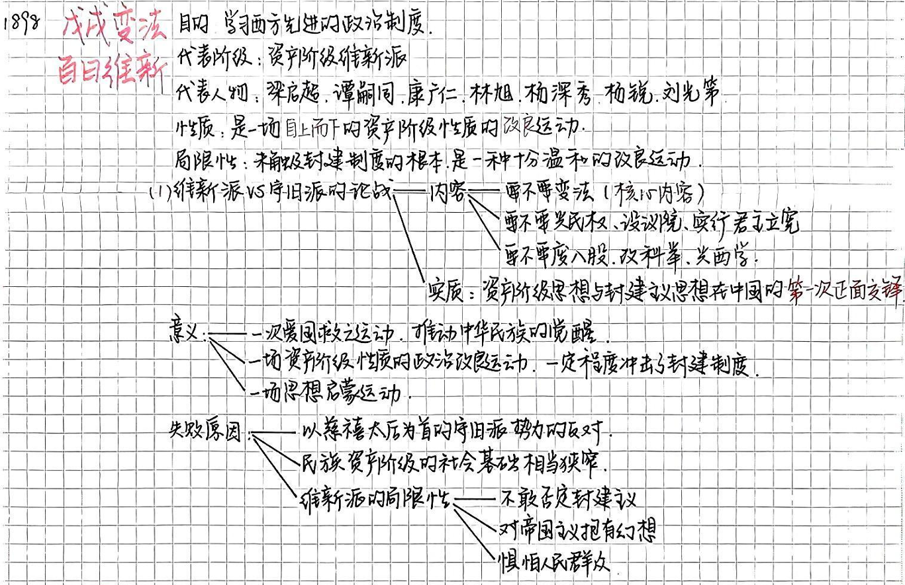
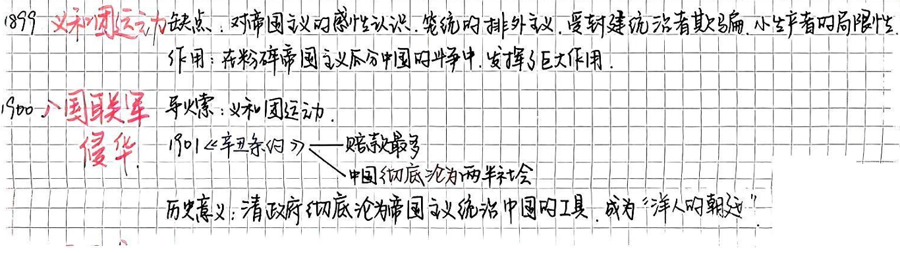
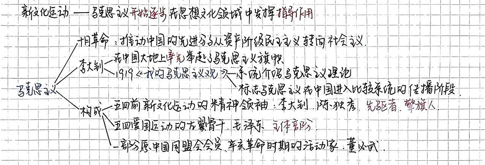
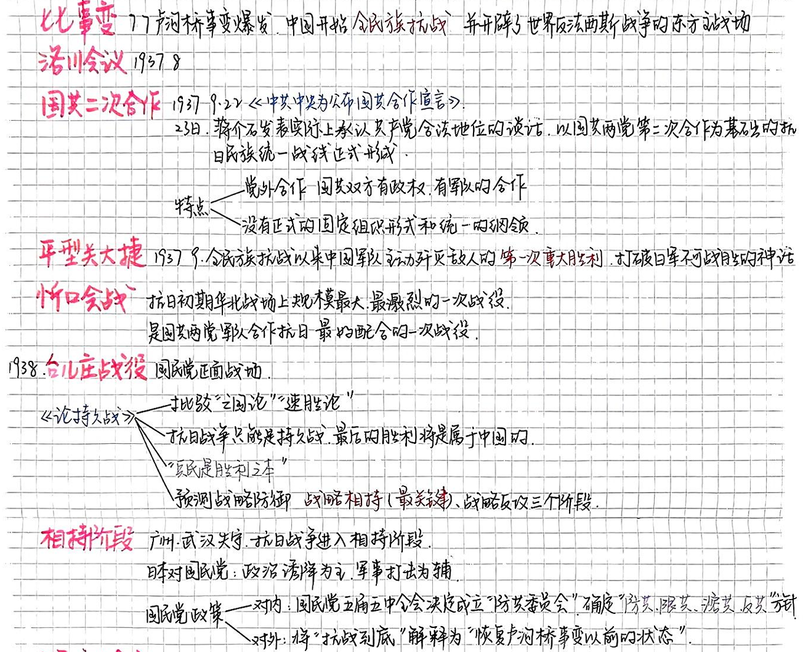
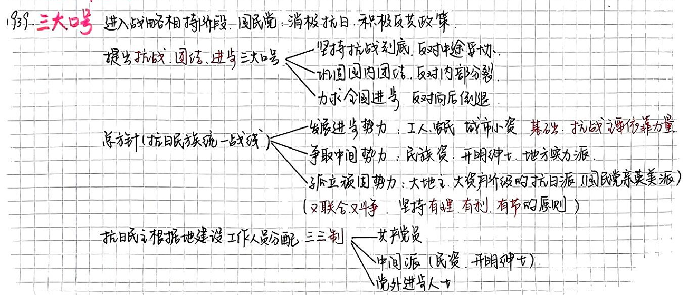
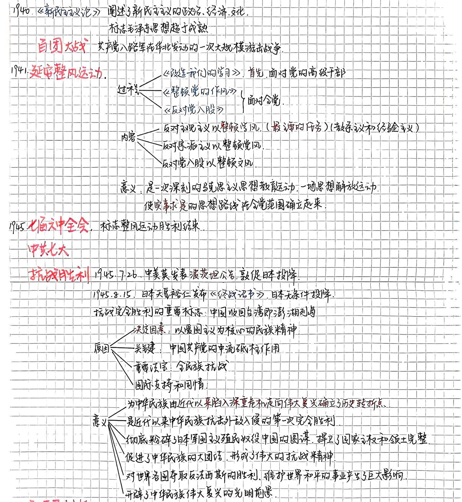

# 鸦片战争

## 鸦片战争爆发的原因

1. 中国长期处于高度中央集权的**封建君主制度**中，到了清代康乾盛世之后，封建社会就走向了末路。经济上**生产凋敝、土地高度集中**。
2. 英法美等国家早早通过资产阶级革命建立了**资产阶级政权**，随后又爆发了**工业革命**，经济迅速发展，促进了其对外扩张。
3. 为适应西方资本主义的发展要求，**殖民主义**诞生。在进入帝国主义阶段后，**资本输出**又成了殖民剥削的重要形式。
4. 英国对华贸易长期处于**入超**状态，英国工业品收到了中国自然经济和闭关政策的抵抗。为了改变贸易逆差，英国殖民者开始**走私鸦片**。随后清政府实施了**禁鸦政策**，使英国更加吃紧。英国及其一众资本企业开始蓄谋武装侵略中国。
5. 英国刚刚经历两次**经济危机**，迫切的需要一场战争来转移国内视线和摆脱危机。

## 鸦片战争的过程

1. 1840.6   封锁广东海域
2. 1840.8   一路北上至天津，与清政府谈判后同意回广东交涉
3. 1840.11 强占香港
4. 1841.1   道光对英宣战
5. 1841.2   虎门沦陷
6. 1841.4   炮轰广州城，8月攻破厦门
7. 1841.10 浙江作战
8. 1842.8   英军抵达南京，战败

## 第一次鸦片战争的条约

| 条约         | 时间    | 对象 | 内容                   |
| ------------ | ------- | ---- | ---------------------- |
| **南京条约** | 1842.8  | 中英 | 割让香港岛             |
| **虎门条约** | 1843.10 | 中英 |                        |
| **望厦条约** | 1844.7  | 中美 | 扩大了领事裁判权的范围 |
| **黄埔条约** | 1844.10 | 中法 |                        |

## 第一次鸦片战争的影响

==中国进入了**半殖民地半封建社会**。中国人逐渐开始了**反帝反封建**的**资产阶级民主革命**。==

1. 帝国主义**操控**了中国的财政和经济命脉，并逐步控制了政治。中国的**封建势力开始和帝国主义相勾结**，联合起来压迫中国人民。
2. 封建剥削制度仍然保留，但是中国新兴的**民族资本主义经济**已经产生并起了一定作用。但是力量很微弱，并且和封建势力帝国势力有或多或少的联系。
3. 由于近代列强的抢夺和间接统治，加上地域间不平衡的发展，列强还支持不同的政治势力。**中国持续处于不统一的状态。**
4. 百姓**流离失所、饥寒交迫**。

==中国社会的**阶级关系**发生了深刻的变动。==

1. 大部分**地主**仍占有大量土地，但是一部分地主迁入城市成为了**城居地主**，甚至投资资本主义工商业，转化成了**资本家**。
2. **农民**仍是最多的被剥削阶级。但由于土地兼并，一部分失去土地的贫农流入城市，成为了**产业工人的后备军**。他们有强烈的革命需求，是**中国民主革命的主力军**。
3. 新兴的被压迫阶级**工人阶级**，是中国**新生产力**的代表。他们受资本主义、封建主义、帝国主义三次压迫最深，**革命性最强**，并且有**组织、纪律**，是近代中国**最革命的阶级**。
4. 同时也新兴**资产阶级**，一部分是买办资本家，一部分是民族资本家。政治上有两面性。

# 洋务运动

## 洋务运动的背景

1. 第二次鸦片战争结束后，清政府镇压太平天国的过程中兴起的。
2. 目的是**挽救晚清的统治危机**，由奕忻、李鸿章、曾国藩、左宗棠、张之洞等**洋务派**提出。
3. 首先是为了购买和制造装备镇压农民起义，此外也是趁机发展本集团的政治经济军事实力。
4. **“中心为体，西学为用”**，想要用封建伦理纲常支配西方科学技术。

## 洋务运动的内容

1. **兴办近代工业**。包括军用工业和一部分民用工业。
2. **建立新式陆海军**。装备洋枪洋炮，建设海上舰队。
3. **创办新式学堂**，派遣留学生。建立翻译、工艺、军事三种学堂。

## 洋务运动的作用

1. 兴办工业，为中国**早期工业和民族资本主义**的发展起到了促进作用，但更多的还是为了维护封建统治。
2. 开办新式学堂，派遣留学生，是**近代教育的开端**。给中国带来了新的知识，也开阔了眼界。
3. **社会风气和价值观**开始变化。工商业者的地位开始上升，有利于资本主义的发展。

## 洋务运动的失败

甲午海战北洋海军全军覆没标志着洋务运动的失败。

1.  **洋务运动具有封建性**。企图吸收西方科学技术达到维护封建统治的目的。但新的生产力同封建的生产关系和上层建筑是不相容的。既要近代企业，又通过垄断侵吞压制民族资本；既想培养洋务人才，又不愿意改变科举制度。
2. **洋务运动对列强有依赖性**。西方列强从政治经济反面加紧对中国的侵略，洋务派却试图通过他们达到自强求富的目的。
3. **洋务企业的管理具有腐朽性**。虽然有资本主义性质，但管理仍是房间衙门式的。经营不讲效益，生产出来的东西质量低。官员独揽大权，企业内充斥者舞弊、贪污等恶习。

# 维新运动

## 维新运动的背景

1. 中国民族资本主义有了初步发展，**新兴的资产阶级**迫切要求摆脱外国资本主义和国内封建势力的压迫，为在中国发展资本主义开辟道路。
2. 甲午海战的惨败，激发了中国人的**民族觉醒**。
3. **知识分子**主动站出来，站在了维新变法和救亡图存的前列。

## 主要人物

1. **康有为**：《新学伪经考》《孔子改制考》《日本变政考》等
2. **梁启超**：《变法通义》
3. **谭嗣同**：《仁学》
4. **严复**：《天演论》《国闻报》

## 维新主张

1. **向皇帝上书**。公车上书。
2. **著书立说**。
3. **介绍外国变法的经验教训**。
4. **办学会**
5. **设学堂**
6. **办报纸**

重点在于争取光绪皇帝和周边官员的支持，希望自上而下的变法。

## 论战

1. **要不要变法**？ “祖宗之法不可变” vs “变者，天下之公理也”
2. 要不要兴民权、设议院，实行**君主立宪制**？批判封建君主专制，提倡君主立宪
3. 要不要**废八股、改科举和兴西学**？

==资本主义和封建主义在中国的第一次正面交锋==，开阔了新知识分子的眼界，传播了西方政治。

## 百日维新

光绪“明定国是”，采纳了一系列维新政策。但未涉及根本，十分温和且不彻底。最后以慈禧太后为首的守旧派“**戊戌事变**”宣告结束。

## 维新变法的意义

1. 是一次**爱国救亡**运动，维新派的政治实践和思想理论，不仅贯穿着强烈的爱国主义精神，而且推动了民族觉醒。
2. 是一场**资产阶级的改良运动**，主张君主立宪，冲击了封建制度。
3. 是一场**思想启蒙**运动，传播了西方资产阶级的社会政治和自然科学，宣扬自由平等，批判了封建伦理，把顽固的封建思想打开了一个缺口。间接推动了随后的文化革新运动。同时新式教育也推动了近代教育的发展。
4. 改革了**社会风习**，革除了许多恶俗陋习，“剪辫易服”。

## 失败原因和教训

​	维新派自身的局限和强大的**守旧势力的反对**。**民族资本主义经济的力量还太弱**，维新派没组织没军队**不发动群众**，指望一个没有实权的光绪帝自上而下改革。

局限性：

1. **不敢否定封建主义**。幻想通过光绪帝和平、合法地改革，逐步实现君主立宪。经济上虽然要求发展民族资本主义，但未触及封建土地所有制。思想上提倡学习西学，却还打着孔子的名号。
2. **对帝国主义抱有幻想**。幻想西方列强能帮助自己变法维新。英、日帝国主义表面上同情，实际上只是为了乘机扩大在华侵略势力。
3. **惧怕人民群众**。只限于士大夫和知识分子，不但忽视群众，还害怕群众造反。

==半殖民地半封建的中国，企图自上而下的改革是行不通的==。戊戌变法流血的教训，促使一部分人放弃改良，走上革命的道路。

# 八国联军侵华

直接原因（导火索）：义和团运动公开反列强

过程：

1. 1900.6 八国联军从天津乘火车向北京进犯，在廊坊被义和团和清军袭击，不得已撤回天津
2. 在这期间，八国联军又向大沽炮台发起强攻，占领炮台后扑向天津。

结果：

1901《**辛丑条约**》：外国军队有权在北京使馆区和北京至大沽、山海关一线**留兵驻守**。索要白银4.5亿两。**强迫清政府永远禁止中国人成立或加入反对他们的组织的承诺**。（洋人的朝廷）

# 袁世凯称帝前后的北洋政府

## 袁世凯窃国的背景

辛亥革命取得了巨大成功，但以失败告终。

武昌起义后，袁世凯武力压迫革命派，声称不承认共和政体。帝国主义为袁世凯助威，称孙中山缺乏治理国家的经验，为袁世凯造势。孙中山不得不答应只要清帝退位、袁世凯拥护共和，就让他当临时大总统。

## 北洋军阀的专制统治

==大地主和买办资产阶级==

政治上，实行军阀官僚的专制统治，肆意捕杀群众和革命党人。1912.8，宋教仁征得孙中山同意建立国民党，试图推进资产阶级议会制度，随后被暗杀。武力镇压二次革命，撕毁临时约法制订“中华民国约法”改内阁制为总统制，并且无限期连任还能推选继承人。

为实现专制统治军阀还投靠帝国主义，签订了许多不平等条约。为了让日本支持复辟帝制公然签订二十一条。随后袁世凯复辟，但很快被反对结束。

经济上，北洋政府竭力维护**帝国主义、地主阶级、买办资产阶级**的利益。

军阀和官僚还借助于政治势力组成官僚买办资本集团，操控垄断金融工业运输业。

文化思想上，尊孔复古。攻击民主共和，宣传封建纲常。

## 旧民主主义革命的失败

一些革命党人认为，推翻封建帝建立共和政体，革命大功告成，失去了革命积极性。有些追逐官职，有些投靠军阀。

宋教仁遇刺后，孙中山看清袁世凯真面目，发动“**二次革命**”，但缺乏兵力财力，内部不统一，两个月就失败了。

袁世凯“登基”前一周，蔡锷的“护国军”宣布“独立”，开启了“**护国运动**”。袁世凯被迫取消帝制，忧惧而死。

皖系军阀段祺瑞掌控北洋政府后变本加厉地推动独裁卖国的反动统治，拒绝恢复“临时约法”。孙中山于是借助西南军阀的力量发动“**护法运动**”，但后来西南军阀和直系军阀勾结排挤孙中山，护法运动失败。

孙中山改组中华革命党为中国国民党。

## 辛亥革命的失败和教训

1. ==半殖民地半封建的中国，资本主义建国的方案行不通==。帝国主义绝不会容许一个富强、独立的资产阶级共和国。所以帝国主义和袁世凯代表的大地主大买办势力及立宪派、旧官僚勾结，内部绞杀了这场革命。
2. **没有彻底提出反帝反封建的革命纲领**。还是幻想妥协退让换取帝国主义支持。只强调反满而不是反封建，让一些汉人旧官僚也混入其中，因为妥协退让思想还把政权拱手给了袁世凯。
3. **不能充分发动和依靠人民群众**。资产阶级与封建势力千丝万缕，不敢依靠反封建的农民群众。中国民主革命的主力军农民没有发动起来，革命的根基很单薄。
4. **不能建立坚强的政党作为团结一切革命力量的强有力的核心**。同盟会内部松散，派系纷杂，人心涣散。

# 马克思主义的传播和中共成立

## 十月革命让中国人看到希望

1. 俄国与中国**国情相似**（封建压迫、经济文化落后）
2. **社会主义俄国**反对帝国主义，平等对待中国，推动了社会主义思想的传播。
3. 俄国工人、农民和士兵群众的广泛发动并胜利的事实**启发了中国先进分子**。

==李大钊率先举起马克思主义的旗帜。==

## 早期马克思主义运动

队伍：

1. **新文化运动领袖**：陈独秀、李大钊等
2. **五四运动左翼骨干**：毛泽东等
3. **原中国同盟会成员**、**辛亥革命时期的革命家**：董必武等

早期运动特点：

1. 重视**马克思主义基础理论**学习，明确同第二国际的社会民主主义划清界限
2. 注意**从中国的实际出发**，学习、运用马克思主义
3. 开始提出**知识分子与劳动群众**结合的思想

## 与工人运动的结合

中共的早期组织：上海，陈独秀，《新青年》编辑部。

早期活动：

1. 宣传和研究马克思主义，研究中国实际问题
2. 到工人中去宣传和组织工作
3. 关于建党问题的讨论和实际组织工作 

## 中共第一次全国代表大会

1921.7.23 上海，后到嘉兴“红船”

1. **确认党的名称**：中国共产党
2. **第一个纲领**：“革命军队必须和无产阶级一起推翻资本家阶级的政权”，“承认无产阶级专政，直到阶级斗争结束”，“消灭资本家私有制”，联合第三国际
3. **陈独秀任书记**

宣告中共的成立，**是近现代中国发展的必然产物，是中国人民顽强求索的必然产物，是实现中华民族伟大复兴的必然产物**。

**最先进的阶级**——工人阶级，代表着最广大人民的利益

一开始就坚持**马克思主义为指南**，**谋幸福、谋复兴为初心使命**。

特点：受三重压迫下成立，有**坚强的革命性**。区分于第二国际旧式社会的改良党。

==意义==：

1. 有了一个**先进的、坚强的政党**作为凝聚力量的领导核心
2. **实现共产主义为最终目标和最高理想**。走上争取民族独立、人民解放的道路。
3. **伟大建党精神**：坚持真理、坚守理想、践行初心、担当使命、不怕牺牲、英勇斗争、对党忠诚、不负人民
4. 深刻改变了：
   1. 近代以后中华民族发展的方向和进程
   2. 中国人民和中华民族的前途和命运
   3. 世界发展的趋势和格局

# 土地革命

## 土地革命背景

1. 大革命后的艰难环境，”白色恐怖“，中共及领导的革命运动遭镇压
2. 1927.7 决定武装反抗国民党
3. 1927.8.7 八七会议 确定了武装起义和土地革命的方针， ”枪杆子里出政权“”找着新的道路“
4. 1927.8.1 南昌起义 武装反抗国民党的第一枪
5. 1927.9.9 秋收起义 ==三湾改编== **确立党对军队的领导，是无产阶级领导的新型人民军队的重要开端**；**创建井冈山根据地，农村包围城市、武装夺取政权的道路**
6. 12.11 广州起义
7. ==古田会议==：
   1. **思想建党、政治建军原则**；党的思想建设的极端重要性；红军要服从党的领导，加强政治工作。
   2. 古田会议决议是**中共和红军建设的纲领性文献**，是党和人民军队建设史上重要的里程碑
   3. 确立了**马克思主义建党建军原则**

## 土地革命内容

反围剿胜利与革命根据地的发展和土地革命密切相关

1. 规定农民已经分得的土地归**农民个人私有**，可以自主租借买卖。
2. **阶级路线**：坚定的**依靠贫农、雇农，联合中农，限制富农**，**保护中小型工商业者**，**消灭地主阶级**；
3. **土地分配**：**以乡为单位，按人口平分土地**，在原耕地的基础上，**抽多补少、抽肥补瘦**
4. **文化”反围剿“**：左翼文化工作者，鲁迅、瞿秋白、茅盾《子夜》、聂耳、田汉《义勇军进行曲》

# 一些重要的会议（延安时期）

## 瓦窑堡会议1935.12

1. 提出党的**基本策略任务是建立广泛的抗日民族统一战线**
2. 批评了党内长期存在的**左倾冒险主义、关门主义**错误
3. 中共掌握了**政治主动权**

## 洛川会议1937.8

1. 制订**抗日救国十大纲领**，强调**全民族抗战**。为此需要全国军事、人民总动员
2. **改革政治机构**，给人民充分的抗日民主权利，改善生活
3. **坚持统一战线中无产阶级的领导权**，在敌后发动游击，在国统区发动抗日群众运动

# 抗日战争

## 正面战场-战略防御

1937.7.7卢沟桥事变 - 1938.10 武汉、广州失守

以国民党军为主体的正面战场抗击日军

**淞沪、忻口、徐州、武汉会战**

1938.3 **李宗仁 台儿庄战役大捷**

除台儿庄，大多退却：力量差异；蒋介石不敢发动群众；单纯的阵地防御战

1938.9-11 **六届六中全会**

1. 提出**马克思主义中国化**命题
2. 批判了王明的限制共产党活动在国民党允许的范围内的观点

重大意义：**纠正了王明的右倾错误**，**巩固了毛泽东的领导地位**，**统一了全党的思想和步调**

 

## 正面战场-战略相持

**日军开始政治诱降、军事打击为辅**

**国民党开始”防共“，成立”防共委员会“、消极抗战；重新解释”抗战到底“**，倒行逆施；掀起反共高潮。

中共：三大口号，军事上严守自卫，政治上坚决反击

1939.12 国民党军攻克昆仑关

1940.5 枣宜会战，张自忠

1942.2 第三次长沙会战

1945.1 豫湘桂大溃败

## 抗日民主根据地

1. 政治：”三三制“
2. 经济：减租减息，发展生产
3. 文化建设和干部教育：吸收知识分子，发扬抗日革命文化，创办学校

政治民主、政府廉洁、民族团结、经济发展，同国统区政治专制、吏治腐败形成对比

## 敌后战场

1037.9 **八路军平型关伏击日军**，全民族抗战以来中国军队主动寻歼敌人的第一次重大胜利

八路军+国民党军 忻口战役

1940.8 **百团大战**

持续的敌后游击

**逼迫敌军不得不分散力量保守占领区**，减轻了正面战场的压力，转入战略相持。**战略相持阶段主要抗日方式**

## 中共七大

1. **党的政治路线**：放手发动群众，壮大人民力量，**在我党领导下**，打败日本侵略者，解放全国人民，**建立一个新民主主义的中国**
2. **新民主主义国家的政治经济文化纲领**，提出工业化的宏伟任务
3. **总结三大作风**：理论实践结合；同人民群众紧密联系在一起；自我批评
4. 毛泽东强调**看齐意识**：向中央。向大会基准看齐
5. 正式命名**毛泽东思想**，确立为指导思想写入党章

意义：

1. **政治上思想上组织上走向成熟**
2. **为新中国制定了正确的路线方针**
3. **形成了以毛泽东为中心的党中央和全党领导地位、毛泽东思想的指导地位**
4. **为之后不断的胜利指明方向，开辟了正确的道路**

