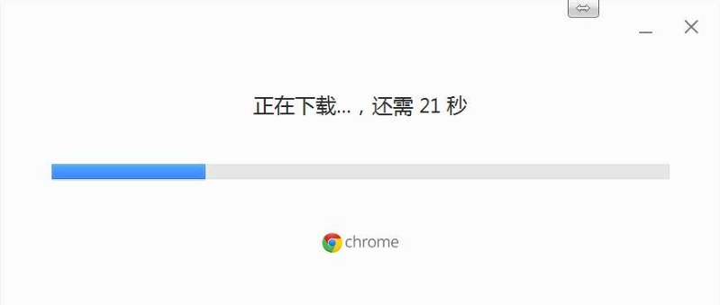
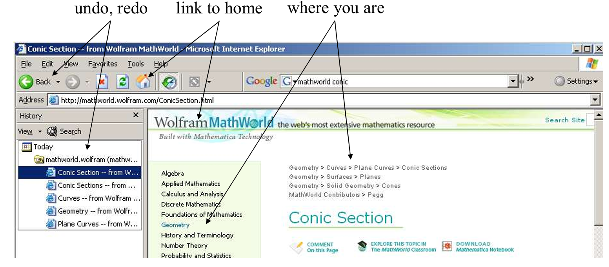
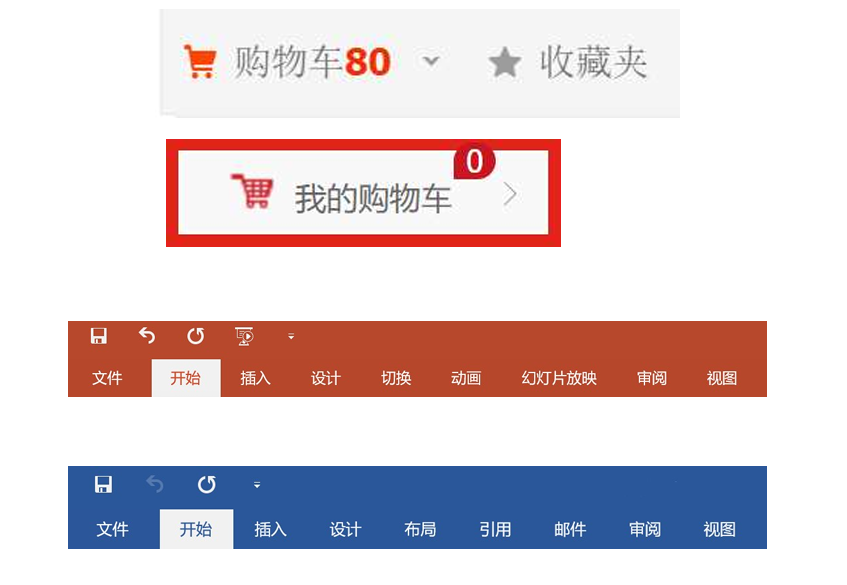
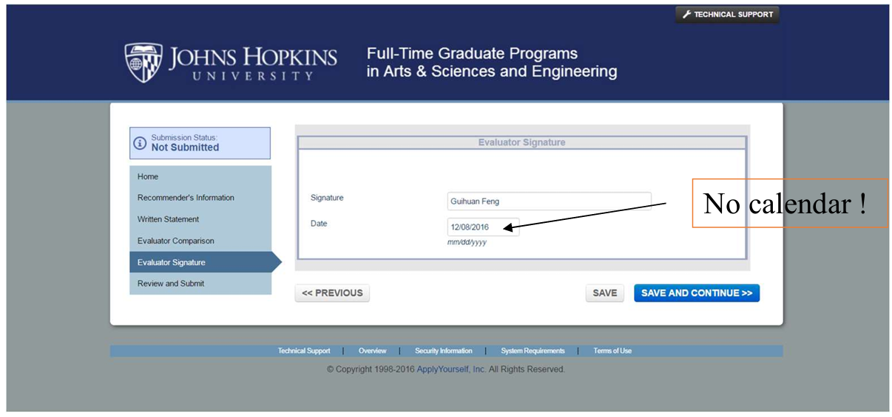
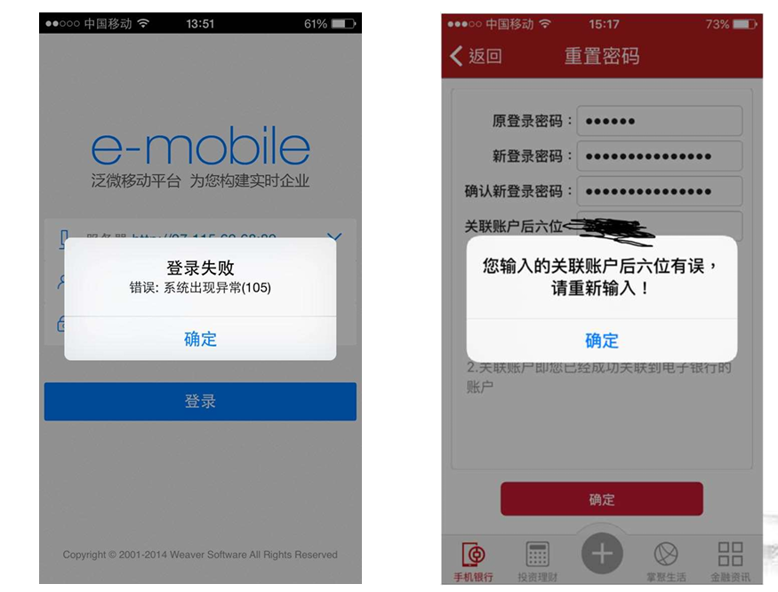
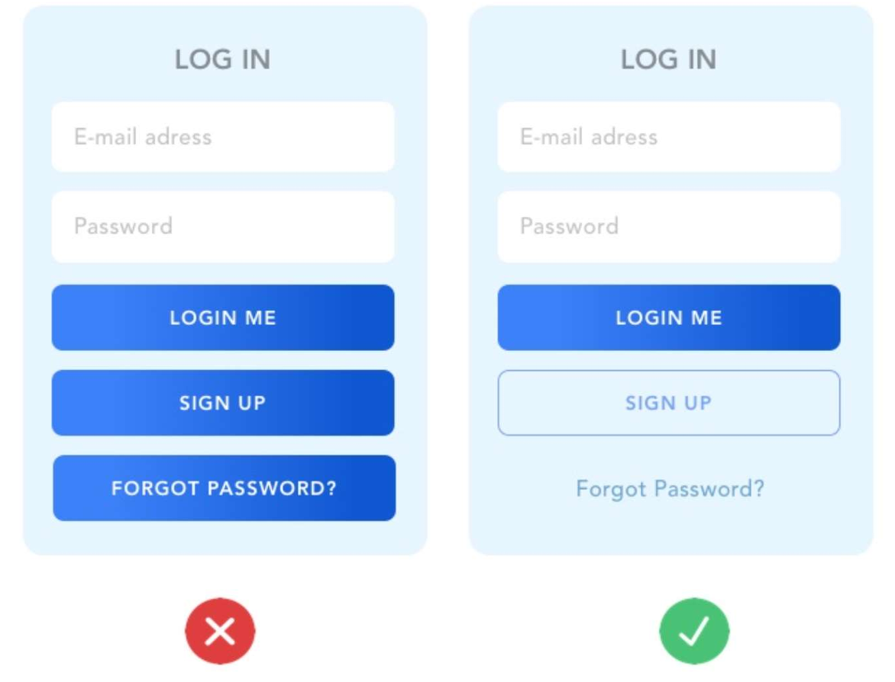
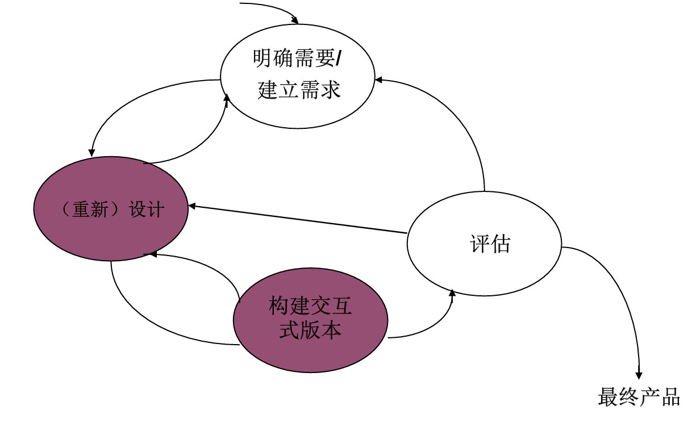
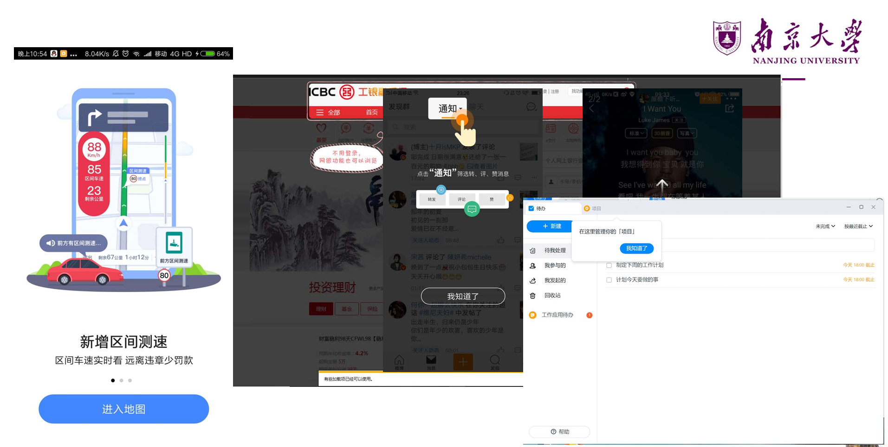
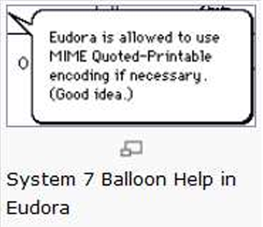

# 1. 人机交互概述

> HCI is a discipline concerned with the design, evaluation and implementation of interactive computing systems for human use and with the study of major phenomena surrounding them.
>
> ——ACM SIGCHI

HCI 是一门涉及人类使用的交互式计算系统的设计、评估和实施以及围绕它们的主要现象的研究的学科

## 1.1 人机交互的研究内容

## 1.2 HCI的重要性

**市场角度** 

- 用户期望简单易用的系统 
- 对设计低劣系统的容忍度越来越差 

**企业角度** 

- 提高员工的生产效率 
- 降低产品的开发成本 
- 降低产品的后续支持成本 

**用户角度** 

- 获得较高的主观满意度 
- 减少时间、金钱、生命损失

## 1.3 HCI与系统工程

# 2. 人机交互历史

新的界面变革包含了上一代界面，旧的交互方式任有存在的必要性

## 2.1 发展阶段

### 2.1.1 批处理阶段

每次只能由一个用户对计算机进行操作

编写程序使用以“0|1”串表示的机器语言

- 不符合人的习惯 
- 耗费时间，又容易出错 
- 只有少数专业人士才能够运用自如

### 2.1.2 联机终端时代

1950s，命令行界面出现

- 一维界面 
- 回车后不能再对命令内容进行修改 

如何为各种命令制定恰当的名称 

- 大部分命令语言对用户输入的要求非常严格 
- 命令名称的缩写在一定程度上减轻了用户的使用负担

### 2.1.3 图形用户界面GUI时期

- 1962年，Ivan Sutherland创建Sketchpad 
- 1964年，Douglas Engelbart发明了鼠标 
- WIMP界面 
  - 用户可在窗口内选取任意交互位置，且不同窗口之间能够叠加 
  - 二维半界面 
- “直接操纵”：GUI的主要特征 
- 问题：图形用户界面优于字符界面？ 
  - 不同的交互方式本身在可用性方面并没有根本性的不同，更重要的是认真对待界面设计的态度。 [Whiteside 1985] 

## 2.2 信息领域的巨搫

### 2.2.1 Ivan Sutherland

SketchPad, 1963 

- 第一个交互式绘图系统 
- 许多思想仍沿用 
- 使用光笔画图 
- 计算机图形学之父 

第一个虚拟头盔 

- 实现了三维立体显示 
- 虚拟现实之父

### 2.2.2 Douglas Engelbart

发明鼠标，1964

超文本技术的研究

第一个标准化的编辑器NLS(oNLine System)

### 2.2.3 Alan C. Kay

1977年Xerox PARC的Alan Kay 

- 提出为服务于个人的直接操作界面 “Dynabook” 
- 这是现代笔记本电脑原型 
- “每个人都想拥有自己的PC，就像每个人都想拥有自己的汽车”

发明面向对象的编程语言“Smalltalk”

### 2.2.4 Mark Weiser

普适计算（Pervasive Computing）是21世纪的计算模式

于1988年在Xerox PARC的计算机科学实验室首次提出了这个概念

- 它把计算机嵌入到各种类型的设备中，建立一个将计算和通信融入人类生活空间的交互环境，从而极大地提高个人的工作以及与他人合作的效率

## 2.3 交互设备历史

### 2.3.1 Xerox Alto (Star的前身)-1973

- 真正意义上的首台个人计算机：有键盘和显示器、图形界面技术、以太网技术

### 2.3.2 Xerox Star - 1981

第一个为商务人员设计的商用图形界面PC 

- 具有了桌面电脑的主要特征 

第一个基于可用性工程的系统 

- 有原型设计和分析 
- 可用性测试，迭代式的改进

### 2.3.3 IBM PC - 1981

1981年8月12日，IBM正式发布了历史上第一台PC，从此人类就进入了个人电脑时代。IBM PC改变了我们的生活和工作方式

### 2.3.4 Apple Lisa - 1982

### 2.3.5 Apple Macintosh（1984）

获得了商业上的成功 

- 价格低- $2500 
- 界面友好 
- 支持第三方应用 
- 高质量图像和激光打印

### 2.3.6 MS Windows (1987)

## 2.4 未来的人机交互

图形用户界面正遭受越来越多的批评 

- One ear, one finger, one eye 
- “计算机能像书本一样方便地使用和携带”?

多媒体界面 

- 引入动画、音视频等动态媒体 
- 二维半 -> 三维或更高 

多通道交互技术 

- 具有并行性，可同时接收来自多个通道的信息 

虚拟现实、语音交互、脑机交互

**第六感系统**

下一代界面的主要风格将是没有命令的用户界面 

- 由更多的媒体类型来构成更高的信息维度  
- 交互也将高度便携和个性化

# 3. 交互设计原则与目标

## 3.1 交互框架

作用：

- 提供理解或定义某种事物的一种结构
- 能够帮助人们结构化设计过程
- 认识设计过程中的主要问题
- 还有助于定义问题所涉及的领域

### 3.1.1 目标Goal vs. 意图Intention

**单个目标可对应多个意图**

- 举例：删除文档中的部分内容的目标 
- 意图1：通过编辑菜单删除 
- 意图2：通过删除按钮删除 
- 每个意图可包含一系列活动

### 3.1.2 EEC（Execution-Evaluation Cycle，执行评估周期）模型

用户操作系统的过程由**“执行意图”**与**“评估反馈”**两个循环、共七个阶段组成。

### 3.1.3 执行隔阂 & 评估隔阂

**执行隔阂**：用户为达目标而制定的动作与系统允许的动作之间的差别

- 界面有没有能完成用户想法的东西

**评估隔阂**：系统状态的实际表现与用户预期之间的差别

- 完成了，但是实际效果符不符合用户预期

### 3.1.4 扩展的EEC框架

EEC模型不能描述**人与系统通过界面进行的通信**

四个构成部分+四个步骤(翻译过程)

- 系统(S)：内核语言 
- 用户(U)：任务语言 
- 输入(I)：输入语言 
- 输出(O)：输出语言

## 3.2 人机交互质量观

### 3.2.1 背景概述

**软件产品的用户群体已发生巨大转变**：热爱技术的专业人员 -> 缺乏耐心的消费者

- “用户友好”：用户希望在完成任务的时候，机器不要碍手碍脚；不同用户的需求各异，不能从系统单方面友好
- “可用”：具体的可用性标准
- “用户体验”：使用户喜欢产品

**观念转变**：传统软件质量观（侧重内部效率、可靠、可维护性） -> 人机交互质量观（用户视角）

### 3.2.2 可用性目标

目的是为交互设计人员提供一个评估交互式产品和用户体验各方面的具体方法

1. **易学性（learnability）：使用系统的难易**
   - 关键问题在于确定用户准备花费多少时间学习一个产品
   - 让用户学会执行某种任务需要花费多长时间
2. **易记性（memorability）：学会使用并记住该产品如何使用的难易程度**
   - 学会某个系统后，应能够迅速回想起它的使用方法，而不必重复学习
   - 影响因素：
     - 意义：有意义的图标、命令名和菜单项
     - 位置：将特定对象放在某个特殊位置
     - 分组：对事物按照逻辑进行恰当的分组
     - 惯例：尽可能使用通用的对象或符号
     - 冗余：使用多个感知通道对信息进行编码
3. **效用性（utility）：可以让用户做他们需要做的或想做的事情**
   - 高效用：提供强大计算工具的会计软件包
   - 低效用：软件绘图工具不允许用户徒手绘制，只能选择绘制多边形
4. **高效率（efficiency）：产品在对用户执行任务的支持程度**
   - 当用户学会使用产品之后，用户应该具有更高的生产力水平（效率）
   - 效率指熟练用户到达学习曲线上平坦阶段时的稳定绩效水平
5. **安全性（safety）：避免用户发生危险和陷入不好的情形**
   - 第一个层面和工效学相关，如在特殊环境中允许远程操控计算机
   - 第二个层面指帮助任何用户在任何情况下避免因偶然执行不必要的行动而造成的危险
     - 包括用户对出错可能导致的后果引起的恐惧，以及恐惧心理如何影响用户行为
   - 减少按键/按钮被误启动的风险；为用户提供各种出错时的恢复方法

### 3.2.3 用户体验目标

通常交互式系统包含一个多样性的用户体验目标，涵盖了一系列**情绪和感受体验**

#### 3.2.3.1 体验和可用性的关系

主观vs.客观

**矛盾性**

- 许多玩家喜欢找最具挑战、非简单的游戏：违反可用性
- 用塑料锤砸屏幕上的地鼠较用鼠标点击更费劲且更易出错，但会带来一个更愉快和有趣的体验

有些可用性和用户体验目标是不兼容的

- 如设计一个既安全又有趣的过程控制系统可能是不可能或不可取的

**认识和理解可用性和其他用户体验目标之间的关系是交互设计的核心**！

#### 3.2.3.2 超越可用性

Schaffer认为，应该更多地关注用户体验而非可用性

> 如：很多网站旨在说服或影响，而不是让用户以一种高效的方式执行任务。如网上商店的核心策略是吸引人们购买他们可能没有想到他们需要的东西，这可能与可用性目标不兼容

**Dark Pattern**：某些“狡猾”的设计会导致一个负面体验

以说服为目的的设计关键主要是采用**巧妙和令人愉快的方式**令人信任和感到舒服

## 3.3 可用性工程

**完整的可用性工程过程** 

- 了解用户 -> 竞争性分析 -> 设定可用性目标 -> 用户参与的设计 -> 迭代设计 -> 产品发布后的工作

### 3.3.1 用户和任务观察

了解产品的目标用户是可用性工程的第一个步骤

- 要**直接**与潜在用户进行接触 
- 不要满足于间接的接触和道听途说 
- “你”不是用户！

### 3.3.2 场景

简便易行的原型工具，通过省略整个系统的若干部分来减少实现的复杂性

- 水平原型：减少功能的深度并获得界面的表层
- 垂直原型：减少功能的数量而对所选功能进行完整实现

### 3.3.3 边做边说法

让真实用户在使用系统执行一组特定任务的时候，讲出他们的所思所想

**最有价值的单个可用性工程方法**

可了解用户为什么这样做，并确定其可能对系统产生的误解

实验人员需要不断地提示用户，或请他们事先观摩

### 3.3.4 启发式评估

由**可用性专家**根据预定义的启发式原则，独立检查界面，识别违反这些原则的可用性问题

研究表明，能够发现许多可用性问题，剩下的可以通过简化的边做边说方法发现

为避免个人的偏见，应当让多个不同的人来进行经验性评估

> 问题：究竟需要多少个测试专家参与？
>
> n个测试专家能够发现的可用性问题数量：$N(1-(1-L)^n ) $
>
> - N：设计中存在的可用性问题的总数
> - L：单个参与者所能够发现的可用性问题的比例（经验取值约为31% ）
>
> 5名专家能够发现约80%的可用性问题，被认为是最恰当的可用性测试用户数量

## 3.4 设计规则

> 这些规则大多来源于提出者的经验和总结，不是完美无缺的，甚至有些会相互矛盾，在具体使用时，必须根据实际情况进行调整和细化

**基本规则**：1. 可学习性 2. 灵活性 3. 健壮性

### 3.4.1 黄金规则

#### 3.4.1.1 尽可能保持一致

- 一致性让界面变得熟悉和可预测 
- 最容易被违背的原则 
  - 相似操作下一致的动作序列 
  - 菜单、帮助中一致的术语 
  - 一致的颜色、布局、字体等

#### 3.4.1.2 符合普遍可用性

充分考虑用户操作的熟练程度、年龄范围、身体状况（如是否有残疾）等多方面的不同需求

- **专家用户** 
  - 缩写或快捷键操作，以丰富界面 
  - 可感知的系统质量 
- **新手用户** 
  - 尽可能提供引导性的帮助信息，帮助用户完成特定的交互任务

#### 3.4.1.3 提供信息丰富的反馈

- 对常用操作，则反馈信息可以相对简短
- 对不常用操作，系统的反馈信息就应该丰富一些

途径：界面对象的**可视化**表现

#### 3.4.1.4 设计说明对话框以生成结束信息

目的：让用户知道什么时候他们已经完成了任务

- 使用户产生完成任务的满足感和轻松感 
- 有助于让用户放弃临时的计划和想法

#### 3.4.1.5 预防并处理错误

目的：提供故障预防和简单的故障处理措施

作用：用户错误能够在清晰的指导下进行恢复

错误预防 

- 将不适当的菜单选项功能以灰色显示屏蔽 
- 禁止在数值输入域中出现字母字符 

错误处理 

- 提供简单的、有建设性的、具体的指导来帮助用户恢复操作

#### 3.4.1.6 让操作容易撤销

目的：减轻用户的焦虑情绪，并鼓励用户尝试新的选项

可以是单独的操作，也可以是一个数据输入任务或一组完整的操作等

#### 3.4.1.7 支持内部控制点

鼓励用户成为行为的主动者而不是响应者

- 避免模态对话框 
- 避免很长的引导序列 
- 提供出口：取消、重做、放弃等

#### 3.4.1.8 减轻短时记忆负担

出发点：人凭借短时记忆存储的信息是非常有限

- 界面显示尽可能简单 
- 不同显示页面的风格应该统一 
- 尽可能减少在窗口之间的移动 
- 并且要确保提供用户足够的学习代码、记忆操作方法和操作序列的时间 
- 提供适当的在线帮助信息

### 3.4.2 启发式规则

#### 3.4.2.1 系统状态的可见度

对于用时较长的操作（长于3-5秒）,需要给出显式的反馈（进度条、刷新界面、改变颜色等等）

#### 3.4.2.2 系统和现实世界的吻合

界面上的语言要使用用户熟悉的词汇、短语和概念，而不是内部术语。

遵循现实世界的惯例，使信息以自然和逻辑的顺序出现。

#### 3.4.2.3 用户享有控制权和自主权

对于由于错误而做出的选择，提供一个“返回方法”

如撤销或重做，或者重新启动的方法（网站上的返回主页链接）

#### 3.4.2.4 一致性和标准化

产品内部对同一功能使用的术语和形式一致

使用没有歧义的图标或图片

一致的颜色、布局、大小写、字体等

#### 3.4.2.5 避免出错

Avoid possibility for user to make errors

#### 3.4.2.6 依赖识别而非记忆

#### 3.4.2.7 使用的灵活性和高效性

充分考虑不同类型用户的使用偏好（老年人、专家用户等）

#### 3.4.2.8 帮助用户识别、诊断和恢复错误

#### 3.4.2.9 帮助和文档

#### 3.4.2.10 审美感和最小化设计

# 4. 交互需求定义

需求获取是项目设计的第一个阶段

产品是不同的/用户是不同的

## 4.1 需求

**关于目标产品的一种陈述，它指定了产品应做什么，或者应如何工作**

应该是具体、明确和无歧义的

- “完整下载任何网页的时间应少于5秒”
- “女孩们应觉得这个网站吸引人”（×）

需求活动：**搜集数据** 、**解释数据** 、**提取需求**

### 4.1.1 产品特性

**功能不同** 

- 智能冰箱：应能够提示牛奶已用完 
- 字处理器：系统应支持多种格式 

**物理条件不同** 

- 移动设备运行的系统应尽可能小，屏幕显示限制 

**使用环境不同** 

- 物理环境：如操作环境中的采光、噪音和尘土状况 
- 社会环境：是否要共享数据，同步还是异步？ 
- 组织环境：用户支持的质量、响应速度如何？是否提供培训资源或设施？ 
- 技术环境：产品应能运行于何种平台上？应与何种技术兼容？

### 4.1.2 用户特性

心理学原理部分，假设每个人都有相似的能力和局限性 

- 合理的，心理学原理可以适用于大多数人 

交互产品设计人员应该意识到个性的差异 

- 用户并不是完全相同的 
- 在设计中尽可能地体现这些差异 

**用户差异：体验水平 、年龄 、文化 、健康**

## 4.2 体验水平差异

程序员只创造适合**专家**的界面，市场人员要求只适合**新手**的交互，而数目最多、最稳定和最重要的用户群是中间用户，**中间用户往往被忽略**

设计目标

- 让新手快速和无痛苦地成为中间用户
- 避免为想成为专家的用户设置障碍
- 让中间用户感到愉快

### 4.2.1 新手用户

**敏感**，且很容易在开始有**挫折感**

设计要求 

- 不能将新手状态视为目标 
- 让学习过程快速且富有针对性 
- 确保程序充分反映了用户关于任务的心智模型 
- 无论什么样的帮助，都**不应该在界面中固定** 
- 具有**向导**功能的对话框帮助较好 
- 不要使用在线帮助作为学习指导 
- 菜单项应该是**解释性**的

### 4.2.2 专家用户

对缺少经验的用户有着异乎寻常的影响（“专家说不好就不好”），欣赏**更新的且更强大功能**，不会受到复杂性增加的干扰

设计要求：对经常使用的工具集，要能**快速访问**

### 4.2.3 中间用户

需要工具，知道如何使用参考资料，能够区分经常使用和很少使用的功能，高级功能的存在让永久的中间用户放心

设计要求 

- **工具提示（Tooltip）**是适合中间用户最好的习惯用法 
- **在线帮助**是永久中间用户的极佳工具 
- 常用功能中的工具放在用户界面的前端和中心位置 
- 提供一些**额外的高级特性**

> **解释工具栏控件**
>
> Apple公司的System 7操作系统最早尝试解决该问题：气球帮助
>
> - 鼠标经过与气球弹出之间没有延迟 
> - 气球会遮挡一大块应用的区域 
> - 模态帮助系统，无法同时学习和使用
>
> 
>
> 工具提示(ToolTips)
>
> - Microsoft提出的气球帮助的变体 
> - 延时出现的时机非常好，大约1秒后显示帮助 
> - 只包含一个单词或非常短的词组
>
> 

## 4.3 用户差异

### 4.3.1 年龄差异

**老年人** 

- 65岁以上的老年人中多数有某种残疾 
- 技术应能提供**对残缺部位的支持**：如听觉、言语和灵活性 
- 设计必须清楚、简单并且容许出错 
- 利用**冗余**来支持信息访问 

**儿童** 

- 在为儿童设计交互式系统时让他们**参加**很重要 
- 允许**多种输入模式**（包括触觉或手写） 
- 通过文本、图形和声音呈现**信息的冗余显示**也将增强他们的体验

### 4.3.2 文化差异

在不同的文化中**符号**有不同的意思 

- 勾（√）和叉（X）分别表示肯定和否定 
- 不能假设每个人都以同样的方式解释符号 

**姿势**的理解存在差别 

- 点头vs.摇头 

**颜色**的使用 

- 红色和绿色在不同的国家意味着不同的事物 
- 通过冗余阐明特定颜色的指定意义

### 4.3.3 健康差异

每个国家至少有10%的人口有残疾

**视觉损伤** 

- GUI应用的增加降低了视觉损伤用户应用的可能性 
- 辅以声音的应用和触觉的应用（Hearme，seeing AI） 

**听觉损伤** 

- 较视觉残疾对与图形界面交互的影响要小 
  - 界面中多媒体的增加和声音的应用带来了交互困难 
- 给听觉内容加文字描述 
- 姿势识别可作为信息输出方式

**身体损伤** 

- 如在控制和应用手的移动方面存在差别 
- 语音输入和输出对那些没有言语障碍的人是一种选择 
- 用姿势和眼球移动的跟踪进行控制 

**语音损伤** 

- 提供合成语音和基于文本的通信 
- 语音合成必须快速地反映自然会话的步调 

**诵读困难** 

- 提供拼写更正功能 
- 一致性的导航结构和清晰的标识提示

## 4.4 用户建模

每个用户都是不同的，如何使用用户的研究数据设计出满意的产品？

**人物角色（Personas）** 

- 不是真实的人 
- 是基于观察到的那些真实人的行为和动机，并且在整个设计过程中代表真实的人 
- 是在人口统计学调查收集到的实际用户的行为数据的基础上形成的综合原型 
- 概念简单，但使用起来相当复杂 
- 拼凑出几个用户档案是不行的

### 4.4.1 人物角色的作用

解决产品开发过程中出现的3个设计问题：

1. **弹性用户** 
   - 为弹性用户设计赋予了开发者根据自己的意愿编码，而仍然能够为“用户”服务的许可 
   - 如设计医院产品时，考虑设计能够满足所有护士的产品 
2. **自参考设计** 
   - 设计者或者程序员将其自己的目标、动机、技巧及心智模型投射到产品的设计中 
3. **边缘情况设计** 
   - 必须考虑边缘情况，但它们又不应该成为设计的关注点 
   - 问：A会经常进行这种操作吗？

### 4.4.2 人物角色的构造

错误观点 

- A：专业开发人员知道什么可行，什么对用户最合适 
- B：用户最了解他们需要什么，应当让他们指导设计工作 

人物角色 

- 与某个系统有关的用户假定的一组公共需要、兴趣、期望、行为模式和责任 
- 这些属性可能是若干用户共有 
- 同一个用户也可以扮演系统的任意个不同角色 
- 举例：频繁使用文字处理软件的用户：写作者的角色、编辑者的角色、排版者的角色……

基于如下问题 

1. 谁将使用系统？ 
2. 这些用户属于哪些类型的人群？ 
3. 是什么因素决定他们将怎样使用系统？ 
4. 他们与软件的关系有什么特征？ 
5. 他们通常需要软件提供什么支持？ 
6. 他们对软件会有怎样的行为？他们对软件的行为有什么期望？

> 设计运行在笔记本电脑上的一个演示程序包 
>
> - 销售部的一位同事 
> - 公司的销售代表 
>   - 能快捷方便地创建标准格式的简单幻灯片 
>   - 能使用带有项目的文字内容或简单图表 
>   - 图形依靠软件提供的标准图形库 
> - 人物角色：日常最低要求演示者 
>   - 经常使用；快速、方便操作；简单使用； 
>   - 简洁、标准格式：带有项目符号的列表、条形图、饼图、图形等；标准图形库

### 4.4.3 建模过程

**拼凑**：采用头脑风暴方法，产生一些零碎概念或模型的片段，先不去考虑他们的细节 

**组织**：将这些片段按照所构造模型的需要进行分组和分类，归并或删除那些冗余重叠的东西 

**细节**：建立和完善相应描述，补充遗漏的数据

**求精**：对模型进行推敲，以便改进和完善 

以上过程循环反复

## 4.5 需求获取

### 4.5.1 观察

设计的最初，可能不知道问什么问题或由谁来回答这些问题，没有与参与者实际的讨论和观察是不可能得到完整的工作流程画面的，有用的信息可以通过观察人们在工作环境中完成他们的活动来获得 

**直接观察**：陪同他们工作而直接获得信息，可能影响被观察者的日常活动（可提问：这是你通常完成任务的方式吗？） 

**间接观察**：用视频/录音获得信息，观察者更舒适

### 4.5.2 场景

表示任务和工作结构的“非正式的叙述性描述”，以叙述的方式描述人的行为或任务，从中发掘出任务的上下文环境、用户的需要、需求；形式可以类似一篇故事、一个小品或者在给定环境下按照时间顺序的一段情节 

“讲故事”是人们解释自己做什么或者希望执行某个任务的最自然方式，故事的焦点就是用户希望达到的目标；若场景说明不断提到某个特定形式、行为或者地点，就表明它是该活动的核心 

场景说明通常来自专题讨论或者访谈，目的是解释或讨论有关用户目标的一些问题

> 
>
> 结论：正确输入作者姓名的重要性、用户对输入口令感到反感、应提供更灵活的检索方法、在匹配不成功时，应给出相近的检索结果

## 4.6 需求定义的步骤

### 4.6.1 创建问题和前景综述

**设计问题综述应该简明地反映需要改变的情况**，来服务人物角色和提供产品给人物角色的商业组织

> H 公司的顾客满意率低，市场占有率从去年开始已经下降了10%。因为用户没有充足的工具完成X、 Y和Z任务，而完成这些任务则能帮助用户满足其目标G。

**前景综述高层次的设计视图和需求是问题综述的倒置**

> 设计新的产品P会帮助用户实现目标G，这让用户能更好地（精确度和效率等）完成X、Y和Z任务，并且不会产生其现在遇到的A、B和C等问题。从而会有力地改善H公司的顾客满意度，并且会增加市场占有率。

### 4.6.2 头脑风暴

目的：**“说反话”** ，尽可能地去除成见，允许设计师**以开放和灵活的方式想象来构建场景剧本**，使用他们的思维从场景剧本中得到需求，将头脑置于“解决问题模式”中 

特点：不受约束且不加以评判；不要花费太多时间，当想法重复或变慢时停止

### 4.6.3 确定人物角色的期望

一个人的心理模型通常是根深蒂固的 

界面表现模型与用户心理模型尽量匹配是非常重要的 

对于每一个基本和次要人物角色，需确定 

- 影响人物角色愿望的态度、经历、渴望，以及其他社会、文化、环境和认知因素 
- 人物角色在使用产品体验方面可能有的一般期待和愿望 
- 人物角色认为什么是数据的基本单元或者元素 

理清如下问题 

- 主体首先提到的是什么？ 
- 他们使用哪些动作单词？ 
- 他们没有提及对象中的哪些中间步骤、任务或者对象？

### 4.6.4 构造情境场景剧本

情境场景剧本 

- 关注人物角色的活动，及其心理模型和动机 
- 将注意力集中在设计的产品中怎样能够最好地帮助你的人物角色达到目标 
- 应该专注于高层次的从用户角度描述的行动，广而浅 
- 不应描述产品或交互的细节 

解决的问题 

- 产品是否会被使用很长一段时间？ 
- 人物角色是否经常被打断？ 
- 和其一起使用的其他产品是什么？ 
- 人物角色需要做哪些基本的行动来实现目标？ 
- 使用产品预期的结果是什么？ ……

### 4.6.5 确定需求

 

