# 1. 人机交互概述

> HCI is a discipline concerned with the design, evaluation and implementation of interactive computing systems for human use and with the study of major phenomena surrounding them.
>
> ——ACM SIGCHI

HCI 是一门涉及人类使用的交互式计算系统的设计、评估和实施以及围绕它们的主要现象的研究的学科

## 1.1 人机交互的研究内容

## 1.2 HCI的重要性

**市场角度** 

- 用户期望简单易用的系统 
- 对设计低劣系统的容忍度越来越差 

**企业角度** 

- 提高员工的生产效率 
- 降低产品的开发成本 
- 降低产品的后续支持成本 

**用户角度** 

- 获得较高的主观满意度 
- 减少时间、金钱、生命损失

## 1.3 HCI与系统工程

# 2. 人机交互历史

新的界面变革包含了上一代界面，旧的交互方式任有存在的必要性

## 2.1 发展阶段

### 2.1.1 批处理阶段

每次只能由一个用户对计算机进行操作

编写程序使用以“0|1”串表示的机器语言

- 不符合人的习惯 
- 耗费时间，又容易出错 
- 只有少数专业人士才能够运用自如

### 2.1.2 联机终端时代

1950s，命令行界面出现

- 一维界面 
- 回车后不能再对命令内容进行修改 

如何为各种命令制定恰当的名称 

- 大部分命令语言对用户输入的要求非常严格 
- 命令名称的缩写在一定程度上减轻了用户的使用负担

### 2.1.3 图形用户界面GUI时期

- 1962年，Ivan Sutherland创建Sketchpad 
- 1964年，Douglas Engelbart发明了鼠标 
- WIMP界面 
  - 用户可在窗口内选取任意交互位置，且不同窗口之间能够叠加 
  - 二维半界面 
- “直接操纵”：GUI的主要特征 
- 问题：图形用户界面优于字符界面？ 
  - 不同的交互方式本身在可用性方面并没有根本性的不同，更重要的是认真对待界面设计的态度。 [Whiteside 1985] 

## 2.2 信息领域的巨搫

### 2.2.1 Ivan Sutherland

SketchPad, 1963 

- 第一个交互式绘图系统 
- 许多思想仍沿用 
- 使用光笔画图 
- 计算机图形学之父 

第一个虚拟头盔 

- 实现了三维立体显示 
- 虚拟现实之父

### 2.2.2 Douglas Engelbart

发明鼠标，1964

超文本技术的研究

第一个标准化的编辑器NLS(oNLine System)

### 2.2.3 Alan C. Kay

1977年Xerox PARC的Alan Kay 

- 提出为服务于个人的直接操作界面 “Dynabook” 
- 这是现代笔记本电脑原型 
- “每个人都想拥有自己的PC，就像每个人都想拥有自己的汽车”

发明面向对象的编程语言“Smalltalk”

### 2.2.4 Mark Weiser

普适计算（Pervasive Computing）是21世纪的计算模式

于1988年在Xerox PARC的计算机科学实验室首次提出了这个概念

- 它把计算机嵌入到各种类型的设备中，建立一个将计算和通信融入人类生活空间的交互环境，从而极大地提高个人的工作以及与他人合作的效率

## 2.3 交互设备历史

### 2.3.1 Xerox Alto (Star的前身)-1973

- 真正意义上的首台个人计算机：有键盘和显示器、图形界面技术、以太网技术

### 2.3.2 Xerox Star - 1981

第一个为商务人员设计的商用图形界面PC 

- 具有了桌面电脑的主要特征 

第一个基于可用性工程的系统 

- 有原型设计和分析 
- 可用性测试，迭代式的改进

### 2.3.3 IBM PC - 1981

1981年8月12日，IBM正式发布了历史上第一台PC，从此人类就进入了个人电脑时代。IBM PC改变了我们的生活和工作方式

### 2.3.4 Apple Lisa - 1982

### 2.3.5 Apple Macintosh（1984）

获得了商业上的成功 

- 价格低- $2500 
- 界面友好 
- 支持第三方应用 
- 高质量图像和激光打印

### 2.3.6 MS Windows (1987)

## 2.4 未来的人机交互

图形用户界面正遭受越来越多的批评 

- One ear, one finger, one eye 
- “计算机能像书本一样方便地使用和携带”?

多媒体界面 

- 引入动画、音视频等动态媒体 
- 二维半 -> 三维或更高 

多通道交互技术 

- 具有并行性，可同时接收来自多个通道的信息 

虚拟现实、语音交互、脑机交互

**第六感系统**

下一代界面的主要风格将是没有命令的用户界面 

- 由更多的媒体类型来构成更高的信息维度  
- 交互也将高度便携和个性化

# 3. 交互设计原则与目标

## 3.1 交互框架

作用：

- 提供理解或定义某种事物的一种结构
- 能够帮助人们结构化设计过程
- 认识设计过程中的主要问题
- 还有助于定义问题所涉及的领域

### 3.1.1 目标Goal vs. 意图Intention

**单个目标可对应多个意图**

- 举例：删除文档中的部分内容的目标 
- 意图1：通过编辑菜单删除 
- 意图2：通过删除按钮删除 
- 每个意图可包含一系列活动

### 3.1.2 EEC（Execution-Evaluation Cycle，执行评估周期）模型

用户操作系统的过程由**“执行意图”**与**“评估反馈”**两个循环、共七个阶段组成。

### 3.1.3 执行隔阂 & 评估隔阂

**执行隔阂**：用户为达目标而制定的动作与系统允许的动作之间的差别

- 界面有没有能完成用户想法的东西

**评估隔阂**：系统状态的实际表现与用户预期之间的差别

- 完成了，但是实际效果符不符合用户预期

### 3.1.4 扩展的EEC框架

EEC模型不能描述**人与系统通过界面进行的通信**

四个构成部分+四个步骤(翻译过程)

- 系统(S)：内核语言 
- 用户(U)：任务语言 
- 输入(I)：输入语言 
- 输出(O)：输出语言

## 3.2 人机交互质量观

### 3.2.1 背景概述

**软件产品的用户群体已发生巨大转变**：热爱技术的专业人员 -> 缺乏耐心的消费者

- “用户友好”：用户希望在完成任务的时候，机器不要碍手碍脚；不同用户的需求各异，不能从系统单方面友好
- “可用”：具体的可用性标准
- “用户体验”：使用户喜欢产品

**观念转变**：传统软件质量观（侧重内部效率、可靠、可维护性） -> 人机交互质量观（用户视角）

### 3.2.2 可用性目标

目的是为交互设计人员提供一个评估交互式产品和用户体验各方面的具体方法

1. **易学性（learnability）：使用系统的难易**
   - 关键问题在于确定用户准备花费多少时间学习一个产品
   - 让用户学会执行某种任务需要花费多长时间
2. **易记性（memorability）：学会使用并记住该产品如何使用的难易程度**
   - 学会某个系统后，应能够迅速回想起它的使用方法，而不必重复学习
   - 影响因素：
     - 意义：有意义的图标、命令名和菜单项
     - 位置：将特定对象放在某个特殊位置
     - 分组：对事物按照逻辑进行恰当的分组
     - 惯例：尽可能使用通用的对象或符号
     - 冗余：使用多个感知通道对信息进行编码
3. **效用性（utility）：可以让用户做他们需要做的或想做的事情**
   - 高效用：提供强大计算工具的会计软件包
   - 低效用：软件绘图工具不允许用户徒手绘制，只能选择绘制多边形
4. **高效率（efficiency）：产品在对用户执行任务的支持程度**
   - 当用户学会使用产品之后，用户应该具有更高的生产力水平（效率）
   - 效率指熟练用户到达学习曲线上平坦阶段时的稳定绩效水平
5. **安全性（safety）：避免用户发生危险和陷入不好的情形**
   - 第一个层面和工效学相关，如在特殊环境中允许远程操控计算机
   - 第二个层面指帮助任何用户在任何情况下避免因偶然执行不必要的行动而造成的危险
     - 包括用户对出错可能导致的后果引起的恐惧，以及恐惧心理如何影响用户行为
   - 减少按键/按钮被误启动的风险；为用户提供各种出错时的恢复方法

### 3.2.3 用户体验目标

通常交互式系统包含一个多样性的用户体验目标，涵盖了一系列**情绪和感受体验**

#### 3.2.3.1 体验和可用性的关系

主观vs.客观

**矛盾性**

- 许多玩家喜欢找最具挑战、非简单的游戏：违反可用性
- 用塑料锤砸屏幕上的地鼠较用鼠标点击更费劲且更易出错，但会带来一个更愉快和有趣的体验

有些可用性和用户体验目标是不兼容的

- 如设计一个既安全又有趣的过程控制系统可能是不可能或不可取的

**认识和理解可用性和其他用户体验目标之间的关系是交互设计的核心**！

#### 3.2.3.2 超越可用性

Schaffer认为，应该更多地关注用户体验而非可用性

> 如：很多网站旨在说服或影响，而不是让用户以一种高效的方式执行任务。如网上商店的核心策略是吸引人们购买他们可能没有想到他们需要的东西，这可能与可用性目标不兼容

**Dark Pattern**：某些“狡猾”的设计会导致一个负面体验

以说服为目的的设计关键主要是采用**巧妙和令人愉快的方式**令人信任和感到舒服

## 3.3 可用性工程

**完整的可用性工程过程** 

- 了解用户 -> 竞争性分析 -> 设定可用性目标 -> 用户参与的设计 -> 迭代设计 -> 产品发布后的工作

### 3.3.1 用户和任务观察

了解产品的目标用户是可用性工程的第一个步骤

- 要**直接**与潜在用户进行接触 
- 不要满足于间接的接触和道听途说 
- “你”不是用户！

### 3.3.2 场景

简便易行的原型工具，通过省略整个系统的若干部分来减少实现的复杂性

- 水平原型：减少功能的深度并获得界面的表层
- 垂直原型：减少功能的数量而对所选功能进行完整实现

### 3.3.3 边做边说法

让真实用户在使用系统执行一组特定任务的时候，讲出他们的所思所想

**最有价值的单个可用性工程方法**

可了解用户为什么这样做，并确定其可能对系统产生的误解

实验人员需要不断地提示用户，或请他们事先观摩

### 3.3.4 启发式评估

由**可用性专家**根据预定义的启发式原则，独立检查界面，识别违反这些原则的可用性问题

研究表明，能够发现许多可用性问题，剩下的可以通过简化的边做边说方法发现

为避免个人的偏见，应当让多个不同的人来进行经验性评估

> 问题：究竟需要多少个测试专家参与？
>
> n个测试专家能够发现的可用性问题数量：$N(1-(1-L)^n ) $
>
> - N：设计中存在的可用性问题的总数
> - L：单个参与者所能够发现的可用性问题的比例（经验取值约为31% ）
>
> 5名专家能够发现约80%的可用性问题，被认为是最恰当的可用性测试用户数量

## 3.4 设计规则

> 这些规则大多来源于提出者的经验和总结，不是完美无缺的，甚至有些会相互矛盾，在具体使用时，必须根据实际情况进行调整和细化

**基本规则**：1. 可学习性 2. 灵活性 3. 健壮性

### 3.4.1 黄金规则

#### 3.4.1.1 尽可能保持一致

- 一致性让界面变得熟悉和可预测 
- 最容易被违背的原则 
  - 相似操作下一致的动作序列 
  - 菜单、帮助中一致的术语 
  - 一致的颜色、布局、字体等

#### 3.4.1.2 符合普遍可用性

充分考虑用户操作的熟练程度、年龄范围、身体状况（如是否有残疾）等多方面的不同需求

- **专家用户** 
  - 缩写或快捷键操作，以丰富界面 
  - 可感知的系统质量 
- **新手用户** 
  - 尽可能提供引导性的帮助信息，帮助用户完成特定的交互任务

#### 3.4.1.3 提供信息丰富的反馈

- 对常用操作，则反馈信息可以相对简短
- 对不常用操作，系统的反馈信息就应该丰富一些

途径：界面对象的**可视化**表现

#### 3.4.1.4 设计说明对话框以生成结束信息

目的：让用户知道什么时候他们已经完成了任务

- 使用户产生完成任务的满足感和轻松感 
- 有助于让用户放弃临时的计划和想法

#### 3.4.1.5 预防并处理错误

目的：提供故障预防和简单的故障处理措施

作用：用户错误能够在清晰的指导下进行恢复

错误预防 

- 将不适当的菜单选项功能以灰色显示屏蔽 
- 禁止在数值输入域中出现字母字符 

错误处理 

- 提供简单的、有建设性的、具体的指导来帮助用户恢复操作

#### 3.4.1.6 让操作容易撤销

目的：减轻用户的焦虑情绪，并鼓励用户尝试新的选项

可以是单独的操作，也可以是一个数据输入任务或一组完整的操作等

#### 3.4.1.7 支持内部控制点

鼓励用户成为行为的主动者而不是响应者

- 避免模态对话框 
- 避免很长的引导序列 
- 提供出口：取消、重做、放弃等

#### 3.4.1.8 减轻短时记忆负担

出发点：人凭借短时记忆存储的信息是非常有限

- 界面显示尽可能简单 
- 不同显示页面的风格应该统一 
- 尽可能减少在窗口之间的移动 
- 并且要确保提供用户足够的学习代码、记忆操作方法和操作序列的时间 
- 提供适当的在线帮助信息

### 3.4.2 启发式规则

#### 3.4.2.1 系统状态的可见度

对于用时较长的操作（长于3-5秒）,需要给出显式的反馈（进度条、刷新界面、改变颜色等等）

#### 3.4.2.2 系统和现实世界的吻合

界面上的语言要使用用户熟悉的词汇、短语和概念，而不是内部术语。

遵循现实世界的惯例，使信息以自然和逻辑的顺序出现。

#### 3.4.2.3 用户享有控制权和自主权

对于由于错误而做出的选择，提供一个“返回方法”

如撤销或重做，或者重新启动的方法（网站上的返回主页链接）

#### 3.4.2.4 一致性和标准化

产品内部对同一功能使用的术语和形式一致

使用没有歧义的图标或图片

一致的颜色、布局、大小写、字体等

#### 3.4.2.5 避免出错

Avoid possibility for user to make errors

#### 3.4.2.6 依赖识别而非记忆

#### 3.4.2.7 使用的灵活性和高效性

充分考虑不同类型用户的使用偏好（老年人、专家用户等）

#### 3.4.2.8 帮助用户识别、诊断和恢复错误

#### 3.4.2.9 帮助和文档

#### 3.4.2.10 审美感和最小化设计

# 4. 交互需求定义

需求获取是项目设计的第一个阶段

产品是不同的/用户是不同的

## 4.1 需求

**关于目标产品的一种陈述，它指定了产品应做什么，或者应如何工作**

应该是具体、明确和无歧义的

- “完整下载任何网页的时间应少于5秒”
- “女孩们应觉得这个网站吸引人”（×）

需求活动：**搜集数据** 、**解释数据** 、**提取需求**

### 4.1.1 产品特性

**功能不同** 

- 智能冰箱：应能够提示牛奶已用完 
- 字处理器：系统应支持多种格式 

**物理条件不同** 

- 移动设备运行的系统应尽可能小，屏幕显示限制 

**使用环境不同** 

- 物理环境：如操作环境中的采光、噪音和尘土状况 
- 社会环境：是否要共享数据，同步还是异步？ 
- 组织环境：用户支持的质量、响应速度如何？是否提供培训资源或设施？ 
- 技术环境：产品应能运行于何种平台上？应与何种技术兼容？

### 4.1.2 用户特性

心理学原理部分，假设每个人都有相似的能力和局限性 

- 合理的，心理学原理可以适用于大多数人 

交互产品设计人员应该意识到个性的差异 

- 用户并不是完全相同的 
- 在设计中尽可能地体现这些差异 

**用户差异：体验水平 、年龄 、文化 、健康**

## 4.2 体验水平差异

程序员只创造适合**专家**的界面，市场人员要求只适合**新手**的交互，而数目最多、最稳定和最重要的用户群是中间用户，**中间用户往往被忽略**

设计目标

- 让新手快速和无痛苦地成为中间用户
- 避免为想成为专家的用户设置障碍
- 让中间用户感到愉快

### 4.2.1 新手用户

**敏感**，且很容易在开始有**挫折感**

设计要求 

- 不能将新手状态视为目标 
- 让学习过程快速且富有针对性 
- 确保程序充分反映了用户关于任务的心智模型 
- 无论什么样的帮助，都**不应该在界面中固定** 
- 具有**向导**功能的对话框帮助较好 
- 不要使用在线帮助作为学习指导 
- 菜单项应该是**解释性**的

### 4.2.2 专家用户

对缺少经验的用户有着异乎寻常的影响（“专家说不好就不好”），欣赏**更新的且更强大功能**，不会受到复杂性增加的干扰

设计要求：对经常使用的工具集，要能**快速访问**

### 4.2.3 中间用户

需要工具，知道如何使用参考资料，能够区分经常使用和很少使用的功能，高级功能的存在让永久的中间用户放心

设计要求 

- **工具提示（Tooltip）**是适合中间用户最好的习惯用法 
- **在线帮助**是永久中间用户的极佳工具 
- 常用功能中的工具放在用户界面的前端和中心位置 
- 提供一些**额外的高级特性**

> **解释工具栏控件**
>
> Apple公司的System 7操作系统最早尝试解决该问题：气球帮助
>
> - 鼠标经过与气球弹出之间没有延迟 
> - 气球会遮挡一大块应用的区域 
> - 模态帮助系统，无法同时学习和使用
>
> 
>
> 工具提示(ToolTips)
>
> - Microsoft提出的气球帮助的变体 
> - 延时出现的时机非常好，大约1秒后显示帮助 
> - 只包含一个单词或非常短的词组
>
> 

## 4.3 用户差异

### 4.3.1 年龄差异

**老年人** 

- 65岁以上的老年人中多数有某种残疾 
- 技术应能提供**对残缺部位的支持**：如听觉、言语和灵活性 
- 设计必须清楚、简单并且容许出错 
- 利用**冗余**来支持信息访问 

**儿童** 

- 在为儿童设计交互式系统时让他们**参加**很重要 
- 允许**多种输入模式**（包括触觉或手写） 
- 通过文本、图形和声音呈现**信息的冗余显示**也将增强他们的体验

### 4.3.2 文化差异

在不同的文化中**符号**有不同的意思 

- 勾（√）和叉（X）分别表示肯定和否定 
- 不能假设每个人都以同样的方式解释符号 

**姿势**的理解存在差别 

- 点头vs.摇头 

**颜色**的使用 

- 红色和绿色在不同的国家意味着不同的事物 
- 通过冗余阐明特定颜色的指定意义

### 4.3.3 健康差异

每个国家至少有10%的人口有残疾

**视觉损伤** 

- GUI应用的增加降低了视觉损伤用户应用的可能性 
- 辅以声音的应用和触觉的应用（Hearme，seeing AI） 

**听觉损伤** 

- 较视觉残疾对与图形界面交互的影响要小 
  - 界面中多媒体的增加和声音的应用带来了交互困难 
- 给听觉内容加文字描述 
- 姿势识别可作为信息输出方式

**身体损伤** 

- 如在控制和应用手的移动方面存在差别 
- 语音输入和输出对那些没有言语障碍的人是一种选择 
- 用姿势和眼球移动的跟踪进行控制 

**语音损伤** 

- 提供合成语音和基于文本的通信 
- 语音合成必须快速地反映自然会话的步调 

**诵读困难** 

- 提供拼写更正功能 
- 一致性的导航结构和清晰的标识提示

## 4.4 用户建模

每个用户都是不同的，如何使用用户的研究数据设计出满意的产品？

**人物角色（Personas）** 

- 不是真实的人 
- 是基于观察到的那些真实人的行为和动机，并且在整个设计过程中代表真实的人 
- 是在人口统计学调查收集到的实际用户的行为数据的基础上形成的综合原型 
- 概念简单，但使用起来相当复杂 
- 拼凑出几个用户档案是不行的

### 4.4.1 人物角色的作用

解决产品开发过程中出现的3个设计问题：

1. **弹性用户** 
   - 为弹性用户设计赋予了开发者根据自己的意愿编码，而仍然能够为“用户”服务的许可 
   - 如设计医院产品时，考虑设计能够满足所有护士的产品 
2. **自参考设计** 
   - 设计者或者程序员将其自己的目标、动机、技巧及心智模型投射到产品的设计中 
3. **边缘情况设计** 
   - 必须考虑边缘情况，但它们又不应该成为设计的关注点 
   - 问：A会经常进行这种操作吗？

### 4.4.2 人物角色的构造

错误观点 

- A：专业开发人员知道什么可行，什么对用户最合适 
- B：用户最了解他们需要什么，应当让他们指导设计工作 

人物角色 

- 与某个系统有关的用户假定的一组公共需要、兴趣、期望、行为模式和责任 
- 这些属性可能是若干用户共有 
- 同一个用户也可以扮演系统的任意个不同角色 
- 举例：频繁使用文字处理软件的用户：写作者的角色、编辑者的角色、排版者的角色……

基于如下问题 

1. 谁将使用系统？ 
2. 这些用户属于哪些类型的人群？ 
3. 是什么因素决定他们将怎样使用系统？ 
4. 他们与软件的关系有什么特征？ 
5. 他们通常需要软件提供什么支持？ 
6. 他们对软件会有怎样的行为？他们对软件的行为有什么期望？

> 设计运行在笔记本电脑上的一个演示程序包 
>
> - 销售部的一位同事 
> - 公司的销售代表 
>   - 能快捷方便地创建标准格式的简单幻灯片 
>   - 能使用带有项目的文字内容或简单图表 
>   - 图形依靠软件提供的标准图形库 
> - 人物角色：日常最低要求演示者 
>   - 经常使用；快速、方便操作；简单使用； 
>   - 简洁、标准格式：带有项目符号的列表、条形图、饼图、图形等；标准图形库

### 4.4.3 建模过程

**拼凑**：采用头脑风暴方法，产生一些零碎概念或模型的片段，先不去考虑他们的细节 

**组织**：将这些片段按照所构造模型的需要进行分组和分类，归并或删除那些冗余重叠的东西 

**细节**：建立和完善相应描述，补充遗漏的数据

**求精**：对模型进行推敲，以便改进和完善 

以上过程循环反复

## 4.5 需求获取

### 4.5.1 观察

设计的最初，可能不知道问什么问题或由谁来回答这些问题，没有与参与者实际的讨论和观察是不可能得到完整的工作流程画面的，有用的信息可以通过观察人们在工作环境中完成他们的活动来获得 

**直接观察**：陪同他们工作而直接获得信息，可能影响被观察者的日常活动（可提问：这是你通常完成任务的方式吗？） 

**间接观察**：用视频/录音获得信息，观察者更舒适

### 4.5.2 场景

表示任务和工作结构的“非正式的叙述性描述”，以叙述的方式描述人的行为或任务，从中发掘出任务的上下文环境、用户的需要、需求；形式可以类似一篇故事、一个小品或者在给定环境下按照时间顺序的一段情节 

“讲故事”是人们解释自己做什么或者希望执行某个任务的最自然方式，故事的焦点就是用户希望达到的目标；若场景说明不断提到某个特定形式、行为或者地点，就表明它是该活动的核心 

场景说明通常来自专题讨论或者访谈，目的是解释或讨论有关用户目标的一些问题

> 
>
> 结论：正确输入作者姓名的重要性、用户对输入口令感到反感、应提供更灵活的检索方法、在匹配不成功时，应给出相近的检索结果

## 4.6 需求定义的步骤

### 4.6.1 创建问题和前景综述

**设计问题综述应该简明地反映需要改变的情况**，来服务人物角色和提供产品给人物角色的商业组织

> H 公司的顾客满意率低，市场占有率从去年开始已经下降了10%。因为用户没有充足的工具完成X、 Y和Z任务，而完成这些任务则能帮助用户满足其目标G。

**前景综述高层次的设计视图和需求是问题综述的倒置**

> 设计新的产品P会帮助用户实现目标G，这让用户能更好地（精确度和效率等）完成X、Y和Z任务，并且不会产生其现在遇到的A、B和C等问题。从而会有力地改善H公司的顾客满意度，并且会增加市场占有率。

### 4.6.2 头脑风暴

目的：**“说反话”** ，尽可能地去除成见，允许设计师**以开放和灵活的方式想象来构建场景剧本**，使用他们的思维从场景剧本中得到需求，将头脑置于“解决问题模式”中 

特点：不受约束且不加以评判；不要花费太多时间，当想法重复或变慢时停止

### 4.6.3 确定人物角色的期望

一个人的心理模型通常是根深蒂固的 

界面表现模型与用户心理模型尽量匹配是非常重要的 

对于每一个基本和次要人物角色，需确定 

- 影响人物角色愿望的态度、经历、渴望，以及其他社会、文化、环境和认知因素 
- 人物角色在使用产品体验方面可能有的一般期待和愿望 
- 人物角色认为什么是数据的基本单元或者元素 

理清如下问题 

- 主体首先提到的是什么？ 
- 他们使用哪些动作单词？ 
- 他们没有提及对象中的哪些中间步骤、任务或者对象？

### 4.6.4 构造情境场景剧本

情境场景剧本 

- 关注人物角色的活动，及其心理模型和动机 
- 将注意力集中在设计的产品中怎样能够最好地帮助你的人物角色达到目标 
- 应该专注于高层次的从用户角度描述的行动，广而浅 
- 不应描述产品或交互的细节 

解决的问题 

- 产品是否会被使用很长一段时间？ 
- 人物角色是否经常被打断？ 
- 和其一起使用的其他产品是什么？ 
- 人物角色需要做哪些基本的行动来实现目标？ 
- 使用产品预期的结果是什么？ ……

> 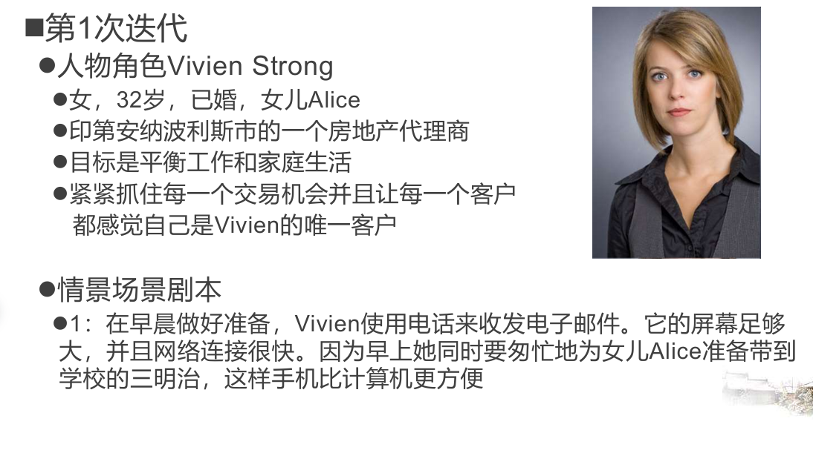
>
> 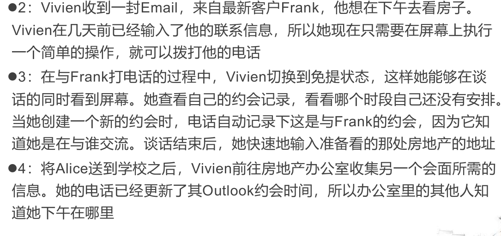
>
> 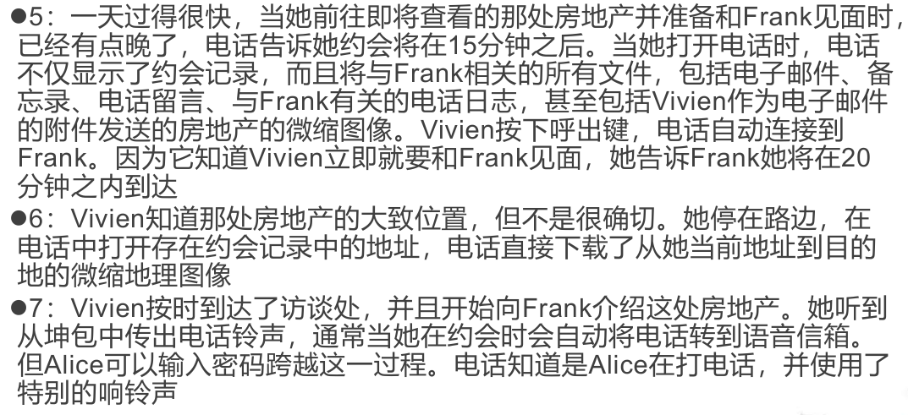
>
> 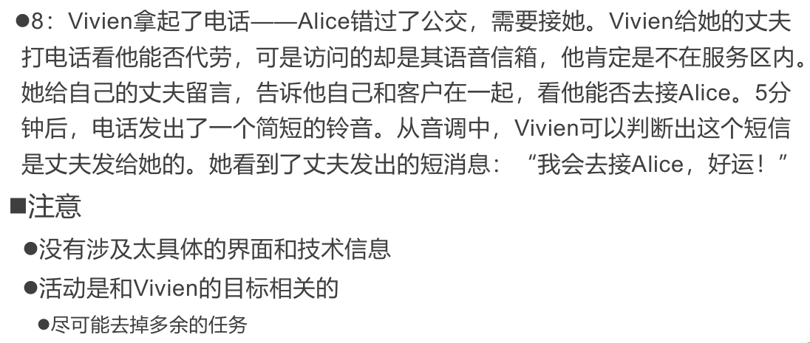

### 4.6.5 确定需求

同上例：直接从约会记录（情境）中拨打电话（动作）给某个人（对象）

**数据需求**

- 必须在系统中被描绘的对象和信息，可以被看作是与对象相关的宾语或形容词，如账号、人、文档、邮件、歌曲、图片以及它们的属性比如状态、日期等

**功能需求** 

- 系统对象必须进行的操作，最终会转化为界面控件

**其他需求**

- 开发进度、大小等

**原型**

## 4.7 原型

制作原型之前要首先关注用户的心智模型

概念模型是对**系统如何组织和操作**的高级描述

理想情况下，**用户的心智模型**应该与**设计师的概念模型**相同

### 4.7.1 基于对象的概念模型

通常是基于物理世界的类比，如书籍、工具、车辆，现实世界里长啥样，系统就模仿啥样

**隐喻**的优势：

- 使学习新系统更容易
- 帮助用户理解底层的概念模型
- 能够非常创新，并使计算机领域及其应用程序更容易被更多不同的用户访问

### 4.7.2 需求验证

什么是**原型**？

- 在某一方面和真正产品比较接近、以便人们能对这一方面的各种技术方案进行不断评估和改进的一种**接近于实际产品的模型**

借助于原型，当事人就能与未来的产品交互，从中获得一些实际的使用体验，并发掘新思路

**原型的重要性**

- **评估和反馈**是交互设计的核心
- 用户往往不能准确描述自己的需要，但在看到或尝试某些事物后，就能立即知道自己不需要什么
- 与文档相比，涉众能够更容易地看到、持有和与原型进行交互
- 团队成员能够有效沟通
- 原型回答问题，并支持设计师在备选方案中进行选择

### 4.7.3 低保真原型

与最终产品**不太相似**的原型，使用与最终产品不同的材料，如纸张、纸板，优点是简单、快速、便宜、易于制作和修改

**草图**：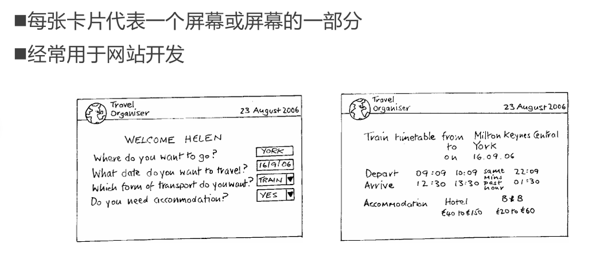

**故事板**：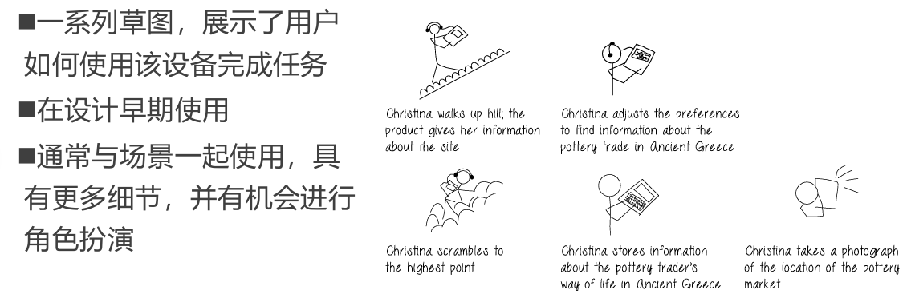

**绿野仙踪法**：用户认为他们是在与计算系统交互，实际上是开发人员在同他们进行 响应，而不是系统

### 4.7.4 高保真原型

与最终产品更为接近，使用相同的材料

制作时间长，难以修改

风险：用户会认为原型就是系统，开发人员可能认为已找到了一个用户满意的设计

## 4.7.5 任务分析

记录人们如何完成任务的一种方式

- 可以用来了解通过观察和访谈目前参与工作流程的人收集到的数据
- 主要用于**调查现有情形**，而不是展望新系统或设备
- 分析基本原理，了解人们想要达到什么目标，如何达到这些目标，并由此建立需求

**层次化任务分析（HTA）**是应用最广的任务分析技术

- 把任务分解为若干子任务，再把子任务进一步分解为更细致的子任务。之后，把他们组织成一个“执行次序”，说明在实际情形下如何执行各项任务

> 举例：图书馆目录服务
>
> “借书”的子任务 
>
> - 访问图书馆目录 
> - 根据姓名、书名、主题等检索 
> - 记录图书位置 
> - 找到书架并取书（假定书在书架上） 
> - 到柜台办理借阅手续
>
> 执行次序：
>
> 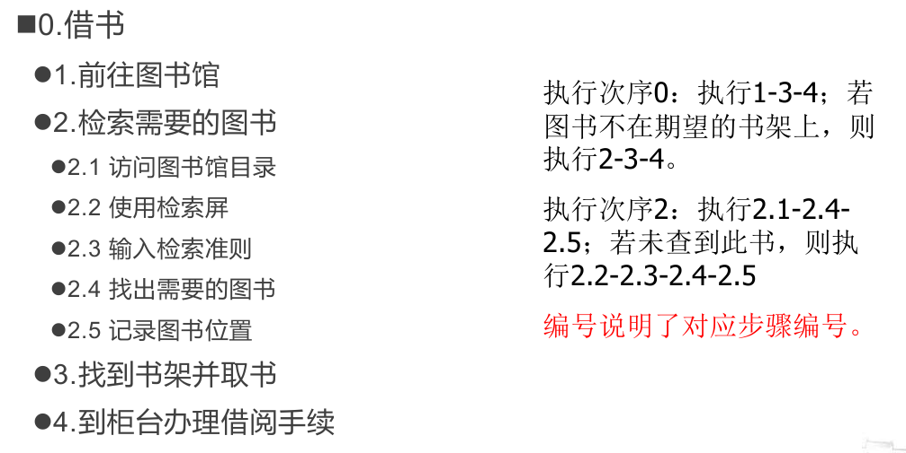
>
> 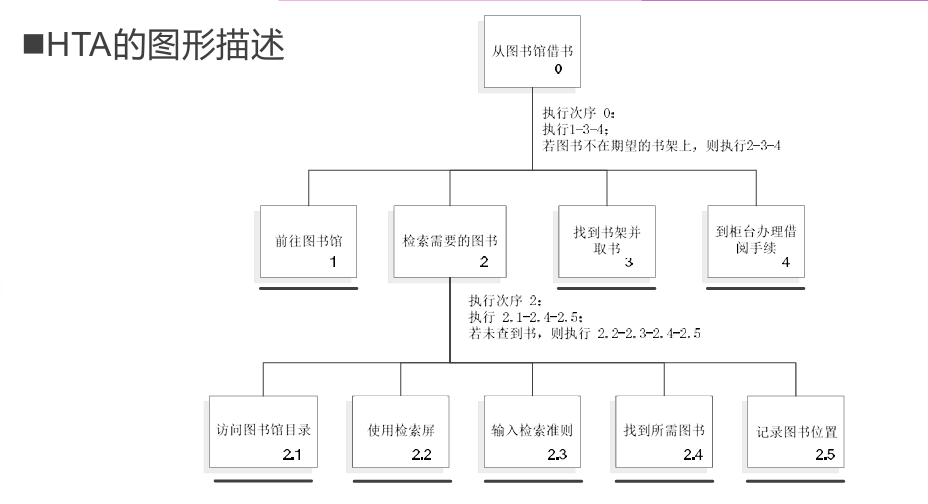

任务分析是一个**迭代过程** 

**终止点** 

- 任务包含了复杂机械响应的地方，如鼠标移动，此时分解没有价值 
- 涉及内部决断的地方：若决断和查找文档等外部动作相关，则分解；若为纯粹认知性，则终止

# 5. 交互式系统的设计

## 5.1 设计框架

过早地把重点放在小细节、小部件和精细的交互上会妨碍产品的设计，应该**先站在一个高层次上关注用户界面和相关行为的整体结构**

### 5.1.1 定义外形因素和输入方法

**外形因素**

- 设计什么样的产品？高分辨率屏幕上显示的Web应用？轻便、低分辨率、在黑暗和阳光下都能看得见的手机产品？
- 产品的特点和约束对设计提出了什么样的要求(人物角色和**场景**剧本)

**产品输入方法**

- 产品与用户互动的形式，取决于产品的外形和人物角色的能力和喜好，哪种方式或者组合更适合设定的人物角色

### 5.1.2 定义功能和数据元素

**数据元素**

- 交互产品中的基本主体，如相片、电子邮件、订单

**功能元素**

- 对数据元素操作的工具以及输入或者放置数据元素的位置

### 5.1.3 决定功能组合层次

**元素分组**

- 更好地在任务中和任务间来帮助促进任务角色的操作流程

需考虑的内容

- 哪些元素需要大片的视频区域

- 容器如何组织才能优化工作流

- 哪些元素是被一起使用的等

- 产品平台、屏幕大小、外形尺寸和输入方法的影响

  > 容纳对象的容器之间有比较关系或者要放在一起使用，则其应该是相邻的
  >
  > 表达一个过程中多个步骤的对象通常也要放在一起，并且遵循一定的次序

### 5.1.4 勾画大致的设计框架

最初阶段，界面的视觉化工作应该非常简单

**方块图阶段**：用粗略的方块图来表达并区分每个视图，方块图对应窗格、控制部件（如工具栏），为每个方块图添加上标签和注解

> 不要被界面上某个特殊区域的细枝末节分散了精力

### 5.1.5 构建关键情景场景剧本

描述了**人物角色如何同产品交互**

这些场景剧本描述了人物角色**最频繁**使用界面的主要路径

- 重点在**任务层**
- 举例：电子邮件应用中关键线路的活动主要包括读和写邮件，而不是配置邮件服务器

必须在细节上严谨地描述每个主要交互的精确行为，并提供每个主要线路的走查

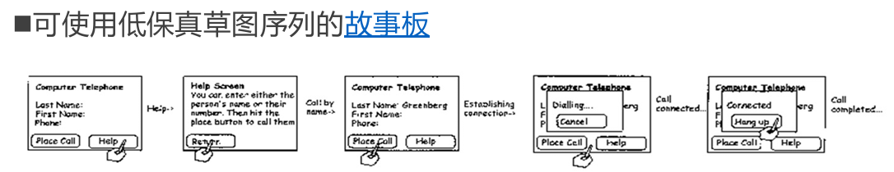

### 5.1.6 通过验证性的场景剧本来检查设计

验证性的场景剧本不用具备很多细节，但包含一系列“如果怎样，将怎样”的问题

**关键线路的变种场景剧本**，关键途径的替代

>  如果Vivien决定不给Frank打电话，而是发电子邮件

**必须使用的场景剧本**：必须要被执行但又不是经常发生的情况

> 智能电话中如果该手机被二手买卖，则需要删除原用户所有个人信息的功能

**边缘情形使用场景剧本**，非典型产品具备，但不太常用的功能

> 如Vivien想添加两个同名联系人

## 5.2 情绪板

设计是一个主观的行为，商业设计需要找到商业和美学的平衡点，需要客观的理论去支撑我们的视觉设计

情绪板是由能代表用户情绪的文本、元素、图片拼接而成的客观表达设计理念的方法

可以帮助定义视觉设计相关的5大内容

- 色彩、图形、质感、构图、字体

是设计领域中应用范围比较广泛的一种方法

### 5.2.1 制作情绪版

**关键词**：寻找主题相关的关键词

- 来自公司的战略定位、产品的功能特色、用户的需求特征，通过公司内部讨论和用户访谈明确原生关键词
- 感觉相关的，场景相关的、名词相关的……

**关键词联想**：对精选之后的关键词进行发散和联想，这样就可以获取更多的灵感

- 主要通过部门内部头脑风暴或用户访谈得出

**搜索关键词图片**

- 利用网络渠道来收集与关键词相匹配的图片素材

**创建情绪板**

- 选择5大内容相关的图片：**色彩、图形、质感、构图、字体**

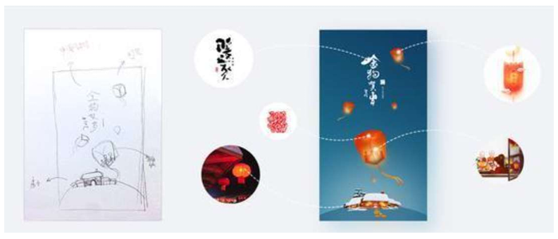

**视觉设计**

## 5.3 设计中的折衷

### 5.3.1 个性化和配置

是否应该让产品具有用户定制功能？

**个性化** 

- 人们喜欢改变周围的事物，使之适合自己 
- 必须简单易用 
- 在用户确定选择之前给他们一个预览的机会 
- 必须容易撤销 

**配置** 

- 移动、添加或者删除持久对象 
- 富有经验的用户所期望的 
- 包含多种配置形式

### 5.3.2 本地化和国际化

**国际化** 

- 指在设计软件时，将软件与特定语言及地区脱钩的过程 
- 当移植到不同的语言及地区时，软件本身不用做内部工程上的改变或修正 
- 意味着产品有适用于任何地方的“潜力” 
- 只需做一次 

**本地化** 

- 当移植软件时，加上与特定区域设置有关的信息和翻译文件的过程 
- 为了更适合于“特定”地方的使用，而另外增添的特色 
- 针对不同的区域各做一次

### 5.3.3 审美学与实用性

一个漂亮的界面不一定就是一个好的界面！

审美与实用的**冲突**：

- 为确保文本的可读性，文本的背景采用较低的对比度
- 复杂而强烈的对比可能获奖，但不实用

交互设计角度

- 根据语义和任务因素来进行视觉组织是最重要的
- 视觉美学的重要性稍低
- 换句话说，先实现一个良好的基本布局，然后再在这个基础上进行改进来实现好的美学效果

组件之间的空白非常重要

组件的对齐会影响界面的可理解性和易用性

## 5.4 软件设计中的考虑

**积极的文字表达**

**消除歧义**

**让软件友好和体贴**

**有趣的用语**

**“聪明”的软件/“不聪明”的软件**

**邀功的对话框**

**加快系统的响应时间**

- 如何利用程序的空闲时间：对用户的可能操作作出几个假设 
- Mac OS X的Spotlight的搜索比Windows搜索效率高；Mac OS X利用很多空闲时间来索引硬盘

**减轻用户的记忆负担**

- 为了能够使用软件来完成某些任务，必须记住两类信息或知识 
  - 和软件如何操作相关：应当选择哪个命令或操作、文件存在哪个目录中等 
  - 和该任务所需的领域知识相关：哪些系统函数可以使用，这些函数的参数及返回值是什么

- 好的软件通过回忆用户上次的行为预测用户可能的操作
  - 程序可以使用用户以前的设置作为默认值：如文档存放目录、窗口位置等

**减少用户的等待感**

- 以某种形式的反馈让用户了解操作进行的进度和状态：如进度对话框
- 以<u>渐进</u>方式向用户呈现处理结果：分成多个连续的部分来顺序地把结果提供给用户
- 给用户分配任务，分散用户的注意力
- 减低用户的期望值

**设计好的出错信息**

- 四个简单原则
  1. 使用清晰的语言来表达，而不要使用难懂的代码 
  2. 使用的语言应当精炼准确，而不是空泛而模糊的 
  3. 对用户解决问题提供建设性的帮助 
  4. 出错信息应当友好，不要威胁或责备用户

## 5.5 交互设计模式

### 5.5.1 主导航模式

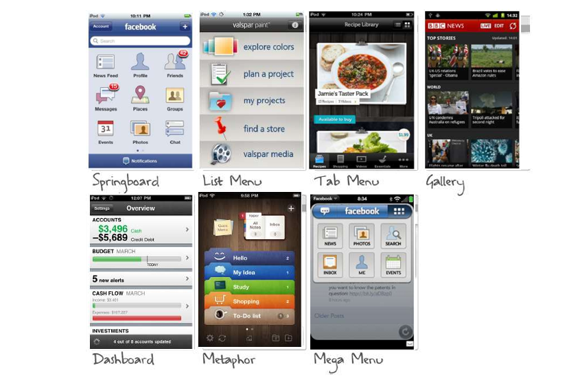

### 5.5.2 轮播模式

优点：充分使用屏幕空间；当前信息清晰可见 

缺点：用户几乎不使用轮播；用户通常只能看见图像中的一张，或仅关注第一幅画面

## 5.6 简化设计的策略

传统：功能越多，软件越强大，因此就越能获得用户的青睐和喜爱 

现实：功能越多，越难发现对用户而言真正有价值的功能，同时还可能使遗留代码变得越来越沉重，系统的维护成本越来越高

**简化设计的四种策略**

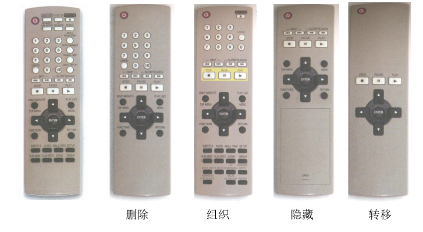

### 5.6.1 策略一：删除

**最明显**的简化设计方法

删除杂乱的特性，可以让设计师专注于把有限的重要问题解决好，有助于用户心无旁骛地完成自己的目标

“把一切难以实现的功能统统抹杀？” 避免得到由简单功能叠加起来的毫无特色的产品，保证只交付那些真正有价值的功能和内容

**如何删除？**

- 关注核心 
  - 与新增功能相比，客户更关注基本功能的改进 
  - 影响到用户日常使用体验的功能 
- 砍掉残缺功能 
  - “沉没成本误区” 
  - “为什么要留着它？”而非“为什么应该去掉它” 
- 假如用户想……？ 
  - 目标用户经常会遇到这个问题吗？ 
  - 不要简单地因为客户要求就增加功能 
  - 要倾听客户的意见，但绝不能盲从

**删除错误**

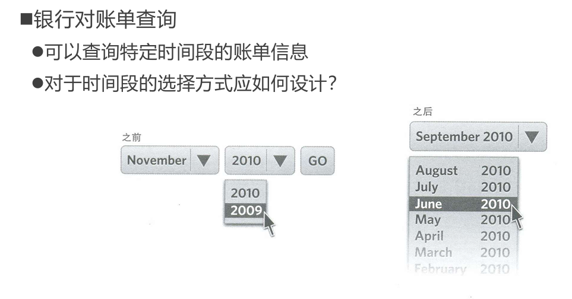

**选择 vs. 键入**

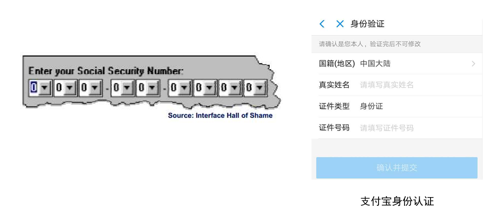

**删除视觉混乱**

减少用户必须处理的信息，集中注意力在真正重要的内容上

> 使用空白或轻微背景来划分页面，不要使用线条；尽可能少使用强调，仅加粗就可以了；别使用粗黑线，匀称、浅色的线更好；控制信息的层次，标题、子标题、正文；减少元素大小的变化；减少元素形状的变化

**删减文字**

删除不必要内容可以让读者对自己看到的内容更有自信

- 删除引见性文字：“欢迎光临我们的网站，我们希望您心情愉快……” 
- 删除不必要的说明：“填写完这些字段后，请按提交按钮把申请提交给我们”
- 删除繁琐的解释：“产品搜索：回答几个简单的问题，即可帮您找到合适的产品” 
- 使用描述性链接：“单击这里”或“更多内容”

**精简句子**

让文字变得更加简洁、清晰、有说服力

**不要删减过多**

人们希望自己能够掌控局面，足够多的控制可以让他们消除因基本需求得不到满足而引发的焦虑，但要避免控制太多导致他们因选择而浪费时间

> 对应于启发式规则：用户享有控制权和自主权

### 5.6.2 策略二：组织

**最快捷**的简化设计方式

- 用户界面设计离不开分块 
- “7±2法则” 
- 名词：可以按字母表、时间或空间顺序排列的清单 
  - Question: 请分别举例 
- 动词：围绕行为进行组织 
  - 人们希望按照某种特定的步骤做事

**确定清晰的分类标准**

> 不清晰的分类标准：
>
> 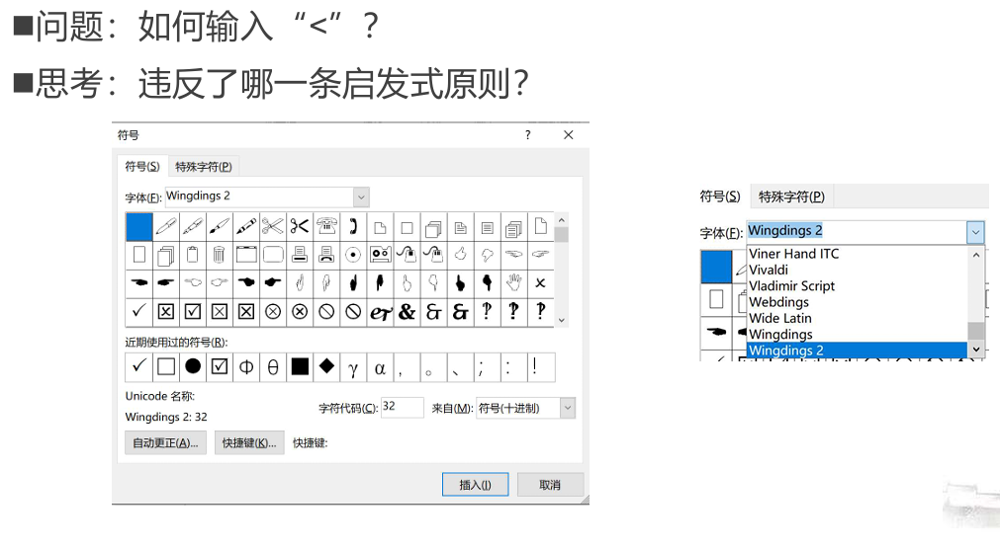
>
> 违反启发式原则：**依赖识别而非记忆**

**利用不可见的网格来对齐界面元素**

**大小和位置**：重要的元素要大一些，不太重要的界面元素应该小一些；把相似元素放在一起

**感知分层**：引导视线，先看到什么再看到什么

**期望路径**：用户可能不会按你期望的路径行动

### 5.6.3 策略三：隐藏

隐藏是一种低成本的简化方案

- 用户不会因不常用的功能分散注意力 
- 可作为删除不必要功能的开始 
- 必须仔细权衡要隐藏哪些功能

隐藏什么？

- 主流用户很少使用，但自身需要更新的功能
- 事关细节（对服务器进行配置或设计邮件签名）
- 选项和偏好（修改绘图应用的单位）
- 特定于地区的信息（如时间和日期需频繁自动更新的信息）

**自定义**：是否应该给用户自己选择的权利？

- 自定义可能是一件非常耗费时间的事，且要求对软件中各种各样的功能了如指掌；主流用户感兴趣的是展示自己的个性：如将桌面换成××的照片，而不是重新设计用户界面
- 一般来说，不应该让用户去自定义他们的软件

**渐进展示**：隐藏精确的控制部件

- 一项功能包含少数核心的供主流用户使用的控制部件，另有一些为专家级用户准备的扩展性的精确的控制部件
- 对于用户期望的功能，要在正确的环境下给出明确的提示

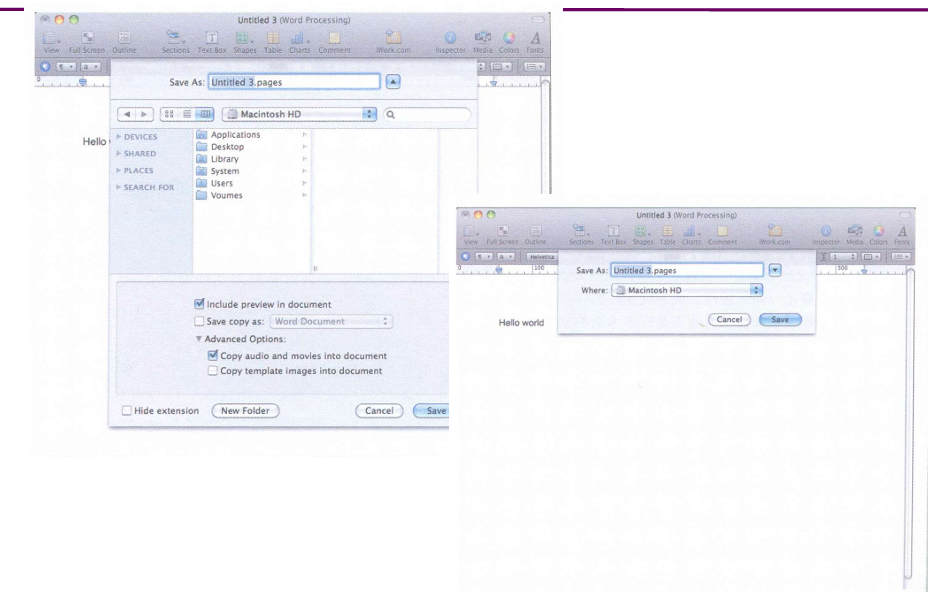

**适时出现**：过分强调隐藏功能（如为每个词加上超链接）会导致混乱；在合适的时机、合适的位置上显示相应功能

**别让用户“找信息”**

**让功能易于发现**：怎样介绍被隐藏在幕后的附件项

- 为隐藏功能打上标签：更多，高级
- <u>把标签放在哪里比把标签做多大重要得多</u>
- 用户在遇到问题的时候，过于关注屏幕上问题区域；就算标签再大，放在用户关注点之外，用户也看不到

### 5.6.4 策略四：转移

举例：遥控器上被精简掉的按钮全部通过电视屏幕上的菜单来管理

**移动平台与桌面平台**

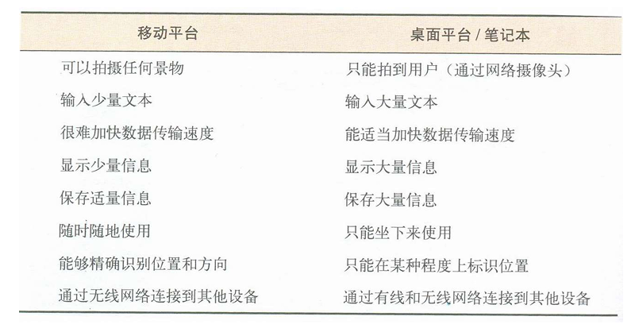

**向用户转移**：一个旅行规划程序，事无巨细地规划行程，会对用户产生太多的限制；<u>把复杂的工作留给用户</u>，可以让用户创建文件夹并自由命名，向文件夹中放任何东西

**用户擅长的事情**：

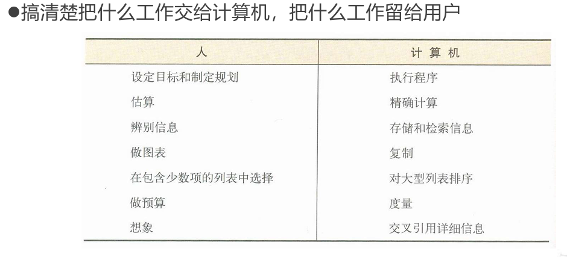

**菜刀与钢琴**：简单界面的最高境界，应该是专家和主流用户都会感觉非常好用

### 5.6.5 简化设计策略的组合

==删除不必要的==

==组织要提供的==

==隐藏非核心的==

==转移 …… ？==

## 5.7 卡片分类

实验中，参与者需要对事物进行分类

- 物体Objects，照片Photos，词语Words

但是设计中我们关注的是问题的领域 

- 概念，术语，关系

**卡片分类**是一种代价较小的关于问题域的用户观点的研究；当待分类项数量较多时，较可用性测试更高效

既可用做定性研究，也可用作定量研究

- 定性：人数少，典型的使用一对一的纸质卡片
- 定量：通常最少15个参与者，以一对多的方式进行，纸质卡片或在线分类

尽管主要被用作导航研究，也可以用于布局研究：如哪些界面元素应该放置在一起

**卡片内容**

- 对**导航**：内容标题，活动/任务名称；通常来讲是任何可能出现在页面或应用菜单上的内容

- 对**表格/页面设计**：数据项或元素

- 对**研究**：问题域的概念、任务或目标

> 卡片分类其实就是回答结构性问题：
>
> 这些内容应该放在一起吗？菜单和栏目该如何分组？分类名称是否符合用户的理解？当前的信息结构是否贴合用户认知，而非设计者假设？

# 6. 评估的基础知识

**评估是设计过程的组成部分**，侧重系统的可用性和用户体验，例如，用户能否找到特定的菜单项？图像是否有用，是否吸引人？产品是否引人入胜？

邀请用户进行评估的目的不是设法理解用户，而是评估特定用户在一个特定的环境背景中如何使用一个系统来执行一个特定的任务。

## 6.1 评估的背景

**Why-为什么要评估？**

用户不仅期望一个可用的系统，还在追求愉悦感与参与感；对企业而言，好的设计有很大卖点；设计师可以专注于真实问题和不同用户群体的需求，而非与人们对喜爱与厌恶之处进行辩论

**What-评估什么？**

对象：原型、可运行系统、特定屏幕功能、完整工作流程、审美设计、安全性等等

> 可以从哪些方面对一款个人音乐播放器（如智能手机上的APP）进行评估？
>
> - 人们如何从成千上万首歌曲中选择特定曲目？人们能够根据自己的喜好设置播放列表？播放器的外观和质感如何？人们是否可以轻松地添加或存储新的音乐？…

**Where-在哪里评估？**

实验室环境/实地环境，取决于正在评估的对象

**When-何时开展评估？**

取决于产品的类型，如果研发新产品，则会投入大量时间做市场调研和建立需求，之后会设计草图/故事图板，可以通过评估检查是否正确理解了用户的需求，这被称作“**形成性评估**”，目的是调整和完善设计；评估已完成产品成功与否被称作“**总结性评估**”，目的是确定产品需要改进的方面

**评估原则**

1. 评估应该**依赖于产品的用户**，与专业技术人员的水平和技术无关

2. 评估**与设计应结合**进行，仅靠用户最后对产品的一两次评估，是不能全面反映出软件可用性的

3. 评估应在用户的**实际工作任务和操作**环境下进行，

4. 要选择有**广泛代表性**的用户

## 6.2 评估范型

### 6.2.1 快速评估

设计人员**非正式**地向用户或顾问了解反馈信息，以证实设计构思是否符合用户需要

可在任何阶段进行，强调“快速了解”，而非仔细记录研究发现，如在设计初期了解用户对新产品的意见、在设计末期了解用户对图标设计的看法等；得到的数据通常是非正式、叙述性的，可以口语、书面笔记、草图、场景的形式反馈到设计过程

是设计网站时常用的方法

### 6.2.2 可用性测试

评测**典型用户执行典型任务**时的情况，包括用户出错次数、完成任务的时间等

基本特征：是在<u>评估人员的密切控制</u>之下实行的

主要任务：**量化**表示用户的执行情况

缺点：1. 测试用户的数量通常较少 2. 不适合进行细致的统计分析

### 6.2.3 实地研究

基本特征：在**自然工作环境**中进行

目的：理解用户的实际工作情形以及技术对他们的影响

作用：探索新技术的应用契机，确定产品的需求，促进技术的引入，评估技术的应用

重难点：如何不对受试者造成影响；控制权在用户，很难预测即将发生和出现的情况

### 6.2.4 预测性评估

研究人员通过**想象**或对界面的使用过程进行**建模**

- 专家们**根据自己对典型用户的了解**预测可用性问题的可用性评估
- 用于比较相同应用不同界面的原型法，如使用Fitts定律预测使用设备定位目标的时间

基本特征：用户可以不在场；整个过程快速、成本较低

## 6.3 人机交互的实证研究方法

### 6.3.1 研究假设

**零假设**Null Hypothesis和**备择假设**Alternative Hypothesis

零假设通常指**不同的实验条件不会产生差异**；而备择假设往往是一个**与零假设相反**的陈述

==实验的目标是找到统计学证据来反驳或否定零假设，以支持备择假设==

> 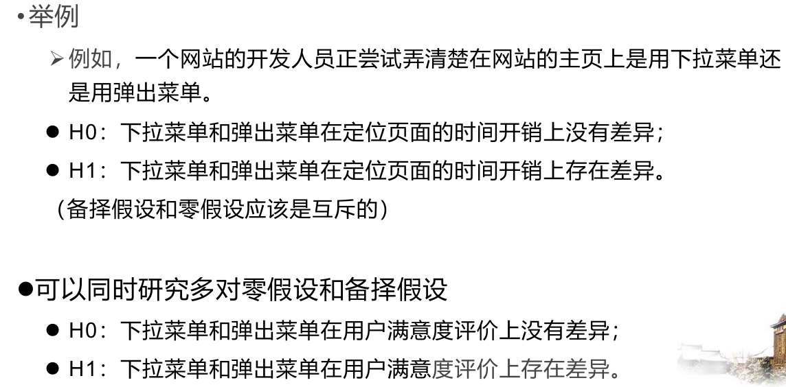

一个成功的实验，从一个或多个好的假设开始是至关重要的：用精确而清晰的语言提出；专注于一个可以在单次实验中检验的问题；明确说明实验的对照组或实验条件。

### 6.3.2 因变量和自变量

一个定义明确的假设会明确说明研究的因变量和自变量。

**自变量**Independent Variables是指研究者感兴趣的因素或因变量变化的可能 “**原因**”，参与者无法对自变量施加任何影响，一个自变量至少需要2个不同的取值

**因变量**Dependent Variables是指研究者感兴趣的结果或效果，其中术语“因”用于说明该变量**依赖于受试者的行为或自变量的变化**

### 6.3.3 实验构成

**实验条件**：指的是我们需要比较的不同技术、设备或程序；即变量取值

**实验单位**：指的是我们应用实验条件的对象，在人机交互研究领域，实验单位通常是具有特定特征的人类受试者，特定特征例如性别、年龄、计算机使用经验等；

**分配方式**：指的是将实验单位分配到不同实验条件的方式。

> 

实验性研究的强大在于它能够探索因果关系，能够实现这一目标的主要原因即在于它的完全**随机化**，传统的随机化方法包括：掷硬币、掷骰子、轮盘赌、从盒子里取球等，目前已较少采用；另一种方法是使用随机数字表

### 6.3.4 实验设计

真正的实验具有如下特点

- 以至少一个可检验的研究假设为基础，并旨在验证它 
- 通常至少有两种条件(实验条件和对照条件)或组(实验组和对照组) 
- 因变量通常使用定量测量 
- 通过各种统计显著性检验对结果进行分析 
- 以消除潜在偏差为目标来设计和进行 
- 具备不同的参与者样本，在不同的时间，不同的地点，由不同的参与者进行复现

### 6.3.5 组间设计和组内设计

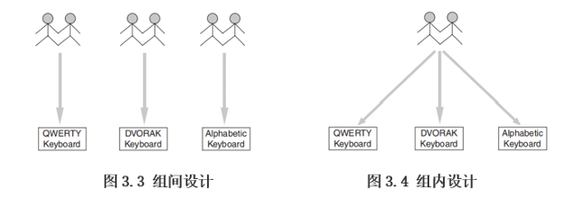

**组间设计**：每个参与者只暴露在一种实验条件下；参与组的数量直接对应于实验条件的数量

- 设计更简洁，避免了<u>学习效应</u>，但结果受个体差异影响大，而且需求样本量大
- 适合任务简单，个体差异有限、受学习效果影响较大的任务

**组内设计**：同一组参与者暴露在不同实验条件下

- 样本量小，隔离了个体差异，但会受学习效果的影响，且存在**疲劳问题**
- 适合个体差异较大、学习效果不太容易受到影响的任务、或目标参与者群体很小的任务（大多数测试复杂或学习技能或知识的任务——比如打字、阅读、写作和解决问题）

组间设计和组内设计的优缺点完全相反

> 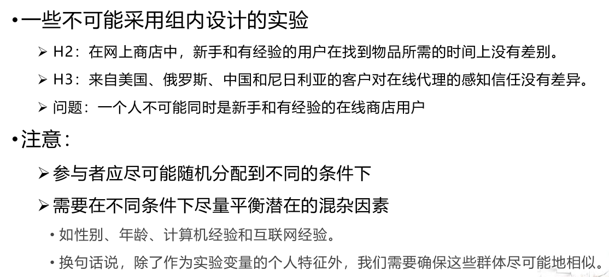

**很难找到和招募合格的参与者是许多HCI研究人员经常面临的问题**

如何**控制学习效果**？

- 将实验条件的顺序随机化/提供充足的培训

如何**解决疲劳问题**？

- 单个实验的适当长度应该是60 - 90分钟或更短，并提供必要的休息机会

**拉丁方设计**：

- 通过一个 $n×n$​ 的方阵，使每个处理条件在每一行和每一列中各出现一次，从而平衡两个干扰因素的影响。

  > 假设你要比较 3 种界面方案：A、B、C，同时你想控制两个干扰变量：
  >
  > - 行：被试分组（或时间段）
  > - 列：任务顺序
  >
  > 构造一个 3×3 的拉丁方：
  >
  > |      | 顺序 1 | 顺序 2 | 顺序 3 |
  > | ---- | ------ | ------ | ------ |
  > | 组 1 | A      | B      | C      |
  > | 组 2 | B      | C      | A      |
  > | 组 3 | C      | A      | B      |

### 6.3.6 多个自变量的实验

**析因设计**Factorial Design可以同时调查所有自变量的影响以及多个变量之间的交互影响；析因设计中条件的数量由自变量的总数和每个自变量的取值决定

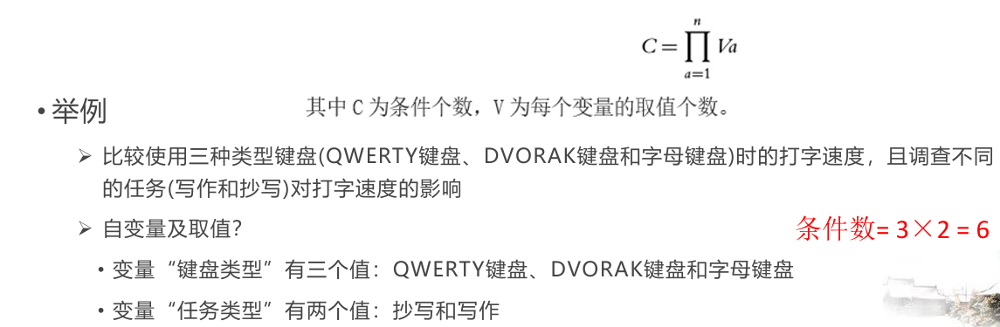

> 其实就是把实验条件进行组合，对于组合后的实验条件进行实验

**组内设计or组间设计？**均可，重要的是平衡实验中的顺序和条件

# 7. 评估之观察用户

观察用户怎样工作是极其重要的可用性方法，观察法是所有可用性方法中最简单的方法

> 用户并不总能客观和完整地描述产品的使用情况，用户有可能忽略一些细节

观察适用于产品开发的任何阶段

- 初期：理解用户的需要 
- 开发过程：检查原型 
- 后期：对最终产品进行评价

## 7.1 观察方式

观察可以发现一些意想不到的用户操作方式

**真实环境**中的观察：观察者既可作为旁观者，也可作为参与者，重点是**应用的上下文** 

**受控环境**中的观察：观察者不能作为参与者，重点是研究用户**执行任务的细节** 

二者差别不大，有时前者模仿后者的测试条件，实地观察也可作为实验室观察的补充

**实验室观察**：测试区+观察区

- 提供了**可控且一致**的评估环境，但是人为环境、不自然，可能降低测试结论的普遍性和一般性

> 实验室观察的实际问题：
>
> 测试地点选择，测试设备安装，测试设备检查
>
> 文档准备：协议书+脚本

## 7.2 观察框架

### 7.2.1 Goetz and Lecomfte框架

关注事件的上下文、涉及的人员和技术

1. **人员**：有哪些人员在场？他们有何特征？承担什么角色？
2. **行为**：人们说了什么？做了什么？举止如何？是否存在规律性的行为？语 调和肢体语言如何？
3. **时间**：行为何时发生？是否与其他行为相关联？
4. **地点**：行为发生于何处？是否受物理条件的影响？
5. **原因**：行为为何发生？事件或交互的促成因素是什么？不同的人是否有不同的看法？
6. **方式**：行为是如何组织的？受哪些规则或标准的影响？

### 7.2.2 Robson框架

有助于组织观察和数据搜集活动

1. **空间**：物理空间及其布局如何？
2. **行为者**：涉及哪些人员？人员详情？
3. **活动**：行为者的活动及其原因？
4. **物体**：存在哪些实际物体（如家具）？
5. **举止**：具体成员的举止如何？
6. **事件**：所观察的是不是特定事件的一部分？
7. **目标**：行为者希望达到什么目标？
8. **感觉**：用户组及个别成员的情绪如何？

### 7.2.3 生理反应监控

决定用户对一个界面的感情反应，提供了客观地获得用户感情状态信息的一种方法 

**心脏活动** ：是压力或愤怒的反应 

**汗腺活动** ：表示激励和精神努力的程度 

**大脑活动** ：与决策的制定、关注和动机有关 

难点：不清楚这些事件与测量之间的关系，如心率的增加是否意味着在应用界面时遭受到挫折或压力而不能完成任务？

## 7.3 观察中的问题

**不知道用户在想什么**

解决方法：让用户“**边做边说**”，很简单，但可能不自然

**合作评估**：两位用户共同合作，以便他们互相讨论、相互帮助

- 鼓励用户对系统提出批评
- 在出现不清楚的情况时，评估者能够澄清容易混淆的地方
- 能提示许多信息，尤其适合评估面向儿童的系统，也适用于多人共享系统的评估

## 7.4 实验室观察

实验室观察的优点 ：能够使得研究人员更好地分离多个可能的影响因素，从而能够得出更准确的研究结果

观察者对被观察者的影响取决于**观察类型和观察技巧**

- 只对用户的某些行为感兴趣，就作为旁观者
- 如想了解计算机及其他设备如何影响学生们的交流，则选择作为参与者进行观察

## 7.5 现场观察

### 7.5.1 举例：超市收银

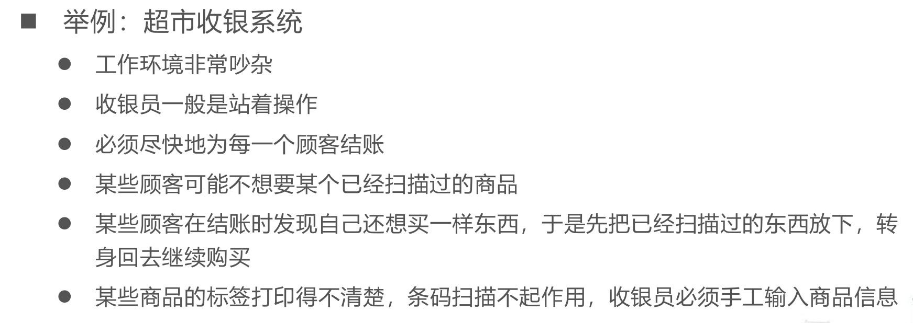

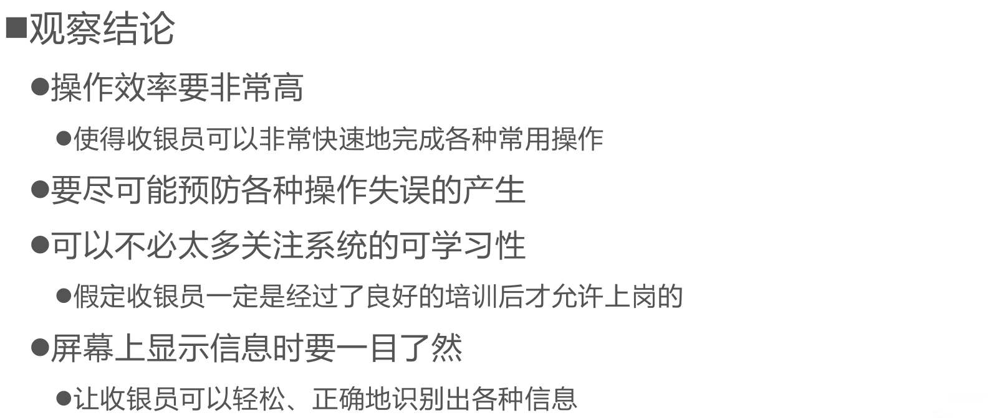

### 7.5.2 现场观察的问题清单

明确初步的**研究目标和问题**

选择一个**框架**指导观察

决定**数据记录**方式：笔记、录音、摄像，还是三者结合

- 数据记录时，<u>应区分个人意见和观察数据</u>

培养良好的合作关系，取得被观察对象的信任，不要只观察一部分人

处理敏感问题，避免冒犯

注重团队协作

应从不同的角度进行观察，避免只专注于某些特定行为

评估后，尽快与观察者或被观察者共同检查所记录的笔记和其他数据（人的记忆是有限的）

> 几个难题：
>
> 要观察多久？如何根据紧凑的开发期限和开发人员的技能相应修改现场研究技术？如何降低噪音、测试中断及其他易使注意力分散的外界干扰？
>
> *可以设计更健壮的评估，也可以直接把干扰当成评估的一部分*

### 7.5.3 注意事项

观察人员自始至终应尽量保持安静，好像没有人一样

当用户的操作令观察人员无法理解时，要打断让他解释或者记录下来

观察初期，应该拒绝用户的任何帮助请求，观察用户在没有专家指点的情况下如何操作

### 7.5.4 观察与访谈相结合

观察方法只能展示用户做了什么，而无法知道用户为什么这样做

应该在记录数据之后再结合其他方法，如访谈 

- 请用户详细讲述记录里面任何可能引发可用性问题的地方 
- 如对一个没用过系统某个功能的用户，询问为什么没有使用某项功能 

让用户面对记录数据时应非常小心，避免让用户产生被监视的想法

## 7.6 数据记录

### 7.6.1 纸笔记录

最原始、最廉价，前提是对观察对象有一定的了解，从而有明确的观察侧重点

优点：事后对观察结果进行分析的**工作量小**

缺点：观察者容易疲劳，而且记录速度有限

### 7.6.2 音视频记录

对于观察对象不太了解，或者是需要观察的内容较多，尤其是**边做边说**时

**所含的信息量很大，所以数据分析非常耗时**

音频记录：信息全面，没有任何遗漏，便于事后详细分析；但没有可见记录，转录数据非常烦琐；常用于提示重要细节或作为情景说明的辅助材料

视频记录：能够看到参与者正在做的事情，但要始终让参与者停留在视觉的范围内很困难

### 7.6.3 日志和交互记录

适用于不能直接观察的场合，因为直接观察可能影响用户，或者评估人员无法在现场进行研究

优点 ：体现了用户是如何完成真实任务的 ， 使得从工作在不同环境下的大量用户那里**自动收集数据**变得相当容易

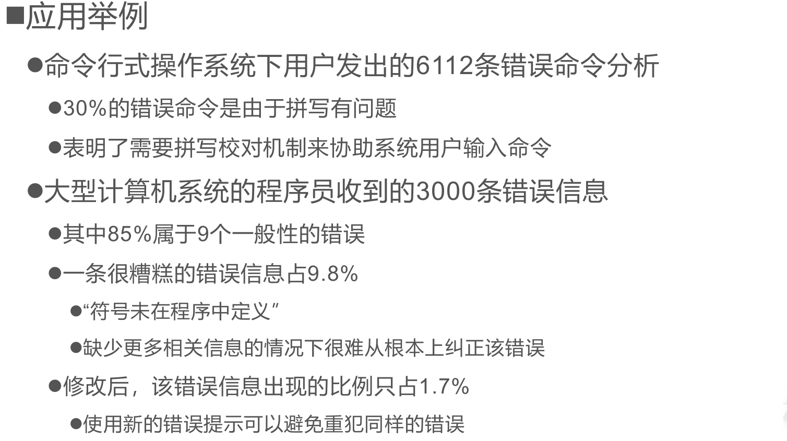

## 7.7  定性/定量分析

详细分析通常不必要

常用的方法

- 找出关键事件，如用户遇到困难的地方

**内容分析**（content analysis）：把数据内容划分为一些有意义、而且互斥的类别

- 改进：层次化内容分类技术

  > 用户说了什么、做了什么，这些内容可以被归为哪一类问题。
  >
  > 如果问题多而复杂，可以做成层次化的（树、表格）

**会话分析**（conversation analysis）

- 弄明白发话者想要表达什么，而受话者又是怎么样理解它的意思并做出反应

**话语分析**（discourse analysis）

- 把语言视为反映心理和社会因素的媒介
- 措辞上的微小改动即可改变话语的意思

**定量分析**：通过一些统计方法去分析

# 8. 评估之用户测试

## 8.1 DECIDE评估框架

### 8.1.1 确定目标

评估目标决定了评估过程，影响评估范型的选择

为什么要评估？ 

- 产品设计是否理解了用户需要？ 
- 为概念设计选择最佳隐喻？ 
- 界面是否满足一致性需要？ 
- 探讨新产品应做的改进？

### 8.1.2 发掘问题

根据目标确定问题

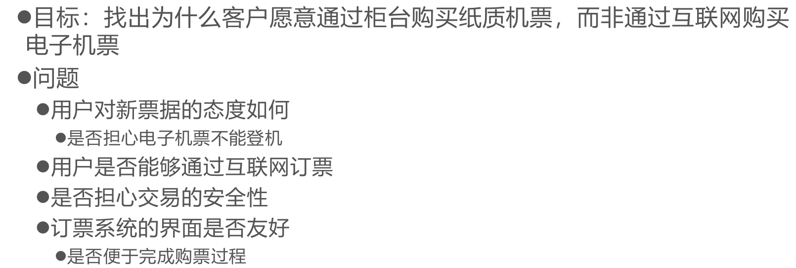

问题可**逐层分解**

### 8.1.3 选择评估范型和技术

**范型决定了技术类型**

必须权衡实际问题和道德问题，可结合使用多种技术

### 8.1.4 明确实际问题

**用户**：

- 应选择恰当的用户参与评估
- 任务时间多长（休息时间）
- 可在任务执行前，安排用户熟悉系统

**设施及设备**：

- 如需多少台摄像机录像，具体摆放在何位置

期限及预算是否允许

是否需要专门技能

### 8.1.5 处理道德问题

应保护个人隐私

- 协议书（IRB）

指导原则：

- 说明研究的目的及要求参与者做的工作 
- 说明保密事项，对用户&对项目 
- 测试对象是软件，而非个人
- 对测试过程的特殊要求，是否边做边说等
- 用户可自由表达对产品的意见
- 说明是否对过程进行录像（不能拍摄面部）
- 欢迎用户提问
- 用户有随时终止测试的权利
- 对用户话语的使用应征得同意，并选择匿名方式

### 8.1.6 评估、解释并表示数据

搜集什么类型的数据，如何分析，如何表示

可靠性

- 能否复现？

有效性

- 是否真的能得到想要的数据

偏见

- 不能选择性地搜集自己想要的数据

范围

- 普遍性

环境影响

- 霍桑效应（当被观察者知道自己被关注、被观察或者被注意到而改变行为倾向的反应）

## 8.2 可用性问题分级

### 8.2.1 方法一：基于量化数据的分级

如多少人遇到该问题，耗费多少时间等

### 8.2.2 方法二：问题严重性的主观打分，取平均值

0. 不是一个可用性问题
1. 一个表面的可用性问题
   - 如果项目时间不允许，可不予纠正
2. 轻微的可用性问题
3. 重要可用性问题
4. 可用性灾难
   - 产品发布之前必须纠正

### 8.2.3 方法三：可用性分级的两个因素

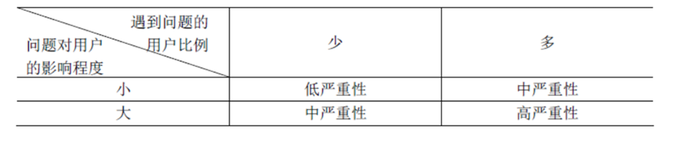

### 8.2.4 方法四：该问题只在第一次使用时出现，还是会永远出现

举例：菜单条中的下拉菜单 

- 用户从不尝试下拉用图标表示的菜单 
- 有人告诉他们后，可马上知道如何克服该不一致性问题 
- 因此该问题不属于永久性的可用性问题

## 8.3 用户测试

### 8.3.1 背景

在**受控环境**中（类似于实验室环境）测量**典型用户执行典型任务**的情况，目的是获得客观的性能数据，从而评价产品或系统的可用性，如易用性、易学性等

最适合对**原型**和**能够运行的系统**进行测试

可对设计提供重要的反馈

在可用性研究中，往往把用户测试和其他技术相结合

### 8.3.2 测试设计

用户测试须考虑实际限制并做出适当的折衷

- 应确保不同参与者的测试条件相同 
- 应确保评估目标特征具有代表性 
- 实验可重复，但通常不能得到完全相同的结果 
- 以**DECIDE框架**为基础

#### 1. 定义目标和问题

- 目标描述了开展一个测试的原因，定义了测试在整个项目中的价值

  

#### 2. 选择参与者

- 了解用户的特性有助于选择典型用户，要尽可能接近实际用户
- 通常也需要平衡性别比例
- 越多越好，通常20-30比较恰当（视情况而言）

**参与者的安排**

1. **参与者不同**：随机指派某个参与者组执行某个实验情形 
   - 缺点：要求有足够多的参与者；实验结果可能会受到个别参与者的影响 
   - 解决：随机分配or预测试 
   - 优点：**不存在“顺序效应”**，即参与者在执行前一组任务时获得的经验将影响后面的测试任务
2. **参与者相同**：相同的参与者执行所有实验情形 
   - 与前一种方法相比，它只需一半的参与者 
   - 优点：能够**消除个别差异**带来的影响，便于比较参与者执行不同实验情形的差异 
   - 缺点：可能产生“顺序效应” 
   - 解决方法：均衡处理
     - 如果有两项任务A和B，那么，应让一半的参与者先执行A，再执行B，另一半则先执行B，再执行A
3. **参与者配对**
   - 根据用户特性（如技能和性别等），把两位参与者组成一组，再随机地安排他们执行某一种实验情形，适用于参与者无法执行两个实验情形
   - 缺点 ：实验结果可能会受一些未考虑到的重要变量的影响 
   - 如在评估网站的导航性能时，参与者使用互联网的经验将影响实验结果，因此，“使用互联网的经验”即可作为一个配对标准

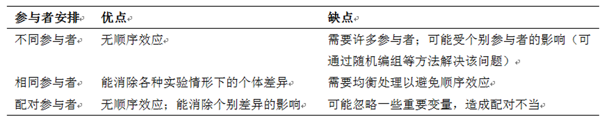

#### 3. 设计测试任务

测试任务应当与定义的目标相关，通常是简单任务，有时是复杂任务

任务不能仅限于所要测试的功能，应使用户全面的使用设计的各个区域

每项任务的时间应介于5~20分钟

应当以某些合乎逻辑的方法安排任务

#### 4. 明确测试步骤

在测试之前，准备好测试进度表和说明，设置好各种设备

正式测试前应进行小规模测试 

在必要时，评估人员应询问参与者遇到了什么问题 

若用户确实无法完成某些任务，应让他们继续下一项任务 

测试过程应控制在1小时之内 

必须分析所有搜集到的数据

#### 5. 数据搜集

确定如何度量观测的结果（定性/定量？）

常用的**定量度量** 

1. 完成任务的时间 
2. 停止使用产品一段时间后，完成任务的时间 
3. 执行每项任务时的出错次数和错误类型 
4. 单位时间内的出错次数 
5. 求助在线帮助或手册的次数 
6. 用户犯某个特定错误的次数 
7. 成功完成任务的用户数

# 9. 评估之询问用户和专家

