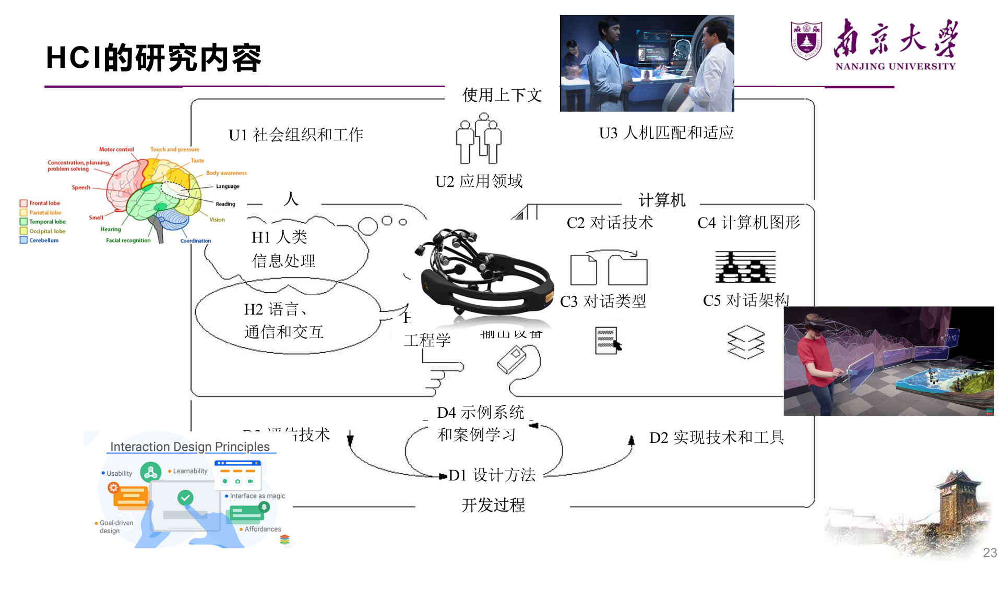
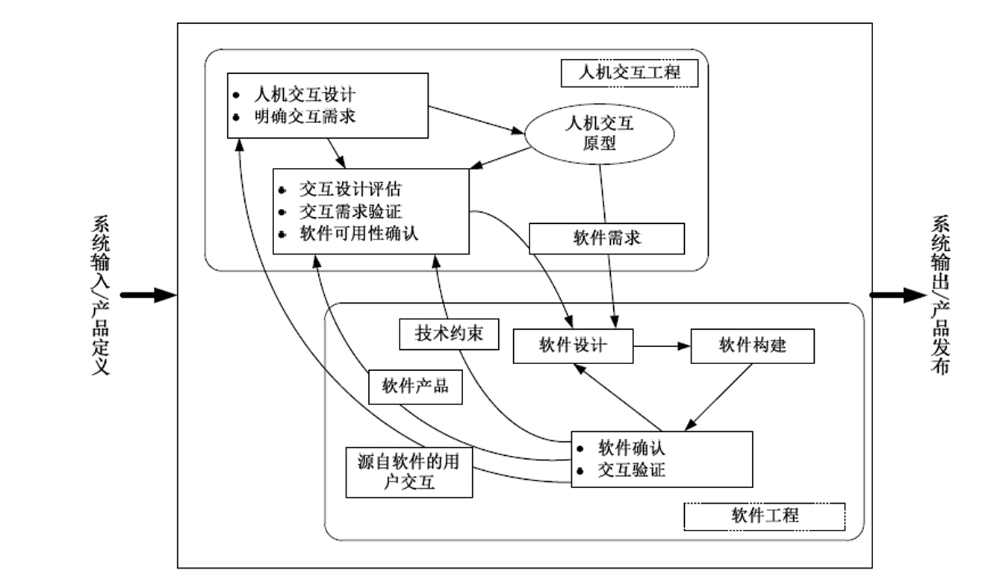
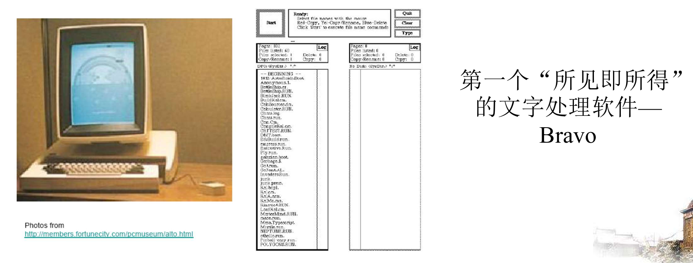
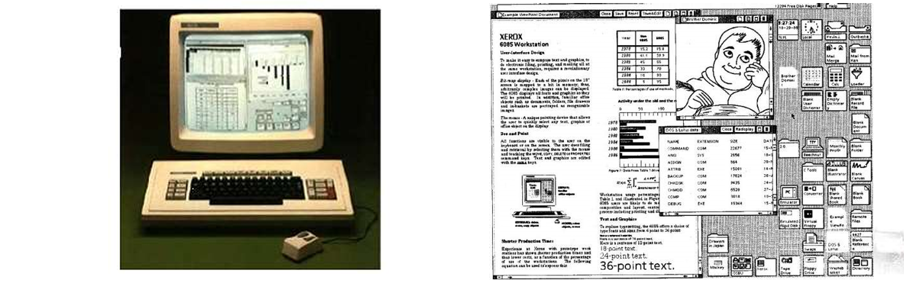
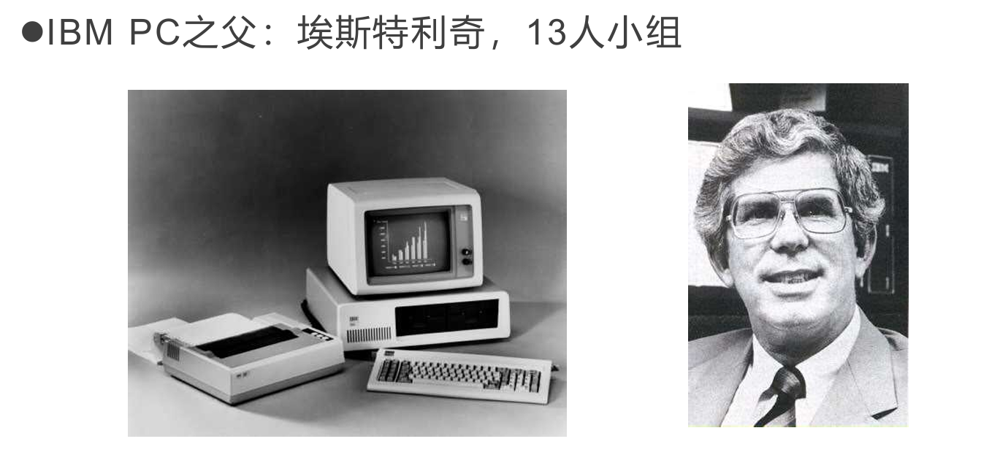
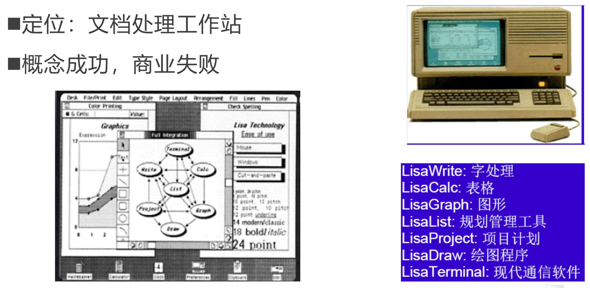
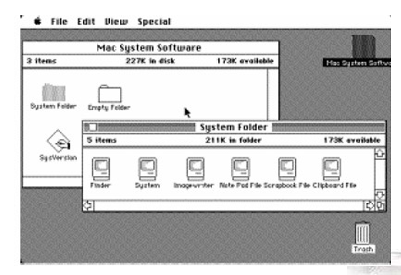
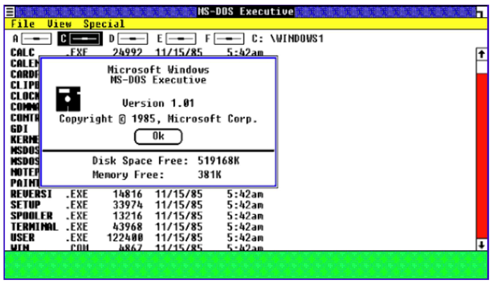
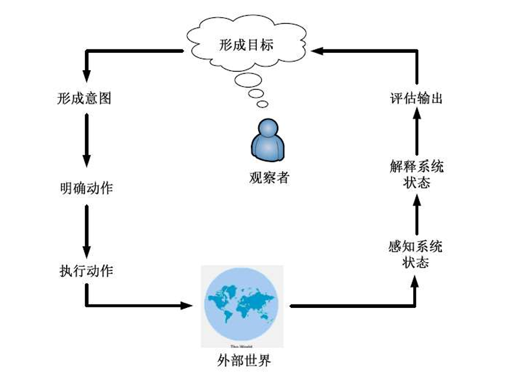
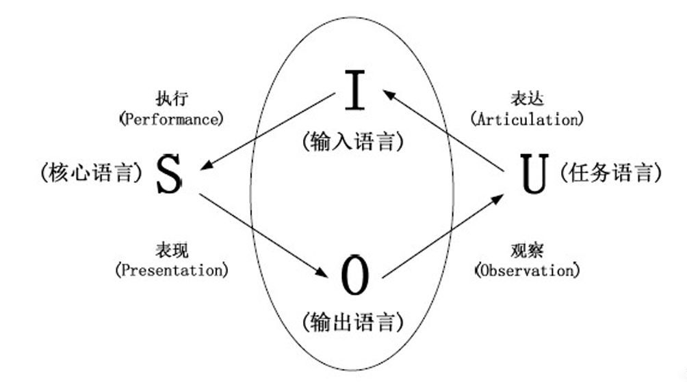

# 1. 人机交互概述

> HCI is a discipline concerned with the design, evaluation and implementation of interactive computing systems for human use and with the study of major phenomena surrounding them.
>
> ——ACM SIGCHI

HCI 是一门涉及人类使用的交互式计算系统的设计、评估和实施以及围绕它们的主要现象的研究的学科

## 1.1 人机交互的研究内容

## 1.2 HCI的重要性

**市场角度** 

- 用户期望简单易用的系统 
- 对设计低劣系统的容忍度越来越差 

**企业角度** 

- 提高员工的生产效率 
- 降低产品的开发成本 
- 降低产品的后续支持成本 

**用户角度** 

- 获得较高的主观满意度 
- 减少时间、金钱、生命损失

## 1.3 HCI与系统工程

# 2. 人机交互历史

新的界面变革包含了上一代界面，旧的交互方式任有存在的必要性

## 2.1 发展阶段

### 2.1.1 批处理阶段

每次只能由一个用户对计算机进行操作

编写程序使用以“0|1”串表示的机器语言

- 不符合人的习惯 
- 耗费时间，又容易出错 
- 只有少数专业人士才能够运用自如

### 2.1.2 联机终端时代

1950s，命令行界面出现

- 一维界面 
- 回车后不能再对命令内容进行修改 

如何为各种命令制定恰当的名称 

- 大部分命令语言对用户输入的要求非常严格 
- 命令名称的缩写在一定程度上减轻了用户的使用负担

### 2.1.3 图形用户界面GUI时期

- 1962年，Ivan Sutherland创建Sketchpad 
- 1964年，Douglas Engelbart发明了鼠标 
- WIMP界面 
  - 用户可在窗口内选取任意交互位置，且不同窗口之间能够叠加 
  - 二维半界面 
- “直接操纵”：GUI的主要特征 
- 问题：图形用户界面优于字符界面？ 
  - 不同的交互方式本身在可用性方面并没有根本性的不同，更重要的是认真对待界面设计的态度。 [Whiteside 1985] 

## 2.2 信息领域的巨搫

### 2.2.1 Ivan Sutherland

SketchPad, 1963 

- 第一个交互式绘图系统 
- 许多思想仍沿用 
- 使用光笔画图 
- 计算机图形学之父 

第一个虚拟头盔 

- 实现了三维立体显示 
- 虚拟现实之父

### 2.2.2 Douglas Engelbart

发明鼠标，1964

超文本技术的研究

第一个标准化的编辑器NLS(oNLine System)

### 2.2.3 Alan C. Kay

1977年Xerox PARC的Alan Kay 

- 提出为服务于个人的直接操作界面 “Dynabook” 
- 这是现代笔记本电脑原型 
- “每个人都想拥有自己的PC，就像每个人都想拥有自己的汽车”

发明面向对象的编程语言“Smalltalk”

### 2.2.4 Mark Weiser

普适计算（Pervasive Computing）是21世纪的计算模式

于1988年在Xerox PARC的计算机科学实验室首次提出了这个概念

- 它把计算机嵌入到各种类型的设备中，建立一个将计算和通信融入人类生活空间的交互环境，从而极大地提高个人的工作以及与他人合作的效率

## 2.3 交互设备历史

### 2.3.1 Xerox Alto (Star的前身)-1973

- 真正意义上的首台个人计算机：有键盘和显示器、图形界面技术、以太网技术

### 2.3.2 Xerox Star - 1981

第一个为商务人员设计的商用图形界面PC 

- 具有了桌面电脑的主要特征 

第一个基于可用性工程的系统 

- 有原型设计和分析 
- 可用性测试，迭代式的改进

### 2.3.3 IBM PC - 1981

1981年8月12日，IBM正式发布了历史上第一台PC，从此人类就进入了个人电脑时代。IBM PC改变了我们的生活和工作方式

### 2.3.4 Apple Lisa - 1982

### 2.3.5 Apple Macintosh（1984）

获得了商业上的成功 

- 价格低- $2500 
- 界面友好 
- 支持第三方应用 
- 高质量图像和激光打印

### 2.3.6 MS Windows (1987)

## 2.4 未来的人机交互

图形用户界面正遭受越来越多的批评 

- One ear, one finger, one eye 
- “计算机能像书本一样方便地使用和携带”?

多媒体界面 

- 引入动画、音视频等动态媒体 
- 二维半 -> 三维或更高 

多通道交互技术 

- 具有并行性，可同时接收来自多个通道的信息 

虚拟现实、语音交互、脑机交互

**第六感系统**

下一代界面的主要风格将是没有命令的用户界面 

- 由更多的媒体类型来构成更高的信息维度  
- 交互也将高度便携和个性化

# 3. 交互设计原则与目标

## 3.1 交互框架

作用：

- 提供理解或定义某种事物的一种结构
- 能够帮助人们结构化设计过程
- 认识设计过程中的主要问题
- 还有助于定义问题所涉及的领域

### 3.1.1 目标Goal vs. 意图Intention

**单个目标可对应多个意图**

- 举例：删除文档中的部分内容的目标 
- 意图1：通过编辑菜单删除 
- 意图2：通过删除按钮删除 
- 每个意图可包含一系列活动

### 3.1.2 EEC（Execution-Evaluation Cycle，执行评估周期）模型

用户操作系统的过程由**“执行意图”**与**“评估反馈”**两个循环、共七个阶段组成。

### 3.1.3 执行隔阂 & 评估隔阂

**执行隔阂**：用户为达目标而制定的动作与系统允许的动作之间的差别

- 界面有没有能完成用户想法的东西

**评估隔阂**：系统状态的实际表现与用户预期之间的差别

- 完成了，但是实际效果符不符合用户预期

### 3.1.4 扩展的EEC框架

EEC模型不能描述**人与系统通过界面进行的通信**

四个构成部分+四个步骤(翻译过程)

- 系统(S)：内核语言 
- 用户(U)：任务语言 
- 输入(I)：输入语言 
- 输出(O)：输出语言

## 3.2 人机交互质量观

### 3.2.1 背景概述

**软件产品的用户群体已发生巨大转变**：热爱技术的专业人员 -> 缺乏耐心的消费者

- “用户友好”：用户希望在完成任务的时候，机器不要碍手碍脚；不同用户的需求各异，不能从系统单方面友好
- “可用”：具体的可用性标准
- “用户体验”：使用户喜欢产品

**观念转变**：传统软件质量观（侧重内部效率、可靠、可维护性） -> 人机交互质量观（用户视角）

### 3.2.2 可用性目标

目的是为交互设计人员提供一个评估交互式产品和用户体验各方面的具体方法

1. **易学性（learnability）：使用系统的难易**
   - 关键问题在于确定用户准备花费多少时间学习一个产品
   - 让用户学会执行某种任务需要花费多长时间
2. **易记性（memorability）：学会使用并记住该产品如何使用的难易程度**
   - 学会某个系统后，应能够迅速回想起它的使用方法，而不必重复学习
   - 影响因素：
     - 意义：有意义的图标、命令名和菜单项
     - 位置：将特定对象放在某个特殊位置
     - 分组：对事物按照逻辑进行恰当的分组
     - 惯例：尽可能使用通用的对象或符号
     - 冗余：使用多个感知通道对信息进行编码
3. **效用性（utility）：可以让用户做他们需要做的或想做的事情**
   - 高效用：提供强大计算工具的会计软件包
   - 低效用：软件绘图工具不允许用户徒手绘制，只能选择绘制多边形
4. **高效率（efficiency）：产品在对用户执行任务的支持程度**
   - 当用户学会使用产品之后，用户应该具有更高的生产力水平（效率）
   - 效率指熟练用户到达学习曲线上平坦阶段时的稳定绩效水平
5. **安全性（safety）：避免用户发生危险和陷入不好的情形**
   - 第一个层面和工效学相关，如在特殊环境中允许远程操控计算机
   - 第二个层面指帮助任何用户在任何情况下避免因偶然执行不必要的行动而造成的危险
     - 包括用户对出错可能导致的后果引起的恐惧，以及恐惧心理如何影响用户行为
   - 减少按键/按钮被误启动的风险；为用户提供各种出错时的恢复方法

### 3.2.3 用户体验目标

通常交互式系统包含一个多样性的用户体验目标，涵盖了一系列**情绪和感受体验**

#### 3.2.3.1 体验和可用性的关系

主观vs.客观

**矛盾性**

- 许多玩家喜欢找最具挑战、非简单的游戏：违反可用性
- 用塑料锤砸屏幕上的地鼠较用鼠标点击更费劲且更易出错，但会带来一个更愉快和有趣的体验

有些可用性和用户体验目标是不兼容的

- 如设计一个既安全又有趣的过程控制系统可能是不可能或不可取的

**认识和理解可用性和其他用户体验目标之间的关系是交互设计的核心**！

#### 3.2.3.2 超越可用性

Schaffer认为，应该更多地关注用户体验而非可用性

> 如：很多网站旨在说服或影响，而不是让用户以一种高效的方式执行任务。如网上商店的核心策略是吸引人们购买他们可能没有想到他们需要的东西，这可能与可用性目标不兼容

**Dark Pattern**：某些“狡猾”的设计会导致一个负面体验

以说服为目的的设计关键主要是采用**巧妙和令人愉快的方式**令人信任和感到舒服

## 3.3 可用性工程

**完整的可用性工程过程** 

- 了解用户 -> 竞争性分析 -> 设定可用性目标 -> 用户参与的设计 -> 迭代设计 -> 产品发布后的工作

### 3.3.1 用户和任务观察

了解产品的目标用户是可用性工程的第一个步骤

- 要**直接**与潜在用户进行接触 
- 不要满足于间接的接触和道听途说 
- “你”不是用户！

### 3.3.2 场景

简便易行的原型工具，通过省略整个系统的若干部分来减少实现的复杂性

- 水平原型：减少功能的深度并获得界面的表层
- 垂直原型：减少功能的数量而对所选功能进行完整实现

### 3.3.3 边做边说法

让真实用户在使用系统执行一组特定任务的时候，讲出他们的所思所想

**最有价值的单个可用性工程方法**

可了解用户为什么这样做，并确定其可能对系统产生的误解

实验人员需要不断地提示用户，或请他们事先观摩

### 3.3.4 启发式评估

由**可用性专家**根据预定义的启发式原则，独立检查界面，识别违反这些原则的可用性问题

研究表明，能够发现许多可用性问题，剩下的可以通过简化的边做边说方法发现

为避免个人的偏见，应当让多个不同的人来进行经验性评估

> 问题：究竟需要多少个测试专家参与？
>
> n个测试专家能够发现的可用性问题数量：$N(1-(1-L)^n ) $
>
> - N：设计中存在的可用性问题的总数
> - L：单个参与者所能够发现的可用性问题的比例（经验取值约为31% ）
>
> 5名专家能够发现约80%的可用性问题，被认为是最恰当的可用性测试用户数量

## 3.4 设计规则

> 这些规则大多来源于提出者的经验和总结，不是完美无缺的，甚至有些会相互矛盾，在具体使用时，必须根据实际情况进行调整和细化

**基本规则**：

