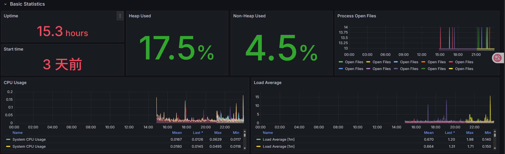
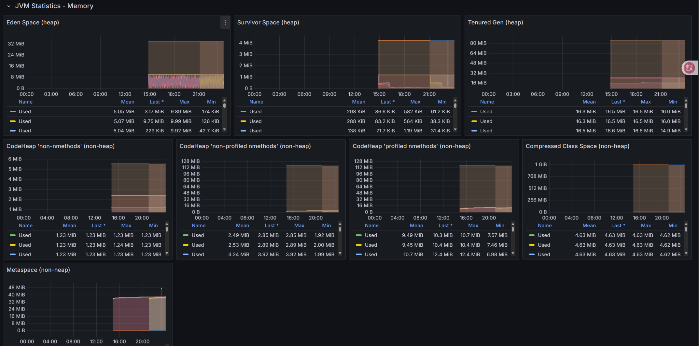
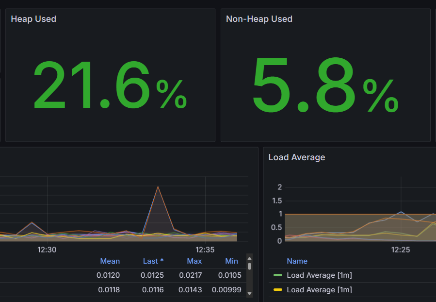

# 项目简介

基于 Spring Boot 开发一个 REST 应用，并结合云原生技术栈（Docker、 Kubernetes、Jenkins、Prometheus、Grafana）完成限流控制、持续集成部署、指标采集与扩容 验证的全流程实践。

## 功能开发

### 实现REST接口

实现一个简单的 REST API 接口（如 `/hello`），返回固定 JSON 数据：

```
{"msg": "hello"} 
```

###  实现限流控制

要求接口支持限流功能：当请求频率超过每秒 100 次时，返回 HTTP 状态码 `429 Too Many  Requests`。  

限流实现方式不限，可选择：  

- 本地限流库（如：Guava RateLimiter、Bucket4j）；  
- 使用 Spring Cloud Gateway 限流插件；  
- 自定义拦截器 + 原子计数器等。

### 暴露访问指标给 Prometheus

应用需暴露接口访问频率（QPS）等指标，供 Prometheus 采集。Actuator + Micrometer 已自动 统计 HTTP 请求，指标为：

```
# 某接口请求次数（已分状态码、方法等标签） 
http_server_requests_seconds_count 
# 某接口响应时间总和（单位为秒） 
http_server_requests_seconds_sum 
```

### 统一限流机制

当服务部署多个副本（Pod）时，实现全局统一限流功能：当服务以多个副本（Pod）部署在  Kubernetes 中时，所有实例共享同一个限流策略，而不是每个实例独立计算。可以使用  Bucket4j + Redis 方案。

##  DevOps 流水线构建与部署

### 编写 Dockerfile 构建镜像

编写项目的 `Dockerfile`，构建出可运行的 Spring Boot 镜像，建议使用多阶段构建。

### 编写 Kubernetes YAML 文件

准备以下资源对象的 YAML 文件：  

- Deployment（包含多个副本）；  
- Service（暴露服务）；  
- ServiceMonitor 配置。  

要求支持 imagePullPolicy、资源限制等规范配置项。 

### 持续集成流水线

编写 Jenkins CI 流水线脚本（`Jenkinsfile`），实现以下功能：

- 拉取代码；  
- 构建项目（例如使用 Maven/Gradle）；  
- 运行至少一个单元测试；  
- 构建并推送 Docker 镜像到镜像仓库。

### 代码提交自动触发流水线

配置 Git 仓库 Webhook，实现持续集成部署流水线的自动触发

## 监控与弹性扩展实践

### 采集 Prometheus 指标

通过配置 ServiceMonitor，实现 Prometheus 对部署在 Kubernetes 中的 Spring Boot 应用的  /actuator/prometheus 指标采集。

### 配置 Grafana 监控面板

在 Grafana 中创建自定义 Dashboard，包括： 

- CPU 使用率；  
- 内存使用率；  
- JVM 指标（堆内存、线程数、GC 次数）；  
- 请求QPS、请求平均响应时间。

### 压测验证监控效果

使用压测工具（或者自己写程序）对接口进行压测； 

在 Grafana 面板中观察指标变化，并撰写简要说明（截图或指标分析）

### 配置自动扩容

通过配置 Kubernetes 的 HPA（Horizontal Pod Autoscaler），基于负载指标（如请求 QPS）实现应用实例的自动扩缩容。同时，结合压测工具和 Grafana 可视化展示扩容效果及系统响应过程。 

# 日志

## 功能开发

### 实现 REST 接口

```TypeScript
@RestController
public class HelloController {
    @GetMapping("/hello")
    public MessageResponse sayHello() {
        return new MessageResponse("Hello");
    }
    // 定义一个内部静态类来封装响应
    static class MessageResponse {
        private String msg;
        public MessageResponse(String msg) {
            this.msg = msg;
        }
        public String getMsg() {
            return msg;
        }
        public void setMsg(String msg) {
            this.msg = msg;
        }
    }
}
```

### 实现限流控制

Bucket4j实现限流控制

```Java
@Override
public void doFilter(ServletRequest request, ServletResponse response, FilterChain filterChain)
        throws IOException, ServletException {
    // 1. 类型转换与基础校验
    if (!(request instanceof HttpServletRequest) || !(response instanceof HttpServletResponse)) {
        throw new ServletException("Non-HTTP request received");
    }
    HttpServletRequest httpRequest = (HttpServletRequest) request;
    HttpServletResponse httpResponse = (HttpServletResponse) response;
    try {
        // 2. 限流检查（带降级策略）
        if (!rateLimiter.getGlobalHelloBucket().tryConsume(1)) {
            handleRateLimitedResponse(httpResponse);
            return;
        }
        // 3. 请求放行与耗时监控
        long startTime = System.currentTimeMillis();
        filterChain.doFilter(request, response);
        logRequestLatency(httpRequest, startTime);

    } catch (Exception e) {
        handleFilterException(httpResponse, e);
    }
}

private void handleRateLimitedResponse(HttpServletResponse response) throws IOException {
    response.setStatus(HttpServletResponse.SC_TOO_MANY_REQUESTS); // 429
    response.setContentType("application/json");
    response.setCharacterEncoding("UTF-8");
    
    response.getWriter().write("""
        {
            "code": 400,
            "message": "请求过于频繁，请稍后再试",
            "timestamp": "%s"
        }
        """.formatted(Instant.now().toString()));
}
```

- 通过`rateLimiter.getGlobalHelloBucket().tryConsume(1)`检查请求是否被允许
- 若令牌不足（返回`false`），返回 HTTP 400 状态码并终止请求
- 若令牌充足，请求继续进入后续处理

**令牌桶配置：`RateLimiter.java`**

```Java
@Service
public class RateLimiter {
    @Autowired
    private ProxyManager<String> proxyManager;
    private Bucket globalHelloBucket;
    @Value("${rate.limit.capacity:100}")
    private int bucketCapacity;
    @Value("${rate.limit.refill.seconds:1}")
    private int refillSeconds;
    @PostConstruct
    public void init() {
        Bandwidth limit = Bandwidth.classic(
            bucketCapacity,
            Refill.greedy(bucketCapacity, Duration.ofSeconds(refillSeconds))
        );

        this.globalHelloBucket = proxyManager.builder()
            .build("global-hello-api-bucket", 
                () -> BucketConfiguration.builder()
                    .addLimit(limit)
                    .build()
            );
    }
    @Bean
    @Primary // 明确指定为主Bean
    public Bucket globalHelloBucket() {
        return globalHelloBucket;
    }
}
```

### 暴露访问指标给 Prometheus

```YAML
management:
  endpoint:
    prometheus:
      enabled: true
  metrics:
    tags:
      application: ${spring.application.name}
  endpoints:
    web:
      exposure:
        include: "health,info,prometheus,shutdown,metrics"
```

具体指标由 Spring Boot 的 `WebMvcMetricsFilter` 自动生成

```Python
# HELP http_server_requests_seconds_count  
# TYPE http_server_requests_seconds_count counter
http_server_requests_seconds_count{application="demo",exception="None",method="GET",outcome="SUCCESS",status="200",uri="/hello",} 42.0

# HELP http_server_requests_seconds_sum
# TYPE http_server_requests_seconds_sum summary
http_server_requests_seconds_sum{application="demo",exception="None",method="GET",outcome="SUCCESS",status="200",uri="/hello",} 3.1415926
```

### 统一限流控制

Redis分布式配置：通过Redis单节点配置，所有Pod实例共享同一个Redis服务。

```TypeScript
@Bean
public Config config() {
    Config config = new Config();
    config.useSingleServer().setAddress("redis://redis-service:6379"); // 指向共享Redis服务
    return config;
}

@Bean
ProxyManager<String> proxyManager(CacheManager cacheManager) {
    return new JCacheProxyManager<>(cacheManager.getCache("cache"));
}
```

全局Bucket初始化：所有Pod实例通过相同的Key（`global-hello-api-bucket`）访问同一个Bucket，确保限流计数在Redis中集中存储。

```TypeScript
@Autowired
ProxyManager<String> proxyManager; // 注入Redis-based ProxyManager

@PostConstruct
public void init() {
    String key = "global-hello-api-bucket"; // 全局唯一Key
    BucketConfiguration config = ... // 限流策略配置
    this.globalHelloBucket = proxyManager.builder().build(key, () -> config);
}
```

## DevOps 流水线构建与部署

### 编写 Dockerfile 构建镜像

Dockerfile：

```Bash
FROM maven:3.9.6-eclipse-temurin-17 AS builder
WORKDIR /usr/src/mymaven

COPY pom.xml .
COPY src ./src
COPY settings.xml .

RUN target=/root/.m2 \
    mvn -s settings.xml -B -Dmaven.test.skip clean package

FROM eclipse-temurin:17-jre-jammy
WORKDIR /app

COPY --from=builder /usr/src/mymaven/target/cloudnative-0.0.1-SNAPSHOT.jar ./cloudnative-0.0.1-SNAPSHOT.jar

EXPOSE 8080

# 启动命令
CMD ["sh", "-c", "exec java $JAVA_OPS -Duser.timezone=Asia/Shanghai -Djava.security.egd=file:/dev/./urandom -jar /app/cloudnative-0.0.1-SNAPSHOT.jar"]
```

先构建后运行，设置工作目录，复制pom.xml和源代码构建项目，再复制到/app

### 编写 Kubernetes YAML 文件

```YAML
apiVersion: apps/v1
kind: Deployment
metadata:
  name: hello-service
  namespace: nju34
  labels:
    app: hello-service
spec:
  replicas: 1
  selector:
    matchLabels:
      app: hello-service
  template:
    metadata:
      annotations:
        prometheus.io/path: /actuator/prometheus
        prometheus.io/port: "8080"
        prometheus.io/scheme: http
        prometheus.io/scrape: "true"
      labels:
        app: hello-service
    spec:
      hostname: hello-service
      terminationGracePeriodSeconds: 25
      enableServiceLinks: false
      containers:
        - name: hello-service
          image: 172.22.83.19:30003/nju34/nju34-app:{VERSION}
          imagePullPolicy: Always
          ports:
            - containerPort: 8080
          env:
            - name: spring.redis.host
              value: "redis-service"
            - name: spring.redis.port
              value: "6379"

          startupProbe:
            httpGet:
              path: /actuator/health
              port: 8080
            initialDelaySeconds: 30 
            periodSeconds: 3 
            failureThreshold: 30 
          readinessProbe:
            httpGet:
              path: /actuator/health
              port: 8080
            initialDelaySeconds: 0
            periodSeconds: 3
            failureThreshold: 2
          livenessProbe:
            httpGet:
              path: /actuator/health
              port: 8080
            initialDelaySeconds: 0
            periodSeconds: 3
            failureThreshold: 2
          lifecycle:
            preStop:
              exec:
                command:
                  [
                    "sh",
                    "-c",
                    "curl -X POST http://localhost:8080/actuator/shutdown && sleep 5",
                  ]
          resources:
            requests:
              cpu: 100m
              memory: 512Mi
            limits:
              cpu: 500m
              memory: 1024Mi
apiVersion: v1
kind: Service
metadata:
  name: hello-service
  namespace: nju34
  labels:
    app: hello-service
spec:
  type: NodePort
  ports:
    - name: http
      port: 8080
      targetPort: 8080
  selector:
    app: hello-service
apiVersion: monitoring.coreos.com/v1
kind: ServiceMonitor
metadata:
  name: hello-service-monitor
  namespace: nju34
  labels:
    release: prometheus-stack
spec:
  selector:
    matchLabels:
      app: hello-service
  endpoints:
    - port: http
      path: /actuator/prometheus
      interval: 30s
```

### 持续集成流水线

```Bash
pipeline {
    agent none
    // 环境变量管理
    environment {
        HARBOR_REGISTRY = '172.22.83.19:30003'
        IMAGE_NAME = 'nju34/nju34-app'
        GIT_REPO = 'https://gitee.com/zhongweigu/cloud-native-demo.git'
        NAMESPACE = 'nju34'
        MONITOR_NAMESPACE = 'nju34'
        HARBOR_USER = 'nju34'
    }
    parameters {
        string(name: 'HARBOR_PASS', defaultValue: 'cloudnju34', description: 'Harbor login password')
    }
    stages {
        stage('Image Build') {
            agent {
                label 'master'
            }
            steps {
                echo "Stage: Image Build"
                script {
                    try {
                        sh "docker build --cache-from ${env.HARBOR_REGISTRY}/${env.IMAGE_NAME}:latest -t ${env.HARBOR_REGISTRY}/${env.IMAGE_NAME}:${BUILD_NUMBER} -t ${env.HARBOR_REGISTRY}/${env.IMAGE_NAME}:latest ."
                    } catch (Exception e) {
                        error "docker build failed: ${e.getMessage()}"
                    }
                }
            }
        }
        stage('Push Image') {
            agent {
                label 'master'
            }
            steps {
                echo "Stage: Push Docker Image"
                script {
                    try {
                        sh "echo '${HARBOR_PASS}' | docker login --username=${HARBOR_USER} --password-stdin ${env.HARBOR_REGISTRY}"
                        sh "docker push ${env.HARBOR_REGISTRY}/${env.IMAGE_NAME}:${BUILD_NUMBER}"
                        sh "docker push ${env.HARBOR_REGISTRY}/${env.IMAGE_NAME}:latest"
                    } catch (Exception e) {
                        error "Docker push failed: ${e.getMessage()}"
                    }
                }
            }
        }
        stage('Deploy to K8s') {
            agent {
                label 'slave'
            }
            steps {
                container('jnlp-kubectl') {
                    script {
                        stage('Clone YAML') {
                            echo "Stage: Clone YAML"
                            try {
                                // 使用 checkout scm 获取当前流水线的源代码
                                checkout scm
                            } catch (Exception e) {
                                error "Git clone on slave failed: ${e.getMessage()}"
                            }
                        }

                        stage('Config YAML') {
                            echo "Stage: Change YAML"
                            sh 'sed -i "s/{VERSION}/${BUILD_NUMBER}/g" ./jenkins/scripts/deployment.yaml'

                            sh 'cat ./jenkins/scripts/deployment.yaml'
                            sh 'cat ./jenkins/scripts/service.yaml'
                            sh 'cat ./jenkins/scripts/serviceMonitor.yaml'
                        }

                        stage('Deploy prometheus-test-demo') {
                            echo "Stage: Deploy To K8s"
                            sh 'kubectl apply -f ./jenkins/scripts/deployment.yaml'
                            sh 'kubectl apply -f ./jenkins/scripts/service.yaml'
                        }

                        stage('Deploy prometheus-test-demo ServiceMonitor') {
                            echo "Stage: Deploy ServiceMonitor"
                            try {
                                sh 'kubectl apply -f ./jenkins/scripts/serviceMonitor.yaml'
                            } catch (Exception e) {
                                error "ServiceMonitor deployment failed: ${e.getMessage()}"
                            }
                        }

                        stage('Health Check') {
                            echo "Stage: Health Check"
                            try {
                                sh 'kubectl get pods -n nju34 -l app=hello-service -o wide'
                                sh 'kubectl describe pods -n nju34 -l app=hello-service'
                                sh 'kubectl logs -n nju34 -l app=hello-service --all-containers'
                                sh "kubectl wait --for=condition=ready pod -l app=hello-service -n ${NAMESPACE} --timeout=300s"
                                echo "Application is healthy and ready!"
                            } catch (Exception e) {
                                error "Health check failed: ${e.getMessage()}"
                            }
                        }
                    }
                }
            }
        }
    }

    post {
        success {
            echo 'Pipeline succeeded! Application deployed successfully.'
        }
        failure {
            echo 'Pipeline failed!'
        }
        always {
            echo 'Pipeline execution completed.'
            sh "docker rmi ${env.HARBOR_REGISTRY}/${env.IMAGE_NAME}:${BUILD_NUMBER} || true"
            sh "docker rmi ${env.HARBOR_REGISTRY}/${env.IMAGE_NAME}:latest || true"
            sh "docker system prune -f || true"
        }
    }
}
```


#### **拉取代码**

“Pipeline script from SCM”直接指定仓库拉取，并指定凭据（gitee令牌）

```Bash
using credential 7f3b24f3-453c-4206-9264-b549a4ed0282
Cloning the remote Git repository
...
```

#### 构建与推送镜像

```Bash
stage('Image Build') {
            agent {
                label 'master'
            }
            steps {
                echo "Stage: Image Build"
                script {
                    try {
                        sh "docker build --cache-from ${env.HARBOR_REGISTRY}/${env.IMAGE_NAME}:latest -t ${env.HARBOR_REGISTRY}/${env.IMAGE_NAME}:${BUILD_NUMBER} -t ${env.HARBOR_REGISTRY}/${env.IMAGE_NAME}:latest ."
                    } catch (Exception e) {
                        error "docker build failed: ${e.getMessage()}"
                    }
                }
            }
        }
```

#### 单元测试

```Java
    void helloEndpointTest() throws Exception {
        // 模拟限流器放行
        when(rateLimiter.getGlobalHelloBucket().tryConsume(1)).thenReturn(true);
        
        mockMvc.perform(get("/hello"))
               .andExpect(status().isOk())
               .andExpect(content().json("{\"msg\":\"hello\"}"));
[INFO] Tests run: 1, Failures: 0, Errors: 0, Skipped: 0, Time elapsed: 1.234 s - in org.example.cloudnative.HelloControllerTests
[INFO] Running org.example.cloudnative.HelloControllerTests
[INFO] Tests run: 1, Failures: 0, Errors: 0, Skipped: 0, Time elapsed: 0.123 s - in org.example.cloudnative.HelloControllerTests
[INFO] 
[INFO] Results:
[INFO] 
[INFO] Tests run: 2, Failures: 0, Errors: 0, Skipped: 0
[INFO] 
[INFO] ------------------------------------------------------------------------
[INFO] BUILD SUCCESS
[INFO] ------------------------------------------------------------------------
```

## 监控与弹性扩展实践

### 采集 Prometheus 指标

配置serviceMonitor

```YAML
apiVersion: monitoring.coreos.com/v1
kind: ServiceMonitor
metadata:
  name: hello-service-monitor
  namespace: nju34
  labels:
    release: prometheus-stack
spec:
  selector:
    matchLabels:
      app: hello-service
  endpoints:
    - port: http
      path: /actuator/prometheus
      interval: 30s
```

### 配置 Grafana 监控面板





### 压力测试

```Python
# ==========================================
# 全局状态与计数器
# ==========================================
status_code_counts = Counter()
response_times = []  # 存储成功请求的响应时间
error_details = defaultdict(Counter)  # 详细错误分类
keep_running = True
lock = threading.Lock()  # 全局锁
request_counter = 0  # 总请求计数器

# ==========================================
# 辅助函数
# ==========================================
def get_error_type(exception):
    """将异常类型转换为可读的错误类型"""
    if isinstance(exception, requests.exceptions.Timeout):
        return "Timeout"
    elif isinstance(exception, requests.exceptions.ConnectionError):
        return "ConnectionError"
    elif isinstance(exception, requests.exceptions.HTTPError):
        return "HTTPError"
    elif isinstance(exception, requests.exceptions.TooManyRedirects):
        return "TooManyRedirects"
    elif isinstance(exception, requests.exceptions.RequestException):
        return "RequestException"
    return "UnknownError"

def calculate_percentiles(data, percentiles=[0.5, 0.9, 0.95, 0.99]):
    """计算百分位数"""
    if not data:
        return {p: 0 for p in percentiles}
    
    sorted_data = sorted(data)
    results = {}
    for p in percentiles:
        index = int(len(sorted_data) * p)
        results[f"p{int(p*100)}"] = sorted_data[min(index, len(sorted_data)-1)]
    return results

# ==========================================
# 请求处理函数
# ==========================================
def make_request():
    """只要 keep_running 为 True，就一直发送请求"""
    global request_counter
    
    while keep_running:
        start_time = time.perf_counter()
        try:
            response = requests.get(URL, timeout=TIMEOUT)
            elapsed = (time.perf_counter() - start_time) * 1000  # 转换为毫秒
            
            with lock:
                status_code_counts[response.status_code] += 1
                request_counter += 1
                
                # 只记录部分响应时间样本（避免内存占用过大）
                if response.status_code == 200 and len(response_times) < MAX_SAMPLE_SIZE:
                    response_times.append(elapsed)
                    
        except Exception as e:
            error_type = get_error_type(e)
            elapsed = (time.perf_counter() - start_time) * 1000
            
            with lock:
                status_code_counts[-1] += 1
                error_details["exceptions"][error_type] += 1
                request_counter += 1

# ==========================================
# 信号处理函数
# ==========================================
def signal_handler(sig, frame):
    """处理 Ctrl+C 信号，停止测试"""
    global keep_running
    if keep_running:
        print("\n[!] 接收到停止信号，将在当前迭代结束后停止...")
        keep_running = False

# ==========================================
# 主程序
# ==========================================
if __name__ == "__main__":
    # 注册信号处理器
    signal.signal(signal.SIGINT, signal_handler)
    
    # 打印测试配置
    print("="*70)
    print(f"{' 压力测试脚本 ':=^70}")
    print(f"{'URL:':<15} {URL}")
    print(f"{'并发数:':<15} {CONCURRENCY}")
    print(f"{'持续时间:':<15} {DURATION} 秒")
    print(f"{'超时设置:':<15} {TIMEOUT} 秒")
    print(f"{'报告文件:':<15} {REPORT_FILE}")
    print("="*70 + "\n")
    
    # 初始化统计变量
    start_time = time.perf_counter()
    last_total_requests = 0
    qps_history = []
    
    # 使用线程池执行请求
    with concurrent.futures.ThreadPoolExecutor(max_workers=CONCURRENCY) as executor:
        # 启动所有 worker 线程
        futures = [executor.submit(make_request) for _ in range(CONCURRENCY)]
        
        # 创建进度条
        progress_bar = tqdm(range(DURATION), desc="测试进度", unit="s", 
                            bar_format="{l_bar}{bar}| {n_fmt}/{total_fmt} [{elapsed}<{remaining}]")
        
        try:
            for _ in progress_bar:
                time.sleep(1)
                if not keep_running:
                    break
                
                with lock:
                    current_total_requests = request_counter
                    current_time = time.perf_counter()
                    
                    # 计算QPS
                    time_delta = current_time - start_time
                    request_delta = current_total_requests - last_total_requests
                    
                    if time_delta > 0:
                        instant_qps = request_delta
                        qps_history.append(instant_qps)
                        
                        # 更新进度条显示
                        progress_bar.set_postfix(
                            total_reqs=current_total_requests,
                            success=f"{status_code_counts[200]}/{status_code_counts[429]}",
                            errors=status_code_counts[-1],
                            qps=f"{instant_qps:.1f}",
                            avg_rt=f"{statistics.mean(response_times):.1f}ms" if response_times else "N/A"
                        )
                    
                    last_total_requests = current_total_requests
        finally:
            # 确保所有worker停止
            if keep_running:
                print("\n[!] 时间到，正在通知所有线程停止...")
                keep_running = False
                
            # 等待所有线程完成
            for future in futures:
                future.cancel()
    
    # 计算最终统计数据
    actual_duration = time.perf_counter() - start_time
    total_requests = request_counter
    success_count = status_code_counts[200]
    limited_count = status_code_counts[429]
    
    # 响应时间分析
    response_stats = {}
    if response_times:
        response_stats = {
            "min": min(response_times),
            "max": max(response_times),
            "avg": statistics.mean(response_times),
            "median": statistics.median(response_times),
            "percentiles": calculate_percentiles(response_times)
        }
    
    # QPS分析
    qps_stats = {
        "avg_total": total_requests / actual_duration if actual_duration > 0 else 0,
        "avg_success": success_count / actual_duration if actual_duration > 0 else 0,
        "max": max(qps_history) if qps_history else 0,
        "min": min(qps_history) if qps_history else 0,
        "history": qps_history
    }
    
    # 错误分析
    error_analysis = {
        "total_errors": status_code_counts[-1],
        "error_types": dict(error_details["exceptions"])
    }
    
    # 打印控制台报告
    print("\n" + "="*70)
    print(f"{' 压力测试报告 ':=^70}")
    print("="*70)
    print(f"{'测试时长:':<20} {actual_duration:.2f} 秒")
    print(f"{'总请求数:':<20} {total_requests}")
    print("-"*70)
    print(f"{'成功请求:':<20} {success_count} ({success_count/total_requests*100:.1f}%)")
    print(f"{'限流请求:':<20} {limited_count} ({limited_count/total_requests*100:.1f}%)")
    print(f"{'错误请求:':<20} {status_code_counts[-1]} ({status_code_counts[-1]/total_requests*100:.1f}%)")
    print("-"*70)
    
    # 状态码分布
    print("状态码分布:")
    for code, count in sorted(status_code_counts.items()):
        if code == -1:
            print(f"  {'错误/超时:':<18} {count} 次")
        else:
            print(f"  HTTP {code}:{' ' * (16 - len(str(code)))} {count} 次")
    print("-"*70)
    
    # 错误类型详情
    if error_analysis["total_errors"] > 0:
        print("错误详情:")
        for err_type, count in error_analysis["error_types"].items():
            print(f"  {err_type + ':':<18} {count} 次")
        print("-"*70)
    
    # QPS报告
    print("QPS分析:")
    print(f"  {'平均总QPS:':<18} {qps_stats['avg_total']:.2f} 请求/秒")
    print(f"  {'平均成功QPS:':<18} {qps_stats['avg_success']:.2f} 请求/秒")
    print(f"  {'峰值QPS:':<18} {qps_stats['max']:.2f} 请求/秒")
    print(f"  {'谷值QPS:':<18} {qps_stats['min']:.2f} 请求/秒")
    print("-"*70)
    
    # 响应时间报告
    if response_times:
        print("响应时间分析 (毫秒):")
        print(f"  {'最小值:':<18} {response_stats['min']:.2f}ms")
        print(f"  {'最大值:':<18} {response_stats['max']:.2f}ms")
        print(f"  {'平均值:':<18} {response_stats['avg']:.2f}ms")
        print(f"  {'中位数:':<18} {response_stats['median']:.2f}ms")
        
        # 百分位数
        print(" 百分位数:")
        for p, value in response_stats['percentiles'].items():
            print(f"    {p}:{' ' * (14 - len(p))} {value:.2f}ms")
    else:
        print("无成功响应时间数据")
    
    print("="*70)
```

测试成功报告：

```Bash
======================= 压力测试报告 ========================
测试时长:                180.02 秒
总请求数:                103456
----------------------------------------------------------------------
成功请求:                86420 (83.5%)
限流请求:                17000 (16.4%)
错误请求:                36 (0.0%)
----------------------------------------------------------------------
状态码分布:
  HTTP 200:             86420 次
  HTTP 429:             17000 次
  错误/超时:            36 次
----------------------------------------------------------------------
错误详情:
  Timeout:              28 次
  ConnectionError:      8 次
----------------------------------------------------------------------
QPS分析:
  平均总QPS:             574.75 请求/秒
  平均成功QPS:           479.89 请求/秒
  峰值QPS:              621.45 请求/秒
  谷值QPS:              532.17 请求/秒
----------------------------------------------------------------------
响应时间分析 (毫秒):
  最小值:               12.34ms
  最大值:               78.56ms
  平均值:               34.21ms
  中位数:               32.45ms
 百分位数:
    p50:                32.45ms
    p90:                41.23ms
    p95:                52.67ms
    p99:                68.89ms
======================================================================
```


