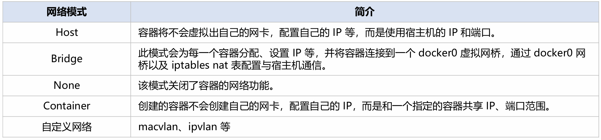

# 云原生简介及Linux入门

## 参考

《操作系统：设计与实现》

《鸟哥的Linux私房菜》

《计算机网络》

《Kubernetes in Action》

Kubernete源码


## 云计算与云原生


# Docker

## Docker简介

### Docker概念与用途

Docker 可以将应用、配置和环境打包，形成一个独立的类似于 iOS APP 形式的**「应用」**。 此「应用」可以直接分发到任意一个支持Docker 的环境中，通过简单的命令即可运行。

- 提供一次性的环境
  - 比如，本地测试他人的软件、持续集成的时候提供单元测试和构建的环境。 
- 提供弹性的云服务
  - 因为 Docker 容器可以随开随关，很适合动态扩容和缩容。 
- 组建微服务架构
  - 因为 Docker 容器非常地轻量，在一台机器通过运行多个容器就可以跑多个服务。

> 用户计算机的环境都不相同，你怎么知道自家的软件，能在哪些机器跑起来？ 
>
> 用户必须保证两件事：**操作系统的设置，各种库和组件的安装**。只有它们都正确，软件才能运行
>
> 举例来说，安装一个 Python 应用，计算机必须有 Python 引擎，还必须有各种依赖，可能还要配置环境变量。如果某些老旧的模块与当前环境不兼容，那就麻烦了。
>
> 开发者常常会说：“在我的环境上还是可以的”。言下之意就是在当前的运行环境可能有什么“问题”，跟开发环境有什么不一样。
>
> 环境配置如此麻烦，换一台机器，就要重来一次，旷日费时。很多人想到，能不能从根本上解决问题，软件可以带环境安装，**安装的时候把原始环境一模一样地复制过来**。

**Docker 对世界的改变（以回顾的视角来看）** 

容器技术跟集装箱一样，给云计算行业带来了极大的技术变革，快速改变了公司和用户创建、 发布、运行分布式应用的方式 

Docker 使得容器化技术使用非常方便，极大地推进了容器行业的发展与容器技术标准化。

- 容器镜像格式标准
- 容器运行标准化
- 就像标准化装卸集装箱货物一样极大方便了容器的存储、分发和使用。可以让开发者打包他们的应用及其依赖的环境到一个容器中，然后快速部署到任何一台Linux机器上。 

Docker 的口号：==Build Once，Run Anywhere==

### Docker的特点

1. 环境一致性
   - Docker容器镜像打包了应用服务运行环境
   - Docker容器基于开放式标准，能够在所有主流 Linux 版本、Microsoft Windows 以及包括 VM、裸机服务器和云在内的任何基础设施上运行
2. 资源独立与隔离
3. 轻量化
   - 共享内核，快速启动
   - 占用很少的计算、内存资源
   - 细粒度的资源管理方式
     - 支持0.5个CPU、200MB内存这种粒度的资源分配
   - 分层文件系统
     - 容器镜像通过分层文件系统组合而成，共享相同的公共镜像层，降低磁盘占用，提高镜像分发速度
4. 容器是自包含的
   - 它打包了应用程序及其所有依赖，可以直接运行。以前应用程序的依赖管理一直是个大问题，即使像RPM 、ansible 等都能解决一部分问题，但并没有一个所有应用程序通用的标准机制，直到容器出现。
5. 容器是可移植的
   - 可以在几乎任何地方以相同的方式运行。这就可以确保应用在开发环境、测试环境、生产环境等都有完全一样的运行环境。
6. 容器是相互隔离的
   - 同一节点上运行的多个容器，不会互相影响。即一个容器中运行的应用程序，是访问不到其他容器的资源的（进程、网络、文件、用户等），除非配置为共享的资源。
7. 容器是轻量级的
   - 体现在容器的秒级启动，并且占用资源很少。

### Docker与虚拟机


​	

**容器与虚拟机使用上的差异** 

① 一个容器中只干一件事 

② 容器的使用观念是我要启动一个 APP，而 VM 使用观念是我需要一个 OS 

③ 容器通常是短暂性的，频繁更新的 

④ 更新整个容器而非到容器中单独更新某个组件 

⑤ 容器不需要热迁移 

⑥ 容器镜像通常很小（相比于VM），分发十分快速 

⑦ 创建容器非常方便，而创建VM相对复杂。 

⑧ 容器与 host 共享内核 

⑨ 容器中没有 systemd，1号进程就是应用进程本身

## Docker入门

### 基础概念

**宿主机Host**：Docker所在的物理机，是容器运行的系统环境。

**镜像Image**：镜像相当于一个程序模板，通过这个模板可以启动多个相似的容器；**镜像是静态的**，就类似进程与程序中程序的概念。有镜像才能运行容器。

**容器Container**：容器是docker运行的最小对象单元，是通过镜像实例化出来的一个运行中的对象；**容器是动态的**，就类似进程与程序中进程的概念。容器可以导出、保存为镜像。

**仓库Repository**：镜像仓库是集中式的管理、存储镜像的仓库，类似Git管理代码的仓库一样，可以管理多版本的镜像。镜像仓库以HTTP 的方式对外提供服务。可以通过docker命令从registry中pull到镜像，或者将镜像push到registry中。

### 镜像管理

**从镜像仓库中拉取到容器镜像，使用容器镜像在宿主机上运行容器。**

> 镜像的表示：完整的镜像名由:两部分组成
>
> ​	
>
> 远端镜像仓库
>
> docker会根据上述镜像表示的规则，从完整镜像名中的repository字段解析出远程仓库（registry）地址，访问此远程仓库地址（registry ）来获取或上传镜像。


### 镜像构建

**Dockerfile**：Dockerfile 是描述镜像如何构建的「脚本」

Dockerfile 中的每一条指令都会创建一个镜像层，每多一条指令便会增加一层镜像的大小。

容器环境的构建过程都以一条条指令的方式清晰地记录在Dockerfile，开发者像开发代码一样编写Dockerfile来构建容器应用运行环境。

```
$ cat Dockerfile
 FROM centos:8
 RUN dd if=/dev/zero of=/tmp/file bs=1M count=1
```

**Dockerfile关键字**

1. FROM：FROM指令 指定构建当前镜像的基础镜像。

   - Dockerfile中构建镜像必须从FROM一个Base镜像开始，如果不依赖任何基础镜像，可以“`FROM scratch`”，表示一个空镜像作为基础镜像。

2. RUN

   - 执行一条命令，默认是以 `/bin/sh –c` 执行。例如：`RUN apt-get update –y` && `apt-get install –y nginx`

   ```
   FROM centos:8
   RUN yum install -y nginx
   ```

3. COPY

   - COPY 指令将从构建上下文目录中 <源路径> 的文件/目录复制到新的一层的镜像内的 <目标路径> 位置。

4. ADD

   - ADD 指令和 COPY 的格式和性质基本一致。但是在 COPY 基础上增加了一些功能。
   - <源路径> 可以是一个 URL
   - <源路径> 是一个 tar 压缩文件并且压缩格式为 gzip, bzip2 和 xz的情况下，ADD 指令将会自动解压缩这个压缩文件到 <目标路径> 中。

   ```
   FROM scratch
   ADD ubuntu-xenial-core-cloudimg-amd64-root.tar.gz /
   COPY test.html /var/www/html/
   ```

5. CMD

   - CMD指令定义容器的启动命令，例如：`CMD ["nginx", "-g", "daemon off;"]`

6. ENTRYPOINT

   - ENTRYPOINT与CMD类似，都是用于指定容器的执行入口, 好处是可以将容器当命令使用

   ```
   FROM centos:8
   RUN yum install -y curl
   ENTRYPOINT [“curl”]
   ```

   ```
   $ sudo docker run -t curl-in-container:latest--help
   Usage: curl [options...] <url>
   	--abstract-unix-socket <path>  Connect via abstract Unix domain socket
   	--anyauth	Pick any authentication method
   	-a, --append	Append to target file when uploading
   	--basic 	Use HTTP Basic Authentication
   	--cacert <file> CA certificate to verify peer against
   ```

7. ENV

   - ENV指令用于设置容器内环境变量。
   - 使用格式：`ENV<key><value>`   或 `ENV<key1> =<value1><key2> =<value2>`...。

8. WORKDIR

   - WORKDIR 指令可以来指定工作目录（或者称为当前目录），以后各层的当前目录就被改为指定的目录，如该目录不存在，WORKDIR 会自动创建。
   - 格式为 `WORKDIR <工作目录路径>`。

9. EXPOSE

   - EXPOSE 指令是声明容器运行时提供服务的端口。

​	

### 常用配置

**Docker Daemon 配置文件**：/etc/docker/daemon.json

配置 registry mirrors：在 daemon.json 中配置 registry-mirrors 来指定 registry 的 mirrors

配置开启允许访问不安全的的 registry：在 daemon.json 中配置 insecure-registries 来指定允许访问的不安全（非https）的registry

**Docker systemd service 配置文件**

- /usr/lib/systemd/system/docker.service
- /etc/systemd/system/docker.service.d/

配置 docker 服务的 http 代理

```
$ sudo cat > /etc/systemd/system/docker.service.d/http-proxy.conf<<EOF
 > [Service]
 > Environment="HTTP_PROXY=http://172.16.2.14:7777"
 > Environment="HTTPS_PROXY=http://172.16.2.14:7777"
 > Environment="NO_PROXY=localhost,127.0.0.1,172.22.28.75,https://y7oivp0s.mirror.aliyuncs.com"
 EOF
 $ sudo systemctl daemon-reload
 $ sudo systemctl restart docker
```

## Docker深入

### 组成架构

**Docker 采用 C/S 架构**

Client 通过接口与 Server 进程通信实现容器的构建，运行和发布。

**Docker由五个部分组成**:

1. **Docker Client 客户端**，负责向服务端（Docker Daemon 守护进程）发起请求
2. **Docker Daemon 守护进程**，负责 从 Docker Registry 下载  Docker 镜像和通过 Docker 镜像启动 Docker 容器
3. **Docker Registry 仓库**，负责存储 Docker 镜像
4. **Docker Container 容器**
5. **Docker Image 镜像**

​	


### 技术基石

#### Namespace

Namespace 是一种Linux 提供的一种内核级别环境（资源访问）隔离的机制，用来让运行在同一个操作系统上的进程之间资源隔离、互不干扰。

- 进一步理解
  - chroot 提供了一种简单的隔离模式，chroot 内部的文件系统无法访问外部的内容。
  - namespace 可以看做是一种加强版的chroot，提供了对UTS、IPC、Mount、PID、Network、User 等资源访问的隔离机制。在不同的namespace 中无法看到其他namespace 内部的资源。
- 通俗理解
  - 通过 namespace 可以让一些进程只能看到与自己相关的一部分资源，而另外一些进程也只能看到与它们自己相关的资源，这两拨进程就感觉不到对方的存在。通过系统调用构建一个相对隔离的shell 环境。具体的实现方式是把一个或多个进程的相关资源指定在同一个 namespace 中。

**如何实现一个资源隔离的容器**

| 要求                                                         | 方式                       |
| ------------------------------------------------------------ | -------------------------- |
| 容器必然需要一个独立的 IP、端口、路由等网络资源              | 网络的隔离                 |
| 你的容器还需要一个独立的主机名以便在网络中标识自己           | 主机名及域名               |
| 想到网络，顺其自然就想到通信，也就想到了进程间通信的隔离     | 信号量、消息队列和共享内存 |
| 可能你也想到了权限的问题，对用户和用户组的隔离就实现了用户权限的隔离 | 用户和用户组               |
| 文件系统（有哪些可用的文件系统，使用情况）                   | 文件系统隔离               |
| 运行在容器中的应用需要有自己的 PID, 自然也需要与宿主机中的 PID 进行隔离 | PID 的隔离                 |

**相关系统调用**

- `clone()`实现线程的系统调用，用来创建一个新的进程，并可以通过设计上述参数达到隔离。
- `unshare()` 使某进程脱离某个namespace
- `setns()` 把某进程加入到某个namespace

支持隔离的资源类型（ns）
Linux中支持多种系统资源的隔离，这里列出容器技术中用到的6种


 #### Cgroups

Cgroups 是 Linux 内核提供的对一组进程做系统资源使用限制（资源QoS ）的机制。

控制一组进程只能使用特定配额的资源，主要包括CPU、内存、进程数、Block I/O 和网络带宽等。

由多个子控制器（Controller）构成，每个控制器控制一种资源。

> 在容器技术中使用 cgroup 来解决以下问题
>
> - 限制容器只能使用2 个CPU core
> - 拒绝容器对某个特定的设备的访问
> - 统计容器用了多少内存
> - 控制容器可用（相比于另一个）双倍的CPU 时间

**Cgroup 中的控制器**

1. 多个controller 组成：cpu、mem、blkio、device ..
2. 每个controller 控制一种资源
3. 每个controller 都有各自独立的配置项
4. 层级化的结构, 子cgroup受到祖先cgroup限制
5. 资源可以在子cgroup中进一步划分

​	

**使用接口**

- 没有 syscall 或 ioctl
- 完全通过文件系统接口控制: 挂载、创建、读、写、删除…。
- 以 cgroupfs 虚拟文件系统的方式暴露访问接口
- 每种 controller 需要独立挂载
- systemd 会自动挂载 cgroupfs 到/sys/fs/cgroup下

**文件接口操作**


## 深入理解 Docker

### Dockerfile、镜像与容器

**Dockerfile 是软件的原材料，Docker 镜像是软件的交付品，而Docker 容器则可以认为是软件的运行态。**

从应用软件的角度来看，Dockerfile、Docker 镜像与Docker 容器分别代表软件的三个不同阶段。 Dockerfile面向开发，Docker镜像成为交付标准，Docker容器则涉及部署与运维，三者缺一不可， 合力充当 Docker 体系的基石。

- 容器是进程，镜像是程序包。
- 容器通过镜像来创建。
- 镜像是Docker 生命周期的构建和打包阶段。
- 容器是Docker 生命周期的启动和执行阶段。
- Dockerfile 是构建镜像的原材料。

### Docker容器的本质

容器是一种沙盒技术

- 容器顾名思义，沙盒就是能够像一个集装箱一样，把应用“装”起来的技术。这样，应用自己运行在一个独立空间中；应用与应用之间，就因为有了边界而不至于相互干扰；而被装进集装箱的应用，也可以被方便地搬来搬去。

容器的本质是一种特殊的进程

- 这个进程是应用所有进程的父进程。容器技术通过环境隔离和资源限制，从而为进程创造出一个沙盒。 Namespace 技术用来实现环境隔离，Cgroups 技术用来实现资源限制， rootfs 机制（也经常被称为容器镜像）为进程提供了文件系统。

创造沙盒比作造房子，把进程作为生活在屋子里的人

- Cgroups 规定了这个房子的面积，这个人能使用多少资源（CPU、内存、网络 带宽等）。Namespace 建造了这个房子的四周墙壁和屋顶，把人与外界环境隔离开来。rootfs 机制建造了这个房子的地下室， 存放着生活必需用品（应用所需文件，应用运行所需要的依赖和整个操作系统）。

### Docker文件系统

Docker 容器的rootfs使用的是**UnionFS**（**联合文件系统**）

UnionFS 是通过联合挂载多个文件目录得到的一个完整的文件系统。容器rootfs看起来是 一个可读、可写的具备完整功能的独立文件系统，但实际上由多层只读层和一个专属于该容器的读写层联合挂载而成。

Linux中支持的UnionFS实现有overlay2、aufs、btrfs，其中最常用的就是overlay2。


**在准备容器rootfs时联合挂载用到的多层目录是哪来的呢？**

- **读写层**，每个容器都有自己专属的读写层，该层由docker 在创建此容器时创建的。
- **只读层**，每个容器的rootfs都会包含好几层只读层，该层由docker 在拉取镜像时将镜像中的各层解压到 docker 的数据目录得到的。

容器镜像与容器 rootfs 的关联：Docker 拉取镜像解压到 docker 数据目录后得到只读层；Docker 创建容器时使用数据目录中的读写层联合挂载得到容器 rootfs

​	

### Docker容器镜像格式

**一个镜像由 manifest、image index、filesystem layers 和 configuration 四部分组成**

- Image Index 和 manifest 的关系是一对多
- Image manifest 和 config 的关系是一对一的关系
- Image manifest 和 Filesystem layers 是一对多的关系

​	

**filesystem layers**

- Filesystem Layer 包含了文件系统的信息
- 描述 image 包含了哪些文件/目录，以及它们的属性和数据
- 包含的内容，每个 filesystem layer 都包含在上一个 layer 上的改动情况，主要包括 3 个方面:
  1. **变化类型**： 是增加、修改还是删除了文件
  2. **文件类型**： 每个变化发生在哪种文件类型上
  3. **文件属性**：文件的修改时间、用户ID、组ID、RWX权限等 比如在某一层增加了一个文件，那么这一层所包含的内容就是增加的这个文件的数据以及它的属性
- 打包格式：最终每个layer都会打包成一个文件，这个文件的格式可以是 **tar 和 tar + gzip** 两种中的一种。

**image config**

- image config 就是一个json文件，它的 media type 是 application/vnd.oci.image.config.v1+json，这个 json 文件包含了对这个 image 的描述
- 重要属性
  1. architecture：CPU 架构，例如：amd64、arm64
  2. os：操作系统，例如：linux
  3. config：当使用此image启动container时，config中的配置就是运行container时的默认参数
  4.  rootfs：指定了 image 所包含的 filesystem layers，type 的值必须是 layers，diff_ids 包含了 layer 的列表（顺序排列），每一个 sha256 就是每层 layer 对应 tar 包的 sha256

**manifest**

- Manifest 也是一个 json 文件，media type 为 application/vnd.oci.image.manifest.v1+json，这个文件包含了对前面 filesystem layers 和 image config 的描述
  1. Config 里面包含了对 image config 文件的描述，有 media type，文件大小，以及 sha256
  2. Layers 包含了对每一个 layer 的描述，和对 config 文件的描述一样，也包含了 mediatype，文件大小，以及 sha256

**image layout**

- image layout 是描述镜像从 registry 拉到本地，以什么样的目录结构保存的。
- image layout 目前主要有两种标准：docker-layout 和 oci-ayout

### Docker 网络

当安装 Docker 时，它会自动创建三个网络：host, bridge 和 none。创建容器时，可以使用该--network标志来指定容器应连接到哪些网络。


**Bridge 模式**

- 在 Docker Server 启动时，默认会在主机上创建一个名为 docker0 的虚拟网桥，该主机上所有启动的 Docker 容器会连接到这个虚拟网桥上，其工作方式类似于物理交换机，主机上的所有容器就通过交换机连在了一个二层网络中。

- 接着要为容器分配 IP 了，默认会从私有 IP 网段中，选择一个和宿主机不同的 IP 地址和子网分配给 docker0 ，所有连接到 docker0 的容器就从这个子网中分配一个未占用的 IP 。

  

