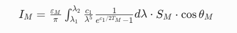

# 引用

[A real-time infrared imaging simulation method with physical effects modeling of infrared sensors - ScienceDirect](https://www.sciencedirect.com/science/article/pii/S1350449516302456)

[Scene simulation and modeling of InfraRed search and track sensor for air-borne long range point targets | IEEE Conference Publication | IEEE Xplore](https://ieeexplore.ieee.org/document/9581635)

[Frontiers | An Infrared Sequence Image Generating Method for Target Detection and Tracking](https://www.frontiersin.org/journals/computational-neuroscience/articles/10.3389/fncom.2022.930827/full)

[A real-time aircraft infrared imaging simulation platform - ScienceDirect](https://www.sciencedirect.com/science/article/pii/S0030402612007218)

[Small Aircraft Infrared Radiation Measurements Supporting the Engine Airframe Aero-thermal Integration](https://www.researchgate.net/publication/323711834_Small_Aircraft_Infrared_Radiation_Measurements_Supporting_the_Engine_Airframe_Aero-thermal_Integration)

# 目标建模的共同维度

五篇论文均从以下核心维度构建目标模型：

## 热辐射物理特性
所有方法均基于普朗克定律、斯蒂芬-玻尔兹曼定律等热辐射理论，计算目标表面温度与红外辐射强度。

- **关键参数**：表面发射率（ε）、温度（T）、观测角度（θ）、有效辐射面积（S）。

## 目标组件分解建模
均将复杂目标（如飞机）分解为热特征差异显著的组件：

- **喷管/引擎**：高温辐射源（文档1、2、5）
- **蒙皮**：受气动加热与环境温度影响（文档1、2、3）
- **尾焰**：高温燃气辐射（文档1、2）

# 目标建模方法的差异

## 物理建模深度

|          **论文**           |                           **方法**                           |             **创新点**             |          **局限性**          |
| :-------------------------: | :----------------------------------------------------------: | :--------------------------------: | :--------------------------: |
|  **文档1** (Huang et al.)   | **背景-目标融合** - 真实红外图像拼接全景背景 - 3D目标关键部位物理建模（喷管、蒙皮、尾焰） - Unity3D动态融合 | 结合实测背景与物理模型，提升真实性 | 未考虑环境动态变化（如天气） |
|  **文档2** (Rohacs et al.)  | **实验驱动模型** - 基于实测数据建立喷管/蒙皮/尾焰辐射公式 - 引入气体温度-压力关系（公式(5)） |    实验验证模型精度（图15-19）     |        未集成实时仿真        |
|    **文档3** (Li et al.)    | **顶点级温度求解** - 将3D模型顶点视为热节点 - GPU并行求解热平衡方程 |       实时温度场更新（图4）        |       依赖高精度3D模型       |
| **文档4** (Naraniya et al.) | **等效辐射强度法** - 远距目标简化为点源 - 等效辐射强度ΔIλ |         适合空对空远距场景         |       忽略目标几何细节       |
|    **文档5** (Li et al.)    | **多层次物理效应集成** - 光学衍射/像差 - 探测器时空滤波 - 信号处理非线性 |     12种物理效应MTF建模（表1）     |         计算复杂度高         |

## 实时性实现技术

|   **方法**   |  **文档1**  |       **文档3**        |         **文档5**         |
| :----------: | :---------: | :--------------------: | :-----------------------: |
| **GPU加速**  | Unity3D引擎 | 顶点着色器实时温度求解 | 菱形卷积核并行计算（图7） |
| **简化策略** |  静态背景   |   热平衡方程迭代求解   | PSF采样压缩计算量（图10） |
|   **帧率**   |   未提及    |   78-176 FPS（表2）    |    50-170 FPS（图19）     |

## 互补性

|   **场景需求**   |     **推荐方法**      |        **原因**         |
| :--------------: | :-------------------: | :---------------------: |
|   **高真实性**   | 文档1（融合实测背景） | 真实背景 + 物理目标模型 |
|   **远距目标**   |   文档4（等效点源）   |   忽略细节，计算高效    |
|  **传感器效应**  |   文档5（MTF集成）    | 覆盖光学/探测器/信号链  |
| **实时动态温度** |  文档3（顶点级求解）  |    GPU实时更新温度场    |

# 分类导图

# 详述

## （文档1）Small Aircraft Infrared Radiation Measurements …

### 飞机红外辐射源 (Section 2 The sources of the aircraft infrared radiation)

飞机的红外辐射由不同的辐射源组成（图 1），包括来自飞机高温部件的辐射、来自受热部件的辐射、以及太阳光、天光和地光的反射。

红外辐射与所有电磁辐射一样，以多种方式与物质相互作用（White, 2012）：

- 反射（Reflects） - 波从表面反射（反射角等于入射角），
- 折射（Refracts） - 当波在具有不同传播速度的两种透明介质之间传播时其方向发生弯曲（斯涅尔定律），
- 散射（Scatters） - 在与粒子尺寸接近波长的粒子相互作用时发生（例如蓝天），
- 衍射（Diffracts） - 发生在障碍物边缘周围的相互作用，
- 干涉（Interferes） - 以建设性和破坏性的方式相互作用，
- 吸收（Absorbs） - 当辐射转化为另一种形式的能量（主要是热能）时，
- 发射（Emits） - 物质通过从另一种形式的能量转化而发射辐射，
- 透射（Transmits） - 红外辐射通过透明介质（或真空）传播，
- 偏振（Polarizes） - 当电场被电介质反射部分偏振时。

### 支配定律 (Section 3 Governing laws)

可测量或感知到的飞机红外辐射取决于热源、源强度（由燃料燃烧引发 (Bicsák, Hornyák and Veress)）、飞机的实际飞行状态、内外流条件以及红外辐射本身。后者由以下支配规则定义（Siegel and Howell, 1972）。

#### 普朗克定律

它描述了处于热平衡状态、在给定（绝对）温度 (*T*) 下的黑体所发射的**光谱辐射度**（*L* - 每单位源参数的能量）。它可以以不同形式给出。例如，每单位波长 (*λ*) 的光谱辐射度为：

式中 *k* - 玻尔兹曼常数：1.38×10−23 *J*/*K*, 

*h* - 普朗克常数：6.626×10−34 *J*⋅*s*, 

*c* - 光速：299792458 *m*/*s*。

*L*(*λ*,*T*) 的 SI 单位是 $W⋅sr^{−1}⋅m^{−3}$。（此处 sr 是球面度或平方弧度角 Ω 的 SI 单位）。

#### 维恩位移定律

它定义了黑体单位波长的光谱辐射度达到最大值时的波长 (*λ*max)：

式中 b - 维恩位移常数，$b=2.8977721×10^{−3} mK.$

#### 斯蒂芬-玻尔兹曼辐射定律

在整个发射波长范围 (λ = 0 ÷ ∞) 上对普朗克分布进行积分，得到黑体单位表面积单位时间发射的总能量。

式中 *σ* 是斯蒂芬-玻尔兹曼常数，$σ=5.67⋅10^{−8} W/(m^2K^4)$

#### 黑体

黑体被定义为一个理想物体，它允许所有入射辐射通过并被其吸收，并在内部吸收所有入射辐射。这意味着不存在反射和透射的能量。这适用于所有波长的辐射和所有入射角。因此，黑体是入射辐射的理想吸收体（Siegel and Howell, 1972）。

黑体是发射辐射物体的理想比较标准。处于热平衡状态的黑体具有两个主要特性。首先，它在每个波长上都是理想发射体，在相同温度下，它发射的能量等于或大于任何其他物体。其次，它是漫发射体，这意味着辐射的能量是各向同性的，与方向无关。

实际物体的辐射可以通过其**发射率**（Emittance）或**发射率**（Emissivity）给出，这是实际辐射与黑体辐射之比：

发射率根据表面特性、材料而变化，对于某些材料，也根据物体温度而变化。它还取决于波长和入射角。

对于粗糙表面，该值接近 1；对于抛光表面，该值约为 0.02。

#### 基尔霍夫热辐射定律

电磁红外辐射通常会照射到物体上，而物体会吸收其中一部分能量。吸收率 (*α*) 的值在 0 到 1 之间，其中 1 表示黑体，0 表示完美的白体。

温度较高的受热物体比较冷的物体发射更多的红外辐射。

容易理解：在热平衡情况下，当物体温度恒定（即不随时间变化）时，发射的辐射和吸收的辐射必须相等。实际上，这意味着物体释放的能量等于吸收的能量：

#### 辐射能量守恒

当入射辐射到达材料表面时，根据材料特性，它可以以 3 种方式作用：它可以被吸收、透射和反射。吸收率 (*α*) 描述了入射辐射被吸收的比例，透射率 (*τ*) 是材料透射（允许通过）红外辐射能力的度量。反射率 (*σ*) 是材料反射红外辐射能力的度量。

利用能量守恒定律，吸收、透射和反射的能量之和必须等于入射能量：

由于透射在实践中很少起作用，因此省略透射 (*τ*)，公式简化为

最后一个方程允许从其反射（更容易测量）来确定物体的发射率。

这个支配规则的简短总结包含了在飞机红外辐射模拟、测量和对抗措施中应用的所有“辐射”方程。其他模型由专门的研究和论文给出。例如，流体力学的基本方程在 (Buonomo et al., 2013; Veress, Bicsak and Rohacs, 2016) 中进行了总结。关于通过红外方法测量边界层的飞行测试的最新例子之一可能是 (Boden et al., 2015)。

## （文档2）A real-time aircraft infrared imaging simulation platform

### 零距离红外辐射建模与仿真 (M&S of zero-distance IR)

为了满足实时性要求，红外场景仿真过程中通常通过导入特定处理的纹理或数据格式来引入温度场数值作为已知输入。若需要更精确地分析温度场，可以通过耗时且复杂的有限元分析软件计算获得高精度结果。通常情况下，计算速度和精度无法同时兼顾。本文提出了一种求解实时温度场的新方法来解决该问题。通过吸收有限元计算的思想，将由建模软件生成的三维几何模型的每个顶点视为一个研究对象，并在GPU的顶点着色器中进行处理。根据GPU的三维场景渲染机制，每当处理一个顶点时，都会执行预置的顶点程序。因此，可以在相应的顶点程序中基于热传递模型求解每个顶点的温度。与使用CPU计算相比，这将大大加快计算速度。通过这种方式，不仅可以应用热传递模型完成更精确的计算，也能满足实时性要求。

#### 几何建模 (Geometric modeling)

飞机的几何建模是可视化显示的基础，也是基于GPU顶点着色器实时求解温度的基础。飞机的几何模型基于3ds Max生成（如图3所示），并转换为可由OGRE引擎驱动的网格格式。网格格式由多个子网格组成。根据飞机的红外特性，建模时将模型划分为不同的子网格，对应不同的材质。具有不同红外特性的部件被构建为不同的子网格，以便可以使用OGRE单独处理它们。为了便于基于GPU求解热传递模型，几何体的顶点应根据精度要求分布。即在温度特性变化剧烈的部分，顶点应分布得更密集，以便能够在线模拟排气羽流。

#### 温度场建模 (Temperature field modeling)

在飞行条件下，飞机蒙皮的温度场同时受到外部热环境和内部舱室传热的耦合影响。考虑到外表面辐射、外部环境辐射、内部热源和气动加热效应等方面，热平衡方程表示为[16]：

其中 $q_i$ 是周围大气环境的辐射能量；$q_0$ 是从发动机热源发出到达内表面的热能，由发动机当前工作状态决定；$q_{rad}=εσ(T_s^4−T_{amb}^4)$ 是辐射到环境的能量；$T_{amb}$ 是环境温度；$T_s$ 是表面面元的温度；$A_N $是面元相对于内部热源的有效面积；$R_N$ 是面元相对于内部热源的等效热阻；$T_e$ 是发动机内部热源温度；$q_{cv}$ 是对流传热，表示为：

$T_{aw}$ 是绝热壁温，与环境温度相关。*x* 是目标长度。*Re* 是雷诺数。*λ* 是空气的导热系数。Pr是普朗克常数。*λ* 和 Pr 对应于温度。

因此可以推导出以下公式：

这是考虑气动效应和环境效应计算蒙皮温度 $T_S$​ 的公式。该非线性方程可通过牛顿迭代法求解。蒙皮表面辐射效率 *ε* 取值 0.65。

#### 零距离红外辐射建模 (Zero-distance IR modeling)

目标释放的辐射主要由两部分组成：自身辐射和反射辐射。在获得自身辐射和反射辐射后，还需计算探测器方向的辐射。

1. **自身辐射**

2. **反射辐射**

3. **探测器方向辐射** 

### 大气传输效应建模与仿真 (M&S of atmosphere transfer effect)

红外辐射在大气传输中的主要影响是吸收、散射和大气湍流效应，导致图像对比度下降、图像失真和模糊。模拟大气透过率 *τ* 和路径辐射 *E*path 对最终结果的影响，如以下方程所示：

### 红外成像效应建模与仿真(M&S of infrared imaging effect)

#### 成像系统效应建模 (Modeling of imaging system effects)

#### 基于OGRE Composer的实现 (Realization based on OGRE composer)

## （文档3）Scene simulation and modeling …

红外场景是传感器在其期望光谱波段内接收来自其视场（FOV）辐射的响应。通常，来自红外搜索与跟踪（IRST）传感器的图像或场景可能包含其视场内不同距离的背景和目标。除此之外，IRST是一种监视传感器，覆盖广阔的**注视场（Field-of-Regard, FOR）**。因此，红外场景生成需要以期望的扫描速度扫描视场（FOV）以覆盖整个注视场（FOR）。在本节中，我们将详细讨论我们为实现逼真的红外场景生成所实施的简化方法。

### 背景建模 (Background Modeling)

众所周知，云是虚拟室外场景的重要组成部分，尤其是对于从海平面以上显著高度观察的空中目标。云通过热辐射和散射的太阳辐射呈现出显著的杂波源。这随传感器和目标距海平面的高度、时间（或太阳位置）等因素而变化。已经开发了许多方法来建模和显示云。云建模主要有两类：经验方法和基于物理的方法[4]。

有多种方法，如Perlin、Gardner、基于矩阵的方法等，可以配合合适的参数来生成不同的人工云场景。在我们的研究中，我们采用了**基于矩阵的方法（matrix based method）** 来生成背景云场景。在这种方法中，我们使用整个视场（FOV）中背景的平均辐射量。然后，通过迭代应用强度级别的随机调制，我们生成了模拟的云。在我们的模型中，平均辐射量考虑了发射的热辐射和散射辐射。对于发射的热辐射计算，我们使用普朗克（Plank）定律。为了考虑近似接收到的散射辐射，而不进行详细的散射计算，我们通过一个任意常数来调制太阳辐射（太阳常数）。完整的软件模型使用MATLAB开发。

### 远距离点目标建模 (Modeling of Long Range Point Targets)

这项工作中红外场景模拟的一个主要设计目标是模拟远距离空中点目标（即战斗机、导弹等）的探测器响应。目标的红外辐射特性由其飞行动态状态、材料以及红外目标周围的环境决定，描述了目标的辐射分布。然而，如第一节所述，在我们的案例中，机载IRST系统通常在远距离（20-100公里或更远）下工作。因此，在我们的简化方法中，我们没有使用精确的目标3D模型，而是采用了等效辐射量方案。为简化设计，我们将目标视为一个**点源（point source）**，假设其向所有方向均匀辐射。那么，无论其相对于视线的方向如何，都可以通过其与背景的恒定光谱辐射强度差 ΔIλ（瓦特/球面度/微米 或 光子/球面度/微米）来表征[5]。在远距离下，目标的大小可能不大于一个像素。考虑到调制传递函数（MTF）以及目标位置可能不在探测器像素中心，导致目标强度散布在多个像素上。因此，我们使用了不同大小的目标，如2x2、3x3等，具体取决于传感器的瞬时视场（IFOV）以及目标的距离和大小。

在我们的等效辐射方法中，考虑了对应于瞬时视场（IFOV）的目标面积在不同温度下发出的辐射[5]。通过详尽的文献调研并与现有软件中的一些模型进行比较，我们极其谨慎地进行了逼真的目标特征计算。例如，传感器可能观察目标的不同方向；如果观察尾部方向，尾喷管和羽流辐射在3到5μm大气窗口中的强度显著强于8到12μm波段。对于前向观察，尾喷管辐射通常不可直接观测，因此羽流、蒙皮发射和反射分量占主导。

### 构建IRST扫描模式的注视场 (Construction of Field-of-Regard for Scanning Mode of the IRST)

由于IRST用于态势感知并覆盖广阔的注视场（FOR），传感器以其预定义的扫描模式连续扫描其视场（FOV）。因此，传感器应在其整个注视场（FOR）内探测并跟踪目标。考虑到这一点，所有图像处理算法的开发都需要在传感器覆盖其完整注视场（FOR）并具有所需扫描参数的扫描模式下进行充分测试。

在扫描模式下，IRST传感器扫描整个注视场（FOR），因此需要创建足够大的背景。一旦背景创建完成，就需要定义目标并将其插入到注视场（FOR）中的任意位置。为了覆盖传感器的整个注视场（FOR），我们采用了**球形构建方法（spherical construction approach）**，其中传感器的视场（FOV）在方位角和俯仰轴上以预定义的速度（度/秒）和固定模式进行扫描。已经生成了不同场景的复杂场景，例如：目标可能出现在注视场（FOR）内任何视场（FOV）中/消失、扫描时目标在不同视场（FOV）中交叉、多个目标交叉等。

### 使用生成的红外场景进行点目标检测与跟踪 (Point target detection and tracking using generated IR scenes)

在杂波中检测点目标或小目标是IRST系统中的关键任务。我们利用开发的IR场景生成软件模型，准备了多种场景，如多目标、恒定速度目标、出现/消失目标、暗弱目标等。这些生成的场景通过实施基于不同形态学算法、方向导数、最大均值（Max Mean）、最大中值（Max Median）等[6]的各种技术，用于点目标检测的开发。

一旦目标被检测到，就应用不同的算法进行跟踪。在本文中，我们展示了**全局最近邻域（Global Nearest Neighborhood, GNN）算法**[7]的结果，该算法仅维持单个最可能的假设（观测到航迹关联），是现代跟踪系统中最简单且可能是应用最广泛的方法。恒定速度的点目标是测试和验证该算法最现实的场景，因此，我们讨论了针对此类场景的结果。

## （文档4）A real-time infrared imaging simulation …

### 实时红外成像模拟流程 (A real-time infrared imaging simulation process)

我们的实时红外成像模拟流程如图1所示，包括零距离辐射建模（Zero-distance radiation modeling）、大气传输建模（Atmospheric transmission modeling）和红外传感器建模（Infrared sensor modeling）。这里采用了松耦合结构，便于每个模块的独立实现和性能分析。它也有利于基于数据流的交互和集成。我们使用OGRE（开源3D图形渲染引擎）来完成3D场景管理、资源管理和图形渲染。

**零距离辐射建模（Zero-distance radiation modeling）** 是生成红外图像的基础。目标的温度场和辐射场可以通过建立热平衡方程来求解。应依据目标的结构特性建立3D模型，这也为方程求解提供了划分的网格。零距离辐射模型的输入是目标的工作状态和环境状态参数；其输出是目标的表面温度场和相应的红外辐射强度。以装甲车辆的辐射模型为例。根据其结构，建立一个几何模型，包括178,190个顶点和四个区域：火力部分（炮管和炮塔）、驾驶部分（履带）、动力舱顶板以及其他表面部分。对于每个表面部分，需要根据其对流边界条件、辐射边界条件及其工作状态建立其热平衡方程。动力舱顶板表面的热平衡方程如公式(1)所示：

车辆的自辐射强度可以通过公式(2)获得：

其反射辐射可以用公式(3)描述：

**大气传输效应（Atmospheric transmission effect）** 意味着红外辐射将根据大气条件受到影响，主要对红外辐射产生衰减效应。MODTRAN 是一种专业计算软件，被集成到我们的模拟流程中进行精确计算[18]。我们还基于经验公式[19]建立了一个简化的大气衰减模型。

**红外传感器的物理效应建模（Physical effect modeling of infrared sensors）** 主要用于模拟红外传感器在信号转换和空间传输过程中引入的不同效应。红外传感器主要包括光学系统、探测器系统和信号处理系统。因此，应模拟这些系统的信号响应过程和信号空间传输的典型物理效应，例如光学系统的衍射和像差效应、探测器系统的时域/空域滤波效应和空间采样效应，以及信号处理系统的线性滤波和信号传递效应。此外，红外传感器的时间噪声（主要由探测器系统产生）会对实际红外图像造成干扰。红外传感器建模将在第4和第5节详细介绍。

OGRE 提供了一个基于硬件的缓存，包括顶点缓冲区和索引缓冲区，可以支持目标温度和辐射特性求解的计算结果。计算得到的温度和辐射场数据附加到目标3D模型的顶点上，用于实时渲染。OGRE 提供的合成器（composer）框架帮助我们实现渲染图像的后处理效果，特别适用于模拟红外传感器的退化效应。合成器的链式处理机制用于实现由不同信号响应和空间传输模型产生的综合叠加效果。

### 空间域物理效应的传感器建模 (Sensor modeling for physical effects of spatial domain)

图2展示了一些典型的传感器空间效应。这里我们以渐晕（vignetting）、运动模糊（motion blur）和几何畸变（geometric distortion）效应为例来说明基于像素的模拟方法。

物理实验结果可用于校正基于像素的空间效应模拟，帮助建立像素处理参数与传感器实际物理参数之间的对应关系。

## （文档5）An Infrared Sequence Image Generating Method …

### 红外目标建模 (Infrared Target Modeling)

作为红外辐射源，飞机不同部件的辐射特性因发热程度不同而表现出显著差异。红外辐射最强的主要部件包括发动机喷嘴、飞机蒙皮和尾焰 (Haixing et al., 1997)。本研究从红外辐射的基本理论出发，把握各部件的主要红外辐射特征，建立其红外辐射强度模型。

假设红外探测器可感知波长范围从 *λ*1 到 *λ*2 的光（本研究仅考虑中波红外，即波长范围为 3−5μm）。根据普朗克定律 (Yu, 2012)，灰体的红外辐射强度可表示为：

其中 T 是灰体表面温度，*c*1 是第一辐射常数，通常为 $(3.741774±0.0000022)× 10^{−16} W⋅m^2$，$c_2$ 是第二辐射常数，通常为 $(1.4387869±0.00000012)×10^{−2} m⋅K$。令 $x=c_2/λT$，上式可简化为：

### 喷嘴辐射模型 (Nozzle Radiation Model)

当发动机中的燃料燃烧时，会发出高温辐射，这是飞机飞行时的主要热源 (Chuanyu, 2013)。作为机身外部发动机的延伸，尾喷嘴也表现出较强的红外辐射。尾喷嘴是典型的灰体，表面发射率约为 0.8-0.9。根据公式(2)，尾喷嘴的红外辐射强度 $I_W$ 与温度 $T_W$ 之间的关系如下：

其中 $ε_M$ 是喷嘴表面的辐射率（发射率），由飞机表面材料决定。$S_M$ 是面向探测器的蒙皮横截面积。$θ_M$ 是探测器方向与红外辐射方向之间的夹角。

### 飞机蒙皮辐射模型 (Aircraft Skin Radiation Model)

飞机蒙皮温度主要受两个因素影响：大气环境温度和飞机高速运动时与大气摩擦产生的温度。由于本研究仅考虑在中低空飞行的飞机，大气环境温度 *T*0 与高度 H 的线性关系满足 $T_0=(288.2−0.0065H)K$，为简化取 $T_0=280 K$。摩擦和飞行速度产生的温度 $T_W$ 遵循以下函数关系：$T_M=T_0(1+0.16M^2)$，其中 M 是飞机的马赫数。

此外，根据公式(2)，飞机蒙皮辐射强度 $I_W$ 与温度 $T_W$ 的函数关系如下：

其中 $ε_M$ 是蒙皮表面发射率，由飞机蒙皮表面材料决定。$S_M$ 是面向探测器的飞机蒙皮横截面积，$θ_M$ 是探测器方向与红外辐射方向之间的夹角。

### 尾焰辐射模型 (Tail Flame Radiation Model)

发动机喷射的高温火焰和高温气体形成飞机的尾焰。假设尾焰喷嘴内的气体温度为 $T_F$，尾焰温度为 $T_P$，尾焰喷嘴内外的气体压力分别为 $P_P$ 和 $P_F$；则有：

其中 *γ* 是气体的比热容；对于涡扇航空发动机，其值为 1.3。根据公式(2)，可以建立尾焰喷嘴辐射强度 $I_P$ 与温度 $T_P$ 之间的函数关系：

其中 $ε_ρ$ 是飞机尾焰的表面发射率 $S_P$ 是面向探测器的飞机尾焰横截面积，$θ_P$ 是探测器方向与红外辐射方向之间的夹角。为了提高直观效果，尾焰通常通过粒子流进行模拟。基于上述红外辐射模型，获得了具有红外辐射特性的三维目标。飞机的红外辐射强度随目标的速度和姿态动态变化。