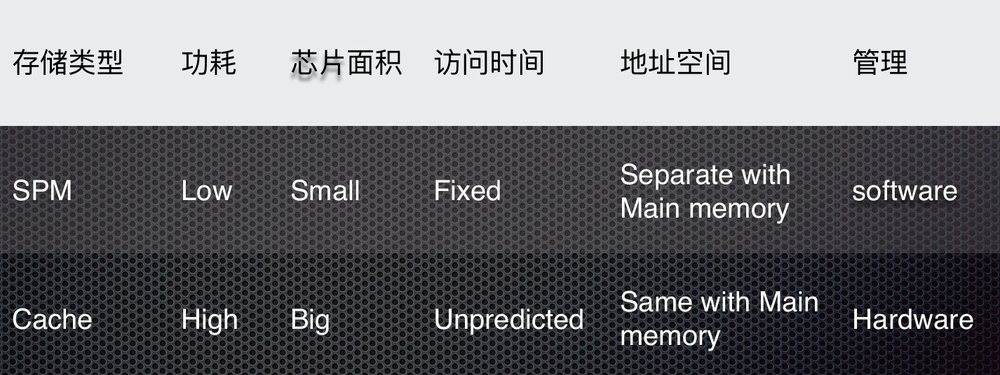
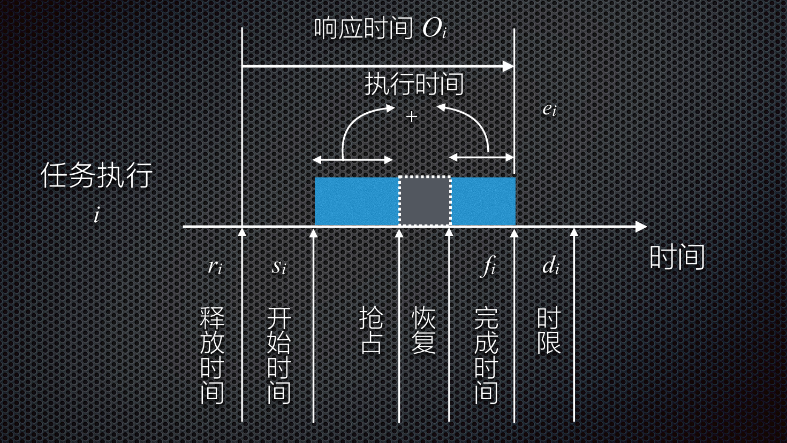
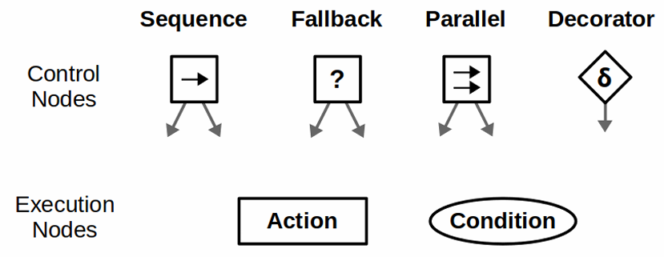
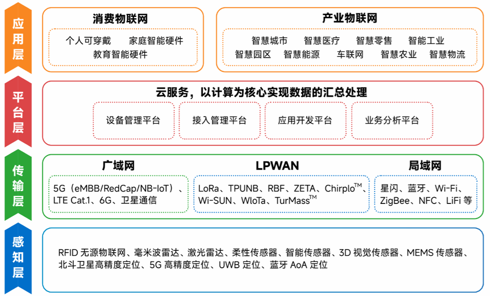
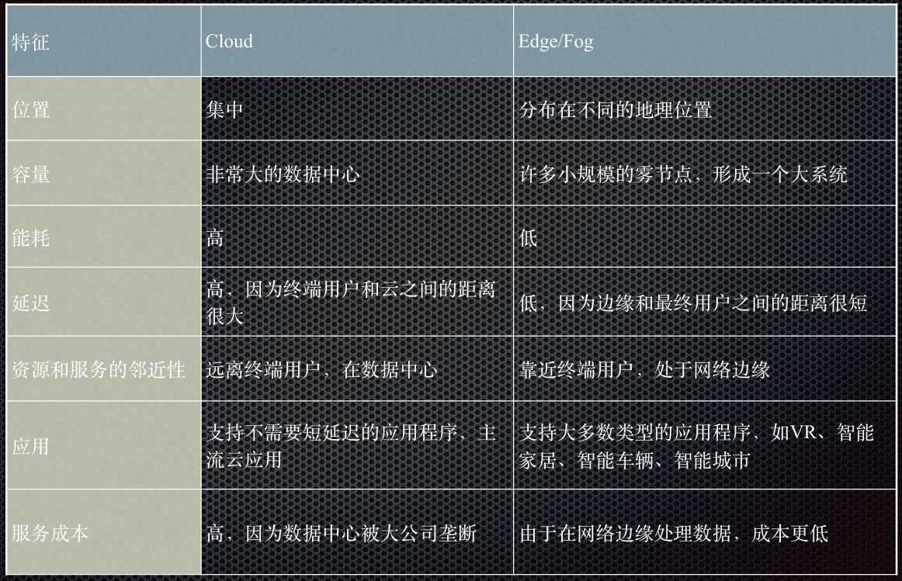

# 嵌入式系统复习总结

## 嵌入式系统概述

### 通用定义

 “嵌入式系统”实际上是“嵌入式计算机系统”的简称。

- IEEE（国际电气和电子工程师协会）的定义： 
  - 嵌入式系统是“用于控制、监视或者辅助操作机器和设备的装置”（Devices used to control, monitor, or  assist the operation of equipment, machinery or plants）。

- 国内普遍被认同的定义：
  - 嵌入式系统是“==以应用为中心，以计算机技术为基础，软硬件可裁减，适用于应用系统对功能、可靠性、 成本、体积、功耗有严格要求的专用计算机系统==”。

嵌入式系统三要素：

- **嵌入、专用、计算机**
- **嵌入性**: 嵌入到对象体系中,有对象环境要求
- **专用性**: 软、硬件按对象要求设计、裁减
- **计算机**: 实现对象的智能化功能

> 其他定义：
>
> - **嵌入封闭产品中的信息处理系统**
>
> - **看不见的计算机**，⼀般不能被用户编程, 它有⼀些专用的I/ O设备, 对⽤户的接口是应用专用的。
>
> - An embedded system is a computer system contained within some larger device or product with the intent purpose ofproviding monitoring and control services to that device.
> - “Any sort of device which includes a programmable computer but itself is not intended to be a general-purpose computer."
> - 包含有计算机，但又不是通用计算机的计算机应用系统。

### 术语

- 泛在计算（ubiquitous computing）  
  - 预言任何时间、任何地点的计算  
- 不可见计算机（invisible computer）  
  - 预言计算机将被集成到物件中  
- 普适计算（pervasive computing）  
  - 计算设备对日常生活的渗透  
- 环境智能（ambient intelligence）  
  - 主要强调了未来家庭或智能楼宇中的通信技术

### CPS信息物理系统

Cyber-Physical System (CPS) ，是计算进程与物理进程的集成，更多地强调**嵌入式系统与物理学**的深度结合

### 组成

**嵌入式硬件**：

- 以<u>微处理器</u>为核心集成<u>存储器</u>和系统专用的<u>输入/输出设备</u>

**嵌入式软件**：

- 包括<u>初始化代码及驱动</u>、<u>嵌入式操作系统</u>和<u>应用程序</u>等，这些软件有机地结合在一起，形成系统特定的一体化软件

### 特征

1. 通常是形式多样、面向特定应用的  
2. 高度制约的环境  
3. 与外部环境的交互，包含传感器和执行器  
4. 实时性的要求  
5. 安全性和可靠性  
6. 关注成本  
7. 并发性

### 分类

按嵌入式**处理器的位数**来分类：

- 4位嵌入式系统  
- 8位嵌入式系统  
- 16位嵌入式系统  
- 32位嵌入式系统  
- 64位嵌入式系统（⾼度复杂的、⾼速的嵌入式系统开始采用）

按**应用**来分类  

- 移动互联网、工业控制、信息通讯……

按**速度**分类 

- 强实时系统, 其系统响应时间在毫秒或微秒级  
- 一般实时系统, 其系统响应时间在几秒的数量级上，其实时性的要求比强实时系统要差一些  
- 弱实时系统，其系统响应时间约为数十秒或更长。这种系统的响应时间可能随系统负载的轻重而变化

按**确定性**来分类  

- 硬实时：系统对系统响应时间有严格的要求，如果系统响应时间不能满足，就要引起系统崩溃或致命的错误  
- 软实时：系统对系统响应时间有要求，但是如果系统响应时间不能满足，不会导致系统出现致命的错误或崩溃

按嵌入式系统软件**复杂程度**来分类

- 循环轮询系统  
- 有限状态机系统  
- 前后台系统  
- 单处理器多任务系统  
- 多处理器多任务系统

### 发展趋势

**嵌入式人工智能**  

**安全**  

**互连**的需求  

不断增加的**计算需求**，不断增加的复杂性 

- 如机顶盒多媒体处理、高清电视、深度学习等  

日益增长的**灵活性需求**  

- 在不断变化的标准下进入市场的时间（Time-To-Market，TTM）  

更高的**集成度**：在同一芯片上集成更多的功能  

**IP重用，基于平台的设计，NoC与总线**  

- 用于ASIC或FPGA中的预先设计好的电路功能模块  

**云、边缘计算**

### 典型应用

- 运输与移动性（汽车电子，自动驾驶，航电设备等）
- 可穿戴式（智能手表）
- VR/AR
- BMI
- 机器人
- 智能家居

## 存储器架构

### 复杂性

在同一个嵌入式系统中，通常需要**组合各种存储技术** 

- 至少需要一些**非易失性**存储和一些**易失性**存储  
- 多种选择  

**层次结构**往往是必须的  

处理器架构的**地址空间被分解成若干子空间**来提供不同类型的存储器访问

### 层次结构

精确的分层结构取决于技术参数，也取决于应用领域  

- **处理器寄存器**  
- **缓冲存储器**：  
  - 高速缓存Cache  
  - 地址转换高速缓存（TLB，也称快表）  
  - 暂存存储器（SPM）  
- **工作存储器**（或主存储器、主存）  
  - 实现了处理器存储地址所涵盖的存储器  
  - 通常，其容量在MB到GB之间，并且是易失的  
- **flash、磁盘**等非易失性存储，也可基于互联网的存储器解决方案（如云）

> cache是老生常谈了，多级cache：$t_{av} = h_1t_1+h_2t_2+(1-h_1t_1-h_2t_2)t_{main}$，其中$h_1$和$h_2$是一级、二级cache的命中率
>
> SPM 暂存/便签存储器：提供比缓存更可预测的访问时间，功耗低，速度快
>
> 

### 存储器访问时间难以预测

很难预测或理解访问存储器的时间需要多久，因而嵌入式系统设计人员通常比一般程序员需要更深入地理解存储器系统  

- 虚拟存储器（ Virtual Memory）：**使各种存储技术看起来是一个连续的地址空间**  
- 地址转换：把地址空间的逻辑地址转换成一种存储技术上的物理地址，转换通常是由一个专门硬件协助完成，称为转换后备缓冲器 （Translation Lookaside Buffer，TLB），加速地址转换

## 嵌入式软件系统

### 嵌入式软件与桌面软件的对比

- **内存**
  - es内存有限
- CPU**处理能力**
  - es的CPU只是恰好能满足的程度
- **操作系统**
  - OS（Windows/Linux）、RTOS、专有OS或裸机
- **实时行为**
  - 实时系统不一定会运行得很快，但一定是可预测的，通常的术语叫做**确定性**
- **开发流程**
  - 交叉开发，es还需要移到真机或某种环境下测试
- **执行流程**
  - es大多从开机开始就会运行某个程序，该程序会一直运行到系统关机
- **每一个嵌入式设备都是不同的**
  - 技术、商业运作…
- **嵌入式软件开发工具有显著的不同**
  - 交叉编译器
  - 小部分汇编代码
  - 复杂的调试和内存映射
- **软件组件**
  - 适合es的库
  - 支持互联

### 嵌入式软件架构模式

对于基于微控制器的系统来说，最常用的架构模式包括：  

- **非结构化单体架构**
  - 很容易构建，但很难维持规模和移植；与应用层的应用程序紧密耦合
  - 应用下分许多模块，模块之间互相耦合  
- **分层架构**  
  - 当今最常用的架构
  - 将应用程序的逻辑划分为若干独立的层，仅通过定义良好的抽象层进行交互
  - 应用层 -> 中间件层 -> RTOS/OS层 -> 驱动层 -> 硬件
- **事件驱动架构**  
  - 对于实时嵌入式应用程序和与能耗相关的应用程序非常有意义
  - 系统通常处于空闲状态或低功耗状态，利用中断来立即响应事件
  - 可扩展性，可伸缩和可移植，高内聚低耦合，但会带来额外开销
- **微服务架构**
  - 将应用程序构建为为业务领域开发的**小型自治服务**的集合
  - 围绕业务组织，低耦合的
  - 架构分散，额外开销，抖动

### 实时嵌入式软件常用的设计模式

1. 单核（轮询、有限状态机、中断处理（前后台）、DMA）  

2. RTOS模式，同步（资源、活动）  

3. 发布和订阅模型  

4. 低功耗设计模式  

5. 多核 

### 数据获取/存储相关的中断设计模式

1. **线性数据存储**  
   - 中断服务程序可以直接访问的共享内存位置
2. **乒乓缓冲/双缓冲**  
3. **环形/循环缓冲区**
   - 中断可以尽可能快地运行
4. **带有信号量的循环缓冲区**  
5. **带有事件标志的循环缓冲区**
   - 4和5都属于通知，应用程序需要轮询缓冲区以查看是否有新的可用数据
6. **消息队列**
   - 类似于使用带有信号量的线性缓冲区

##  嵌入式操作系统

### RTOS

**实时操作系统**（Real-Time Operating System, RTOS）是支持构建**实时系统**的操作系统

> **实时系统**：计算的正确性不仅取决于程序的逻辑正确性，也取决于结果产生的时间

非实时操作系统上的确定性用户代码和实时操作系统上的非确定性用户代码都不会产生实时性能，要同时具备**实时运行的操作系统**和**提供确定性执行的用户代码**

- **确定性**（Determinism）：如果一个系统始终会为某个已知输入产生相同的输出，则该系统是确定性的  
- 非确定性系统的输出具有随机变化特征  
- **截止时限**（Deadline）：截止时限就是必须完成某项任务的有限时间窗口，指明计算何时必须结束

**为何使用**RTOS：可被复用的标准软件组件、灵活性、响应时间

### RTOS与GPOS（通用操作系统）

RTOS与GPOS不同的功能 

- 更快的特性  
- 满足应用需要的剪裁能力  
- 减少内存需求  
- 为实时嵌入式系统提供可剪裁的调度策略  
- 嵌入式应用上下文中具有更好的可靠性  
- 支持无盘化嵌入式系统，允许从ROM或RAM上引导和运行  
- 对不同硬件平台具有更好的可移植性

### RTOS关键要求

操作系统的**时间行为必须是可预测的**，任何调度策略都必须是确定性的

操作系统必须**管理线程和进程的调度**

一些系统要求操作系统**管理时间**

操作系统必须是**快速的，可靠性，简洁紧凑**

### RTOS类别

快速专有内核  

- ucOS、freertos  

对于标准操作系统的实时扩展  

- 单内核  
  - PREEMPT_RT：Linux内核补丁，该内核补丁会将Linux的调度器修改为完全可抢占特性(fully preemptible)  
- 双内核
  - Xenomai：一个符合POSIX标准的协同内核（或管理程序），是一个可以提供与 Linux内核协作的实时内核，Linux内核会被视为实时内核调度器的空闲任务（最低优 先级任务）  
  - RTAI：一个协同内核（co-kernel）的替代解决方案

### 对于标准操作系统的实时扩展

优点：  

- 可配备标准操作系统的API，具有GUI、文件系统等  
- 标准OS的增强功能也可很快速地应用在嵌入式领域  
- 非实时进程不会影响实时进程  

缺点：  

- 设备驱动程序存在一些问题，为避免冲突，有必要将设备划分为由实时进程处理的和由标准OS处理的两大类型  
- 实时进程不能使用标准OS的服务，因此，诸如文件系统访问、GUI等所有优秀特性对于实时进程一般是不可用的

### RTOS内核系统服务

- 任务管理  
- 同步与通信  
- 内存管理  
- 时间管理  
- IO管理  
- 异常与中断管理

### 物联网操作系统

**要求**：

- 内存占用小
- 支持异构硬件
- 网络连接
- 节能 
- 实时功能
- 安全

**非技术属性**：(开放的)标准，认证，文档，代码成熟度，代码许可，操作系统提供商

**与物联网相关的操作系统分类** 

1. 事件驱动的操作系统  
2. 多线程操作系统  
3. 纯RTOS

### 实时调度任务模型

调度程序可能做出很多有关任务的假设，这样的假设集称为调度程序的任务模型

- 假设调度开始之前知道所有要执行的任务  
- 支持任务的到达  
- 支持任务反复执行，可能是无休止的，也可能是周期性的  
- 任务是突发性的，重复出现但时间不规律，任务的两次执行时间间隔有一个下限  
- 优先序约束：如果执行i必须优先于j ，可以写成i<j
  - 互斥锁

作业（job）：一个任务的每次执行被称为一个作业

**时限约束**：如果进程没有在截止时限前完成会发生什么? 

- 硬截止时限：如果错过，系统将失败  具有硬时限的调度称为硬实时调度  
- 软截止时限：反应不需要严格执行的设计决策，最好满足时限要求，但是错过了也不算错误  
  - 软实时调度  
    - 也许会试图采取一些补偿性的措施，例如使用近似数据或者切换到特殊安全模式  
    - 简单的措施避免错误数据的扩散，例如电话中插入一段寂静，或者干脆置之不理

### 调度程序的度量

- 可行调度  
- CPU利用率  
- 调度开销：制定调度决策所需的时间  
- 延迟  
- 总完成时间

## RMS、EDF及改进

### 单调速率调度  Rate Monotonic Scheduling

RMS：任务的优先级是周期的单调减函数，**周期短的任务拥有高优先级，长周期的任务被分配为低优先级**

该算法的单处理器系统中**最优的固定优先级抢占式调度算法**；基于静态优先级，从而可以应用于具有固定优先级的操作系统

### 最早截止时间优先  Earliest Deadline First

EDD(最早交货期)按照非递减截止时限顺序执行任务，截止时限最早的首先执行，EDD在**最大延迟最小化**方面是最优的

EDD是静态优先级调度算法，不支持任务到达，可通过允许任务在任何时刻“到达”(就绪)来扩展EDD 

最早截止时限优先(EDF)：给定n个具有任意到达时间的独立任务集，在任何时刻，在**所有就绪任务中执行绝对截止时限最早的任务的算法** 

- 对于最大延迟最小化上是最优的

### 最晚时限优先 Latest Deadline First

用于任务间存在**依赖关系**（有向无环图DAG）的场景。它按照截止期限从**晚到早**的顺序**非抢占地**执行任务。这是一种**静态**调度算法，所有任务信息必须提前已知。

在优先序束下，LDF是最优的

## 同步与通信、存储管理

### 动态存储管理

标准C库中的malloc()和free()函数可以实现动态内存管理，但是其有如下缺陷：  

- 具有不确定性，每次调用的时间和开销可能不同  
- 会产生内存碎片   
- 通常不具备线程安全特性   
- 在小型嵌入式系统中可能不可用或效率不高  
- 具体实现可能会相对较大，会占用较多的代码空间  
- 会使得链接器配置复杂 

### 内存管理方法

**静态内存分配**（Static Memory Allocation）  

- 允许用户在编译时为任务和内核对象（如队列、信号量等）分配静态内存  
- 静态可以保证设备的可靠性，但是需要考虑内存上限，内存使用效率低  

**动态内存分配**（Dynamic Memory Allocation）  

- 提供用于动态内存分配的内置函数，允许任务在运行时请求和释放内存  
- 对于需要灵活管理内存的应用非常有用，但需要小心避免内存泄漏和碎片化  

**内存池**（Memory Pools）  

- 内存池是在系统初始化时创建的一块内存区域，用于存储固定大小的内存块  
- 任务可以从内存池中申请内存块，并在使用完毕后将其返回给内存池，这有助于减少内存碎片化

### μC/OSII

**实模式**：不划分内核空间和用户空间，整个系统只有一个地址空间，即物理内存空间

**固定分区**的存储管理方法：把连续的大块内存按分区来管理，每个分区包含有整数个大小相同的块

用户的应用程序就可以从不同的内存分区中得到不同大小的内存块，但特定的内存块在释放时必须重新放回它以前所属于的内存分区

### freertos

FreeRTOS将内存分配保留在**可移植层**

内存动态分配不调用`malloc()`，而是调用`pvPortMalloc()`；释放RAM时， 内核调用`vPortFree()`，而不是`free()`

- heap_1 —— 最简单，不允许释放内存  
- heap_2 —— 允许释放内存，但不会合并相邻的空闲块  
- heap_3 —— 简单包装了标准 malloc() 和 free()，以保证线程安全  
- heap_4 —— 合并相邻的空闲块以避免碎片化   
- heap_5 —— 如同 heap_4，能够跨越多个不相邻内存区域的堆

## 建模

### 模型、特征

模型是对所研究的系统、过程或概念的一种表达形式。使用模型的目的是要给出系统的抽象视图，每个模型都表示一组对象以及这些对象之间的相互关系

- **简单**  
- **经得起理论检验**  
- **高表现力**  
  - 简洁的表示，可以提高生产率  
- **提供逻辑推理能力**  
- **可执行**  
  - 仿真/验证  
- **可综合**  
  - 通常要求设计正交性  
- **能够适应各种不同的任务**  
- **描述不存在歧义**，易于理解易于修改

### 建模语言

建模语言有多种形式  

- 图形、文本  
- 面向文档、仿真或执行  
- 专注于体系架构层面内容、实现层面内容

### 建模实例

反馈控制是指将系统的输出信息返送到输入端，与输入信息进行比较，并利用二者的偏差进行控制的过程  

open loop control，又称“**开环控制系统**”，是指在一个控制系统中系统的**输入信号不受输出信号影响**的控制系统, 也就是，不将控制的结果反馈回来影响当前控制的系统

闭环控制是指作为被控的输出量以一定方式返回到作为控制的输入端，并**对输入端施加控制影响**的一种控制关系，即带有反馈信息的系统控制方式

在过程控制中，按偏差的**比例（P）、积分（I）和微分（D）**进行控制的**PID控制器**（亦称PID调节器）是应用最为广泛的一种自动控制器

## FSM

### 反应式系统

反应式(reactive)系统就是指能够持续地与环境进行交互，并且及时地进行响应的系统

其特征是**事件驱动**，当系统接收到一个外部事件时，需要对事件进行处理，然后产生响应

大多数实时系统都是反应式系统，如通信网络、看门狗和家庭应用（洗衣机、微波炉和洗碗机等）等

### FSM定义、应用、分类

有限状态机（finite-state machine，FSM）又称有限状态自动机 （finite-state automaton，FSA），简称状态机，是表示有限个状态以及在这些状态之间的转移和动作等行为的数学计算模型

有限状态机是在自动机理论和计算理论中研究的一类自动机 

### HFSM

常规FSM问题：

1. 经常过度指定
2. 由于缺乏组合潜力，可伸缩性较差 
3. 不支持并发  
4. 可维护性差

在模型中引入**层次结构**

Hierarchical FSM，HFSM，是由**多个嵌套到层次结构中的有限状态机**（fsm）组成的，其动机是以**模块化**的方式方便地对复杂系统进行建模，从而能够整齐地表示和描述子系统及其相互作用

### 行为树

行为树是一种**结构化的可视化建模技术**，常用于系统工程和软件工程领域，用于描绘系统的行为，采用由节点和连接线构成的层级树状图来展示控制流程和系统操作

**执行节点**(Execution node)是行为树的叶子，可以是 Action 或 Condition 节点  

- 唯一的区别在于，Condition节点在单个 ticks 中只能返回 Success 或 Failure，而Action节点可以跨越多个 ticks 并可以返回 Running，直到它们达到最终状态  
- 通常，条件节点代表简单检查（例如“夹爪是否打开？”），而动作节点代表复杂动作（例如“打开门”）  

**控制节点**(Control node)是内部节点，定义如何在其子节点的状态之下遍历行为树  

- 控制节点的子节点可以是执行节点或控制节点本身  
- **顺序(sequence)，选择(Fallback)和并行（parallel）**节点可以有任意数量的子节点，但在处理这些子节点时有所不同  
- **修饰**(Decorator)节点必须有一个子节点，并使用一些自定义定义的策略修改其行为

优点：  

- 灵活性：可以通过添加、删除、修改节点来轻松调整行为  
- 模块化：行为可以分离成独立的模块，便于重用和维护  

缺点：  

- 复杂性：随着行为树的规模增大，树结构可能变得复杂，难以管理  
- 性能：复杂行为树可能会导致性能开销，**尤其是在节点层次很多的情况下**

## 物联网

### IOT

物联网，Internet of Things (IoT) ，通过射频识别(RFID)、红外感应器、全球定位系统、激光扫描器等信息传感设备，按约定的协议，**把任何物品与互联网相连接，进行信息交换和通信**，以实现智能化识 别、定位、跟踪、监控和管理的一种网络概念 

- 设备：在物联网中，具有强制性通信能力和选择性传感、激励、数据捕获、数据存储和数据处理能力的设备    
- 物：在物联网中，“物”指物理世界（物理装置）或信息世界（虚拟事物）中的对象，可以被标识并整合入通信网

**特征**：

- 智能：从生成的数据中提取知识  
- 架构：一个支持许多其他架构的混合架构  
- 复杂的系统：一组动态变化的对象  
- 规模：可伸缩性  
- 时间：数十亿并行和同时发生的事件  
- 空间：定位  
- 一切都是服务：将资源作为服务消费

**优势**：

- 技术优化：物联网技术有助于技术的改进和提高，例如，通过物联网，制造商能够从各种汽车传感器收集数据，制造商对它们进行分析，以改进其设计，使其更有效率   
- 改进的数据采集：传统的数据采集有其局限性，设计为被动使用，物联网促进了对数据的即时行动  
- 减少浪费：物联网提供实时信息可使资源被有效的管理，例如，如果一个制造商在多个汽车发动机中发现一个问题，他可以跟踪这些发动机的制造计划，并用制造皮带解决这个问题   
- 提高客户参与度：物联网允许通过发现问题和改进流程来改善客户体验 

**劣势**：

- 安全：物联网技术创造了一个连接设备的生态系统，尽管有足够的安全措施，但系统可能缺乏足够的认证控制  
- 隐私：物联网的使用，在没有用户积极参与的情况下，暴露大量的个人数据，这就产生了很多隐私问题  
- 灵活性：主要涉及到与另一个系统的集成，在这个过程中涉及到许多不同的系统   
- 复杂性：物联网系统的设计也相当复杂，此外部署和维护也不是很容易   
- 合规性：物联网有自己的一套规则和法规，然而，由于法规遵循的复杂性，其任务是相当具有挑战性的 

### 物联网体系结构

### 多样化的技术环境

- 硬件(端设备)  

- 用于开发设备软件、固件和API的集成开发环境（IDE）  
- 通信（RFID、NFC、6LowPAN、Zig Bee、蓝牙、WiFi、2G/4G/ 5G）  
- IoT协议（CoAP、RESTful HTTP、MQTT、XMPP）  
- 网络骨干网（IPv4、IPv6、UDP、6LowPAN）  
- 软件 (RIOT OS、Contiki OS、Eclipse IoT)  
- 云平台/数据中心  
- 机器学习算法和软件

### IoT平台

物联网平台是一种多层技术，能够在物联网领域中直接提供、管理和自动化连接设备

IoT平台作为**中间件**：充当硬件层和应用层之间的中介，主要任务包括通过不同的协议和网络拓扑从设备收集数据、远程设备配置和控制、设备管理和空中固件更新

### 功能领域

- 使设备连接管理简单  
- 接收、存储和发送数据  
- 帮助企业可视化设备数据并提供关键的见解  
- 提供特定于应用程序的支持和数据  
- 是否有知识渊博、反应灵敏的支持团队  
- 提供健壮的安全  
- 提供支持物联网解决方案特定需求的定制  
- 一致的产品交付和平台更新

### 设备管理

物联网平台提供功能丰富的设备管理服务，包括不限于： 生命周期、设备分组、设备影子、物模型、数据解析、数据存储、在线调试、固件升级、远程配置、实时监控

物模型（Thing Model）是**对设备在云端的功能描述**，包括设备的属性、数据、服务和事件 

物联网平台提供设备**影子**功能，用于缓存设备状态。设备在线时，可以直接获取云端指令；设备离线后，再次上线可以主动拉取云端指令

### 数字孪生

**数字孪生**，是充分利用物理模型、传感器更新、运行历史等数据，集成多学科、多物理量、多尺度、多概率的仿真过程，在虚拟空间中完成映射，从而反映相对应的实体装备的全生命周期过程

数字孪生的概念非常大，简单的看一下这个概念所提供的典型的好处:  

- 可见性: 数字孪生能够实现机器操作的可见性，以及制造工厂或者机场中大型的互联系统的可见性   
- 预测性: 使用多种建模技术(基于物理和基于数学的)，数字孪生模型能够用于预测机器未来的状态   
- 假设分析: 通过适当设计的接口，可以很容易的与模型进行交互，并且对模型询问假设问题，来模拟现实中无法创建的各种条件   
- 对行为进行理解和解释的记录与沟通机制：数字孪生模型能够作为一种沟通和记录机制，能够对单独的机器或者机器的集合的行为进行理解和解释   
- 连接不同的系统：比如后端的业务应用
  - 如果设计的正确，数字孪生模型能够用来连接后端的业务应用，在供应链运作中实现业务成果，包括制造、采购、仓储、运输、物流、现场服务等

## 边缘计算与端智能

### 基于云的IOT解决方案不足

- 首先，对于大规模边缘的多源异构数据处理要求，无法在集中式计算线性增长的计算能力下得到满足  
  - IOT感知层是海量数据，数据具有很强的冗余性、相关性、实时性和多源异构性，数据之间存在着频繁的冲突与合作  
  - 需要实时处理   
- 其次，数据在用户和云数据中心之间的长距离传输将导致高网络时延和计算资源浪费   
- 再次，大多数终端用户处于网络边缘，通常使用的是资源有限的移动 设备，具有低存储和计算能力以及有限的电池容量，所以有必要将一些不需要长距离传输到云数据中心的任务分摊到网络边缘端   
- 最后，云计算中数据安全性和隐私保护在远程传输和外包机制中将面临很大的挑战，使用边缘计算处理数据则可以降低隐私泄漏的风险

### 边缘计算

边缘计算是一种将主要处理和数据存储放在网络的边缘节点的分布式计算形式

边缘计算与云计算各有所长  

- 云计算擅长全局性、非实时、长周期的大数据处理与分析，能够在长周期维护、业务决策支撑等领域发挥优势  
- 边缘计算更适用局部性、实时、短周期数据的处理与分析，能更好地支撑本地业务的实时智能化决策与执行 

边缘计算的主要优势

- 减少带宽
- 减少延迟
- 改善隐私，提升安全性

## BSP

BSP全称“板级支持包”（Board Support Packages），是嵌入式系统中连接硬件平台和操作系统（OS）的关键软件层

职责：  

- 提供对特定硬件平台的支持，使操作系统能够在该平台上运行   
- 包含初始化代码（如启动代码和引导加载程序）和硬件抽象层（HAL）   
- 集成各种驱动程序，确保操作系统能够正确识别和使用硬件功能   

组成：  

- 启动代码：负责系统上电后的硬件初始化，如设置时钟、初始化存储器等   
- 硬件抽象层（HAL）：提供硬件接口的抽象层   
- 设备驱动：针对特定硬件的驱动程序

驱动程序是直接与硬件设备交互的软件组件，为操作系统或应用程序提供控制硬件的接口

**硬件抽象层**（**HAL**, Hardware  Abstraction Layer）：是介于底层硬件和上层软件之间的一层抽象层，用于隐藏硬件的具体实现细节，提供统一的接口

**RTOS的引导模式**

- 不需要BootLoader的引导模式：时间效率高，系统快速启动，直接在NOR flash或ROM系列非易失性存储介质中运行，但不满足运行速度的要求
- 需要BootLoader的引导模式：节省空间，牺牲时间，适用于硬件成本低，运行速度快，但启动速度相对慢
