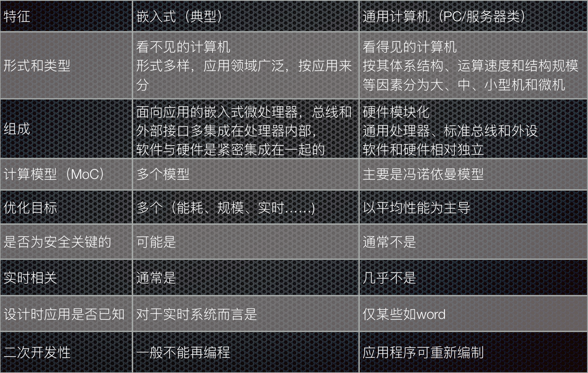
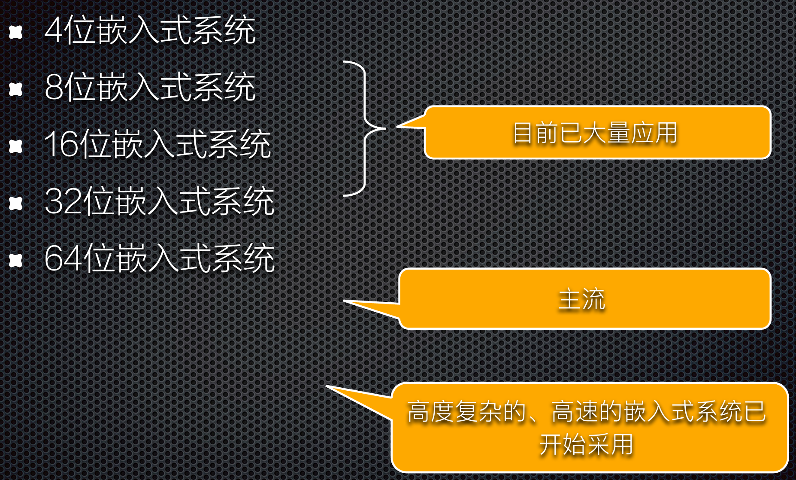
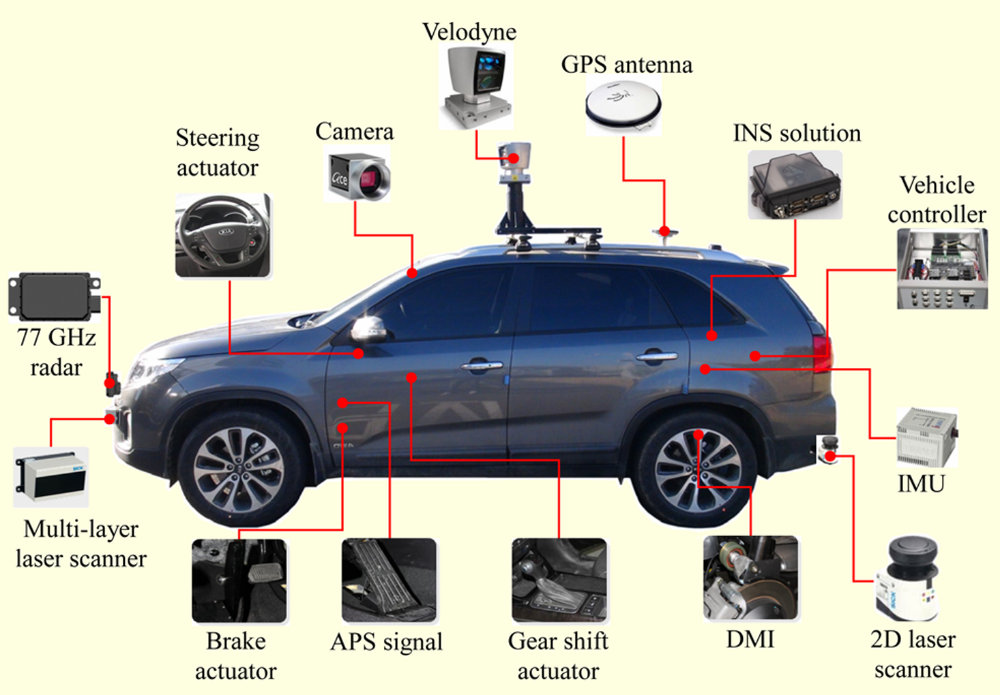
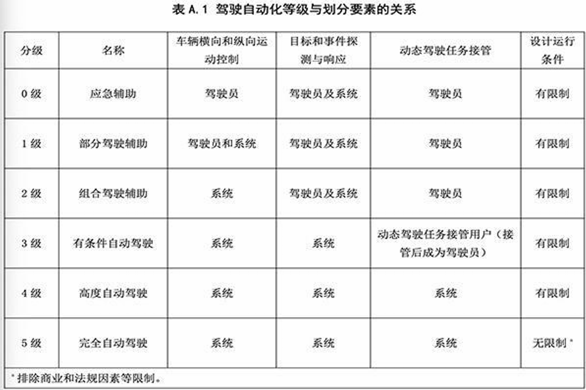
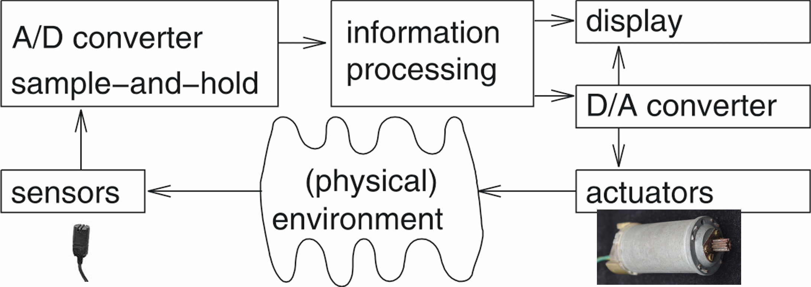

# 1. 嵌入式系统概述

## 1.1 嵌入式系统定义

### 1.1.1 通用定义

 “嵌入式系统”实际上是“嵌入式计算机系统”的简称。

- IEEE（国际电气和电子工程师协会）的定义： 
  - 嵌入式系统是“用于控制、监视或者辅助操作机器和设备的装置”（Devices used to control, monitor, or  assist the operation of equipment, machinery or plants）。

- 国内普遍被认同的定义：
  - 嵌入式系统是“以应用为中心，以计算机技术为基础，软硬件可裁减，适用于应用系统对功能、可靠性、 成本、体积、功耗有严格要求的专用计算机系统”。

嵌入式系统三要素：

- 嵌入、专用、计算机
- 嵌入性: 嵌入到对象体系中,有对象环境要求
- 专用性: 软、硬件按对象要求设计、裁减
- 计算机: 实现对象的智能化功能

> 其他定义：
>
> - 嵌入封闭产品中的信息处理系统
>
> - 看不见的计算机，⼀般不能被用户编程, 它有⼀些专用的I/ O设备, 对⽤户的接口是应用专用的。
>
> - An embedded system is a computer system contained within some larger device or product with the intent purpose ofproviding monitoring and control services to that device.
> - “Any sort of device which includes a programmable computer but itself is not intended to be a general-purpose computer."
> - 包含有计算机，但又不是通用计算机的计算机应用系统。

### 1.1.2 CPS

**信息物理系统**，Cyber-Physical System (CPS) ，是计算进程与物理进程的集成

- 更多地强调嵌入式系统与物理学的深度结合
- CPS=ES+Physics 

### 1.1.3 无线感知网络

Wireless sensor network（WSN），是由许多在空间中分布的自动装置组成的一种无线通信计算机网络，这些装置使用传感器协作地监控不同位置的物理或环境状况（比如温度、声音、振动、压力、运动或污染物） 

### 1.1.4 物联网

物联网，Internet of Things (IoT) ，通过射频识别(RFID)、红外感应器、全球定位系统、激光扫描器等信息传感设备，按约定 的协议，把任何物品与互联网相连接，进行信息交换和通信，以 实现智能化识别、定位、跟踪、监控和管理的一种网络概念。

万物相连的互联网，是互联网基础上的延伸和扩展的网络，将各种信息传感设备与网络结合起来而形成的一个巨大网络，实现任 何时间、任何地点，人、机、物的互联互通 

### 1.1.5 嵌入式系统的组成

嵌入式系统一般由**嵌入式硬件和软件**组成

硬件以微处理器为核心集成存储器和系统专用设备

软件包括初始化代码及驱动、 嵌入式操作系统和应程序等，这些软件有机地结合在一起，形成系统特定的一体化软件

### 1.1.6 通用计算机和嵌入式系统的区别

## 1.2 特征、分类、发展趋势

### 1.2.1 嵌入式系统的共性特征

- 通常是形式多样、面向特定应用的  
- 高度制约的环境  
- 与外部环境的交互，包含传感器和执行器  
- 实时性的要求  
- 安全性和可靠性  
- 关注成本  
- 并发性

#### 1.2.1.1 形式多样、面向特定应用

一般用于特定的任务，其硬件和软件都必须高效率地设计，可剪裁

采用多种类型的处理器和处理器体系结构

通常都具有低功耗、体积小、集成度高等特点，能够把通用微处理器中许多由板卡完成的任务集成在芯片内部

#### 1.2.1.2 高度制约的环境

嵌入式系统通常工作在**资源高度受限**的环境中，这也使得系统设计极具挑战性

大多数的嵌入式系统受到处理器速度、存储器容量和用户接口的限制

很多运行于不可控的恶劣环境中，需要克服高温、潮湿、振动、冲击，甚至腐蚀 

综上，嵌入式系统必须在满足计算环境和完成任务的前提下优化尺寸、重量、可靠性、性能、成本和能耗等方面的设计

#### 1.2.1.3 与外部环境的交互

与外部环境的交互在很大程度上是**无人干预**的

需要传感器来接收来自外部环境的数据，通过执行器输出数据到外部环境并控制外部环境

执行器则提供实时计算机系统能够控制外部设备或机械装置的方法

#### 1.2.1.4 实时性要求

一方面大多数实时系统都是嵌入式系统

另一方面嵌入式系统多数有实时性的要求，具有时间约束条件，必须在给定的时间范围内处理完事件

实时嵌入式系统通常包括**实时控制**

#### 1.2.1.5 安全性和可靠性的要求

某些实时嵌入式系统是安全至上且必须是具有高度的可靠性

安全性的含义是“远离事故和损失”，关注于没有故障以及在单点故障情况下的安全

可靠性指一个系统或者部件在给定时间和给定条件下实现要求功能的能力

- 嵌入式系统一般要求具有出错处理和自动复位功能，特别是对于一些在极端环境下运行的嵌入式系统而言，其可靠性设计尤其重要 
- 在大多数嵌入式系统的软件中一般都包括一些机制，比如硬件的看门狗定时器，软件的内存保护和重启动机制

#### 1.2.1.6 关注成本

嵌入式系统通常需要注意的成本是系统成本，特别是量大的消费类数字化产品，其成本是产品竞争的关键因素之一

嵌入式的系统成本包括：

- 一次性的开发成本NRE(Non-Recurring Engineering)成本 
- 产品成本:硬件BOM、外壳包装和软件版税等
- 批量产品的总体成本=NRE成本+每个产品成本*产品总量
- 每个产品的最后成本=总体成本/产品总量=NRE成本/产品总量+每个产品成本

#### 1.2.1.7 并发性

并发性是指在一个系统中将多个计算同时执行并潜在地交互的特性 

实际问题域中存在的天然的并发性，如物理环境多个任务同时发生，因此并发任务设计是实时嵌入式系统设计的有效解决方案 

多处理器系统，例如多核系统，为嵌入式系统的计算能力和性能提供了显著的提升

### 1.2.2 嵌入式系统的分类

#### 1.2.2.1 按嵌入式处理器的位数来分类

#### 1.2.2.2 按应用来分类

#### 1.2.2.3 按速度分类

**强实时系统**, 其系统响应时间在毫秒或微秒级

**一般实时系统**, 其系统响应时间在几秒的数量级上，其实时性的要求比强实时系统要差一些

**弱实时系统**，其系统响应时间约为数十秒或更长。这种系统的响应时间可能随系统负载的轻重而变化

#### 1.2.2.4 按确定性来分类

根据确定性的强弱，可将嵌入式系统分为**硬实时**、**软实时**系统 

- 硬实时：系统对系统响应时间有严格的要求，如果系统响应时间不能满足，就要引起系统崩溃或致命的错误
- 软实时：系统对系统响应时间有要求，但是如果系统响应时间不能满足，不会导致系统出现致命的错误或崩溃

#### 1.2.2.5 按嵌入式系统软件复杂程度来分类

- 循环轮询系统  
- 有限状态机系统  
- 前后台系统  
- 单处理器多任务系统  
- 多处理器多任务系统

### 1.2.3 发展趋势

**嵌入式人工智能**

- 广义上，指嵌入式设备上实现的具有自主分析和决策的能力  
- 狭义上，是在嵌入式设备上面实现的，等同于通用计算机上实现的人工智能

- **端智能**

安全、互连、计算需求、灵活性需求

集成度、重用、云计算、边缘计算

## 1.3 嵌入式系统应用

### 1.3.1 汽车电子应用领域

显然是CPS，通过嵌入式计算提供的功能，如ABS（防抱死系统）、ESP（电子稳定控制）等等

**汽车驾驶自动化分级**

### 1.3.2 其他领域

- 航电设备
- VR/AR
- 可穿戴设备
- BMI
- 无人机
- 仿生机器人
- 具身智能
- 智能家居
- …

# 2. 嵌入式微处理器

