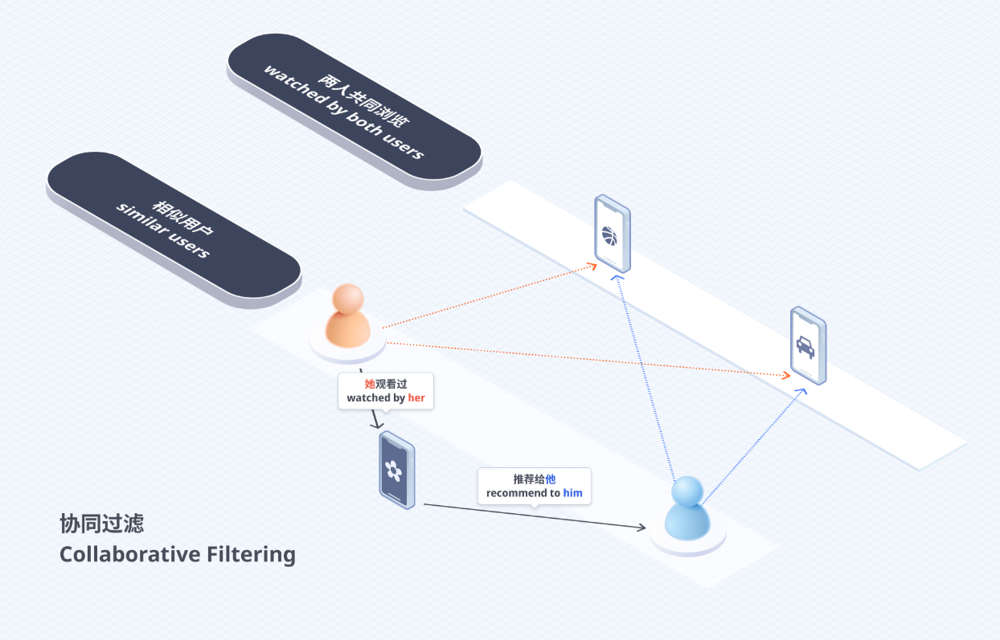
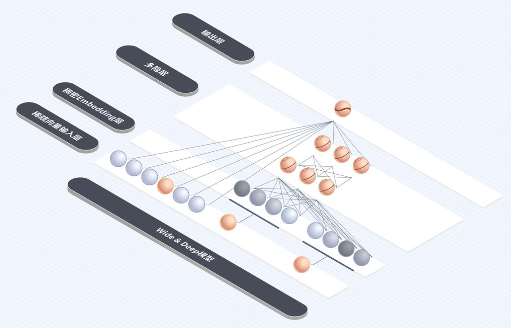
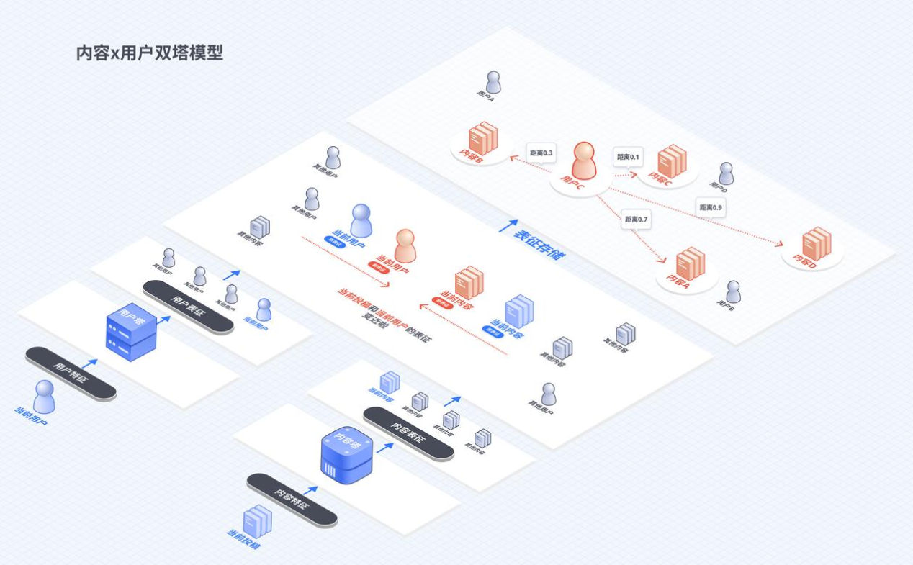
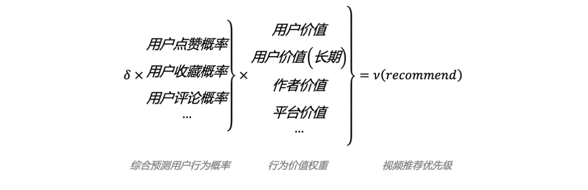
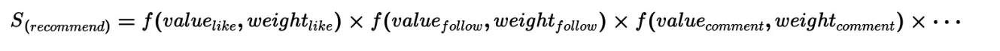
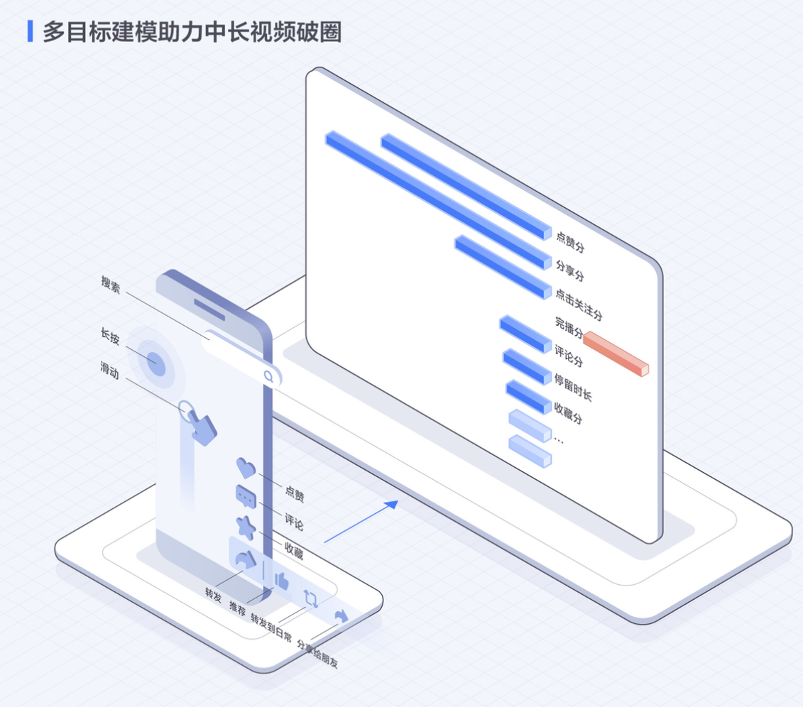

# 抖音推荐算法报告

## 1. 概述

推荐算法是一类基于数据驱动的信息过滤与分发技术，其核心目标是在海量内容中为用户筛选出“更可能感兴趣的信息”。随着互联网进入内容爆发阶段，信息供给远超用户处理能力，传统依赖人工编辑或简单排序的信息分发方式逐渐失效，推荐系统成为解决“信息过载”问题的关键基础设施。

从发展路径来看，推荐技术经历了多个阶段的演进。早期系统主要依赖**规则与人工干预**，例如按时间排序或人工精选内容；随后进入**协同过滤阶段**，通过用户之间的行为相似性进行推荐；近年来，随着计算能力与数据规模提升，推荐系统逐步转向以深度学习为核心的**数据驱动建模阶段**。在这一阶段，系统能够自动学习用户兴趣与内容特征之间的复杂关系，实现更高精度的个性化推荐。

在实际应用中，推荐系统已经成为短视频、新闻、电商等平台的核心技术组件。其基本思想是通过持续收集用户行为数据（如点击、观看、点赞等），对用户兴趣进行建模，并据此预测用户对不同内容的偏好，从而实现“千人千面”的内容分发效果。正如相关资料所述，推荐系统的目标是“提升信息分发效率，使内容能够更高效地匹配到潜在感兴趣的用户”。

在短视频场景中，推荐算法的重要性尤为突出。由于内容数量巨大且更新速度极快，平台无法依赖人工进行筛选，而必须依靠算法进行自动分发。抖音作为典型代表，其推荐机制本质上是一个**大规模机器学习系统**，通过对用户行为数据的建模，实现内容与用户之间的精准匹配。系统并非简单地“理解内容”，而是基于历史行为数据，对用户可能产生的行为进行概率预测，从而决定内容的推荐优先级。

从系统结构上看，现代推荐系统通常采用分阶段架构，包括**召回、排序、重排等多个环节**。首先通过召回机制从海量内容中筛选出候选集，然后通过排序模型对候选内容进行精细评分，最终输出推荐结果。这种多阶段结构能够在计算效率与推荐效果之间取得平衡，是当前工业界主流方案。

此外，随着平台规模扩大与社会影响增强，推荐算法也从“单纯追求点击率”逐步转向“多目标优化”。除了用户兴趣匹配外，系统还需要综合考虑内容质量、用户体验以及平台生态等因素。这标志着推荐系统从单一技术工具，逐渐发展为兼顾效率与治理的复杂系统。

## 2. 抖音算法推荐模型

在现代推荐系统中，通常采用“**召回 + 排序**”的分层架构，以在计算效率与推荐精度之间取得平衡。抖音推荐系统正是基于这一典型结构展开，其中召回阶段主要依赖**双塔模型（Two-Tower Model）**，排序阶段则采用**Wide & Deep 模型**进行精细化打分。

这一结构可以理解为：先“从海量内容中快速找到可能相关的内容”，再“对这些内容进行精确排序”，最终输出推荐结果。

### 2.1 Wide & Deep 模型（排序阶段）

Wide＆Deep模型的主要思路正如其名，是由单层的 Wide部分和多层的 Deep部分组成的混合模型。其中，Wide部分的主要作用是让模型具有较强的“记忆能力”（memorization），“记忆能力”可以被理解为模型直接学习并利用历史数据中物品或者特征的“共现频率”的能力；Deep部分的主要作用是让模型具有“泛化能力”（generalization），“泛化能力”可以被理解为模型传递特征的相关性，以及发掘稀疏甚至从未出现过的稀有特征与最终标签相关性的能力。

其具体模型结构如下图：Wide＆Deep模型把单输入层的Wide部分与由Embedding层和多隐层组成的Deep部分连接起来，一起输入最终的输出层。Deep部分进行深层的特征交叉，挖掘藏在特征背后的数据模式；而单层的Wide部分善于处理大量稀疏的特征，使得数据稀少的用户或者物品也能获得有数据支撑的推荐得分，从而提高泛化能力。

Wide＆Deep模型的这一结构特征，可以解决前文提到的协同过滤算法的短板。协同过滤算法优点突出，但是其局限性也很明显，就是泛化能力差，推荐的结果头部效应比较明显。也就是容易造成信息单一问题。

### 2.2 双塔召回模型

召回环节需要用到召回模型，抖音最常用的召回模型是“双塔召回模型”（Two-Tower Retrieval Model）。双塔召回模型把用户和内容都转化为数学空间里的一个个点，就像是给用户和内容贴上了独特的“数字标签”，这个过程叫做向量化表征学习。其大概过程如下：

（1）分别将用户特征、内容特征进行数学转化（如展示小猫的视频为0，展示小狗的视频为1，短视频为0，长视频为1，那么一个展示小猫的长视频即（0，1），其实际长度取决于特征有多少维度，用户特征同理）；

（2）将转化后的数学特征输入到用户塔、内容塔两个深度学习模型中，经过训练，各自形成一组新的数字集合，这叫做用户表征和内容表征。在这一步，原本各自代表一个现实特征的数字不再具备任何实际语义，两个模型会把用户特征和内容特征都转化为没有现实意义的数字代码——因此，算法不用理解现实语义，只需处理纯粹的数学符号；

（3）将两组形式为纯粹的数字集合的用户表征和内容表征，放入同一个向量空间中，每一组数字集合便在向量空间中拥有了一组专属的向量值，好比一组独有的“数字指纹”；

（4）将训练过的所有内容表征的向量值和当前用户表征的向量值的距离进行对比，距离越接近代表用户越喜欢。当你的“数字指纹”和某个视频的“数字指纹”在坐标系里刚好比较“匹配”（距离近），算法就会推荐它。

## 3. 用户行为背后的算法推荐逻辑

### 3.1 以用户行为为核心的推荐逻辑

抖音推荐系统的核心机制，并不是对视频内容本身进行语义理解，而是围绕用户行为展开建模与预测。换言之，算法关注的重点不在于内容“是什么”，而在于用户“是否会对该内容产生某种行为”。这一机制决定了推荐系统的本质：它是一个基于历史数据，对未来行为进行概率估计的过程。

在实际运行中，平台会持续记录用户在使用过程中的多种行为，包括观看时长、是否完整播放、点赞、评论、分享、收藏，以及快速划过或标记“不感兴趣”等。这些行为被统一转化为模型可处理的数据特征，并用于刻画用户兴趣。系统不会依赖单一行为进行判断，而是通过对多种行为的综合分析，对每一个候选视频进行评估，并计算其引发用户行为的可能性。正如相关说明中所强调的，推荐算法“会给候选视频打分，并把得分最高的内容推送给用户”，其本质是对不同内容引发用户反应概率的排序。

### 3.2 行为信号的层级与权重差异

在推荐系统中，不同类型的用户行为具有不同的信息价值，因此在模型中会被赋予不同权重。从整体上看，用户行为可以按照其“投入成本”和“兴趣强度”形成隐含的层级结构。

例如，**浏览和短暂**停留属于成本较低的行为，这类信号能够反映一定的兴趣倾向，但稳定性较弱；相比之下，**点赞、评论和转发**则意味着用户已经产生了更明确的兴趣表达；而**完播、收藏、关注**乃至**多次观看**等行为，通常被视为更强的正向信号，反映出用户对内容的高度认可甚至长期价值认同。资料中提到，“收藏与复访行为”往往代表用户对内容具有持续兴趣，而“用户留言并得到作者回复”等互动行为，则进一步体现出更深层次的参与程度。

因此，在模型训练与排序过程中，这些行为不会被等同看待，而是通过不同权重进行区分，从而使系统能够更加准确地识别用户真实兴趣。通过这种方式，推荐系统不仅能够判断用户“是否喜欢”，还能够在一定程度上区分“喜欢的程度”。

### 3.3 推荐系统的动态流程

从整体流程来看，抖音推荐系统是一个持续运转的动态过程，其运行依赖于“内容分发—用户反馈—模型更新”的循环机制。当一条新视频进入系统后，平台首先会对其进行基础处理，例如提取内容标签、分析视频特征等，以建立初步的内容表示。在此基础上，新内容通常不会被直接大规模推荐，而是进入一个小流量池进行测试，通过少量用户的反馈来评估其表现。

在这一测试阶段，系统会重点关注视频的初始表现，例如用户是否完整观看、是否产生互动等。如果相关指标表现较好，系统会逐步扩大推荐范围，使内容进入更大的流量池；反之，则减少其曝光。这种逐级放量的机制，使得平台能够在保证效率的同时，对内容质量进行筛选。

当用户打开应用时，推荐流程进一步展开。系统会先从海量内容中筛选出一批候选视频，然后结合用户历史行为与当前兴趣状态，对这些内容逐一进行评估，并预测用户可能产生的行为概率。在此基础上，系统生成综合得分，并按照得分高低排序，最终将最有可能引发用户行为的内容呈现出来。

这一过程并不是静态的，而是随着用户行为实时变化。例如，当用户连续观看某一类型视频时，系统会迅速捕捉到这一趋势，并提高类似内容的推荐比例；而当用户频繁跳过某类内容时，该类内容的曝光则会相应降低。这种实时调整机制，使推荐结果能够持续贴近用户兴趣的变化。

### 3.4 反馈闭环与持续优化

更进一步来看，抖音推荐系统并不是一次性决策过程，而是一个不断循环的反馈系统。用户在观看内容过程中产生的每一次行为，都会被系统记录下来，并作为新的训练数据输入模型，从而影响后续推荐结果。随着数据的不断积累，模型参数持续更新，预测能力也随之提升。

这一过程可以理解为一个典型的“反馈闭环”：系统先根据已有数据进行推荐，用户行为再反过来影响系统判断，从而形成持续优化的过程。在这种机制下，推荐结果并非固定不变，而是随着用户行为不断演化，呈现出高度动态化的特征。

总体而言，抖音推荐算法通过对用户行为的持续建模与反馈学习，构建了一个以数据驱动的动态推荐体系。从行为采集、信号建模到实时排序与模型迭代，各个环节相互联动，使得系统能够在不断变化的用户兴趣中保持较高的匹配效率。这种以行为为核心的推荐逻辑，是当前大规模推荐系统得以高效运行的关键基础。

## 4. 抖音算法的多目标平衡机制

### 4.1 从单一目标到多目标优化

在推荐系统的早期阶段，算法通常围绕单一目标进行优化，例如点击率或播放量。这种方式在一定时期内能够有效提升用户活跃度，但随着平台规模扩大，其局限性逐渐显现。单一指标往往只能反映用户行为的某一侧面，容易导致推荐结果趋于片面，例如过度追求点击而忽视内容质量，或强调短期行为而忽略长期价值。

因此，抖音推荐系统逐步从“单目标优化”转向“多目标优化”。正如相关资料所指出的，“单一目标已难以满足实际需求，多目标推荐系统成为主流”。在这一框架下，推荐算法不再只关注某一个行为指标，而是综合多个目标，对内容进行更加全面的评估，从而在不同维度之间取得平衡。

基于多目标建模，抖音对所有准备推荐给用户的视频进行打分，其公式可以简化为：

### 4.2 多目标建模与指标体系

在多目标推荐框架中，系统会同时建模多种用户行为，并将其纳入统一的决策体系。这些目标不仅包括传统的点击与播放行为，还涵盖了能够反映用户长期兴趣和深度参与的指标。

例如，除了基础的观看与点赞行为外，系统还会关注收藏、复访、关注等行为，因为这些行为通常代表用户对内容具有更长期的兴趣。资料中提到，“收藏+复访”可以被视为用户对内容价值的更强认可。此外，一些互动行为也被纳入重要指标，例如用户评论并获得作者回复，这类行为不仅反映用户兴趣，也体现出内容在社区互动中的价值。

通过引入这些不同类型的目标，推荐系统能够从多个维度刻画用户兴趣，使得推荐结果不再局限于短期行为，而是兼顾用户的持续体验与内容价值。这种多目标建模，本质上是将用户行为的不同侧面转化为统一的优化问题，从而实现更全面的决策。

### 4.3 多样性与探索机制

除了行为指标之间的平衡外，多目标推荐系统还需要解决内容分发中的“同质化问题”。如果系统始终推荐与用户历史兴趣高度一致的内容，虽然短期内可能提升用户停留时间，但长期来看，用户可能会产生疲劳，甚至陷入“信息茧房”。

因此，抖音在推荐机制中引入了多样性目标。相关资料中提到，即使持续推荐用户喜欢的内容，“用户也可能会看腻”，因此系统需要适当打破单一兴趣结构，引入不同类型的内容。这一过程通常通过“探索机制”实现，即在推荐结果中加入一定比例的非典型内容，以测试用户潜在兴趣。

这种机制在推荐系统中通常被理解为“探索与利用”的平衡：一方面利用已有数据推荐用户可能喜欢的内容，另一方面通过探索新内容拓展用户兴趣边界。通过这种方式，系统不仅能够维持推荐的新鲜感，也有助于提升内容生态的多样性。

### 4.4 内容质量与平台生态的综合考量

在多目标框架下，推荐系统的优化目标不仅限于用户行为，还会进一步扩展到内容质量与平台生态层面。例如，系统会关注内容的原创性、信息价值以及整体社区氛围，从而避免低质量或重复内容的过度传播。

以往用户留言和作者回复留言会被视为两个独立的行为，但抖音的“握手模型”会将“用户留言并得到作者回复”视为一次对作者更为积极的互动信号，从而带给作者的积极体验，正反馈促进更多优质内容是生产。此外，抖音非常注重扶持深度优质的中长视频，一些中长视频内容能够获得较高的推荐。为了支持优质中长视频，抖音充分利用了多目标建模的能力。以一个视频为例：2024年，知识博主“米三汉”的一条《450分钟深度解读红楼梦》的视频获得了超过3亿播放量。尽管在完播目标上占劣势，但这条视频在分享和关注目标上占优势，在评论、时长、收藏上也有不错的表现，算法依靠分享和关注等目标为该作品找到了大量受众。

从更宏观的角度看，多目标推荐系统实际上承担了平台治理的一部分功能，通过对不同目标的平衡，实现内容分发效率与生态健康之间的协调。

## 5. 总结

综上所述，抖音推荐算法可以被理解为一个以数据驱动为核心、以用户行为为基础、并通过多阶段模型协同运作的复杂系统。从整体结构上看，其建立在现代推荐系统的发展脉络之上，通过“召回—排序”的分层架构，实现了在海量内容中的高效筛选与精准分发。在这一过程中，双塔模型与Wide & Deep模型分别承担了不同层级的任务：前者解决“从哪里找内容”的问题，通过向量化匹配在大规模数据中快速定位候选内容；后者则聚焦“推荐什么更合适”，通过对用户行为概率的精细预测，对候选内容进行排序与筛选。

进一步来看，抖音推荐机制的核心逻辑始终围绕用户行为展开。系统并不直接理解内容或用户意图，而是通过对观看、点赞、评论、收藏等多种行为信号的建模，对用户可能产生的反应进行概率预测，并据此完成推荐决策。在这一过程中，不同行为根据其反映的兴趣强度被赋予不同权重，而推荐结果则是在多种行为信号综合作用下的最优排序。同时，系统通过持续记录用户反馈，构建起“推荐—行为—再推荐”的动态闭环，使模型能够不断自我更新与优化，从而逐步逼近用户真实兴趣。

在此基础上，抖音推荐算法进一步从单一目标优化发展为多目标平衡机制。系统不仅关注点击或播放等短期指标，还将收藏、复访、互动等能够反映长期价值的行为纳入统一框架，并在此之上引入多样性与探索机制，以避免内容同质化与用户审美疲劳。同时，推荐系统也逐渐承担起一定的生态调节功能，通过对内容质量与社区氛围的综合考量，在效率与健康之间寻求平衡。

总体而言，抖音推荐算法并非单一模型或简单规则，而是由多种模型、信号与目标共同构成的综合系统。它以大规模数据与机器学习为基础，通过对用户行为的持续学习与多目标优化，实现了个性化推荐与平台生态之间的动态协调。这种机制不仅体现了当前推荐系统技术的发展水平，也反映出算法在实际应用中从“效率导向”向“综合治理导向”演进的趋势。

## 参考链接

[抖音安全与信任中心](https://95152.douyin.com/transparency)

[(19 封私信 / 26 条消息) 抖音公开了他们的推荐算法原理，强烈推荐一读 - 知乎](https://zhuanlan.zhihu.com/p/1897253324316718440)
