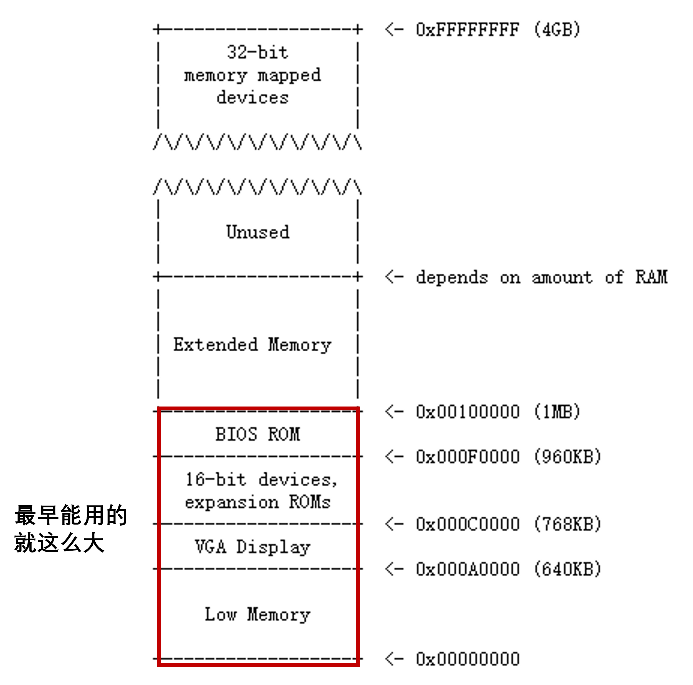
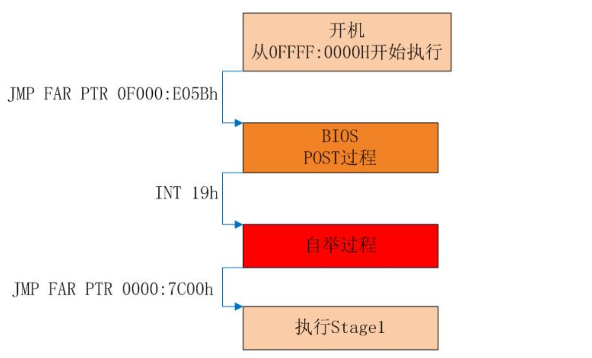
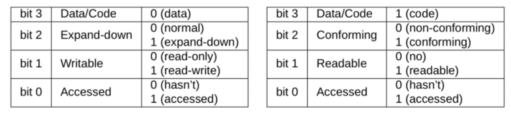

# 0. BIOS OS-start

我们的实验在**QEMU**上模拟操作系统。QEMU是纯软件实现的虚拟化模拟器，几乎可以模拟任何硬件设备。我们最熟悉的就是能够模拟一台能够独立运行操作系统的虚拟机。虚拟机认为自己和硬件打交道，但其实是和 Qemu 模拟出来的硬件打交道，Qemu 将这些指令转译给真正的硬件。**简而言之，就是QEMU帮我们模拟了一个虚拟的计算机硬件，而我们要实现的操作系统就在QEMU模拟的硬件上运行。**

## 0-1 计算机的物理地址空间



第一代PC基于16位`Intel 808`处理器，只能寻址1MB的物理内存。所以早期PC的物理地址空间将从`0x00000000`开始，到`0x000FFFFF`结束，而不是`0xFFFFFFFF`（32位）。标记为`Low Memory`的`640KB`空间是早期PC能够使用的唯一随机访问内存（RAM）。

从`0x000A0000`到`0x000FFFFF`的384KB区域（也就是640KB到1MB之间的区域）由**硬件预留**，用于特殊用途，如视频显示缓冲区（显存）和一些系统固件。这个保留区域中最重要的部分是**Basic Input/Output System (BIOS)**（硬件厂商在硬件上自带的一段启动的代码），它占用了从`0x000F0000`到`0x000FFFFF`的64KB区域。

在早期的PC中，BIOS保存在真正的只读存储器（ROM）中，但现在的PC将BIOS存储在可更新的闪存中。 **BIOS主要负责对系统进行基本的初始化操作，如激活显卡、检查内存安装量等。** 执行这个初始化之后，**BIOS从一些适当的位置（比如硬盘）加载操作系统，并将机器的控制权传递给操作系统。**

随着技术的发展，Intel最终使用`80286`和`80386`处理器突破了1MB的寻址，它们分别支持16MB和4GB的物理地址空间，但PC架构师仍然保留了原始的1MB物理地址空间布局，以确保与现有软件的向后兼容性。因此，现代pc在物理内存中有一个从`0x000A0000`到`0x00100000`的一个洞，将RAM划分为 “`low memory`” 或 “`conventional memory`” （前640KB）和 “`extended memory`” （其他的部分）。

无论技术如何发展，**BIOS**的设置被保留了下来。 *（当然2010年之后的计算机大部分升级成了[UEFI](https://learn.microsoft.com/zh-cn/windows-hardware/drivers/bringup/boot-and-uefi)启动，UEFI可以看作BIOS的优化升级版。我们的实验还是会从BIOS入手，这足够我们了解计算机启动的过程了，而且现在考研还是考BIOS的知识点。如果你对UEFI和BIOS的区别感兴趣，可以参考这篇[知乎专栏](https://zhuanlan.zhihu.com/p/436122944)。）* 当计算机的开机键被按下，一切都是从运行**BIOS**开始的。

## 0-2 计算机的启动过程

所以说，不管是`i386`(采用`intel 80386`架构)还是之前的芯片，在加电后的第一条指令都是跳转到BIOS固件进行开机自检，然后将磁盘的**主引导扇区**中的内容加载到内存`0x7c00`的位置，然后跳转到这里。

### 0-2-1 主引导扇区

主引导扇区，`Master Boot Record`，简称`MBR`，是磁盘里的第0个扇区。MBR占一个扇区，共512字节。

**MBR**里面的内容一般是一段可执行的指令，我们常常叫做**Bootloader**，大概翻译过来就叫启动加载器。从名字就可以看出，它的主要用途是把真正的操作系统加载到内存中，然后把控制权交给OS。

*（注意在后面的讲义中为了方便，在表述上不再区分MBR和bootloader）*

MBR的最后两字节是魔数0x55和0xaa，作用是告诉BIOS：这里是MBR，你找对了。把我加载上去就可以启动操作系统了。

有了这个魔数，BIOS就可以很容易找到可启动设备了：BIOS依次将设备的首扇区加载到内存**0x7c00**的位置，然后检查末尾两个字节是否为 `0x55`和`0xaa`如果成功找到了魔数，BIOS将会跳到 `0x7c00 `的内存位置，执行刚刚加载的启动代码，这时BIOS已经完成了它的使命， 剩下的启动任务就交给 MBR了；如果没有检查到魔数，BIOS将会尝试下一个设备；如果所有的设备都不是可启动的， BIOS就会抱怨：找不到启动设备。

有关于这一点，可以用 `sudo head -c 512 /dev/sda | hd` 看一看自己Linux的MBR长什么样。 *（不过我在WSL跑这个没用，虚拟机可以跑，原因在于虚拟机开机硬件的工作是由主机通过软件模拟的）* 至于为什么是`0x7c00`这个地址，可以参考这个[地址](https://www.glamenv-septzen.net/en/view/6)。

### 0-2-2 QEMU小实验

我们准备了一个简单的MBR，可以用下面这两条指令下载并解压：

```plaintext
$ wget  wget https://git.nju.edu.cn/nju-se-oslab/oslab2025autumn/-/wikis/assets/mbr.zip
$ unzip mbr.zip -d mbr
```

*注意：这个小实验和框架代码是完全无关的，建议把它放在和框架代码不同的文件夹。*

解压并进入文件夹之后，首先用`make`指令把它编译出来，然后`make qemu`用QEMU打开它，可以看到在终端打印出了`Hello, World!`

但是我们要研究的是QEMU里的启动过程，所以我们先按`Ctrl+C`把之前那个关掉，然后用`make qemu-gdb`打开。

看Makefile可以发现相比之前加了`-S`和`-s`两个参数，前者是要求QEMU在启动时停住便于我们调试，后者是开了个端口让GDB可以连接，可以通过`man qemu-system-i386`来看QEMU手册来了解这些内容。

接下来是再打开一个终端（别把之前的那个关了），用`make gdb`打开GDB并连接到QEMU，可以看到`[f000:fff0]    0xffff0: ljmp   $0xf000,$0xe05b`，这就是QEMU开机的第一条指令，最前面的`f000`是现在`CS`段寄存器的值，`fff0`就是`IP`寄存器的值。但是，`IP`应该是`EIP`的低16位，而`0xf000`似乎这个CS地址太大了...

### 0-2-3 实模式

在QEMU中，`i386`为了保持向后兼容性，一开机并不是我们熟悉的`保护模式`，而是`实模式`。

实模式简单来说就是一个16位的CPU，和保护模式相比，最主要有三点区别：

- 一是**寄存器**不一样，实模式里只会用我们熟悉的寄存器的低16位，所以名字就少了前缀“E”，具体地有：
  - 通用寄存器（16 位）：AX，BX，CX，DX，SP，BP，DI，SI
  - 段寄存器（16 位）：CS，DS，SS，ES
  - 状态和控制寄存器（16 位）： FLAGS，IP
- 二是**寻址方式**不一样，在实模式里，虽然有段寄存器，但没有保护模式里的段表，更没有页表，物理地址就是 **(段寄存器<<4) + 偏移地址** 。段寄存器16位，偏移地址也是16位，所以寻址空间就是2^20=1MiB。
- 三是**中断处理**不一样，不过我们现在也不关心这个东西，有兴趣的话可以去搜索一下实模式的中断向量表，现在只需要大概知道中断都是由BIOS代办的就行了。

### 0-2-4 BIOS的执行过程

有了实模式的知识，这里第一条指令的物理地址就是`(CS<<4) + IP = 0xffff0`，正好是BIOS ROM里的最后。

所以这里就是一条`ljmp`语句，设置`CS:IP`为`0xf000:0xe05b`，跳到了地址稍微低了一点的地方。

然后就进入BIOS的初始化过程，可以用si看看有什么指令。概括来说是包括下面这些内容：

- 首先，设置了`ss`和`esp`寄存器；
- 然后通过`cli`指令屏蔽了中断；
- `cld`和后面的`in`和`out`指令相关（暂时不用管）；
- 然后通过`in`，`out`指令和`IO`设备交互，进行初始化，打开`A20`门（暂时不用管）；
- 然后用`lidtw`与`lgdtw`加载`IDTR`与`GDTR`（跟保护模式有关）；
- 最后开启保护模式，长跳转到`BIOS`的主要模块进行执行。

而BIOS的全过程概括来说就是下面这张图。



POST（自检）过程简单来说就是上面的初始化和检查各种外设。

自举过程就是上面提到过的，把MBR的内容从磁盘调入内存地址为0x7c00的地方，然后检查魔数。

在自举的最后，**关闭保护模式，回到实模式**，跳转到Stage1执行，而Stage1就是我们前面说的MBR（即bootloader）。

不过图上“开机”的CS:IP，好像和刚刚QEMU看到的不一样，这是因为i386只规定了开机时第一条指令的物理地址，而对应同一个物理地址，CS:IP会有多组值，而具体采用哪一组呢是厂商的自由；同样地，对于最后的0x7c00也是只规定了物理地址。

不过说到底其实BIOS干的这些琐碎的事情一点都不重要，拿GDB用`b *0x7c00`在地址`0x7c00`处打个断点，再按个`c`让它跑起来，然后它就跑到我们的那个MBR来了。

按几下`si`，可以发现确实执行的是`mbr.S`里的指令。到这里，BIOS的任务就结束了，控制权交到了我们的MBR的手上，可以说“开机”完成了它的第一阶段。

## 0-3 MBR的编译过程

刚刚我们的mbr.S是怎么变成可以被QEMU执行的MBR的呢？

说到底原理其实很简单，MBR本质就是一串可以被执行的指令再加上魔数。

所以只需要先编译成可执行文件，再把里面的指令抽出来，最后再加上魔数就可以了。

所以首先用`gcc`把`mbr.S`编译成`.o`的可重定位文件，然后再用`ld`链接成可执行的`ELF`文件，然后我们要从`ELF`里抽取指令，指令都在`.text`节里，可以用`objcopy`抽取然后以二进制文件的形式存在一个`bin`文件里。

最后我们用一个小脚本`genboot.pl`来给这个文件扩充成510字节再填充最后的魔数，就得到我们的MBR了。

### 0-3-1 有关gcc的一些Q&A

上面编一MBR时，为什么不用gcc而要用ld来链接呢？

这是因为用gcc的话会给我们链接一些它的库，而其中有些库是需要Linux操作系统作为运行环境，而我们这里的MBR是要运行在裸机环境上的。

那么ld指令的这些参数是什么意思呢？

`-m`是指定格式，这里指定成i386架构的ELF文件；

`-e`是指定入口函数，我们的MBR是从_start这个函数开始执行的；

`-Ttext`是告诉ld链接到哪个地址，重定位的时候会用。MBR会被加载到0x7c00，所以这里就是0x7c00

想更详细地了解的话，可以`man ld`看看手册，而平常`gcc`不用这么写是已经帮我们默认好了，像入口函数就是它的库里提供的，然后会从那里再跳转到我们写的`main`函数执行完再跳回去。（扯得有点远了）

还有一个问题是有关ELF里面的入口地址。入口地址是ELF文件里的属性，记录在ELF头里。但MBR最终是一段指令，不会包括这个属性。那我们是怎么让`_start`能在最开始执行呢？

确实这个属性对我们最后得到的MBR没什么用，不过链接成ELF需要这个属性，我们就这么假装填一下罢了。

实际上，我们需要的是`_start`这个函数在所有指令的最开头，这样这个函数就会作为MBR的开头，被复制到0x7c00的位置，而BIOS会跳到这里执行。

所以我们把`_start`这个函数写在`mbr.S`的最上面，这样它在所有MBR指令里就排在最前面，会被复制到0x7c00的位置，BIOS也就会跳到这里来执行。

如果你把`print`函数放在`_start`前面的话，那么MBR指令的开头、会被复制到0x7c00的就是`print`函数，而BIOS也就会从`print`而非`_start`开始执行，就得不到我们想要的结果了。毕竟MBR的本质就是一段会被复制到0x7c00并执行的指令，所以其实制作MBR没必要纠结于ELF，关键在于其中的指令。

除此之外，可以用其他的方法来制作MBR，比如说用NASM编译器，或者用ld配合sections.ld来直接制作MBR。

# 1. Load ELF

## 1-1 保护模式的寻址

上一节我们说过，开机首先是BIOS进行各种初始化，然后把磁盘第0扇区，也就是MBR加载到0x7c00然后跳到这里执行。

而MBR的任务是将操作系统从磁盘加载到内存。

不过在这之前，还记得在跳转MBR之前，BIOS在自举的最后，“关闭保护模式，回到实模式”吗？

我想大家比起实模式的16位汇编，应该更熟悉保护模式的32位指令吧(当然大家的电脑上都至少是64位的指令了)，并且实模式仅仅1MiB的寻址空间对于我们的OS还是过于局促了。

所以，在让MBR加载我们的kernel之前，首先要先进入保护模式。

具体如何从实模式进入到保护模式呢？具体来讲，就是先设置段表GDT，再把CR0寄存器的最低位设为1。

在保护模式下，寻址方式会产生变化。简单来说，程序给出的32位地址不再直接解释为物理地址，而是相对于某一个段的偏移量（offset）。真正的物理地址由下式给出：

```plaintext
physical address = linear address = base address + offset
```

其中的`base address`是一个32位的地址，对应某个段的基地址；而`offset`则是程序给出的32位段内偏移量。在这里我们引入了一个新概念叫线性地址（`linear address`），这个概念直到我们介绍分页机制的时候才会用到。在现阶段，线性地址就等于物理地址（`physical address`）。

不过实际上这个基地址很烦，所以我们直接规定让它为0，这就叫“扁平模式”，此时物理地址就等于`offset`，即虚拟地址。

当开启保护模式后，程序访在问内存时给出的就不简单是32位的物理地址了，而是由一个16位的段选择子（即段寄存器中的内容）加上32位的段内偏移量（有效地址）所构成的48位的逻辑地址（或称虚拟地址）。约定各段寄存器和offset之间的绑定关系如下：

| 偏移量（offset）类型     | 绑定的段寄存器 |
| ------------------------ | -------------- |
| 代码段（对应eip）        | CS             |
| 数据访问                 | DS             |
| 堆栈访问（对应esp和ebp） | SS             |
| 特殊类型访问（如movs）   | ES             |

一般情况下，CS指向的段是代码段，DS、ES、SS指向的是同一个数据段。

由于32位的段内偏移量是由程序直接给出，那唯一的问题就是如何通过16位的段选择符来获取32位的段基地址（base address）。在80386中，这一过程通过查表来实现。计算机与操作系统约定，若要开启保护模式，则操作系统需要事先在内存中准备好一个表，叫做“段表”，其中存储好每个段的首地址（base address）、段的长度（limit）等相关的信息。段表由一系列连续的段表项构成，其中每个段表项都是一个64位的数据结构称为段描述符，其结构如下：

```shell
DESCRIPTORS USED FOR APPLICATIONS CODE AND DATA SEGMENTS

  31                23                15                7               0
 +-----------------+-+-+-+-+---------+-+-----+-+-----+-+-----------------+
 |                 | | | |A|         | |     | |     | |                 |
 |   BASE 31..24   |G|X|O|V| LIMIT   |P| DPL |S| TYPE|A|  BASE 23..16    | 4
 |                 | | | |L| 19..16  | |     | |     | |                 |
 |-----------------+-+-+-+-+---------+-+-----+-+-----+-+-----------------|
 |                                   |                                   |
 |        SEGMENT BASE 15..0         |       SEGMENT LIMIT 15..0         | 0
 |                                   |                                   |
 +-----------------------------------+-----------------------------------+

           A      - ACCESSED
           AVL    - AVAILABLE FOR USE BY SYSTEMS PROGRAMMERS
           DPL    - DESCRIPTOR PRIVILEGE LEVEL
           G      - GRANULARITY
           P      - SEGMENT PRESENT
```


下面是段描述符每个部分的含义：（后面会给每个段怎么设置的公式的，这里简要了解一下即可）

- 每个段描述符为 8 个字节，共 64 位。

- 段基址为第 2，3，4，7 字节，共 32 位。我们模拟扁平模式，因此**段基址均为 0**。

- 段限长为第 0，1 字节及第 6 字节的低 4 位，共 20 位，表示该段的最大长度。我们模拟扁平模式，因此**段限长为全 1。**

- G 代表粒度，说明段限长的单位是什么（4KB或者1B）。当属性 G 为 0 时，20 位段限长为实际段的最大长度（最大为 1MB）；当属性 G 为 1 时，该 20 位段限长左移 12 位后加上 0xFFF 即为实际段的最大长度（最大为 4GB）。我们模拟扁平模式，因此**这一项设置为 1**。

- X 意为这一段使用操作数位数，为 1 时使用 32 位操作数，为 0 时使用 16 位操作数。**这一项设置为 1**。

- AVL：Available and Reserved Bit，**通常设为 0**。

- P：存在位，P 为 1 表示段在内存中。**这一项设置为 1**。

- DPL：描述符特权级，取值 0-3 共 4 级；0 特权级最高，3 特权级最低，表示访问该段时 CPU 所处于的最低特权级，后续实验会详细讨论。本次实验中的段都是在最高特权级上的，因此**这一项设为 0**。

- S：描述符类型标志，S 为 1 表示代码段或数据段，S 为 0 表示系统段(TSS，LDT)和门描述符。目前我们只需要代码段和数据段，因此**设置为 1。**

- TYPE：当 S 为 1，TYPE 表示的代码段，数据段的各种属性如下表所示（注意下面的TYPE包括了A位作为最低位）：

  其中bit3代表它是代码段还是数据段；bit2通常设置为0；bit1代表读写权限，通常设置为1；bit0在初始化段表时通常设置为0。

于是整个段表就是多个段表项构成的一个数组：

```shell
+----------------+
|    SEGMENT     |
|   DESCRIPTOR   |
+----------------+
|    SEGMENT     |
|   DESCRIPTOR   |
+----------------+
|                |
|                |
|                |
|       ...      |
|                |
|                |
+----------------+
|    SEGMENT     |
|   DESCRIPTOR   |
+----------------+
```

为进入保护模式，需要在内存中开辟一块空间存放GDT表；80386提供了一个**寄存器GDTR用来存放GDT的32位物理基地址以及表长界限**；在将GDT设定在内存的某个位置后，可以**通过 LGDT 指令将GDT的入口地址装入此寄存器。**

```shell
                   GDT REGISTER
+--------------------------------+---------------+
|            GDT BASE  	         |   GDT LIMIT   |
+--------------------------------+---------------+
 47                               15            0
```

由 GDTR 访问GDT是由**段选择子（理解成段选择子里包含数组下标）来完成的；为访问一个段，需将段选择子存储入段寄存器**，比如数据段选择子存储入 DS ，代码段选择子存储入 CS ；其数据结构如下：

```shell
 15                      3   1 0
+-------------------------+-+---+
|                         |T|   |
|          INDEX          | |RPL|
|                         |I|   |
+-------------------------+-+---+
TI - TABLE INDICATOR, 0 = GDT, 1 = LDT
RPL - REQUESTOR'S PRIVILEGE LEVEL
```

`TI`位表示该段选择子为全局段（查GDT）还是局部段（查LDT），实验中只会用到前者，`RPL`表示该段选择子的特权等级，13位`Index`表示描述符表中的编号（下标）。

结合虚拟地址、段选择符和段表的相关概念，在分段机制中，将虚拟地址转换成线性地址（此时即为物理地址）的过程可描述如下：

1. 根据段选择子中的`TI`位选择GDT或LDT（总是GDT）；
2. 根据段选择子中的`index`部分到GDT中找到对应位置上的段描述符；
3. 读取段描述符中的`base`部分，作为32位段基址（总是0），加上32位段内偏移量获取最终的物理地址。

------

了解了和保护模式相关的理论知识之后，接下来我们就写点代码来让我们的MBR进入保护模式吧。

------

> **Tips** 这一阶段的任务是让我们的MBR进入保护模式。

------

我们现在要写的是MBR，所以大家打开boot文件夹。

MBR开始初始化并进入保护模式的代码是用汇编写在`start.S`里，而加载操作系统的代码用C写，在`boot.c`里。

现在我们关心start.S里面的内容，打开可以看到里面主要做了如下几步：

- 关中断
- 设置数据段寄存器（实模式用）
- 开启A20地址线（好奇的话请自行搜搜看A20地址线是什么）
- 加载GDTR
- 把CR0的最低位设置成1，然后一句长跳转设置CS，正式进入保护模式
- 设置数据段寄存器（保护模式用）
- 设置栈指针 -跳转到`boot.c`里的`load_kernel`执行

拉到`start.S`的最下面，可以看到GDT没有被填完，我们的第一个任务就是补全GDT。

在代码中，GDT是段描述符组成的数组，它的本质就是一段连续摆放的段描述符，而段描述符的本质就是连续摆放的8个字节。

在汇编里，我们可以通过`.byte`、``.word`和`.long`直接插入机器码，分别是插入1、2、4个字节，注意i386是小端机器。

根据我们上面对段描述符的介绍，一个给内核使用的有效的段描述符各字节的结构如下：

- 第0-1字节是段限长的第0-15位
- 第2-3字节是段基址的第0-15位
- 第4字节是段基址的第16-23位
- 第5字节的高4位是`0x9`，低4位是`type`，其中代码段的`type`是`0xa`，数据段的`type`是`0x2`
- 第6字节的高4位是`0xc`，低4位是段限长的第16-19位
- 第7字节是段基址的第24-31位

所以按这样插入8个字节就能构造一个段描述符，几个连续的段描述符就构成了GDT。

GDT里的几个段描述符分别对应的是怎样的段呢？

按照规范，GDT里第0个段一般是空段，就是8个字节都是全0的段。

然后我们还需要一个代码段和一个数据段，我们约定第1个段是代码段，第2个段是数据段。

这也可以在我们在设置保护模式用段寄存器中体现出来——CS设为`0x8`，DS等设为`0x10`，而段寄存器的高13位就是GDT的下标。

而无论是代码段和数据段，我们都采用扁平模式——段基址为0，段限长为全1（即4GiB）。

------

> **代码任务 1**
>
> -  补全1boot/start.S1中的GDT

------

填好了GDT之后，我们回到上面的代码。在设置了GDTR之后，我们需要把CR0寄存器的最低位设置成1来开启保护模式。这里可以通过先把CR0 mov到EAX寄存器，设好了之后再mov回去来实现。

------

> **代码任务 2**
>
> -  完成 `boot/start.S` 中 `_start` 函数里的TODO：将CR0寄存器的最低位设成1

------

也许会有同学注意到，我们是在设置CR0之后才通过ljmp设置CS段寄存器的，也就是说在执行ljmp的时候虽然已经开启了保护模式，但CS还是之前实模式的旧值啊。那这条指令CPU是怎么取到的呢？

事实上CPU发现你通过设置CR0开启保护模式之后，会预读取下一条指令，然后执行完设置CR0这条指令后，不再取指令，而是执行预读取的指令，预读取的指令执行完后再取下一条指令执行。

完成了上面的代码任务之后，可以`make qemu`，如果打印出了`hello`，代表正确执行到了`boot.c`里的`load_kernel`函数里，说明你的实现应该就是对的。在继续下一步之前，请将`load_kernel`函数的前三行（即打印`hello`和死循环的代码）删去。