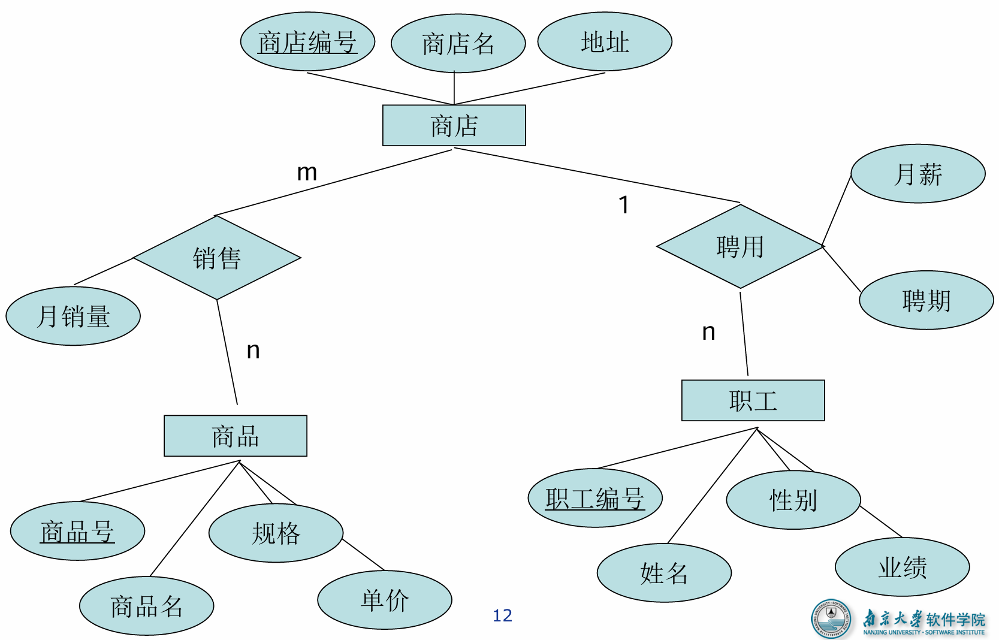
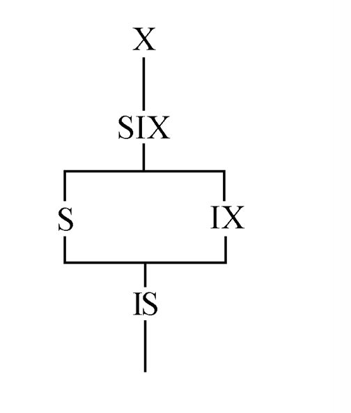

# 一、计算、数据与数据管理

## 基本概念

**计算** = 算法 + 数据

**数据结构** （ 数组，链表，堆，栈，树，图…… ）

**⭐数据管理：**

| 类型       | 管理者                     | 对象           | 共享程度           | 独立性                 | 结构化                   | 控制能力           |
| ---------- | -------------------------- | -------------- | ------------------ | ---------------------- | ------------------------ | ------------------ |
| 人工管理   | 用户（程序员），数据不保存 | 某一应用程序   | 无共享、冗余度极大 | 不独立，完全依赖程序   | 无结构                   | 应用程序自己控制   |
| 文件系统   | 文件系统，数据可长期保存   | 某一应用程序   | 共享性差、冗余度大 | 独立性差               | 记录内有结构，整体无结构 | 应用程序自己控制   |
| 数据库系统 | 数据库管理系统             | 现实世界，整体 | 共享性高、冗余度小 | 物理独立性和逻辑独立性 | 整体结构化               | 数据库管理系统控制 |

共享数据：

- 基于二进制在多个应用之间共享数据；
- 基于文本在多个应用之间共享数据（K/V, JSON, XML）

**数据**（Data）是数据库中存储的基本对象，==是描述事物的符号记录==。（数字、文字、音频…）

数据的含义称为数据的**语义**，**数据与其语义是不可分的**。

## 数据库

==数据库（Database，简称DB）是长期储存在计算机内、有组织的、可共享的大量数据的集合。数据库中的数据按照一定的数据模型组织、描述和储存，具有较小的冗余度、较高的数据独立性和易扩展性，并可为各种用户共享。==

> 数据库接受应用的委托，统一完成相关任务。不需要应用自己实现文件的增删改查。

**数据库系统**（Database System，简称DBMS），在计算机系统中引入数据库后的系统构成

**数据库管理系统**（DBMS）是位于用户与操作系统之间的一层==数据管理软件==，用于科学地组织和存储数据、高效地获取和维护数据。

==⭐数据库的特点==

1. **数据结构化**
   1. **整体**结构化
      1. **面向全组织**，不针对某个应用，区分于文件系统
      2. 不仅数据**内部结构化**，**整体也是结构化**的，数据间有**联系**
      3. 数据记录可以**变长**
      4. 数据的**最小存取单位**是**数据项**
   2. 数据**用数据模型描述**，无需应用程序定义
2. 数据的**共享性高**，**冗余度低**且**易扩充**
   1. 数据面向整个系统，可以被多个用户、多个应用共享使用。
3. 数据**独立性高**
   1. **物理**独立性：==用户的应用程序与数据库中数据的物理存储是相互独立的==
   2. **逻辑**独立性：==用户的应用程序与数据库中数据的逻辑结构是相互独立的==
   3. ==数据独立性由DBMS的**二级映像**功能来保证==。
4. 数据由数据管理系统**统一管理和控制**
   1. **安全**性保护
   2. **完整**性检查
   3. **并发**控制
   4. 数据库**恢复**

> 数据共享的好处：
>
> 1. 减少数据冗余
> 2. 避免数据之间的不相容和不一致
> 3. 使系统易于扩充
>

**数据库系统的构成**：DB、DBMS(及其应用开发工具)、应用程序、数据库管理员(DBA)

### 数据库管理系统的主要功能

1.  **数据定义功能**
   - 提供**数据定义语言（DDL）**
   - 定义数据库中的数据对象
2.  **数据组织、存储和管理**
   - **分类**组织、存储和管理各种数据
   - 确定组织数据的**文件结构**和**存取方式**
   - 实现数据之间的**联系**
   - 提供多种**存取方法**提高存取效率
3.  **数据操纵功能**
    - 提供**数据操纵语言（DML）**
    - 实现对数据库的基本操作 （查询、插入、删除和修改）
4.  **数据库的事务管理和运行管理**
    - DB的**建立、运行和维护**由DBMS统一管理
    - 保证数据的**安全性、完整性、并发**
    - 发生**故障**后的系统**恢复**
5.  **数据库的建立和维护功能**
    - 初始数据的**装载和转换**
    - **转储、恢复**功能
    - DB的**重组织**
    - **性能**监视、分析等
6.  **其他功能**
    - DBMS与网络中其它软件系统的**通信**
    - DBMS之间的**数据转换**
    - 异构DB之间的**互访和互操作**

## 数据模型

数据模型是==对现实世界数据特征的抽象==，用以抽象、表示和处理现实世界中的数据和信息。**数据模型是数据库系统的核心和基础**。

有**概念/逻辑/物理**三类模型。

### ⭐两步抽象

1. ==现实世界中的客观对象抽象为概念模型==
   - 现实世界  ->  信息世界
2. ==把概念模型转换为特定DBMS支持的数据模型==
   - 信息世界  ->  机器世界

​	

### 数据模型的组成要素

1. **数据结构**
   - 描写数据库的组成对象，以及对象之间的联系
   - 数据结构是对**系统静态特性**的描述
2. **数据操作**
   - 对各种对象（型）和实例（值）的允许执行的操作集合（**增删改查**），包括操作和相关的操作规则
   - 数据操作是对**系统动态特性**的描述

3. **数据的完整性约束条件**
   - 一组完整性规则的集合
   - **完整性规则**：给定的数据模型中数据及其联系所具有的 制约和依存规则

### 概念模型

==按用户的观点对数据建模==，用于**信息世界**的建模，是现实世界到机器世界的一个中间层次。

#### 概念模型的基本概念

1. **实体（Entity）**：客观存在并可相互区别的事物
2. **属性（Attribute）**：实体所具有的某一特性
3. **码（Key）**：唯一标识实体的**属性集**
4. **实体型（Entity Type）**：用<u>实体名及其属性名集合</u>来抽象和刻画同类实体
5. **实体集（Entity Set）**：同一类型实体的集合
6. **联系（Relationship）**：**实体（型）内部的联系**和**实体（型）之间的联系**

#### 联系

1. **实体之间**的联系：**不同实体集**之间的联系，有一对一、一对多和多对多等。

2. **实体内部**的联系：通常是指组成实体的各**属性**之间的联系。

#### 实体-联系方法（E-R方法）

​	实体：方框、属性：椭圆、联系：菱形

​	

### 逻辑模型

==按计算机系统的观点对数据建模==

**信息世界转换为机器世界**：

1. 尽量独立于应用层，采用“中立”的方式表达概念模型
1. 在应用层中，使用特定数据结构，并在逻辑模型中高效支持这一数据结构

通用数据结构采用方案1，关键性数据结构采用方案2

#### 常用数据模型

1. 格式化模型
   1. 层次模型
   2. 网状模型
2. 关系模型
3. 对象模型
   1. 面向对象数据模型
   2. 对象关系数据模型

#### 关系模型的数据结构

1. **关系（Relation）**：一个关系对应通常说的一张**表**
2. **元组（Tuple）**：表中的一行即为一个元组
3. **属性（Attribute）**：表中的一列即为一个属性
4. **主码（Key）**：也称码键。表中的某个属性组，它可以唯一确定一个元组。
5. **域（Domain）**：是一组具有相同数据类型的值的集合。
6. **分量**：元组中的一个属性值。

> 关系必须是**规范化**的。最基本的：关系的每一个分量必须是一个不可分的数据项，不允许**表中有表**。

#### 关系模型的操作与完整性约束

- 数据操作是集合操作

- 存取路径对用户隐蔽

关系的完整性约束条件：

1. 实体完整性
2. 参照完整性
3. 用户定义的完整性

关系模型的优点：严格的数学概念；概念单一；存取路径透明。

关系模型的缺点：存取路径透明，**查询效率**往往不如格式化数据模型；增加了开发DBMS的难度。

#### NoSQL

**非关系型**的数据库，一般用于**超大规模**数据的存储。


## 数据库系统的结构

对于应用开发人员：**三级模式结构**

### ⭐模式和实例

**模式（Schema）**：数据库逻辑结构和特征的描述（型的描述）。

**实例（Instance）**：数据库某一时刻的状态（值）；同一个模式可以有很多实例。

### ⭐三级模式结构

​	==对数据的三个抽象级别==


#### 模式（逻辑模式）

​	数据库中**全体数据的逻辑结构和特征**的描述，所有用户的**公共数据视图**。

​	一个数据库只有**一个**模式

​	模式的**地位**：是数据库系统模式结构的**中间层**

​	**模式定义了数据的逻辑结构、联系、有关安全性完整性要求**

#### 外模式（子模式、用户模式）

​	数据库**用户**（包括应用程序员和最终用户）使用的**局部数据的逻辑结构和特征**的描述。

​	数据库**用户的数据视图**，是与**某一应用**有关的数据的逻辑表示。

​	外模式的**地位**：介于模式与应用之间

​	外模式的**用途**：**安全性**（用户只能看见和访问外模式的数据）

> **模式与外模式：一对多**。外模式通常是模式的子集，反应用户的不同需求、看待数据的方式、 对数据保密的要求。
>
> **外模式与应用：一对多**。同一外模式可以被多用，但一个应用程序只能有一个外模式。

#### 内模式（存储模式）

​	数据**物理结构和存储方式**的描述，是数据在**数据库内部**的表示方式（存储方式、加密、压缩……）

​	一个数据库只有**一个**内模式

### ⭐二级映像

​	==三个抽象层次的联系和转换==

​	**外模式／模式 映像**：每一个外模式，数据库系统都有一个外模式／模式映象，定义外模式与模式之间的对应关系，保证数据的**逻辑独立性**。通常包含在**各自外模式的描述**。

> 当模式改变时，数据库管理员对外模式／模式映象作相应改变， **使外模式保持不变**。这样基于外模式的应用程序也就不用改变。

​	**模式／内模式 映象**：定义了数据全局逻辑结构与存储结构之间的对应关系。**唯一的**。通常包含在**模式描述**。保证数据的**物理独立性**。

> 当数据库的存储结构改变了， 数据库管理员修改模式／内模式映象，**使模式保持不变**。应用程序不受影响。

==模式、内模式、外模式、应用程序、存储设备关系总结==

1. 设计DB模式结构时，**首先确定模式（逻辑模式）**，即全局逻辑结构，它**独立于所有其他层次**。

2. 内模式**依赖于模式**，**独立于外模式和具体的存储设备**，按照一定的物理存储策略组织模式定义的数据结构。
3. 外模式**定义在模式上**，**独立于内模式和存储结构**，面向应用程序，随应用需求变化，要考虑**扩充性**。
4. 应用程序**依赖于特定的外模式**，**独立于模式和存储结构**，不同程序有时可以共用一个外模式。

> 二级映像保证了数据库**外模式的稳定性**，进而从底层保证了应用程序的稳定性。数据与程序之间的独立性，使得数据的定义和描述可以从应用程序中分离出去。数据的存取由数据库管理系统管理大大简化了应用程序的编制、维护和修改。

## 数据库系统的组成

1. 软硬件平台
2. 人员（管理员、系统分析员和数据库设计人员、应用程序员、最终用户）


# 二、关系、关系模式和关系数据库

## 关系的基本概念

### 笛卡尔积

1. **域（Domain）**：一组具有相同数据类型的值的集合。
2. **笛卡尔积（Cartesian Product）**：**所有域**的**所有取值**的一个**组合**
3. **元组（Tuple）**：笛卡尔积中每一个元素，也是关系的每一个元素
4. **分量（Component）**：一个元组的每一个值
5. **基数（Cardinal number）**：元素个数。$M = \sum^n_{i=1}m_i$，其中 $m_i$为$D_i$的基数。
6. **关系（Relastion）**：笛卡尔积的子集
7. **目**：属性列（分量）数

>  笛卡尔积（关系）可以用**二维表**表示。

### 码

- **候选码**：能唯一地标识一个元组的**最小属性组**。若为全属性即为**全码**。
- **主码**：从候选码里选一个。
- **主属性**：候选码的属性。

### 关系

- 基本关系（基本表）：实际存在的表
- 视图表：**虚表**，由基本表或者其他视图表导出。

## 关系模式

==关系模式（Relation Schema）是型，关系是值==，关系模式是对关系的描述（元组结构和完整性约束条件）
$$
R（U，D，DOM，F）
$$
R关系名，U属性名集合，D属性来自的域，DOM属性向域的映像集，F属性间数据的依赖关系的集合

> 域名及属性向域的映象常常直接说明为属性的类型、长度

关系模式通常可以简记为$R (U)$或$R (A_1，A_2，…，A_n)$，其中$A_1，A_2，…，A_n$就是属性名

在一个给定的应用领域中，**所有关系的集合构成一个关系数据库**

## 关系的完整性约束

### 实体完整性

现实世界中的实体是**可区分**的：**主属性不取空值**

### 参照完整性

> **外码**
>
> 设F是基本关系R的一个或一组属性，但<u>不是关系R的码</u>。如果<u>F与基本关系S的**主码**Ks相对应</u>，则称F是R的外码。
>
> - 基本关系R称为参照关系
> - 基本关系S称为被参照关系
>
> 关系R和S不一定是不同的关系；Ks和F必须在**同一域**。Ks和F不一定同名。

若属性（或属性组）F是基本关系R的外码它与基本关系S的主码Ks相对应，则对于R中每个元组在F上的值必须为**空值或S中某个元组的主码值**。

### 用户定义的完整性

某一**具体应用**所涉及的数据必须满足的语义要求

## 关系代数

### 常用操作

1. **查询：<u>选择、投影、并、差、笛卡尔积</u>、连接、除、交**（画线的是笛卡尔积的5个基本操作）
2. **数据更新：插入、删除、修改**

操作对象和结果都是**集合**

### ⭐关系代数运算

一种抽象的**查询语言**

​	

- **并、交、差**：很好理解
- **笛卡尔积**：简单来说，就是R中每个元组和S中每个元组**排列组合**，首尾拼接成一个更长的元组，形成新的集合。

一些常用记号：

- $t[A_i]$表示元组t中相应于属性$A_i$的一个分量；$A$是$A_i$的集合，那么$t[A]$就是$t[A_i]$的集合。
- $\overset{\frown}{t_rt_s}$连接元组$t_r$和$t_s$
- $A=\{ A_{i1} , A_{i2} , ... , A_{ik}\}$，$\overline{A}$$表示$$\{A_1,A_2,...，A_n \}$$中去掉$$\{ A_{i1} , A_{i2} , ... , A_{ik} \}$后剩余的属性组

==象集==

​	关系$R(X,Z)$，X和Z为两个属性组。$Z_x=\{t[Z]|t \in R，t[X]=x \}$为x在R中的**象集(Image Set)**

> 笼统的说，如果x是属性X的一种取值，那么x的象集$Z_x$就是 **所有属性X的值为x的元组 在属性Z上的取值的集合**，象集的结果是一个**一维**的集合，元素是**属性Z的取值**。 

==选择σ==
$$
σ_F(R) = \{t|t \in R ∧ F(t)= 真 \}
$$
​	F是条件，R是关系。$σ_F(R)$就是选取 **使条件F为真的诸元组**

> 这样的表达有些奇怪…我一开始以为选择只产生元组，不产生关系（虽然满足关系定义）。后来发现：**选择（σ）不改变属性结构，只减少元组数量；它天然输出新关系。**
>
> 所以先投影再选择和先选择再投影应该是等价的（当然这里不考虑选择条件的属性会被投影删除）

==投影$\pi$==
$$
π_A(R) = \{ t[A] | t  \in R \}
$$
​	A是R中的属性列，$π_A(R)$表示**从R中选择A属性列组成新的关系**

> 投影之后不仅取消了原关系中的某些列，而且还可能**取消某些元组（避免重复行）**

==连接==
$$
R \underset{A \theta B}{\bowtie} S = \{ \overset{\frown}{t_rt_s} |t_r \in R ∧ t_s \in S ∧ t_r[A] \theta t_s[B]\}
$$
$\theta$表示运算，A和B分别是R和S上的属性组，表示**从R和S的广义笛卡尔积R×S中选取R关系在A属性组上的值与S关系在B属性组上的值满足比较关系θ的元组**。

> **等值连接**：$\theta $为 “=”
>
> **自然连接**：$\theta $为 “=” 且 A和B为**相同属性组**，并在结构中取消重复的属性列（A、B只保留一个）

​	简单的说，**连接**就是先构建笛卡尔积R×S，然后从这个R×S里选择满足 “ <u>A的值 $\theta$ B的值</u> ” 这个等式的元组构成新关系。

​	当然，为了便于区分，一般不会直接指明A或B，而是说R.A和S.B。

​	另外，**连接**不满足交换律，$R\bowtie S$ 和 $S \bowtie R$ 一般是不一样的。 $R\bowtie S$是S去连接R，**S中无法连接上的元组会被舍弃**。

**悬浮元组**：无法连接上的被舍弃的元组会成为**悬浮元组**，要保留这些悬浮元组就需要**外连接**。

==外连接==

​	**在自然连接的基础上**，把悬浮元组也保存在结果关系中，而在其他属性上填**空值(Null)**，就叫做外连接

- 左外连接：只保留左边关系R中的悬浮元组（⟕）
- 右外连接：只保留右边关系S中的悬浮元组（⟖）
- 全外连接（书上没有）：保留所有悬浮元组（⟗）

==除运算==

关系R(X，Y)和S(Y，Z)，Y为R和S的共有属性组（可能多个）
$$
R÷S=\{t_r[X]|t_r\in R∧π_Y(S) \subseteq Y_x\}
$$
结果：R中属性X的值x的集合

条件：**这个x的象集$Y_x$应当能包含S中属性组Y的所有值**

例子：

​	

​	

> 从实际含义的角度来直白的解释除运算：
>
> 首先搞清楚**象集**的实际含义。一个关系表里的某个属性列的取值可能存在相同的情况，比如说我说一个学生选课表，学生选的课不只一门，那么在这个选课表里该学生的学号应该就出现了不止一次，类似:
>| 学号Sno   | 选课号Cno |
> | --------- | --------- |
> | 231250032 | 1         |
> | 231250032 | 2         |
> | …         | …         |
> 
> 那么**象集** ${选课号}_{学号}$ 就是指**课程号的集合**{1,2,……}，也就是**该学号关联的所有选课的取值**。
>
> 而**除运算**，就是我有一个新的关系表（除数），它的某些属性列和原来的关系表（被除数）有重合。除运算的目的，就是挑选出与被除数表中，那些**关于重合属性列的象集 能够完全包含除数里重合属性列的所有取值 的某属性的 取值集合**。
>
> 同样是学生选课表**R(Sno,Cno)**，定义一个临时表K：**| Cno | 1 | 2 |**， 那么R÷S就是找到**哪些学生至少选了1号和2号课程**。
>$$
> \pi_{Sno,Cno}(R)÷K = \{...\}
> $$
> 
> 从这个角度讲，除运算本质上是一种”**选择-包含**“运算。

# 三、SQL概述

==SQL（Structured Query Language）结构化查询语言，是关系数据库的标准语言==

## SQL的特点

1. **综合统一**
   1. 集数据**定义**语言（DDL），数据**操纵**语言（DML），数据**控制**语言（DCL）功能于一体。
   2. 可以独立完成**数据库生命周期中的全部活动**
   3. 用户数据库投入运行后，可根据需要随时逐步修改模式，不影响数据库的运行。
   4. 数据操作符统一。
2. **高度非过程化**
   1. 非关系数据模型的DML是过程化的，要**指定存取路径**；SQL不需要，会**自动完成**。
3. 面向**集合**的操作方式
   1. 非关系数据模型采用面向记录的操作方式，SQL面向集合
   2. 操作对象、查找、更新的对象和结果都可以是集合
4. 以同一种**语法结构**提供**多种使用**方式
   1. SQL既是独立语言，又是嵌入式语言
5. 语法简洁，易学易用

**SQL与三级模式结构**

- **基本表 -> 模式**
  - 独立存在的表
  - 对应**一个**关系和**若干索引**
- **存储文件 ->  内模式**
  - 逻辑结构组成内模式
  - 物理结构**隐蔽**
- **视图 -> 外模式**
  - 由基本表导出，**虚表**
  - 可以在之上再定义视图

## SQL数据定义

层次化的数据库对象命名机制：一个关系型数据库管理系统的实例可以建立多个数据库；**一个数据库可以建立多个模式**；**一个模式包括多个表、视图、索引等**。


### 模式定义

定义模式实际上定义了一个**命名空间**，在这个空间可以定义该模式包含的数据库对象。

```sql
CREATE SCHEMA <模式名> 	/*如果不指定模式名，隐含为用户名*/
AUTHORIZATION <用户名>  	/*所属用户*/
[<表定义子句>|<视图定义子句>|<授权定义子句>]		/*可以定义数据库对象*/

DROP SCHEMA <模式名> <CASCADE|RESTRICT>	/*删除模式*/
```

> **CASCADE**：**级联**，删除模式的同时把该模式中所有的数据库对象全部删除。
>
> **RESTRICT**：**限制**，如果该模式中定义了下属的数据库对象（如表、视图等），则拒绝该删除语句的执行。

### 基本表定义

```sql
CREATE TABLE <表名>
 (<列名> <数据类型>[ <列级完整性约束条件> ]
 [,<列名> <数据类型>[ <列级完整性约束条件>] ] 
	…
 [,<表级完整性约束条件> ] )
```

> **数据类型(域)表**：
>
> ​	
>
> 列级完整性约束条件：NotNull，PrimaryKey……
>
> 表级完整性约束条件：ForeignKey，PRIMARY KEY(A,B)……

```sql
ALTER TABLE <表名>
 [ ADD [ COLUMN ] <新列名> <数据类型> [ 完整性约束] ]	/*增加新列、新的列级完整性约束条件*/
 [ ADD <表级完整性约束>]		/*增加新的表级完整性约束条件*/
 [ DROP [ COLUMN ] <列名> [CASCADE | RESTRICT] ]		/*删除列*/
 [ DROP CONSTRAINT<完整性约束名>[ RESTRICT | CASCADE ] ]	/*删除完整性约束条件*/
 [ ALTER COLUMN <列名><数据类型> ] ;	/*修改数据类型*/
 [ RENAME COLUMN supplier_name to sname; ]	/*修改列名*/
```

```sql
DROP TABLE <表名>［RESTRICT| CASCADE］;
```

> **CASCADE**：在删除基本表的同时，相关的依赖对象一起删除.
>
> **RESTRICT**：如果该表有被引用或依赖，则拒绝执行。

### 索引

建立索引的目的：**加快查询速度**

DBMS自动选择合适的索引作为存取路径，用户无法干涉。常见索引：

1. 顺序文件上的索引
2. B+树索引
3. 散列（hash）索引
4. 位图索引

```sql
CREATE [UNIQUE] [CLUSTER] INDEX <索引名>
 ON <表名> (<列名>[<次序>]		/*索引可以建立在该表的一列或多列上*/
          [,<列名>[<次序>] ]…);
          
ALTER INDEX <旧索引名> RENAME TO <新索引名>

DROP INDEX <索引名>;
```

> **UNIQUE**：此索引的每一个索引值只对应唯一的数据记录
>
> **CLUSTER**：表示要建立的索引是**聚簇索引**
>
> **<次序>**：指定索引值的排列次序，**升序：ASC**，**降序： DESC**。缺省值：ASC。

```sql
CREATE UNIQUE INDEX  SCno ON SC(Sno ASC,Cno DESC);
```

### **数据字典**

​	关系数据库管理系统内部的一组系统表，它记录了数据库中所有**定义信息**。执行定义语句就是在更新数据字典。

## SQL数据查询

### SQL数据查询（单表）

####  单表查询语法

```sql
SELECT [ALL|DISTINCT] <目标列表达式>[,<目标列表达式>] …		/*目标表达式也可以是算术表达式*/
FROM <表名或视图名> [, <表名或视图名> ] … | (SELECT 语句) [AS] <别名>	/*嵌套*/
[ WHERE <条件表达式> ]					
[ GROUP BY <列名1> [ HAVING <条件表达式> ] ]
[ ORDER BY <列名2> [ ASC|DESC ] ];		/*升序：ASC;降序：DESC;缺省值为升序*/
```

> **GROUP BY**子句：对查询结果按指定列的值分组，该属性列值相等的元组为一个组。通常会在每组中作用聚集函数。
>
> **HAVING**短语：只有满足指定条件的组才予以输出.
>
> **DISTINCT**：去除重复值。如果没有指定DISTINCT关键词，则缺省为ALL（不删除重复）。

#### 查询经过计算的值

```sql
SELECT Sname,2014-Sage FROM Student;
SELECT Sname,'Year of Birth: ',2014-Sage,LOWER(Sdept) FROM Student;
/*会在结果添加一整列值都为'Year of Birth: '的列*/
SELECT SnameNAME,'Year of Birth:' BIRTH,2014-Sage BIRTHDAY,LOWER(Sdept) FROM Student;
/*给2014-Sage起别名BIRTHDAY，改变查询结果的列标题*/
```

#### 查询条件


```sql
WHERE Sage<20;
WHERE Sage BETWEEN 20 AND 23; 
WHERE Sdept IN ('CS','MA','IS' );	/* IN <值表> */
```

```sql
[NOT] LIKE  ‘<匹配串>’  [ESCAPE ‘ <换码字符>’]

WHERE  Sno LIKE '201215121';
WHERE  Sname LIKE '刘%';
WHERE  Sname LIKE '欧阳__';
WHERE  Cname LIKE 'DB\_Design' ESCAPE '\ ' ;
```

> 通配符**%**（任意长度 *（长度可以为0）*的字符串）：a%b表示以a开头，以b结尾的任意长度的字符串。
>
> 通配符**_** （任意**单个**字符）：a_b表示以a开头，以b结尾的长度为3的任意字符串。
>
> 使用换码字符将通配符转义为普通字符，**ESCAPE** '＼' 表示“ ＼” 为换码字符

```sql
WHERE  Grade IS NOT NULL;
WHERE Sdept= 'CS' AND Sage<20;
```

#### 聚集函数

```sql
SELECT COUNT(*) FROM Student;
SELECT COUNT(DISTINCT Sno) FROM SC;
SELECT AVG(Grade) FROM SC WHERE Cno='1';
SELECT MAX(Grade) FROM SC WHERE Cno='1';
SELECT SUM(Ccredit) FROM SC,Course WHERE SC.Cno=Course.Cno; 
```

#### 对查询结果分组

GROUP BY子句分组：**细化聚集函数的作用对象**

如果未对查询结果分组，聚集函数将作用于整个查询结果；对查询结果分组后，聚集函数将分别作用于每个组。

按指定的一列或多列值分组，**值相等的为一组**。

```sql
SELECT Cno，COUNT(Sno) FROM SC GROUP BY Cno;	/*求各个课程号及相应的选课人数*/
SELECT Sno FROM SC GROUP BY Sno HAVING COUNT(*)>3; /*查询选修了3门以上课程的学生学号*/
```

> HAVING短语与WHERE子句的区别：WHERE子句作用于基表或视图，HAVING短语作用于组。
>
> WHERE子句中是不能用聚集函数：`WHERE AVG(grade)>90 `是错误的。
>
> ```sql
> SELECT Sno, AVG(Grade) FROM SC WHERE AVG(Grade)>=90 GROUP BY Sno;/*Wrong!*/
> SELECT  Sno, AVG(Grade) FROM SC GROUP BY Sno HAVING AVG(Grade)>=90;
> ```

### SQL数据查询（连接）

#### 连接操作

**连接查询**：同时涉及两个以上的表的查询

**连接条件**或连接谓词：用来连接两个表的条件

**连接字段**：连接谓词中的列名称。连接字段必须可比。

```sql
 WHERE Student.Sno=SC.Sno;
```

> 连接操作的执行过程：
>
> 1. 嵌套循环法（NESTED-LOOP）：双重循环遍历
> 2. 排序合并法（SORT-MERGE）：先排序再遍历（常用于=连接）
> 3. 索引连接（INDEX-JOIN）：对表2按连接字段建立索引，遍历表1找到符合的并拼接

#### 选择和连接

一条SQL语句可以同时完成选择和连接查询，这时WHERE子句是由**连接谓词和选择谓词组成的复合条件**。

```sql
SELECT Student.Sno, Sname
FROM Student, SC
WHERE Student.Sno=SC.Sno AND    
	  SC.Cno='2' AND SC.Grade>90;
```

**自身连接**：要使用别名

```sql
SELECT FIRST.Cno, SECOND.Cpno 
FROM Course FIRST, Course SECOND
WHERE FIRST.Cpno = SECOND.Cno;
```

 **外连接**：

```sql
SELECT Student.*
FROM  Student  LEFT OUT JOIN SC ON    
(Student.Sno=SC.Sno);
```

**多表连接**：

```sql
SELECT Student.Sno, Sname, Cname, Grade
FROM  Student, SC, Course    /*多表连接*/
WHERE Student.Sno = SC.Sno
	AND SC.Cno = Course.Cno;
```

### SQL数据查询（嵌套）

不是很重要，嵌套查询使用要谨慎，**能用连接运算替代的就用连接**（考试对嵌套不做要求，默认都可以用表连接完成）

```sql
SELECT Sno, Cno
FROM    SC x
WHERE Grade >= (SELECT AVG（Grade）FROM SC,y
 			WHERE y.Sno=x.Sno);
 				
SELECT Sname,Sage
FROM Student
WHERE Sage < ALL(SELECT Sage FROM Student
 		WHERE Sdept= ' CS ')
 		AND Sdept <> ' CS ';
 				
SELECT Sname
FROM Student
WHERE NOT EXISTS(SELECT * FROM SC
 	WHERE Sno= Student.Sno AND Cno='1');
```

> 嵌套查询前也可以加ALL表示与全部数据比较，ANY表示任一数据，也可以加EXISTS表示存在谓词

### SQL数据查询（集合）

集合操作的种类

- 并操作UNION
- 交操作INTERSECT
- 差操作EXCEPT

参加集合操作的各查询结果的**列数**必须相同；对应项的**数据类型**也必须相同

#### 并操作

**UNION**：将多个查询结果合并起来时，系统**自动去掉重复元组**。

UNION **ALL**：将多个查询结果合并起来时，**保留重复元组**。

```sql
(SELECT ... ) UNION (SELECT ...)
```

#### 交操作

与并同理

```sql
(SELECT ... ) INTERSECT (SELECT ...)
```

#### 差操作

表示左查询结果去掉右查询结果的**差集**。

```sql
(SELECT ... ) EXCEPT (SELECT ...)
```

### SQL数据查询（基于派生表）

子查询不仅可以出现在WHERE子句中，还可以出现在**FROM子句**中，这时子查询生成的**临时派生表（Derived Table）**成为 主查询的查询对象。

```sql
SELECT Sno, Cno
FROM SC, (SELECT Sno, Avg(Grade) FROM SC
 		GROUP BY Sno)
 		AS  Avg_sc(avg_sno,avg_grade)	/* 指定属性列 */
WHERE SC.Sno = Avg_sc.avg_sno
 	and SC.Grade >=Avg_sc.avg_grade
```

如果子查询中**没有聚集函数**，派生表可以不指定属性列，子查询**SELECT子句后面的列名**为其缺省属性。

## SQL数据更新

### SQL数据更新-插入

**插入元组**：将新元组插入指定表中

```sql
INSERT INTO <表名> [(<属性列1>[,<属性列2 >…)]
VALUES (<常量1> [,<常量2>]… );
```

> 不指定属性列时，表示插入完整元组；指定属性列时，未指定属性列置空值。

**插入子查询结果**：

```sql
INSERT 
INTO <表名>  [(<属性列1> [,<属性列2>…  )]
子查询;
```

> SELECT子句目标列必须与INTO子句匹配

### SQL数据更新-修改

```sql
UPDATE  <表名>
SET  <列名>=<表达式>[,<列名>=<表达式>]…
[WHERE <条件>];
```

> 不指定WHERE表示全局修改

```sql
UPDATE  Student
SET Sage=22
WHERE  Sno=' 201215121 '; /*将学生201215121的年龄改为22岁*/
```

> 修改要注意**完整性约束**

### SQL数据更新-删除

```sql
DELETE
FROM  <表名>
[WHERE <条件>]; /* 如果WHERE缺省，删除全部元组，但保留表的定义*/
```

## SQL中的空值

基本的：

- 空值要特殊处理
- 用IS NULL或IS NOT NULL判断
- NOT NULL、UNIQUE、码属性不能取空值

**空值的运算**

- 空值与另一个值（包括另一个空值）的**算术运算**的结果为**空值**
- 空值与另一个值（包括另一个空值）的**比较运算**的结果为**UNKNOWN**

**带UNKNOWN的三元真值运算**

​	

## 视图

 **虚表**，是从一个或几个基本表（或视图）导出的表，因此，视图存放的只是定义而不是数值，这意味着如果基表的数值改变，视图中的数值也会跟着改变。

### 建立视图

```sql
CREATE  VIEW 
<视图名>  [(<列名>  [,<列名>]…)]	/*要么全省要么指定所有列名*/
AS  <子查询>
[WITH  CHECK  OPTION];
```

> **[WITH  CHECK  OPTION]**：保证对视图更新、插入或删除的行满足视图定义中的谓词条件（即子查询中的条件表达式）
>
> 如果子查询多表连接存在**重名**属性，或者存在**聚集函数**，要在视图中启用新名字。

DBMS执行该语句时，不会真的去做查询，只是保存视图的定义，用到时再做查询。

若一个视图是从**单个基本表**导出的，并且只是去掉了基本表的某些行和某些列，但保留了主码，我们称这类视图为**行列子集视图**

###  删除视图

```sql
DROP  VIEW  <视图名>[CASCADE];	/*级联把在它之上定义的视图都删了*/
```

### 查询视图

视图消解法（View Resolution）：转换成等价的对基本表的查询。

有时，试图消解法会产生错误，典型的就是对于有GROUP BY的查询，要用HAVING不能用WHERE。

其他情况下查询视图与查询基本表相同。

### 更新视图

修改、添加、删除数据

转换成**对基本表的更新**，语法相同

允许对**行列子集视图**进行更新，但对其他类型视图的更新不同系统有不同限制

> 有些视图更新不能唯一地有意义地转换成对基本表的更新，自然就不可更新了。比如说一个包含平均值的视图，更新时不可能去更新基本表的几项的平均值，这没有意义。

### ⭐视图的作用

1. 视图能够**简化**用户的操作
2. 视图使用户能以**多种角度**看待同一数据
3. 视图对重构数据库提供了一定程度的**逻辑独立性**
4. 视图能够对机密数据提供**安全保护**
5. 适当的利用视图可以更**清晰**的表达查询

# 四、数据库安全性

 数据库的安全性是指保护数据库以防止不合法使用所造成的**数据泄露、更改或破坏**。

- TCSEC/TDI安全级别划分
- CC评估保证级（EAL）划分

不考

## 存取控制

存取控制机制的组成（即**存取控制子系统**）：

1. **定义用户权限**，并将用户权限登记到数据字典中
2. 合法**权限检查**

## 自主存取控制（Discretionary Access  Control ，简称DAC）

- C2级（受控的存取保护）
- 用户对**不同的数据对象**有**不同的存取权限**

- **不同用户**对同一对象也有不同的权限
- 用户可以**转授**权限

通过SQL的**GRANT**语句和**REVOKE**语句实现

​	

数据库管理员拥有**所有对象的权限**；用户拥有**自己建立的对象的权限**，可以GRANT转授；被授权的用户如果有“继续授权”许可，可以再授予其他用户。

GRANT语句的一般格式：

```sql
GRANT <权限>[,<权限>]... 
ON <对象类型> <对象名>[,<对象类型> <对象名>]…
 TO <用户>[,<用户>]...	/*PUBLIC:全体用户*/
 [WITH GRANT OPTION];  /*是否可再授予*/
```

<权限>: SELECT, INSERT, UPDATE(col), DELETE, REFERENCES, **ALL PRIVILEGES**

<对象类型>: TABLE,VIEW…...

REVOKE语句的一般格式为：

```sql
REVOKE <权限>[,<权限>]... 
ON <对象类型> <对象名>[,<对象类型><对象名>]…
 FROM <用户>[,<用户>]...[CASCADE | RESTRICT];
```

> CASCADE：级联收回其他对象直接或间接来自该对象的权限

**创建数据库模式的权限**

```sql
CREATE USER语句格式		/*只有超级用户（管理员）可执行*/
CREATE  USER  <username> 
[WITH][DBA|RESOURCE|CONNECT];
```

> 默认为**CONNECT**：只能登录数据库
>
> **RESOURCE**：创建基本表和视图，不能创建模式和用户
>
> **DBA**：超级用户

​	

**数据库角色**

角色是**权限的集合**，可以为权限相同的用户创建角色

 ```sql
 CREATE  ROLE  <角色名>
 
 GRANT  <权限>[,<权限>]… 
 ON <对象类型>对象名
 TO <角色>[,<角色>]…
 
 GRANT  <角色1>[,<角色2>]…
 TO  <角色3>[,<用户1>]… 	/*授予其他用户或角色*/
 [WITH ADMIN OPTION]		/*是否传递*/
 
 REVOKE <权限>[,<权限>]…	/*角色创建者或者拥有ADMIN OPTION的用户*/
  ON <对象类型> <对象名>
  FROM <角色>[,<角色>]…
 ```

**自主存取控制缺点**

可能存在数据的“**无意泄露**”，因为数据本身无安全性标记

## 强制存取控制（Mandatory Access Control，简称 MAC）

- B1级（标记安全保护），保证更高程度的安全性
- 每一个数据对象被标以一定的**密级**
- 每一个用户也被授予某一个级别的**许可证**
- 用户不能直接感知或进行控制
- 适用于对数据有严格而固定密级分类的部门

### 强制存取控制方法-实体

**全部实体：主体和客体**

1. 主体是系统中的活动实体
   - DBMS管理的实际用户
   - 用户的各进程
2. 客体是系统中的被动实体，受主体操纵
   - 文件、基本表、索引、视图

### 强制存取控制方法-敏感度标记

对于主体和客体，DBMS为它们每个实例（值）指派一个**敏感度标记（Label）**

- **绝密（Top Secret，TS）**
- **机密（Secret，S）**
- **可信（Confidential，C）**
- **公开（Public，P）**
- **TS>=S>=C>=P**

主体的敏感度标记称为**许可证级别**（Clearance Level）

客体的敏感度标记称为**密级**（Classification Level）

### 强制存取控制方法-强制存取控制规则

==许可证 >= 密级时才能读==

==许可证 <= 密级时才能写==

强制存取控制（MAC）是对**数据本身**进行密级标记，标记与数据是一个不可分的整体

### DAC + MAC

**自主存取控制**与**强制存取控制**共同构成数据库管理系统的安全机制，**先进行自主存取控制检查**，通过自主存取控制检查的数据对象再由系统进行**强制存取控制检查**，只有通过强制存取控制检查的数据对象方可**存取**。

## 视图机制、审计、数据加密及其他

> 本章不考，不是很重要

Recall ：视图将要保密的数据对无权的用户隐藏起来。间接实现支持存取谓词的用户权限定义。

审计就是保存所有用户对数据库的操作然后审计员去检查。

数据加密就是明文转换成密文，有存储加密和传输加密两种。

还有一些其他的安全性保护措施，推理控制、隐蔽信道、隐私保护等等。

# 五、数据库完整性

数据的完整性 vs 数据的安全性

- 完整性：不合语义的、错误的
- 安全性：非法的

完整性的**机制**：

1. 定义完整性约束条件的机制
2. 完整性检查方法
3. 违约处理

## 实体完整性

### 实体完整性定义

Recall: CREATE  TABLE中用PRIMARY KEY定义主键

> 主键可以在列级定义，也可以在表级定义；多个属性的码构成主键一定要在表级定义。

 ### 实体完整性检查

插入或更新主码列时DBMS会自动检测是否唯一和不为空

> 通过B+树索引查找

## 参照完整性

### 参照完整性定义

```sql
FOREIGN KEY(xxx) REFERENCES XXX(xxx)
```

### 参照完整性检查

对被参照表和参照表进行增删改操作时有可能破坏参照完整性，必须进行检查

1. 参照表**添加或修改**元组，外键值在被参照表找不到（拒绝）
2. 被参照表**删除或修改**元组，外键值在被参照表找不到（拒绝/级联/设空）

### 违约处理

1. **拒绝**（NO ACTION）执行
2. **级联**（CASCADE）操作
3. 设置为**空值**（SET-NULL）

对于参照完整性，除了应该定义外码，还应定义外码列**是否允许空值**

```sql
FOREIGN KEY (Cno) REFERENCES Course(Cno)
 ON DELETE NO ACTION
 ON UPDATE CASCADE  
```

## 用户定义的完整性

针对**某一具体应用**的数据必须满足的语义要求

DBMS提供了定义和检验用户定义完整性的机制，不必由应用程序承担

1. **列值非空**`NOT NULL`

2. **列值唯一**`UNIQUE`

3. **条件表达式**`CHECK <表达式>`
4. **元组上的约束**

```sql
CREATE TABLE Student
(
	...
	CHECK (Ssex='女' OR Sname NOT LIKE 'Ms.%')
)
```

> 性别是女性的元组都能通过该项检查，因为Ssex=‘女’成立;
>
> 当性别是男性时，要通过检查则名字一定不能以Ms.打头

 **完整性约束命名子句**

```sql
CONSTRAINT <完整性约束条件名><完整性约束条件>

ALTER TABLE xxx
DROP CONSTRAINT xxx; 	/*删除*/
ALTER TABLE xxx
ADD CONSTRAINT xxx;	/*添加*/
```

> <完整性约束条件>包括NOT NULL、UNIQUE、PRIMARY KEY短语、FOREIGN KEY短语、CHECK短语等

## 触发器

## 断言

> 这两章不做要求

# 六、关系模式及范式

## 范式

某一关系模式R为第n范式，可简记为R∈nNF。

 一个低一级范式的关系模式，通过**模式分解**（schema decomposition）可以转换为若干个**高一级范式的关系模式的集合**，这种过程就叫**规范化**（normalization）。
$$
1NF \supset 2NF \supset 3NF \supset BCNF \supset 4NF \supset 5NF 
$$

## 关系模式及第一范式（1NF）

**R<U,F>**：U为一组属性，F为U上一组数据依赖

作为二维表，关系要符合一个最基本的条件：**每个分量必须是不可分开的数据项**。满足了这个条件的关系模式就属于**第一范式（1NF）**

> **只要是关系数据库就是第一范式**，因为关系型数据库的属性必然是不可分的。

### 数据依赖

一个关系**内部属性与属性**之间的一种约束关系

- 函数依赖FD
- 多值依赖MVD

## 函数依赖

**定义**：设R(U)是一个属性集U上的关系模式，X和Y是U的子集。若对 于R(U)的任意一个可能的关系r，r中不可能存在两个元组在X上的属性值相等，而在Y上的属性值不等，则称“X函数确定Y”或“Y函数依赖于X”， 记作X→Y，X称为这个函数依赖的决定因素（Determinant）。

> 比如说Student(Sno, Sname, Ssex, Sage, Sdept)，假设不允许重名，那么Sno或者Sname就确定Ssex、Sage、Sdept，不存在同Sno但Ssex、Sage、Sdept不同的情况。**Sno→Sage，但是Ssex ↛ Sage**。

**函数依赖是关系模式R的所有关系都要满足的依赖，不是仅对于某些关系**；函数依赖由语义确定。

### 平凡函数依赖与非平凡函数依赖

X→Y，如果**Y是X的子集**，那就是平凡函数依赖；否则为非平凡函数依赖。**对于任一关系模式，平凡函数依赖都是必然成立的**。

> 平凡：(Sno, Cno) → Sno ； 非平凡：(Sno, Cno) → Grade。

### 完全函数依赖与部分函数依赖

**定义**：在R(U)中，如果X→Y，并且对于X的任何一个真子集X’, 都有**X’ ↛ Y**, 则称Y对X**完全函数依赖**，记作 X $\overset F \rightarrow$ Y。否则称为**部分依赖**。记作 X $\overset P \rightarrow$ Y

> (Sno, Cno)  $\overset F \rightarrow$ Grade但(Sno, Cno)  $\overset P \rightarrow$ Sdept，也就是说Grade**需要且只需要**两个属性完整确定，而Sdept只需要一个属性就可以了。

### 传递依赖

$$
X \rightarrow Y(Y \not \subseteq X ),且Y \not \rightarrow X, Y \rightarrow Z( Z\not \subseteq Y)
$$

则称**Z对X有传递函数依赖**，记为$X\overset { 传递} \rightarrow Z$

> ”如果Y→X, 即X←→Y，则Z直接依赖于X，而**不是传递函数依赖**。“
>
> 课件上是这么说的，但是我发现无论如何，Z都是依赖于X的，只不过我们可以选择Y作为中间媒介，把这样一个依赖拆解为传递依赖而已。这个最好从语义上来分析：
>
> 比如一个学生上课表，（学生，课程）→ 教师，教师 → 教师职称，则必然有（学生，课程）→ 教师职称。
>
> 当然传递依赖最终是要消除的，2NF→3NF解决的就是这个问题。

### 依赖中的码

可以从依赖的角度重新看待**候选码**。

1. 在R<U,F>中，候选码K$\overset F \rightarrow$U
2. 如果K$\overset P \rightarrow$U，则K为**超码**（包含候选码属性，但不是最小）

## 第二范式（2NF）

### 2NF

==若关系模式R∈1NF，并且每一个非主属性都**完全函数依赖**于任何一个候选码，则R∈2NF==

同样是学生上课表：

| 学生 | 课程       | 老师 | 老师职称 | 教材    | 教室 | 上课时间 |
| ---- | ---------- | ---- | -------- | ------- | ---- | -------- |
| 小明 | 数据库管理 | 大宝 | 副教授   | 《SQL》 | 101  | 10：00   |

这里（学生，课程）是候选码，**（学生，课程）→ 教材**，但是有 **课程→教材**。也就是说，教材是**部分依赖**于（学生，课程）这个候选码的。

### 1NF的问题（举例）

1. ==插入异常==：增加一门课程叫“微积分”，教材是《大学数学》，但是还没有学生，主属性之一为空，出现异常
2. ==删除异常==：如果没学生学”数据库管理“了，连带这门课的名字和教材都被删除了
3. ==修改异常==：有10000个学生选了这门课，如果我要换教材，要更改整整10000条元组
4. 当然，还有数据冗余的问题，教材属性的值存在大量重复。

### 1NF→2NF

==用**投影分解**把关系模式分解成两个关系模式==，把**部分依赖的地方拆出来**。

还是以学生上课表为例，要解决这个问题，只需要把这个关系拆为：

| 学生 | 课程       | 老师 | 老师职称 | 教室 | 上课时间 |
| ---- | ---------- | ---- | -------- | ---- | -------- |
| 小明 | 数据库管理 | 大宝 | 副教授   | 101  | 10：00   |

| 课程       | 教材    |
| ---------- | ------- |
| 数据库管理 | 《SQL》 |

## 第三范式（3NF）

### 3NF

==设关系模式R∈1NF，若R中不存在这样的码X、属性组Y及非主属性Z（Z⊉Y）, 使得 **X→Y，Y→Z成立，Y↛X不成立**，则称R ∈ 3NF。==

即2NF**消除传递依赖**后为3NF。

| 学生 | 课程       | 老师 | 老师职称 | 教室 | 上课时间 |
| ---- | ---------- | ---- | -------- | ---- | -------- |
| 小明 | 数据库管理 | 大宝 | 副教授   | 101  | 10：00   |

（学生，课程）→ 教师 → 教师职称

### 2NF的问题

1. **修改异常**：职称变动，要修改多次
2. **删除异常**：没人选这个老师的课，连同职称也消失了
3. **插入异常**：新来的老师还没有课，职称无从记录

### 2NF→3NF

同样是**投影分解**

| 学生 | 课程       | 老师 | 教室 | 上课时间 |
| ---- | ---------- | ---- | ---- | -------- |
| 小明 | 数据库管理 | 大宝 | 101  | 10：00   |

| 教师 | 教师职称 |
| ---- | -------- |
| 大宝 | 副教授   |

## BCNF

通常认为**BCNF是修正的第三范式**，有时也称为扩充的第三范式。在关系模式R中，如果**每一个决定属性集都包含候选码**，则R∈BCNF。

**若一个关系达到了第三范式，并且它只有一个候选码，或者它的每个候选码都是单属性，则该关系自然达到BC范式**。

==如果在关系R中，U为主键，A属性是主键的一个属性，若存在A→Y，Y为主属性，则该关系不属于BCNF==

> **一个仓库只有一个管理员**
>
> | 仓库名 | 管理员 | 物品名    | 数量 |
> | ------ | ------ | --------- | ---- |
> | 北京仓 | 张三   | iPhone XR | 10   |
>
> （仓库名，物品名）主键，（管理员，物品名）候选键
>
> 显然，管理员的名字可以决定仓库名，也就是 **管理员→仓库名**，此时**候选键中的主属性就影响到主键中的属性**，这就不是BCNF了，还是会导致插入、删除和更新数据时产生异常。
>
> 1. 插入：建仓库但是没指定管理员，可是管理员是主属性不能为空
> 2. 删除：管理员的信息会随着仓库被删除掉
> 3. 更新：更换管理员的开销太大
>
> 解决方法：
>
> 表1（仓库名，物品名，数量）；
>
> 表2（仓库名，管理员）

# 七、数据库设计


## 需求分析（略）

**数据字典**是关于数据库中数据的描述，即元数据，不是数据本身（和关系数据库管理系统中数据字典的区别和联系）

数据项、数据结构、数据流、数据存储、处理过程

1. 数据项描述={数据项名，数据项含义说明，别名，数据类型，长度，取值范围，取值含义，与其他数据项的逻辑关系，数据项之间的联系}

2. 数据结构描述={数据结构名，含义说明，组成：{数据项或数据结构}}
3. 数据流描述={数据流名，说明，数据流来源，数据流去向，组成：{数据结构}，平均流量，高峰期流量}
4. 数据存储描述={数据存储名，说明，编号，输的数据流，输出的数据流，组成：{数据结构}，数据量，存取频度，存取方式}
5. 处理过程描述={处理过程名，说明，输入：{数据流}，输出：{数据流}，处理：{简要说明}}

## 概念模型设计

**联系的度：参与联系的实体型的数目**

### E-R图

1. **实体型**：用矩形表示，矩形框内写明实体名。
2. **属性**：用椭圆形表示，并用无向边将其与相应的实体型连接起来。
3. **联系**：用菱形表示，菱形框内写明联系名，并用无向边分别与有关实体型连接起来，同时在无向边旁标上联系的类型（1∶1，1∶n或m∶n）。
4. 联系可以具有属性


### ISA联系

有的实体型是某个实体型的子类型，这种**父类-子类**联系称为ISA联系，表示“is a”语义。用△表示。

**分类属性**是父实体型的一个属性

​	

**不相交约束**：描述父类中的一个实体不能同时属于多个子类中的实体集。即-**一个父类中的实体最多属于一个子类实体集**。用ISA联系符号三角形的-一个叉号“X"来表示。

**可重叠约束**：父类中的一个实体能同时属于多个子类中的实体集。 子类符号中没有叉号表示是可重叠的。

​	

**完备性约束**：描述父类中的一个实体是否必须是某一个子类中的实体。如果是，则叫做**完全特化**( total specialization )，否则叫做**部分特化**( partial specialization) 

完全特化用父类到子类的**双线**连接来表示 

部分特化用父类到子类的**单线**连接来表示

​	

### 基数约束

说明实体型中的任何一个实体可以**在联系中出现的最少次数和最多次数**。

约束用一个数对`min..max`表示，max为`*`表示无穷大

`min=1`的约束叫做**强制参与约束**，`min=0`的约束叫做**非强制参与约束**

​	

### Part-of 联系

描述**某个实体型是另外一个实体型的一部分**。

1. **非独占联系**：整体破坏，部分仍可存在；用**非强制参与约束**。
2. **独占联系**：整体破坏，部分不存在；用**弱实体型**。

### 弱实体型和独占联系

如果一个实体型的存在**依赖于其它实体型的存在**， 则这个实体型叫做**弱实体型**，否则叫做**强实体型**。

**双矩形表示弱实体型，用双菱型表示识别联系。**

​	

### E-R图的集成

1. **合并E-R图，生成初步E-R图**

   解决冲突：①属性冲突（属性域或者单位）②命名冲突（同名异义、异名同义）③结构冲突（同对象不同抽象、同实体属性个数或排序不同、联系的不同）

​		

2. **消除不必要的冗余，设计基本E-R图**

​	所谓冗余的数据是指可由基本数据导出的数据，冗余的联系是指可由其他联系导出的联系。

​	

## 逻辑结构设计

把概念结构设计阶段设计好的基本E-R图转换为与选用数据库管理系统产品所支持的数据模型相符合的逻辑结构

> 说白了就是把E-R图做成关系型数据库，很简单的东西

**一个实体型转换为一个关系模式**

**一个1:1联系可以转换为一个独立的关系模式，也可以与任意一端对应的关系模式合并。**

**一个1:n联系可以转换为一个独立的关系模式，也可以与n端对应的关系模式合并。**

**一个m:n联系转换为一个关系模式**

1. 关系的属性：与该联系相连的各实体的码以及联系本身的属性
2. 关系的码：**各实体码的组合**

**三个或三个以上实体间的一个多元联系转换为一个关系模式。**

1. 关系的属性：与该多元联系相连的各实体的码以及联系本身的属性
2. 关系的码：各实体码的组合

### 关系模式的合并

具有相同码的关系模式可合并


> 可以通过规范化来优化数据库，但是有时不是规范程度越高越好。连接操作的开销很大，需要权衡。

### 关系模式的分解

对关系模式进行必要分解，提高数据操作效率和存储空间的利用率。

==水平分解==：把(基本)关系的**元组**分为若干子集合，定义每个子集合为一个子关系，以提高系统的效率。

1. 对符合“80/20原则”的，把**经常被使用的数据**（约20%）水平分解出来，形成一个子关系。
2. 水平分解为若干子关系，使每个事务存取的数据对应一个子关系。

==垂直分解==：把关系模式R的**属性**分解为若干子集合，形成若干子关系模式。

1. **经常在一起使用的属性**从R中分解出来形成一个子关系模式
2. 可以提高某些事务的效率，但可能使另一些事务不得不执行连接操作

## 物理结构设计

数据库在物理设备上的存储结构与存取方法称为数据库的物理结构，它依赖于选定的数据库管理系统。

### 存取方法

1. **B+树索引存取方法**

   1. **选择的一般规则**：如果一个（或一组）属性

      1. 经常在**查询**条件中出现
      2. 经常作为**聚集函数**的参数
      3. 经常在**连接操作**的连接条件中出现

      考虑建立索引

   2. 定义的索引数过多会带来较多的额外开销

2. **Hash索引存取方法**

   1. 如果一个关系的属性主要出现在**等值连接**条件中或主要出现在**等值比较选择**条件中，而且满足
      1. 该关系的大小可预知，而且不变；
      2. 该关系的大小动态改变，但所选用的数据库管理系统提供了动态Hash存取方法。

3. **聚簇存取方法**

   1. 为了提高某个属性（或属性组）的查询速度，把这个或这些属性（称为**聚簇码**）上具有**相同值的元组**集中存放在**连续的物理块**中称为聚簇。
   2. 聚簇既适用于单个关系，也适用于经常进行连接操作的多个关系：把多个连接的元组按连接属性值聚集存放，从而实现多个关系的“预连接”，提高连接操作的效率。

选择聚簇存储方法，即确定需要建立多少个聚簇，每个聚簇中包含哪些关系（一个数据库可以建立多个聚簇， 一个关系只能加入一个聚簇）

1. 设计**候选聚簇**

   1. 常在一起进行连接操作的关系

   2. 如果一个关系的一组属性经常出现在相等比较条件中，则该单个关系可建立聚簇；

   3. 如果一个关系的一个（或一组）属性上的值重复率很高，则此单个关系可建立聚簇。

2. 检查候选聚簇中的关系，取消其中不必要的关系
   1. 从聚簇中删除经常进行**全表扫描**的关系
   2. 从聚簇中删除**更新操作远多于连接操作**的关系
   3. 从聚簇中删除重复出现的关系


**聚簇只能提高某些特定应用的性能，建立与维护聚簇的开销相当大**

**当通过聚簇码进行访问或连接是该关系的主要应用，与聚簇码无关的其他访问很少或者是次要的时，可以使用聚簇**

# 十、事务、故障与恢复

事务(Transaction)是用户定义的一个**数据库操作序列**，这些操作要么全做，要么全不做，是 一个不可分割的工作单位。

在关系数据库中，一个事务可以是一条SQL语句， 一组SQL语句或整个程序；一个程序通常包含多个事务。

**事务是恢复和并发控制的基本单位**

## 事务

```mysql
BEGIN TRANSACTION
	SQL语句1;
	SQL语句2;
	 ...
COMMIT / ROLLBACK;
```

1. `COMMIT`事务正常结束，提交事务的所有操作（读+更新），写回
2. `ROLLBACK`事务异常终止，系统将事务中对数据库的所有已完成的操作全部撤销，事务滚回到开始时的状态

**事务的特性（ACID）**

1. **原子性（Atomicity）**：事务是数据库的逻辑工作单位，**事务中包括的诸操作要么都做，要么都不做**。
2. **一致性（Consistency）**：事务执行的结果必须是使数据库**从一个一致性状态变到另一个一致性状态**。

   > **一致性状态**：数据库中只包含成功事务提交的结果
   >
   > **不一致状态**：数据库系统运行中发生故障，有些事务尚未完成就被迫中断；这些未完成事务对数据库所做的修改有一部分已写入物理数据库，这时数据库就处于一种不正确的状态

3. **隔离性（Isolation）**：一个事务的执行不能被其他事务干扰，一个事务内部的操作及使用的数据对其他并发事务是隔离的。并发执行的各个事务之间不能互相干扰。

4. **持续性（Durability）**：也称永久性（Permanence），一个事务一旦提交，它对数据库中数据的改变就应该是永久性的。接下来的其他操作或故障不应该对其执行结果有任何影响。

**保证事务ACID特性是事务处理的任务**，破坏事务ACID特性的因素有：

1. 多个事务并行运行时，不同事务的操作交叉执行
2. 事务在运行过程中被强行停止

## 故障与数据恢复

#### 事务内部的故障

有预期的（不满足某些条件，主动回滚）也有非预期的（运算溢出、死、完整性限制），**事务故障仅指这类非预期的故障**。

==事务故障的恢复：事务撤消（UNDO）==，强行回滚（ROLLBACK）该事务，撤销所有操作。

#### 系统故障

**软故障**，系统停止运转（比如硬件错误、断电），系统要重新启动，**正在运行的事务都非正常终止，数据库缓冲区的信息全部丢失，但不破坏数据库**。

==系统故障的恢复：撤消（UNDO）和重做（REDO）==，对于已完成的送入物理数据库的结果，让所有非正常终止的事务回滚，强行**撤销（UNDO）**所有**未完成事务**；对于写入缓冲区但丢失的结果，需要**重做（REDO）** 所有**已提交的事务**。

#### 介质故障

**硬故障**，外存故障，磁盘出了问题。**破坏数据库**或部分数据库，并影响正在存取这部分数据的所有事务。可能性小得多，但破坏性大得多。

#### 计算机病毒

人为的故障或破坏，可以繁殖和传播

## 数据转储和日志文件

**数据转储**：数据库管理员定期地将整个数据库复制到磁带、磁盘或其他存储介质上保存起来的过程。备用的数据文本称为**后备副本(backup)**。但是备份只能恢复到转储时的状态，后面的事务要重做。

#### 静态转储

**无运行事务时**进行的转储操作

转储开始时数据库处于一致性状态

转储期间不允许对数据库的任何存取、修改活动

**实现简单，但降低了数据库可用性。**

#### 动态转储

转储操作与用户事务**并发进行**，不用等待正在运行的用户事务结束，也不会影响新事务的运行。

但不能保证副本中的数据正确有效，数据可能会过时。

动态转储的恢复需要把动态转储期间各事务**对数据库的修改活动**登记下来，建立**日志文件**

**后备副本加上日志文件**就能把数据库恢复到某一时刻的正确状态。

#### 海量转储与增量转储

**海量**：每次转储全部数据库，恢复更方便

**增量**：只转储上次转储后更新过的数据，数据库大事务繁琐用增量比较合适

#### 日志文件

日志文件(log file)是用来记录**事务对数据库的更新操作**的文件，以**记录或数据块**为单位。

可以用于恢复事务故障、系统故障、介质故障（要加后备副本一起）

**以记录为单位**的日志文件，每条日志记录的内容包括：标识、对象、操作类型、旧值、新值、开始/结束标记…

**以数据块为单位**的日志文件，每条日志记录的内容包括：标识、被更新的数据块。

**先写日志文件，后写数据库**

## 恢复策略

### 事务故障的恢复步骤

==撤消（UNDO）：反向扫描文件日志，对该事务的更新操作执行逆操作。==然后继续向前，直至读到此事务的开始标记，事务故障恢复就完成了。

### 系统故障的恢复

==正向扫描日志文件（即从头扫描日志文件），构建重做(REDO) 队列和撤销(UNDO)队列==（区别在于故障发生时事务的状态，已经提交的加入REDO，尚未完成的加入UNDO），对撤销(UNDO)队列事务进行撤销(UNDO)处理，对重做(REDO)队列事务进行重做(REDO)处理

### 介质故障的恢复

==重装数据库，重做已完成的事务==。需要数据库管理员介入，具体的恢复操作仍由数据库管理系统完成。

==装入最新的后备数据库副本== (离故障发生时刻最近的转储副本) ，使数据库恢复到最近一次转储时的**一致性状态**。

> 静态转储的直接就是一致性状态，动态转储的需要结合日志REDO+UNDO来恢复

==装入有关的日志文件副本==(转储结束时刻的日志文件副本) ， 重做已完成的事务。

## 具有检查点的恢复技术

### 检查点

问题：恢复的搜索和重做很耗时间。

在日志文件中增加**检查点记录（checkpoint）**，增加**重新开始文件**，恢复子系统在登录日志文件期间动态地维护日志

检查点记录的内容 

1. 建立检查点时刻所有正在执行的**事务清单** 
2. 这些事务**最近一个日志**记录的地址

​	

> 重新开始文件里保存**检查点的地址**，**日志文件**里保存检查点的内容，再根据检查点，找到最近的日志和事务。

### 检查点的恢复策略

​	

### 利用检查点恢复的步骤

1. 从重新开始文件中找到**最后一个检查点记录**在日志文件中的地址， 由该地址在日志文件中找到最后一个检查点记录
2. 由该检查点记录得到检查点建立时刻所有**正在执行的事务清单** ACTIVE-LIST，先都放到**UNDO队列**里
3. **正向扫描日志文件**，有新开始的事务就**暂时**放入UNDO队列；有提交的事务，就从UNDO移到REDO里
4. 对队列做相应操作

> 以上图为例，T1在检查点前就提交，不会出现在ACTIVE-LIST里，不用考虑；
>
> ACTIVE-LIST包括T2，T3，都放入UNDO队列，此时UNDO={T2，T3}；
>
> 正向扫描，发现T2提交，移动T2到REDO，此时REDO={T2}；
>
> 继续扫描，有新事务T4，T5，放入UNDO，此时UNDO={T3，T4，T5}；
>
> 继续扫描，发现T4提交，移入REDO，UNDO={T3，T5}，REDO={T2，T4}；
>
> 重做T2，T4，撤销T3，T5

## 数据库镜像（略）

数据库管理系统自动把整个数据库或其中的关键数据复制到另一个磁盘上

​	

数据库镜像除了可以恢复，也可以在故障时作为临时数据库继续使用；没有故障时，镜像也可以用于并发。

# 十一、并发控制

## 数据库的并发

1. **事务串行执行**：无并发
2. **交叉并发方式（Interleaved   Concurrency）**：并行事务的并行操作轮流交叉运行
3. **同时并发方式（simultaneous  concurrency）**：多个事务真正的并行运行

==事务是并发控制的基本单位==

**并发操作带来的数据不一致性**

1. **丢失修改**

   两个事务T1和T2读入同一数据并修改，T2 的提交结果破坏了T1提交的结果，导致T1的修改被丢失。

2. **不可重复读**

   事务T1读取数据后，事务T2执行更新操作，使T1无法再现前一次读取结果。

   1. T1读，T2改，T1再读发现数据变了
   2. T1以某种条件读，T2改，T1再以相同条件读发现**数据不见了**（或者凭空**多出了数据**），这种也称**幻影现象**

3. **读脏数据**

   T1修改，T2再读，但是**T1突然撤销**数据又恢复了，T2读到的就是脏值

==产生不一致性的原因：并发操作破坏了事务的隔离性==

## 封锁

### 排它锁和共享锁

**排它锁（Exclusive Locks，简记为X锁、写锁）和 共享锁（Share Locks，简记为S锁、读锁）**

若事务T对数据对象A加上X锁，则只允许T**读取和修改**A，其它任何事务都不能再对A加任何类型的锁，直到T释放A上的锁

> 排它锁，就是排斥任何其他事务，无论是读还是写还是上锁都不允许

若事务T对数据对象A加上S锁，则事务T**可以读A但不能修改A**，其它事务**只能再对A加S锁**，而不能加X锁，直到T释放A上的S锁

> 共享锁，可以一起读，但是读的期间不允许任何事物写，S锁和S锁互相是相容的

### 一级封锁协议

事务T在修改数据R之前必须先对其加**X锁**，直到结束释放（COMMIT/ROLLBACK）。

**不能保证可重复读和不读“脏” 数据。**

​	

### 二级封锁协议

在一级基础上，**读之前要加上S锁**，==读完后即可释放S锁==。

**不能保证可重复读。**

​	

### 三级封锁协议

要加X锁和S锁，但是==S锁必须事务结束再释放==。

​	

### 活锁(永远等待）

避免活锁：采用==先来先服务==的策略

### 死锁

T1已经lock R1，T2已经lock R2，此时如果T1再想lock R2，T2 lock R1，就会陷入死锁。

#### 死锁的预防

**破坏产生死锁的条件**

1. **一次封锁法**：一个事务一次性把所有要的数据都上锁。
   1. 会降低并发度
   2. 难以事先确定需要哪些数据
2. **顺序封锁法**：预先对数据对象规定一个封锁顺序，所有事务都按这个顺序实行封锁
   1. 维护成本极高
   2. 难以实现

#### 死锁的诊断

解决死锁的问题上更普遍采用的是**诊断并解除死锁**的方法

1. **超时法**：简单粗暴，但时限太短容易误判，太长又不及时。
2. **等待图法**：并发控制子系统周期性地（比如每隔数秒）生成**事务等待图**，检测事务。如果发现图中**存在回路**，则表示系统中出现了死锁。

- 若T1等待T2 ，则T1 ，T2之间划一条有向边，从T1指向T2

​		

#### 死锁的解除

选择一个处理死锁代价最小的事务，将其撤消	

## 事务调度

### 可串行性

**串行调度是正确的，执行结果等价于串行调度的调度也是正确的**，称为==可串行化调度==。

> 多个事务的并发执行是正确的，当且仅当其结果与按某一次序串行地执行这些事务时的结果相同

**可串行性(Serializability)**是并发事务正确调度的准则，一个给定的并发调度，当且仅当它是可串行化的，才认为是正确调度

### 冲突可串行化

**冲突操作：是指不同的事务对同一数据的读写操作和写写操作**，读读不冲突

==同一事务的两个操作、不同事务的冲突操作是不能交换的==

一个调度Sc在**保证冲突操作的次序不变**的情况下，通过**交换两个事务不冲突操作**的次序得到另一个调度Sc’，如果**Sc’是串行**的，称调度Sc是冲突可串行化的调度。==冲突可串行化调度是可串行化调度的充分条件==。

​	

### 两段锁协议

第一阶段是**获得封锁**，也称为**扩展阶段**：事务可以申请获得任何数据项上的任何类型的锁，但是不能释放任何锁

第二阶段是**释放封锁**，也称为**收缩阶段**：事务可以释放任何数据项上的任何类型的锁，但是不能再申请任何锁


​	

==遵守两段锁协议一定可串行化，是充分条件==

两段锁协议与一次封锁法不同，依然可能发生死锁。

## 封锁粒度

**封锁对象的大小称为封锁粒度(Granularity)** ，可以是逻辑单元、物理单元

- 封锁的粒度越大，数据库所能够封锁的数据单元就越少，并发度就越小，系统开销也越小；
- 封锁的粒度越小，并发度较高，但系统开销也就越大

### 多粒度封锁

**多粒度封锁(Multiple Granularity Locking)**：同一个系统里支持多种粒度

选择封锁粒度，同时考虑封锁**开销和并发度**两个因素, 适当选择封锁粒度 

1. 需要处理**多个关系**的**大量元组**的用户事务：以**数据库**为封锁单位 
2. 需要处理**大量元组**的用户事务：以**关系**为封锁单元 
3. 只处理**少量元组**的用户事务：以**元组**为封锁单位

多粒度树：

### 多粒度封锁协议

**允许多粒度树中的每个结点被独立地加锁，对一个结点加锁意味着这个结点的所有后裔结点也被加以同样类型的锁**

在多粒度封锁中一个数据对象可能以两种方式封锁： 

1. 显式封锁：直接加到数据对象上的封锁 
2. 隐式封锁：是该数据对象没有独立加锁，是由于其**上级结点加锁**而使该数据对象加上了锁

显式封锁和隐式封锁的效果是一样的，意味着在上锁时不光要检查当前节点，还要检查**所有上级节点和下级节点**。

### 意向锁

如果对一个结点加意向锁，则说明**该结点的下层结点正在被加锁** 

对任一结点加基本锁，必须**先对它的上层结点加意向锁**

==意向共享锁（Intent Share Lock，简称IS锁）==

如果对一个数据对象加IS锁，表示它的后裔结点拟（意向）加S锁。

==意向排它锁(Intent Exclusive Lock，简称IX锁)==

如果对一个数据对象加IX锁，表示它的后裔结点拟（意向）加X锁。

==共享意向排它锁(Share Intent Exclusive  Lock，简称SIX锁)==

如果对一个数据对象加SIX锁，表示对它加**S锁**， 再加**IX锁**，即SIX = S + IX。

> 表示该事务要读整个表（所以要对该表加S锁），同时会更新个别元组（所以要对该表加IX锁）。

**锁的强度关系：强锁替代弱锁是安全的**

**完整的相容表**

### 封锁流程

**申请封锁时应该按自上而下的次序进行，释放封锁时则应该按自下而上的次序进行**

> 事务T1要对关系 R1加S锁 
>
> 1. 要首先对数据库加IS锁 
> 2. 检查数据库和R1是否已加了不相容的锁(X或IX) 
> 3. 不再需要搜索和检查R1 中的元组是否加了不相容的锁(X锁)

# 数据库答疑会议记录

考试的话，那么当然满分是100分了，然后我们是三个题型，单选, 简答和这个问答。

对吧。那么首先第一件事情就是单选和简答的题目分别是30和40，是百分比分数，然后这个各是15道单选，然后五道简答，然后是三道这个问答题。

对吧，那么然后整个的过程中间的话，那么跟大家稍微过一下，就是我们的考试的考察的一个重点。第一件事情，毫无疑问的是各位同学完成的所有作业。

各位同学都应该是这个都做过了，而且也应该知道对吧，我们都是每一堂课的，说白了就是上课巴拉巴拉讲了两个小时

那所以作业一定是都需要会的，对吧？那么这是首先跟大家强调的一个重点，那么然后的话我就按照这个顺序来

## Ch1

首先第一个就是我们的第一章部分。

主要是指这个关系数据库，那么我们的计算和数据中间导出了数据库的用处。

对吧，那么还讲到了所谓的数据管理，几个主要的方式，人工, 文件和数据库它们各适用于什么样的场景，什么时候用，什么时候不用。

然后我们是那个数据库的一些基本概念，基本概念中间当然非常重要的一些事，就是我们的那个三个模型，对吧，三层模型，两次映射。

对吧？那么这个到底是为什么会需要存在哪些东西，是必要的？哪些东西不必要的，对吧？那么到底我们的数据库设计包括我们这个数据库管理是针对什么东西？

好，然后概念模型中间的ER图，那么这些东西在后面的要讲数据库设计的也会有，对吧，所以我们就不多说了，然后逻辑模型中间的。

关于关系的这个基本概念，对吧，这些东西我们学了一个学期，不要到最后连关系是什么，然后里面的这些互相之间的表，这些元组这些, 码属性都是什么，这些事都不知道，那就有问题了。好，然后数据库的结构中间就是前面讲三层模式，三级模式，两个映射。

然后数据库系统的组成就是那个 chapter07就是我的幻灯片的编号，这个大家一带而过，看看就行了，没有太多需要注意的地方，只是完整性考虑。

## Ch2

第二章中间就是关系关系模式和关系数据库，对吧，包括关系包括码。

包括关系的基本的一些性质对吧，那么这些东西都是需要的。

关系的完整性，三个完整性条件，对吧，我3类完整性因素条件，这都是需要知道的，并且原则上来讲，各位同学在设计数据库的时候都应该。

会需要利用这三个完整性来讨论问题，对吧？那么包括如何去检查，去处理，然后是关系操作和关系代数，这个毫无疑问是需要大家掌握的，对吧？关系代数中间一系列的操作，包括那个集合。

包括了一些符号，包括了我们当前所讨论的和关系有关的操作，对吧，有一些是选择，有一些是投印，有一些是连接. 连接的意思是什么？左连右连自然连接到底代表什么样的含义？操作完的结果会是什么样子？

那除法是运算怎么做的，对吧，那么这样的一些事就一定. 至于详细的定义，大家可以不用知道，但是至少那些操作, 如何执行，以及能够出什么样的结果都应该知道，然后各位同学的作业是用关系代数表达过我们的某些语义的，这个是毫无疑问是会。 需要考察对吧？

## Ch3

第三章的部分中间的话就是 sql sql 我我就一句话就是 sql 大家都是需要的，对不对？至于 sql 的那些什么那特征，那个大家看过理解就行了，那不会让大家去把它写在类似于写在一个简答题里，但是至少。

它的性质大家是需要知道的，对吧？然后完了以后 sql 中间的数据定义相关的这个这个语法包括里面代表代表什么含义，包括能够利用当前的这个。

这个语法来定义表，这都是需要的，然后当然数据查询无论是单表还是所谓连接，那么还是这个嵌套我们不做要求了，就是大家默认为就是可以通过表连接来完成操作的。当然如果各位同学在写的过程中间说我，我在完成一个 sql 的时候, 我实在是想不出来，那么用嵌套来完成相关的语法行不行，那不推荐，但是你真这么答，那么助教也不可能给你把分全扣。

大家能理解这样的意思吧，我们不用嵌套，今天不用用嵌套对吧，因为嵌套这个东西实际上我们上课也说过了，就是虽然很好，很强大，但是实际上是有有着一些风险。

然后完了以后的查询，中间包含集合，包括了这个其他的内容，包括创建视图，这个相关的内容，整个作为 sql 的一部分也是需要的，那么更新, 修改这些东西都是可能完整的一套东西，包括删除在内，对吧，但是删除相对来说会那个，然后 sql 中间的空值大家应该能够有所了解，对吧！那么这个倒不是说特别的会拿出来考察什么，个别同学在涉及到 sql的时候，你的控制不能乱来，对吧，那么这些东西大家都应该。

sql 我没有怎么仔细跟大家多说哪些东西不要, 因为原因非常简单，整个 sql 原则上来讲就没有不要的东西，否则它不完整

## Ch4

第四章中间的话那就是安全, 安全的话, 那个TCSEC/TDI安全分级级别大家就别看了，没有多大意义，那是共通的那个部分

对，然后主要的数据库安全就是两个主要的部分，一个就是存取控制 (ch24)，一个自主存取控制是怎么做的，一个它的缺点在什么地方，对吧，包括了我们的这个 revoke 和 grant 这个相关的用来权限管理的 sql，它作为 sql 的完整的一部分，其实也是需要的，对吧？好，然后剩下来的东西就是包括了这个强制控制的存取方法。对吧，就是大家知道主要的两种方式，一个是自主，一个是强制对吧，自主它是怎么做的，强制是怎么做的，然后完了以后自主有什么哪些缺点，那么强制和自主实际上是兼容的，就不是说排他性的这个东西大家应该能够。某种方式还原出来，就知道这个东西是怎么做的好吧，具体的细节那么不一定会考得非常细，但是还是需要一点

然后下面的那个就是。chapter25种的第25的那么就不太需要了，因为跟视图有关联的视图中间有一部分是跟安全有关的，在我们前面讲视图已经说过了，所以当然其他的这些数据保护我们就不多讲，就差不多, 25大家可以稍微一带而过，翻一翻就可以了，不需要花特别长的时间和精力，但是不代表视图不重要。视图前面它的作用和地位，其中包含安全性，只不过安全性在这个地方。

而且提了一嘴，其他的都在讲审计，包括一些其他的那一部分，那么25就是这样好吧，行，然后就是

## Ch5

第五章

所谓的安全性的机制，完整性的东西，包括实体完整，包括这个参照完整，包括用户定义完整这些东西我就不多说了，因为前面, 我已经说了，对吧，里面是怎么实现的，实际上这边就是在详细的讨论这个完整性的东西

然后断言和这个触发器我们就不做要求了，好吧，因为相对来说这个, 每一个数据库的实现系统中间都是不怎么一样的，所以我们就不去考察大家这样的一个内容，当然在实验中间有所涵盖，对吧？这边我们不多说了，大家应该能理解这样的一个意思。

一个触发器，第二个断言我们就不在试卷上要求，大家在这个实验中间应该有一部分已经做过了，对吧？好，但是整个的那个第五章中间关于完整性，关于这个所谓的检查的一些相关条件, 三种，对吧，用户定义管理，那么实体参照这个都什么意思？怎么去做都应该知道好吧，包括语法对吧，比如说我定一张表的时候，我要这个完整性检查的相关条件，那么必须要有对应的内容，所以某种程度上来讲，我们很多东西都是跟 sql。绑定的这个 sql 其实, 横贯了我们很多个章节。

## Ch6

然后再往下关系模式和范式，我就一句话吧，大家在这个所谓的这个。BCNF之前都是需要知道的，那么 BCNF 以后的四范式五范式的就不需要，那么至少你们的函数依赖, 传递依赖这些东西都是需要知道的，然后给了一些相关例子以后你能够判定它的, 这个范式到底最高落在了哪一级别？然后如果我需要来对于这个范式进行提升的话，我该如何处理, 这个东西，大家做过作业，那么也应该是重点考察的这样的一个范畴，对吧，这个我应该都做过了，整个第六章我就不再去多讨论了，多值依赖什么，这个4NF 我们就不多说了好吧，行。

至于详细的那个范式的详细定义，那么不会把它拿出来去考，各位同学的问这个定义是什么，只会让他去判定好吧

## Ch7

第七章的部分中间的话没有别的部分，那么就是一系列的设计的一些相关内容，需求分析我们几乎不怎么样，对吧，那不是我们关注的课程的那一个内容，然后ER图大家是肯定要会绘制的，那么ER图的绘制的过程中间，我们就停留在基本ER图。

那个扩展ER图的那个样，大家看看就好，知道有这么样的东西，因为以后可能还会用得着，对吧，但是我们考试就不覆盖了，好吧，就是然后完了以后再往下的, 这个所谓的概念结构设计，这个大家知道就行，包括了如何去把一张图拆开以后再去合并，如何去冗余的和矛盾的地方去做那个东西，我们考试也不做重点考察了，原因也很简单，我不可能花太长时间让各位同学拼命在做一个所谓的数据ER图的一个完整的设计。

概念结构设计中间的合并，这也不多说了。好逻辑结构设计中间我们会有一对的转化原则，这些东西首先第一件事大家会做，对吧，给人ER图以后你应该能够把它转成一张表，实际上不难，对吧，那几乎没有什么特别麻烦的地方对吧，然后我们在过程中间讲到了垂直和水平分解，所以之后水平分解按照道理上来讲的话都应该是有利有弊的。

对吧，什么场景下适合什么人不适合这些东西，都是需要大家知道的东西，对吧，我忘了说一件事，就是各位同学在答题的时候，如果要求举例的话，一定要举例。

对吧，你不要干巴巴的把定义放上去，如果要是要求大家举例，比如说我跟大家说好了，说我现在要求在某个场景之下，你来给我举例，我比如说我以学校的教务系统为例。

你告诉我什么时候水平拆分，什么时候垂直拆分，什么时候水平拆分是有意义，什么时候没有意义，你举个例子出来。

对吧。那么在这样的一个过程中间，如果你仅仅只把我们 PPT 上的内容还原出来，那某种程度上来说，某种程度上你们不认为你是完全知道这样一些事，只是看过了，仅此而已，对吧。

然后同样道理在我们后面讲到的这个所谓的物理模型设计，其实物理模型设计中间我们讲的东西很少, 不多，对吧，因为原则上来讲，物理结构的设计大量的都是由数据库自己来，但是有一些优化的方式，包括了聚簇。这个聚簇到底什么时候用？什么时候不用，对吧，这个东西大家是要掌握的，对吧，那么这件事我们也不去多说了，包括索引，索引其实和我们当前的 sql 可能也是相关的，对吧，那么创建某些索引包括索引的概念。

这些东西是需要知道的好吧，实施维护我们就不多说了，因为那也是一个完整性的东西，主要是概念，我们也不去多考察大家。

把它背下来没多大意思

## Ch10

然后这第十章第十章中间事物, 事物的这个定义，我们花了很长时间去讨论它。

ACID. 这个相关的定义是怎么去定义的，对吧，都需要知道的，然后我们会说整个故障恢复的过程中间是去, 完成的那个日志用来干嘛，然后我们的检查点到底是怎么做的，对吧，这些东西都是大家需要知道的东西，对吧，这边我们就不再仔细去说了，但是大家都应该知道

数据库镜像就不需要了，因为不是重点

转储和日志，前面说了就是需要能知道的东西，恢复策略这样的一件事情没有太多的东西，因为它实际上跟转储和日志是正反的两面吧，对吧，这边我们也不去做要求。

## Ch11

好，然后再往下就是我们当前的第11章，也是我们最后我讲的那个并发控制，那并发控制主要是几件事，第一个就是怎么会出问题?

并发控制为什么会给我们带来数据的不一致性，对吧，这是一件事。第二个，那这些不一致性该如何去加以解决？解决的方式主要是, 上课我们其实就讲 locking，对吧，就讲到封锁, 其他东西我们几乎没谈, 时间没来得及，我们就没说，对吧，那么封锁中间是怎么去做的，对吧。那么两种锁，一种是兼容的，一种是排他的，对吧

一种就是所谓的读锁，一种是写锁，那么读写锁，互相之间怎么影响，以及为了解决三种问题，我们有三个不同的协议，这三个不同的协议应用的方式是不一样的。

那么应该也能够举例，或者知道它是怎么产生，对吧，然后死锁活锁对吧，这个概念应该是知道的, 死锁解决的方式，对吧，上课也打了很多的比方也说了很多事，这边我们就不多讲了，好，然后再往下走，就是所谓的事务调度

事务调度中间。基本的一些概念，对吧，什么是串行，什么是这个所谓的冲突可串行化，什么是两段锁，对吧？两段锁和我们解决前面的死锁问题, 这个一次封锁，那么有什么联系和区别对吧，这东西我们也不仔细去多讨论，大家应该都知道，然后再往下的就是所谓意向锁, 封锁粒度


那么这个概念大家应该知道了，好行，那么大致上就跟他稍微过了一个，那么本质上来说，我们重点还是在讨论关于这个理解性的部分，对吧，那么以及技术的部分。

至于那些概念性的东西，比如说到底我们的这个所谓的数据库里面的那些文字的部分，我们上课几乎没怎么多提，只是一带而过那部分。

前面我也就是刚刚我给大家划重点的，也说了谁要, 哪些不要好，然后我再重复说一次，我已经把这件事说了三次了，就是各位同学课后的习题。

对吧，这个东西如果你要是特别没时间，特别有问题，对吧，我准备其他课程有大问题，我有很少的时间放在数据库上，放在数据管理基础之上，那么确保一件事课后的习题各位同学都是会做。

那么基本上想要及格是肯定没有问题好吧，行，那大致就这样，然后各位同学如果有什么这个问题可以问对吧

我们的这个线上答案已经结束，然后如果私下里有什么问题写邮件好吧，如果邮件中间是一个私人问题。

所谓私人问题，就是我认为只有你不知道的东西，我就通过邮件来回复，对吧。那么如果要是我认为是个公共问题，我觉得好像可能大家都会有误解。

那我可能会在 module 上面发通知，通过通知来告诉大家答案对吧，但是切记一件事，就是不要明天考试，今天晚上还给我发邮件

