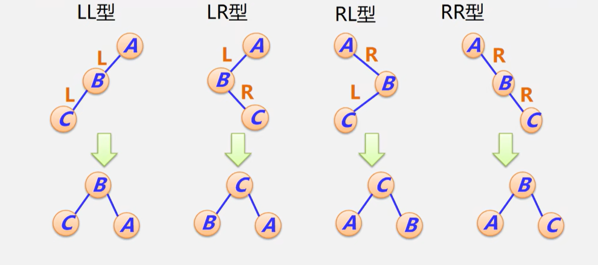

编程题2大题  Java或者c++  

最短路径算法

## 第一章

概念不考文字默写

算法概念不考？

### 递归

汉诺塔？可能有选择

> ```java
>  public static void hanoi(int num, char a, char b, char c) {
>         if (num == 1) {
>             System.out.println("第" + num + "个圆盘从" + a + " -> " + c);
>         } else {
>             hanoi(num - 1, a, c, b);
>             System.out.println("第" + num + "个圆盘从" + a + " -> " + c);
>             hanoi(num - 1, b, a, c);
>         }
> 
>     }
> ```

范型不考


## 第二章

==大O表示法==和量级，会看复杂度

$\Omega$表示法看一下

> $T(N) = O(f(N))，表示T(N)的增长率$==小于等于==$f(N)$
> 
> $T(N) = \Omega(f(N))，表示T(N)的增长率$==大于等于==$f(N)$
> 
> $T(N) = \Theta(f(N))，表示T(N)的增长率$==等于==$f(N)$

分治

> 先分后治：划分成子问题（一般两个）在将两个解决的子问题合并到一起
>
> 典型：折半查找、归并排序

## 第三章

ADT概念不考，理解

链表，栈，队列，数组等

==单链表、栈、队列：高概率==


双向链表好像不考

循环链表？ 约瑟夫问题好像不考

==所有排序都要看==

栈的数组实现不考


## 第四章

概念不考

满、完全二叉树了解

*广义表不考

==遍历（递归和非递归算法）==非递归好像不考？

> 树：
>
> 深度优先遍历 
>
> ​	先序次序遍历（先序） 访问树的根 按先序遍历根的第一棵子树，第二棵子树， ……等。
>
> ​	中序 
>
> ​	后序次序遍历（后序） 按后序遍历根的第一棵子树，第二棵子树，……等 访问树的根。
>
> 广度优先遍历
>
> ​	分层访问
>
> 
>
> **二叉树：**
>
> 先序： 
>
> ```java
> StringBuilder sb = new StringBuilder();
>      if (root != null) {
>          sb.append(root.element);
>          sb.append(PreOrderTraversal(root.left));
>          sb.append(PreOrderTraversal(root.right));
>      }
> ```
>
> 中序： 
>
> ```java
> StringBuilder sb = new StringBuilder();
>      if (root != null) {
>          sb.append(InOrderTraversal(root.left));
>          sb.append(root.element);
>          sb.append(InOrderTraversal(root.right));
>      }
> ```
>
> 后序：
>
> ```java
> StringBuilder sb = new StringBuilder();
>      if (root != null) {
>          sb.append(PostOrderTraversal(root.left));
>          sb.append(PostOrderTraversal(root.right));
>          sb.append(root.element);
>      }
> ```
>
> ==实际上就是改变访问节点的顺序==

> 非递归算法：
>
> 中序： *无限循环，每次把当前节点的左子树压入栈，然后如果栈不为空，就弹出一个表示当前访问的节点，然后p = p->right；这样下一次循环的时候就又会把右子树的左子树都压入栈*
>
> 后序： *无限循环，给根节点添上tag位（用来记录是否是从该节点的右子树回到该节点的），压左子树时tag=0，如果tag=1输出并弹栈，如果tag！=0， p = p -> right*

建立树MakeTree不考，由序列构造二叉树看一看，后缀表示好像不考

> 序列构造二叉树(先序和中序):
>
> ```java
> public static BinTree CreateBT(char[] pres, char[] ins){
>         // please enter your code here...
> 
>         if (pres.length == 0) return null;
>         char rootValue = pres[0];
>         BinTree root = new BinTree(rootValue, null, null);
>         int rootIndex = 0;
>         for (int i = 0; i < ins.length; i++) {
>             if (ins[i] == rootValue) {
>                 rootIndex = i;
>                 break;
>             }
>         }
>         root.left = CreateBT(Arrays.copyOfRange(pres, 1, 1 + rootIndex), Arrays.copyOfRange(ins, 0, rootIndex));//pres中根节点后的前rootindex个元素 ， ins中的rootindex前的元素
>         root.right = CreateBT(Arrays.copyOfRange(pres, 1 + rootIndex, pres.length), Arrays.copyOfRange(ins, rootIndex + 1, ins.length));
>         return root;// 剩余元素
> 
>     }
> ```

**字符串**翻一翻

> 串：是n（n>=0）个字符的一个有限序列，开头结尾用双引号“ ”括起来
>
> *串的长度：串中所包含的字符个数n（不包括分界符‘ “ ’，也不包括串的结束符‘\0’） 
>
> *空串：长度为0的串。或者说只包含串结束符‘\0’的串 注意：“\0 ”不等于“ \0 ”, 空串不等于空白串 
>
> *子串：串中任一连续子序列 
>
> ​	例子：B= “peking ”,，则空串“ ”、“ki ”、“peking ”都是B 的子串，但“pk ”不是B的子串

==双亲、左子女右兄弟表示法==并查集

> 左子女右兄弟表示（InsertChildren）：
>
> ​	这里current表示父节点
>
> ```java
> TreeNode<T>*newnode = new TreeNode<T>(value);
> 	 if(current->firstchild = = NULL) 
> 		current->firstchild = newnode;
> 	else
> 	{  
> 		TreeNode<T>*p = current->firstchild;
> 		while ( p->nextsibling!=NULL) p = p->nextsibling;
> 		p->nextsibling = newnode;
> 	}
> ```
>
> 

==**线索树**==（例题参考课后考研题）


> ```java
> First( )
>  {
>  while (current->leftThread= =0) current=current->leftchild;
>  return current;
>  }
>  
> Next( )
>  {
>  ThreadNode<Type>* p=current->rightchild;//此时不确定rightchild是右子树的根节点还是后继
>  if(current->rightThread= =0)//是右子树的根节点
>  	while(p->leftThread= =0) p=p->leftchilld;//找后继
>  current=p;//设为后继
>  }
> ```
>
> 创建中序线索树：
>
> 
>
> 

==霍夫曼树、霍夫曼编码==

> 构建霍夫曼树，权值大的靠近根节点
>
> ​	可以将权值最小的W1、W2合并成W=W1+W2作为新的节点看待

### 搜索树

==AVL平衡树、B树==

> AVL插入：
>
> ​	比当前节点大往左插，小往右插，平衡
>
> 平衡：==相对大小顺序不变，依然保持二叉树的结构==
>
> 
>
> LL：B的右节点（如果有的话，大小一定介于B和A之间），为保持性质，要接到A的左子树
>
> LR： 同理，C的左右节点分别接到B的右和A的左
>
> RL：C的左右节点分别接到A的右和B的左
>
> RR：B的左节点接到A的右
>
> ```java
> private AVLNode  insert( Comparable x, AVLNode t )
>  {   if ( t = = null )
>  		t = new AVLNode( x, null, null );//递归结束点，插入新节点
>  	else if ( x.compareTo( t.element ) < 0 )
>  	{  	t.left = insert( x, t.left ); //递归
>  		if( height( t.left ) – height( t.right ) = = 2 )//找最小不平衡点
>  			if( x.compareTo( t.left.element ) < 0 )
>  				t = rotateWithLeftChild ( t );//LL
>  			else  t = doubleWithLeftChild( t );//LR
>  	}else if( x.compareTo( t.element ) > 0 )
>  	{  	t.right = insert( x, t.right ) ;
>  		if( height( t.right ) – height( t.left ) = = 2 )
>  			if( x.compareTo( t.right.element ) > 0 )
>  				t = rotateWithRightChild( t );//RR
>  			else  t = doubleWithRightChild( t );//RL
>  	}
>  	else
>  		;
>  		t.height = max( height( t.left ), height( t.right ) ) + 1;
>  	return t;
>  }
> ```
>
>  
>
> 删除节点：
>
> ​	若为叶子，直接删
>
> ​	若只有一个子树，子树代替位置
>
> ​	若左右子树都有，用前驱或者后继节点顶替

B树：好像的好像不考？？？


## 第五、六章

散列表、优先队列、并查集、堆 不一定会考，可能挑一部分考，随机

散列表：平方取中好像没出

​		杂没考

​		==开放地址线性探测==                                            	


​		二次探测好像没出

​		再散列 看看

​		分离链接 看看

堆： ==堆排序O（n log n）==

​	上滤下滤

​	==建堆算法O（n）==

​	==调整时间O（log n）==

> 堆 ： 看作一棵顺序存储的完全二叉树
>


> 堆排序：
>
> ```java
> public static void heapsort( Comparable [ ] a )
> {  
>     // 1. 从最后一个 "非叶子节点" 开始，依次向上调整每个子堆
>     for( int i = a.length / 2; i >= 1; i-- )
>         percDown( a, i, a.length );
> 
>     // 2. 逐步将最大值（堆顶）移到数组末尾，并重新调整堆
>     for( int i = a.length; i > 1; i-- )
>     {  
>         // 将当前堆的堆顶元素（最大值）与当前堆的最后一个元素交换
>         swapReferences( a, 1, i );
> 
>         // 重新调整剩余的堆，使其仍然是最大堆
>         percDown( a, 1, i-1);
>     }
> } 
> 
> private static void percDown( Comparable [ ] a, int i, int n )
> { 
>     int child;
>     Comparable tmp;
> 
>     // 用 `tmp` 保存当前节点的值
>     for( tmp = a[ i ]; leftChild( i ) < n; i = child )
>     { 
>         child = leftChild( i ); // 找到当前节点的左子节点
>         
>         // 如果右子节点存在并且比左子节点大，选择右子节点
>         if( child != n – 1 && a[child ].compareTo( a[ child + 1 ]) < 0 )
>             child++;
> 
>         // 如果子节点比当前节点大，则将子节点上移
>         if( tmp.compareTo( a[ child ] ) < 0 )
>             a[ i ] = a[ child ];
>         else  
>             break; // 已经满足堆性质，退出循环
>     }
> 
>     // 将原来的值 `tmp` 放到最终位置
>     a[ i ] = tmp;
> }
> 
> private static int leftChild( int i )
>  { 
>   return 2 * i + 1;
>  }
> 
> ```
>
> O(nlogn)

## 第七章

好像没考


## 第八章

==最短路径==

> #### Dijkstra 算法(非負權值單源最短路徑)
> - 圖中所有邊的權值非負(>=0)
> - 計算圖中某點 v0 到其他各點 vi 的最短路徑
>
> - 步驟
> 1. 選擇起始點 v0，使 S = {v0}，E = {}，E' 為 p:s, vi(s 為 S 中的點)，即 S 中元素到非 S 中元素的最短邊的集合
> 2. 選擇權值(代價)最小的邊 ei 加入 E，即 E = union(E, {ei})，S = union(S, {vi})
> 3. E 中的元素必表示 v0 到 s 的最短距離(s 為 S 中元素)
> 4. 更新 E' 集合，重複2,3步驟直到所有點的最短距離都找到
>
> ```c++
> void Graph::shortestpath(int n,int v){ 
>     for( int i=0; i<n; i++){ //初始将除v外所有点设为为加入
>         dist[i]=Edge[v][i];
>         s[i]=0;              //s[i]==1表示点i已加入
>         if( i!=v && dist[i]< MAXNUM ) 
>             path[i]=v;
>         else 
>             path[i]=-1;
>     }
>     
>     s[v]=1; 
>     dist[v]=0;
>     
>     //  s     | 1  | 0 | 0 |
>     //  dist  | 0  | . | . |
>     //	path  | -1 | . | . |
>     
>     for( i=0; i<n-1; i++){ //共遍历n-1次
>         float min=MAXNUM; 
>         int u=v;
>         for( int j=0; j<n; j++)//选择未加入的最近的点加入
>             if( !s[j] && dist[j]<min ) { 
>                 u=j; min=dist[j];
>             }
>         s[u]=1;
>         for ( int w=0; w<n; w++)//计算经过新点到其他点的距离
>             if( !s[w] && Edge[u][w] < MAXNUM &&
>                dist[u]+Edge[u][w] < dist[w]){ //未加入 且 有直连边 且 路径更短
>                 
>                 dist[w]=dist[u]+Edge[u][w]; 
>                 path[w]=u;
>             }
>     }//for
> }
> ```
>
> - **複雜度：**==O(n^2)==
>
> #### Bellman-Ford 算法(任意權值單源最短路徑)(貝爾曼-福特)
> - 構造最短路徑長度數組，dist^i[u]為從源點(起點)經過 i 條邊到達 u 的最短路徑長度
> - 帶負權值邊不可構成迴路(v0 [+a]-> v1 [-b] -> v0，相當於不動而長度自減)
>
>   
>
> ```c++
> void Graph::BellmanFord(int n, int v){ 
>     for(int i=0;i<n;i++){ 
>         dist[i]=Edge[v][i];
>         if(i!=v&&dist[i]<MAXNUM)
>             path[i]=v;
>         else 
>             path[i]=-1;
>     }
> 
>     
>     for (int k=2;k<n;k++) //dist^k(u) 表示从源点v最多经过不构成带负长度边回路的n-1条边的最短路径长度；
>         for(int u=0;u<n;u++)
>             if(u!=v)
>                 for(i=0;i<n;i++)//遍历其他顶点
>                     if (i！=u && Edge[i][u]<MAXNUM &&
>                         dist[u]>dist[i]+Edge[i][u]{ //原有路径长 <?> v到i的最短路径+i到u的边 
>                             dist[u]=dist[i]+Edge[i][u];
>                             path[u]=i;//u的前驱就是i了
>                         }
> }
> ```
>
> - 複雜度：==O(n^3)==
>
> #### Floyed 算法 所有頂點的最短路徑(非負權值)
>
> - 計算所有頂點的最短路徑和
> 1. 執行 Dijkstra 算法 n 次
> 2. Floyed 算法
>
> - 複雜度：都是 O(n^3)
>
> - Floyed 算法步驟
> 1. 以鄰接矩陣表示，初始矩陣為 A0，自反邊長度為 0，未連通視為無限
> 
> 2. 作 n-1 次迭代(路径最多长 n-1)，每次令 Ai[i, j] = min(Ai-1[i, j], Ai-1[i, 1] + Ai-1[1, j])，即上次迭代最短路徑(<v0, vi-1>)與再經過一條邊(<v0, vk, vi-1>)的路徑取最小值作為新的最短路徑(<v0, vi>)
> 
> 
> 
>
> ```c++
> void Graph::Alllength(int n){ 
>     for(int i=0; i<n; i++)
>         for(int j=0; j<n; j++){ 
>             a[i][j]=Edge[i][j];
>             if(i==j) a[i][j]=0;
>             if(i< >j&&a[i][j]<MAXNUM)
>                 path=i; //直连
>             else 
>                 path[i][j]=0; 
>         }
>     
>     for(int k=0; k<n; k++)
>         for(int i=0; i<n; i++)
>             for(int j=0; j<n; j++) 
>                 if( a[i][k]+a[k][j]<a[i][j] ){  
>                     a[i][j]=a[i][k]+a[k][j];
>                     path[i][j]=path[k][j]; // i -> j  =>  i -> k -> j
>                 }
>     
> }
> ```


==邻接矩阵邻接表==

邻接多重表好像没考

==遍历算法==

> #### DFS Depth First Search 深度优先算法
>
> - 访问顶点 v0，然后访问其中一个未被访问的子顶点，递归访问
> - 若不存在未被访问的子顶点，退回到路径上含有未被访问子顶点的顶点，访问未被访问的子顶点，递归实现。
> 
>
> ```c++
> template<NameType,DistType> void Graph<NameType,DistType> :: 
> DFS(int v,visited[]){ 
>     cout<<GetValue(v)<<'';
>     visited[v]=1;
>     int w=GetFirstNeighbor(v);
>     
>     while (w!=-1){ 
>         if(!visited[w]) 
>             DFS(w,visited);
>         w=GetNextNeighbor(v,w);
>     }
> }
> 
> ```
>
> - **算法複雜度：**邻接表 O(n + e)，邻接矩阵 O(n^2)
>
> #### BFS Breadth First Search 广度优先遍历
>
> - 访问顶点 v0，先访问 v0 的所有子顶点 v1, v2, ..., vk，然后依序访问 vi(i=1~k)中沒有被访问过的子顶点，非递归实现。
> 
>
> ```c++
> template<NameType,DistType> void Graph<NameType,DistType> :: BFS(int v){
>     int* visited=new int[NumVertices];
>     for (int i=0; i<NumVertices; i++) 
>         visited[i]=0;
>     cout<<GetValue(v)<<'';
>     visited[v]=1;
>     queue<int> q;
>     q.EnQueue(v);
>     
>     while(!q.IsEmpty()){ 
>         v=q.DeQueue();
>         int w=GetFirstNeighbor(v);
>         while (w!=-1){ 
>             if(!visited[w]){ 
>                 cout<<GetValue(w)<<'';
>                 visited[w]=1;
>                 q.EnQueue(w);
>             }
>             w=GetNextNeighbor(v,w);
>         }
>     }
>     delete[] visited;
> }
> ```
>
> - **算法複雜度：**邻接表 O(n + e)，邻接矩陣 O(n^2)

==最小生成树==

> **Prim 算法 ：**
>
> ​	选点
>
> ​	O(n^2)
>
> Kruskal:
>
> ​	选边
>
> 1. 建立e条边的最小堆。
>
>     检测邻接矩阵O(n2) 
>
>    
>
>    每插入一条边，执行一次 fiterup( ) 算法：log2e
>
>     所以，总的建堆时间为O(elog2e) 
>
> 2. 构造最小生成树时： e次出堆操作，每一次出堆，执行一次filterdown(), 总时间为O(elog2e) 
>
>    ​			2e次find操作：O(elog2n) 
>
>    ​			n-1次union操作：O(n) 
>
>    
>
>    所以，总的计算时间为O(elog2e+elog2n+n2+n)
>

==AOV、AOE 拓扑排序 时间==

> 拓扑排序：
>
> 1. 寻找图中入度为 0 的节点 ei(存在多个则次序任意)
> 2. 刪除 ei 与所有 ei 的出边
> 3. 递归直到所有节点都被消去，删除顺序即为拓扑排序

> 最早时间：V0 -> Vi的最长路径
>
> 最晚时间： Vn-1 -> Vi的最长路径

证明不考


## 第九章

==所有排序都要看==

插入

> ```java
> public static void insertionSort( Comparable [ ] a ){ 
>     int j;
>     for ( int p = 1; p < a.length; p++ ){ 
>         Comparable tmp = a[ p ];
>         for ( j = p; j > 0 && tmp.compareTo( a[ j – 1 ] ) < 0; j-- )
>             a[ j ] = a[ j – 1 ];
>         //temp前比temp大的数挨个往后挪
>         a[ j ] = tmp;
>     }
> } 
> ```
>
> O(n^2)

折半插入排序好像没出

> ```java
> template <class Type> void BinaryInsertSort( datalist<Type> &list){ 
>     for (int i=1; i<list.currentSize; i++) 
>         BinaryInsert(list, i);
> }
> 
> template <class Type> void BinaryInsert( datalist<Type> &list, int i){ 
>     int left=0, Right=i-1;
>     Element<Type>temp=list.Vector[i];
>     while (left<=Right){ 
>         int middle=(left+Right)/2;
>         if (temp.getkey( )<list.Vector[middle].getkey( ))
>             Right=middle-1;
>         else 
>             left=middle+1;
>     }
>     
>     for (int k=i-1; k>=left ; k--) 
>         list.Vector[k+1]=list.Vector[k];//向后移，	O(n)
>     list.Vector[left]=temp;
> }
> ```
>
> O(nlogn)

希尔排序没印象了，大概率没有

==冒泡排序==

> 简单
>
> O(n^2)

==快速排序==

> ```java
> template <class Type> void QuickSort( datalist <Type>& list,const int left,  const int right )
>  {    if (left<right){    
>      		int pivotpos=partition (list, left, right);
> 	 		QuickSort(list, left, pivotpos-1);
> 			QuickSort(list, pivotpos+1, right);
> 	 	}
>  }
> 
> template <class Type> int  partition(datalist<Type> &list,const int low, const int high)
>  {   int i=low,  j=high;  
> 	Element<Type>pivot=list.Vector[low];//一开始low的元素放在了pivot里面
>  	while (i != j ){   
>         while(list.Vector[j].getkey( )>pivot.getkey( ) && i<j)  j--; 
>  		if (i<j) {list.Vector[i]=list.Vector[j]; i++;}
>  		while(list.Vector[i].getkey( )<pivot.getkey( ) && i<j)  i++;
>  		if (i<j) {list.Vector[j]=list.Vector[i]; j--;}
>  	}//找到左侧>=pivot且右侧<=pivot的位置，交换，直到左右相遇
>  	list.Vector[i]=pivot ;
>  	return i;
>  }
> ```
>
> 1. 若 num[i] <= m 且 num[j] >= m，則 i++, j--
> 2. 若 num[i] >m 且 num[j] < m，則 num[i], num[j] 交換並且 i++, j--
> 3. 若 num[i] > m 而 num[j] >= m，則 j--
> 4. 若 num[i] <= m 而 num[j] < m，則 i++
>
> 栈来存放： 1）存放什么：左部或右部的上、下界的下标。 2）栈要多大：O（log2n）~ O（n） <- 对应于有序情况

锦标赛排序应该不考

==选择排序、堆排序（见上）==

> ```java
> template <class Type> void SelectSort(datalist<Type> &list){ 
>     for ( int i=0; i<list.CurrentSize-1; i++)
>         SelectExchange(list, i);
> }
> 
> template <class Type> void 
>     SelectExchange( datalist<Type> &list, const int i){ 
>     int k=i;
>     for ( int j=i+1; j<list.CurrentSize; j++)
>         if (list.Vector[j].getkey( )<list.Vector[k].getkey( )) 
>             k=j;
>     // 找到小于它的最靠后的节点
>     if ( k!=i) 
>         Swap(list.Vactor[i], list.Vector[k]);
> }
> ```
>
> O(n^2)

==归并（重点）==

> ```java
> public static void mergeSort( Comparable [ ] a ){ 
>     Comparable [ ] tmpArray = new Comparable[ a.length ];
>     mergeSort( a, tmpArray, 0, a.length – 1 );
> }
> 
> private static void mergeSort( Comparable [ ] a, Comparable [ ] tmpArray,
> int left, int right ){ 
>     if( left < right ){ 
>         int center = ( left + right ) / 2;
>         mergeSort( a, tmparray, left, center );
>         mergeSort( a, tmpArray, center + 1, right );
>         merge( a, tmpArray, left, center + 1, right );
>     }
> }
> 
> private static void merge( Comparable [ ] a, Comparable [ ] tmpArray,
> int leftPos, int rightPos, int rightEnd ){ 
>     int leftEnd = rightPos – 1;
>     int tmpPos = leftPos;
>     int numElements = rightEnd – leftPos + 1;
>     
>     while( leftPos <= leftEnd && rightPos <= rightEnd )
>         if( a[ leftPos ].compareTo( a[ rightPos ] ) <= 0 )
>             tmpArray[ tmpPos++ ] = a[ leftPos++ ];
>     	else 
>         	tmpArray[ tmpPos++ ] = a[ rightPos++ ];
>     
>     while( leftPos <= leftEnd )
>         tmpArray[ tmpPos++ ] = a[ leftPos++ ];
>     
>     while( rightpos <= rightEnd)
>         tmpArray[ tmpPos++] = a[ rightpos++ ];
>     
>     for( int i = 0; i < numElements; i++, rightEnd-- )
>         a[ rightEnd ] = tmpArray[ rightEnd ];//拷贝回a
> 
> } 
> ```
>
> O(nlogn)


## 题型

选择：单选（4分）

应该没有填空

问答题：看清楚问题有几个，==详细==

编程题：量较大，==不能写伪代码==，人工批，看清题目（不要乱改变量名）


期末占比80%，平时20%（看情况微调）