# 前言

## 数理逻辑简介

数理逻辑或称符号逻辑、理论逻辑,是数学中的一个基础分支,是一门用数学方法研究逻辑或形式逻辑的学科,其研究对象是对证明和计算这两个直观概念进行符号化以后的形式系统.数理逻辑是数学的基础.

### 0.1.1 数学定义、证明、定理、引理、推论

$A \Rightarrow B$的证明方法有两种:

- 直接证明: 假设A成立,从A出发证明B成立
- 间接证明: 假设$\lnot B$成立,证明$\lnot A$成立反证法、等价性证明、存在唯一性证明

### 0.1.2 罗素悖论与ZFC公理系统

罗素悖论中有许多例子,其中一个很通俗也很有名的例子就是“理发师悖论”:有个小岛上有一位理发师,有一天他宣布:他只给小岛上不自己刮胡子的人刮胡子.那么就产生了一个问题:理发师究竟给不给自己刮胡子?如果他给自己刮胡子,他就是自己刮胡子的人,按照他的原则,他又不该给自己刮胡子:如果他不给自己刮胡子,按照他的原则,他又应该给自己刮胡子.这就产生了矛盾.

这个悖论用逻辑符号写出来就是,$A={A:A \notin A}$,我们容易推导出$A\in A$当且仅当$A\notin A$.这是数学家不能容忍的.

为什么会出现这种现象呢?这与集合的直觉定义有关.中学数学课本给出的模糊的集合定义为:所有满足某种性质$\varphi$的对象的全体为一个集合.写成数理逻辑公理(Comprehension公理)就是:如果$\varphi$是一性质,则存在一个集合$Y={x:\varphi(x)}$.但这是错误的,罗素悖论就是其反例.

悖论的提出,促使许多数学家去研究集合论的无矛盾性问题,从而产生了数理逻辑的一个重要分支——公理集合论.我们在此例举ZFC公理系统,你会很惊讶地看到,我们平时认为对的很多东西竟然都是公理,并非绝对的.

1. **Extensionality公理**: 如果X和Y有相同元素,则X=Y.
2. **Pairing无序对公理**: 对任何a,b,存在一个集合{a,b},恰好含有元素a,b.
3. **Separation公理**: 如果$\varphi$是一性质,则对于任何集合X和参数p,存在一个集合$Y={u ∈X:\varphi(u,p)}$,它包含所有有此性质的X中的元素u.这条修改过的公理解决了罗素悖论.
4. **Union公理**: 对任何X,存在一个集合$Y=\bigcup X$,即X中所有元素的并.
5. **Power set公理**: 对任何X,存在一个集合Y=P(X), X的所有子集合形成的集合.
6. **Infinity公理**: 存在无穷集合.
7. **Replacement公理**: 如果F是一个函数,则对任何集合X,存在一个集合Y=F[X]={F(x): x ∈X}.
8. **Regularity公理**: 每个非空集合有一个∈关系最小元素
9. **Chioce公理**: 每个非空集合类,有一个选择函数.

## 集合基础

### 0.2.1 外延公理

Extensionality外延公理: 如果X和Y有相同元素, 则X=Y.即
$$
A=B当且仅当\forall x(x∈A当且仅当x ∈B)
$$
但由外延公理并不能推出存在一个集合,因此还需要集合存在公理。

在集合中加入新元素是非常有用的操作。对于集合A, $A;t$ 表示一个新的集合,其元素包括(i)A的元素和(ii)元素t(可能是新的), 这里的t可能属于也可能不属于A.使用后面定义的符号,这个过程可以表示为
$$
A;t = A \cup \{t\}
$$
并且
$$
t \in A \text{  iff  } A = A \cup \{t\}
$$

### 0.2.2 空集公理

空集$\emptyset$是一个特殊的集合,它不包含任何元素.除此以外的其他集合都称为非空的.

对于任意的对象x,存在单元素集合{x},其唯一的元素就是x. 更一般地,对于任意有限个元素:$x_1,x_2,...,x_n$,都存在集合$\{x_1,x_2,...,x_n\}$,此集合中的元素恰好就是这几个元素, 注意{x,y}={y,x}, 这是因为两个集合恰好含有相同的元素, 只不过是用不同的形式表示同一个集合。如果一定要考虑元素的顺序,那么可以使用有序对来表示(稍后讨论).

### 0.2.3 有序对

元素x与y的有序对<x,y>定义如下:
$$
<x,y>=<u, v> \text{ iff } x=u且y=v
$$
所有具有上述性质的定义都可以作为有序对的定义,其中,一个标准的定义是
$$
<x,y> = \{ \{x\}, \{x,y\}\}
$$
有序三元组可以定义为
$$
<x,y,z> = <<x,y>,z>
$$
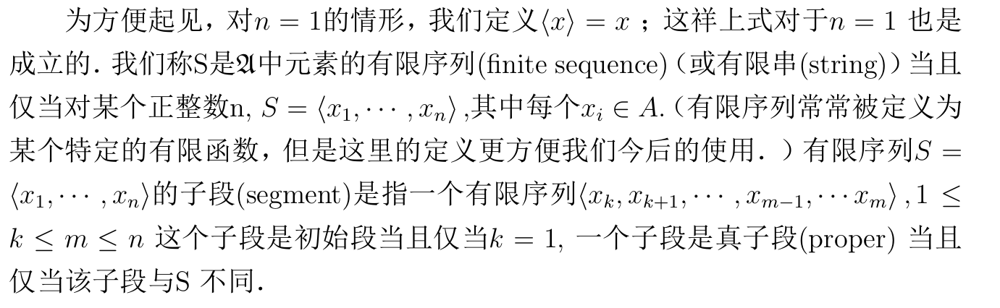

### 0.2.4 关系

关系(relation)R是有序对的集合。例如,数字0~3上的大小序关系是有序对的集合:
$$
\{<0,1>,<0,2>,<0,3>,<1,2>,<1,3>,<2,3>\}
$$
R的定义域(domain)记作dom R, 它是指所有满足<x,y>∈R的元素x的集合, 其中y是任意的;

R的值域(range)记作ran R, 它是指所有满足<x,y>∈R的元素y的集合, 其中x是任意的.

dom R与ran R的并称为R的域(field),记作$\text{fld R}$.

A上的n元关系是$A_n$的子集. 若n>1,它就是一个关系; 不过当n=1时,A上的一元关系只是A的一个子集。A上的一个特殊的二元关系是恒等关系$\{<x,x>|x\in A\}$. 对于A上的n元关系R和A的一个子集B, R对B的限制是指交集$R\bigcap B^n$。例如,上例中的关系是$\N$上的序关系对集合$B=\{0,1,2,3\}$的限制.

### 0.2.5 函数

一个具有单值性质的关系F: 对于定义域dom F中的每一个x,都有唯一的一个y满足<x,y>∈F.通常, 这个唯一的y称为F在x上的值F(x).

我们称F将A映射(map)到B中,记作
$$
F:A→B
$$
意味着F是一个函数, $dom F=A, ran F \subseteq B$. 若ran F=B, 则称F将A映射到B上。

F是一个一对一映射(one-to-one)当且仅当对于ran F中的每个y, 都存在唯一的一个x使得<x,y>∈F. 如果<x,y>在定义域dom F中, 那么记F(x,y)=F(<x,y>). 这个记法可以推到n元的情形:$F(x_1...,x_n)=F(<x_1,..., x_n>)$.

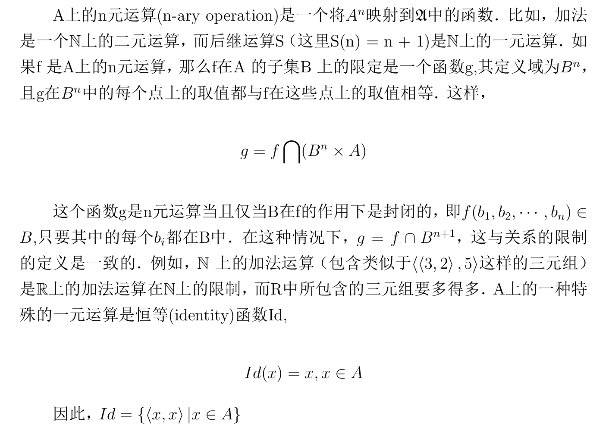

对于关系R, 我们定义:

- R在A上是自反的, 当且仅当每个x有$<x,x> \in R$
- R是对称的,  当且仅当如果$<x,y> \in R$, 则$<y,x> \in R$
- R是传递的, 当且仅当如果$<x,y>∈R$并且$<y,z>∈R$.(若很巧), 则$<x,z>∈R$. 

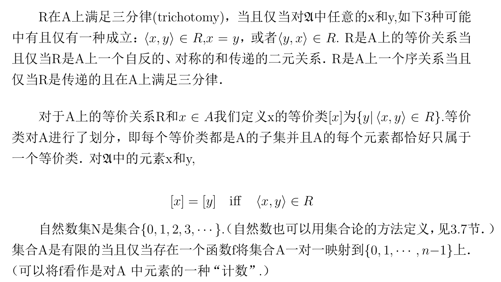

所谓关系,就是指对象之间的联系,如人与人之间的”婚姻”关系、”父子”关系。数学对象之间也有许多关系,比如直线的平行关系、垂直关系,数与数之间相等的关系、大小的关系、集合的“包含”关系等等。我们可以用有序对的集合来表示关系,比如父子关系就可以表示成集合。
$$
R=\{<x,y>|x是y的父亲\}
$$
对任两个人x,y,如果x是y的父亲,那么有序对<x,y>就属于R。反之,如果有序对<x,y>属于R,则表明x是y的父亲。

**二元关系**, 如果一个集合R中的元素都是有序对, 即如果对任意的Z属于R,都存在x,y,使得Z等于<x,y>, 则称R是二元关系。通俗的说, 二元关系就是有序对的集合。

设R是一个关系, R的逆关系, 记为$R^{-1}$, 定义为
$$
R^{-1} = \{<x,y>|<y,x> \in R\}
$$
即对任意的x,y, 都有$x R^{-1}y$, 当且仅当yRx

### 0.2.6 偏序关系

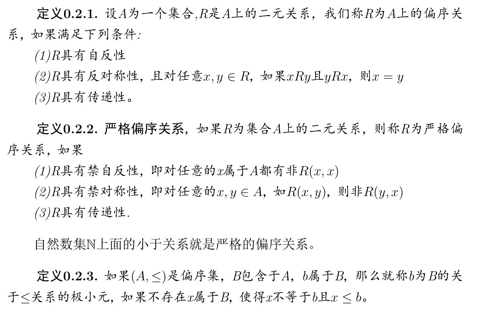

### 0.2.7 良序关系

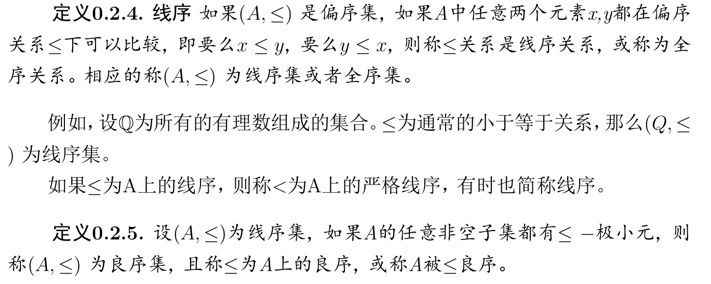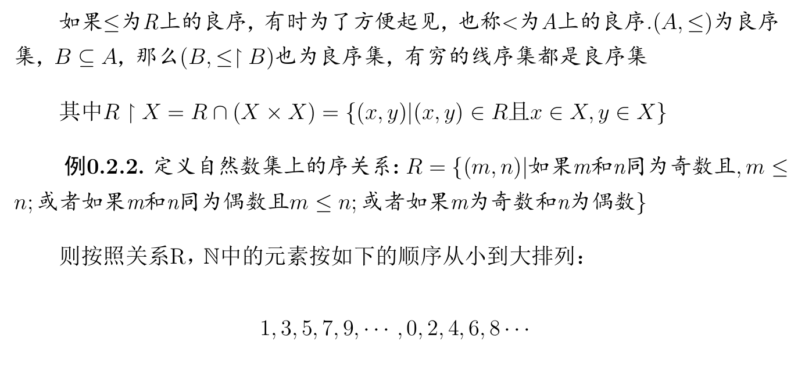

### 0.2.8 良序

**良序问题**: 是否对任意的集合A,都存在A上的良序关系?
例如是否存在实数集上面的良序?该问题到现在还没有完全的解决,良序关系一开始并不是作为问题提出的,而是作为一个假设由康托尔提出的。这就是著名的”良序原则”。

**良序原则**: 任意的集合都可以被良序。良序原则和和Zorn引理是等价的。在良序定义中,如果只要求(A,≤)为偏序, 而不是要求线序, 就称为良序偏序。

集合A是可数的当且仅当存在某个函数将A一对一映射到自然数N中

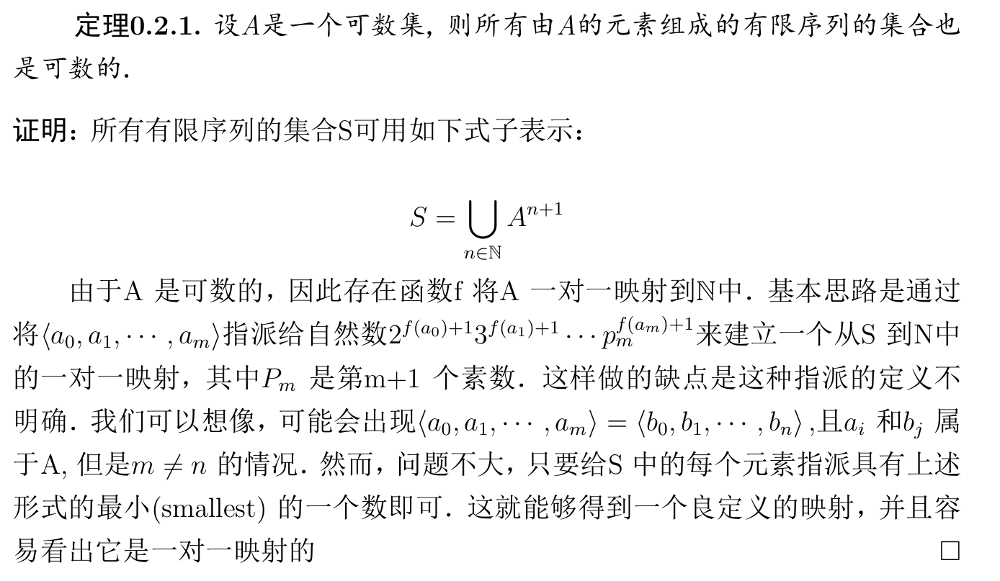

### 0.2.9 自然数

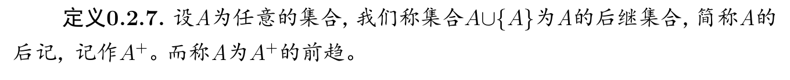

空集是不含任何元素的, 因此我们很自然的用空集来表示0. 再利用后继的概念, 我们就可以把自然数定义出来了。这样我们就把每一个自然数都表示成集合了.

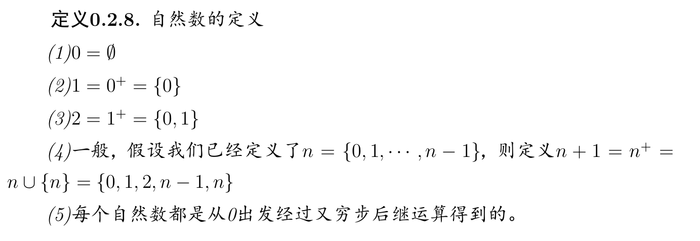

容易看到任何的非零自然数都有前趋,对于非零的自然数n,我们可以用n-1表示n的前趋。自然数的定义归功于冯诺伊曼,前面我们把所有的自然数组成的集合看成了集合。实际上这需要无穷公理来保证。

**无穷公理**：所有自然数组成的集合的整体是集合,记为$\omega$

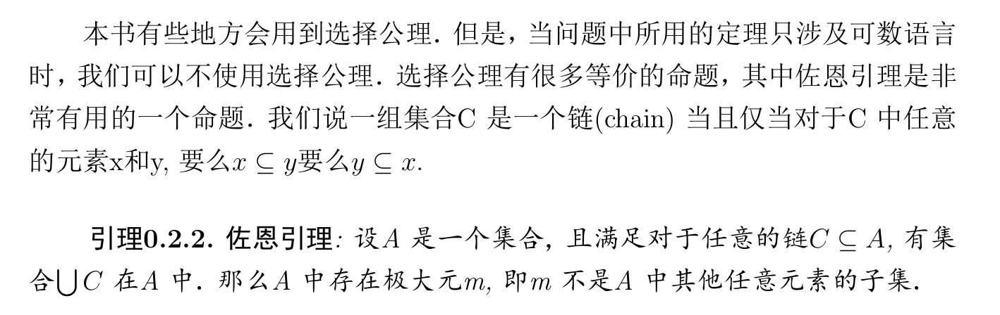

> **链**指偏序集中的一个**子集**，这个子集本身是一个**全序集**。即链中的**任意两个元素都是可以相互比较的**。
>
> 对于偏序集中的一个子集（比如一条链），它的**上界**是<u>原偏序集</u>中的一个元素，这个元素**大于或等于该子集中的每一个元素**。（上界不一定在该子集中，也不一定是唯一的。）
>
> **极大元**指偏序集中的一个元素，**没有其他元素比它“更大”**。（极大元不一定是最大的元素。最大的元素要比所有元素都大，而极大元只需要没有比它更大的元素即可。）

**佐恩引理**：假设你有一个集合，里面的元素可以按照某种“大小”规则进行部分排序（偏序）。如果这个集合有一个非常好的性质：**任何一列可以从小到大排好队的元素（链），总能在整个集合中找到一个人（元素）比这列里的所有人都“大”或“相等”（有上界）**。

那么，这个集合里**一定存在一个“顶级”元素（极大元）**，你再也找不到比它更“大”的元素了。

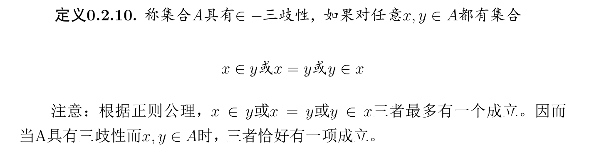

### 0.2.10 等势集合

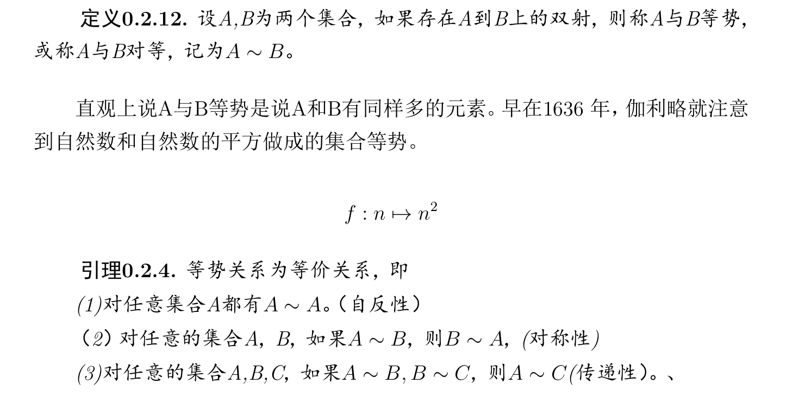

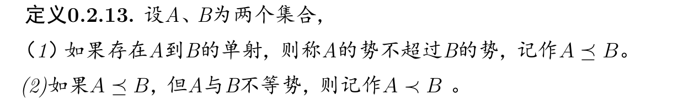

### 0.2.11 康托尔-伯恩斯坦定理

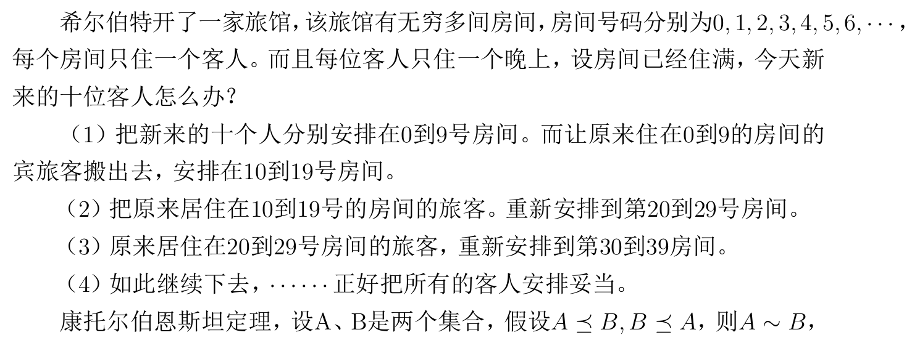

### 0.2.12 有穷集合

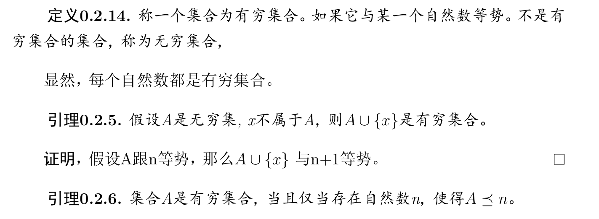

> 此处笔误，引理0.2.5 A 应为有穷集

### 0.2.13 可数集合

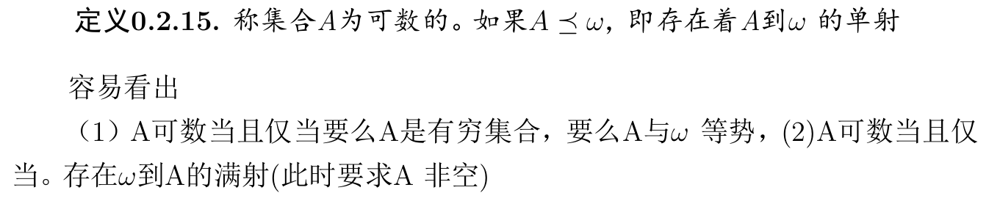

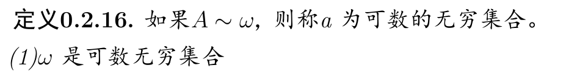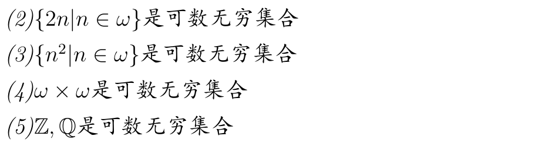

### 0.2.14 无穷集

任何的无穷集都与其某一个真子集等势。

**定理：每一个无穷集合都有无数无穷子集**

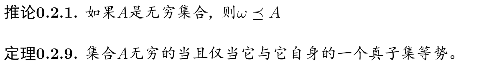

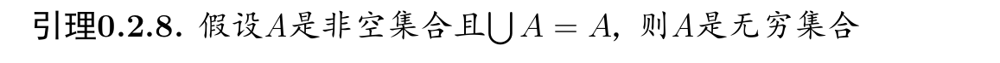

### 0.2.15 不可数集合

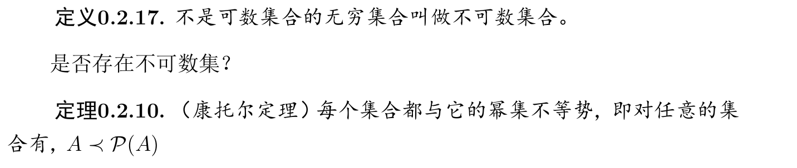

> 一句话概括
>
> **康托尔定理指出，任何集合的幂集（即所有子集构成的集合）的基数（俗称“元素个数”）严格大于该集合本身的基数。**
>
> 对于有限集合，这很直观。但对于无穷集合，这个定理得出了一个震撼的结论：**不存在最大的集合，也不存在最大的无穷大；无穷是有“等级”之分的。**

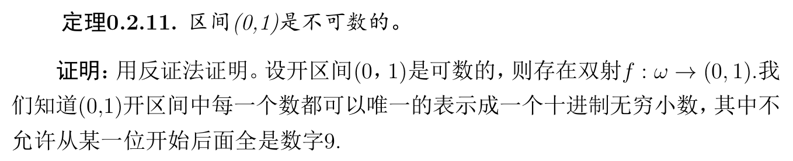

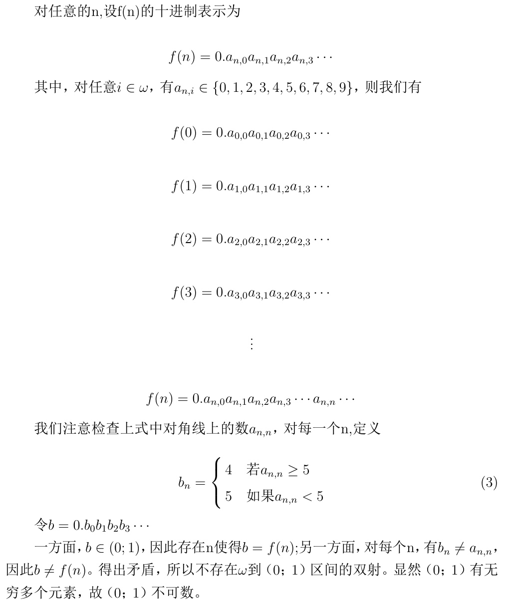

### 0.2.16 序数⭐

**每一个有限良序集合都和一个自然数序（即一个有限的序数）同构。**

<u>自然数序：n = { 0，1，2，3，……，n-1 }</u>

> 想象一下，你是一个老师，面前站着一排身高各不相同的学生，他们已经按照从矮到高的顺序排好了一条队。这就是一个**有限良序集**。
>
> 你的任务是给他们贴上号码牌，来标记他们的位置（第1个，第2个，第3个……）。但贴牌必须遵守一个规则：**排在前面的学生得到的号码一定比排在后面的学生小。**
>
> 你可以**在学生和数字集合 {0, 1, 2, ..., n-1} 之间建立了一个一一对应关系**（双射）：这就是一个同构。

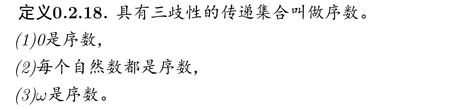

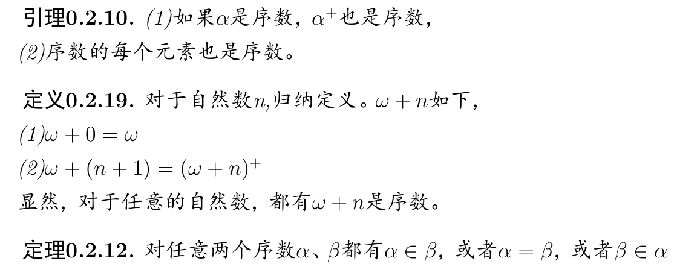

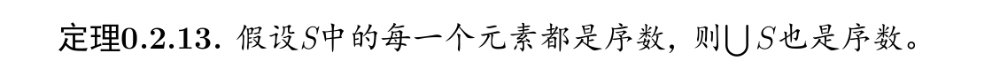

> ⋃*S* 实际上是集合*S*中所有序数的**上确界**（supremum），即最小的序数大于或等于*S*中的每一个序数。

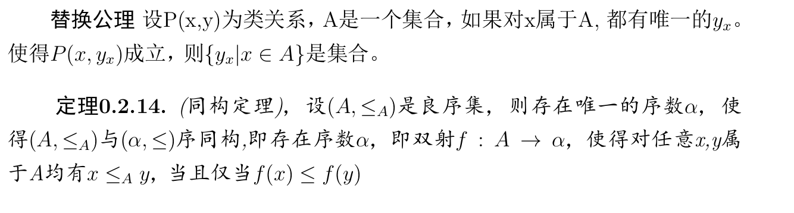

### 0.2.17 超穷归纳法

简单来说，就是把普通归纳法从自然数序扩展到一般的序数

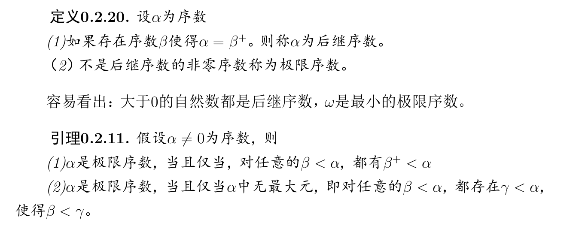

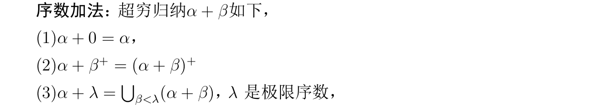

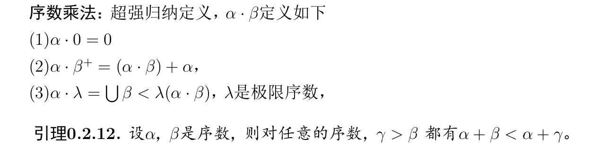

# 考试复习

##  叙述题

### 简叙Goedel第二不完全定理及其证明思路。

哥德尔第二不完全性定理指出：任何一个**足够强**、递归可公理化且**和谐（即可靠、一致）**的形式系统 $T$，都不能在系统内部证明自身的一致性，即
$$
T \nvdash \mathrm{Con}(T).
$$
**证明思路：**
首先，利用**不动点引理**构造一个自指命题 $G$，使得
$$
T \vdash G \leftrightarrow \neg \mathrm{Prov}_T(\ulcorner G \urcorner),
$$
即 $G$ 表示“$G$ 在 $T$ 中不可证明”。
其次，在系统**足够强**的前提下，可以形式化“可证明性”和“一致性”，并在系统内证明：
$$
\mathrm{Con}(T) \rightarrow \neg \mathrm{Prov}_T(\ulcorner G \urcorner)。
$$
结合上述等价式可推出
$$
\mathrm{Con}(T) \rightarrow G。
$$
最后，若$T$能证明自身一致性，则可推出$G$可证，这与系统的**和谐性**（以及第一不完全性定理）相矛盾。
其中隐含使用了**反射思想**：一致性意味着系统不会证明假命题，但这种整体反射不能在系统内部完成。

### 定理30A的证明思路

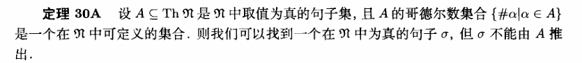

1. 利用哥德尔数（§）构造自指句子 ；
2. 使用反证法，通过假设推出矛盾以证明假设的反面；
3. 得出结论。

(a,b,c) 的含义是，哥德尔数为a的公式中的v1替换为b，得到的推理的哥德尔数为c。

### 定理30A中三元关系R是怎么定义的？其中的符号a,b,c,\alpha分别代表什么？其中的推理是如何编码的？

三元关系 $R(a,b,c)$ 表示：$a$ 是某公式的哥德尔数，$b$ 是该公式经代入后的哥德尔数，$c$ 是从集合 $A$ 出发对该公式进行某个有限推理所得结论的编码；

推理 $G$ 被看作是一个有限的公式序列，每一步要么属于集合 $A$，要么由前面步骤通过固定的推理规则得到。该序列及其每一步的合法性都可以用自然数进行编码并在算术中检验，因此“$c$ 是从 $A$ 出发的某个推理的结论”这一关系在 $\mathbb N$ 中是可定义的。

### AE公理集

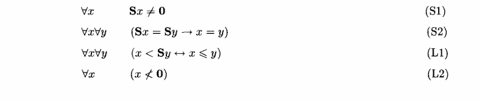

### 可表示、可定义是怎么定义的？他们有什么区别？

**可表示（Representable）**
给定理论 $T$ 与结构 $\mathcal M$，关系（或函数）$R$ **可表示**，是指存在公式 $\varphi(\bar x)$，使得在 $\mathcal M$ 中
$$
\mathcal M\models \varphi(\bar a)\ \Longleftrightarrow\ R(\bar a)成立
$$
**可定义（Definable）**
在结构 $\mathcal M$ 中，关系（或集合）$A$ **可定义**，是指存在公式 $\varphi(\bar x)$，使
$$
A=\{\bar a\in M^n\mid \mathcal M\models \varphi(\bar a)\}
$$
**可表示**：用一个公式在模型中**刻画某个已给定的关系是否成立**。

**可定义**：用一个公式在模型中**直接定义出一个集合或关系本身**

### 可表示函数、弱可表示的定义是什么？

**一、可表示函数（strongly representable）**
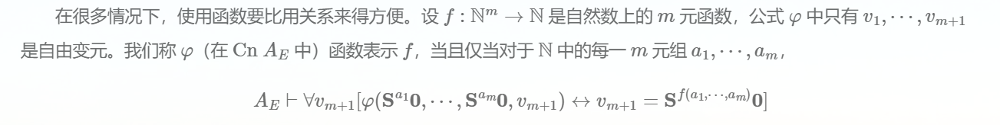

**二、弱可表示（weakly representable）**
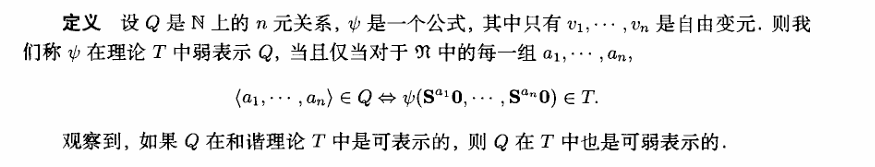

### 不动点引理的证明思路？

**编码公式**：对每个一元公式 $\varphi(x)$ 赋予其哥德尔数 $\ulcorner\varphi\urcorner$。

**构造代入公式**：构造公式 $Sub(x,x)$，表示“把编码为 $x$ 的公式代入自身”。

**定义辅助公式**：令$\psi(x)\equiv \varphi(Sub(x,x))$

**取对角句**：令 $G=\psi(\ulcorner\psi\urcorner)$，则 $G$ 是一个无自由变量的句子。

**验证不动点**：可证明
$$
T\vdash G\leftrightarrow \varphi(\ulcorner G\urcorner)
$$

### 叙述范式定理，指出中符号U,e,a,k,T_m,k,k’的意思

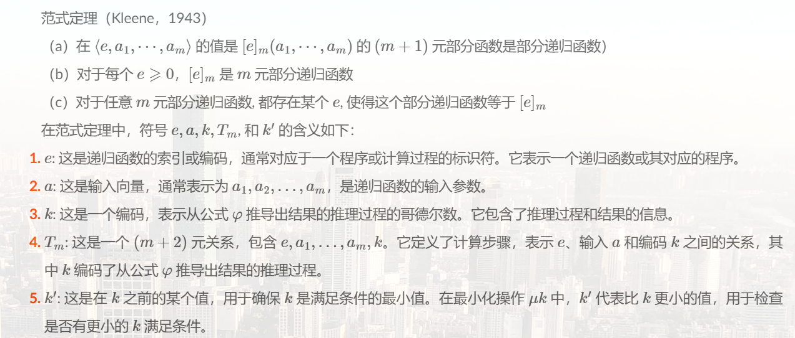

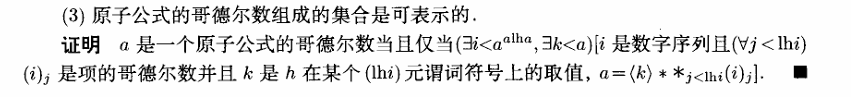

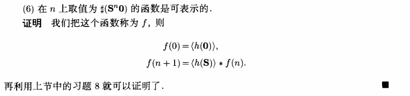

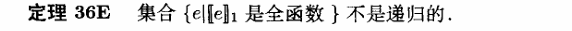

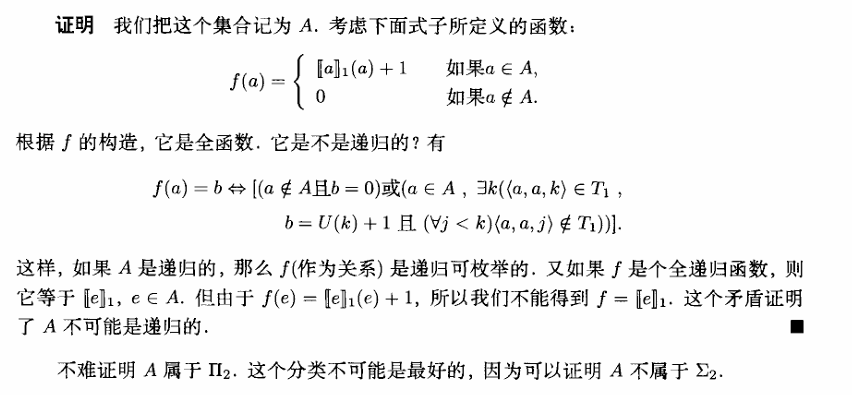

