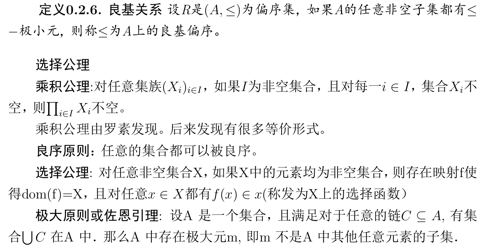

# 0. 前言

## 0.1 数理逻辑简介

数理逻辑或称符号逻辑、理论逻辑,是数学中的一个基础分支,是一门用数学方法研究逻辑或形式逻辑的学科,其研究对象是对证明和计算这两个直观概念进行符号化以后的形式系统.数理逻辑是数学的基础.

### 0.1.1 数学定义、证明、定理、引理、推论

$A \Rightarrow B$的证明方法有两种:

- 直接证明: 假设A成立,从A出发证明B成立
- 间接证明: 假设$\lnot B$成立,证明$\lnot A$成立反证法、等价性证明、存在唯一性证明

### 0.1.2 罗素悖论与ZFC公理系统

罗素悖论中有许多例子,其中一个很通俗也很有名的例子就是“理发师悖论”:有个小岛上有一位理发师,有一天他宣布:他只给小岛上不自己刮胡子的人刮胡子.那么就产生了一个问题:理发师究竟给不给自己刮胡子?如果他给自己刮胡子,他就是自己刮胡子的人,按照他的原则,他又不该给自己刮胡子:如果他不给自己刮胡子,按照他的原则,他又应该给自己刮胡子.这就产生了矛盾.

这个悖论用逻辑符号写出来就是,$A={A:A \notin A}$,我们容易推导出$A\in A$当且仅当$A\notin A$.这是数学家不能容忍的.

为什么会出现这种现象呢?这与集合的直觉定义有关.中学数学课本给出的模糊的集合定义为:所有满足某种性质$\varphi$的对象的全体为一个集合.写成数理逻辑公理(Comprehension公理)就是:如果$\varphi$是一性质,则存在一个集合$Y={x:\varphi(x)}$.但这是错误的,罗素悖论就是其反例.

悖论的提出,促使许多数学家去研究集合论的无矛盾性问题,从而产生了数理逻辑的一个重要分支——公理集合论.我们在此例举ZFC公理系统,你会很惊讶地看到,我们平时认为对的很多东西竟然都是公理,并非绝对的.

1. **Extensionality公理**: 如果X和Y有相同元素,则X=Y.
2. **Pairing无序对公理**: 对任何a,b,存在一个集合{a,b},恰好含有元素a,b.
3. **Separation公理**: 如果$\varphi$是一性质,则对于任何集合X和参数p,存在一个集合$Y={u ∈X:\varphi(u,p)}$,它包含所有有此性质的X中的元素u.这条修改过的公理解决了罗素悖论.
4. **Union公理**: 对任何X,存在一个集合$Y=\bigcup X$,即X中所有元素的并.
5. **Power set公理**: 对任何X,存在一个集合Y=P(X), X的所有子集合形成的集合.
6. **Infinity公理**: 存在无穷集合.
7. **Replacement公理**: 如果F是一个函数,则对任何集合X,存在一个集合Y=F[X]={F(x): x ∈X}.
8. **Regularity公理**: 每个非空集合有一个∈关系最小元素
9. **Chioce公理**: 每个非空集合类,有一个选择函数.

## 0.2 集合基础

### 0.2.1 外延公理

Extensionality外延公理: 如果X和Y有相同元素, 则X=Y.即
$$
A=B当且仅当\forall x(x∈A当且仅当x ∈B)
$$
但由外延公理并不能推出存在一个集合,因此还需要集合存在公理。

在集合中加入新元素是非常有用的操作。对于集合A, $A;t$ 表示一个新的集合,其元素包括(i)A的元素和(ii)元素t(可能是新的), 这里的t可能属于也可能不属于A.使用后面定义的符号,这个过程可以表示为
$$
A;t = A \cup \{t\}
$$
并且
$$
t \in A \text{  iff  } A = A \cup \{t\}
$$

### 0.2.2 空集公理

空集$\emptyset$是一个特殊的集合,它不包含任何元素.除此以外的其他集合都称为非空的.

对于任意的对象x,存在单元素集合{x},其唯一的元素就是x. 更一般地,对于任意有限个元素:$x_1,x_2,...,x_n$,都存在集合$\{x_1,x_2,...,x_n\}$,此集合中的元素恰好就是这几个元素, 注意{x,y}={y,x}, 这是因为两个集合恰好含有相同的元素, 只不过是用不同的形式表示同一个集合。如果一定要考虑元素的顺序,那么可以使用有序对来表示(稍后讨论).

### 0.2.3 有序对

元素x与y的有序对<x,y>定义如下:
$$
<x,y>=<u, v> \text{ iff } x=u且y=v
$$
所有具有上述性质的定义都可以作为有序对的定义,其中,一个标准的定义是
$$
<x,y> = \{ \{x\}, \{x,y\}\}
$$
有序三元组可以定义为
$$
<x,y,z> = <<x,y>,z>
$$

### 0.2.4 关系

关系(relation)R是有序对的集合。例如,数字0~3上的大小序关系是有序对的集合:
$$
\{<0,1>,<0,2>,<0,3>,<1,2>,<1,3>,<2,3>\}
$$
R的定义域(domain)记作dom R, 它是指所有满足<x,y>∈R的元素x的集合, 其中y是任意的;

R的值域(range)记作ran R, 它是指所有满足<x,y>∈R的元素y的集合, 其中x是任意的.

dom R与ran R的并称为R的域(field),记作$\text{fld R}$.

A上的n元关系是$A_n$的子集. 若n>1,它就是一个关系; 不过当n=1时,A上的一元关系只是A的一个子集。A上的一个特殊的二元关系是恒等关系$\{<x,x>|x\in A\}$. 对于A上的n元关系R和A的一个子集B, R对B的限制是指交集$R\bigcap B^n$。例如,上例中的关系是$\N$上的序关系对集合$B=\{0,1,2,3\}$的限制.

### 0.2.5 函数

一个具有单值性质的关系F: 对于定义域dom F中的每一个x,都有唯一的一个y满足<x,y>∈F.通常, 这个唯一的y称为F在x上的值F(x).

我们称F将A映射(map)到B中,记作
$$
F:A→B
$$
意味着F是一个函数, $dom F=A, ran F \subseteq B$. 若ran F=B, 则称F将A映射到B上。

F是一个一对一映射(one-to-one)当且仅当对于ran F中的每个y, 都存在唯一的一个x使得<x,y>∈F. 如果<x,y>在定义域dom F中, 那么记F(x,y)=F(<x,y>). 这个记法可以推到n元的情形:$F(x_1...,x_n)=F(<x_1,..., x_n>)$.

对于关系R, 我们定义:

- R在A上是自反的, 当且仅当每个x有$<x,x> \in R$
- R是对称的,  当且仅当如果$<x,y> \in R$, 则$<y,x> \in R$
- R是传递的, 当且仅当如果$<x,y>∈R$并且$<y,z>∈R$.(若很巧), 则$<x,z>∈R$. 

所谓关系,就是指对象之间的联系,如人与人之间的”婚姻”关系、”父子”关系。数学对象之间也有许多关系,比如直线的平行关系、垂直关系,数与数之间相等的关系、大小的关系、集合的“包含”关系等等。我们可以用有序对的集合来表示关系,比如父子关系就可以表示成集合。
$$
R=\{<x,y>|x是y的父亲\}
$$
对任两个人x,y,如果x是y的父亲,那么有序对<x,y>就属于R。反之,如果有序对<x,y>属于R,则表明x是y的父亲。

**二元关系**, 如果一个集合R中的元素都是有序对, 即如果对任意的Z属于R,都存在x,y,使得Z等于<x,y>, 则称R是二元关系。通俗的说, 二元关系就是有序对的集合。

设R是一个关系, R的逆关系, 记为$R^{-1}$, 定义为
$$
R^{-1} = \{<x,y>|<y,x> \in R\}
$$
即对任意的x,y, 都有$x R^{-1}y$, 当且仅当yRx

### 0.2.6 偏序关系

### 0.2.7 良序关系

### 0.2.8 良序

**良序问题**: 是否对任意的集合A,都存在A上的良序关系?
例如是否存在实数集上面的良序?该问题到现在还没有完全的解决,良序关系一开始并不是作为问题提出的,而是作为一个假设由康托尔提出的。这就是著名的”良序原则”。

**良序原则**: 任意的集合都可以被良序。良序原则和和Zorn引理是等价的。在良序定义中,如果只要求(A,≤)为偏序, 而不是要求线序, 就称为良序偏序。

集合A是可数的当且仅当存在某个函数将A一对一映射到自然数N中

### 0.2.9 自然数

空集是不含任何元素的, 因此我们很自然的用空集来表示0. 再利用后继的概念, 我们就可以把自然数定义出来了。这样我们就把每一个自然数都表示成集合了.

容易看到任何的非零自然数都有前趋,对于非零的自然数n,我们可以用n-1表示n的前趋。自然数的定义归功于冯诺伊曼,前面我们把所有的自然数组成的集合看成了集合。实际上这需要无穷公理来保证。

**无穷公理**：所有自然数组成的集合的整体是集合,记为$\omega$

