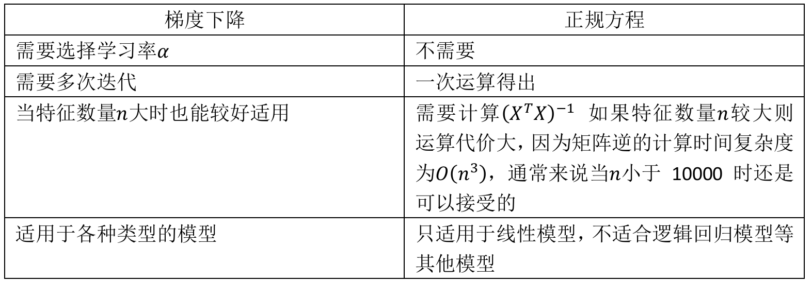
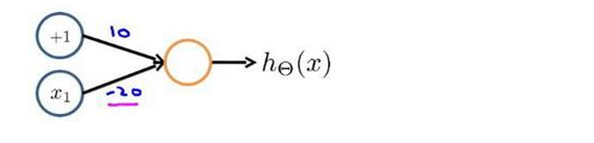
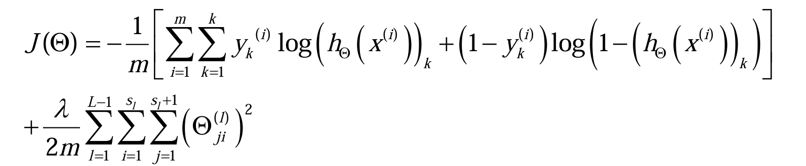
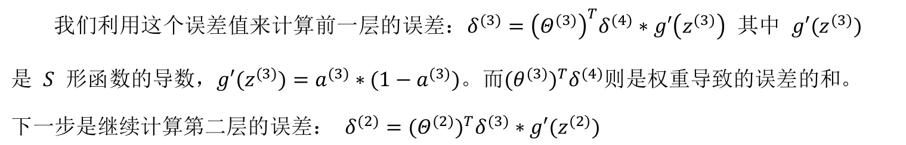

# 机器学习


<div style="position: relative; width: 100%; height: 100%; padding-bottom: 75%;">
<iframe src="//player.bilibili.com/player.html?isOutside=true&aid=1452356519&bvid=BV1Bq421A74G&cid=1482500837&p=1" scrolling="no" border="0" frameborder="no" framespacing="0" allowfullscreen="true" style="position:absolute;width: 100%; height: 100%"></iframe>
</div>


## 监督学习（Supervised Learning）

### 回归Regression

从input到output的映射算法

通过输入input和预期的output来训练模型

​	

> 我们应用学习算法，可以在这组数据中画一条直线，或者换句话说，**拟合**一条直线，根据这条线我们可以推测出，这套房子可能卖150,000。
>
> 又或许，我们不用直线拟合这些数据，用二次方程去拟合可能效果会更好。根据二次方程的曲线，我们可以从这个点推测出，这套房子能卖接近200,000。

可以看出，监督学习指的就是我们给学习算法一个**数据集**。这个数据集由“**正确答案（label）**”组成。在房价的例子中，我们给了一系列房子的数据，我们给定数据集中每个样本的正确价格，即它们实际的售价。然后运用学习算法，算出更多的正确答案。

用术语来讲，这叫做**回归**（**Regression**）问题。

### 分类Classification

​	

> 假设说你想通过查看病历来推测乳腺癌良性与否，如果是恶性则记为1，不是恶性，或者说良性记为0。

用术语来讲，这是一个**分类**（**Classification**）问题。

分类指的是，我们试着推测出离散的输出值：0或1，良性或恶性，而事实上在分类问题中，输出可能不止两个值。

比如说可能有三种乳腺癌，所以你希望预测离散输出 0、1、2、3。现在我用不同的符号来表示这些数据。良性的肿瘤改成用 O 表示，恶性的继续用 X 表示。

​	

> 特征可能不止一两种，在其他机器学习问题中，我们通常有更多的特征。上图中列举了总共5种不同的特征，坐标轴上的两种和右边的3种。我们以后会讲一个算法，叫**支持向量机**，里面有一个巧妙的数学技巧，能让计算机处理无限多个特征。

## 无监督学习（Unsupervised Learning）

### 聚类算法（clustering algorithm）

对于监督学习里的每条数据，我们已经清楚地知道，训练集对应的正确答案。

​	

> 如图表所示，监督学习的数据集中每条数据都已经标明是阴性或阳性，即是良性或恶性肿瘤。

而在无监督学习中，我们已知的数据。看上去有点不一样，不同于监督学习的数据的样子，即**无监督学习中没有任何的标签**或者是**有相同的标签**。

在上图中，无监督学习算法可能会把这些数据分成两个不同的簇。所以叫做**聚类算法（clustering algorithm）**。

​	

> 上图是一个DNA微观数据的例子，行代表基因类型，列代表不同个体。

技术上，你要分析多少特定基因已经表达。所以这些颜色，红，绿，灰等等颜色，这些颜色展示了相应的程度，即不同的个体是否有着一个特定的基因。你能做的就是运行一个聚类算法，把个体聚类到不同的类或不同类型的组（人）。

我们没有提前告知算法一些信息，比如，这是第一类的人，那些是第二类的人，还有第三类，等等。我不知道数据里面有什么。我不知道谁是什么类型。我甚至不知道人们有哪些不同的类型，这些类型又是什么。但你能自动地找到数据中的结构吗？就是说你要**自动地聚类那些个体到各个类**。因为我们没有给算法正确答案来回应数据集中的数据，所 以这就是无监督学习。

### 无监督学习的应用

用于组织大型计算机集群：让那些机器协同工作

社交网络的分析：自动地给出朋友的分组

市场分割：自动地发现市场分类，并自动地把顾客划分到不同的细分市场中

**鸡尾酒宴问题**：多人同时在聊天，声音彼此重叠，通过算法区分出两个音频资源， 这两个可以合成或合并成之前的录音

​	

# 线性回归算法

## 单变量线性回归

我们将数据以及数据的“正确答案”称为训练集，用小写的𝑚来表示训练样本的数目

以之前的房屋交易问题为例，假使我们回归问题的训练集（Training Set）如下表所示： 

​	

$m$ 代表训练集中实例的数量

$x$ 代表特征/输入变量

$y$ 代表目标变量/输出变量

$(x,y)$ 代表训练集中的实例

$(x^{(i)},y^{(i)})$ 代表第𝑖个观察实例

$h$ 代表学习算法的解决方案或函数，也称为**假设（hypothesis）** 

​	

这就是一个监督学习算法的工作方式，我们可以看到这里有我们的训练集里房屋价格，我们把它喂给我们的学习算法，学习算法工作了，然后输出一个函数，通常表示为小写 ℎ  表示。ℎ 代表hypothesis(假设)，表示一个函数，输入是房屋尺寸大小。因此 ℎ 根据输入的 𝑥值来得出 𝑦 值，𝑦 值对应房子的价格。因此，**ℎ 是一个从𝑥到𝑦的函数映射。**

我们该如何表达ℎ呢？

一种可能的表达方式为：
$$
ℎ_𝜃(𝑥)=𝜃_0+𝜃_1𝑥
$$
因为**只含有一个特征/输入变量**，因此这样的问题叫作**单变量线性回归**问题。

## 代价函数（Cost Function）

在定义了上述的单变量线性回归表达式后，首要的问题是选择合适的**参数（parameters）**$\theta_0$和$\theta_1$。

我们选择的参数决定了我们得到的直线相对于我们的训练集的准确程度，模型所预测的值与训练集中实际值之间的差距（下图中蓝线所指）就是**建模误差（modeling error）**。

​	

我们的目标便是选择出可以使得**建模误差的平方和**能够最小的模型参数。 即使得**代价函数**

​	**最小**。

我们绘制一个等高线图，三个坐标分别为$𝜃_0$和$𝜃_1$和$𝐽(𝜃_0,𝜃_1)$：

​	

可以发现三维空间中存在一个使$𝐽(𝜃_0,𝜃_1)$最小的点

代价函数也被称作**平方误差函数**，有时也被称为平方误差代价函数。

## 梯度下降（Gradient Descent）

梯度下降是一个用来**求函数最小值**的算法，我们将使用梯度下降算法来求出代价函数$𝐽(𝜃_0,𝜃_1)$的最小值。

**梯度下降背后的思想是**：开始时我们**随机选择**一个参数的组合($𝜃_0,𝜃_1,......,𝜃_𝑛$)，计算代价函数，然后我们寻找下一个能让代价函数值下降最多的参数组合。我们持续这么做直到到到一个**局部最小值（local minimum）**，因为我们并没有尝试完所有的参数组合，所以不能确定我们得到的局部最小值是否便是**全局最小值（global minimum）**，**选择不同的初始参数组合，可能会找到不同的局部最小值。**

​	

**批量梯度下降**（batch gradient descent）算法的公式为：

​	

> 微积分的知识：这里实际上是在求$𝐽(𝜃_0,𝜃_1)$对于($\theta_0$,$\theta_1$)的**偏导数**

其中𝑎是**学习率（learning rate）**，它决定了我们沿着能让代价函数下降程度最大的方向**向下迈出的步子有多大**，在批量梯度下降中，我们每一次都**同时让所有的参数减去学习速率乘以代价函数的导数**。

梯度下降通过计算代价函数关于参数$(θ_0,θ_1)$的**梯度**（即偏导数），并沿**梯度反方向**更新参数，逐步逼近代价函数的最小值。

## 梯度下降的直观理解

​	

对于这个问题，求导的目的，基本上可以说取这个红点的切线，就是这样一条红色的直线，刚好与函数相切于这一点，让我们看看这条红色直线的斜率，就是这条刚好与函数曲线相切的这条直线，这条直线的斜率正好是这个三角形的高度除以这个水平长度，现在，这条线有一个正斜率，也就是说它有正导数，因此，我得到的新的$𝜃_1$，$𝜃_1$更新后等于$𝜃_1$减去一个正数乘以𝑎。

​	如果𝑎太小了，即我的学习速率太小，结果就是只能这样像小宝宝一样一点点地挪动， 去努力接近最低点，这样就需要很多步才能到达最低点，所以如果𝑎太小的话，可能会很慢，因为它会一点点挪动，它会需要很多步才能到达全局最低点。  

​	如果𝑎太大，那么梯度下降法可能会越过最低点，甚至可能无法收敛，下一次迭代又移动了一大步，越过一次，又越过一次，一次次越过最低点，直到你发现实际上离最低点越来越远，所以，如果𝑎太大，它会导致无法收敛，甚至发散。

> 如果我们预先把$𝜃_1$放在一个局部的最低点，你认为下一步梯度下降法会怎样工作？
>
> 局部最优点的导数将等于零,使得$𝜃_1$不再改变

​	

​	在这个例子里，我想找到它的最小值，首先初始化我的梯度下降算法，在那个品红色的点初始化。随着我接近最低点，我的导数越来越接近零，所以，梯度下降一步后，新的导数会变小一点点。然后我想再梯度下降一步，在第一个绿点，我自然会用一个稍微跟刚才在那个品红点时比，再小一点的一步，到了新的红色点，更接近全局最低点了，因此这点的导数会比在绿点时更小。所以，我再进行一步梯度下降时，我的导数项是更小的，$𝜃_1$更新的幅度就会更小。所以随着梯度下降法的运行，你移动的幅度会自动变得越来越小，直到最终移动幅度非常小，你会发现，已经收敛到局部极小值。

​	随着梯度下降，导数值也会越来越小，相应的我每次移动的步长自然而然会变小，所以不需要额外修改$\alpha$

==于是，结合单变量线性回归、代价函数、梯度下降的学习，我们得出了第一种机器学习算法，即线性回归算法。==

## 梯度下降的线性回归

我们将上述的线性回归算法、代价函数、梯度下降的公式合并，得到：


**”批量梯度下降”**，指的是在梯度下降的每一步中，我们都用到了所有的训练样本，在梯度下降中，在计算微分求导项时，我们需要进行求和运算。

因此，批量梯度下降法这个名字说明了我们需要考虑所有这一"批"训练样本，而事实上，有时也有其他类型的梯度下降法，不是这种"批量"型的，不考虑整个的训练集，而是每次只关注训练集中的一些小的子集。

# 多变量线性回归

## 多维特征

目前为止，我们探讨了单变量/特征的回归模型，现在我们对房价模型增加更多的特征， 例如房间数楼层等，构成一个含有多个变量的模型，模型中的特征为$(𝑥_1,𝑥_2,...,𝑥_𝑛)$。

​	

增添更多特征后，我们引入一系列新的注释：

$n$ 代表特征的数量 .

$x^ {(𝑖)}$代表第 𝑖 个训练实例，是**特征矩阵中的第𝑖行**，是一个**向量（vector）**。

$x_𝑗^{(𝑖)}$代表特征矩阵中第 𝑖 行的第 𝑗 个特征，也就是第 𝑖 个训练实例的第 𝑗 个特征。 

支持多变量的假设 ℎ 表示为：
$$
ℎ_𝜃(𝑥)=𝜃_0x_0+𝜃_1𝑥_1+𝜃_2𝑥_2+...+𝜃_𝑛𝑥_𝑛
$$
这里$x_0$就是1。

此时模型中的参数是一个$𝑛+1$维的向量，任何一个训练实例也都是$𝑛+1$维的向量，特征矩阵𝑋的维度是$ 𝑚∗(𝑛+1)$。 因此公式可以简化为：$ℎ_𝜃(𝑥)=𝜃^𝑇𝑋$，其中上标$𝑇$代表矩阵转置。

## 多变量梯度下降

与单变量线性回归类似，在多变量线性回归中，我们也构建一个代价函数，则这个代价函数是所有建模误差的平方和，即：


其中：$ℎ_𝜃(𝑥)=𝜃^𝑇𝑋 =𝜃_0+𝜃_1𝑥_1+𝜃_2𝑥_2+...+𝜃_𝑛𝑥_𝑛 $，

我们的目标和单变量线性回归问题中一样，是要找出使得代价函数最小的一系列参数。

**多变量线性回归的批量梯度下降算法**为：

​	

求导数后得到：

​	

我们开始随机选择一系列的参数值，计算所有的预测结果后，再给所有的参数一个新的值，如此循环直到收敛。

```python
def computeCost(X, y, theta): 
	inner = np.power(((X * theta.T) - y), 2) 
	return np.sum(inner) / (2 * len(X))
```

## 梯度下降法实践

### 特征缩放

在我们面对多维特征问题的时候，我们要保证这些特征都具有相近的尺度，这将帮助梯度下降算法更快地收敛。

以房价问题为例，假设我们使用两个特征，房屋的尺寸和房间的数量，尺寸的值为 0-2000 平方英尺，而房间数量的值则是0-5，以两个参数分别为横纵坐标，绘制代价函数的等高线图，能看出图像会显得很扁，梯度下降算法需要非常多次的迭代才能收敛。 

​	

解决的方法是尝试将所有特征的尺度都尽量缩放到-1到1之间。如图：

​	

最简单的方法是令：$𝑥_𝑛=\frac{𝑥_𝑛−𝜇_𝑛}{𝑠_𝑛}$ ，其中 $𝜇_𝑛$是平均值，$𝑠_𝑛$是标准差。

### 学习率

梯度下降算法的每次迭代受到学习率的影响，如果学习率𝑎过小，则达到收敛所需的迭代次数会非常高；如果学习率𝑎过大，每次迭代可能不会减小代价函数，可能会越过局部最小值导致无法收敛。

通常可以考虑尝试这些学习率：
$$
\alpha =0.01，0.03，0.1，0.3，1，3，10
$$

## 特征和多项式回归

如房价预测问题，

​	

线性回归并不适用于所有数据，有时我们需要曲线来适应我们的数据，比如一个二次方模型：
$$
ℎ_𝜃(𝑥)=𝜃_0+𝜃_1𝑥_1+𝜃_2𝑥_2^2  
$$
或者三次方模型：
$$
ℎ_𝜃(𝑥)=𝜃_0+𝜃_1𝑥_1+𝜃_2𝑥_2^2+𝜃_3𝑥_3^3
$$
​	

通常我们需要先观察数据然后再决定准备尝试怎样的模型。另外，我们可以令：  $x_2 =𝑥_2^2,𝑥_3 = 𝑥_3^3$，从而将模型转化为线性回归模型。 如上图，我们可以使：
$$
ℎ_𝜃(𝑥) = 𝜃_0 +𝜃_1(𝑠𝑖𝑧𝑒)+𝜃_2(𝑠𝑖𝑧𝑒)^2
$$
或者：
$$
ℎ_𝜃(𝑥) = 𝜃_0 +𝜃_1(𝑠𝑖𝑧𝑒)+𝜃_2\sqrt{𝑠𝑖𝑧𝑒}
$$

> 如果我们采用多项式回归模型，在运行梯度下降算法前，特征缩放非常有必要。

## 正规方程Normal Equation

到目前为止，我们都在使用梯度下降算法，但是对于某些线性回归问题，正规方程方法是更好的解决方案。如：

​	

正规方程是通过求解下面的方程来找出使得代价函数最小的参数的:
$$
\frac{\partial}{\partial \theta_j} J(\theta_j)=0
$$
而代价函数的矩阵形式为：
$$
J(θ)= \frac{1}{2m}
 (Xθ−y) ^⊤
 (Xθ−y)
$$
对其求偏导并使导数为0得：
$$
X ^⊤Xθ=X ^⊤y
$$
假设我们的训练集特征矩阵为 𝑋（包含了 $𝑥_0=1$）并且我们的训练集结果为向量 𝑦，则利用正规方程解出向量 $𝜃=(𝑋^𝑇𝑋)^{−1}𝑋^𝑇𝑦$ 。

以下表示数据为例：

​	

运用正规方程方法求解参数： 

​	

> 对于那些不可逆的矩阵（通常是因为特征之间不独立，如同时包含英尺为单位的尺寸和米为单位的尺寸两个特征，也有可能是特征数量大于训练集的数量），正规方程方法是不能用的。



总结一下，只要特征变量的数目并不大，标准方程是一个很好的计算参数𝜃的替代方法。 具体地说，只要特征变量数量小于一万，我们通常使用标准方程法，而不使用梯度下降法。

```python
import numpy as np 
def normalEqn(X, y): 
	theta = np.linalg.inv(X.T@X)@X.T@y #X.T@X 等价于 X.T.dot(X) 
	return theta 
```

# 逻辑回归

## 分类问题

在分类问题中，你要预测的变量 𝑦 是离散的值，我们将学习一种叫做**逻辑回归 (Logistic  Regression)** 的算法，这是目前最流行使用最广泛的一种学习算法。

我们从二元的分类问题开始讨论。

我们将因变量(dependent variable)可能属于的两个类分别称为负向类（negative class） 和正向类（positive class），则因变量 $y \in 0, 1$ ，其中 0 表示负向类，1 表示正向类。

如果我们要用线性回归算法来解决一个分类问题，对于分类， 𝑦 取值为0或者1，但 如果你使用的是线性回归，那么假设函数的输出值可能远大于1，或者远小于0，即使所有训练样本的标签 𝑦 都等于0或1。尽管我们知道标签应该取值0或者1，但是如果算法得到的值远大于1或者远小于0的话，就会感觉很奇怪。所以我们在接下来的要研究的算法就叫做逻辑回归算法，这个算法的性质是：它的输出值永远在0到 1 之间。

有时候可能因为这个算法的名字中出现了“回归”使你感到困惑，但**逻辑回归算法实际上是一种分类算法**，它适用于标签 𝑦 取值离散的情况

## 逻辑回归的假说表示

此前我们说过，希望我们的分类器的输出值在0和1之间，因此，我们希望想出一个满足某个性质的假设函数，这个性质是它的预测值要在0和1之间。

逻辑回归模型的假设是：
$$
 ℎ_𝜃(𝑥)=𝑔(𝜃^𝑇𝑋)  
$$
其中： 𝑋  代表特征向量 𝑔  代表**逻辑函数（logistic function)**，是一个常用的逻辑函数，为 S 形函数（Sigmoid function），公式为：
$$
g(z) = \frac{1}{1+e^{-z}}
$$

```python
import numpy as np 
def sigmoid(z): 
	return 1 / (1 + np.exp(-z)) 
```

​	

$ℎ_𝜃(𝑥)$的作用是，对于给定的输入变量，根据选择的参数计算**输出变量=1的可能性** （estimated probablity）即$ℎ_𝜃(𝑥) = 𝑃(𝑦 = 1|𝑥;𝜃)  $

例如，如果对于给定的𝑥，通过已经确定的参数计算得出$ℎ_𝜃(𝑥)=0.7$，则表示有70%的几率𝑦为正向类，相应地𝑦为负向类的几率为1-0.7=0.3。 

## 逻辑回归的边界判定

现在讲下**决策边界**(decision boundary)的概念。这个概念能更好地帮助我们理解逻辑回归的假设函数在计算什么。

​	

> 在逻辑回归中，我们预测：  当$ℎ_𝜃(𝑥) >= 0.5$时，预测 𝑦=1。  当$ℎ_𝜃(𝑥) < 0.5$时，预测 𝑦=0 。  
>
> 根据上面绘制出的 S 形函数图像，我们知道
>
> 当 z =0 时 𝑔(𝑧)=0.5  
>
> z >0 时 𝑔(𝑧)>0.5  
>
> z <0 时 𝑔(𝑧)<0.5  
>
> 又 $𝑧=𝜃^𝑇𝑥$ ，即：  
>
> $𝜃^𝑇𝑥$ >=0 时，预测 𝑦=1  
>
> $𝜃^𝑇𝑥$ < 0 时，预测 𝑦=0 

现在假设我们有一个模型：

​	

并且参数𝜃是向量[-3,1,1]。 则当$−3+𝑥_1+𝑥_2≥0$，即$𝑥_1+𝑥_2≥3$时，模型将预测 𝑦= 1。 我们可以绘制直线$𝑥_1+𝑥_2=3$，这条线便是我们模型的分界线，将预测为1的区域和预测为0的区域分隔开。 

假使我们的数据呈现这样的分布情况，怎样的模型才能适合呢？

​	

因为需要用曲线才能分隔 𝑦=0  的区域和 𝑦=1 的区域，我们需要二次方特征： $ℎ_𝜃(𝑥) = 𝑔(𝜃_0 +𝜃_1𝑥_1 +𝜃_2𝑥_2 +𝜃_3𝑥_1^2 +𝜃_4𝑥_2^2)$，𝜃是[-1,0,0,1,1]，则我们得到的判定边界恰好是圆点在原点且半径为1的圆形。 

我们可以用非常复杂的模型来适应非常复杂形状的判定边界。 

## 逻辑回归的代价函数

对于线性回归模型，我们定义的代价函数是所有模型误差的平方和。理论上来说，我们也可以对逻辑回归模型沿用这个定义，但是问题在于，当我们将$ℎ_𝜃(𝑥)=\frac{1}{1+𝑒^{−𝜃^𝑇}𝑋}$ 带入到这样定义了的代价函数中时，我们得到的代价函数将是一个**非凸函数**（non-convexfunction）。

​	

这意味着我们的代价函数有许多局部最小值，这将影响梯度下降算法寻找全局最小值。

​	

​	

这样构建的$𝐶𝑜𝑠𝑡(ℎ_𝜃(𝑥),𝑦)$函数的特点是：

当实际的 𝑦=1 且$ℎ_𝜃(𝑥)$也为 1 时，误差为0； 当 𝑦=1 但$ℎ_𝜃(𝑥)$不为1时误差随着$ℎ_𝜃(𝑥)$变小而变大；

当实际的 𝑦=0 且$ℎ_𝜃(𝑥)$也为 0 时代价为 0； 当𝑦=0 但$ℎ_𝜃(𝑥)$不为0时误差随着 $ℎ_𝜃(𝑥)$的变大而变大。

​	

```python
import numpy as np 
def cost(theta, X, y): 
	theta = np.matrix(theta) 
	X = np.matrix(X) 
	y = np.matrix(y) 
	first = np.multiply(-y, np.log(sigmoid(X* theta.T))) 
	second = np.multiply((1 - y), np.log(1 - sigmoid(X* theta.T))) 
	return np.sum(first - second) / (len(X)) 
```

在得到这样一个代价函数以后，我们便可以用梯度下降算法来求得能使代价函数最小的参数了。算法为：

​	

> 推导过程：
>
> ​	
>
> 虽然得到的梯度下降算法表面上看上去与线性回归的梯度下降算法一样，但是这里的$ℎ𝜃(𝑥)=𝑔(𝜃^𝑇𝑋)$与线性回归中不同，所以实际上是不一样的。另外，在运行梯度下降算法之前，进行特征缩放依旧是非常必要的。

一些梯度下降算法之外的选择： 除了梯度下降算法以外，还有一些常被用来令代价函数最小的算法，这些算法更加复杂和优越，而且通常不需要人工选择学习率，通常比梯度下降算法要更加快速。这些算法有：**共轭梯度**（Conjugate Gradient），**局部优化法**(Broyden fletcher goldfarb shann,BFGS)和**有限内存局部优化法**(LBFGS)

## 简化的成本函数和梯度下降

## 高级优化

## 多类别分类：一对多

# 正则化

## 过拟合的问题

到现在为止，我们已经学习了几种不同的学习算法，包括线性回归和逻辑回归，它们能够有效地解决许多问题，但是当将它们应用到某些特定的机器学习应用时，会遇到**过拟合** (over-fitting)的问题，可能会导致它们效果很差。


第一个模型是一个线性模型，**欠拟合**，不能很好地适应我们的训练集；第三个模型是一个四次方的模型，过于强调拟合原始数据，而丢失了算法的本质：预测新数据。我们可以看出，若给出一个新的值使之预测，它将表现的很差，是**过拟合**，虽然能非常好地适应我们的训练集但在新输入变量进行预测时可能会效果不好；而中间的模型似乎最合适。

分类问题中也存在这样的问题：


问题是，如果我们发现了过拟合问题，应该如何处理？

1. **丢弃一些不能帮助我们正确预测的特征**。可以是手工选择保留哪些特征，或者使用一些模型选择的算法来帮忙（例如PCA）
2. **正则化**。 保留所有的特征，但是减少参数的大小（magnitude）。 

## 正则化代价函数

## 正则化线性回归

## 正则化的逻辑回归模型

# 神经网络

## 非线性假设

我们之前学的，无论是线性回归还是逻辑回归都有这样一个缺点，即：当特征太多时，计算的负荷会非常大。

之前我们已经看到过，使用非线性的多项式项，能够帮助我们建立更好的分类模型。假设我们有非常多的特征，例如大于100个变量，我们希望用这100个特征来构建一个非线性 的多项式模型，结果将是数量非常惊人的特征组合，即便我们只采用两两特征的组合$(𝑥_1𝑥_2+ 𝑥_1𝑥_3 +𝑥_1𝑥_4+...+𝑥_2𝑥_3 +𝑥_2𝑥_4+...+𝑥_{99}𝑥_{100})$，我们也会有接近 5000 个组合而成的特征。这对于一般的逻辑回归来说需要计算的特征太多了。

假设我们希望训练一个模型来识别视觉对象（例如识别一张图片上是否是一辆汽车）， 我们怎样才能这么做呢？一种方法是我们利用很多汽车的图片和很多非汽车的图片，然后利用这些图片上一个个像素的值（饱和度或亮度）来作为特征。

假如我们只选用灰度图片，每个像素则只有一个值（而非RGB值），我们可以选取图片上的两个不同位置上的两个像素，然后训练一个逻辑回归算法利用这两个像素的值来判断图片上是否是汽车：


假使我们采用的都是 50x50 像素的小图片，并且我们将所有的像素视为特征，则会有 2500 个特征，如果我们要进一步将两两特征组合构成一个多项式模型，则会有约25002/2个（接近3百万个）特征。普通的逻辑回归模型，不能有效地处理这么多的特征，这时候我们需要**神经网络**。 

## 模型表示

神经网络模型建立在很多**神经元**之上，每一个神经元又是一个个学习模型。这些神经元 （也叫激活单元，activation unit）采纳一些特征作为输出，并且根据本身的模型提供一个输出。下图是一个以逻辑回归模型作为自身学习模型的神经元示例，在神经网络中，参数又可被成为**权重**（weight）。 


1. 其中$𝑥_1, 𝑥_2, 𝑥_3$是输入单元（input units），我们将原始数据输入给它们。 

2. $𝑎_1, 𝑎_2, 𝑎_3$是中间单元，它们负责将数据进行处理，然后呈递到下一层。

3. 最后是输出单元，它负责计算ℎ𝜃(𝑥)。

神经网络模型是许多逻辑单元按照不同层级组织起来的网络，每一层的输出变量都是下一层的输入变量。下图为一个3层的神经网络，**第一层成为输入层（Input Layer），最后一层称为输出层（Output Layer），中间一层成为隐藏层（Hidden Layers）**。我们为每一层都增加一个**偏差单位**（bias unit）：

​	

下面引入一些标记法来帮助描述模型：
$a_{i}^{\left( j \right)}$ 代表第$j$ 层的第 $i$ 个激活单元。${\theta }^{\left( j \right)}$代表从第 $j$ 层映射到第$ j+1$ 层时的权重的矩阵，例如${\theta }^{\left( 1 \right)}$代表从第一层映射到第二层的权重的矩阵。其尺寸为：以第 $j+1$层的激活单元数量为行数，以第 $j$ 层的激活单元数加一为列数的矩阵。例如：上图所示的神经网络中${\theta }^{\left( 1 \right)}$的尺寸为 3*4。


上面进行的讨论中只是将特征矩阵中的一行（一个训练实例）喂给了神经网络，我们需要将整个训练集都喂给我们的神经网络算法来学习模型。

我们可以知道：每一个$a$都是由上一层所有的$x$和每一个$x$所对应的决定的。

（我们把这样从左到右的算法称为前向传播算法( **FORWARD PROPAGATION** )）

把$x$, $\theta$, $a$ 分别用矩阵表示：

我们可以得到$\theta \cdot X=a$ 。

( **FORWARD PROPAGATION** )
相对于使用循环来编码，利用向量化的方法会使得计算更为简便。以上面的神经网络为例，试着计算第二层的值：


我们令 ${z}^{\left( 2 \right)}={\theta }^{\left( 1 \right)}x$，则 ${a}^{\left( 2 \right)}=g({z}^{\left( 2 \right)})$ ，计算后添加 $a_{0}^{\left( 2 \right)}=1$。 计算输出的值为：


我们令 ${z}^{\left( 3 \right)}={\theta }^{\left( 2 \right)}{a}^{\left( 2 \right)}$，则 $h_\theta(x)={a}^{\left( 3 \right)}=g({z}^{\left( 3 \right)})$。
这只是针对训练集中一个训练实例所进行的计算。如果我们要对整个训练集进行计算，我们需要将训练集特征矩阵进行转置，使得同一个实例的特征都在同一列里。即：
${z}^{\left( 2 \right)}={\Theta }^{\left( 1 \right)}\times {X}^{T} $
${a}^{\left( 2 \right)}=g({z}^{\left( 2 \right)})$

为了更好了了解**Neuron Networks**的工作原理，我们先把左半部分遮住：


右半部分其实就是以$a_0, a_1, a_2, a_3$, 按照**Logistic Regression**的方式输出$h_\theta(x)$：


其实神经网络就像是**logistic regression**，只不过我们把**logistic regression**中的输入向量$\left[ x_1\sim {x_3} \right]$ 变成了中间层的$\left[ a_1^{(2)}\sim a_3^{(2)} \right]$, 即: 
 
我们可以把$a_0, a_1, a_2, a_3$看成更为高级的特征值，也就是$x_0, x_1, x_2, x_3$的进化体，并且它们是由 $x$与$\theta$决定的，因为是梯度下降的，所以$a$是变化的，并且变得越来越厉害，所以这些更高级的特征值远比仅仅将 $x$次方厉害，也能更好的预测新数据。
这就是神经网络相比于逻辑回归和线性回归的优势。

## 特征和直观理解

从本质上讲，神经网络能够通过学习得出其自身的一系列特征。在普通的逻辑回归中，我们被限制为使用数据中的原始特征$𝑥_1,𝑥_2,...,𝑥_𝑛$，我们虽然可以使用一些二项式项来组合这些特征，但是我们仍然受到这些原始特征的限制。在神经网络中，原始特征只是输入层，在我们上面三层的神经网络例子中，第三层也就是输出层做出的预测利用的是第二层的特征，而非输入层中的原始特征，我们可以认为第二层中的特征是神经网络通过学习后自己得出的一系列用于预测输出变量的新特征。

神经网络中，**单层神经元**（无中间层）的计算可用来表示**逻辑运算**，比如逻辑与(AND)、逻辑或(OR)。

举例说明：逻辑与(AND)；下图中左半部分是神经网络的设计与output层表达式，右边上部分是sigmod函数，下半部分是真值表。我们可以用这样的一个神经网络表示AND 函数：


其中$𝜃_0 =−30,𝜃_1 =20,𝜃_2 = 20$ 我们的输出函数ℎ𝜃(𝑥)即为：$ℎ_𝛩(𝑥)=𝑔(−30+20𝑥_1+ 20𝑥_2)$


我们知道𝑔(𝑥)的图像是：


所以我们有：$ℎ_𝛩(𝑥)≈x_1AND x_2$

接下来再介绍一个OR函数：


OR 与AND整体一样，区别只在于取值不同。

还有逻辑非（NOT）:


## 样本和直观理解

我们可以利用神经元来组合成更为复杂的神经网络以实现更复杂的运算。例如我们要实现XNOR 功能（输入的两个值必须一样，均为1或均为0），即：
$$
XNOR =(x_1 AND x_2) OR((NOT x_1)AND(NOT x_2))
$$
首先构造一个能表达$(NOT x_1)AND(NOT x_2)$部分的神经元：


然后将表示 AND 的神经元和表示$(NOT x_1)AND(NOT x_2)$的神经元以及表示 OR 的神经元进行组合：


我们就得到了一个能实现 XNOR 运算符功能的神经网络。 

按这种方法我们可以逐渐构造出越来越复杂的函数，也能得到更加厉害的特征值。 

## 多类分类

当我们有不止两种分类时（也就是𝑦=1,2,3….），比如以下这种情况，该怎么办？如果我们要训练一个神经网络算法来识别路人、汽车、摩托车和卡车，在输出层我们应该有4个值。例如，第一个值为1或0用于预测是否是行人，第二个值用于判断是否为汽车。 

输入向量𝑥有三个维度，两个中间层，输出层4个神经元分别用来表示4类，也就是每一个数据在输出层都会出现$[𝑎 \ 𝑏 \ 𝑐 \ 𝑑]^𝑇$，且𝑎,𝑏,𝑐,𝑑中仅有一个为1，表示当前类。下面是该神经网络的可能结构示例：


# 神经网络的学习

## 神经网络代价函数

首先引入一些便于稍后讨论的新标记方法： 

假设神经网络的训练样本有𝑚个，每个包含一组输入𝑥和一组输出信号𝑦，𝐿表示神经网络层数，$𝑆_𝐼$表示每层的neuron个数($𝑆_𝑙$表示输出层神经元个数)，$𝑆_𝐿$代表最后一层中处理单元的个数。

将神经网络的分类定义为两种情况：**二类分类和多类分类**，

- 二类分类：$𝑆_𝐿=0$, $𝑦$ = 0 𝑜𝑟 1 表示哪一类；
- K类分类：$𝑆_𝐿 =𝑘$, $𝑦_𝑖$ = 1 表示分到第i类；(𝑘>2) 

​	

我们回顾逻辑回归问题中我们的代价函数为： 


在逻辑回归中，我们只有一个输出变量，又称标量（scalar），也只有一个因变量𝑦，但是在神经网络中，我们可以有很多输出变量，我们的$ℎ_𝜃(𝑥)$是一个维度为𝐾的向量，并且我们训练集中的因变量也是同样维度的一个向量，因此我们的代价函数会比逻辑回归更加复杂一些，为： 
$$
ℎ_𝜃(𝑥)∈ℝ^𝐾 ，(ℎ_𝜃(𝑥))_𝑖 =𝑖^{𝑡ℎ}output
$$
​	

这个看起来复杂很多的代价函数背后的思想还是一样的，我们希望通过代价函数来观察算法预测的结果与真实情况的误差有多大，唯一不同的是，**对于每一行特征，我们都会给出K个预测**，基本上我们可以利用循环，对每一行特征都预测𝐾个不同结果，然后在利用循环在𝐾个预测中选择可能性最高的一个，将其与𝑦中的实际数据进行比较。

正则化的那一项只是排除了每一层$𝜃_0$后，每一层的$𝜃$矩阵的和。最里层的循环𝑗循环所有的行（由$𝑠_𝑙 +1$ 层的激活单元数决定），循环𝑖则循环所有的列，由该层（$𝑠_𝑙$层）的激活单元数所决定。即：$ℎ_𝜃(𝑥)$与真实值之间的距离为每个样本-每个类输出的加和，对参数进行**regularization**的**bias**项处理所有参数的平方和。 

## 反向传播算法

之前我们在计算神经网络预测结果的时候我们采用了一种正向传播方法，我们从第一层 开始正向一层一层进行计算，直到最后一层的$ℎ_𝜃(𝑥)$。

现在，为了计算代价函数的偏导数，我们需要采用一种反向传播算法，也就是**首先计算最后一层的误差**，**然后再一层一层反向求出各层的误差**，直到倒数第二层。 以一个例子来说明反向传播算法。

假设我们的训练集只有一个实例$(𝑥^{(1)},𝑦^{(1)})$，我们的神经网络是一个四层的神经网络， 其中$𝐾=4，𝑆_𝐿 =4，𝐿=4$：


我们从最后一层的误差开始计算，误差是激活单元的预测$( a_k^{(4)} )$与实际值$(𝑦^𝑘)$之间的误差，$(𝑘=1:𝑘)$。

我们用$𝛿$来表示误差，则：$𝛿^{(4)}=𝑎^{(4)}−𝑦 $


因为第一层是输入变量，不存在误差。我们有了所有的误差的表达式后，便可以计算代价函数的偏导数了，假设𝜆=0，即我们不做任何正则化处理时有：


重要的是清楚地知道上面式子中上下标的含义： 

1. $l$ 代表目前所计算的是第几层。 
2. $j$ 代表目前计算层中的激活单元的下标，也将是下一层的第$𝑗$个输入变量的下标。
3. $𝑖$代表下一层中误差单元的下标，是受到权重矩阵中第$𝑖$行影响的下一层中的误差单元的下标。 

如果我们考虑正则化处理，并且我们的训练集是一个特征矩阵而非向量。在上面的特殊情况中，我们需要计算每一层的误差单元来计算代价函数的偏导数。在更为一般的情况中， 我们同样需要计算每一层的误差单元，但是我们需要为整个训练集计算误差单元，此时的误差单元也是一个矩阵，我们用$𝛥_{𝑖𝑗}^{(𝑙)}$来表示这个误差矩阵。第 𝑙 层的第 𝑖 个激活单元受到第 𝑗 个参数影响而导致的误差。

我们的算法表示为：


即首先用正向传播方法计算出每一层的激活单元，利用训练集的结果与神经网络预测的结果求出最后一层的误差，然后利用该误差运用反向传播法计算出直至第二层的所有误差。

在求出了$𝛥_{𝑖𝑗}^{(𝑙)}$之后，我们便可以计算代价函数的偏导数了，计算方法如下：


## 反向传播算法的直观理解

为了更好地理解反向传播算法，我们再来仔细研究一下前向传播的原理： 


反向传播算法做的是：


## 梯度检验

当我们对一个较为复杂的模型（例如神经网络）使用梯度下降算法时，可能会存在一些不容易察觉的错误，意味着，虽然代价看上去在不断减小，但最终的结果可能并不是最优解。

为了避免这样的问题，我们采取一种叫做**梯度的数值检验**（Numerical Gradient Checking）方法。这种方法的思想是通过估计梯度值来检验我们计算的导数值是否真的是我们要求的。

对梯度的估计采用的方法是在代价函数上沿着切线的方向选择离两个非常近的点然后计算两个点的平均值用以估计梯度。即对于某个特定的$ 𝜃$，我们计算出在 $𝜃-𝜀$ 处和 $𝜃+𝜀 $的代价值（$𝜀$是一个非常小的值，通常选取 0.001），然后求两个代价的平均，用以估计在$ 𝜃 $ 处的代价值。


```python
gradApprox = (J(theta + eps) – J(theta - eps)) / (2*eps) 
```

## 随机初始化

任何优化算法都需要一些初始的参数。到目前为止我们都是初始所有参数为0，这样的初始方法对于逻辑回归来说是可行的，但是对于神经网络来说是不可行的。如果我们令所有的初始参数都为0，这将意味着我们第二层的所有激活单元都会有相同的值。同理，如果我们初始所有的参数都为一个非0的数，结果也是一样的。

我们通常初始参数为正负𝜀之间的随机值，假设我们要随机初始一个尺寸为10×11的参数矩阵，代码如下：

```python
Theta1 = rand(10, 11) * (2*eps) – eps 
```


