# 0. 课程大纲

- 机器学习
  - 线性回归、逻辑回归、k-近邻、朴素贝叶斯、支持向量机、决策树、随机森林、k-Means、主成分分析…
- 深度学习
  - 卷积神经网络、循环神经网络、图神经网络、预训练模型…
- 大语言模型
- 智能软件工程

# 1. 概论

## 1.1 机器学习

### 1.1.1 机器学习定义

机器学习(Machine Learning)是一种通过模型和算法使计算机从数据中自动学习并进行预测、决策或生成内容等的技术。核心目标是让计算机在没有明确编程指令的情况下，通过对大量数据的分析，识别模式和规律，从而构建适应新数据的模型。

一个计算机程序利用经验E来学习任务T，性能是P，如果针对任务T的性能P随着经验E不断增长，则称为机器学习。

### 1.1.2 机器学习分类

按**训练过程是否使用标签**，可分为：

- 监督学习 Supervised Learning
- 无监督学习 Unsupervised Learning
- 半监督学习 Semi-Supervised Learning

> 监督学习是在已知“**正确答案(label)**”的情况下去训练模型，比如已知谁是男谁是女，让机器去学习判断。而非监督学习则是不知道具体标签或者只有相同的标签，没有预设的正确答案，机器只能**自行去划分有几类**。

按**任务类型不同**，可分为：

- 回归 Regression
- 分类 Classification
- 聚类 Clustering
- 降维 Dimensionality Reduction
- 生成 Generation
- …

按**集成策略不同**，可分为：

- 单学习器  Single-Model Learning
- 集成学习器 Ensemble Learning

> 单学习器通常只有一个模型（比如一棵决策树、一个SVM），而集成学习器是由多个模型（基学习器）组合而成

按**模型规模不同**，可分为：

- 小模型 Tiny Models
- 大模型 Large Models

按**应用场景不同**，可分为：

- 异常检测 Anomaly Detection
- 推荐系统 Recommendation Systems
- 信息检索 Information Retrieval
- …

### 1.1.3 数据集划分

- 训练集+测试集=全部数据
- 训练集+验证集+测试集=全部数据

如果数据不够用，可以将数据拆分成多份，每份轮流作为训练集/测试集，迭代n次称为**n折交叉验证**

> 这里的拆分是无序的，不是按顺序拆分

## 1.2 深度学习

深度学习(Deep Learning)是机器学习的一个子集，使用人工神经网络来处理和分析数据。神经网络由计算节点组成，这些节点分布于深度学习算法中的各层。每层都包括输入层、输出层和隐藏层。当神经网络除了输入层和输出层之外还包括多个隐藏层时，便被视为深度神经网络，而深度神经网络是深度学习的基础。 

# 2. 经典机器学习

## 2.1 回归

### 2.1.1 线性回归（建议看我的另一篇机器学习的笔记）

**最小二乘法**

最小二乘法（Least Squares Method）的核心思想是寻找一组参数，使得模型预测值与实际观测值之间的残差平方和（Residual Sum of Squares，RSS） 最小。

**解析解和近似解**

解析解（Analytical Solution）：指可以直接通过严格的数学公式表示出来的解，能够给出任意自变量对应的因变量，从而精确计算出问题的解。

近似解（Approximate Solution）又称数值解（Numerical Solution）：指利用数值方法和计算机通过有限精度的运算得到的结果，其精度在可接受的范围内，但并非精确的、完整的数学表达式。

**梯度下降法**

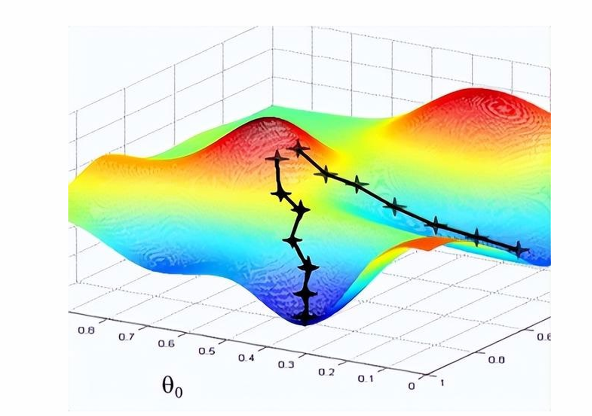

**线性**：**一个函数在数学上被称为线性的，如果它具有可加性和齐次性。**
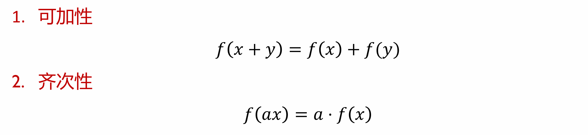

- **可加性体现了“分治”思想**：将一个复杂问题分解成几个更简单的子问题，然后独立解决这些子问题，最后将它们的解相加以获得最终的解。
- **齐次性要求模型具备“扩展性”**：意味着对输入进行某种缩放（乘以一个常数因子）时，输出也会按照相同的比例缩放。该性质有助于模型的扩展性和灵活性，因为基础逻辑和结构在缩放时保持不变。

### 2.1.2 多项式回归

线性回归是对现实问题的抽象和简化，现实问题通常是非线性的，需要用更复杂的多项式来建模。

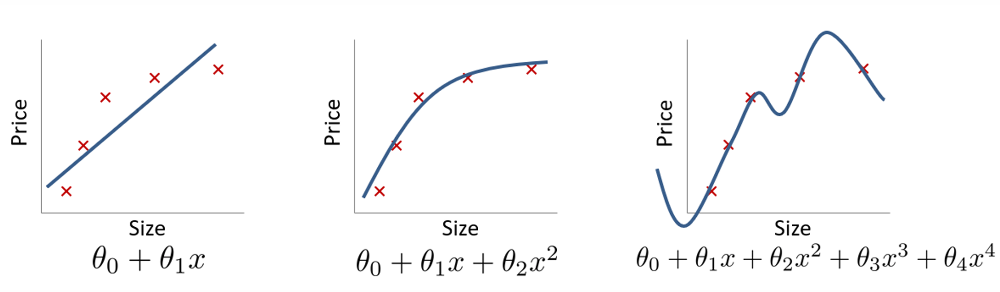

#### 欠拟合与过拟合

- 欠拟合： 指模型在训练集、验证集和测试集上均**表现不佳**的情况。 
- 过拟合： 指模型在训练集上表现很好，到了验证和测试阶段就很差，即模型的**泛化能力很差**。

#### 正则化

正则化（Regularization）是机器学习中对原始损失函数引入额外信息，以防止过拟合和提高模型泛化性的一类方法的统称。形式上即将原目标函数变成： 原始损失函数+额外项（正则项）。

不带正则项的损失函数:
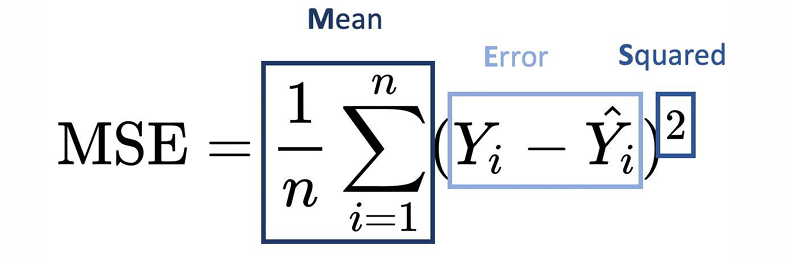

#### L1 正则化（也称为“Lasso回归”）

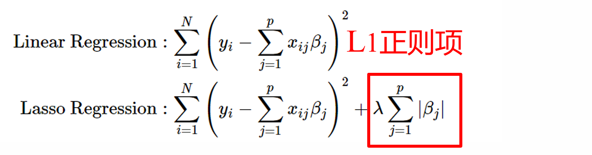

- λ值为0：损失函数将与原来损失函数一样，说明对参数权重β没有任何惩罚。 

- λ为无穷大：在惩罚系数λ无穷大的情况下，为保证整个结构风险函数最小化， 只能通过最小化所有权重系数β达到目的，即通过λ的惩罚降低了参数的权 重值，而在降低参数权重值的同时我们就实现了降低模型复杂度的效果。

L1正则项通过参数的绝对值之和进行约束，倾向于产生稀疏解，即部分参数为零，常用于特征选择，因此可以减少模型的复杂度。**当我们认为特征数量很多，但只有少数特征真正重要时，L1正则化非常有用。**

#### L2 正则化（也称为“岭回归”、“Tikhonov 正则化”）

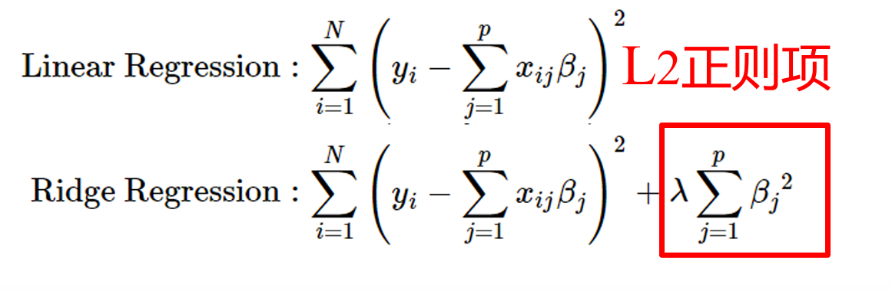

- **惩罚项**：所有模型参数（权重 `w`）的**平方和**。 `Ω(w) = ||w||²₂ = Σ wᵢ²`

L2正则项通过参数平方和进行约束，倾向于生成平滑权重（参数接近零但不为零），常用于防止模型过拟合。

#### 弹性网络回归

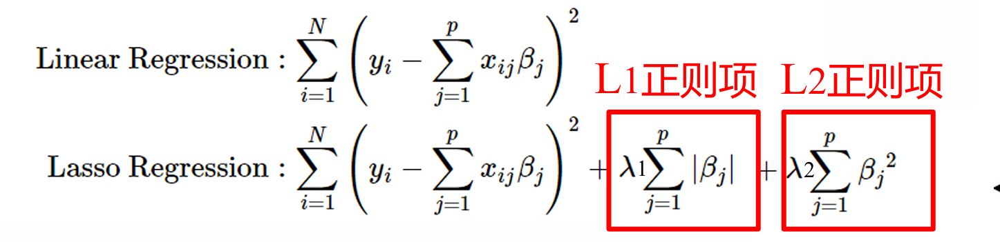

L1正则化和L2正则化的**线性组合**

### 2.1.3 逻辑回归

逻辑（Logistic）回归不是解决“回归”问题，而是**解决“分类”问题**。 那为什么要叫回归？ 

逻辑回归将一组自变量的线性组合“回归”到一个0到1的值，这个值是 “概率”，用来支持分类。

**Sigmoid/Logistic**

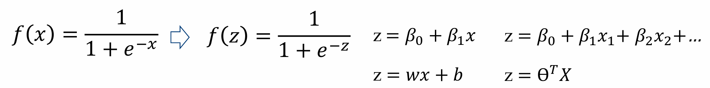

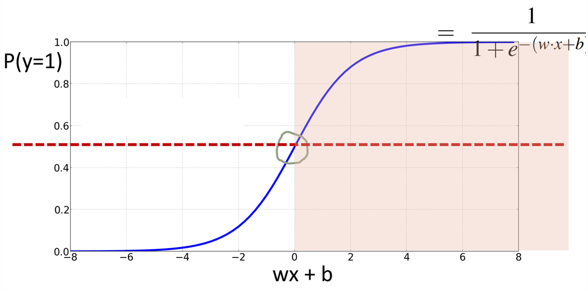

### 2.1.4 评价指标

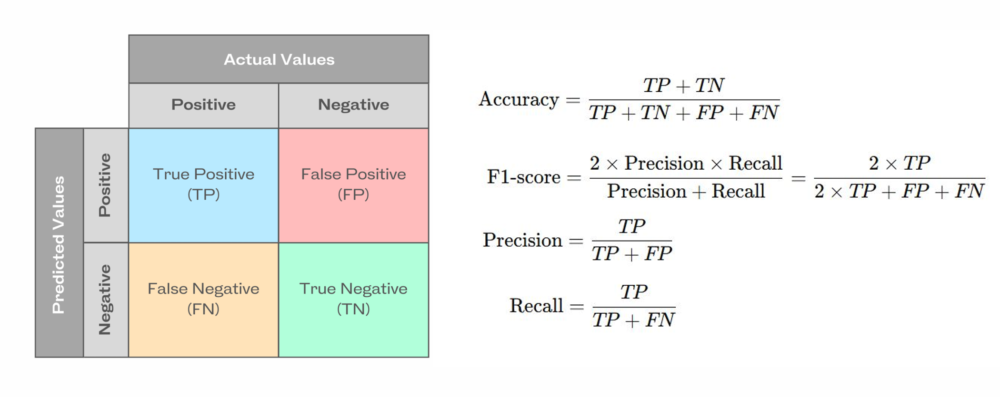

**Accuracy (准确率)**：**所有预测结果中，预测正确的比例**。

**Precision (精确率/查准率)**：**在所有预测为Positive的样本中，有多少是真正的Positive**。

**Recall (召回率/查全率)**：**在所有真实的Positive样本中，模型成功预测出了多少**。

**F1-Score (F1分数)**：**Precision和Recall的调和平均数**。

平均方法：

- 微平均：将所有样本汇总，计算各指标。 
- 宏平均：先针对每一类别计算各指标，再求平均。 
- 加权平均：考虑了权重的宏平均。

## 2.2 k-近邻

k近邻（k-Nearest Neighbor，kNN），即给定已知类别的数据集，对于新的未知实例， 在数据集中找到与该实例最邻近的k个实例 （即k个邻居），这k个实例的多数属于哪个 类，该未知实例就属于这个类。

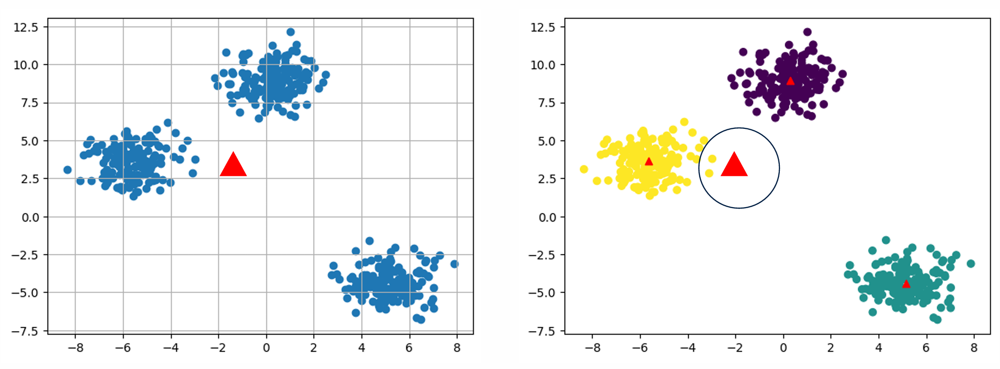

**基本步骤**： 

- Step 1:  确定并获取训练集中的样本的特征值 
- Step 2:  计算训练集中的样本与未知数据之间的距离 
- Step 3:  按距离降序排序，选取与当前点距离最小的k个点 
- Step 4:  计算前k个点所在类别出现的频率 
- Step 5:  以前k个点中出现频率最高的类别作为预测类别

**k值选取**

当k的取值过小时，一旦有噪声将会对预测产生比较大影响，例如取K值为1时，一旦最近一个点是噪声，那么就会出现偏差。k值的减小就意味着整体模型变得复杂，容易发生过拟合。 

当k的值取过大时，相当于用较大邻域中的实例进行预测，学习的近似误差会增大。 这时与输入目标点较远实例也会起作用，使发生错误。k值的增大就意味着整体的模型变得简单。 

k尽量取奇数，以保证在计算结果最后会产生一个较多的类别，如果取偶数可能会产生相等的情况，不利于预测。 

k的取法：常用的方法是从k=1开始，使用检验集估计分类器的误差率。重复该过程， 每次k增加1，选取产生最小误差率的k。

**距离选取**

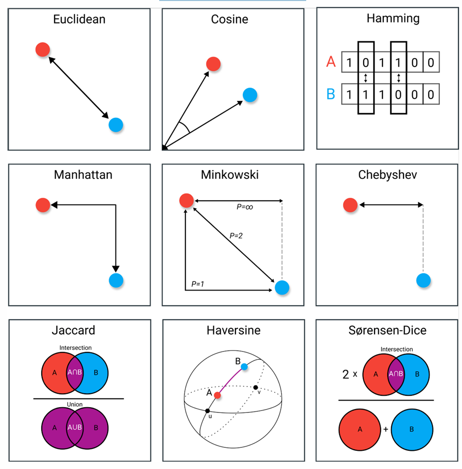

## 2.3 朴素贝叶斯

问题描述： 已知训练集中的样本及对应的类别，问测试集中的样本属于哪一类？ 已知样本特征，问样本属于哪一类？

举例：给定一个事物的各种特征（比如一封信的词汇），判断它最可能属于哪个类别（比如是正常邮件还是垃圾邮件）。

它的核心思路非常符合直觉：**哪个类别的概率大，就选哪个**。

**贝叶斯公式**

贝叶斯定理告诉我们如何利用证据（看到的数据）来更新我们对某个事件发生的信念（概率）。
$$
P(A|B) = \frac{P(AB)}{P(B)} = \frac{P(B|A) \cdot P(A)}{P(B)}
$$
在这个分类的语境下，我们把它“翻译”一下：

- **A** 代表 **类别（Class）**，比如 *C*=“垃圾邮件”或 *C*=“正常邮件”。
- **B** 代表 **特征（Features）**，比如一封邮件包含了“购买”、“优惠券”等词语。我们用*X*表示所有特征的集合，$X=(x_1,x_2,...,x_n)。$

那么公式就变成了：
$$
P(C|X)=\frac{P(X|C) \cdot P(C)}{P(X)}
$$

- $P(C|X)$：**后验概率（Posterior Probability）**。这是我们最终想求的——**在已知邮件包含某些特征X的条件下，它属于类别C的概率是多少**。
- $P(C)$：**先验概率（Prior Probability）**。在根本不知道邮件内容时，我们根据历史经验认为一封邮件是垃圾邮件的**初始概率**。比如100封邮件里有20封是垃圾邮件，那么 *P*(垃圾邮件)=0.2。
- $P(X|C)$：**似然度（Likelihood）**。**如果我们已经知道这是一封垃圾邮件，那么它包含特征 X（比如“购买”这个词）的概率有多大**。
- $P(X)$：**证据（Evidence）**。就是看到特征*X*出现的概率。在实际计算中，由于我们是对比同一个*X*下不同*C*的概率，*P*(*X*)对所有类别都是相同的，可以看作一个常数，所以我们通常忽略它。

**因此，我们的目标就简化成了：找出让 $P(X|C) \cdot P(C)$最大的那个类别 C。**

现在问题来了，特征*X*是一组词，比如 `[“购买”, “优惠券”, “点击”]`。计算 *P*(*X*∣*C*)意味着要计算 **“在垃圾邮件中，同时出现‘购买’、‘优惠券’、‘点击’这三个词的概率”**。

这个计算非常复杂，因为词与词之间可能存在关联（例如，“优惠券”出现时，“购买”也很可能出现）。为了简化计算，**朴素贝叶斯做出了一个强有力的、天真的（Naive）假设**：

> 所有特征（词）在给定类别的条件下，是相互独立的。

也就是说，它认为“购买”这个词在垃圾邮件中出没，跟“优惠券”出没没关系！这个假设在现实中基本不成立，但神奇的是，基于这个假设的模型在很多场景下（尤其是文本分类）效果非常好。

基于这个“朴素”的假设，复杂的联合概率就可以拆解成一个个简单概率的**乘积**：
$$
P(X|C)=P(X_1|C) \cdot P(X_2|C) \cdot \dots
$$
所以，我们最终的**分类器**公式就是：
$$
预测类别 = \text{arg}\text{max}_C[P(C)⋅∏_{i=1}^nP(x_i∣C)]
$$
那么现在，我们可以总结朴素贝叶斯计算的流程了：

- Step1，统计出**先验概率P(C)**和**似然度P(Xi|C)**
- Step2，将先验概率和各似然度相乘
- Step3，改变C，找到使得乘积最大的C
- Step4，C就是目标分类

## 2.4 支持向量机

### 2.4.1 SVM

支持向量机(Support Vector Machine, SVM)的核心思想是寻找一个**最佳超平面(分类器)**，将不同类别的样本尽可能分开。这个超平面与训练样本的距离最大化，从而使得分类器对未知样本具有良好的泛化能力。

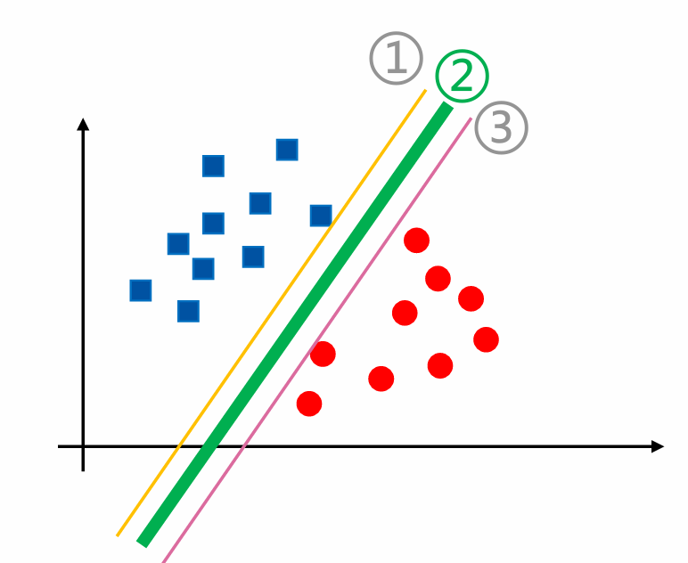

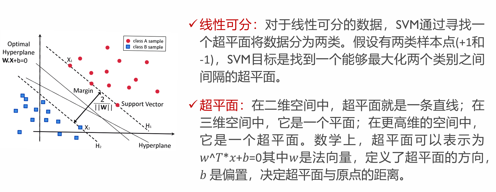

间隔(Margin)：超平面与样本之间的最小距离称为间隔。SVM的目标是找到使这个间隔最大化的超平面。样本距离超平面越远，分类结果越可靠。

支持向量(Support Vector)：那些位于**边界上的样本称为支持向量**。支持向量是定义超平面的关键样本，因为它们决定了最优超平面的具体位置。移除其他样本不会影响分类结果。

SVM旨在找到各类样本到超平面的距离最远的，也就是找到最大间隔超平面。任意超平面可以用下面这个线性方程来描述：
$$
w^Tx+b=0
$$
二维空间点(𝑥,𝑦)到直线A𝑥+𝐵𝑦+𝐶 =0的距离公式是：
$$
d = \frac{|Ax+By+C|}{\sqrt{A^2+B^2}}
$$
扩展到n维空间后，点$𝑥=(𝑥_1,𝑥_2,…𝑥_𝑛)$到超平面$w^T𝑥+𝑏=0$的距离公式是：
$$
\frac{|w^Tx+b|}{||w||},其中 ||w|| = \sqrt{w_1^2+...+w_n^2} 
$$

### 2.4.2 优化问题

**最优化问题**一般是指对于某一个函数而言，求解在其指定作用域上的全局最小值问题，一般分为以下三种情况（备注：以下几种方式求出来的解都可能是局部极小值，只有当函数是凸函数时，才可以得到全局最小值）：

- 无约束条件：求解方式包括梯度下降法、牛顿法、坐标轴下降法等
- 等式约束条件：求解方式一般为拉格朗日乘子法
- 不等式约束条件：求解方式一般为KKT条件

**拉格朗日乘子法**是当优化函数存在等值约束的情况下的一种最优化求解方式。思想是通过引入拉格朗日乘子，将有𝑑个变量和𝑘个约束条件的最优化问题转化为𝑑+𝑘个变量的无约束优化问题求解。其中参数𝛼被称为“拉格朗日乘子”。

### 2.4.3 KKT条件

KKT条件(Karush-Kuhn-Tucker条件)是一组用于判定在有约束优化问题中某个点是否为最优解的必要条件。它扩展了经典的拉格朗日乘子法，能够处理不等式约束。

KKT条件主要包括四个部分： 

- 可行性条件：解必须满足所有原问题的约束条件。 
- 对偶可行性条件：对应不等式约束的拉格朗日乘子必须非负。 
- 互补松弛条件：每个不等式约束与其对应的拉格朗日乘子的乘积为零。 
- 梯度条件：目标函数的梯度与约束函数梯度的线性组合为零。

### 2.4.4 核技巧

核函数(kernel function)：一种通过某非线性变换𝝓(𝑥)，将输入空间映射到高维特征空间的技巧。

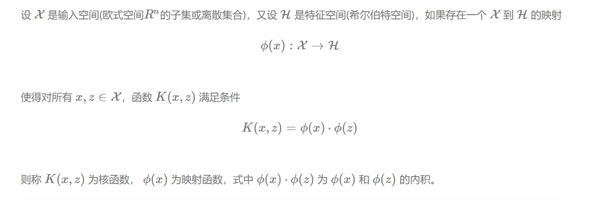

特征空间的维数可能非常高。如果支持向量机的求解只用到内积 运算，而在低维输入空间又存在某个函数𝐾(𝑥,𝑧)，它恰好等于在 高维空间中这个内积，即𝐾(𝑥,𝑧)=𝝓(x)⋅𝝓(z)。那么支持向量机就不用计算复杂的非线性变换，而由这个函数𝐾(𝑥,𝑧)直接得到非线 性变换的内积，从而简化计算。

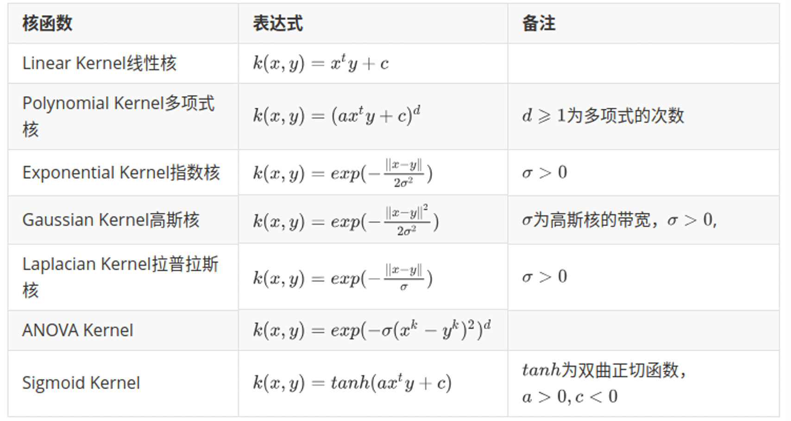

## 2.5 决策树

### 2.5.1 决策树

决策树(Decision Tree)基于树结构进行决策。其核心思想是通过对样本进行一系列的条件判断，将数据集逐步划分成不同的子集， 最终形成一棵决策树。这棵树的每个内部节点是一个属性上的测试，分支是一个测试输出，叶子节点是类别或值。

可以把决策树看为一个if-then规则集合，从根节点到叶子节点就是一条路径，不同路径间服从互斥完备规则。

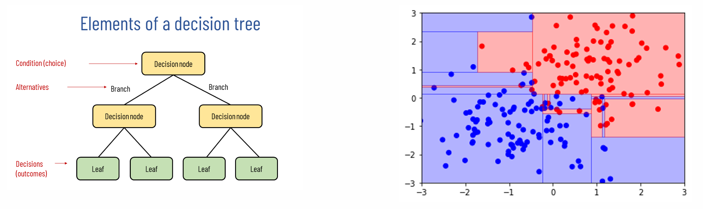

### 2.5.2 熵

**熵**(Entropy)可以用来量化随机变量的不确定性。假设𝑋是一个取有限个值的离散随机变量，其概率分布为：
$$
P(X=x_i)=p_i,i=1,2...n
$$
则随机变量𝑋的熵定义为：
$$
H(x)=-\sum^n_{i=1}p_i \log p_i
$$
**条件熵**(Conditional Entropy)描述了在已知第二个随机变量𝑋的值 的前提下，随机变量𝑌的熵还有多少。

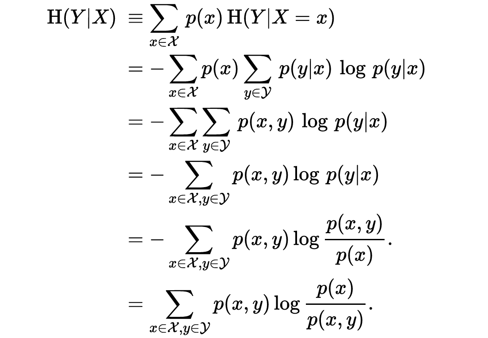

### 2.5.3 ID3

**信息增益**(Information Gain)描述了得知随机变量𝑋的信息而使得随机变量𝑌的信息的不确定性减少的程度。
$$
g(D,A) = H(D) - H(D|A)
$$

ID3算法的核心是根据信息增益来选择进行划分的特征，然后递归地构建决策树。

C4.5算法是对ID3的扩充。与ID3使用信息增益(Information Gain) 不同，C4.5算法使用信息增益比(Information Gain Ratio)来选择分裂节点时使用的特征，解决了ID3偏向于选择可取值较多的特征的问题。

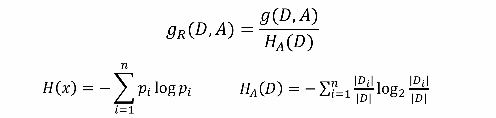

### 2.5.4 CART

CART(Classification And Regression Tree)算法既可以用于分类也可以用于回归。在解决回归问题时，对回归树用平方误差最小化准则；在解决分类问题时，对分类树用基尼指数(Gini index)最小化原则，进行特征选择，生成二叉树。

分类问题中，假设有𝐾个类，样本点属于第𝑘类的概率为$p_k$，则概率分布的基尼指数定义为
$$
Gini(p)=\sum^K_{k=1}p_k(1-p_k)=1-\sum^K_{k=1}p_k^2
$$
表示从数据集中随机抽取两个样本，其类别标记不一致的概率。
$$
Gini(D,A)=\frac{|D_1|}{|D|}Gini(D_1)+\frac{|D_2|}{|D|}Gini(D_2)
$$

### 2.5.5 剪枝

剪枝(pruning)是为了避免决策树模型的过拟合。因为决策树在学习的过程中为了尽可能正确地分类训练样本，不停地对节点进行划分，因此这会导致整棵树的分支过多，也就导致了过拟合。决策树的剪枝策略主要有两种：

- **预剪枝**(pre-pruning) ：在构造树的过程中，先对每个结点在划分前进行估计，若果当前节点的划分不能提升泛化性，则不 对当前节点进行划分，并且将当前节点标记为叶节点。
- **后剪枝**(post-pruning)：先把整棵树构造完毕，然后自底向上的对非叶节点进行考察，若将该节点对应的子树换为叶节点能 够提升泛化性，则把该子树替换为叶节点。

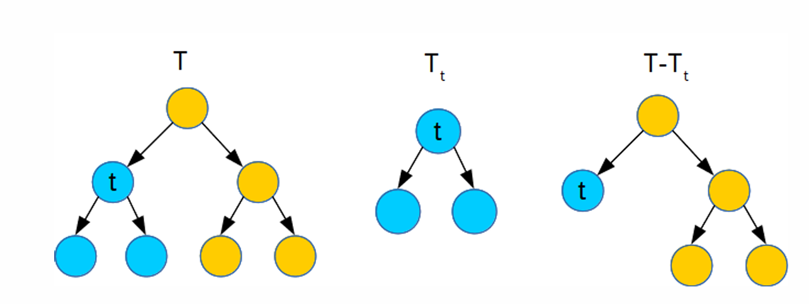

## 2.6 随机森林

### 2.6.1 集成学习

集成学习(Ensemble Learning)通过构建并结合多个学习器来完成学习任务，也被称为基于委员会的学习(Committee-basedLearning)。

**Bagging**使用同类型的学习器，基于自助采样(Bootstrap sampling)，在训练集中对有放回抽样的随机子集训练。对分类任务使用**等权重投票**法，对回归任务使用算术平均法。

> 补充：在统计学中，自助法(Bootstrap Method，Bootstrapping，或自助抽样法)是一种从给定训练集中有放回的均匀抽样， 也就是说，每当选中一个样本，它等可能地被再次选中并被再次添加到训练集中。

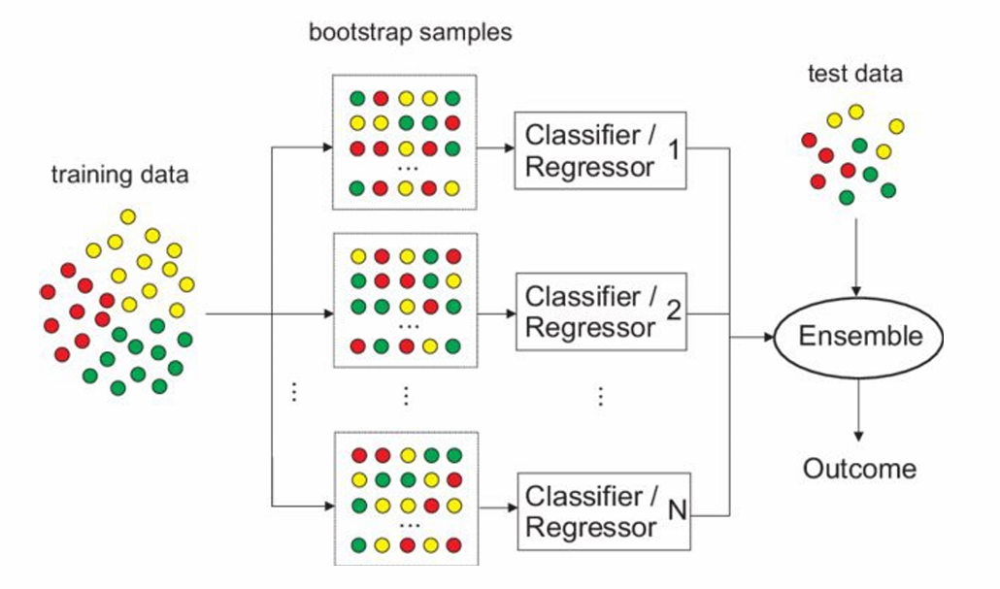

### 2.6.2 随机森林

以决策树作为基学习器构建Bagging集成的基础上，进一步在决策树的训练过程中引入了随机特征选择。

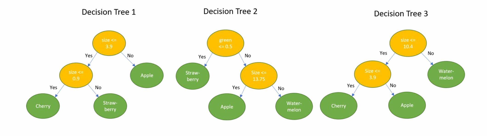

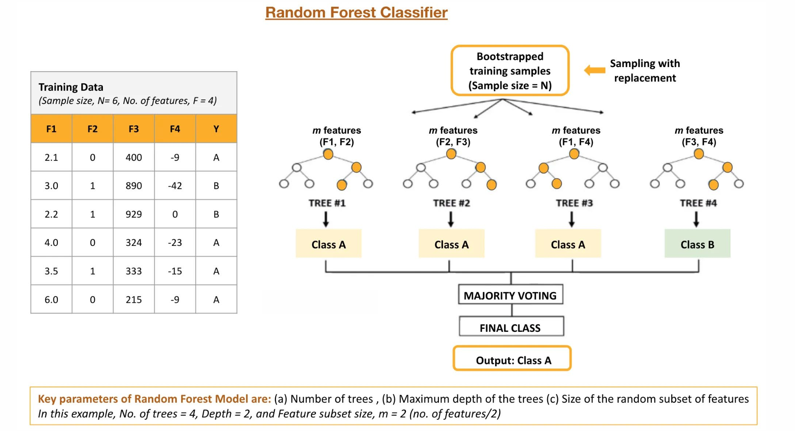

### 2.6.3 Boosting

Boosting依次生产一个学习器个体序列，后续的学习器将尝试修正前面学习器的错误。在训练过程的每一轮中，根据样本分布为每个训练样本重新赋予一个新的权重，出错的样本权重不断增大。最终的强学习器是所有弱学习器的加权求和。

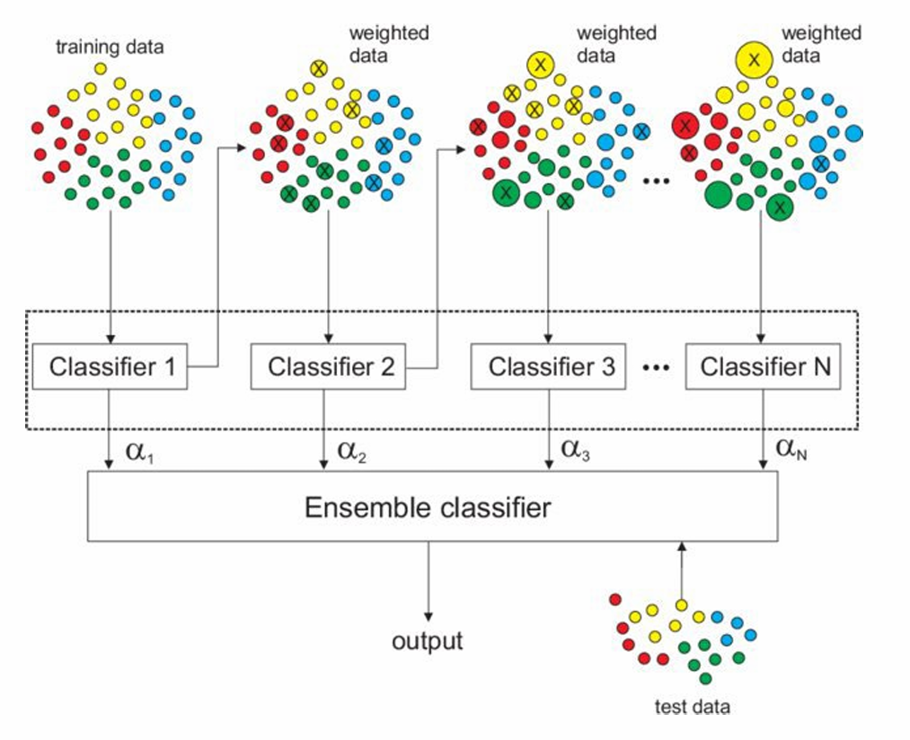

将决策树(Decision Tree)作为基学习器的提升方法称为**提升树** (BoostingTree)。

- 对回归问题，决策树使用二叉回归树，通常使用平均误差 (MSE)损失函数；
- 对分类问题，决策树使用二叉分类树，通常使用指数损失函数$𝐿(𝑌|𝑓(𝑋) = \text{exp}(−𝑦𝑓(𝑥))$。

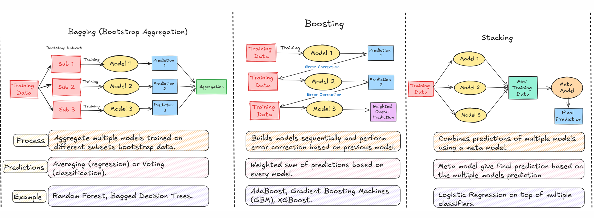

> - **Bagging**
>
>   - 做法：从原始训练集里 **有放回抽样**（bootstrap），得到很多不同的子集；
>
>     在每个子集上分别训练一个模型（通常是决策树）；
>
>     最后让这些模型 **投票（分类）** 或 **取平均（回归）**。
>
> - **Boosting**
>
>   - 做法：模型是 **一个接一个训练的**；
>
>     每一轮训练时，会更关注前一轮分错的样本（给它们更高的权重）；
>
>     不断迭代，最终形成一个“强模型”。
>
> - **Stacking**
>
>   - 做法：先训练多个“基础模型”（比如 SVM、决策树、神经网络），得到它们的预测结果；
>
>     然后再用一个“元模型”（meta-model），把这些预测结果作为输入，再学习如何综合这些模型的优势。

## 2.7 k-Means

### 2.7.1 k-均值聚类

𝑘-均值(k-means)聚类是一种**迭代求解**的**无监督聚类分析算法**。 

该算法预将数据分为𝑘组，随机选取𝑘个对象作为初始的聚类中心，然后计算每个对象与各个种子聚类中心之间的距离，把每个对象分配给距离它最近的聚类中心。聚类中心以及分配给它们的对象就代表一个聚类。每分配一个样本，聚类的聚类中心会根据聚类中现有的对象被重新计算。该过程不断重复直满足终止条件。

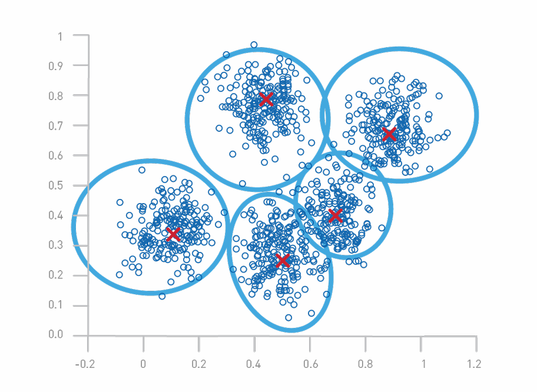

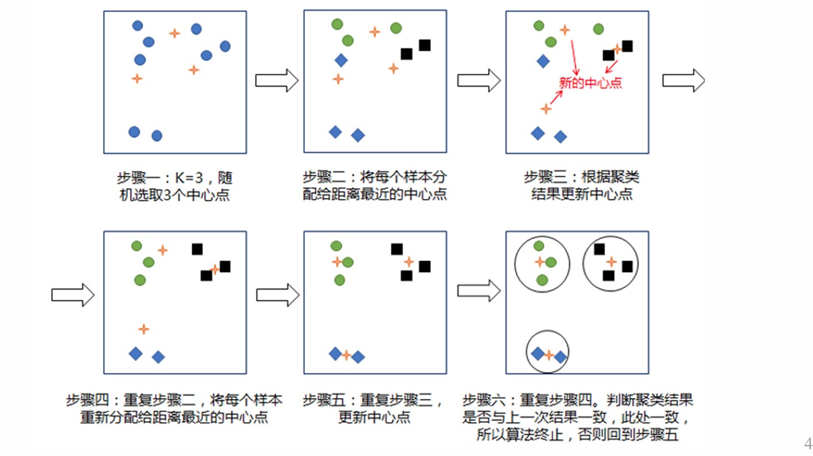

### 2.7.2 k-Means vs. kNN

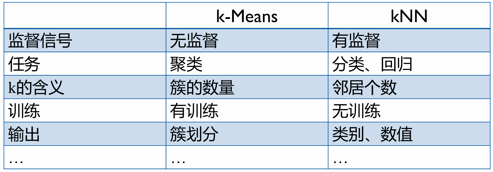

## 2.8 软件工程中的回归和分类问题

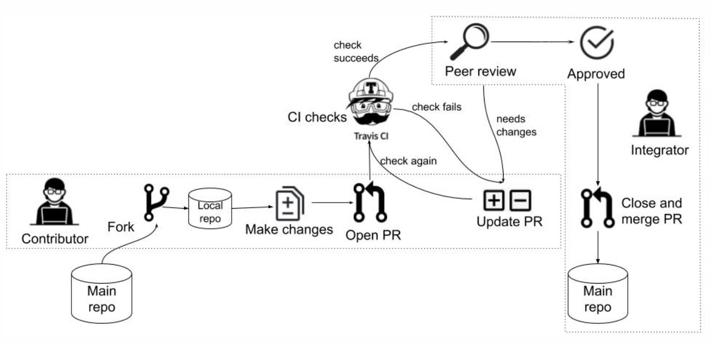
