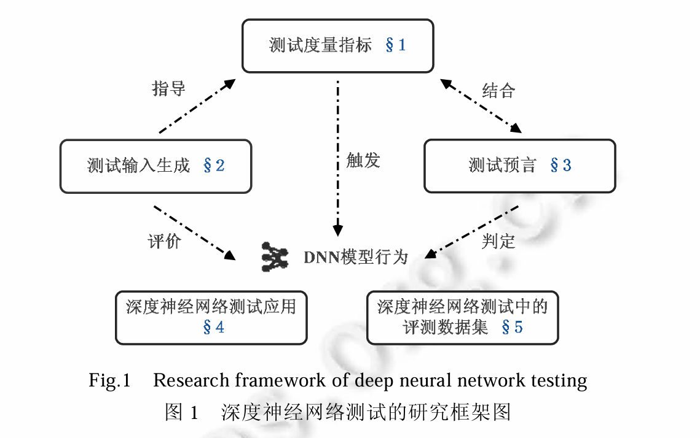
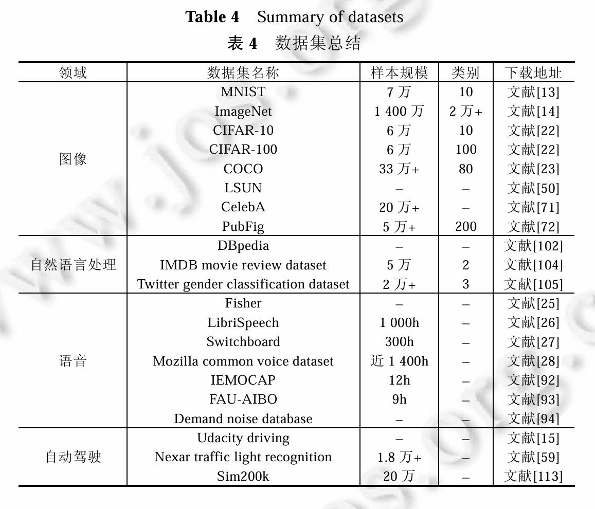
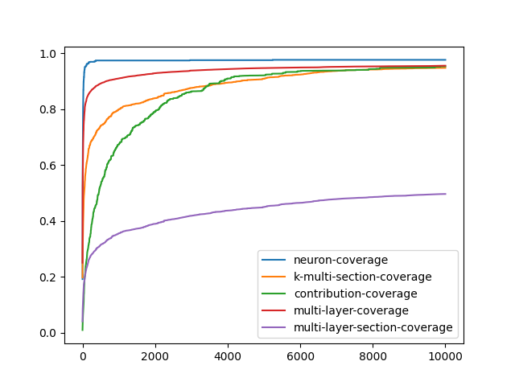

# 深度神经网络测试

[王赞,闫明,刘爽,陈俊洁,张栋迪,吴卓,陈翔.深度神经网络测试研究综述.软件学报,2020,31(5):1255−1275.](https://www.jos.org.cn/jos/article/abstract/5951?st=search)

**关键词**: **深度神经网络;测试覆盖;测试用例生成**

## 问题

​	开发人员仅编写代码来规定深度学习系统的**网络结构**,其内部逻辑则由训练过程获得的**神经元连接权值**所决定.因此,针对传统软件的测试方法及度量指标无法直接被移植到深度神经网络系统上.

​	随着其广泛应用,深度神经网络系统的质量问题也被重点关注.由于深度神经网络的结构复杂,数据中微小的扰动,即便无法被人类发现,却可能造成深度神经网络做出错误的判断,进而输出错误的结果.更进一步,由于深度神经网络越来越多地被部署在**自动驾驶**汽车系统、恶意软件检测系统以及飞机碰撞避免系统等**安全攸关领域**,对这类 **DNN 系统**进行充分的测试并保证其质量至关重要.

​	

## DNN测试度量指标

### 测试覆盖指标

传统软件测试的覆盖准则（如代码覆盖）无法直接应用于DNN，因其内部逻辑由数据驱动而非手工编码。研究者提出以下覆盖标准：

> **覆盖测试**：Testing coverage（测试覆盖），指测试系统覆盖被测试系统的程度，一项给定测试或一组测试对某个给定系统或构件的所有指定进行处理所达到的程度。
>
> 覆盖率是用来度量测试完整性的一个手段，是测试技术有效性的一个度量。分为：白盒覆盖、灰盒覆盖和黑盒覆盖；
>
> **覆盖率=（至少被执行一次的item数）/item的总数**
>
> 1. 语句覆盖：测试每条语句执行的覆盖率
>
> 2. 分支覆盖：覆盖每个逻辑判断（if-else，switch）的真假分支
>
> 3. 条件覆盖：覆盖每个逻辑条件（cond）的真假取值
>
>    ……

1. **神经元覆盖（Neuron Coverage）**

   - **提出者**：Pei等人（DeepXplore, 2017）
   - **定义**：激活值超过阈值的**神经元**比例，用于衡量测试输入对DNN内部状态的覆盖程度。
   - **局限性**：**粒度较粗**，简单测试集很容易达到100%覆盖，难以反映边界的行为。
     - 解决方式：提出<u>符号-符号覆盖、距离-符号覆盖、符号-值覆盖以及距离-值覆盖</u>这4种DNN测试度量

2. **多粒度覆盖准则**

   - **DeepGauge（Ma et al., 2018）**
     - **k-多区域神经元覆盖**：动态设定激活阈值，区分不同神经元的敏感度。
     - **神经元边界覆盖**：检测神经元激活值的最大/最小值边界。
     - **Top-k神经元覆盖**：聚焦输出层中置信度最高的k个神经元。
   - **改进**：捕捉原测试数据与对抗性测试数据差异的能力更强。

3. **组合覆盖（DeepCT, Ma et al., 2018）**

   - **思想**：借鉴**传统组合测试（t-way组合）**，将神经元输出离散化。
   - **方法**：将神经网络中神经元的输出值进行**离散化**, 基于组合测试的思想定义了**两种*t*-way组合**测试覆盖标准
   - **局限**：对大规模DNN计算开销依然很大。

   > 传统**组合测试**（Combinatorial Testing）是一种系统化的软件测试方法，旨在通过**覆盖不同参数（因素）之间的交互组合**来高效检测缺陷。
   >
   > 多数软件缺陷由**少量参数（通常≤6个）的特定组合**触发，而非所有参数同时作用。通过科学选择参数组合的子集，可大幅**减少测试用例数量**，同时保持高错误检出率。
   >
   > **t-way组合覆盖**：
   > 对任意 *t* 个参数，其所有取值组合至少出现一次。

4. **路径覆盖（DeepPath, Wang et al., 2019）**

   - **定义**：将DNN视为状态机，将模型中的单一神经元视为节点, 将不同层之间的神经元连接视为路径，覆盖神经元之间的路径组合（如l-SAP、l-OAP路径）。
   - **优势**：能更敏感地检测对抗样本的扰动。

5. **RNN专用覆盖准则（DeepCruiser, Du et al., 2018）**

   - **问题**：现有的DNN测试技术无法很好地检测图片分类器在分类结果中的混淆和偏差

   - **状态级覆盖**：衡量RNN隐藏状态的激活情况。
   - **转移级覆盖**：跟踪状态转移路径，适用于时序数据测试。

6. **意外充分性（SADL, Kim et al., 2019）以及意外覆盖(SC, Kim et al., 2019)**

   - **核心**：量化测试输入与训练数据的分布差异（Surprise Adequacy, SA）。
   - **作用**：区分正常样本与对抗样本，指导模型重训练。

**问题**：之前提出的神经网络结构覆盖标准对于**具有真实输入的DNN系统**的故障检测可能是无效的。一个有效的度量准则应该能在具体的使用场景下具有以下特点:

1. 在自然应用场景下, 具有区分相同规模和不同错误率的自然样本集的能力; 
2. 在对抗性样本生成场景下, 相比面向对抗的搜索策略, 具有更高效地生成对抗性样本的能力.

### DNN鲁棒性度量指标

DNN系统的鲁棒性体现了其在各种正常和异常输入下的**稳定程度**.重点关注输入扰动与输出变化的关系.

1. **Lipschitz连续性**
   - **定义**：存在常数 *c*，满足 $∥v(x1)−v(x2)∥≤c⋅∥x1−x2∥$。
   - **意义**：约束输入微小扰动时的输出变化范围。
   - **挑战**：全局Lipschitz常数计算复杂，难以实用。
2. **改进的鲁棒性度量**
   - **CLEVER（Weng et al., 2018）**：基于极值理论估计局部Lipschitz常数，降低计算成本。
   - **对抗鲁棒性**（Papernot et al., 2016）
     - $χ$为样本空间,$δX$ 是对原输入样本的扰动
     - 定义对抗样本的**最小扰动距离**：$ρ_{adv}(F)≃\frac{1}{∣χ∣}∑_{X\in χ}min_{δX}∥δX∥$。
   - **概率鲁棒性**（Mangal et al., 2018）
     - 定义：对于输入分布D中的输入$x$,$x′$,神经网络v的输出应该满足 $Pr_{x,x^′\sim D}(|| v[x]−v[x^′]||≤k *||x−x′ || \ | \ ||x−x′||≤δ)≥1−ε$
     - 以**概率**形式描述鲁棒性。当输入的差异被控制在较小范围内时,神经网络对应的输出被**控制在一定范围内的概率**应该大于等于特定阈值1−ε.
3. **其他鲁棒性指标**
   - **ALP算法（Bastani et al., 2018）**：通过对抗样本频率和严重性评估模型鲁棒性。
   - **RICC框架（Cheng et al., 2018）**：综合鲁棒性、可解释性等4类指标（但未实证验证）。

## 测试输入生成

- 基于覆盖的测试输入生成方法
- 基于对抗的测试输入生成方法

> 基于覆盖的方法更关注生成的测试输入**对DNN内部状态**的影响,即测试输入是否对网络内部状态实现了测试覆盖.
>
> 基于对抗的方法则更关注生成的测试输入是否能够使DNN**产生错误输出**.

### 基于覆盖的测试输入生成方法

核心思想：通过最大化**测试覆盖指标**（如神经元覆盖率）生成输入，揭示DNN边界行为。

#### 1. **模糊测试（Fuzzing）**

​	模糊测试通过将种子输入随机或者按照某种规则进行变换作为新的输入,并观察软件在这些非预期输入下是否会发生错误.

- **DLFuzz** (2017)
  - 首个DNN差异模糊测试框架。
  - **策略**：迭代选择关键神经元，通过微小扰动提升覆盖率。
  - **优势**：比DeepXplore生成更多对抗样本（+338.59%），扰动更不易察觉。
- **TensorFuzz** (2018)
  - 用**激活向量**（神经元激活值构成）作为覆盖指标。
  - 通过近似最近邻算法判断是否覆盖新状态。
- **DeepHunter** (2018)
  - 支持6种覆盖标准（如k-多区域覆盖）。
  - **流程**：种子输入→数据变异→覆盖反馈→迭代生成。
  - **应用**：检测模型部署缺陷（如量化误差）。

#### 2. **变异测试（Mutation Testing）**

​	传统软件中的变异测试对代码进行变异,形成大量**存在潜在问题的代码**,称为变异体,产生这些变异体的不同变异规则与操作称为变异算子.变异测试旨在评价测试数据的质量, 并没有生成新的测试输入.

- DeepMutation (2018)
  - 对DNN训练程序/数据/模型进行变异（8种算子）。
  - **目标**：评估测试集质量，指导生成更有效的输入。

#### 3. **符号执行与Concolic测试**

​	符号执行技术通过分析程序,计算出能够**执行代码特定部分**的程序输入.能够更加高效地实现代码覆盖.

​	Concolic 测试技术是一种将**程序具体执行与符号执行结合**起来的软件测试技术.

- DeepConcolic (2018)
  - 结合具体执行与符号推理。
  - **优势**：在MNIST上比DeepXplore更快达成高覆盖率。
- DeepCheck (2018)
  - 轻量级符号执行技术。
  - **应用**：识别重要像素，实现1-2像素攻击。

#### 4. **其他方法**

- DeepCT (2018)
  - 将神经元输出离散化，用组合测试（t-way覆盖）生成输入。
  - **局限**：大规模DNN计算开销大。
- Li et al. (2019)
  - 利用DNN表示空间约减测试集规模，降低标注成本。

### 基于对抗的测试输入生成方法

核心思想：生成**对抗样本**（微小扰动使DNN误分类），评估模型鲁棒性。

#### 1. **白盒方法**

​	白盒方法是指通过获得深度神经网络的**内部状态**,帮助生成对抗样本的一类方法

- **基于优化的方法**
  - **FGSM (2014)**：沿损失函数梯度方向添加扰动。
  - **C&W (2017)**：优化目标函数生成最小扰动样本。
  - **空间变换 (Xiao et al., 2018)**：移动像素位置生成更自然的对抗样本。
- **针对防御的生成**
  - **OptMargin (2018)**：破解区域分类（Region-based Classification）防御。

#### 2. **黑盒方法**

​	生成对抗样本时只关注DNN模型的**输入和输出**,而不关注网络的内部状态,我们称之为黑盒方 法.

- **边界攻击** (Brendel et al., 2017)
  - **步骤**：从对抗样本出发，沿决策边界搜索最小扰动样本。
- **生成更自然的样本**
  - **Zhao et al. (2017)**：用GAN在数据分布内生成对抗样本。
- **蒙特卡洛树搜索** (Wicker et al., 2018)
  - **应用**：自动驾驶交通标志识别测试（如Nexar数据集）。

## 测试预言

**蜕变测试（Metamorphic Testing）** 和**差异测试（Differential Testing）**

**测试预言的挑战**:DNN的决策逻辑由数据驱动，**无法预先定义所有输入的预期输出**

### 蜕变测试

**核心思想**：构造**蜕变关系（Metamorphic Relation, MR）**，即输入变换与输出变化的逻辑关联。若MR被违反，则表明系统存在缺陷。

|    **应用领域**    |                    **蜕变关系示例**                    |          **违反示例**          |
| :----------------: | :----------------------------------------------------: | :----------------------------: |
|    **图像分类**    |          旋转/缩放/亮度调整后，分类结果不变。          |    旋转后“猫”被误判为“狗”。    |
|    **人脸识别**    |        添加眼镜/改变发型后，身份识别结果不变。         |  换发型后系统无法识别同一人。  |
|    **通用数据**    | 交换特征顺序或类型，预测结果不变（如数值特征归一化）。 | 特征重排后输出置信度差异显著。 |
| **训练数据平衡性** |        重复添加同类训练数据，模型预测结果稳定。        |  重训练后原测试样本分类突变。  |

#### **关键研究**

1. **Xie et al.** (2009)
   - 针对监督学习分类器设计11种MR（如表单修改、特征扰动）。
   - **创新点**：区分“实现错误”与“算法不适用”。
2. **Dwarakanath et al.** (2018)
   - 测试图像分类器，发现OpenCV中的代码缺陷（如边界处理错误）。
3. **Zhu et al.** (2019)
   - 设计人脸识别专用MR（妆容/发色变换），在CelebA数据集上暴露模型偏差。

### 差异测试

**核心思想**：比较**功能相同模型**对同一输入的输出差异。若输出不一致，则至少一个模型存在缺陷。

#### **典型方法**

1. **OGMA** (Udeshi et al., 2019)
   - **输入生成**：基于语法树扰动（如替换代码关键词）。
   - **差异检测**：对比两个NLP模型的输出（如代码分类器）。
2. **CRADLE** (Pham et al., 2019)
   - **测试对象**：深度学习框架（TensorFlow/Theano/CNTK）。
   - 方法
     - 相同模型在不同后端运行，对比输出结果。
     - **缺陷定位**：反向传播定位导致差异的神经网络层。
   - **实验**：发现TensorFlow与CNTK在BatchNorm层实现不一致。

|   **方法**   |       验证依据        |               优势               |               局限               |
| :----------: | :-------------------: | :------------------------------: | :------------------------------: |
| **蜕变测试** | 输入/输出的不变性关系 |  无需标注数据，适用单模型测试。  | MR设计依赖领域知识，可能不完备。 |
| **差异测试** |   多模型输出一致性    | 无需预定义MR，自动暴露实现差异。 |  需冗余模型，无法检测共性问题。  |

### 案例

1. **自动驾驶**
   - **蜕变关系**：雾天图像与清晰图像的检测结果应一致（如DeepTest）。
2. **语音识别**
   - **差异测试**：同一音频在Kaldi与DeepSpeech的输出差异揭示模型缺陷。
3. **安全关键系统**
   - **金融风控模型**：用户收入微调（+5%）不应改变信用评级（蜕变关系）。

## 主要应用领域及数据集

### 应用领域

1. 图像处理：对抗样本攻击、模型鲁棒性验证
2. 语音识别：对抗音频命令、语音情感分析
3. **自动驾驶**：**多模态感知系统安全**
   - **场景模拟**：DeepTest（Tian et al., 2018）生成雨雾天气图像测试感知模块。
   - **多传感器测试**：DeepRoad（Zhang et al., 2018）用GAN模拟极端驾驶场景。
   - **闭环系统验证**：Sim-ATAV（Tuncali et al., 2018）结合仿真与形式化方法测试决策逻辑。
4. 自然语言处理：文本对抗样本、序列模型攻击

### 数据集

​	


# 深度神经网络修复策略

- **背景**：DNN在安全攸关系统（如自动驾驶）中的错误行为引发担忧。
- **问题**：现有方法（验证、测试、性质训练）无法修复已存在的错误行为。
- **修复定义**：消除错误预测，使DNN满足特定规约性质，如安全性、鲁棒性、公平性、可达性。
- **修复范式分类**：**重训练、无错误定位微调、含错误定位微调**。

## **神经网络修复基础**

- ### **神经网络基础结构**

  - **组成**：输入层、隐藏层（若干）、输出层，参数集 *θ* 表示所有权重和偏置。
  - **激活函数**：ReLU、tanh、Sigmoid等，提供非线性能力。
  - **训练目标**：在训练集 *D* 上拟合，测试集 *D**T* 上泛化。

  ### 规约性质（Specification Properties）

  - 形式化定义 P:=(*X*;*Y*;*ϕ*)

    - *X*：输入约束（如多面体区域 Ax≤b）。
    - *Y*：输出约束（如安全范围 Cy≤d）。
    - *ϕ*：映射关系（如 ∀*x*∈*X*,*N*(*x*)∈*Y*）。

  - 关键性质类型

    |    性质    |                  定义示例                  |
    | :--------: | :----------------------------------------: |
    |   安全性   |  扰动输入下输出不越界（如自动驾驶避障）。  |
    |   鲁棒性   | 微小扰动下分类结果不变（如对抗样本防御）。 |
    |   可达性   |           预测能否到达目标输出。           |
    | 分类正确性 |        对特定输入样本输出正确标签。        |

  - 正/负样本

    - 正样本 *x**p*：满足 *ϕ*（*N*(*x**p*)∈*Y*）。
    - 负样本 *x**n*：违反 *ϕ*（*N*(*x**n*)∈/*Y*）。

  ------

  ###  修复问题定义

  - **核心问题**：给定初始网络 $N_θ $及其违背的规约集 $\{ {P_i} \}_{i=1}^p$，修改参数为 $θ^′$，使修复后网络 $N_{θ^′}⊨\{Pi\}$。

  - 修复分类

    |      类型       |        输入/输出形式         |           挑战           |
    | :-------------: | :--------------------------: | :----------------------: |
    | 样本修复（SRP） | 离散样本点（如错误分类图片） |    样本有限，易遍历。    |
    | 区域修复（DRP） |   连续区域（如多面体空间）   | 区域无限，需形式化验证。 |

  ------

  ### 修复要求

  |     要求     |                           内涵                           |
  | :----------: | :------------------------------------------------------: |
  |   **性能**   |    修复后网络需满足原违背的性质（如100%修复负样本）。    |
  |  **最小性**  |      保持原网络性能（如修复后测试集准确率不下降）。      |
  |  **局部性**  |   修复不影响无关输入的行为（如非修复区域的预测不变）。   |
  | **可证明性** | 理论保证修复后网络完全满足性质（需形式化验证工具支持）。 |
  |   **效率**   |        修复过程计算开销低（如避免全网络重训练）。        |

  ------

  ### 与其他概念的区别

  - **vs 神经网络程序修复**：修复代码漏洞（如TensorFlow API误用），而非网络行为。
  - **vs 数据集修复**：修正训练数据噪声，而非修改网络参数。
  - **vs 传统软件修复**：DNN参数非人工编写，需依赖数据驱动调整。
  - **vs 神经网络辅助的程序修复**：DNN作为修复工具，而非修复对象。

## **修复策略研究现状**

### 重训练（Retraining）

- **核心思想**：基于原始网络和训练数据追加训练，通过**改进损失函数**融入修复目标。

- 代表方法

  |      方法      |                      关键技术                      |                 特点                 |
  | :------------: | :------------------------------------------------: | :----------------------------------: |
  |  **Apricot**   |      用简化模型（rDLM）的权重趋势指导修复方向      | 权重修改有明确方向，但依赖模型集成。 |
  |    **ENNs**    | 目标函数=原始损失+编辑损失*L*edit+局部性损失*L*loc |    支持多性质修复，但需精细调参。    |
  |  **Veritex**   | 结合可达性分析（计算不安全区域）和距离损失*L*dist  |     仅支持ReLU网络，可扩展性差。     |
  | **SpecRepair** |     将安全性质转为优化问题，生成反例并惩罚训练     | 集成验证器循环检测，修复彻底但耗时。 |

- **局限**：计算成本高，依赖原始训练数据。

------

### 无错误定位微调（Fine-Tuning without Fault Localization）

- **核心思想**：**不定位具体错误**，直接修改单层参数（常选输出层）满足约束。

- 代表方法

  |      方法       |                      关键技术                       |                  特点                  |
  | :-------------: | :-------------------------------------------------: | :------------------------------------: |
  |    **MVDNN**    | 将修复转为SMT验证问题，仅修改输出层（线性规划求解） |    可证明性高，但仅支持输出层修复。    |
  |    **PRDNN**    |      引入解耦DNN结构，将区域修复规约为样本修复      | 理论完备，但解耦DNN转换回标准DNN困难。 |
  | **REASSURANCE** |    函数空间修补：为线性区域设计补丁函数+支撑网络    |    避免参数修改，但需计算线性区域。    |
  |    **APRNN**    |  利用局部线性性质，修复多面体顶点行为保证区域性质   | 支持卷积/残差层，但需多面体顶点计算。  |

- **优势**：理论可证明（如MVDNN、PRDNN）；**局限**：可扩展性差（仅支持ReLU或小规模网络）。

------

### 含错误定位微调（Fine-Tuning with Fault Localization）

- **核心思想**：先**定位责任参数**（神经元/权重），再针对性修复。

- 错误定位技术

  - **梯度分析**（NREPAIR、Arachne）：按损失函数梯度排序神经元。
  - **因果推断**（CARE）：分析神经元与错误输出的因果关系。
  - **行为差异**（BIRDNN）：对比正/负样本的神经元激活差异。

- 修复方法

  |      方法       | 定位粒度 |           修复技术           |
  | :-------------: | :------: | :--------------------------: |
  |   **NREPAIR**   | 神经元级 |   梯度下降调整神经元输出。   |
  |   **GenMuNN**   |  权重级  |    遗传算法突变可疑权重。    |
  |   **Arachne**   | 神经元级 | 差分演化（DE）搜索权重更新。 |
  | **CARE/BIRDNN** | 神经元级 | 粒子群优化（PSO）更新权重。  |

- **优势**：高效支持大规模网络；**局限**：定位依赖启发式，可证明性弱。

### 三类范式对比总结

|   **维度**   |        重训练        |          无定位微调          |        含定位微调        |
| :----------: | :------------------: | :--------------------------: | :----------------------: |
| **修复目标** |     全局行为修正     |         局部性质满足         |      针对性错误消除      |
| **可证明性** |     低（经验性）     |   **高**（形式化约束求解）   |       低（启发式）       |
|   **效率**   |  低（需全网络训练）  |    中（约束求解复杂度高）    |  **高**（局部参数更新）  |
| **可扩展性** | 高（支持大规模网络） |   低（仅支持ReLU/小网络）    | **高**（支持大规模网络） |
| **典型场景** |    多性质联合修复    | 安全攸关系统（需形式化保证） |     分类错误快速修复     |

## 评估与基准

- 评价指标

  |              **指标**               |                      **计算方式/内涵**                       |                  **目的**                  |
  | :---------------------------------: | :----------------------------------------------------------: | :----------------------------------------: |
  |    **性质提升率（Improvement）**    |    修复后正确处理的违背样本比例（如95%的负样本被修正）。     |          衡量修复核心目标达成度。          |
  |      **性能退化（Drawdown）**       |  修复后模型在原始任务上的性能变化（如测试集准确率下降Δ%）。  |        评估修复对原有能力的副作用。        |
  |     **整体准确度（Accuracy）**      | 综合性质提升与性能退化的平衡指标（如修复后模型在联合数据集上的准确率）。 |             全面评估修复效果。             |
  | **参数距离（Parameter Distance）**  |                  $∥θ^′−θ∥_L$（L1/L2范数）。                  |   量化参数修改幅度，反映**最小性**要求。   |
  | **预测距离（Prediction Distance）** |            $∥N_{θ^′}(x)−N_{θ}(x)∥L$（输出差异）。            | 评估**局部性**（非修复区域行为是否变化）。 |
  |    **运行时间（Running Time）**     |               修复过程耗时（含错误定位时间）。               |     衡量**效率**，尤其对实时系统关键。     |

- 测试基准

  - **样本修复**：MNIST错误样本、Natural Adversarial Examples（SqueezeNet）、Census Income（公平性修复）。
  - **区域修复**：MNIST线段鲁棒性、ACAS Xu（航空防撞系统安全性质）。


# 神经网络测试覆盖率实践

项目地址：[hagemon/CovBaseline：神经元覆盖率标准的一些实现 --- hagemon/CovBaseline: Some implementations of neuron coverage criteria](https://github.com/hagemon/CovBaseline#)

## 测试结果

```cmd
(covbaseline) PS D:\Codes\Python_codes\CovBaseLine> python ./CovBaseline/main.py
x_train shape: (60000, 784)
60000 train samples
10000 test samples
Model: "sequential"
_________________________________________________________________
 Layer (type)                Output Shape              Param #
=================================================================
 dense (Dense)               (None, 512)               401920

 dropout (Dropout)           (None, 512)               0

 dense_1 (Dense)             (None, 256)               131328

 dropout_1 (Dropout)         (None, 256)               0

 dense_2 (Dense)             (None, 64)                16448

 dropout_2 (Dropout)         (None, 64)                0

 dense_3 (Dense)             (None, 10)                650

=================================================================
Total params: 550,346
Trainable params: 550,346
Non-trainable params: 0
_________________________________________________________________
Epoch 1/15
422/422 [==============================] - 3s 6ms/step - loss: 0.6352 - accuracy: 0.8015 - val_loss: 0.1395 - val_accuracy: 0.9598
Epoch 2/15
422/422 [==============================] - 2s 6ms/step - loss: 0.2699 - accuracy: 0.9268 - val_loss: 0.1009 - val_accuracy: 0.9707
Epoch 3/15
422/422 [==============================] - 2s 6ms/step - loss: 0.2108 - accuracy: 0.9431 - val_loss: 0.0886 - val_accuracy: 0.9747
Epoch 4/15
422/422 [==============================] - 2s 6ms/step - loss: 0.1774 - accuracy: 0.9526 - val_loss: 0.0844 - val_accuracy: 0.9775
Epoch 5/15
422/422 [==============================] - 2s 6ms/step - loss: 0.1555 - accuracy: 0.9583 - val_loss: 0.0745 - val_accuracy: 0.9772
Epoch 6/15
422/422 [==============================] - 2s 6ms/step - loss: 0.1438 - accuracy: 0.9616 - val_loss: 0.0723 - val_accuracy: 0.9795
Epoch 7/15
422/422 [==============================] - 2s 6ms/step - loss: 0.1299 - accuracy: 0.9655 - val_loss: 0.0731 - val_accuracy: 0.9803
Epoch 8/15
422/422 [==============================] - 2s 6ms/step - loss: 0.1212 - accuracy: 0.9682 - val_loss: 0.0789 - val_accuracy: 0.9792
Epoch 9/15
422/422 [==============================] - 3s 6ms/step - loss: 0.1107 - accuracy: 0.9706 - val_loss: 0.0684 - val_accuracy: 0.9807
Epoch 10/15
422/422 [==============================] - 3s 6ms/step - loss: 0.1031 - accuracy: 0.9719 - val_loss: 0.0623 - val_accuracy: 0.9808
Epoch 11/15
422/422 [==============================] - 3s 6ms/step - loss: 0.0986 - accuracy: 0.9735 - val_loss: 0.0702 - val_accuracy: 0.9798
Epoch 12/15
422/422 [==============================] - 3s 6ms/step - loss: 0.0949 - accuracy: 0.9742 - val_loss: 0.0663 - val_accuracy: 0.9820
Epoch 13/15
422/422 [==============================] - 3s 6ms/step - loss: 0.0897 - accuracy: 0.9755 - val_loss: 0.0680 - val_accuracy: 0.9817
Epoch 14/15
422/422 [==============================] - 3s 6ms/step - loss: 0.0872 - accuracy: 0.9760 - val_loss: 0.0694 - val_accuracy: 0.9813
Epoch 15/15
422/422 [==============================] - 3s 6ms/step - loss: 0.0850 - accuracy: 0.9770 - val_loss: 0.0695 - val_accuracy: 0.9820
Test loss: 0.07715293765068054
Test accuracy: 0.9811999797821045
NC total: 842
1.790524e-01s
kMSC total: 4210
5.138376e-01s
CC total: 148096
3.694677e+00s
MLC total: 592384.0
7.569082e+00s
MLSC total: 3702400.0
2.293492e+01s
(covbaseline) PS D:\Codes\Python_codes\CovBaseLine> 

```



## 项目分析与结果解读

### 项目目标和流程

这是一个神经**网络测试覆盖率分析**项目(CovBaseLine)，主要进行：

- 在MNIST数据集上训练全连接神经网络模型
- 使用多种覆盖率指标评估测试集的完备性
- 可视化不同覆盖率指标随测试样本增加的变化趋势

核心目的是评估测试集对神经网络内部状态的覆盖程度，类似于传统软件测试中的代码覆盖率分析。

### 模型训练结果分析

- **模型结构**：4个全连接层(512→256→64→10神经元)，使用Dropout减少过拟合
- 训练性能
  - 训练准确率从80.15%提升至97.70%
  - 验证准确率从95.98%提升至98.20%
- 测试性能
  - 最终测试准确率：**98.12%**
  - 测试损失：0.077

这表明模型在MNIST数据集上表现优异，属于典型的高性能手写数字识别模型。

### 覆盖率指标分析（核心输出）

项目计算了五种不同层级的神经网络覆盖率：

|     覆盖率类型      |    值     |        含义        | 重要性 |
| :-----------------: | :-------: | :----------------: | :----: |
|  NC (神经元覆盖率)  |    842    |   激活神经元比例   | ★★★☆☆  |
| kMSC (k-多段覆盖率) |   4210    | 神经元激活强度分布 | ★★★★☆  |
|   CC (贡献覆盖率)   |  148,096  |  神经元间组合作用  | ★★★★★  |
|  MLC (多层覆盖率)   |  592,384  |    跨层激活模式    | ★★★★★  |
| MLSC (多层段覆盖率) | 3,702,400 |  分层激活强度组合  | ★★★★★  |

**指标趋势分析**（如附图所示）：

1. **基础指标**（NC）最先饱和，说明单一神经元激活最容易覆盖
2. **高阶指标**（CC/MLC/MLSC）上升缓慢，表明神经元间的组合模式最难完全覆盖
3. **最严苛指标**（MLSC）即使使用10,000个测试样本也未完全饱和，揭示深层模型状态仍有未探索区域

# DeepXplore复现

使用的是[BQCCC/DL_test: some deep learning testing project](https://github.com/BQCCC/DL_test#)的修改版（原版很多库都已失效）

## 复现结果

```cmd
(covbaseline) PS D:\Codes\Python_codes\DL_test\DeepXplore\MNIST> python gen_diff.py                                               
2025-06-06 15:13:26.674044: W tensorflow/c/c_api.cc:300] Operation '{name:'before_softmax/kernel/Assign' id:67 op device:{requested: '', assigned: ''} def:{{{node befor
e_softmax/kernel/Assign}} = AssignVariableOp[_has_manual_control_dependencies=true, dtype=DT_FLOAT, validate_shape=false](before_softmax/kernel, before_softmax/kernel/I
nitializer/stateless_random_uniform)}}' was changed by setting attribute after it was run by a session. This mutation will have no effect, and will trigger an error in the future. Either don't modify nodes after running them or create a new session.
Model1 loaded
2025-06-06 15:13:26.745799: W tensorflow/c/c_api.cc:300] Operation '{name:'before_softmax_1/kernel/Assign' id:192 op device:{requested: '', assigned: ''} def:{{{node be
fore_softmax_1/kernel/Assign}} = AssignVariableOp[_has_manual_control_dependencies=true, dtype=DT_FLOAT, validate_shape=false](before_softmax_1/kernel, before_softmax_1
/kernel/Initializer/stateless_random_uniform)}}' was changed by setting attribute after it was run by a session. This mutation will have no effect, and will trigger an error in the future. Either don't modify nodes after running them or create a new session.
Model2 loaded
2025-06-06 15:13:26.835242: W tensorflow/c/c_api.cc:300] Operation '{name:'fc2/kernel/Assign' id:325 op device:{requested: '', assigned: ''} def:{{{node fc2/kernel/Assi
gn}} = AssignVariableOp[_has_manual_control_dependencies=true, dtype=DT_FLOAT, validate_shape=false](fc2/kernel, fc2/kernel/Initializer/stateless_random_uniform)}}' was
 changed by setting attribute after it was run by a session. This mutation will have no effect, and will trigger an error in the future. Either don't modify nodes after running them or create a new session.
Model3 loaded
D:\Softwares\Anaconda\envs\covbaseline\lib\site-packages\keras\engine\training_v1.py:2359: UserWarning: `Model.state_updates` will be removed in a future version. This property should not be used in TensorFlow 2.0, as `updates` are applied automatically.
  updates=self.state_updates,
2025-06-06 15:13:26.866123: W tensorflow/c/c_api.cc:300] Operation '{name:'predictions/Softmax' id:78 op device:{requested: '', assigned: ''} def:{{{node predictions/So
ftmax}} = Softmax[T=DT_FLOAT, _has_manual_control_dependencies=true](before_softmax/BiasAdd)}}' was changed by setting attribute after it was run by a session. This mutation will have no effect, and will trigger an error in the future. Either don't modify nodes after running them or create a new session.
2025-06-06 15:13:26.896571: W tensorflow/c/c_api.cc:300] Operation '{name:'predictions_1/Softmax' id:203 op device:{requested: '', assigned: ''} def:{{{node predictions
_1/Softmax}} = Softmax[T=DT_FLOAT, _has_manual_control_dependencies=true](before_softmax_1/BiasAdd)}}' was changed by setting attribute after it was run by a session. This mutation will have no effect, and will trigger an error in the future. Either don't modify nodes after running them or create a new session.
2025-06-06 15:13:26.910943: W tensorflow/c/c_api.cc:300] Operation '{name:'predictions_2/Softmax' id:360 op device:{requested: '', assigned: ''} def:{{{node predictions
_2/Softmax}} = Softmax[T=DT_FLOAT, _has_manual_control_dependencies=true](before_softmax_2/BiasAdd)}}' was changed by setting attribute after it was run by a session. This mutation will have no effect, and will trigger an error in the future. Either don't modify nodes after running them or create a new session.
input already causes different outputs: 9, 8, 9
2025-06-06 15:13:28.711377: W tensorflow/c/c_api.cc:300] Operation '{name:'block1_conv1/Relu' id:26 op device:{requested: '', assigned: ''} def:{{{node block1_conv1/Rel
u}} = Relu[T=DT_FLOAT, _has_manual_control_dependencies=true](block1_conv1/BiasAdd)}}' was changed by setting attribute after it was run by a session. This mutation will have no effect, and will trigger an error in the future. Either don't modify nodes after running them or create a new session.
2025-06-06 15:13:28.810766: W tensorflow/c/c_api.cc:300] Operation '{name:'block1_conv1_1/Relu' id:127 op device:{requested: '', assigned: ''} def:{{{node block1_conv1_
1/Relu}} = Relu[T=DT_FLOAT, _has_manual_control_dependencies=true](block1_conv1_1/BiasAdd)}}' was changed by setting attribute after it was run by a session. This mutation will have no effect, and will trigger an error in the future. Either don't modify nodes after running them or create a new session.
2025-06-06 15:13:28.913856: W tensorflow/c/c_api.cc:300] Operation '{name:'block1_conv1_2/Relu' id:260 op device:{requested: '', assigned: ''} def:{{{node block1_conv1_
2/Relu}} = Relu[T=DT_FLOAT, _has_manual_control_dependencies=true](block1_conv1_2/BiasAdd)}}' was changed by setting attribute after it was run by a session. This mutation will have no effect, and will trigger an error in the future. Either don't modify nodes after running them or create a new session.
covered neurons percentage 52 neurons 0.962, 148 neurons 0.845, 268 neurons 0.683
averaged covered neurons 0.765

```


## 结果分析

`input already causes different outputs: 9, 8, 9`
→ **关键信息**：当前测试输入（MNIST手写数字图片）在三个模型中分别被分类为 **9**、**8**、**9**。这表明**原始输入本身已存在模型间不一致的预测**（至少一个模型与其他模型输出不同）

`covered neurons percentage 52 neurons 0.962, 148 neurons 0.845, 268 neurons 0.683`
→ 各模型神经元覆盖率分别为 **96.2%**、**84.5%**、**68.3%**（平均 **76.5%**）。

生成文件 `already_differ_9_8_9.png`
→ 该图片为 **原始输入的可视化结果**，文件名表明其直接触发了模型差异（分类为9或8）

DeepXplore检测到原始输入（一张手写数字图）即导致模型预测分歧：

- **Model1** 和 **Model3** 识别为 **9**
- **Model2** 识别为 **8**