# 复习提纲

## ArkCompiler和ArkRuntime

### 方舟编译运行时

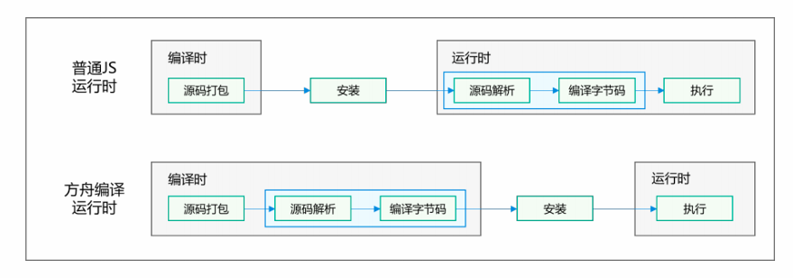

由图可知，**方舟编译器**与普通编译器（普通 JS 运行方式）的核心区别体现在**编译时机与运行时开销**上，具体如下：

1. **编译阶段不同**
   - **普通编译器**：在**编译时**仅进行源码打包，真正的源码解析和编译成字节码发生在**运行时**。
   - **方舟编译器**：在**编译时**就完成源码解析和编译成字节码，提前完成主要编译工作。
2. **运行时负担不同**
   - **普通编译器**：运行时仍需进行源码解析和编译，运行时开销较大。
   - **方舟编译器**：运行时只需直接执行已生成的字节码，运行时开销显著降低。
3. **性能与效率不同**
   - **普通编译器**：启动速度和执行效率受运行时编译影响较明显。
   - **方舟编译器**：由于**提前编译**（AOT，Ahead-Of-Time），具有**更快的启动速度和更高的执行效率**。

编译流程如下：

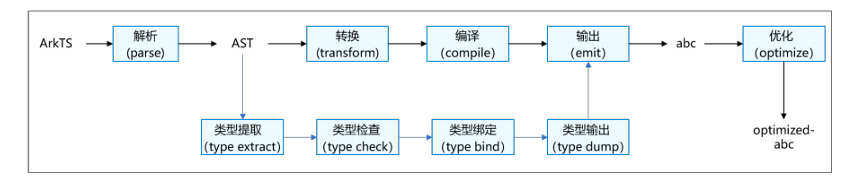

### 类型推导

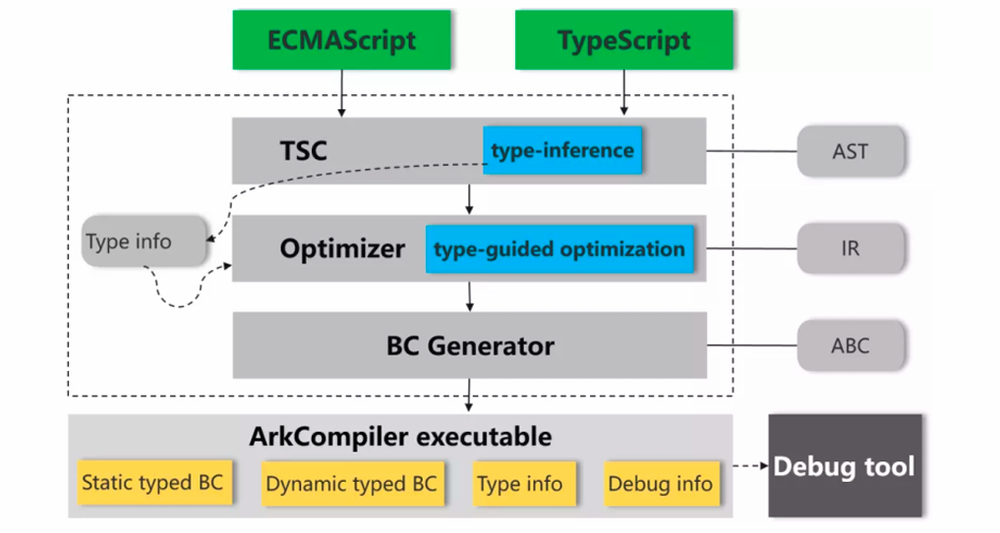

从图中可以看出，方舟编译器的类型推导是贯穿整个编译流程、逐步深化并服务于优化与执行的一套机制。

首先，方舟编译器以 ECMAScript 或 TypeScript 源码作为输入，通过 TSC 前端对源码进行解析并生成 AST。在这一阶段，编译器结合 TypeScript 显式声明的类型信息以及对 JavaScript 代码的静态分析，进行**初步的类型推导（type inference）**，为变量、表达式和函数建立尽可能准确的类型描述。

随后，这些推导得到的类型信息被传递给优化器。在优化阶段，方舟编译器采用**类型引导优化（type-guided optimization）**的方式，根据已知或推导出的类型对中间表示（IR）进行有针对性的优化。

在完成优化之后，**字节码生成器**（BC Generator）依据优化后的 IR 生成 **Ark 字节码**（ABC）。此时，编译结果中既包含**静态类型字节码**，也能兼容必要的**动态类型字节码**，同时将关键的**类型信息和调试信息**一并保留下来，供运行时和调试工具使用。

### AOT和JIT的区别

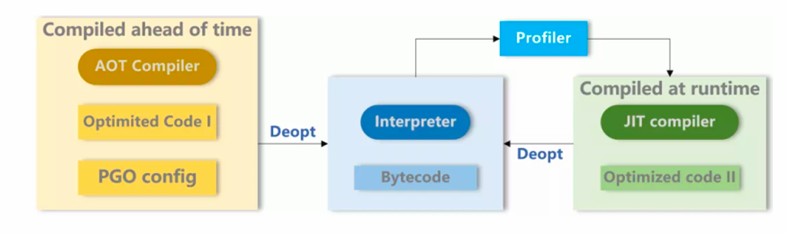

==AOT（Ahead-Of-Time）==编译的核心特征，是**在程序运行之前完成高质量机器码的生成**。如图所示，AOT 编译器在构建或安装阶段，**根据静态可得的信息进行编译，并可以结合 PGO 配置文件，将“以往运行中收集到的 profiling 结果”作为输入，对热点路径、方法内联策略和优化级别作出预先判断，从而直接生成 Optimized Code I**。其优势在于启动快、运行稳定、性能可预期，运行时几乎不承担编译负担，尤其适合资源受限或对启动时延敏感的场景。但由于 AOT 的优化建立在静态假设或历史数据之上，一旦实际运行行为与假设不一致，就可能触发 Deopt，回退到解释器执行。

==JIT（Just-In-Time）==编译则发生在**程序已经运行之后**。程序最初由解释器执行，运行时的 Profiler 会持续采集真实的执行数据，例如分支走向、类型分布和热点方法。当某段代码被识别为热点后，**JIT 编译器基于这些“实时、精准的 profiling 数据”生成高度针对当前运行场景的 Optimized Code II**。正因如此，JIT 往往能做出比 AOT 更激进、更贴合实际的优化，长期运行性能潜力更高。但代价是：需要额外的运行时编译开销，增加内存占用，并且同样依赖优化假设，一旦假设失效，也需要通过 Deopt 回退到解释器。

## ArkUI

### ArkUI框架

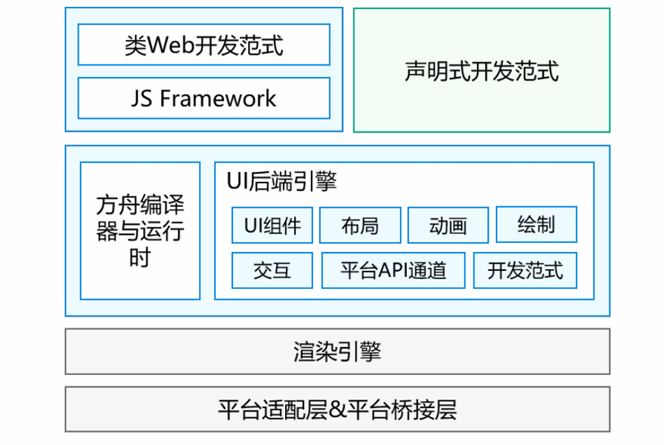

1. ==开发范式层==

这是开发者直接接触的层面，ArkUI提供了两种开发方式，以覆盖不同背景的开发者：

- **声明式开发范式**：采用更接近现代前端框架（如React、Vue、Flutter）的声明式语法和状态管理，提供更简洁高效的UI开发体验。
- **类Web开发范式**：基于经典的HTML/CSS/JavaScript技术栈，对熟悉Web开发的开发者友好，降低了学习门槛。

2. ==编译器与UI核心层==

负责衔接上层范式和底层渲染。

- **方舟编译器与运行时**：这是ArkUI高性能的关键。它负责将上层不同范式（特别是声明式范式）的代码进行高效的编译、优化和执行。
- **UI后端引擎**：提供构建UI所需的一切基础能力，是一个功能完备的“工具箱”，包括：
  - **UI组件**：按钮、列表、输入框等基础控件。
  - **布局**：控制组件在屏幕上的排列方式。
  - **动画**：提供丰富的动画效果支持。
  - **绘制**：负责将UI组件绘制到画布上。
  - **交互**：处理用户的触摸、点击等事件。

3. ==渲染引擎==

接收来自UI后端引擎的绘制指令，高效地处理复杂的图形计算，最终将像素渲染到屏幕上。它的独立设计保证了渲染的高性能与一致性。

4. ==平台适配层 & 平台桥接层==

负责与具体操作系统打交道，实现了框架的跨平台能力。对上封装不同操作系统的原生能力，对下提供统一的接口。

### UI示例

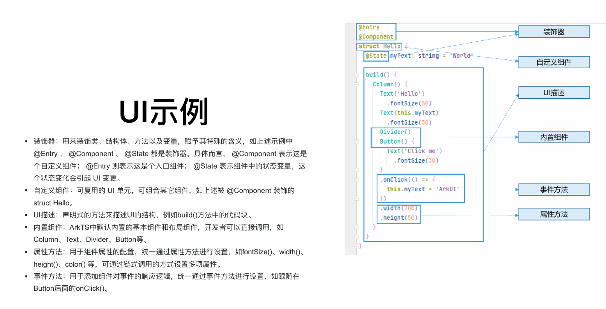

### 生命周期

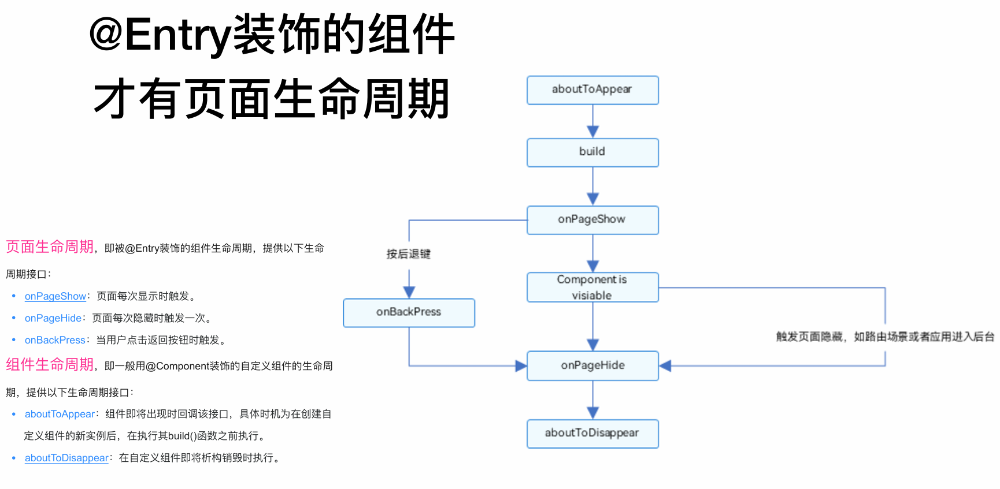

### 状态管理

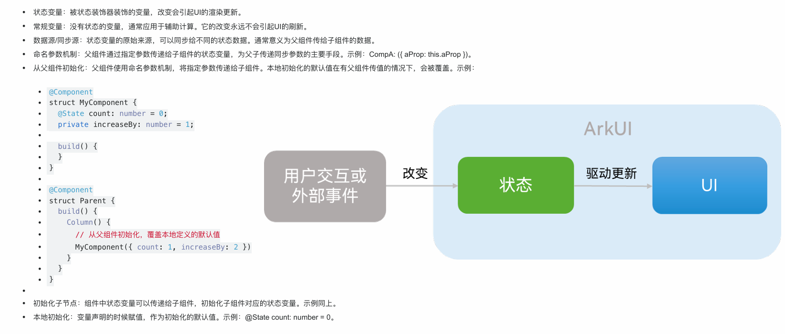

- **MVVM**：

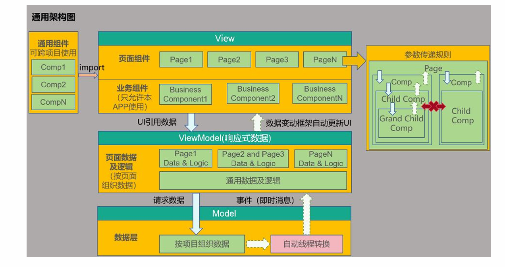

### 渲染控制

- **if/else**条件控制

- **ForEach**

  ```typescript
  ForEach(
    arr: any[], 
    itemGenerator: (item: any, index?: number) => void,
    keyGenerator?: (item: any, index?: number) => string 
  )
  ```

  - `itemGenerator`(子组件生成函数)：这是一个函数，框架会为数组中的每一项（`item`）调用它一次。你在这个函数里，需要**返回一个UI组件**，这个组件将用当前这项数据（`item`）来构建。
  - `keyGenerator`(键值生成函数)：为数组中的每一项生成一个**唯一的字符串标识（key）**，通常从item中直接提取（比如唯一的id,name之类）

### 布局结构

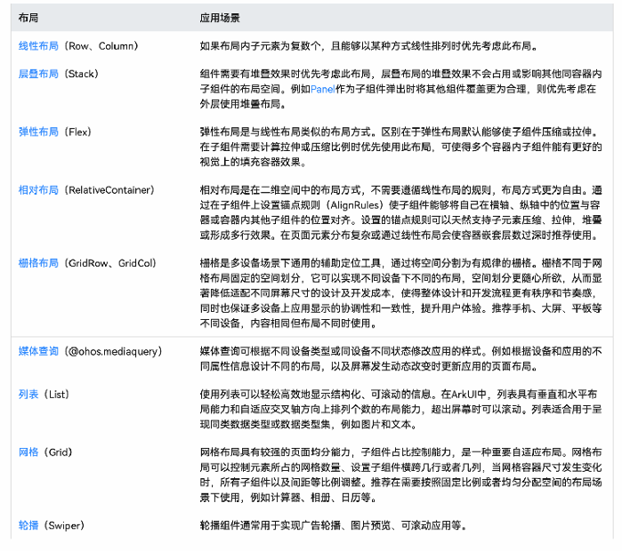

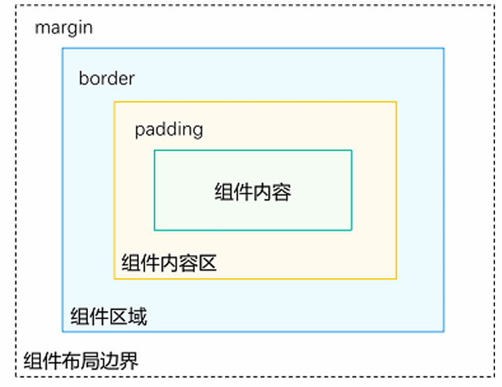

- 组件区域（蓝区方块）：组件区域表明组件的大小，width、height属性设置该区域的大小。
- 组件内容区（黄色方块）：组件区域大小减去组件的padding值，组件内容区大小会作为组件内容（或者子组件）进行大小测算时的布局测算限制。
- 组件内容（绿色方块）：组件内容本身占用的大小，比如文本内容占用的大小。组件内容和组件内容区不一定匹配，比如设置了固定的width和height，此时组件内容区大小就是设置的width和height减去padding值，但文本内容则是通过文本布局引擎测算后得到的大小，可能出现文本真实大小小于设置的组件内容区大小。当组件内容和组件内容区大小不一致时，align属性生效，定义组件内容在组件内容区的对齐方式，如居中对齐。
- 组件布局边界（虚线部分）：组件通过margin属性设置外边距时，组件布局边界就是组件区域加上margin的大小。

### UI渲染

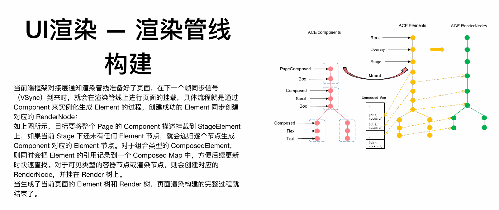

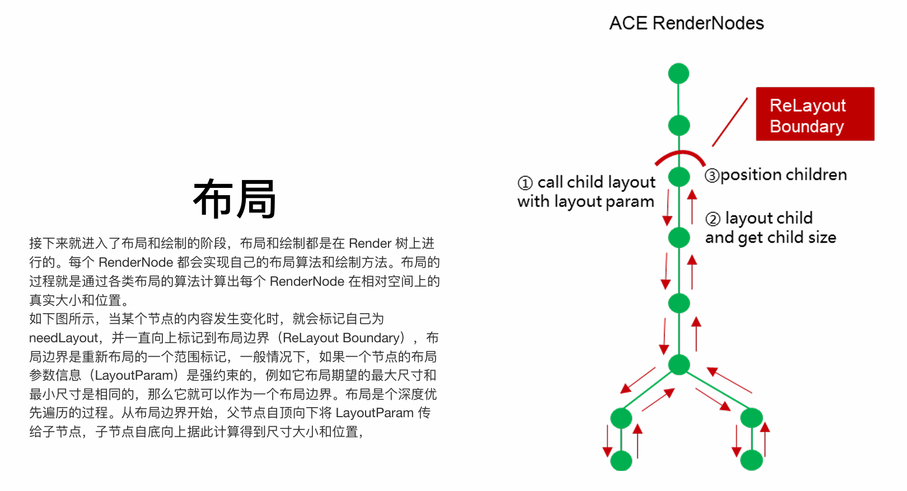

对于每个节点来说，布局分为三个步骤： 

- 当前节点递归调用子节点的 layout 方法，并传递布局的参数信息 （LayoutParam），包含了布局期望的最大尺寸和最小尺寸等 
- 子节点根据布局参数信息，使用自己定义的布局算法来计算自己的尺寸大小 
- 当前节点获取子节点布局后的大小，再根据自己的布局算法来计算每个子节点的位置信息，并将相对位置设置给子节点保存 
- 根据上述的流程，一次布局遍历完成后，每个节点的大小和位置就都计算出来了，可以进行下一步的绘制。

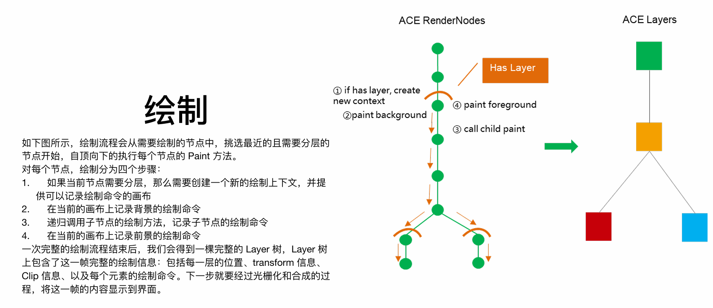

#### 1. Component树、Element树、Render树

此为UI渲染的**三层树形结构模型**，是框架渲染机制的核心。

- **Component树**：由开发者声明的**UI结构蓝图**，是静态的组件描述信息。它定义了UI“应该是什么”。
- **Element树**：在运行时由Component树实例化生成的**UI实例树**。它负责管理UI节点的生命周期，是连接Component和Render的桥梁。框架会通过 `Composed Map`记录组合元素，以实现高效的局部更新。
- **Render树**：由Element树中需要可视化的节点所对应的**渲染节点**构成。它负责具体的布局、绘制等渲染操作，是渲染引擎直接操作的最终对象。

**核心关系**：Component树 -(挂载)-> Element树 -(为可见元素创建)-> Render树。

------

#### 2. 布局的步骤

布局是确定每个渲染节点在屏幕上**大小和位置**的过程，在Render树上进行**深度优先遍历**。

1. **标记与确定布局边界**：当数据变化时，标记脏节点，并向上传递至最近的**布局边界**（通常是一个尺寸约束强烈的父节点）。
2. **自顶向下传递约束**：从布局边界开始，父节点将布局约束（`LayoutParam`，包含最大最小尺寸）传递给子节点。
3. **自底向上计算尺寸与位置**：
   - 子节点根据约束和自身内容，计算其**尺寸**。
   - 父节点收集所有子节点尺寸后，根据布局规则（如Flex、Grid）计算每个子节点的**位置**。

------

#### 3. 绘制

绘制是将布局结果转换为**绘制指令**的过程，并非直接生成像素。

- **指令录制**：遍历Render树，每个`RenderNode`将其视觉外观（形状、颜色、文字等）转化为一系列绘制命令，记录到 **`DisplayList`** 中。
- **图层机制**：为提高性能，频繁变化的节点可被提升到独立的**图层**。更新时只需重绘该图层，再与其他静态图层合成，避免全局重绘。
- **生成Layer树**：绘制过程的输出是一棵 **`Layer`树**，它包含了当前帧所有图层的绘制指令和空间变换信息。

**本质**：绘制是生成一份详细的、可由GPU高效执行的**绘制命令清单**。

------

#### 4. 光栅化与合成机制

此过程在**GPU线程**中执行，将绘制指令转化为最终屏幕图像。

1. **光栅化**：
   - GPU线程的**合成器** 从渲染队列中获取Layer树。
   - 对于每个Layer，执行其`DisplayList`中的绘制命令，将矢量图形和文本转换为**像素阵列**，并存储在GPU的**纹理** 中。
2. **合成**：
   - 合成器将多个Layer的纹理（包括新光栅化的和已缓存的）根据其层级、位置、透明度等信息，**合成为**最终一帧的图像，写入**图形缓冲区**。
3. **显示**：
   - 通过`SwapBuffer`操作，将准备好的帧提交到系统的**帧缓冲队列**。
   - 系统合成器进行全局合成后，送入屏幕的**帧缓冲区**，最终由显示器刷新呈现。

**核心价值**：此机制分离了UI线程的逻辑计算与GPU线程的图形计算，充分利用硬件加速，保证了渲染的性能和流畅度。

### 大前端框架演进

1. Web技术：主要依赖于WebView的技术，功能⽀持受限，性能体验很差，比如PhoneGap、Cordova、小程序。 
2. 原生渲染：使JavaScript作为编程语⾔，通过中间层转化为原⽣控件来渲染UI界面，比如React Native、Weex。 
3. 自渲染技术：自行实现一套渲染框架，可通过调用skia等⽅式完成自渲染，而不依赖于原生控件，比如Flutter、Unity。

### React、Flutter、ArkUI

**React Native** 代表了“原生渲染”方案，它基于 JavaScript 技术和虚拟 DOM，通过桥接（Bridge）将UI描述转换为原生控件进行渲染，其优势在于热重载和强大的动态化能力，但桥接通信的性能开销是其瓶颈。**Flutter** 则采用了更彻底的“自渲染”方案，使用 Dart 语言和 Skia 渲染引擎直接绘制UI，绕开了原生控件和桥接，从而实现了卓越的性能和高度的跨平台UI一致性，但其包体积和与原生环境的融合是主要考量。

而华为鸿蒙生态下的 **ArkUI** 框架，在设计上融合了前述框架的优点并进行了深度优化。它支持**声明式**和**类Web**两种开发范式，后端由统一的C++高性能引擎驱动。其核心优势在于通过先进的**方舟编译器与运行时**、高效的**三棵树渲染机制**（Component、Element、Render）以及精准的**状态管理V2**，实现了媲美原生的渲染性能。更重要的是，ArkUI通过**多态UI**和**原子化布局**能力，天然为HarmonyOS全场景设备适配而生，是开发生态内的首选UI框架。

## 需求分析

### 层次性

**传统信息系统软件需求的分层 • 业务需求  • 用户需求  • 系统需求**

**移动互联网领域考虑三个层次 • 战略  • 产品  • 功能**

### 涉众

传统涉众流程：

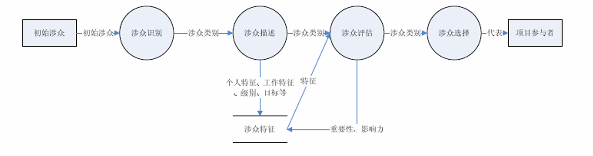

移动互联网应用用户的特点 

• 对于用户来说  **• 用户都是大规模，不确定的  • 社交属性，粘滞性  • 易变，更短抉择，随性**  • 常规涉众分析方法不是很有效  

• 对于其它涉众来说  • 常规涉众分析方法还是基本有效的

### 需求获取

传统方法：

- **面谈、问卷、观察、文档分析、调研、原型、民族志**

移动互联网应用适应的方法

- **“上线”原型法**  
  - 运营数据分析、数据统计、数据挖掘  
  - 用户模拟 
- **竞品分析**  
  - 抄袭法

### 关注点

传统关注点：

- **工作流程、用户界面**

移动互联网关注点：

- **互联网特性**：懒惰or简单直观 ； 猎奇的心理or新鲜感 ； 免费or低费用

- **移动端特性**：拍照；电话；短信；Sensor……
- **跨端特性**：应用迁移，协作，共享，开发（一次开发、多端部署）

### 需求组织

传统组织方法：

- 基于**场景**
- 基于**用例**

移动互联网方法：

- **User Story & 技术故事**  
  - Scrum中的 Product Backlog  
- **Behavior Specification**  
  - 测试中得复用

## AbilityKit、Network Kit 、ArkData和ArkWeb

Ability Kit（程序框架服务）提供了应用程序开发和运行的应用模型，是系统为开发者提供的应用程序所需能力的抽象提炼，它提供了应用程序必备的组件和运行机制。有了应用模型，开发者可以基于一套统一的模型进行应用开发，使应用开发更简单、⾼效。

### 冷启动与热启动

**UIAbility是系统调度的最小单元**。在设备内的功能模块之间跳转时，会涉及到启动特定的UIAbility，包括应用内的其他UIAbility、或者其他应用的UIAbility（例如启动三方支付UIAbility）

UIAbility的启动流程始于一个明确的意图（`Want`），这个意图指明了目标UIAbility的包名、组件名等关键信息。整个流程的核心是生命周期回调的依次触发。如果是**冷启动**（即UIAbility实例完全不存在），系统会首先创建实例并调用`onCreate()`进行初始化，此时可以接收启动方传递的参数。紧接着，系统为其准备一个UI窗口，触发`onWindowStageCreate()`回调，在此方法中，开发者必须通过`windowStage.loadContent()`加载指定的首个页面组件，这是UI绘制的起点。随后，UIAbility进入前台，`onForeground()`被调用，表明其已准备好与用户交互。

若是**热启动**（即UIAbility实例已存在但处于后台），则不会触发`onCreate()`和`onWindowStageCreate()`，而是直接通过`onForeground()`将其唤醒到前台。一个关键细节是，如果启动时`Want`中包含了特定的页面路径参数，无论是在冷启动的`onWindowStageCreate()`还是热启动的`onNewWant()`中，都需要解析此参数并动态加载对应的页面，而非固定的首页，以此实现精准的深度链接。此外，当需要从目标UIAbility返回结果时，启动方应使用`startAbilityForResult()`，而目标UIAbility在完成任务后需调用`terminateSelfWithResult()`来回传数据，完成一个带数据交换的闭环启动流程。

### 用户首选项

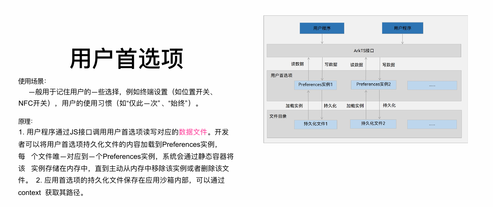

### Web组件的生命周期

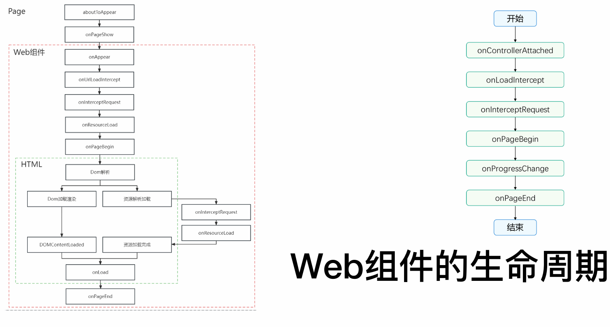

**1. Page 阶段（承载页面的生命周期）**

此阶段由承载 Web 组件的 ArkUI 页面（如 `Ability`或自定义组件）主导。当页面创建和显示时，会依次触发 `aboutToAppear`和 `onPageShow`等标准页面生命周期回调。这标志着 Web 组件实例已被创建并准备就绪。

**2. Web 组件阶段（组件自身与网页初始化的交互）**

此阶段是 Web 组件自身的核心生命周期，起始于页面的 `onPageShow`之后。主要事件按序触发：

- **`onAppear`**：Web 组件在页面上变为可见。
- **`onControllerAttached`**：Web 组件的控制器被附加，开发者可获取 `WebviewController`实例以控制网页。
- **`onUrlLoadIntercept`**：在加载主 URL 前触发，允许拦截并修改初始请求地址。
- **`onInterceptRequest`**：在网页发起任何网络请求（主文档或资源）时触发，允许拦截并自定义响应。
- **`onPageBegin`**：主页面开始加载时触发。
- **`onResourceLoad`/`onProcessChange`**：网页加载任何子资源（如图片、脚本）或者状态改变时触发，用于监听或处理资源。

**3. HTML 阶段（内部网页的标准生命周期）**

此阶段对应内部 Web 页面的加载与渲染过程，与上述 Web 组件事件交织进行：

- **Dom 解析与加载渲染**：浏览器解析 HTML 并构建 DOM 树。
- **资源解析与加载**：并行加载页面依赖的样式、脚本、图片等资源，此过程会触发 Web 组件的 `onInterceptRequest`和 `onResourceLoad`回调。
- **`DOMContentLoaded`**：当初始 HTML 文档被完全加载和解析完成时触发（无需等待样式表、图片等子资源）。
- **`onLoad`**：网页所有资源（如图片、样式表）加载完成后触发。
- **`onPageEnd`**：页面加载完成或失败时触发，标志主文档加载流程结束。

### H5与ArkTs交互

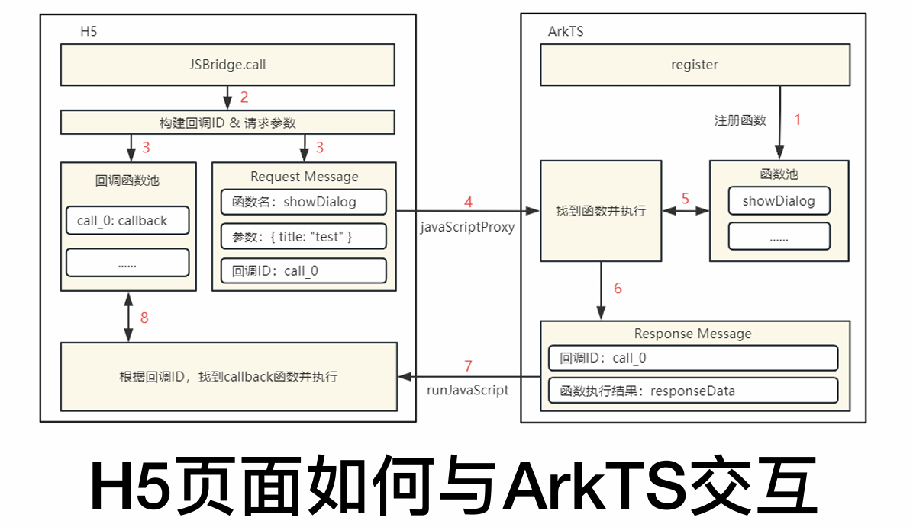

整个流程始于H5页面需要调用原生能力。首先，ArkTS侧必须预先通过`javaScriptProxy`接口注册一个对象及其方法，这相当于为H5提供了一个可调用的API列表。

当H5中的JavaScript代码决定调用已注册的某个方法时，交互正式开始。H5端会先生成一个唯一的`callbackId`来标识此次特定调用，并将此ID、要调用的方法名以及参数一起封装成一个请求消息。这条消息通过图中标示的`javaScriptProxy`通道被发送到ArkTS侧。

ArkTS端的`WebviewController`接收到请求后，会解析出方法名和参数，并执行对应的ArkTS函数。当该函数完成其逻辑并产生结果后，ArkTS会将该结果与H5传来的`callbackId`一同封装成响应消息。最后，通过`runJavaScript`方法执行一段特定的JavaScript代码，将结果数据传回H5页面。

H5页面内有一个监听机制，负责接收此响应。它根据响应中的`callbackId`找到最初发起请求时保存的那个回调函数，并将结果传递给它执行，从而完成一次从H5发起请求到ArkTS处理并返回结果的完整闭环通信。这种设计实现了两端能力的解耦与高效协同。

## 架构设计视角

### 业务架构

业务架构的核心思想是“分而治之”，通过清晰的边界划分来保障复杂电商系统的有序和稳定。其首要原则是**业务平台化**，将庞大的电商生态拆分为一系列相互独立的平台，比如交易平台、仓储平台、物流平台等，每个平台专注自己的领域。在此基础上，强调**核心业务与非核心业务分离**，确保像交易下单这样的主流程尽可能精简和稳定，而非核心功能可以灵活多样地发展。同时，要**隔离不同类型的业务**，例如对稳定性要求极高的普通交易业务和对高并发有特殊需求的闪购业务，需要分开部署和管理，避免相互影响。最后，必须**区分主流程和辅流程**，像下单、支付这样的主流程必须同步实时完成，而发送通知、更新积分等辅流程则可以异步化处理，确保主流程不受干扰。

### 应用架构

应用架构的核心目标是构建一个高内聚、低耦合、易于扩展和治理的分布式系统。其设计围绕**解耦与拆分**展开，将稳定部分与易变部分分离，并将应用与数据分离，从而降低复杂性。**抽象化**是关键手段，应用只依赖服务抽象而非具体实现，数据库也被抽象为逻辑库，使应用无需关心底层物理部署细节。为了保障系统韧性，**容错设计**是必须的，要求服务能自治，避免连锁反应，并通过集群和多机房部署实现容灾。在交互上，提倡**松耦合**，跨业务域的调用尽量异步化，必须同步时则要设置超时和队列长度。最终，所有服务都需要是**可治理的**，具备可降级、可限流、可监控和白名单等运营能力。服务设计本身要遵循无状态、可复用等原则。

### 数据架构

数据架构专注于数据的安全、高效流动与存储。首要原则是**数据与应用分离**，应用系统不能直接访问其他服务的数据库，必须通过接口调用，这保证了数据边界的清晰和安全。面对海量数据，需要进行**数据异构**，即根据查询需求对同一份源数据构建不同的索引或库表，比如为订单分别建立买家库和卖家库以支持不同的查询视角。**读写分离**是应对高访问量的基本策略，同时对数据量巨大的表进行分库分表。京东在实践中主要**选用MySQL数据库**，这既是出于成本考虑，也源于其在MySQL的扩展性和高并发处理上积累了深厚的技术和经验。数据平台的建设统一了数据接入、计算和服务的流程。

### 技术架构

技术架构为整个系统提供了稳定可靠的底层支撑。它构建了统一的**基础平台**，提供包括服务调用、缓存、消息队列、监控、存储等在内的各种技术组件，这些是业务应用的基石。在**系统运行时**，有一系列严格要求，比如系统必须可监控，具备在线扩容能力，支持故障转移，并且新功能发布要支持灰度模式，出了问题能快速回滚。在**系统部署**上，遵循N+1原则消除单点故障，通过虚拟化技术提高资源利用率，并按照业务域划分业务子网进行物理隔离。京东自研的JSF服务框架是技术架构的典型体现，它高性能地实现了服务调用，并内置了丰富的治理功能。

### 整体横向分层抽象，局部纵向贯穿分解


“整体横向分层抽象”指的是从**全局视角**出发，将整个系统按照不同的职责和抽象层次，横向地切割成若干个相对独立的层次。每一层都有其明确的单一职责，并为其上层提供简洁、稳定的接口（服务抽象）。这是一种**以稳定性对抗复杂性**的手段。

“局部纵向贯穿分解”则是在上述横向分层的基础上，从**单个业务域或业务功能**的**局部视角**出发，进行垂直的、端到端的切割。一个纵向单元会像一根柱子一样，从上到下贯穿所有必要的层次，形成一个能够独立开发、测试、部署和运维的完整业务闭环。

## 高可用 高并发

整个架构的演进与设计，可以看作一个从“单体架构”逐步向“分布式、高可用、高并发架构”演化的过程，其所有技术手段都围绕着两个核心目标：**高可用（尽可能保证系统不中断）** 和 **高并发（尽可能提升系统处理能力）**。

### 大型网站架构演化历程

大型网站的架构并非一蹴而就，而是随着业务量和数据量的增长逐步演化而来的。其核心思路是从单一应用出发，通过不断的**分离**（应用与数据分离、读写分离）、**拆分**（业务拆分、服务化）和**集群化**（应用集群、数据库分库分表），来提升系统的扩展性和处理能力。

这个过程大致遵循以下路径：

1. **单一应用**：所有组件（应用、数据库、文件）部署在一台服务器上。
2. **服务分离**：将应用、数据库、文件服务器分离，各自独立部署，专机专用。
3. **引入缓存**：使用本地缓存和分布式缓存（如Redis）缓解数据库读取压力，这是提升性能和并发能力的关键第一步。
4. **应用集群化**：通过负载均衡设备（如Nginx、LVS）将应用部署为集群，实现水平扩展。
5. **数据库读写分离**：主数据库负责写操作，从数据库负责读操作，缓解数据库压力。
6. **使用CDN和反向代理**：利用CDN加速静态资源访问，反向代理（如Nginx）提供缓存和负载均衡，加速网站响应。
7. **分布式文件与数据库**：采用分布式文件系统（如HDFS）存储大量文件，对数据库进行分库分表，解决单机存储容量和性能瓶颈。
8. **使用NoSQL与搜索引擎**：引入非关系型数据库（如MongoDB）和搜索引擎（如Elasticsearch）应对多样化的数据查询需求。
9. **业务拆分与服务化**：将巨型应用按业务线拆分为多个独立的应用（如商品、订单、用户系统），并通过分布式服务框架（如Dubbo、JSF）进行通信，实现解耦和独立部署。
10. **分布式服务**：构建统一的服务治理平台，管理服务的注册、发现、监控和容错，完成从“应用集群”到“服务网格”的进阶。

### 高可用（High Availability）

高可用的目标是保证系统服务能持续可用，其核心设计理念是**冗余**和**容错**。即使系统的某个部分发生故障，也能通过备用方案保证核心流程可用。

1. **负载均衡与反向代理**

   - **负载均衡**：将流量均匀地分发到多个应用服务器上，是实现应用集群和高可用的基础。工作在四层（TCP/IP）的如LVS，工作在三层（HTTP）的如Nginx。
   - **反向代理**：代理服务器接收请求，转发给内部服务器，并将结果返回。Nginx等反向代理器还能提供**缓存**、**压缩**、**SSL终结**等功能，有效减轻后端服务器压力。其`location`配置规则是管理流量的核心。

2. **隔离**

   其核心思想是“避免单一故障点引发雪崩效应”。通过设置边界，将故障控制在局部。

   - **线程/进程隔离**：为不同重要性的服务分配独立的线程池或进程。
   - **集群隔离**：为核心业务（如秒杀）创建独立的服务器集群。
   - **机房隔离**：多机房部署，实现异地容灾。
   - **读写隔离**：数据库主从分离，读操作和写操作使用不同实例。

3. **限流**

   当系统容量达到瓶颈时，拒绝部分请求以保全整体，防止系统被压垮。常用算法有：

   - **计数器**：简单粗暴，统计单位时间内的请求数。
   - **漏桶算法**：以恒定速率处理请求，平滑流量，但无法应对突发流量。
   - **令牌桶算法**：系统以恒定速率向桶中放入令牌，请求需获取令牌才能被处理，既能限制平均速率，也允许一定程度的突发流量。分布式限流常使用 **Redis + Lua** 脚本保证原子性。

4. **降级**

   当系统出问题或压力过大时，暂时关闭某些非核心服务或返回默认值，保障核心链路畅通。例如，在流量高峰时关闭商品评价功能，直接返回“服务繁忙”的静态页面。降级可以是手动的，也可以是基于故障感知的自动熔断。

5. **超时与重试机制**

   - **超时**：为所有跨进程调用（如RPC、数据库查询）设置合理的超时时间，避免慢请求积压耗尽系统资源（如线程池）。
   - **重试**：对于因网络抖动等临时性故障导致的失败，可以进行有限次数的、有退让策略（如间隔时间递增）的重试。重试必须注意**幂等性**。

6. **回滚**

   当系统升级或变更出现问题后，能快速恢复到上一个稳定版本。包括代码回滚、数据版本回滚、配置回滚等。这是线上变更安全的最后一道防线。

7. **压测和预案**

   - **压测**：通过模拟真实用户流量，探测系统瓶颈和容量上限，做到心中有数。包括线下压测和更真实的线上全链路压测。
   - **预案**：提前制定好各种故障（如服务器宕机、数据库中断、流量激增）的应对方案，以便在故障发生时能快速、有序地执行。

### 高并发（High Concurrency）

高并发关注的是如何提升单位时间内的请求处理量。其核心是**加速**和**并行**。

1. **应用级缓存**

   将频繁读取的数据存放在访问速度极快的内存中，是提升性能最有效的手段之一。缓存可以在各个层级存在：

   - **本地堆缓存**：如Guava Cache、Caffeine，速度最快，但无法在集群间同步。

   - **堆外缓存**：避免Java GC压力，存储更多数据。

   - **分布式缓存**：如Redis，集群共享，容量大，是应用最广泛的缓存方案。

     缓存策略（如LRU淘汰策略）和缓存模式（Cache-Aside、Read-Through等）的设计至关重要。

2. **HTTP缓存**

   利用浏览器和CDN的缓存机制，对于静态资源（如图片、CSS、JS）设置合适的HTTP头（如`Cache-Control`, `ETag`），使客户端直接使用本地缓存，极大减少服务器请求和网络带宽。

3. **连接池**

   对于数据库、HTTP等需要建立TCP连接的资源，使用连接池复用已建立的连接，避免频繁创建和销毁连接的开销，极大提升性能。常见的如数据库连接池（Druid, HikariCP）、HTTP客户端连接池等。

4. **异步并发**

   将耗时的操作异步化，避免阻塞主线程，从而释放资源处理更多请求。

   - **异步编程**：使用`CompletableFuture`等工具进行异步任务编排。
   - **消息队列**：将非实时性的操作（如发送通知、记录日志）放入消息队列，由后台服务异步消费，实现流量削峰和系统解耦。

5. **扩容**

   当单机性能达到极限时，通过增加机器数量来提升整体处理能力，这是解决高并发问题的根本方案。

   - **垂直扩容（Scale-up）**：提升单机硬件性能（如CPU、内存），有物理上限。
   - **水平扩容（Scale-out）**：增加机器数量，理论上是无限的。这需要应用本身是**无状态**的，并通过负载均衡进行流量分发。

6. **队列**

   队列是实现异步化和削峰填谷的核心组件。它作为一种缓冲区，平衡了生产者（请求方）和消费者（处理方）的速度差异。

   - **任务队列**：将瞬时高峰的大量请求排队，平滑地交由后端服务处理。
   - **消息队列**：如Kafka、RocketMQ，用于系统解耦、异步通信和数据同步。

## 进程与线程

### 异步并发（Promise和async/await）

ArkTS语言提供了基于Promise和async/await的异步并发能力，这是标准的JavaScript异步语法糖，主要用于处理单次I/O任务等不会阻塞主线程的操作。它的工作原理是“挂起与恢复”：当遇到异步操作（比如一个网络请求或文件读写）时，代码不会傻等着结果，而是先将这个任务挂起，然后继续执行后面的同步代码。等那个异步任务完成后，再回来执行预设的回调函数。

Promise对象就像一个承诺，它有三种状态：进行中（pending）、已成功（fulfilled）和已失败（rejected）。它允许你以链式调用的方式组织代码，用`.then()`处理成功情况，用`.catch()`捕获异常，让异步流程更清晰。而async/await则让异步代码写起来更像同步代码，更易读。你在一个函数前加上`async`关键字，在需要等待的Promise前加上`await`，执行就会“暂停”直到这个Promise出结果。文档中的例子展示了如何用`await`等待一个3秒后返回信息的Promise，使得异步逻辑的编写和理解变得非常直观。这种模式完美适用于那些不需要同时跑多段代码，但需要避免界面卡顿的单一耗时任务场景。

### TaskPool机制和Worker机制

当应用需要执行CPU密集型或长时间运行的任务，真正需要“同时”做多件事时，就需要用到多线程并发。ArkTS提供了TaskPool和Worker两种基于Actor模型的方案，它们的核心思想是“消息通信而非内存共享”，即不同线程不直接操作同一块内存，而是通过序列化消息来传递数据和结果，从而避免复杂的锁问题。

**TaskPool**更像一个智能的、由系统管理的“线程池”。你只需要用`@Concurrent`装饰器标记一个函数，然后通过`taskpool.execute()`把任务丢进去，系统就会自动分配工作线程来执行它，并负责负载均衡和线程生命周期管理。它适合大量、独立、短时（小于3分钟）的任务，比如图像处理分段计算。系统默认会动态扩容缩容工作线程以优化资源，对开发者非常友好。

**Worker**则更像一个专属于你的“专职线程”。你需要手动创建并管理一个Worker线程，它具备独立的运行环境。它适合长时间占据线程的任务（如超过3分钟的数据分析训练）或有关联性的连续操作。缺点是创建有开销且不支持动态优先级调度。

选择谁？简单来说，大多数情况下用**TaskPool**，因为它更高效、易用；只有当任务运行时间极长或需要永久保持线程状态时，才考虑使用**Worker**。

### 进程模型

在Stage模型中，应用的生命周期和资源隔离是以“进程”为基本单位的。一个应用内并非所有组件都运行在同一个进程里，系统根据组件类型进行了智能的划分，以实现更好的安全性和稳定性。

具体来说，通常一个应用的所有`UIAbility`、`ServiceExtensionAbility`和`DataShareExtensionAbility`会共享一个主进程。而其他每种类型的ExtensionAbility（如表单扩展FormExtensionAbility）则可能运行在独立的进程中。此外，Web组件还会有自己单独的渲染进程。这种设计使得某个扩展组件的崩溃不会导致整个应用的闪退。

模型还支持更灵活的进程配置。比如，可以为特定的`UIAbility`静态指定一个自定义进程名，或者通过设置了`isolationProcess: true`让其动态分配到新进程。甚至还可以创建生命周期与父进程绑定的“子进程”来处理一些后台业务。总而言之，这个模型通过精细的进程隔离，确保了应用各部分既能协同工作又能互不干扰。

### IPC机制

IPC（进程间通信）解决了不同进程“墙”的问题，允许它们安全地交换数据和调用服务。其核心是经典的**客户端-服务端（Client-Server）模型**。服务端进程首先将其能力作为一个“系统服务”注册到**系统服务管理器**（SAMgr）。当客户端进程需要调用该服务时，它首先从SAMgr获取一个服务的“代理”（Proxy）对象。这个代理对象就像服务的一个本地替身，客户端调用代理的方法，代理会通过底层的Binder驱动将请求转发给真正的服务端进程（Stub），并将处理结果返回。整个过程对客户端来说是透明的，感觉就像在调用本地方法。

开发时，服务端需要创建一个继承自`rpc.RemoteObject`的Stub类，并实现`onRemoteMessageRequest`方法来处理客户端请求。客户端则通过`connectServiceExtensionAbility`绑定服务，获取代理对象，然后使用`sendMessageRequest`方法发送请求。需要注意的是，单次IPC传输的数据量有大约1MB的限制，更大的数据需采用匿名共享内存等方式。这套机制是系统内跨进程协作的基础，保证了数据交换的安全与有序。

## 关注点

### 关于秒杀系统

秒杀系统的设计本质上是应对一种**极端的高并发场景**，它的核心矛盾在于海量用户瞬间涌入与极其有限的商品库存之间的巨大落差。想象一下，一个原价千元的商品以一元钱秒杀，活动开始的瞬间，系统的访问流量可能会是平时的数百倍，这种洪峰流量如果处理不当，会直接冲垮整个系统。因此，架构设计的首要目标不是追求百分百的请求都成功，而是保障整个系统在极限压力下不崩溃，并能让少量幸运的用户以公平的方式完成交易，同时确保数据不错乱，比如库存不能超卖。

为了实现这个目标，整个架构遵循着“层层过滤、逐步削峰”的指导思想。首先，会把秒杀系统与主站业务进行**物理隔离**，使用独立的域名和服务器集群，这样秒杀的流量洪峰就不会影响网站其他正常用户的购物体验。接着，会对秒杀页面进行最大程度的**静态化**处理，将商品详情、图片等不变的内容推送到CDN和用户浏览器缓存中，让大部分请求在到达应用服务器之前就被消化掉。对于必须动态生成的环节，比如“立即购买”按钮的点亮，会采用动态生成随机URL等“**动态化**”技术，防止用户在秒杀开始前通过技术手段提前提交请求。

对于穿透到后端的核心交易请求，系统会采用**异步化和队列**机制进行“削峰填谷”，将瞬间的同步下单请求转换为异步消息放入队列，后端的服务按照自己的能力从队列中逐步消费，这样数据库就不会被瞬间击垮。在数据层面，**热点数据**的处理尤为关键，系统需要能实时发现哪些商品被疯狂抢购，并将这些热点商品的库存信息提前加载到应用本地缓存中，通过专门的路由策略将请求引导到独立的处理单元，避免所有请求都去集中访问数据库的同一行数据。最后，在**减库存**这个最核心的操作上，通常会采用“预扣库存”的策略，即用户下单时先在缓存中锁定库存，付款时再真正扣减，从而在用户体验和数据一致性之间找到一个平衡点。整个过程中，还穿插着**限流、降级和熔断**等各种预案，确保系统在压力过大时能“丢卒保车”，保护核心链路不受影响。

### 关于可视化全链路日志追踪

在由数百个微服务构成的庞大分布式系统中，一个用户请求，比如下单，可能会流经几十个不同的服务，任何一个环节出现延迟或错误，都会导致整个请求失败。可视化全链路日志追踪就是为了解决这种“故障定位难”的问题而生的，它的核心思想是给每一个独立的用户请求分配一个唯一的“身份证”（即`TraceId`），并记录下它在整个分布式系统中流经的每一个“关卡”（即Span），最终将这些分散的日志串联成一幅完整的调用链图谱。

这套系统的原理可以概括为“**链路染色**”。当一个请求进入系统入口时，追踪系统会为它创建一个全局唯一的`TraceId`，并随着请求在服务间的调用（通常通过RPC框架的上下文传递）而一路“染色”下去。每个服务在处理请求时，都会在本地记录一条包含`TraceId`、父`SpanId`、自身`SpanId`、开始时间、结束时间、标签等信息的日志。之后，这些分散在各个机器、各个服务上的日志会被一个统一的日志采集器收集起来，发送到专门的后端存储与计算平台（比如基于Elasticsearch的系统）。

最终，运维或开发人员可以在一个可视化界面上，通过查询这个`TraceId`，清晰地看到这个请求的完整生命周期：它先后调用了哪些服务、在每个服务上停留了多久、是否发生了错误、错误的堆栈信息是什么。这就好比给整个分布式系统安装了一个“X光机”，使得原本黑盒般的内部调用过程变得透明可见，能够快速定位到是哪个服务、甚至是哪一行代码导致了性能瓶颈或故障，极大地提升了系统的可观测性和故障排查效率。

## 系统工具库

### 相机开发服务

其设计遵循一个清晰的“管道”模型。正如架构所示，它抽象了从硬件采集到结果输出的完整流程。开发者通过最上层的相机API进行操作，配置输入（选择摄像头、调参）、建立会话（定义拍照或录像等场景）、并管理输出（将图像流送往预览界面或编码成文件）。底层则通过硬件设备接口（HDI）标准化地调用不同厂商的摄像头硬件，确保上层应用逻辑与具体硬件解耦。

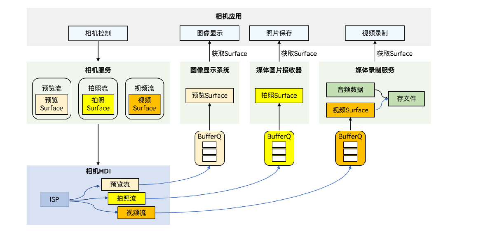


### 传感器运作机制

其核心是一个典型的“**生产者-消费者**”模型与分层架构。

最上层是**Sensor API**，为应用提供统一的调用接口，主要包含查询传感器列表， 订阅/取消传感器的数据、执行控制命令等，简化应用开发；

其下的**Sensor Framework**作为中枢，管理所有应用的数据订阅请求与分发策略；

最核心的**Sensor Service**作为系统服务，直接与内核层的**Sensor Driver**交互，实现HD_IDL层数据接收、解析、分发，采集原始的物理数据，并进行校正、融合等初步处理。

当应用订阅某一传感器后，数据便会沿着这条通道，以事件的形式从驱动层历经服务层、框架层，最终回调到您的应用中。整个过程中，系统还负责严格的权限管理和后台策略控制，以防止恶意应用过度耗电或窃取敏感信息。

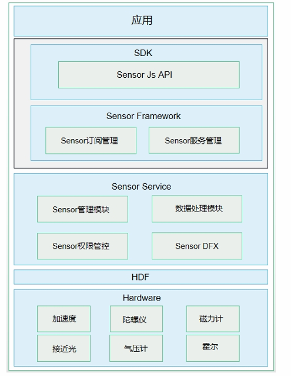

### 卡片的实现、渲染与数据交换

卡片是一个三方协作的生态系统。**卡片提供方**（即应用）负责定义卡片的UI模板和业务逻辑，并在`FormExtensionAbility`中响应卡片的生命周期。**卡片使用方**（如桌面）提供展示卡片的窗口。而连接两者的中枢是**卡片管理服务**，它负责所有卡片的添加、删除、持久化与调度管理。

卡片的**渲染原理**为了极致的安全与性能，采用了独立的**卡片渲染服务**。当桌面要显示一个卡片时，卡片管理服务会通知渲染服务，在一个与主应用隔离的独立沙箱环境中，加载并运行卡片提供方预编译的UI代码（ArkTS卡片），完成布局和绘制。渲染结果以受控的视图数据或快照形式送回桌面显示。这种设计意味着，即使一个卡片逻辑崩溃，也不会影响到桌面或其他卡片的稳定运行。

正是基于这种渲染机制，**卡片的数据交换**也需要专门的设计。卡片UI与提供方应用之间的通信是受限且受管的。主要通道包括：提供方应用可以主动通过`updateForm`接口更新卡片内容；卡片内部可以通过`postCardAction`触发事件，请求应用端更新数据或跳转；此外，系统还提供了定时更新等被动刷新机制。所有这些交互都通过卡片管理服务进行中转和鉴权，确保了数据流的安全、可控。

## 从微服务到云原生

### 微服务架构

微服务架构是一种将单个应用程序构建为一套**小型服务**的架构风格，每个服务都拥有自己的进程，并通过轻量级的通信机制（通常是HTTP资源API）进行协作。其核心目标是将一个庞大的单体应用按照业务能力进行拆分，每个服务都具备**高度可维护、松耦合、独立部署**的特性，并由一个小团队全权负责其整个生命周期。

文献中明确指出，微服务架构的特征主要体现在以下几个方面：

1. **通过服务实现组件化**：与在程序内通过库进行调用的方式不同，微服务将组件定义为可独立部署的**服务**。使用服务作为组件使得接口变得明确，并允许服务之间采用粗粒度的通信。
2. **围绕业务能力组织团队**：避免传统的按技术层次（如UI团队、中间件团队、数据库团队）划分，而是组建跨功能的团队，每个团队专注于一个特定的业务领域（如订单、用户、商品），从而直接对业务成果负责。这符合康威定律——系统架构会反映组织的沟通结构。
3. **是产品而非项目**：团队不应在交付软件后即解散，而应秉持“谁构建，谁运行”的理念，对产品的整个生命周期负责，从而与用户建立长期联系，持续优化产品。
4. **智能端点与哑管道**：微服务倡导将业务逻辑集中在服务内部（智能端点），而服务间的通信基础设施（哑管道，如消息队列或API网关）应尽可能简单、通用，仅负责可靠的消息路由。
5. **去中心化治理与数据管理**：不强制要求使用统一的技术栈，允许团队根据服务特点选择最合适的工具（如不同的编程语言、数据库）。同时，每个服务拥有自己独立的数据存储，而不是共享一个庞大的单体数据库，这避免了紧密的数据库耦合。

这种架构通过将功能元素分解为独立的服务，并通过跨服务器分发这些服务来实现扩展，与将所有功能集中在一个单一进程中并通过复制整个单体进行扩展的传统方式形成鲜明对比。

### Docker, K8s, Istio 架构

这一部分构成了云原生应用的基石技术栈，对应着应用打包、编排部署和服务治理三个核心层面。

- **Docker** 解决了应用打包和隔离的问题。它利用容器技术，将应用及其所有依赖（库、环境配置等）打包到一个标准化的单元中。容器与虚拟机不同，它**共享主机操作系统的内核**，通过命名空间和控制组（cgroups）实现进程隔离，这使得它更加轻量、启动更快。
- **Kubernetes (K8s)** 是容器编排领域的事实标准。它负责管理、部署和扩展容器化应用。其架构是典型的**主从节点模型**。主节点（Master）是大脑，负责接收指令、调度和集群管理；工作节点（Node）是手臂，负责运行容器。核心概念包括 Pod（一个或多个紧密关联容器的组合）、Deployment（定义应用的部署策略）、Service（为一组Pod提供稳定的网络访问入口）等。K8s实现了应用的自动化部署、自愈、扩缩容等能力。
- **Istio** 是一个服务网格（Service Mesh）的实现，用于处理服务间的通信、安全、可观测性和流量控制。它的核心架构分为**数据平面**和**控制平面**。数据平面由部署在每个服务Pod旁边的Sidecar代理（Envoy）组成，所有流入流出的网络流量都经过它。控制平面（Pilot, Mixer, Citadel等）则负责管理和配置这些Sidecar代理。Istio将服务治理能力（如熔断、限流、遥测、安全认证）从应用代码中下沉到基础设施层，实现了业务逻辑与治理逻辑的彻底解耦，尤其适合治理多语言编写的微服务。

### Serverless

Serverless（无服务器计算）是一种云计算执行模型，其核心思想是让开发者**专注于编写业务代码，而无需关心服务器的管理、容量规划或运维**。它主要包含两个领域：

- **BaaS（后端即服务）**：将后端服务（如数据库、身份验证、消息队列）封装成可通过API调用的第三方服务，开发者直接集成使用，无需自建和维护后端基础设施。
- **FaaS（函数即服务）**：这是Serverless最典型的形态。开发者将代码编写为独立的、事件触发的函数。云平台（如AWS Lambda）负责在事件发生时（例如HTTP请求、文件上传、消息到达）动态分配资源运行函数，并在执行完毕后回收资源，按实际执行时间和次数计费。

Serverless的优势在于**极致弹性**和**成本优化**（空闲时不产生费用）。它非常适合**异步、并发、短暂、无状态**的应用场景，如图片处理、数据ETL、IoT数据处理、Webhook响应等。文献中通过多个示例展示了其应用，例如媒体格式转换、实时数据流处理、变更数据捕获（CDC）等。

### 云原生

云原生是一套构建和运行应用的方法论，旨在**充分利用云计算的优势**（弹性、按需、自助服务）。CNCF（云原生计算基金会）对其的定义是：“云原生技术有利于各组织在公有云、私有云和混合云等新型动态环境中，构建和运行可弹性扩展的应用。云原生的代表技术包括**容器、服务网格、微服务、不可变基础设施和声明式API**。”

其核心原理包括：

- **不可变基础设施**：任何部署都是通过替换整个镜像来实现，而非在原有服务器上修改配置，从而保证环境的一致性。
- **声明式API**：开发者通过声明“期望的状态”（如“我需要3个应用实例”）来控制系统，而非下达一系列指令，由系统自动收敛到该状态。
- **松耦合系统**：通过微服务和服务网格等技术，构建出 resilient（容错）、manageable（易管理）和 observable（可观测）的系统。

移动云的云原生平台（CNP）是这一理念的实践，它通过容器服务、容器镜像服务、Serverless能力等，提供了从资源供给、应用部署到运维监控的一站式云原生解决方案，实现了**分布式调度、全域流量管理和弹性伸缩**，目标是让应用可以“一次构建，随处运行”。

### AI原生

AI原生是指**将人工智能作为核心设计原则**来构建应用程序的全新架构范式。传统的应用是“AI外挂式”的，即在现有流程中插入AI能力；而AI原生应用则是“由内而外”地以AI模型和智能体（Agent）为引擎来驱动整个业务逻辑。

其架构核心包含：

- **以模型为中心**：大型语言模型（LLM）或其他基础模型成为应用的新“操作系统”，提供核心的认知和推理能力。
- **智能体（Agent）驱动**：应用由可感知、规划、执行和学习的自主或半自主的AI智能体构成。智能体通过工具（Tools）来调用外部API和系统，完成复杂任务。
- **标准化协议**：为了促进智能体之间、智能体与工具之间的互操作性，出现了如**模型上下文协议（MCP）**、**智能体间通信协议（A2A）** 等开放标准。

AI原生应用的成熟度分为多个级别，从初步探索的“验证级”到高度自主的“成熟级”。未来的应用架构将是基于模型、由Agent驱动、以数据为中心，并整合了各种工具链的形态，AI不再是功能点，而是应用的心脏和大脑。

## 高级特性

### 脚本基础流程运行图

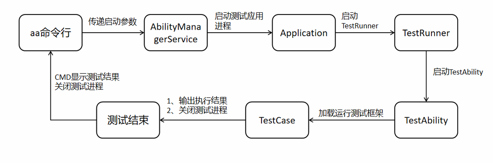

整个过程始于开发者在终端输入 **`aa`命令行**指令并传递参数。指令首先到达系统的 **`AbilityManagerService`**，由它负责调度。接着，系统**启动测试应用的独立进程**，并初始化其 **`Application`**。

应用启动后，核心的 **`TestRunner`** 被加载运行，它负责接管测试流程。随后，一个专门的 **`TestAbility`** 被启动，它承载了测试框架的真正执行环境。在这里，具体的 **`TestCase`**（测试用例）被加载、执行，并**输出执行结果**。

最终，这些结果会回显到启动测试的 **`CMD`命令行窗口** 中展示。无论成功与否，流程的最后都会**关闭测试进程**，标志本次**测试结束**。

### UI测试用例

一个完整的UI测试用例，正是上述框架原理的具体实践。它通常包含几个关键步骤：**初始化驱动、定位组件、执行操作、断言结果**。

文献中提供了一个典型的示例，代码如下所示。这段代码演示了如何测试一个简单的界面交互：点击一个文本为“Next”的按钮，然后验证界面是否出现了预期的变化（如显示了文本“after click”）。

```typescript
// 在 ohosTest > ets > test 文件夹下的 .test.ets 文件中
import { driver } from '@kit.TestKit'; // 1. 导入测试Kit

export default function abilityTest() {
  describe('MyUiTestSuite', () => {
    it('testClickNextButton', 0, async (done: Function) => {
      // 2. 初始化驱动
      const driver = Driver.create();
      await driver.delayMs(1000); // 等待界面稳定

      // 3. 定位组件：通过文本内容查找按钮
      const button = await driver.findComponent(ON.text('Next'));

      // 4. 执行操作：模拟点击事件
      await button.click();
      await driver.delayMs(1000); // 等待操作后的界面更新

      // 5. 断言结果：验证特定文本是否出现在界面上
      await driver.assertComponentExist(ON.text('after click'));

      await driver.pressBack(); // 模拟返回键
      done(); // 通知框架测试完成
    });
  });
}
```

**开发流程** 可以概括为：开发者首先利用`Driver`类提供的方法（如`findComponent`）来精准定位屏幕上的控件，定位方式可以是文本、ID、类型等多种属性。定位到控件后，调用`click()`, `swipe()`等方法模拟用户手势。最后，使用`assertComponentExist()`或获取组件属性后进行逻辑判断，来验证操作结果是否符合预期。

**执行与调试** 则非常灵活。除了在DevEco Studio中直接运行，文档还介绍了强大的命令行工具`hdc`，它允许开发者在真机或模拟器上进行灵活的测试操作。例如：

- **截图取证**：`hdc shell uitest screenCap`可以将当前界面保存为图片，便于可视化调试。
- **界面结构分析**：`hdc shell uitest dumpLayout`可以输出当前的控件树信息，帮助定位复杂的组件。
- **模拟用户输入**：可以直接通过命令注入点击、滑动等事件，如 `hdc shell uitest uiInput click 100 100`。
- **操作录制与回放**：`uitest uiRecord`功能可以记录用户的一套操作步骤，并生成可重复执行的脚本，极大提升了编写复杂流程测试用例的效率。

### NAPI对比JNI

NAPI 和 JNI 最根本的区别在于它们的**设计哲学和所服务的生态**。

**JNI** 是 **Java 世界（尤其是Android）调用本地代码的“标准答案”和“传统桥梁”**。它要求开发者在C++代码中严格按照Java的类、方法名规则来编写函数，手动处理繁琐的类型转换和引用管理。它的优势是生态极其成熟，但开发相对复杂，且与Java虚拟机深度绑定。

**NAPI** 则是 **HarmonyOS为ArkTS/JS引擎设计的“现代接口”和“稳定层”**。它的核心目标是**屏蔽底层JS引擎的具体实现**，为原生模块提供一个稳定的二进制接口。这意味着，用NAPI编写的C++模块，在系统JS引擎升级时无需重新编译就能直接运行，实现了“一次编译，到处运行”。同时，它的API设计对异步操作（Promise）更友好，与ArkTS的编程模式更契合，开发体验更简洁。

## 智能体

### 智能体的基本组成

一个智能体可以被看作是一个能够自主行动的软件系统。文献中将其核心能力概括为**推理（Reasoning）、行动（Action）、观察（Observation）、规划（Planning）、协作（Collaboration）和自我完善（Self-improvement）**。在一个典型的模块化框架中，智能体通常包含以下几个关键组成部分：

- **档案（Profile）**：定义智能体的身份和角色，比如它是一个编码助手还是旅游顾问。
- **记忆（Memory）**：负责存储信息，分为**短期记忆**（用于处理当前会话的上下文）和**长期记忆**（可以跨会话保存用户偏好等关键信息）。
- **规划（Planning）**：这是智能体的“大脑”，负责进行逻辑推理和任务分解，我们接下来会详细展开。
- **行动（Action）**：智能体与外部世界交互的手段，主要通过调用各种**工具（Tools）** 来实现，比如执行计算、搜索网络或调用API。
- **感知（Percept）**：接收外部输入的接口，如文本、图像或声音。

### 规划（Planning）的核心方法

规划是智能体实现复杂任务的关键，它包含了一系列让模型“思考”的策略。

**链式思考（Chain-of-Thoughts, CoT）**

- 这是最基础的推理方法，它鼓励模型将解决问题的步骤一步步写出来，而不是直接给出最终答案。这种方式能显著提升模型在数学或逻辑推理问题上的准确性。例如，在回答“一个杂耍演员能耍16个球，一半是高尔夫球，一半的高尔夫球是蓝色的，有多少蓝色高尔夫球？”时，模型会逐步推理：“总共有16个球，一半是高尔夫球，所以是8个。一半的高尔夫球是蓝色的，所以是4个。”这暴露了模型的思考过程，使得错误更容易被发现和纠正。

**ReAct（推理+行动）**

- ReAct框架将CoT推理与实际行动（调用工具）结合起来，形成一个“思考-行动-观察”的循环。智能体通过思考（Thought）来分析当前状况和决定下一步行动（Action），例如调用计算器或搜索引擎，然后观察（Observation）行动结果，并基于结果进行下一步思考，直到任务完成。这使智能体能够与外部环境交互，获取实时或精确的信息来解决问题。

**反思（Reflection）与自我优化（Self-Refine）**

- 这些是更高级的规划策略。**反思**是指智能体对自己之前的行为或输出进行批判性评估，找出错误或不足。**自我优化**则是在反思的基础上，让模型迭代地改进自己的输出。例如，模型先生成一个答案，然后基于一套标准（如准确性、完整性）对自己进行评审，提出改进意见，并重新生成一个更好的版本。

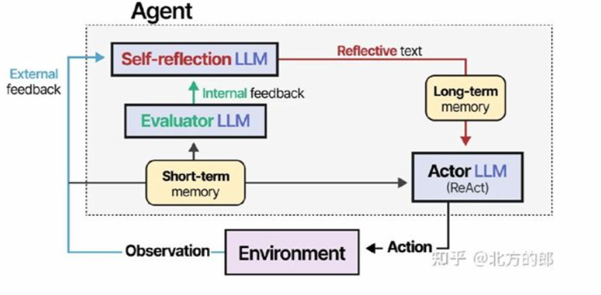

- 整个过程始于**行动**。智能体（Actor LLM）在**环境**中采取行动后，会收到**外部反馈**（成功/失败）。这个反馈首先触发**评估器**，分析问题并生成**内部反馈**（指出具体错误）。

  接着，核心的**自我反思**模块启动。它结合内部反馈和过往记忆，进行深度复盘，总结出“经验教训”，形成结构化的反思结果。这个结果被存入**长期记忆**，成为知识。

**子目标分解（Subgoal Decomposition）**

- 对于非常复杂的任务，智能体会采用子目标分解的策略，即将一个宏大目标拆解成一系列更小、更易管理的子任务，然后逐步解决。这类似于项目管理中的工作分解结构（WBS），使得复杂问题变得清晰可控。

### 检索增强生成（RAG）

RAG的核心原理是让大模型在回答问题前，先从外部的知识库（如公司文档、数据库）中检索相关信息，然后将这些信息作为上下文提供给模型，最终生成答案。这样做的好处是能将模型的通用知识与特定领域的专业知识相结合，生成内容更准确、更及时，同时减少模型“幻觉”（即编造信息）。

其流程通常包括：将知识库文档**分块/切片**，通过**嵌入模型（Embedding Model）** 将文本转换为向量并建立索引；当用户提问时，将问题同样转换为向量，并从索引中**检索**最相关的文本片段；最后，将这些片段作为上下文与问题一并送给大模型来**生成**最终答案。还可以通过**重排模型（Rerank Model）** 对检索结果进行精细排序，进一步提升答案质量。

### 模型上下文协议（MCP）

MCP是一种开放协议，它为智能体提供了一种标准化方式来访问外部资源、数据和工具。你可以把它理解为智能体世界的“USB标准”或“驱动协议”。它允许开发者将数据库、API、文件系统等任何外部服务轻松地“插接”到智能体上，使智能体能够通过统一的接口调用这些能力。

例如，可以创建一个MCP服务器来连接课程数据库，这样智能体就能通过标准的MCP接口查询课程信息，而无需关心底层数据库的具体实现细节。这大大增强了智能体的扩展性和互操作性，是构建强大智能体生态的基石。

## Timeless

- 需求的涌现 
  - spec 
- 现实的复杂度 
  - 层次性skill+知识 
- 不确定性问题 
  - 各司其职 
  - 规模化 
  - 检查智能体
