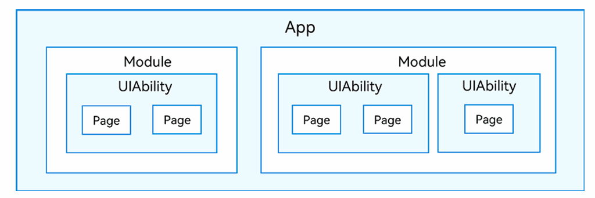

# 0.  课程内容


# 1. 快速入门

## 1.1 系统概述

### 1.1.1 发展

**Android**：一个基于Linux内核与其它开源软件的移动操作系统

**iOS**：苹果公司手机操作系统

**HarmonyOS**：华为公司基于“同⼀套系统能力，适配多种终端形态”的分布式理念，从而为不同利益相关者提供便利的面向未来全场景的、支持多设备互联的操作系统 。

> HarmonyOS对Android的应⽤提供了很好的兼容，其内核仍然是Linux内核，未来会替换为更加适应物联网应用的微内核。

HMS（HUAWEI Mobile Services，华为移动服务）则是华为公司推出的一系列服务的合集


Android和HarmonyOS都是移动设备操作系统，用以隔离多样的硬件平台。HMS Core是所有HMS应用所依赖的基础库。


### 1.1.2 开发视角


### 1.1.3 系统架构

HarmonyOS采用分层结构，大致可以分为内核层、系统服务层、框架层和应用层 。


### 1.1.4 系统技术特性

HarmonyOS是⼀个多设备互连的分布式操作系统，通过分布式软总线、分布式设备虚拟化、分布式数据管理和分布式任务调度从而达到“硬件互助， 资源共享” 。

分布式软总线是多种终端设备的统一基座，为设备之间的互连互通提供了统一的分布式通信能力，能够快速发现并连接设备，高效地分发任务和传输数据 。

## 1.2 App结构

### 1.2.1 应用

在开发态，一个应用包含一个或者多个Module，可以在DevEco Studio工程中创建一个或者多个 Module。

Module是HarmonyOS应用/服务的基本功能单元，包含了源代码、资源文件、第三方库及应用/服务配置文件，每一个Module都可以独立进行编译和运行。

Module分为“Ability”和“Library”两种类型，“Ability”类型的Module对应于编译后的HAP（Harmony  Ability Package）；“Library”类型的Module对应于HAR（Harmony Archive），或者HSP （Harmony Shared Package）。



### 1.2.2 HAP

开发者通过DevEco Studio把应用程序编译为⼀个或者多个.hap后缀的文件，即HAP。HAP是HarmonyOS应用安装的基本单位，包含了编译后的代码、资源、三方库及配置文件。HAP可分为Entry和Feature两种类型。

- Entry类型的HAP：是应用的主模块，在module.json5配置文件中的type标签配置为“entry”类型。在同一个应用中，同一设备类型只支持一个Entry类型的HAP，通常用于实现应用的入口界⾯、入口图标、主特性功能等。

- Feature类型的HAP：是应用的动态特性模块，在module.json5配置文件中的type标签配置为“feature”类型。 一个应用程序包可以包含一个或多个Feature类型的HAP，也可以不包含；Feature类型的HAP通常用于实现应用的特性功能，可以配置成按需下载安装，也可以配置成随Entry类型的HAP一起下载安装（请参见module对象内部结构中的“deliveryWithInstall”）。

每个HarmonyOS应用可以包含多个.hap文件，一个应用中的.hap文件合在一起称为一个Bundle，而bundleName 就是应用的唯一标识（请参见app.json5配置文件中的bundleName标签）。需要特别说明的是：在应用上架到应用市场时，需要把应用包含的所有.hap文件（即Bundle）打包为一个.app后缀的文件用于上架，这个.app文件称为 App Pack（Application Package），其中同时包含了描述App Pack属性的pack.info文件；在云端（服务器）分发和终端设备安装时，都是以HAP为单位进行分发和安装的。

### 1.2.3 App结构

打包后的HAP包结构包括ets、libs、resources等文件夹和resources.index、module.json、pack.info等文件。

- **ets目录**：用于存放应用代码编译后的字节码文件。
- **libs目录**：用于存放库文件。库文件是HarmonyOS应用依赖的第三方代码（.so二进制文件）。
- **resources目录**：用于存放应用的资源文件（字符串、图片等），便于开发者使用和维护，详见资源分类与访问。
- **resources.index**：资源索引表，由IDE编译工程时生成。
- **module.json**：**HAP的配置文件**，内容由工程配置中的module.json5和app.json5组成，该文件是HAP中必不可少的文件。IDE会自动生成一部分默认配置，开发者按需修改其中的配置。详细字段请参见应用配置文件。
- **pack.info**：Bundle中用于描述每个HAP属性的文件，例如app中的bundleName和versionCode信息、module中的name、type和abilities等信息，由IDE工具生成Bundle包时自动生成。


# 2. ArkTs

## 2.1 发展历史

### 2.1.1 JS语言

JS语⾔由Mozilla创造，最初主要是为了解决页面中的逻辑交互问题，它和HTML（负责页面内容）、CSS（负责页面布局和样式）共同组成了Web页面/应⽤开发的基础。

随着Web和浏览器的普及，以及Node.js进⼀步将JS扩展到了浏览器以外的环境，JS 语言得到了飞速的发展。

### 2.1.2 Web前端框架

为了提升应用的开发效率，相应的JS前端框架也不断地涌现出来。其中比较典型 的有Facebook发起的React.js，以及个人开发者尤雨溪发起的Vue.js。React和 Vue的主要出发点都是将响应式编程的能力引入到应用开发中，实现数据和界面内容的自动关联处理。

> 补充：MVVM、MVP与MVC
>
> 
>
> MVVM、MVP和MVC都是用于解决**UI界面和业务逻辑分离**的架构模式，
>
> #### 2.1.2.1 MVC (Model-View-Controller)
>
> 这是最古老、最基础的模式。
>
> - **Model（模型）**：负责数据和业务逻辑。它代表应用程序的核心数据（如从数据库获取用户信息）。
> - **View（视图）**：负责UI展示。它从Model获取数据并渲染给用户看（如一个HTML页面或一个Android的XML布局）。
> - **Controller（控制器）**：是用户交互的入口。它接收用户输入（如点击事件），调用Model进行数据处理，然后**选择并更新**相应的View。
>
> **关键点：**
>
> - **View和Model是知道的彼此的存在的**，它们之间有一定耦合。
> - Controller是“中介”，但它并不完全解耦View和Model。
>
> **例子（Web应用）：**
>
> 用户点击一个“刷新”按钮（View）。
>
> -> 点击事件被发送到Controller。
>
> -> Controller调用Model的`fetchData()`方法。
>
> -> Model从服务器获取新数据。
>
> -> Controller接收到新数据后，决定渲染“dataView.jsp”（View）。
>
> -> “dataView.jsp” 从Model中读取数据并生成HTML页面。
>
> #### 2.1.2.2 MVP (Model-View-Presenter)
>
> MVP是MVC模式的一种演化，旨在更彻底地分离View和Model。
>
> - **Model（模型）**：同MVC，负责数据和业务逻辑。
> - **View（视图）**：负责UI展示。**但它是一个被动视图（Passive View）**，它不知道Model的存在。它只提供UI控件和设置UI的方法（如`setText(String text)`）。
> - **Presenter（呈现器）**：是MVP的核心。它充当**View和Model之间的“中间人”**。它从Model获取数据，进行逻辑处理，然后**通知View更新界面**。
>
> **关键点：**
>
> - **View和Model完全不知道彼此的存在**，彻底解耦。它们都只与Presenter通信。
> - View通过**接口**与Presenter交互，这使得可以轻松地用Mock View进行单元测试（测试Presenter的逻辑）。
> - **所有展示逻辑都在Presenter中**，所以Presenter可能会变得很重，但它被称为“胖Presenter”。
>
> **例子（Android）：**
>
> 用户点击一个“刷新”按钮（View）。
>
> -> View的`OnClickListener`调用`mPresenter.refreshData()`。
>
> -> Presenter调用`model.fetchData()`。
>
> -> Model获取数据后，通过回调将结果返回给Presenter的`onDataFetched(String data)`方法。
>
> -> Presenter接收到数据`data`，然后调用`mView.updateTextView(data)`（`mView`是View的接口）。
>
> -> View实现类（如Activity）执行`updateTextView`方法，更新UI。
>
> #### 2.1.2.3 MVVM (Model-View-ViewModel)
>
> MVVM是MVP模式的进一步演化，其核心是**数据绑定（Data Binding）**。
>
> - **Model（模型）**：同MVC和MVP，负责数据和业务逻辑。
> - **View（视图）**：负责UI展示。在MVVM中，它通过**声明式**的方式（如XAML, HTML模板）绑定到ViewModel的属性/命令上。
> - **ViewModel（视图模型）**：它是View的抽象。它包含了View所需的数据和命令（Command），并且这些数据是**可观察的（Observable）**（例如使用`LiveData`， `RxJava`，或Vue.js/React的响应式状态）。
>
> **关键点：**
>
> - **View和ViewModel是松散耦合的**。View通过绑定“知道”ViewModel，但ViewModel对View一无所知。
> - **几乎不需要在View中写代码来更新UI**（理想状态下是零代码），更新是自动的。这大大减少了View层的代码（如Activity/Fragment变得非常轻量）。
> - 依赖**数据绑定框架**来实现自动化同步。
>
> **例子（使用Jetpack的Android）：**
>
> 1. View（XML布局）中使用 `@{}`语法将TextView的`text`属性绑定到ViewModel的`userName`Observable字段上。
> 2. 用户点击一个绑定到ViewModel的`refreshCommand`的按钮。
> 3. ViewModel执行`refreshCommand`，调用Model的`fetchData()`。
> 4. Model返回数据，ViewModel将数据设置到`userName`字段。
> 5. 由于`userName`是Observable的，数据绑定框架**自动**检测到变化，并通知绑定的TextView更新文本。**Presenter中`mView.updateText()`那一步被框架自动化了**。

### 2.1.3 TS语言

TS主要从以下几个方面做了进⼀步的增强： 

- 引入了类型系统，并提供了类型检查以及类型自动推导能力，可以进行编译时错误检查，有效的提升了代码的规范性以及错误检测范围和效率。 
- 在类型系统基础上，引入了声明文件（Declaration Files）来管理接口或其他自定义类型。声明文件⼀般是以d.ts的形式来定义模块中的接口，这些接口和具体的实现做了相应的分离，有助于各模块之间的分工协作。 
- 另外，TS通过接口，泛型（Generics）等相关特性的支持，进一步增强了设计复杂的框架所需的扩展以及复用能力。

### 2.1.4 ArkTS语言

ArkTS是HarmonyOS优选的主力应用开发语言。ArkTS基于TypeScript（简称TS）语言扩展而来，是TS的超集。  

- ArkTS继承了TS的所有特性。  
- 当前，ArkTS在TS基础上主要扩展了声明式UI能⼒，让开发者以更简洁、更自然的方式开发高性能应用。当前扩展的声明式UI包括如下特性。  
  - 基本UI描述：ArkTS定义了各种装饰器、自定义组件、UI描述机制，再配合UI开发框架中的UI内置组件、事件方法、属性方法等共同构成 了UI开发的主体。  
  - 状态管理：ArkTS提供了多维度的状态管理机制，在UI开发框架中，和UI相关联的数据，不仅可以在组件内使用，还可以在不同组件层级间传递，比如父子组件之间、爷孙组件之间，也可以是全局范围内的传递，还可以是跨设备传递。另外，从数据的传递形式来看，可分为只读的单向传递和可变更的双向传递。开发者可以灵活的利用这些能力来实现数据和UI的联动。  
  - 动态构建UI元素：ArkTS提供了动态构建UI元素的能力，不仅可自定义组件内部的UI结构，还可复用组件样式，扩展原生组件。  
  - 渲染控制：ArkTS提供了渲染控制的能力。条件渲染可根据应用的不同状态，渲染对应状态下的部分内容。循环渲染可从数据源中迭代获取数据，并在每次迭代过程中创建相应的组件。  
  - 使用限制与扩展：ArkTS在使⽤过程中存在限制与约束，同时也扩展了双向绑定等能力。  
- 未来，ArkTS会结合应用开发/运行的需求持续演进，逐步提供并行和并发能力增强、类型系统增强、分布式开发范式等更多特性。


## 2.2 基础语法

### 2.2.1 变量声明 常量声明

以关键字let开头的声明引入变量，该变量在程序执行期间可以具有不同的值。

```typescript
let hi: string = "hello"
hi = "hello, world"
```

以关键字const开头的声明引入只读常量，该常量只能被赋值一次

```typescript
const hello: string = "hello"
```

ArkTS规范中列举了所有允许**自动推断类型**的场景。以下示例中，两条声明语句都是有效的，两个变量都是string类型：

```typescript
let hi1: string = "hello"
let hi2 = "hello, world"
```

### 2.2.2 基本类型

- `Number` ：任何整数和浮点数都可以被赋给此类型的变量。 
- `Boolean`：由 true和false两个逻辑值组成。 
- `String`：代表字符序列；可以使用转义字符来表示字符。 
- `Void `：用于指定函数没有返回值。 
- `Object `：所有引用类型的基类型。 
- `Array `：由可赋值给数组声明中指定的元素类型的数据组成的对象。 
- `Enum `：枚举类型，是预先定义的一组命名值的值类型。 
- `Union  `：联合类型。 
- `Aliases `：匿名类型。

#### 2.2.2.1 Number

ArkTS提供`number`和`Number`类型，任何整数和浮点数都可以被赋给此类型的变量。

数字字面量包括整数字面量和十进制浮点数字面量。

整数字面量：

- 十进制：1，-2，114
- 十六进制：0x001，-0xF1A7
- 八进制：0o77
- 二进制：0d01

浮点字面量：

- 十进制整数，可为有符号数
- 小数点（“.”）
- 小数部分（由十进制数字字符串表示）
- 以“e”或“E”开头的指数部分，后跟有符号（即，前缀为“+”或“-”）或无符号整数。

#### 2.2.2.2 String

string代表字符序列；可以使用转义字符来表示字符。

字符串字面量由单引号（'）或双引号（"）之间括起来的零个或多个字符组成。字符串字面量还有一种特殊形式，是用反向单引号（`）括起来的模板字面量。

```typescript
let s1 = 'Hello, world!\n';
let s2 = 'this is a string';
let a = 'Success';
let s3 = `The result is ${a}`;
```

#### 2.2.2.3 Object & Array

Object类型 

- Object类型是所有引用类型的基类型。任何值，包括基本类型的值（它们会被自动装箱），都可以直接被赋给Object类型的变量。

Array类型 

- array，即数组，是由可赋值给数组声明中指定的元素类型的数据组成的对象。 数组可由数组复合字面量 （即用方括号括起来的零个或多个表达式的列表，其中每个表达式为数组中的一个元素）来赋值。数组的长度由数组中元素的个数来确定。数组中第一个元素的索引为0。 
- 以下示例将创建包含三个元素的数组： 
- `let names: string[] = ['Alice', 'Bob', 'Carol'];`

#### 2.2.2.4 Enum

enum类型，又称枚举类型，是预先定义的一组命名值的值类型，其中命名值又称为枚举常量。 使用枚举常量时必须以枚举类型 名称为前缀。

```typescript
enum ColorSet { Red, Green, Blue }
let c: ColorSet = ColorSet.Red;
```

常量表达式可以用于显式设置枚举常量的值。

```typescript
enum ColorSet { White = 0xFF, Grey = 0x7F, Black = 0x00 }
let c: ColorSet = ColorSet.Black;
```

#### 2.2.2.5 Union

union类型，即联合类型，是由多个类型组合成的引用类型。联合类型包含了变量可能的所有类型。

```typescript
class Cat { 
	// ...
}
class Dog {
	// ...
}
class Frog {
	// ...
}
type Animal = Cat | Dog | Frog | number
// Cat、Dog、Frog是⼀些类型（类或接口）

let animal: Animal = new Cat();
animal = new Frog();
animal = 42;
// 可以将类型为联合类型的变量赋值为任何组成类型的有效值
```

可以用不同的机制获取联合类型中特定类型的值。

```typescript
class Cat { sleep () {}; meow () {} }
class Dog { sleep () {}; bark () {} }
class Frog { sleep () {}; leap () {} }

type Animal = Cat | Dog | Frog | number

let animal: Animal = new Frog();
if (animal instanceof Frog) {
	let frog: Frog = animal as Frog; // animal在这⾥是Frog类型
	animal.leap();
	frog.leap();
	// 结果：⻘蛙跳了两次
}
animal.sleep (); // 任何动物都可以睡觉
```

#### 2.2.2.6 Aliases

Aliases类型为匿名类型（数组、函数、对象字面量或联合类型）提供名称， 或为已有类型提供替代名称。

```typescript
type Matrix = number[][];
type Handler = (s: string, no: number) => string;
type Predicate <T> = (x: T) => Boolean;
type NullableObject = Object | null;
```

### 2.2.3 运算符

#### 2.2.3.1 赋值运算符

`+=、-=、*=、/=、%=、<<=、>>=、>>>=、&=、 |=、^=`

#### 2.2.3.2 比较运算符

`==、!=、>、>=、<、<=`

#### 2.2.3.3 一元、二元、位、逻辑


#### 2.2.3.4 非空断言运算符

**后缀运算符!可用于断言其操作数为非空。**

应用于空值时，运算符将抛出错误。否则，值的类型将从T | null更改为T：

```typescript
class C {
	value: number | null = 1;
}
let c = new C();
let y: number;
y = c.value + 1;  // 编译时错误：⽆法对可空值作做加法
y = c.value! + 1; // ok，值为2
```

#### 2.2.3.5 空值合并运算符

空值合并二元运算符??用于检查左侧表达式的求值是否等于null。如果是，则表达式的结果为右侧表达式；否则，结果为左侧表达式。

换句话说，`a ?? b`等价于三元运算符`a != null ? a : b`。

### 2.2.4 语句

if，else，while，switch….略

### 2.2.5 函数

```typescript
function add(x:string):string{ 
	let z:string = x 
	return z 
}
```

#### 2.2.5.1 函数声明 

- 可选参数 `function add(x?: string)： String`  
- 默认参数 `function add(x: string=“hello”)： String`  
- Rest参数 `function add(...xs: string[])： String`

函数的最后一个参数可以是rest参数。使用rest参数时，允许函数或方法接受任意数量的实参。

```typescript
function sum(...numbers: number[]): number {
	let res = 0;
	for (let n of numbers)
		res += n;
 	return res;
}
sum() // 返回0
sum(1, 2, 3) // 返回6
```

#### 2.2.5.2 缺省返回值  

- 从函数体内推断出函数返回类型  

  - ```  typescript
    // 显式指定返回类型  
    function foo(): string { return "foo" }
    ```

- 不需要返回值的函数  

  - ```typescript
    // 推断返回类型为string  
    function goo() { return "goo" }  
    
    function hi1() { console.log("hi") }  
    function hi2(): void { console.log("hi" )}
    ```

#### 2.2.5.3 箭头函数或Lambda函数

```typescript
let sum = (x: number, y: number): number => {
	return x + y;
}
```

箭头函数的返回类型可以省略；省略时，返回类型通过函数体推断。

表达式可以指定为箭头函数，使表达更简短，因此以下两种表达方式是等价的：

```typescript
let sum1 = (x: number, y: number) => { return x + y; }
let sum2 = (x: number, y: number) => x + y
```

## 2.3 闭包

闭包是一种允许内部函数访问其外部函数作用域中的变量的机制。即使外部函数已经返回，内部函数仍然能够“记住”并使用这些变量。

闭包的核心思想是函数在定义时会捕获其词法环境，也就是它定义时所处的上下文，这样即使外部函数已经执行完毕，内部函数仍然能保持对外部函数中的变量的引用。这在状态保持、函数工厂、事件处理等场景中非常有用。

### 2.3.1 实践处理\函数工厂

```typescript
function createClickHandler(message: string): () => void {
	return (): void => {
		console.log(message);
	};
}
// 返回值是一个函数
```

### 2.3.2 私有变量

```typescript
function createBankAccount(initialBalance: number) {
	let balance = initialBalance;
	return {
		deposit(amount: number): void {
		balance += amount;
		},
		withdraw(amount: number): void {
			if (amount <= balance) {
				balance -= amount;
			} else {
				console.log("Insufficient funds");
		},
		getBalance(): number {
			return balance;
		}
	};
}

let account = createBankAccount(100);
console.log(account.getBalance()); // 输出: 100
account.deposit(50);
console.log(account.getBalance()); // 输出: 150
account.withdraw(70);
console.log(account.getBalance()); // 输出: 80
```

### 2.3.3 延迟执行

```typescript
function delayedGreeting(name: string, delay: number): () => void {
	return (): void => {
		setTimeout(() => {
 			console.log(`Hello, ${name}!`);
		}, delay);
 	};
 }
```

### 2.3.4 函数的重载Overloading

为同一个函数写入多个同名但签名不同的函数头

```typescript
function foo(x: number): void;            /* 第⼀个函数定义 */
function foo(x: string): void;            /* 第⼆个函数定义 */
function foo(x: number | string): void {  
	/* 函数实现 */
}
foo(123);     //  OK，使⽤第⼀个定义
foo('aa'); // OK，使⽤第⼆个定义
```

## 2.4  类

类声明引入一个新类型，并定义其字段、方法和构造函数。

### 2.4.1 字段初始化

为了减少运行时的错误和获得更好的执行性能， **ArkTS要求所有字段在声明时或者构造函数中显式初始化**。这和标准TS中的 strictPropertyInitialization模式一样。

```typescript
class Person {
	name: string // undefined 不合法
    setName  (n:string): void {
		this.name = n;
	}
	getName(): string {
	// 开发者使⽤"string"作为返回类型，这隐藏了name可能为"undefined"的事实。
	// 更合适的做法是将返回类型标注为"string | undefined"，以告诉开发者这个API所有可能的返回值。
		return this.name;
	}
}
let jack = new Person();
// 假设代码中没有对name赋值，例如调⽤"jack.setName('Jack')"
jack.getName().length; // 运⾏时异常：name is undefined
```

### 2.4.2 继承、接口、重写、重载…

略

### 2.4.3 对象字面量

对象字面量是一个表达式，可用于创建类实例并提供一些初始值。它在某些情况下更方便， 可以用来代替new表达式。

对象字面量的表示方式是：封闭在花括号对({}) 中的‘属性名:值’的列表。

`let c: C = {n: 42, s: 'foo'};`

ArkTS是**静态类型语言**，如上述示例所示，对象字面量只能在可以推导出该字面量类型的上下文中使用。

### 2.4.4 Record类型的对象字面量

泛型**Record<K,V>**用于将类型（键类型）的属性映射到另一个类型（值类型）。常⽤对象字面量来初始化该类型的值：

```typescript
let map: Record<string, number> = {
	'John': 25,
	'Mary': 21,
}
map['John']; // 25
```

类型K可以是字符串类型或数值类型，而V可以是任何类型。

## 2.5 泛型

### 2.5.1 泛型类和接口

类和接口可以定义为泛型，将参数添加到类型定义中

```typescript
class CustomStack<Element> {
	public push(e: Element):void {
		// ...
	}
}
let s = new CustomStack<string>(); //  指定Element是string
s.push('hello');
s.push(55); // 将会产⽣编译时错误
```

### 2.5.2 泛型约束

泛型类型的类型参数可以绑定。例如，HashMap容器中的Key类型参数必须具有哈希方法，即它应该是可哈希的。

```typescript
interface Hashable {
	hash(): number
}
class HasMap<Key extends Hashable, Value> {
	public set(k: Key, v: Value) {
		let h = k.hash();
		// ...其他代码...
	}
}
```

在上面的例子中，Key类型扩展了 Hashable，Hashable接口的所有方法都可以为key调用。

### 2.5.3 泛型函数

使用泛型函数可编写更通用的代码。比如返回数组最后一个元素的函数：

```typescript
function last<T>(x: T[]): T {
	return x[x.length - 1];
}
last<number>([1, 2, 3]); // 3
```

### 2.5.4 泛型默认值

泛型类型的类型参数可以设置默认值。这样可以不指定实际的类型实参，而只使用泛型类型名称。

```
interface Interface <T1 = SomeType> { }
```

## 2.6 空安全

严格空值检查模式 （strictNullChecks），但规则更严格。在下面的示例中，所有行都会导致编译时错误：

```typescript
let x: number = null;
let y: string = null;
let z: number[] = null;
```

可以为空值的变量定义为联合类型T |  null。

```typescript
let x: number | null = null;
```

## 2.7 模块

程序可划分为多组编译单元或模块。每个模块都有其自己的作用域，即，在模块中创建的任何声明（变量、函 数、类等）在该模块之外都不可见，除非它们被显式导出。

### 2.7.1 导出

可以使⽤关键字export导出顶层的声明。

```typescript
export class Point {
	x: number = 0
	y: number = 0
	constructor(x: number, y: number) {
		this.x = x;
		this.y = y;
	}
}
```

### 2.7.2 导入

导入声明用于导入从其他模块导出的实体，并在当前模块中提供其绑定。 

导入声明由两部分组成： 

- 导入路径，用于指定导入的模块； 
- 导入绑定，用于定义导入的模块中的可用实体集和使用形式（限定或不限定使用）。

导入绑定可以有几种形式。 

- 假设模块具有路径“./utils”和导出实体“X”和“Y”。 
- 导入绑定`* as A`表示绑定名称“A”，通过`A.name`可访问从导入路径指定的模块导出的所有实体：

```typescript
import * as Utils from './utils'
Utils.X // 表示来⾃Utils的X
Utils.Y // 表示来⾃Utils的Y
```

## 2.8 ArkTS容器类库


**容器类库**：用于存储各种数据类型的元素，并具备一系列处理数据元素的方法

容器类采用了类似静态语言的方式来实现，并通过对存储位置以及属性的限制，让每种类型的数据都能在完成自身功能的基础上去除冗余逻辑，保证了数据的高效访问，提升了应用的性能。

**线性容器库**： ArrayList 、Vector 、List 、LinkedList 、Deque、 Queue 、 Stack 

**非线性容器库**：HashMap 、HashSet 、TreeMap 、TreeSet、  LightWeightMap 、LightWeightSet 、PlainArray 

## 2.9 编程规范

### 2.9.1 命名

1. 类名、枚举名、命名空间名采用**UpperCamelCase**风格

2. 变量名、方法名、参数名采用**lowerCamelCase**风格

3. 常量名、枚举值名采用**全部大写**，单词间使用**下划线**隔开

4. 避免使用否定的布尔变量名，布尔型的局部变量或方法需加上表达是非意义的前缀

### 2.9.2 格式

- 使用空格缩进，禁止使用tab字符

- 行宽不超过120个字符
- 条件语句和循环语句的实现建议使用大括号
- switch语句的case和default需缩进一层
- 表达式换行需保持一致性，运算符放行末
- 多个变量定义和赋值语句不允许写在一行
- 空格应该突出关键字和重要信息，避免不必要的空格
- 建议字符串使用单引号
- 对象字面量属性超过4个，需要都换行
- 把else/catch放在if/try代码块关闭括号的同一行
- 大括号 { 和语句在同一行

### 2.9.3 编程实践

- 建议添加类属性的可访问修饰符
- 不建议省略浮点数小数点前后的0
- 判断变量是否为Number.NaN时必须使用Number.isNaN()方法
- 数组遍历优先使用Array对象方法
- 不要在控制性条件表达式中执行赋值操作
- 在finally代码块中，不要使用return、break、continue或抛出异常，避免finally块非正常结束
- 避免使用ESObject
- 使用T[]表示数组类型

### 2.9.4 高性能编程

#### 2.9.4.1 声明与表达式

- 使⽤const声明不变的变量
- number类型变量避免整型和浮点型混用
- 数值计算避免溢出
- 循环中常量提取，减少属性访问次数

#### 2.9.4.2 函数

- 建议使用参数传递函数外的变量
- 避免使用可选参数

#### 2.9.4.3 数组

- 数值数组推荐使用TypedArray
- 避免使用稀疏数组
- 避免使用联合类型数组
- 避免在数值数组中混合使用整型数据和浮点型数据。

#### 2.9.4.4 异常

- 避免频繁抛出异常
