# The Compilers’ Front End

## Regex -> NFA -> (Min) DFA

**Regex describes a language**

Example: $ (𝑎|𝑏)^∗c$

> Given two regex: $r_1,r_2$, the following are regex:
>
> 1. $𝐿(𝑟_1 | 𝑟_2) =𝐿(𝑟_1)∪𝐿(𝑟_2)$
> 2. $𝐿(r_1r_2) =𝐿(𝑟_1)𝐿(𝑟_2)$
> 3. $𝐿(𝑟_1^∗) = (𝐿(𝑟_1))^∗$
> 4. $𝐿((𝑟_1)) = 𝐿(𝑟_1)$

**Primitive regex**

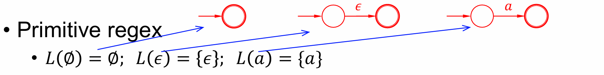

### ⭐Build the NFA for the regex

#### Rules

1. $L_1 ∪ L_2$

   ​	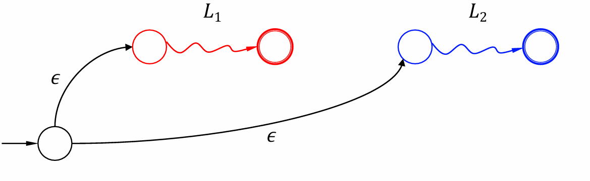

2. $L_1L_2$

   ​	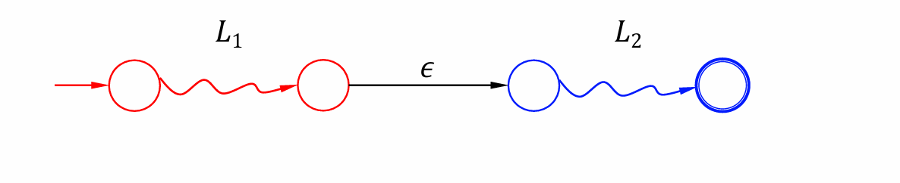

3. $L_1^R$

   ​	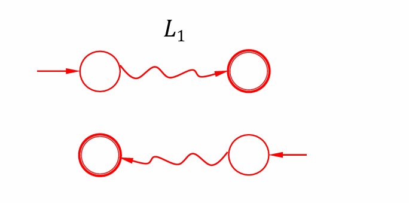

4. $L_1^*$

   ​	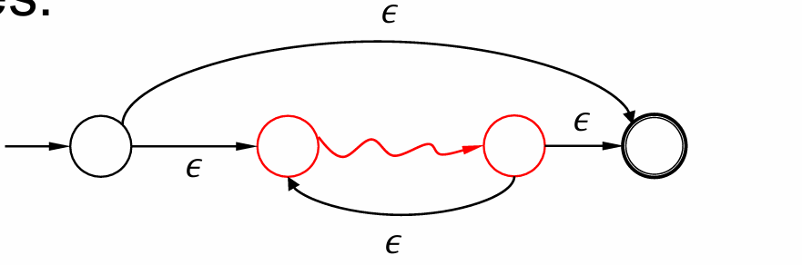

5. $\overline{L_1}$

   ​	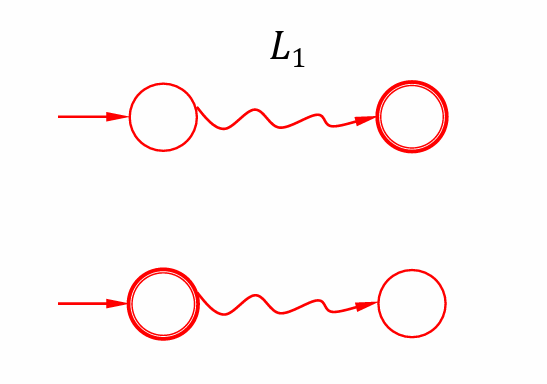

6. $L_1 \cap L_2 = \overline{\overline{L_1} \cup \overline{L_2}}$

#### Laws

​	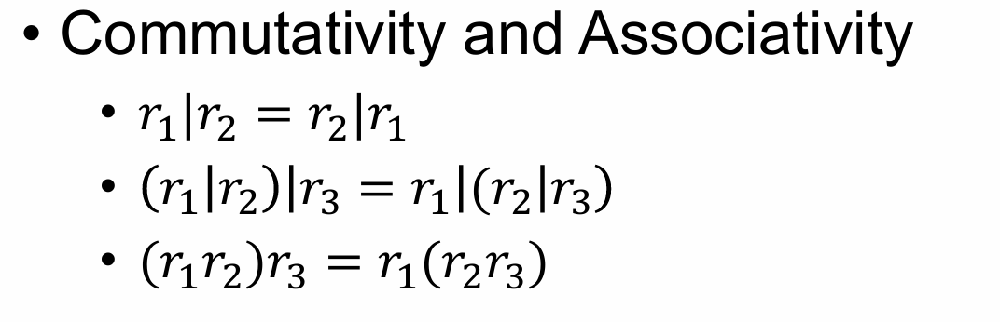

​	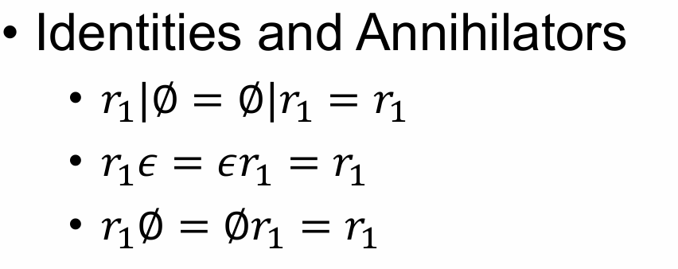

​	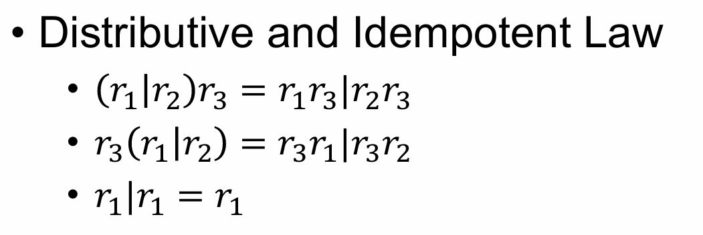

​	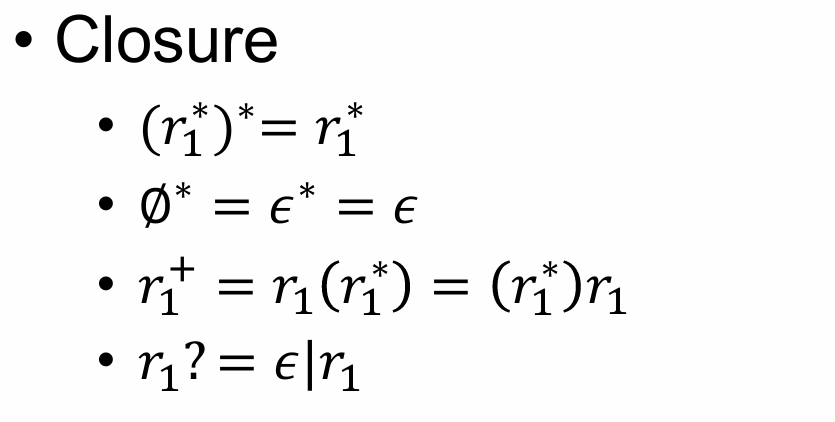

#### Example

 $(𝑎|𝑏)^∗c$

​	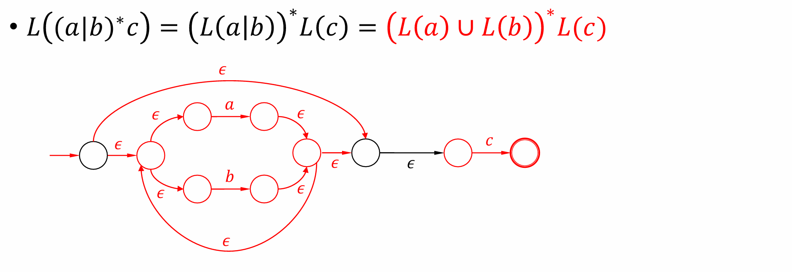

### ⭐From NFA to DFA

**A <u>subset</u> of NFA states is a DFA state**

#### Steps: Subset Construction

**ε-closure：指当前状态以及当前状态通过一次或多次ε转移可以到达的状态的集合**

1. 初始**ε闭包**为$Q_0$
2. 对于$Q_i$，求其经过某输入符号(比如说x)后可达的状态集合(包括这些状态的ε闭包的元素)为$Q_{i+1}$
3. 构造路径 $Q_i \overset{x}{\rightarrow} Q_{i+1}$
4. 如果某个Q包含**终结状态**，Q也设为终结状态
5. 重复过程2，3


#### Example

​	

### ⭐DFA Minimization

#### Steps

1. 把**终结状态集**和**非终结状态集**分开，分别考察是否可以再区分
2. 对于任意一个状态集合，考察他们对于同一输入的结果是否在同一集合内，是，则不用再区分；否，根据不同结果区分；
3. 重复过程2直到没有集合可以再区分

#### Example

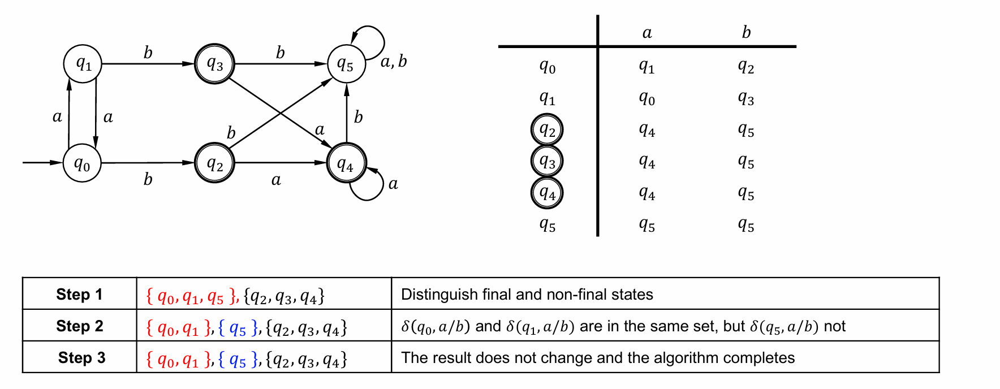


​	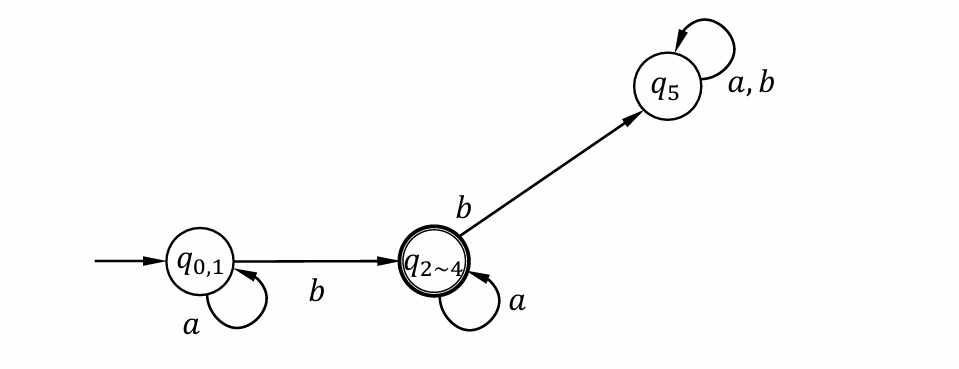

### DFA to Regex

​	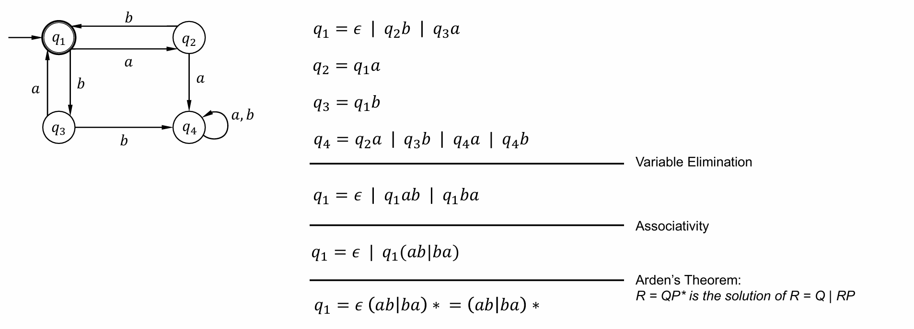

## CFG and Parsing

**A context-free grammar is a tuple** 𝐺 = (𝑁,𝑇,𝑆,𝑃)

​	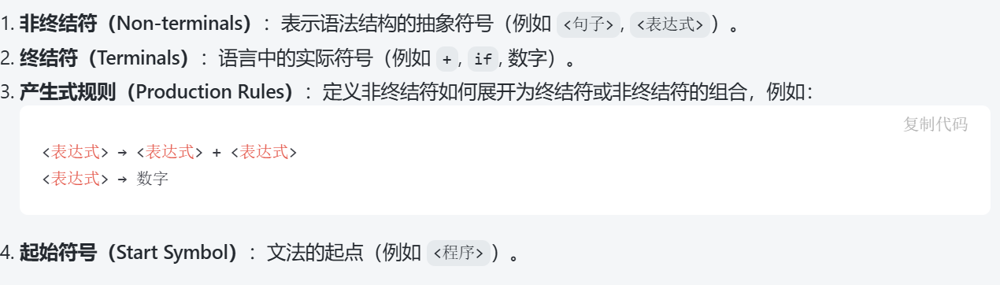

### ⭐Context Free Grammar (CFG)

From Regex to CFG

1. $0^*1^*$

   ```
   S -> A B
   A -> ε | A 0
   B -> ε | B 1
   ```

2. $0^n1^n$

   ```
   S -> 0 S 1 | ε
   ```

3. $0^n1^{2n}$

   ```
   S -> 0 S 11 | ε
   ```

4. $𝑎^i𝑏^j𝑐^k$ where i = j or j = k

   ```
   S -> M N | P Q
   M -> a M b | ε
   N -> N c | ε
   P -> P a | ε
   Q -> b Q c | ε
   ```

### ⭐Eliminating Left-Recursion

Non-terminal A that $A \Rightarrow^+ A \alpha$

**立即左递归**，形如：$$A \rightarrow A \alpha | \beta$$，可以改写为：

$$A \rightarrow \beta A' \\ A' \rightarrow \alpha A' | \epsilon$$

一般的（**注意**$\epsilon$），

​	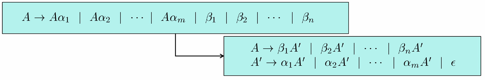

**间接左递归**，经过**多次推导**得到$A\alpha |\beta$

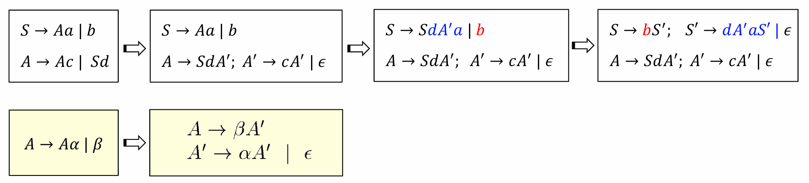

> 一定不要忘了$\epsilon$，对于间接左递归，先处理可以直接处理的，然后推导至没有左递归为止

### ⭐LL(1)

> LL(1)的含义为：第一个L表明自顶向下分析时从左向右扫描输入串，第二个L表明分析过程将最左推导，1表明只需向右看一个符号便可决定如何推导，即选择那个产生式进行推导。
> 说的是编译器从你写的代码中的每行的左边开始读取字符，到右边结束进行下一行读取；分析也是从每行代码的左边字符开始，到右边结束进行下一行；1表示一种状态接受输入时能唯一的确定下面的状态。

#### LL(1) rules

一个文法是 LL(1) 的当且仅当：

1. 不含 **左递归**
2. 对每个非终结符 `A` 和任意两条产生式 `A → α | β`，满足：FIRST(*α*)∩FIRST(*β*)=∅
3. 若 `ε ∈ FIRST(α)`，则必须满足：FIRST(*β*)∩FOLLOW(*A*)=∅

#### parsing table

**FIRSIT() 开始符号集**
就是找括号里**第一个字符的终结字符集**，如下面找A的开始字符集，显而易见，它的两个非终结字符如下图。

​	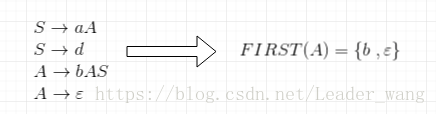

**FOLLOW()后跟符号集**
同理，寻找括号内**后边紧跟的终结字符集**，下图跟在A后面的S为非空终结符，但我们要的是终结符，对S求FIRST得到a和d；还有一个**后面什么也没跟，那就是$**，综上就可以得到下面的答案。

​	

> 课件里说的是$，最好按课件来
>
> FIRST()在内部，FOLLOW()在外部

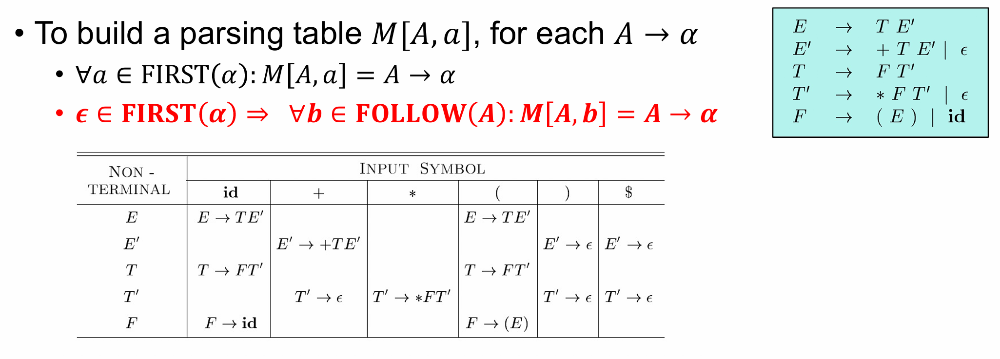

在上例中:

| 非终结符 | FIRST集   | FOLLOW集       |
| -------- | --------- | -------------- |
| `E`      | `{(, id}` | `{), $}`       |
| `E'`     | `{+, ε}`  | `{), $}`       |
| `T`      | `{(, id}` | `{+, ), $}`    |
| `T'`     | `{*, ε}`  | `{+, ), $}`    |
| `F`      | `{(, id}` | `{*, +, ), $}` |

1. 对于FIRST(α)中的每个终结符a，将A→α加入到M[A, a]中

2. 如果FIRST(α)中有ε，即可能推导出空，就找FOLLOW集对应的位置填A→α

   > 比如这里有 `E'->ε`，而`FOLLOW(E')={), $}`，那么就在M[E’,)]和M[E’,$]的地方写`E'->ε`

## IR Generation

### Three-Address Code

​	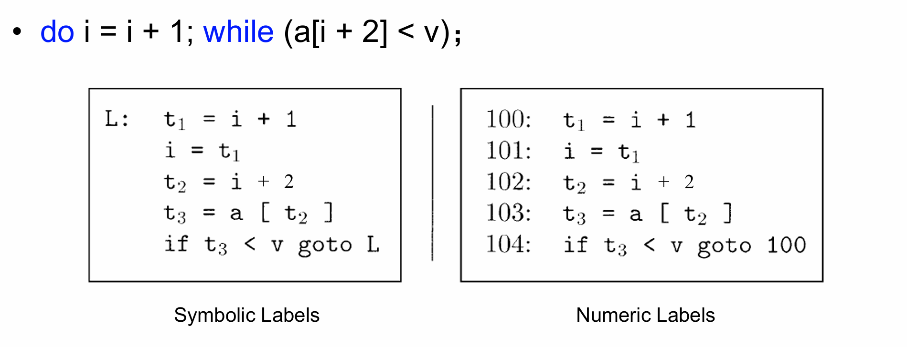

四元式法：

​	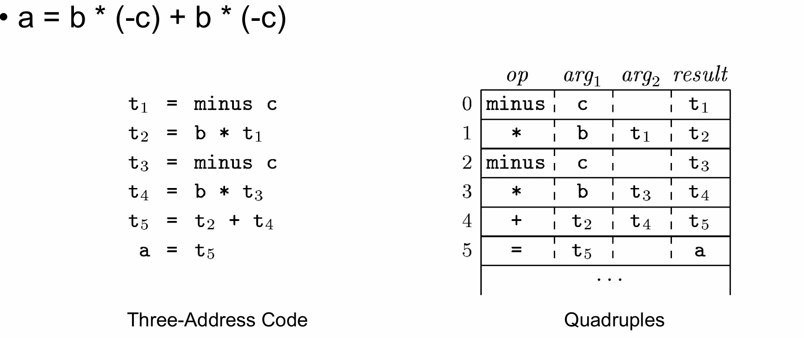

### Static Single-Assignment

• Feature 1: Every variable has only one definition 

• Feature 2: Using φ to merge definitions from multi paths

​	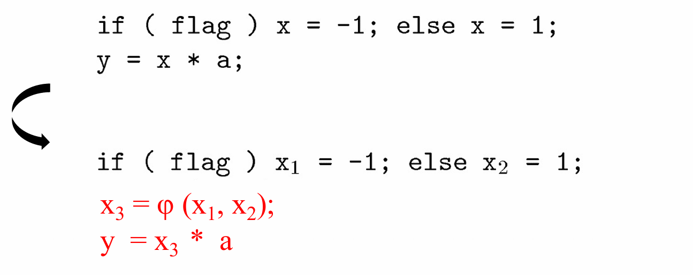

​	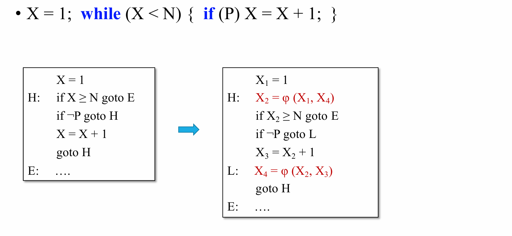

### ⭐Dominance Relations

• **A dom B**  

- if all paths from Entry to B goes through A 

• **A post-dom B** 

- if all paths from B to Exit goes through A

> 严格支配（被支配）：A (post-)dom B but A ≠ B
>
> 直接支配 A strict-dom B, but there’s no C, such that A strict-dom C, C strict-dom B

**Dominator Tree**

​	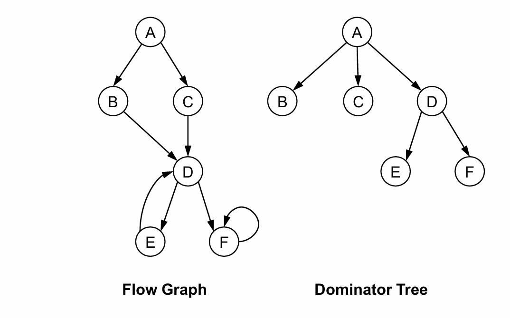

**Dominance Frontier**

​	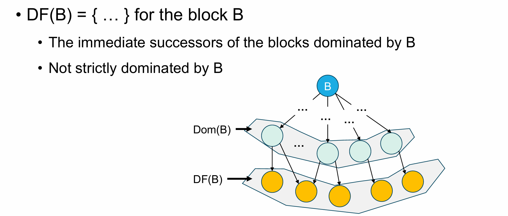

​	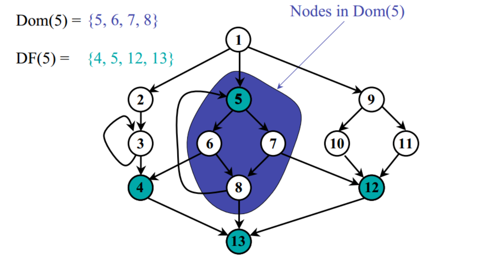

> 支配边界，顾名思义就是支配区域的边界，这个边界本身不属于被支配的部分

**Iterated Dominance Frontier**

​	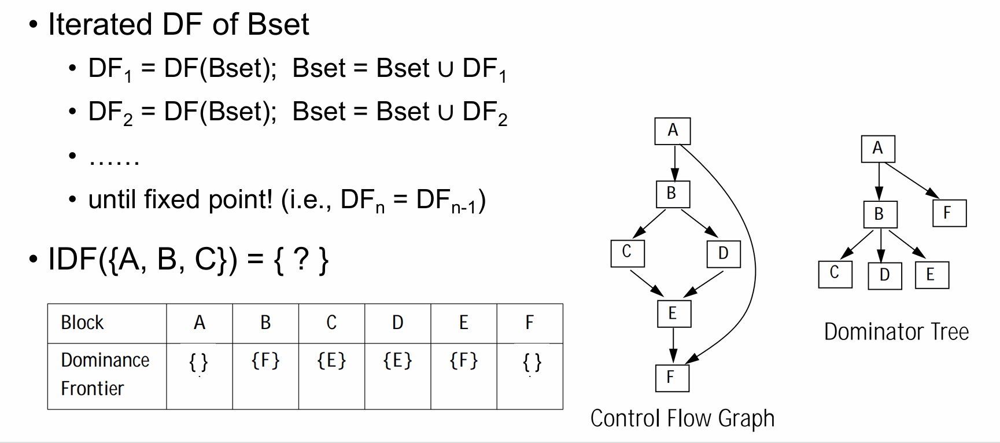

IDF({A,B,C})={E,F}

#  The Compilers’ Middle End

## ⭐Data Flow Analysis

​	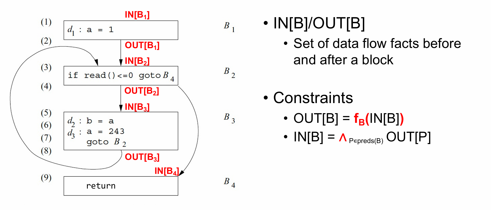

**To perform data flow analysis, define** 

- transfer function $f$ for each statement/block 
- merge function $∧$ at the joint point of multiple paths 
- the initial set of data flow facts for each block

**Data flow analysis produces** 

- IN[B]/OUT[B] that include data flow facts at a program point 
- The resulting data flow facts are always true during program execution

**The Worklist Algorithm**

```assembly
ForEach 
	basic block B: initialize IN[B] and OUT[B]; 
EndFor
worklist = set of all basic blocks;

While (!worklist.empty()) Do;
	B = worklist.pop();
	IN[B] = ∧P∊preds(B) OUT[P];   
	OUT[B] = fB(IN[B]);
	If OUT[B] changed: 
		worklist.push(all B’s successors); 
	EndIf
EndWhile
```

### Reaching Definition

​	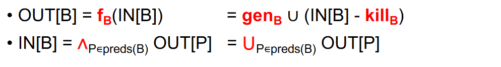

​	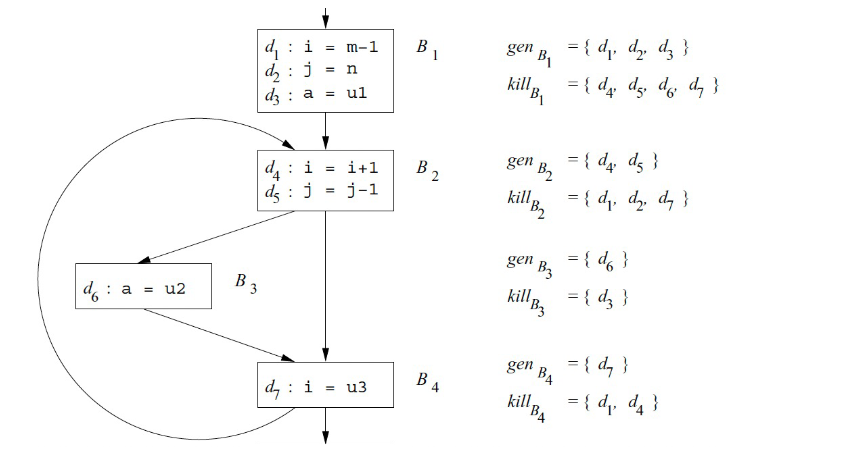

> gen是指新定义，包含定义新变量和旧变量重新赋值
>
> kill是指旧定义被覆盖
>
> B4中，d7是gen，而之前的d1，d4就被kill了（d1，d4都是对i的赋值）

###   Available Expressions

  在程序点 `p` 处，表达式 `e` 是可用的，当且仅当：

1. **已计算**：从程序入口到 `p` 的所有路径上，`e` 均已被计算过。
2. **未被修改**：所有路径上 `e` 的操作数（变量）在最后一次计算 `e` 后未被重新定义。

​	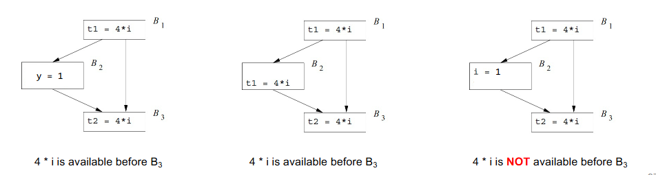

​	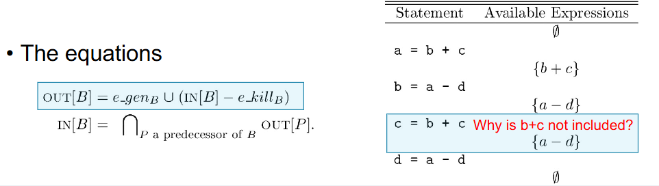

> c=b+c ，c的值发生了变化

### Live Variables

点 p 处的变量 x 的值是否可以沿从 p 开始的路径上继续使用

### Summary	

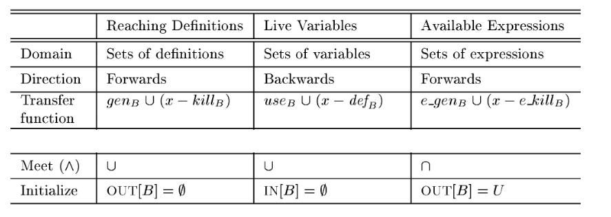

## ⭐Symbolic Execution

• Path Sensitivity：分析时区分不同执行路径（如条件分支、循环），为每条路径生成独立的状态 

• Flow Sensitivity：分析时考虑语句的执行顺序，但忽略不同路径（如条件分支）的差异

• Context Sensitivity：

Symbolic execution is a classic **path-sensitive** analysis that  enumerates and analyzes each path of a program

​	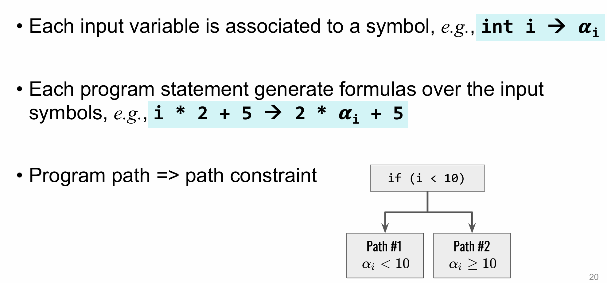

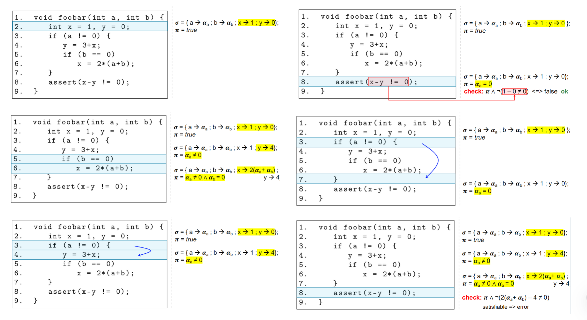

> check的时候，为什么最后assert里的式子要取反呢？
>
> 当程序执行到 `assert(condition)` 时，如果 `condition` 为 `false`，程序会立即抛出 `AssertionError` 异常并终止。
> **这代表程序逻辑与预期严重不符**
>
> 我们不希望任何输入触发断言失败（即异常），于是符号执行会在程序运行前 **静态分析所有路径**，并回答关键问题：
>
> **是否存在某种输入，使得程序执行到 `assert` 时，条件为假？**
>
> 当前路径约束(π) ∧ ¬(cond)，即路径约束 + 断言失败的条件
>
> - 可满足 → **漏洞！** 存在输入会触发异常。
> - 不可满足 → **安全！** 此路径下断言永真。

**问题：Path explosion**

​	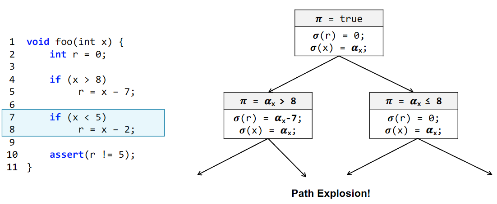

**解决方法：合并**

​	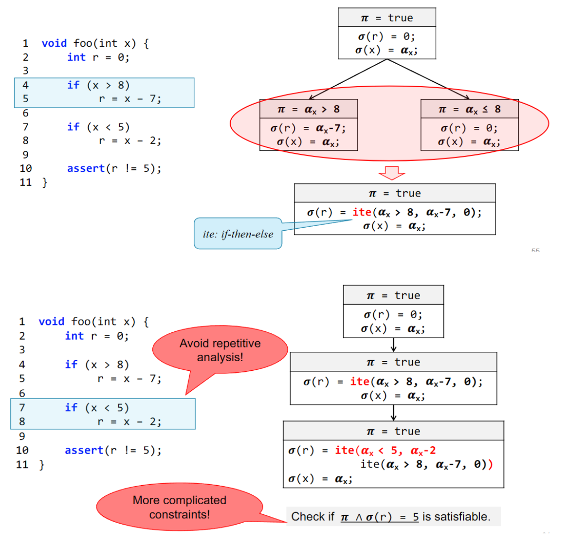

**新问题：无限循环**

​	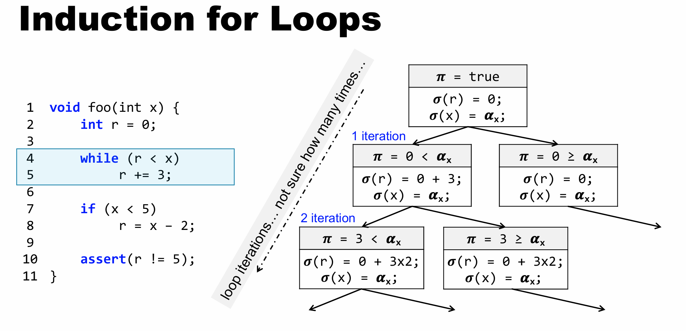

**解决方法：**

​	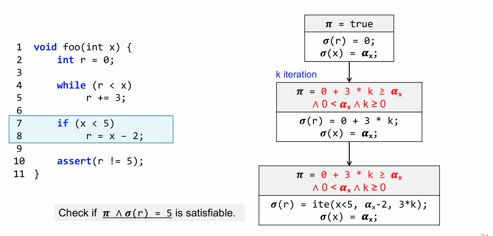

**Concolic Execution：Concrete + Symbolic Execution**运行时进行符号执行

​	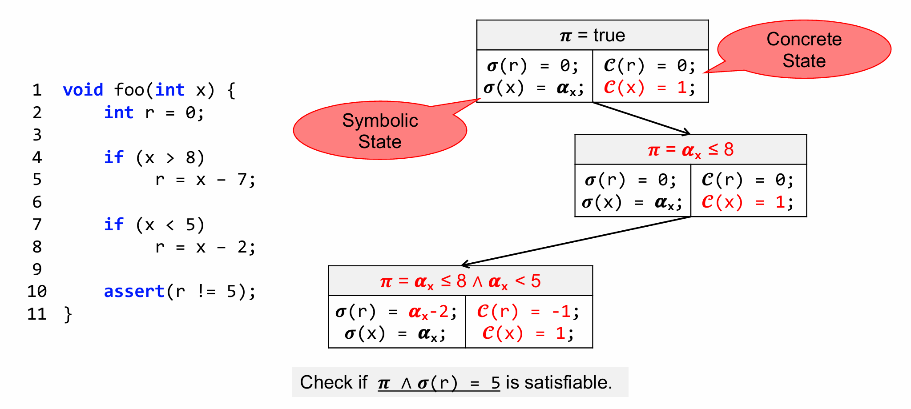

## Propositional Logic (PL)

​	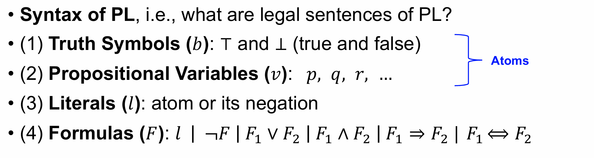

**NNF (Negation Normal Form) - 否定范式**

**定义**：

- 公式中**只允许在原子命题（变量或常量）前出现否定符 `¬`**。

- **不允许**：`¬` 作用于复合表达式（如 `¬(p ∧ q)`），也不允许蕴含 `⇒` 和等价 `⟺`。

**DNF (Disjunctive Normal Form) - 析取范式**

**CNF (Conjunctive Normal Form) - 合取范式**

**Tseitin Transformation**

​	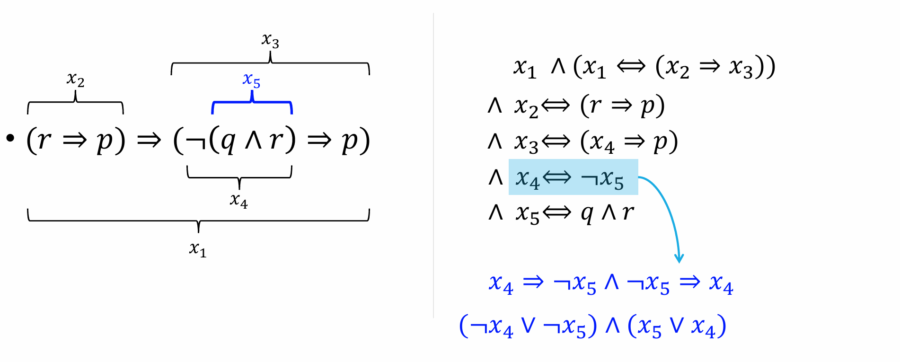

### SAT

**SAT 问题** 是指判断一个**命题逻辑公式（PL 公式）**是否存在一组真值赋值（即给所有变量分配 `⊤` 或 `⊥`），使得公式计算结果为 `⊤`（真）。

**DPLL**

​	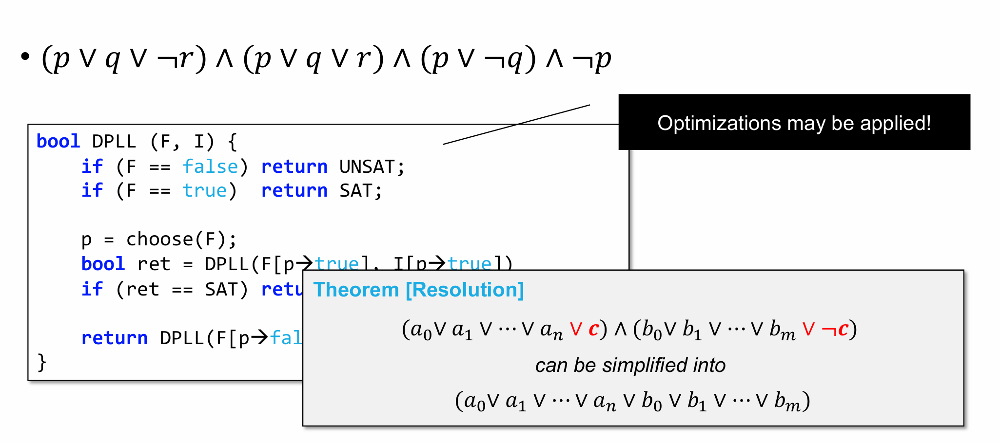

**步骤分解**

1. **初始状态**：
   公式：`(p ∨ ¬q) ∧ (¬p ∨ r) ∧ (¬r ∨ s)`
   赋值：`σ = {}`
2. **决策**：选择变量 `p`（假设按顺序选）
   - 分支 1：尝试p=⊤
     - 单元传播：
       - 子句 `(p ∨ ¬q)` → `⊤ ∨ ¬q = ⊤` → 删除
       - 子句 `(¬p ∨ r)` → `⊥ ∨ r = r` → 简化为 `(r)`
       - 强制 `r=⊤`
     - 子句 `(¬r ∨ s)` → `¬⊤ ∨ s = s` → 强制 `s=⊤`
     - **公式为空 → SAT！解：`p=⊤, r=⊤, s=⊤`（`q` 任意）**
3. **若分支 1 失败**：回溯尝试 `p=⊥`
   - 子句 `(p ∨ ¬q)` → `⊥ ∨ ¬q = ¬q` → 强制 `q=⊥`
   - 子句 `(¬p ∨ r)` → `⊤ ∨ r = ⊤` → 删除
   - 子句 `(¬r ∨ s)` 未简化 → 需继续选择变量（实际已得解，无需此分支）

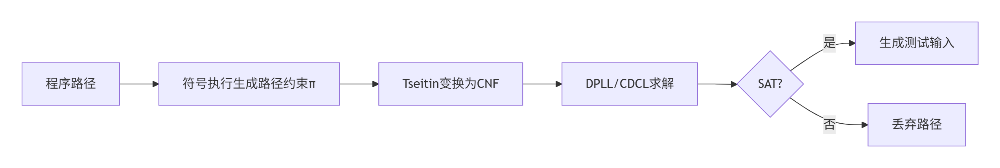

## ⭐Pointer Analysis

### Andersen & Steensgaard Algorithm

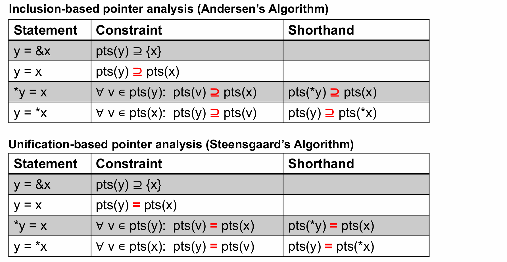

计算**过近似（May）**的指针指向集合（`pts(x)` = 变量 `x` 可能指向的对象集合）。

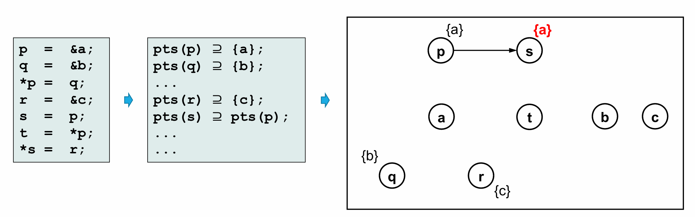

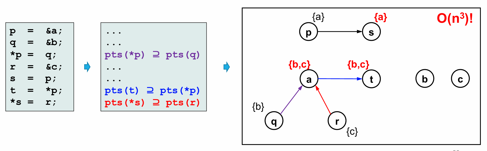

## Datalog-Based Analysis

`def(B, N, x)` 表示"在块 B 的第 N 行定义了变量 x"。

`succ(B, N, C)`表示C是B的后继且B有N条statement

`rd(B, N, C, M, X)`C中第M行定义的x在B中第N行使用

几个推导式：

• rd(B, N, B, N, X) :- def(B, N, X) 

• rd(B, N, C, M, X) :- rd(B, N-1, C, M, X), def(B, N, Y), X≠Y 

• rd(B, 0, C, M, X) :- rd(D, N, C, M, X), succ(D, N, B)

​	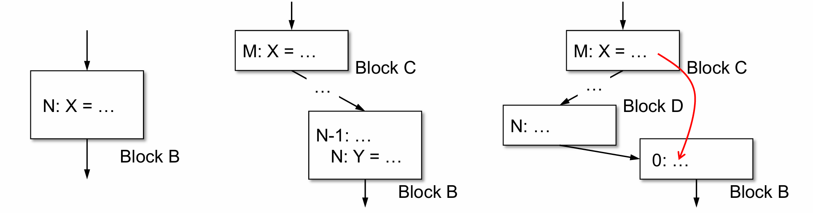

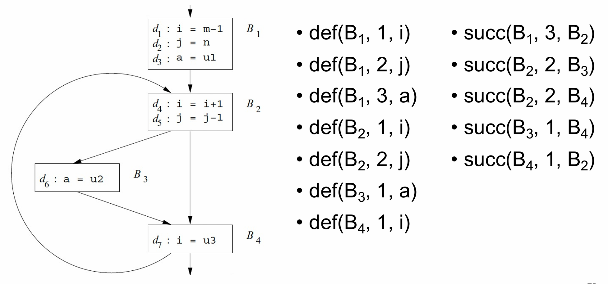

# The Compilers’ Back End

## Instruction Selection

**三类指令**

​	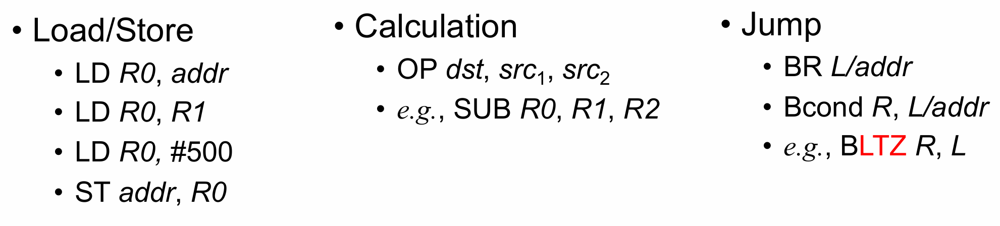

**Addressing Modes**

```
LD R1, a(R2)
LD R1, 100(R2)
LD R1, *R2
LD R1, *100(R2)
LD R1, #100
• LD R, addr
• ST addr, R
```

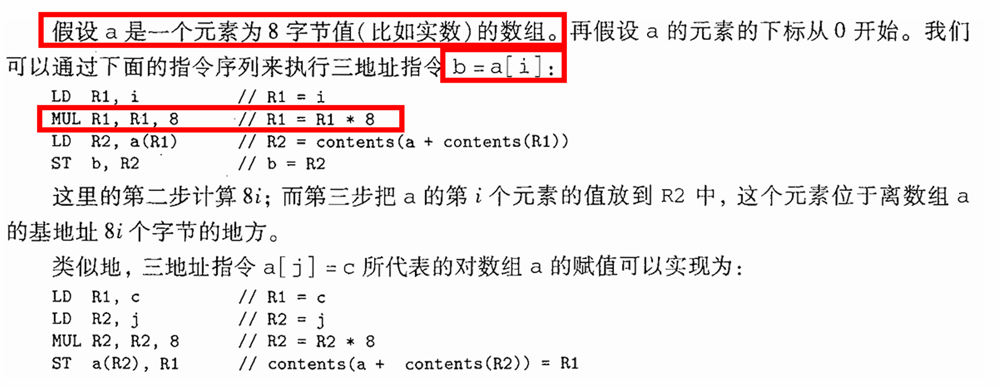

## ⭐Register Allocation

### Local

​	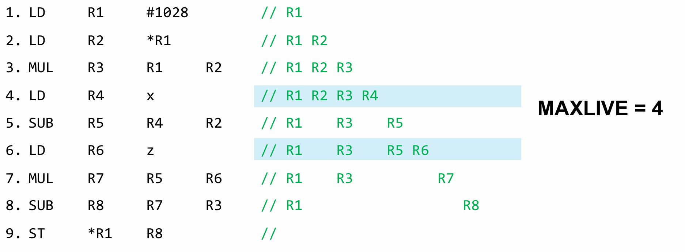

MAXLIVE=4，只需要4个寄存器合理分配就能执行完整个任务（前提是物理寄存器有4个）

​	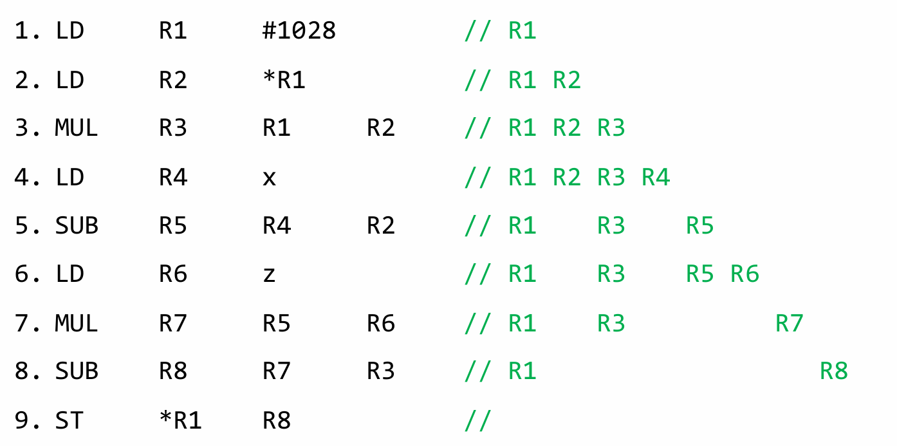

如果物理寄存器少于4个，比如说3个

​	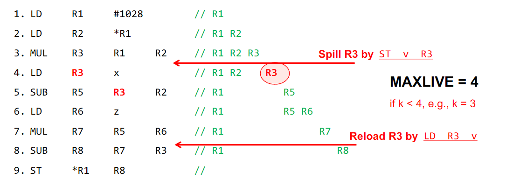

尽量挑选距离下一次使用比较久的spill

### Global

画conflict graph

• Vertex: virtual registers;  

• Edges: virtual registers that have **overlapping live range**

**Chaitin’s Algorithm**

 删除这些顶点并将它们推送到堆栈中，直到图形变为空（稍后为它们着色）

1. 遍历冲突图，找到所有**度数 <k 的节点**。
2. 移除这些节点（因其必然可着色），并压入栈。
3. 重复直到图中**仅剩度数 ≥k 的节点或图为空**。

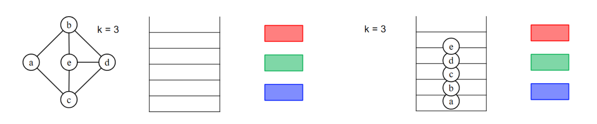

若有**度数 ≥k 的节点**

1. 将溢出候选节点加入溢出列表（Spill List）
2. 重复上步骤

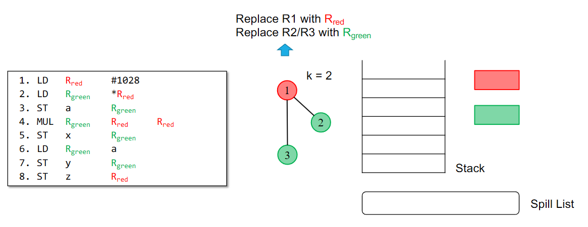


## ⭐Instruction Scheduling

**True/Fake Dependence** 

 具体类型：

- RAW（Read After Write）：指令A写入的数据被指令B读取，B必须在A完成后执行。
- WAR（Write After Read）：指令A读取的数据被指令B写入，A必须在B修改数据前完成读取。
- WAW（Write After Write）：指令A和指令B写入同一目标（寄存器或内存），必须按程序顺序提交结果。

 目标：通过**重命名**来删除（假）依赖（WAR，WAW），**保留真依赖（RAW）**

**Dependence Graph**

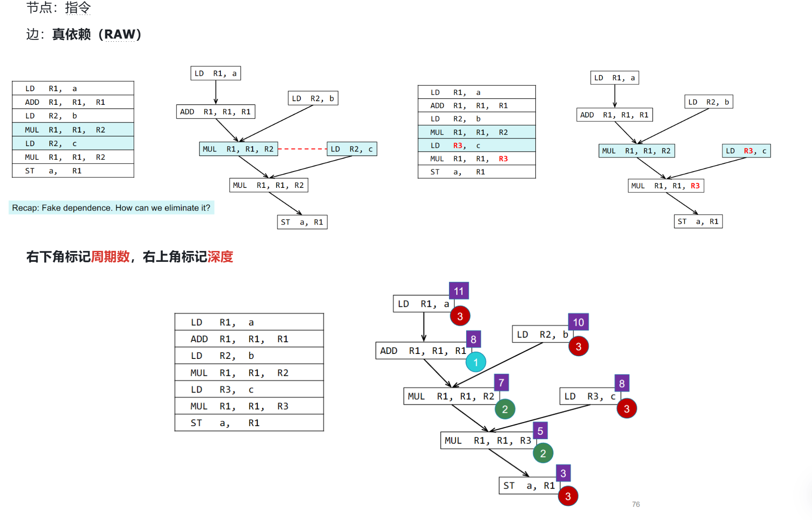

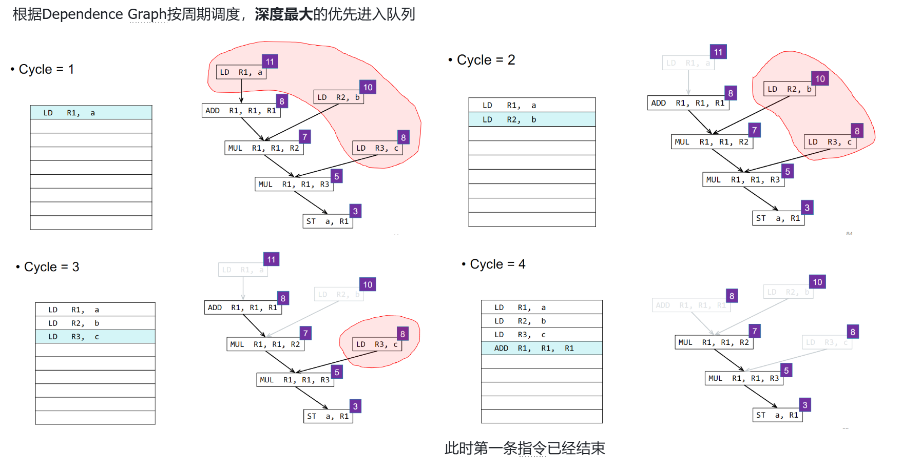


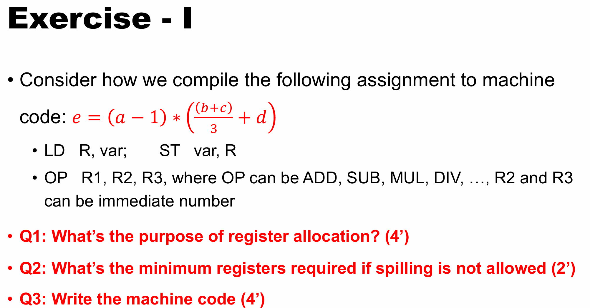

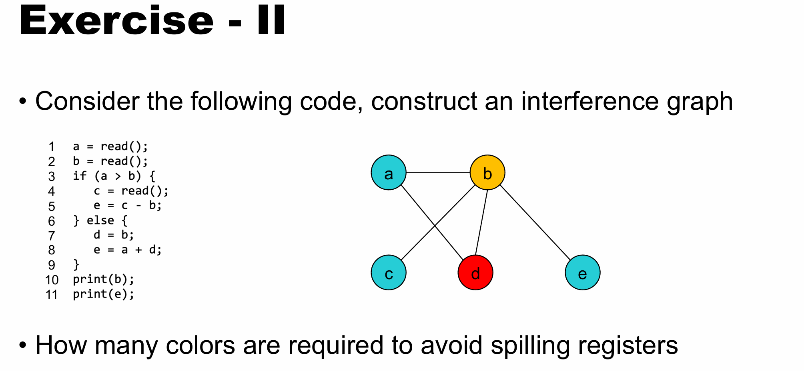

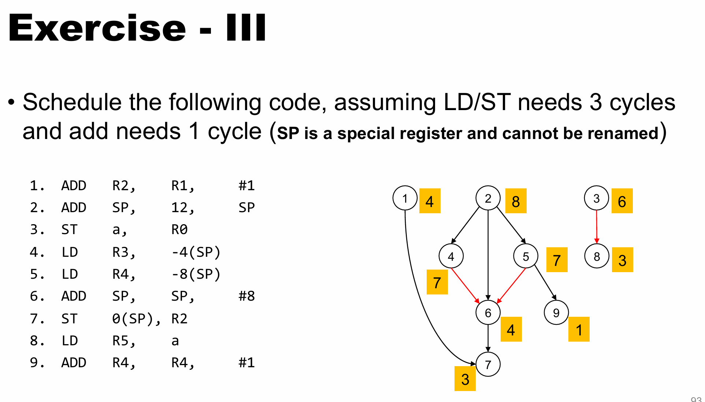

