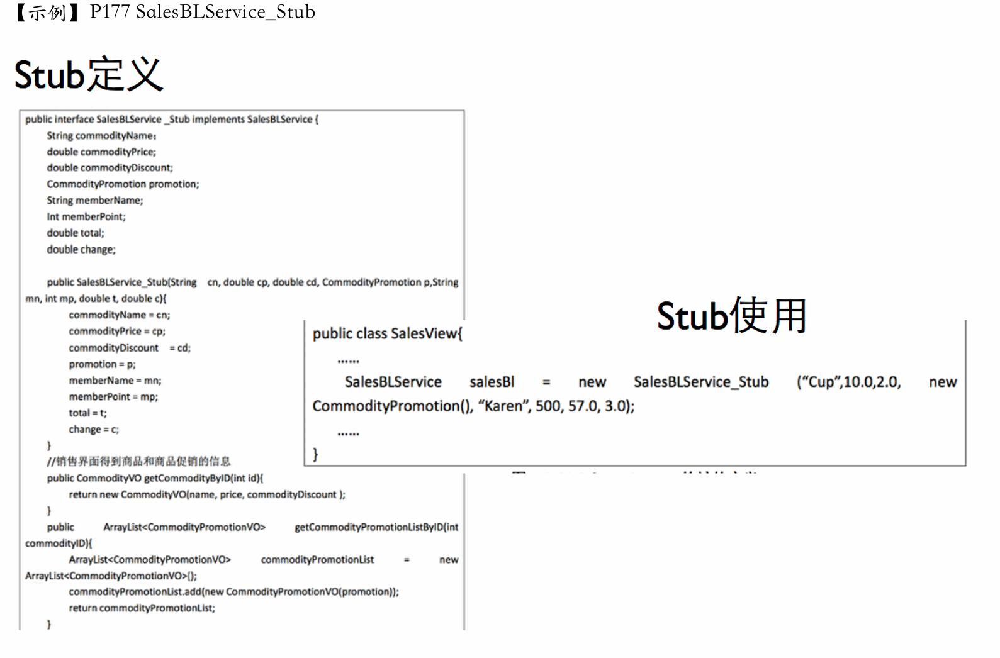
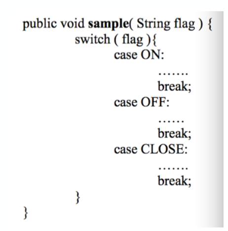

> 本文参考自eaglebear2002的博客[软件工程与计算II-24-复习提纲 | EagleBear2002 的博客](https://eaglebear2002.github.io/30328/)

# 第一、二章 软件工程概论

## 软件工程（名词解释）

1. **应用系统的、规范的、可量化的方法，来开发、运行和维护软件，即将工程应用到软件。**  
2. **对(1)中各种方法的研究。** 

## 从1950s—2000s之间的特点（简答）

1950s：科学计算；以机器为中心进行编程；像生产硬件一样生产软件。  

1960s：业务应用（批量数据处理和事物计算）；软件不同于硬件；用软件工艺的方式生产软件。  

1970s：结构化方法；瀑布模型；强调规则和纪律。它们奠定了软件工程的基础，是后续年代软件工程发展的支撑。  

1980s：追求生产力最大化；现代结构化方法/面向对象编程广泛应用；重视过程的作用。  

1990s：企业为中心的大规模软件系统开发；追求快速开发、可变更性和用户价值；web应用出现  

2000s：大规模web应用；大量面向大众的web产品；追求快速开发、可变更性、用户价值和创新。

​	

# 第三、四章 项目启动

## 如何管理团队？在实验中采取了哪些办法？有哪些经验？团队结构有哪几种？

### 团队结构分类

1. **主程序员团队**
2. **民主团队**
3. **开放团队**

### 团队建设

1. **建立团队章程**
2. **持续成功**
3. **和谐沟通**
4. **不断总结**
5. **避免团队杀手**
   1. 防范式管理
   2. 官僚主义
   3. 地理分布：异地办公
   4. 时间分割：保证全天候有人在
   5. 产品质量的降低
   6. 虚假的最后期限
   7. 小圈子管理

## 质量保障有哪些措施？结合实验进行说明

### 质量保障的措施

1. **需求开发**：需求评审和需求度量；
2. **体系结构**：体系结构评审和集成测试（持续集成）；
3. **详细设计**：详细设计评审、设计度量和集成测试（持续集成）；
4. **构造阶段**：代码评审、代码度量、测试（测试驱动和持续集成）；
5. **测试阶段**：测试、测试度量。
6. 要及时的根据保障计划进行质量验证，质量验证的方法主要有**评审、测试和质量度量**三种。

## 配置管理有哪些活动？实验中是如何进行配置管理的？

### 配置管理

1. **标识配置项**：确定应该被保留的部分，并且给予他们确定标识，包含配置项的特征，包括生产者、基线建立时间、使用者等。
2. **版本管理**：极其重要
3. **变更控制**：变更请求表单，教材 61 页
4. **配置审计**：验证配置项的完整性、正确性、一致性和可追踪性。
5. **状态报告**：反映当前的配置状态。
6. **软件发布管理**：将配置项发布到开发活动之外，例如发布给客户。

# 第五章 软件需求基础

## 需求（名词解释）

### 什么是需求

1. **用户为了解决问题或达到某些目标所需要的条件或能力；**
2. **系统或系统部件为了满足合同、标准、规范或其它正式文档所规定的要求而需要具备的条件或能力；**
3. **对 1 或 2 中的一个条件或一种能力的一种文档化表述。**

## 区分需求的三个层次 

【题型】

1. 给出一个实例，给出其三个层次的例子；
2. 对给定的需求示例，判定其层次
3. 例如课程实验/ATM/图书管理…

### 需求分层

1. ==业务需求==（Business Requirement）
   1. 业务需求是高层次的解决方案和系统特性、系统开发的战略出发点、高层次的需求，描述为什么要开发系统。
   2. Eg.在系统使用 3 个月后，销售额度应该提高 20%（期望，没有从软件角度进行描述，业务需求）
2. ==用户需求==（User Requirement）
   1. 执行具体任务的用户对系统所能完成任务的期望，描述了系统能帮用户做什么（直接用户、间接用户）
   2. Eg.在系统要帮助收银员完成销售处理
3. ==系统级需求==（System Requirement）
   1. 需求分析模型：用户对**系统行为的期望**，每个系统级需求反映了**一次外界与系统的交互行为**，或者**系统的一个实现细节**（和用户需求有着很大的区别）
   2. Eg.在接到客户经理的请求后，系统应该为客户经理提供所有会员的个人信息

> R1：在系统使用3个月后，销售额度应该提高20%（业务需求－为何开发系统）  
>
> R2：系统要帮助收银员完成销售处理；（用户需求－帮助用户做什么）  
>
> 系统特性SF1：管理VIP顾客信息，针对每一个系统特性，都可以建立一组用户需求。例如对SF1，每⼀条都是用户完成具体任务所需要的功能：  
>
> UR1.1：客户经理可以使用系统添加、修改或者删除会员个人信息。（用户需求）  
>
> UR1.2：收银员使用系统进行销售时会记录会员的购买信息。 （用户需求）  
>
> UR1.3：客户经理可以使用系统查看会员的个人信息和购买信息。（用户需求）  
>
> UR1.4：客户经理可以使用系统查看所有会员的统计信息。 （用户需求）  
>
> 
>
> R3：收银员输入购买的商品时，系统要显示该商品的描述、单价、数量和总价（系统级需求－系统怎么与外界交互）  
>
> 对用户需求UR1.3，可以依据任务中的交互细节将之转化为系统级需求SR1.3.1∼SR1.3.4。  
>
> SR1.3.1在接到客户经理的请求后，系统应该为客户经理提供所有会员的个人信息。（系统级需求） 
>
> SR1.3.2在客户经理输入会员的客户编号时，系统要提供该会员的个人信息。（系统级需求）  
>
> SR1.3.3在客户经理选定⼀个会员并申请查看购买信息时，系统要提供该会员的历史购买记录。  
>
> SR1.3.4经理可以通过键盘输入客户编号，也可以通过读卡器输入客户编号。（系统级需求）  
>
> 
>
> ATM机：问题：营业厅人力成本过高，不吸引客户（业务需求）  
>
> 问题域：存钱、取钱、转账（用户需求）

## 掌握需求的类型

【题型】

1. 对给定的实例，给出其不同类型的需求例子
2. 对给定的需求示例，判定其类型
3. 例如课程实验/ATM/图书管理…

### 需求分类

1. 需求
   1. ==项目需求==（人的数量、计划成本、时间）
      
      > R5：项目的成本要控制在 60 万元人民币以下。
      >
      > R6：项目要在 6 个月内完成。
      
   2. ==过程需求==（人的分工、合作、方法、工具）
      
      > R7：在开发中，开发者要提交软件需求规格说明文档、设计描述文档和测试报告。
      >
      > R8：项目要使用持续集成方法进行开发。
      
   3. ==系统需求==
      
      1. **软件需求**
      2. 硬件需求
      3. 其他需求
      
   4. ==其他需求==
      
      > R9：系统要购买专用服务器，其规格不低于….。
      >
      > R10：系统投入使用时，需要对用户进行 1 个星期的集中培训。
   
2. **不切实际的期望**
   
   > R11：系统要分析会员的购买记录，预测该会员将来一周和一个月内、会购买的商品；（技术上不可行）
   >
   > R12：系统要能够对每月的出入库以及销售行为进行标准的财务分析；（在有限的资源条件下可行）
   >
   > R13：在使用系统时，收银员必须要在 2 个小时内完成一个销售处理的所有操作。（超出了软件所影响的问题域范围）

### 软件需求的分类

1. ==功能需求==：

   - 和系统主要共作相关的需求，即在不考虑物理约束的情况下，用户希望系统所能够执行的活动，这些活动可以帮助用户完成任务。功能需求主要表现为系统和环境之间的行为交互。
   - 最常见、最主要和最重要的需求；能够为用户带来业务价值的系统行为；最需要按照三个抽象层次进行展 开；软件产品产生价值的基础。 

   > Eg.在接到客户经理的请求后，系统应该为客户经理提供所有会员的个人信息。

2. ==数据需求（属于功能需求的一种，DR）==：

   功能需求的补充：如果在功能需求部分明确定义了相关的数据结构，那么就不需要再行定义数据需求。数据需求是需要在数据库、文件或者其他介质中存储的数据描述，通常包括下列内容：

   - 各个功能使用的**数据信息**；

   - 使用频率；

   - 可访问性要求；

   - **数据实体及其关系**；

   - 完整性约束；

   - **数据保持**要求。

     > Eg.系统需要存储的数据实体及其关系为图 6-14 的内容。（数据实体及其关系）
     >
     > Eg.系统需要存储 1 年内的销售记录和退货记录。（数据保持） 

3. ==性能需求==：

   系统整体或系统组成部分应该拥有的性能特征，例如 CPU 使用率、内存使用率等。

   1. **速度**：系统完成任务的时间（所有用户查询必须在 10s 内完成）
   2. **容量**：系统能存储的数据量（系统因该能够存储至少 100 万个销售信息）
   3. **吞吐量**：系统在连续的时间内完成的事务数量（解释器每分钟应该能够至少解析 5000 条没有错误的语句）
   4. **负载**：系统可以承载的并发工作量（系统应该允许 50 个营业服务器同时从集中服务器上进行数据的上传或下载）
   5. **实时性**：严格的实时要求（系统监测到异常时，监视器必须在 0.5s 内发出警报，和故障警报不一样，故障不是系统的正常功能）

4. ==质量需求（QA）==：

   系统为了满足规定的及隐含的所有要求而需要具备的要素称为质量

   1. **可靠性**：在规格时间间隔内和规定条件下，系统或部件执行所要求能力的能力。（在进行数据的下载和上传中，如果网络故障，系统不能出现故障。能不能检测网络中断，并且进行恢复）
   2. **可用性**：软件系统在投入使用时可操作和可访问的程度或能实现其指定系统功能的概率。（系统的可用性要达到 98%）
   3. **安全性**：软件组织对其程序和数据进行未授权访问的能力，未授权的访问可能是有意，也可能是无意的。（VIP 顾客只能查看自己的个人信息和购买记录）
   4. **可维护性**：软件系统或部件能修改以排除故障、改进性能或其他属性或适应变更了的环境的容易程度，包括可修改性（Modifiability）和可扩展性（Extensibility）。（如果系统要增加新的特价类型，要能够在 2 个人月内完成）
   5. **可移植性**：系统或部件能从一种硬件或软件环境转换至另外一种环境的特性。（集中服务器要能够在 1 人月内从 Window 7 操作系统更换到 Solaris 10 操作系统。）
   6. **易用性**：与用户使用软件所花费的努力及其对使用的评价相关的特性。（使用系统 1 个月的收银员进行销售处理的效率要达到 10 件商品/分钟。）
   7. **往往会有形容词和副词**

5. ==对外接口==：

   系统和环境中其他系统之间需要建立的接口，包括**硬件接口、软件接口、数据库接口**等等。

   1. 接口的用途

   2. 接口的输入输出

   3. 数据格式

   4. 命令格式

   5. 异常处理要求

      > Eg.注册使用 Google Maps API

6. ==约束==：

   进行系统构造时需要遵守的约束，例如**编程语言、硬件设施**等

   1. 系统开发及运行的环境（包括目标机器、操作系统、网络环境、编程语言、数据库管理系统等）

   2. 问题域内的相关标准（包括法律法规、行业协定、企业规章等。）

   3. 商业规则：（用户在任务执行中的一些潜在规则也会限制开发人员设计和构建系统的选择范围）

      > Eg. 系统使用 Java 语言进行开发
      >
      > Eg. 已过保质期的食品不能销售
      >
      > Eg. 顾客可以使用美元付款

7. 注：**需求的灵活性**

# 第六章 需求分析方法

​	

## 建立用例图

### 用例图

1. ==用例==：用例是"在系统（或者子系统或者类）和外部对象的**交互**当中所执行的行为序列的描述,包括**各种不同的序列和错误的序列**,它们能够联合提供一种**有价值的服务**"[Rumbaugh2004]。
2. **图例**：
   1. 用例：椭圆
   2. 参与者：小人，是系统或其他系统对要开发的系统所扮演的角色。
   3. 关系：简单的就是一条直线，包括相关、泛化关系、包含关系和继承关系。
   4. 系统边界：是一个框
3. **用例图的建立步骤**
   1. 目标分析与解决方向的确定：需要实现什么，属于需求
   2. 寻找参与者
   3. 寻找用例
   4. 细化用例：判断标准是用例描述了为应对**一个业务事件**，由**一个用户**发起，并在**一个连续时间段**内完成，可以**增加业务价值**的任务。
4. **注意**：
   1. 不要将用例细化为没有独立业务价值的单个操作：例如,不要将用户管理细化为增加、修改和删除三个更小的用例,因为它们要联合起来才能体现出业务价值。
   2. 不要将同一个业务目标细化为不同用例：例如**特价策略制定和赠送策略制定**。
   3. **不要将没有业务价值（而是技术实现需要）的内容作为用例**：常见的错误有**登录**（应该描述为安全性质量需求）、"数据验证/输入/输出数据检查"（应该描述为数据需求或者业务规则）、“连接数据库”（属性软件内部实现而不是需求）、网络传输等。
   4. 不要将单个步骤细化为用例
   5. 不要将片面的一个方面细化为用例

### 用例图例题

×××连锁商店是一家刚刚发展起来的小型连锁商店，其前身是一家独立的小百货门面店。

首先是随着商店规模的扩大，顾客量大幅增长，手工作业销售迟缓，顾客购物排队现象严重，导致流失客源。其次是商店的商品品种增多，无法准确掌握库存，商品积压、缺货和报废的现象上升明显。再次是商店面临的竞争比以前更大，希望在降低成本，吸引顾客，增强竞争力的同时，保持盈利水平。 


BR1：在系统使用6个月后，商品积压、缺货和报废的现象要减少50%  

BR2：在系统使用3个月后，销售人员工作效率提高50%  

BR3：在系统使用6个月后，运营成本要降低15%  

范围：人力成本和库存成本，度量：检查平均员工数量和平均每10,000元销售额的库存成本  

BR4：在系统使用6个月后，销售额度要提高20%，最好情况：40%，最可能情况：20%，最坏情况：10%


SF1：分析商品库存，发现可能的商品积压、缺货和报废现象  

SF2：根据市场变化调整销售的商品  

SF3：制定促销手段，处理积压商品  

SF4：与生产厂家联合进行商品促销  

SF5：制定促销手段进行销售竞争  

SF6：掌握员工变动和授权情况  

SF7：处理商品入库与出库  

SF8：发展会员，提高顾客回头率  

SF9：允许积分兑换商品和赠送吸引会员的礼品，提高会员满意度  

SF10：帮助收银员处理销售与退货任务  

​	

从上述特性可以发现涉及的用户类别：总经理，客户经理，收银员，管理员  

总经理的目标有：产品调整（增删改产品信息），特价策略制定（增删改特价策略），赠送策略制定（增删改赠送策略），库存分析；（分析可能的商品积压） 

客户经理的目标有：会员管理；（会员发展、礼品赠送），库存管理；（商品⼊库、出库和库存分析）  

收银员的目标有：销售处理（销售），退货；（退货） 

管理员的目标有：用户管理（增删改用户信息）

​	

​	

​	

## 建立分析类图（概念类图）（只有属性，没有方法）

与设计类图有所不同，分析类图关注现实世界问题域，而不是软件系统的内部构造机制

### 分析类图（概念类图）

图例

1. **对象**
   - 标识符：对象自治、对象请求写作
   - 状态：存储数据，如密码、名称
   - 行为：利用数据做什么
2. **类**：对象集合的抽象
3. **链接**（link）（dependency）
   - 对象之间的互相协作的关系
   - 描述了对象之间的物理或业务联系
4. **关联**
   - 对象之间链接的抽象
   - 聚合与组合，聚合集合可以为空
5. **继承**：泛化关系，用空心箭头表示

> 直线表示关联，可以是单向的，也可以是双向的
>
> 聚合：整体与部分，在整体处画空心菱形
>
> 组合：在聚合的基础上，一旦部分属于某个整体，就无法属于其他整体，且无法单独存在，画实心菱形

**要写出分析的步骤**：

1. 对每个用例文本描述，尤其是场景描述，建立局部的概念类图
   - 根据用例的文本描述，**识别候选类**（名词分析法）
   - 筛选候选类，确定概念类（状态和行为）
     - 状态和行为：概念类
     - 状态：其他概念类的行为
     - 行为：需求是否遗漏
     - 无状态无行为：完全剔除
   - **识别关联**
   - **识别重要属性**
2. 将所有用例产生的局部概念类图进行合并，建立软件系统的整体概念类图
3. 自己注：先画关联关系，再添加类的属性

### 分析类图例题

​	

> ==上述图片不完整，还要补充每个概念类的属性==。
>
> **如果候选类既要维护一定状态，又要根据状态表现一定行为，则为概念类。**
>
> 注意：一切看需求。  
>
> 1. 若商品ID必须符合标准，则ID有状态、有行为  
> 2. 若商品数量单位不同，则单位换算的职责交给数量，有状态、有行为  
> 3. 若商品价格按照国际汇率有不同定位，则价格有状态、有行为 


【示例3】  

1. 顾客向系统提起查询请求 
2. 系统根据请求为顾客提供一个CD的推荐列表 
3. 顾客在推荐列表中选定一个CD，然后要求查看更详细的信息  
4. 系统为顾客提供选定CD的详细信息  
5. 顾客购买选定CD.  
6. 顾客离开 

分析：  

1. 查询请求：有状态、有行为  
2. 顾客和CD：看需求，不确定是否存储详细信息  
3. 推荐列表：有状态、有行为（增删改）

## 建立系统顺序图

### 系统顺序图

**交互图（顺序图）用于描述在特定上下文环境中的一组对象的交互行为**

跟详细顺序图相比，系统顺序图把系统看作一整个黑箱

步骤：

1. 确定上下文环境 
2. 根据用例描述找到交互对象
3. 按照用例描述中的流程顺序逐步添加消息 

​	

> 注意：
>
> 1. 异步消息的箭头无论是从用户到系统还是从系统到用户都是⼀样的  
> 2. opt标签表示可选；loop标签表示循环，要在旁边用［］内写循环条件；alt标签表示候选（基本上只会放一次返回消息），每⼀种可选分支之间要用虚线分割，而且在表示执行态的圆柱上面要写监护条件， 放在［］里面。

### 顺序图例题

​	 

## 建立状态图

### 状态图

1. 图例：

   1. 状态：一组可观察的情况，描述了一个系统在给定时间的行为
   2. 状态转换：从一个状态到另一个状态的转换
   3. 事件：使系统表现出某种可预测的行为形式的事件
   4. 行为：由于过渡而发生的过程

2. 步骤：

   1. 确定上下文环境，明确状态主体和状态主题对应的上下文环境

   2. 识别状态：状态的主体表现出的一些稳定状态

   3. 建立状态转换：建立状态之间的转换。

   4. 补充详细信息，完善状态图

​	

### 状态图例题

【示例】明确状态图的主体：用例UC1销售处理。  

空闲状态（开始状态）：收银员已经登录和获得授权，但并没有请求开始销售工作的状态；  

销售开始状态：开始⼀个新销售事务，系统开始执行一个销售任务的状态； 

会员信息显示状态：输入了客户编号，系统显示该会员信息的状态；  

商品信息显示状态：刚刚输入了一个物品项，显示该物品（和赠品）描述信息的状态；  

列表显示状态：以列表方式显示所有已输入物品项（和赠品）信息的状态；  

错误提示状态：输入信息错误的状态；  

账单处理状态：输入结束，系统显示账单信息，收银员进行结帐处理的状态。  

销售结束状态：更新信息，打印收据的状态。


# 第七章 需求文档化与验证

## 为什么建立需求规格说明？结合试验说明

### 建立需求规格说明的必要性

1. 方便交流：软件开发过程中，**子任务与人员**之间存在错综复杂的关系，存在大量的沟通和交流，所以要编写软件开发中要编写不同类型的文档，每种文档都是针对项目中需要广泛交流的内容。因为**软件需求**需要进行**广泛交流**，所以要把需求文档化。
2. 跟踪和度量：需求规格说明是在**软件产品的角度以系统级需求列表的方式**描述软件系统解决方案，书写需求规格说明，可以建立管理控制的基线，方便任务分配，制定工作计划，进行跟踪和度量。
3. 过程管理：在实验中，需求规格的重要性不只体现在结果上，还包括中间过程，在书写需求规格过程中，才真正把问题域的问题和分析模型的成果转化为系统级需求，方便小组成员真正明确需求，个人认为在这个阶段包含一部分的需求在发现和完整化。

## 对给定的需求示例，判定并修正其错误

### 判定并修正需求示例中的错误

1. 技术文档写作要点（简洁，精确，易读，易修改）
   1. 简洁：动词名词+辅助词，不要使用复杂长句、形容词和副词。
   2. 精确：不能产生起义或无法理解。
   3. 易读（查询）：有效使用引言、目录、索引等能够增强文档易读性的方法，使用系统化的方式组织内容信息，提供文档内容的可读性。
   4. 易修改：使用相同的语句格式组织相关联或相似的信息；使用列表组织独立、并列的信息；使用编号表达繁杂信息之间的关系。引用而不是重复
2. 需求书写要点（使用用户术语，可验证，可行性）
3. 需求规格说明文档书写要点（充分利用标准的文档模板，保持所以内容位置得当；保持文档内的需求集具有完备性和一致性；为需求划分优先级）

​	

> 【错误示例】  付款过程完成后，相关信息应被添加到日志文件  
>
> 该系统应被构造成将来很容易添加新功能  
>
> <u>计算购买的汽油的价格：该类汽油每加仑的价格乘以购买的加仑数（使用两位小数点表示加仑小数部分）</u>  
>
> 该系统一周7天，一天24小时都可用

## 对给定的需求示例，设计功能测试用例

### 设计需求示例的功能测试用例

1. 以需求为线索，开发测试用例套件，确定输入/输出，开发测试用例。

​	

2. 制定测试用例

# 第八章 软件设计基础

## 软件设计（名词解释）

1. 软件设计是指关于软件对象的设计，是一种设计活动。软件设计既指软件对象实现的规格说明，又指这个规格说明产生的过程。
2. 软件设计活动以需求开发的制品（需求规格说明和分析模型）为基础，构建软件设计方案描述和原型，为后期的构造活动提供规划或蓝图。
3. 软件设计兼具工程性和艺术性，由于软件系统的可变性，软件设计具有演化性，也因为软件设计的过程实际上就是一系列决策发生的过程，软件设计具有决策性。

## 软件设计的核心思想是什么？

### 软件设计的核心思想

1. ==分解==：横向上将系统分割为几个相对简单的子系统与子系统之间的关系
2. ==抽象==：在纵向上聚焦个子系统的接口（这里的接口与实现相对），可以分离接口和实现，使得人们更好的关注软件系统本质，降低复杂度。
3. ==层次性==

​	

​	

## 软件工程设计有哪三个层次？各层的主要思想是什么？

### 软件设计的层次

1. ==高层设计==：基于反映软件高层抽象的构件设计，描述系统的高层结构、关注点和设计决策。
   1. **部件**承载了系统主要的**计算与状态**
   2. **连接件**承载部件之间的**交互**
   3. 部件与连接件都是抽象的类型定义（就像类定义），它们的实例（就像类的对象实例）组织构成软件系统的整体结构，**配置**将它们的实例连接起来
2. ==中层设计==：更加关注组成构件的模块的设计、导入/导出、过程之间调用关系或者类之间的协作，模块划分**隐藏**一些程序片段（数据结构+算法）的细节，暴露接口于外界
3. ==低层设计==：深入模块和类的内部，关注具体的数据结构、算法、类型、语句和控制结构等。


# 第九、十章 软件体系结构设计与构建

## 体系结构概念

软件体系结构是由==部件，连接件，配置==组成的。

1. **部件**是软件体系结构的基本组成单位之一,承载系统的主要功能,包括处理与数据;
   1. 原始部件
   2. 复合部件
2. **连接件**是软件体系结构的另一个基本组成单位,定义了部件间的交互,是连接的抽象表示;
   1. 原始连接件
   2. 复合连接件：是由更细粒度的部件和连接件组成。
3. **配置**是对“形式”的发展,定义了“部件”以及“连接件”之间的关联方式,将它们组织成系统的总体结构。

## 体系结构的风格的优缺点

#### 主程序子程序风格

​	

1. 部件：程序、函数、模块  
2. 连接件：它们之间的调用，控制从子程序层次结构顶部开始且向下移动  
3. 主程序/子程序风格将系统组织成层次结构，包括一个主程序和一系列子程序。主程序是系统的控制器，负责调度各子程序的执行。各子程序有时一个局部的控制器，负责调度其子子程序的执行。
7. **优点：流程清晰，易于理解；强控制性，子子程序的正确性很容易保证子程序的正确性。**  
8. **缺点：**
   1. **程序调用是一种强耦合的连接方式，非常依赖交互方的接口规格，使得系统难以修改和复用；**  
   2. **基于程序调用（声明－使用）关系的连接方式限制了各部件之间的数据交互，可能会使得不同部件使用隐含的共享数据交流，产生不必要的公共耦合，进而破坏它的“正确性”控制能力。**  
9. **适用：可以将系统功能依层次分解为多个顺序执行步骤的系统**
10. 实现：主要实现机制是模块实现，每个子程序都设计一个模块，主程序为起始模块（main）

#### 面向对象风格

​	

1. 部件: 对象或模块  
2. 连接件: 方法调用
3. 面向对象将系统组织成多个独立的对象，每个对象封装其内部的数据，并基于数据对外提供服务。不同对象通过协作机制完成任务。
4. **优点：内部实现的可修改性；易开发、易理解、易复用的结构组织。**  
5. **缺点：**
   1. **接口的耦合性依然无法消除；**
   2. **标识的耦合性，即对象之间要交互，必须事先知道对方的标识；**
   3. **副作用：一些面向对象本身的副作用，更难实现正确性。**  

6. **适用于能够基于数据信息分解和组织的系统；能够将数据信息和操作联系起来封装** 
7. 实现：主要机制是模块实现，每个对象部件实例设计为一个模块。模块内部是结构化的方法。

#### 分层风格

​	

1. 部件: 层次 
2. 连接件: 程序调用
3. 根据不同的抽象层次，将系统组织为层次式结构。每个层次建立为一个部件，不同部件通常用程序调用的方式连接。
4. ==上层调用下层，禁止逆向调用，跨层调用== 
5. **优点：设计机制清晰，易于理解；支持并行开发；更好的可复用性与内部可修改性。**  
6. **缺点：交互协议难以修改；性能损失，禁止跨层；难以确定层次数量和粒度。  应用：适用于包含不同类服务的应用，而且这些服务能够分层组织**  
7. **应用：适用于主要功能是在不同抽象层次上进行任务分解的复杂处理，能建立稳定的不同抽象层次之间的稳定交互协议，没有很高的实时性能要求的系统**
8. 实现：不限粒度的模块实现。模块之间用导入/导出关系连接。

#### MVC 风格（模型—视图—控制器）

​	

1. 部件：模型、视图、控制  
2. 连接件: 程序调用，消息，事件  
3. **优点：易开发性；视图和控制的可修改性；适宜于网络系统开发的特征。**  
4. **缺点：复杂性；模型修改困难。**  
5. **适用于以下应用：在运行时，用户界面的改变很容易且是可能的**  
6. 用户界面的调整或移植不会影响该应用功能部分的设计和编码  
7. 例：Web 应用  
8. 实现：为模块、视图和控制每个部件实例建立模块实现，各模块存在导入/导出关系，程序调用连接件不需要显示实现。  
9. 典型实现：View：JSP，HTML；Controller：Servlet；Model：JavaBean 

## 体系结构设计的过程

### 体系结构设计过程

1. **分析关键需求和项目约束**：分析用例文档和需求规格说明书（包含需求规格和项目约束）。注意既要考虑功能性需求，又要考虑非功能性需求，甚至很大意义上体系结构设计是为了满足**非功能性需求**。
2. **通过选择体系结构风格**：选择分层风格（信息系统、并行开发、非web应用），进行评审。
3. **进行软件体系结构逻辑（抽象）设计**：产生逻辑包图
4. **依赖逻辑设计进行软件体系结构（实现）设计**：产生物理类图
5. **完善体系结构设计**：关键类图，持久化数据格式的定义等
6. **添加构件接口**：包、重要文件的创建，定义接口
7. **迭代过程 3-6**

## 包的原则

1. **重用发布等价原则**（REP）：**重用的粒度就是发布的粒度**，一个包中的软件要么都是可重用的，要么都是不可重用的

   1. 重用的单元就是发布的单元，比如说工具包
   2. 而不是一个类一个类的发布

2. **共同封闭原则**（CCP）：**包中所有类对于同一类性质的变化应该是共同封闭**的，一个变化若对一个包产生影响，则对该包中的所有类产生影响，而对于其他包不造成任何影响。

   1. **一起改的类放在一起**，减少变更（比如接口传递的对象可以放在一起）
   2. 把预测的修改限定到小的范围内，减少工作量

3. **共同重用原则**（CRP）：**一个包中的所有类应该是能够共同重用的**。

   1. **一起重用的放在一起**
   1. 避免不需要的依赖

   > CCP希望的包越大越好，CRP希望的包越小越好。二者互斥。

4. **无环依赖原则**（ADP）：在包的依赖关系图中不能存在环。必须是**有向无环图**。

   1. 解决方法一：抽出公共依赖的方法
   2. 解决方法二：抽象出接口改变依赖方向

​	

> 用B实现BY，让Y依赖于BY；**B此时也依赖于BY**
>
> 现在左边的包都依赖于右边了

5. **稳定依赖原则**（SDP)：**朝着稳定（别人的修改不影响我）的方向进行依赖**
   1. Ca:输入耦合度，包外部依赖本包的类个数
   2. Ce:输出耦合度，包内部依赖于包外部的类的个数
   3. 不稳定性：$I = \frac{C_e}{C_a+C_e}$, **I 越小越稳定**

​	

6. **稳定抽象原则**（SAP)：包的抽象程度应该和其稳定程度一致
   
   1. 稳定的包应该是抽象的包
   2. 不稳定的包应该是具体的包
   3. Na:包中抽象类个数
   4. Nc:包中所有类个数
   5. 抽象度A=Na/Nc
7. 前三条描述的是依赖性，后三条描述的是耦合性
8. 包设计过程：
   
   **不断迭代**：
   
   1. 先CCP原则把肯一同变化的类组织成包进行发布
   2. 随着系统增长，开始关注可重用的元素，于是使用CRP和REP指导组合
   3. 最后使用ADP、SDP、SAP对包图进行度量，去掉不好的依赖

## 体系结构构建之间接口的定义

### 体系结构构建之间接口定义

根据分配的需求确定模块对外接口，如逻辑层接口根据界面的需求得到，数据层接口根据逻辑层调用得到  

根据刺激与响应确定接口，依据详细规格明确接口内容（数据、返回值）  

1. 通常情况下，VIEW的required接口可以直接作为相应Logic的Provided  
2. 通常情况下，LOGIC的required接口需要分解为同层模块和不同Data的Provided  
3. Data一般没有层间依赖，接口通常来自于上一层的相应模块

```java
public interface SalesBLService{
    // 销售界面得到商品和商品促销的信息
    public CommodityVO getCommodityByID(int id);
    public ArrayList<CommodityPromotionVO> getCommodityPromotionListByID(int commodityID);
    
    // 销售界面得到会员的信息
    public MemberVO getMember();
    
    // 销售的步骤
    public ResultMessage addMember(int id);
    public ResultMessage addCommodity(int id, int quantity);
    public double getTotal(int mode);
    public double getChange(double payment);
    public void endSales();
}
```


## 体系结构开发集成测试用例

**集成**就是各个模块单元测试结束之后，把所有模块**合在一起形成整个软件原型系统**。集成的目的就是为了验证整个系统的功能。

对于被集成的系统，一般通过其暴露出来的接口，作**黑盒测试**。

1. **大爆炸式**：所有模块一次性组合在一起，**难定位出问题的地方**

2. **增量式**：每次增加一小部分模块

   1. **自顶向下**

      

   2. **自底向上**

      

   3. 持续集成

      提倡**尽早集成和频繁集成**

      - 尽早集成是指不需要总是等待一个模块开发完成才把它集成起来,而是在开发之初就利用Stub集成起来。
      - 频繁集成是指开发者每次完成一些开发任务之后,就可以用开发结果替换Stub中的相应组件,进行集成与测试。

      防止软件开发中出现无法集成与发布的情况；有利于检查集成错误。

   4. 三明治式

### Stub和Driver 

1. 依据模块接口建立**桩程序Stub**——**为了完成程序的编译和连接而使用的暂时代码**，**对外模拟和代替承担模块接口的关键类，比真实程序简单的多，使用最为简单的逻辑**

   > 桩就是假的模块，比如说自顶向下分析，要分析最顶层的模块，就给下层所有模块设桩，假装是一个完整的系统，但是实际上测试的是顶层的模块。

2. 编写**驱动程序，在桩程序帮助下进行集成测试** 。View的测试比较特殊，其他层都需要增加Driver进行测试 ；可以基于Junit编写Driver；基于接口规格设计测试用例 
   - 开发View层时：需要logic的stub  
   - 开发logic层时：需要模仿view的driver，需要data的stub，需要模拟同层调用的driver和stub  
   - 开发data层时：需要模拟logic的driver 

3. 持续集成：逐步编写各个模块内部程序，替换相应的桩程序




# 第十一章 人机交互设计

## 可用性（名词解释）

易用性是人机交互中一个既重要又复杂的概念。它不仅关注**人使用系统的过程**，同时还关注系**统对使用它的人所产生的作用**，因为比较复杂，所以易用性不是一个单一的质量维度，而是**多维度的质量属性**。

从易于度量的角度讲，易用性的常用维度包括：

1. **易学性**：新手用户容易学习，能够很快使用系统。
2. **效率**：熟练的用户可以高效使用它
3. **易记性**：使用过软件系统的用户，能够有效记忆或快速重新学会使用该系统。（超市可以缓存之前的信息）
4. **出错率**：几乎没有错误，可以从错误中快速恢复
5. **主观满意度**：让用户有良好的体验。


> 上面的压缩软件界面，错误的展示了内部结构：直接把系统内部的三个方法列给用户选（**不要暴露内部结构**）
>
> 下面的可视化设计：左边不好，因为不直观；右边可以直接看到主题的效果，是好的设计（**展示细节**）

## 界面设计的注意事项，及解释

### 人机交互设计原则

1. **简洁设计**（7±2 原则）：文字不如图形

2. **一致性设计**（实际模型和人的**精神模型**一致），**相似的任务最好有一致的交互机制**

3. **低出错率设计**（包括不适当的菜单功能**灰色屏蔽**、**检查输入**，出现错误的时候帮助用户修正错误，而不是重新填写，每一个输入都尽快的显示问题）

4. **易记性设计**
1. 减少短期记忆的负担
   
2. 使用逐层递进的方式展示信息（图片缩略图->图片细节）
   
3. 使用直观的快捷方式（快捷方式的图标）
   4. 设置有意义的默认值

5. **可视化设计**
   1. 按照任务模型设计界面**隐喻**，同时**不要把软件系统的内部构造机制暴露给用户**
   2. 可视化设计还应该基于界面隐喻，尽可能地把功能和任务细节表现出来。

### 界面设计例题


## 精神模型和差异性

### 精神模型

就是**用户进行人机交互时头脑中的任务模型**。依据精神模型可以进行**隐喻(Metaphor)**设计：

1. 隐喻又被称为视觉隐喻，是视觉上的图像，但会被用户映射为业务事物。用户在识别图像时，会**依据隐喻将控件功能与已知的熟悉事物联系起来**，形成任务模型；
2. 隐喻本质上是在用户已有知识的基础上建立一组新的知识，实现界面视觉提示和系统功能之间的知觉联系。

### 差异性

1. **新手用户**
   1. 是对业务不熟悉的人
   2. 例如新员工或者新接触系统的人。为新手用户设计系统时要关注易学性，进行业务导航，尽量避免出错。如果一个系统的大多数用户都是新手用户，整个系统的人机交互设计都要侧重**易学性**。
2. **专家用户**
   1. 是能够熟练操作计算机完成业务任务的人，一般都是长时间使用软件系统并且计算机操作技能熟练的人。
   2. 为专家用户设计系统时，要关注**效率**。如果一个系统的大多数用户都是专家用户，整个系统的人机交互设计都要侧重效率。
3. **熟练用户**：是介于新手用户和专家用户之间的人。为熟练用户设计人机交互系统要在易学性和效率之间进行折中。
4. **好的人机交互应该为不同的用户群体提供差异化的交互机制**。
   1. 既为新手用户提供易学性高的人机交互机制（**图形界面**）
   2. 又为专家用户提供效率高的人机交互机制（**命令行**、快捷方式、**热键**）

## 导航、反馈、协作式设计

### 导航

1. 导航是为了给用户提供一个很好的**完成任务的入口**，好的导航保证这个入口很符合人的精神模型。
2. **全局结构按照任务模型将软件产品的功能组织起来**，并区分不同的重要性和主题提供给不同的用户。全局导航控件包括窗口、菜单、列表、快捷方式、热键等等。
3. **局部导航通过安排布局细节，制造视觉上的线索来提供导航**。局部结构常用的导航控件包括可视化控件布局与组合、按钮设置、文本颜色或字体大小等等。

### 反馈

让用户能够**意识到行为的结果**，但**不能打断用户工作时的意识流** （反复的弹窗）

声音或视觉上的反馈都可以，比如选择输入框时应闪烁，点击时声音提示等

对**时间的控制**也是反馈设计的要点

### 协作式设计

人和计算机是人机交互的方法，其中人的因素是比较固定的，一定时期内不会发生大的变化，所以要让两者交互顺畅，就需要让计算机更多地适应人地因素，这也是人机交互设计以用户为中心的根本原因

这种**调整计算机因素以更好地适应并帮助用户的设计方式被称为协作式设计**

1. 简洁设计（摘要图片优于文字描述）      
2. 一致性设计（确认与删除键相对位置不一致）
3. 低出错率设计（用具体的指导来提示用户出错）  
4. 易记性设计

# 第十二章 详细设计概述

**中层设计＋低层设计：实现所有功能性＋非功能性需求**

## 详细设计的出发点

软件详细设计在软件体系结构设计之后进行，以==需求开发的结果（需求规格说明和需求分析模型）和软件体系结构的结果（软件体系结构设计方案与原型）为出发点==。

## 职责分配

### 职责

**通过职责建立静态模型**：面向对象分解中，系统是由很多对象组成的。对象各自完成相应的职责，协作完成一个大的职责。

1. 职责是执行任务（操作职责）或维护某些数据（数据职责）的义务。
   1. 行为职责通常由行为来履行。
   2. 数据职责通常由属性来完成。
   3. 可能会涉及到类之间的协作。
2. 职责分类
   1. **属性职责**：对象的状态
   2. **行为职责**：对象的行为

关系表达了相应职责的划分和组合。它们的强弱顺序为：**依赖<关联<聚合<组合<继承**。

​	

### 职责的分配

通过职责建立静态模型：面向对象分解中，系统是由很多对象组成的。**对象各自完成相应的职责，从而协作完成一个大的职责**。类的职责主要有两部分构成：属性职责和方法职责。类与类之间也不是孤立存在的， 它们之间存在一定的关系。关系表达了相应职责的划分和组合。它们的强弱顺序为：依赖<关联<聚合<组合<继承。

**将比较大的职责给很多对象。**

#### GRASP 原则（一般职责分配软件模式）

1. 特点：
   1. 低耦合：分配一个职责要保证低耦合度
   2. 高聚合：分配一个职责的时候要保持类的高聚合度
   3. 信息专家：将一个职责分配给专家-拥有履行职责所必须的信息的类
   4. 创建者：创建规则在后面
   5. 控制者：控制规则在后面（避免大多数信息由一个类发出、组件相对较小、行为职责和数据绑定、职责单一）
2. 拇指原则：当有替代设计选择时，请仔细研究替代方案的内聚和耦合影响，以及未来可能对替代方案的演变压力。选择具有良好内聚性、耦合性和稳定性的替代方案。
3. 信息专家：统一提供对外的接口，而不是某一个具体的接口，数据和行为不要分开
4. 创建规则：如果有以下情况，则由创建者分配 B 类创建 A 类实例的职责：
   1. B 聚合了 A 对象
   2. B 包含了 A 对象
   3. B 记录了 A 的实例
   4. B 要经常使用 A 对象
   5. 当 A 的实例被创建，B 具有传递给 A 的初始化数据（也就是 B 是创建 A 的实例这项任务的信息专家）
   6. 在有选择的地方，更喜欢 B 聚合或包含 A 对象

- 第一个（组合关系）
- 第二个（单向被关联）：比如访问数据库，你要访问的时候，我就给一个访问对象来使用，不用的时候归还就行。
- 第三个（持有必要数据）：根据业务的情况决定什么时候被创建，有时候 B 可以创建但是不知道什么时机来创建，如果 C 知道，那么我们可能让 C 创建对象，然后 B 进行初始化
- 第四个（聚合关系）：关系比较多，要看时机等什么时候合适

## 协作

根据协作建立动态模型：

1. **从小到大，将对象的小职责聚合形成大职责；**  
2. **大到小，将大职责分配给各个小对象。**

通过这两种方法，共同完成对协作的抽象。

## 控制风格

为了完成某一个大的职责，需要对职责的分配做很多决策。**控制风格决定了决策由谁来做和怎么做决策**  

1. **分散式**：每个对象承担一个相对小的职责
2. **集中式**：做决策的往往只有一个对象，其他对象都只和这个中心控制对象做交互。 
3. **委托式**（授权式）：决策分布在对象网络中，一些控制器作主要决策 


## 建立设计类图或详细顺序图 

抽象类的职责->抽象类之间的关系->添加辅助类   

辅助类：接口类、记录类（数据类）、 启动类、控制器类、实现数据类型的类、容器类


> 注意区分概念类图和设计类图：前者是分析阶段的类图，后者是详细设计阶段的类图。
>
> 概念类图有名称有属性，往往是中文的表述，用于理解
>
> 设计类图偏向代码，还要指定+public和-private( 上图省略了)


## 协作的测试：MockObject


> 为Commodity编写桩程序MockCommodity，用于测试

# 第十三章 详细设计中的模块化与信息隐藏

## 耦合与内聚（名词解释）

1. **内聚：表达的是一个模块内部的联系的紧密性：包括信息内聚、功能内聚、通信内聚、过程内聚、时间内聚、逻辑内聚和偶然内聚。内聚性越高越好，越低越不易实现变更和重用。**
2. **耦合：描述的是两个模块之间关系的复杂程度：包括内容耦合，公共耦合，重复耦合，控制耦合，印记耦合，数据耦合。耦合根据其耦合性由高到低分为几个级别：模块耦合性越高，模块的划分越差，越不利于软件的变更和重用。**

## 耦合与内聚的判断


> 内容、重复、公共耦合是不可接受的；控制和印记耦合是可以接受的；数据耦合是最理想的。
>
> 功能、信息内聚是最理想的；偶然、逻辑内聚是不可接受的；通信、时间、过程是可以接受且不可避免的。

### 结构化内聚

1. 偶然内聚：完全不相关

​	

2. 逻辑内聚：执行一系列操作，具体操作交给具体模块（如 swtich），解决控制耦合的方法

​	

3. 时间内聚：执行一系列和时间有关的操作，比如构造方法和析构方法

​	

4. 过程内聚：执行一系列与步骤顺序有关的操作

​	

5. 通信内聚：执行一系列与步骤顺序有关的操作，并且这些操作是在相同的数据结构上。

​	

6. 功能内聚：模块只执行一个操作或达到一个单一目的

​	

7. 信息内聚：模块进行许多操作，各自有各自的入口，相互独立，且在相同的数据结构上完成操作。

​	

8. 偶然内聚和逻辑内聚不可以接受

### 结构化耦合

1. 数据耦合：两个模块的所有参数是同类型的数据项（发送正好）

​	

2. 印记耦合：两个模块共享一个数据结构，但是只用了其中一个部分（发送多了）

​	

​	

​	

3. 控制耦合：一个模块给另一个模块传递了控制信息（除了数据还有控制信号，并且违反了单一职责原则）
   1. 主要是 case 中不应该出现具体实现的代码，应该抽象成方法

​	

​	

4. 重复耦合：一个模块有逻辑上相同的重复代码

​	

5. 公共耦合：模块之间共享全局数据结构

​	

​	

6. 内容耦合：一个模块直接修改另一个模块的内容（成员变量、函数等）
7. 控制耦合及以上可以接受

- 隐式耦合（面向对象耦合）

​	

​	

## 信息隐藏

### 信息隐藏的基本思想

**每个模块都隐藏一个重要的设计决策——职责。职责体现为模块对外的一份契约，并且在这份契约之下隐藏的只有这个模块知道的决策或者说秘密，决策实现的细节仅自己知道。**

### 两种常见的信息隐藏

1. 根据需求分配的职责，因为实践表明，需求是经常变化的，频率和幅度都很大；
2. 内部实现机制，常见的变化主题包括硬件依赖，输入输出形式，非标准语言特征和库，负责的设计和实现，复杂的数据结构，复杂的逻辑，全局变量。数据大小限制等。

# 第十四章 设计原则

1. **全局变量是被认为是有害的**
   
   1. 公共耦合是有风险，而且会增加潜在连接数量
   
2. **如果没有特殊要求，让代码清晰一点**：
   
   1. 让代码兼顾明确和可修改性
   
3. **避免重复**
   
   1. 面向接口编程，而不是重复地写逻辑上一致的代码
   
4. **面向接口编程**

5. **迪米特法则**
   
   1. 你可以自己玩。(this)
   2. 你可以玩自己的玩具，但不能拆开它们（自己的成员变量）
   3. 你可以玩送给你的玩具。（方法）
   4. 你可以玩自己制作的玩具。（自己创建的对象）
   5. 强调的是不能出现 a.b.Methods 这类情况，不能人去动狗的腿，而是人命令狗，狗动腿
   
   > `salesList.getSalesLineItem.getCommodity.getPrice()`这样的设计会造成大量的访问耦合，不符合迪米特法则
   
6. **接口隔离原则（ISP)/也叫接口最小化原则**
   
   1. 将大的接口拆解成几个小的接口。
   2. 这样可以有效避免出现不必要的依赖。
   3. <u>使用多个专门的接口比使用单一的总接口总要好</u>,不要把用户不使用的方法塞进同一个接口里。
   
      ​	
   
      ​	
   
      > 上图不符合接口最小化原则，依赖Door接口的CommonDoor不得不实现未使用的alarm()方法
      >
      > 下图两种方案修改，把door和alarm分开实现
   
7. **里氏替换原则（LSP)**
   
   1. <u>所有派生类都必须可以替代其基类</u>
   
   2. 派生类的前置条件更弱，后置条件更强
   
   3. 解决方案：在父类中添加方法或者函数，或者拆分接口
   
      > 代码里最好不要出现如:
      >
      > ```
      > if (a instance of class1) do somthing;
      > else if(a instance of class2) do somthing else;
      > ```
      >
      > 典型的如正方形继承长方形，容易导致错误，违背了里氏原则，不能这样设计

8. **组合代替继承**

   希望代码复用，但又不符合里氏替换原则时，可以使用组合

   ```java
   class Backend(){
   	public Method(){
   	}
   }
   
   class FrontEnd(){
   	public Backend back = new Backend();
   	public int method(){
   		back.method();
   	}
   }
   
   class Client(){
   	public static void main(String[] args){
   		Frontend front = new Frontend();
   		int i = front.method();
   	}
   }
   ```

   

9. **单一职责原则**：一个类只能有一个改变的理由

   > 例如，考虑下图的设计。
   >
   > ​	
   >
   > Retangle类具有两个方法，如图。一个方法把矩形绘制在屏幕上，另一个方法计算矩形的面积。
   >
   > 有两个不同的Application使用Rectangle类，如上图。一个是计算几何面积的，Rectangle类会在几何形状计算方面给予它帮助。另一Application实质上是绘制一个在舞台上显示的矩形。
   >
   > 这一设计违反了单一职责原则。Rectangle类具有了两个职责，第一个职责是提供一个矩形形状几何数据模型；第二个职责是把矩形显示在屏幕上。
   >
   > 对于SRP的违反导致了一些严重的问题。首先，我们必须在计算几何应用程序中包含核心显示对象的模块。其次，如果绘制矩形Application发生改变，也可能导致计算矩形面积Application发生改变，导致不必要的重新编译，和不可预测的失败。
   >
   > 一个较好的设计是把这两个职责分离到下图所示的两个完全不同的类中。这个设计把Rectangle类中进行计算的部分移到GeometryRectangle类中。现在矩形绘制方式的改变不会对计算矩形面积的应用产生影响了。
   >
   > ​	

10. **最小化类和成员的可访问性**（x 是可见）

- 是不是需要 public
- 类声明前没有 public，则包内可见
- 方法声明前没有 public，则包内可见
- public 修饰是全局可见

11. **开放/封闭原则（OCP）**
    1. **对扩展开放**：模块的行为可以被扩展，比如新添加一个子类
    1. **对修改关闭**：模块中的源代码不应该被修改
    1. RTTI（运行时类型信息违反了开闭原则 LSP），就是如果都有的话则抽象成基类的方法

12. **依赖倒置原则（DIP）**：高级模块不应依赖于低级模块：两者都应依赖抽象。


​	

> `MyStack` 通过继承 `Vector` 实现了栈的 `push` 和 `pop` 方法，但栈（Stack）要求**仅能操作栈顶元素**（后进先出，LIFO），而 `Vector` 支持**随机访问任意下标元素**（如 `insertElementAt`、`removeElementAt` 等方法）。
>
> 也就是说，外部可以调用MyStack，就能使用Vector里的所有public方法，其中包括随机访问的方法，违反了LSP原则
>
> **修改(组合代替继承)**：只保留Vector的四个方法，不允许使用其他方法
>
> ```java
> public class MyStack {
>     private Vector vector = new Vector();
> 
>     public void push(Object element) {
>         vector.insertElementAt(element, 0); // 压栈到栈顶
>     }
> 
>     public Object pop() {
>         Object result = vector.firstElement();
>         vector.removeElementAt(0); // 从栈顶弹栈
>         return result;
>     }
> 
>     public int size() {
>         return vector.size(); // 复用 Vector 的方法
>     }
> 
>     public boolean isEmpty() {
>         return vector.isEmpty(); // 复用 Vector 的方法
>     }
> }
> ```
>
> 第二段代码符合LSP，不用修改

# 第十五章 详细设计中面向对象方法下的信息隐藏

## 封装

封装将**数据和行为**同时包含在类中，分离**对外接口与内部实现**。

### 封装实现的细节

1. **封装数据和行为**：Getter-Setter，不是单单将方法和类成员关联

1. **封装内部结构**：迭代器模式，getPositionsArray() 不好，应该是 getPostion()，内部实现不应该影响外部决策
2. **封装其他对象的引用**：不要返回内部的对象，新建一个返回
3. **封装类型信息**：LSP，多种子类型因为共性被视为一种类型时，要隐藏具体子类型，只要知道共性类别
4. **封装潜在变更**

## OCP开闭原则

### 封装变更/开闭原则

**在发生变更时，好的设计只需要添加新的代码而不需要修改原有的代码**

使用if或switch判断来链接新功能是不好的，正确的是使用多态机制

## DIP依赖倒置原则

### DIP

依赖是有方向的

1. 高层模块不应依赖底层模块，两者都应依赖抽象
2. 抽象不应依赖细节，细节应依赖抽象 

### DIP的实现


# 第十六章 设计模式

### 可修改性、可扩展性、灵活性

1. 实现的可修改性：涉及到大的场景的修改
   1. 对已有实现的修改
   2. 例如：修改现有促销策略
2. 实现的可扩展性（DIP & OCP）
   1. 对新的实现的扩展
   2. 例如：增加一条新的促销策略（策略模式）
3. 实现的灵活性
   1. 对实现的动态配置
   2. 例如：动态修改更改某商品对应促销策略

## 策略模式

### 策略模式设计分析

1. 首先，可以把上下文和策略分割为不同的类实现不同的职责。上下文Context类负责通过**执行策略**实现自己职责；而策略类Strategy只负责**复杂策略的实现**。 
2. 其次，上下文类和策略类之间的关系是用**组合代替继承**。  
3. 最后，各种策略则在具体策略类(ConcreteStrategy)中提供，而向**上下文类提供统一的策略接口**。（客户通常会创建⼀个ConcreteStrategy对象，然后传递给Context来灵活配置Strategy接口的具体实现）

​	

> 这里Employee是上下文，PaymentClassification和PaymentSchedule是Strategy

## 抽象工厂模式

- 简单工厂：使用一个工厂对象，通过if－else等方式实例化需要的对象  

  ```java
  public class FoodFactory {
      public static Food createFood(String type) {
          if ("burger".equals(type)) return new Burger();
          if ("pizza".equals(type)) return new Pizza();
          return null;
      }
  }
  ```

- 工厂方法：一个抽象方法creator（可以在原来的类中），使用子类继承creator所在的类通过实现creator 方法来实例化需要的对象（实例化推迟到子类）。  

  ```java
  public interface DatabaseFactory {
      Connection createConnection();
  }
  public class MySQLFactory implements DatabaseFactory {
      public Connection createConnection() { return new MySQLConnection(); }
  }
  ```

- 抽象工厂：为应对灵活性要求，提供2套接口：一是表现出稳定的工厂行为的工厂接口，二是表现出稳定产品行为的产品接口。从而，实现了工厂多态和产品多态。

  ```  java
  public interface UIFactory {
      Button createButton();
      Border createBorder();
  }
  public class MacUIFactory implements UIFactory {
      public Button createButton() { return new MacButton(); }
      public Border createBorder() { return new MacBorder(); }
  }
  ```

需要的是产品组合。有一个抽象工厂，该抽象工厂有所有种类产品的create()，不同的产品组合拥有不同的具体工厂（继承抽象工厂，实现所有的create()）.  

1. 相关原则：不要重复，封装，OCP＋LSP+DIP。可能违法了显式原则。  
2. 应用场景：抽象工厂模式可以帮助系统独立于如何对产品的创建、构成、表现。抽象工厂模式可以让系统灵活配置拥有某多个产品族中的某一个。一个产品族的产品应该被一起使用，抽象工厂模式可以强调这个限制。如果你想提供一个产品的库，抽象工厂模式可以帮助暴露该库的接口，而不是实现。  
3. 应用注意点：隔离了客户和具体实现。客户可见的都是抽象的接口。使得对产品的配置变得更加灵活。可以使得产品之间有一定一致性。同一类产品可以很容易一起使用。但是限制是对于新的产品的类型的支持是比较困难。抽象工厂的接口一旦定义好，就不容易变更了。而这个场景的“代价”，或者是“限制”，是一个工厂中具体产品的种类是稳定的。 


## 单件模式

确保一个类**仅有一个实例**，并提供该实例的**全局访问点**，以节省资源并保证数据一致性

把类的构造方法设为私有，通过静态的getInstance获取引用

```java
public static DatabaseFactory getInstance(){
	if(databaseFactoryTxtFile==null){
		databaseFactoryTxtFile = new DatabaseFactoryTxtFileImpl();
	}
	return databaseFactoryTxtFile;
}
```

## 迭代器模式

对于遍历这件事情，主要有2个行为：

1. 是否有下一个元素；
2. 得到下一个元素。

所以，我们设计迭代器接口hasNext()和next()，分别对应前面2个行为。有了这两个接口，就可以完成遍历操作。迭代器提供的方法只提供了对集合的访问的方法，却屏蔽了对集合修改的方法，这样就对我们把集合作为参数可以做到对集合的“值传递”的效果。

```java
f(){
	Collection list = new HashSet();
	g(c.iterator());
}
g(Iterator i){
	while(i.hasNext())
		do_something_with(i.next);
}
```

> 信息隐藏——策略模式、单件模式  
>
> 对象创建——抽象工厂、单件模式  
>
> 接口编程——迭代器模式  
>
> 
>
> 策略模式——减少耦合、依赖倒置  
>
> 抽象工厂——职责抽象、接口重用  
>
> 单件模式——职责抽象  
>
> 迭代器模式——减少耦合、依赖倒置

# 第十七、十八章 软件构造和代码设计

## 构造包含的活动

详细设计；编程；测试；调试；代码评审；集成与构建；构造管理。

## 名词解释  

（1）重构：修改软件系统的严谨方法，它在不改变代码外部表现的情况下改进其内部结构  

（2）测试驱动开发：测试驱动开发要求程序员在编写一段代码之前，优先完成该段代码的测试代码。测试代码之后，程序员再编写程序代码，并在编程中重复执行测试代码，以验证程序代码的正确性。  

（3）结对编程：两个程序员挨着坐在一起，共同协作进行软件构造活动

## 给定代码段示例，对其进行改进或发现其中的问题

• **复杂决策**：使⽤有意义的名称封装复杂决策，例如对于决策 `If( (id>0) && (id<=MAX_ID))`，可以封装 为`If ( isIdValid(id) )`，方法`isIdValid(id)`的内容为 `return ((id>0) && (id<=MAX_ID) )`  

• **数据使用**  

1. 不要将变量应用于与命名不相符的目的。例如使用变量total表示销售的总价，而不是临时客串for循环的计数器。  

2. 不要将单个变量用于多个目的。在代码的前半部分使用total表示销售总价，在代码后半部分不再需要“销售总价”信息时再用total客串for循环的计数器也是不允许的。  

3. 限制全局变量的使用，如果不得不使用全局变量，就明确注释全局变量的声明和使用处。  
4. 不要使用突兀的数字与字符，例如15（天）、“MALE”等，要将它们定义为常量或变量后使用。  

• **明确依赖关系**：类之间模糊的依赖关系会影响到代码的理解与修改，非常容易导致修改时产生未预期的连锁反应。对于这些模糊的依赖关系，需要进行明确的注释 

**代码设计**：

1. **易读的代码**

   1. 缩进与对齐；空行；相关逻辑放一起；
   2. 命名有意义；相符；遵守惯例或常规；不要太长
   3. 注释得当

2. **易维护的代码**

   1. 控制代码复杂度，内聚的

   2. 封装复杂决策

   3. **表驱动编程**

      ```java
      pre = {1000,2000,5000};
      post = {1000,2000,5000};
      level = {1,2,3}
      for(int i=0;i<=2;i++){
      	if(pre<=pre[i] && post>=post[i]) trigger(level[i])
      }
      ```

      把特别复杂的决策设计成表

3. **可靠的代码**
   1. **契约式设计：前置条件满足后执行，完成后能满足后置条件就是可靠的**
   2. **断言方式** ：`assert Expression1(:Expression2)`
   3. **防御式编程**：外界不能保证是正确的，与契约相似，但是要检查所有外界交互的有效性。

## 单元测试用例


# 第十九章 软件测试

## 掌握白盒测试和黑盒测试的常见方法，并进行能够优缺点比较

（1）黑盒测试：基于规格的技术，是把测试对象看做一个黑盒子，完全基于输⼊和输出数据来判定测试对象的正确性，测试使用测试对象的规格说明来设计输入和输出数据。  

​	常见方法：等价类划分（把输入按照等价类划分，包括有效和无效）；边界值分析；决策表；状态转换。  

（2）白盒测试：基于代码的技术，将测试对象看成透明的，不关心测试对象的规格，而是按照测试对象内部的程序结构来设计测试用例进行测试工作。

## 白盒测试三种不同的方法：语句覆盖、分支覆盖和路径覆盖

**语句覆盖**：确保被测试对象的每一行程序代码都至少执行一次  

**条件覆盖**：确保程序中每个判断的每个结果都至少满足一次  

**路径覆盖**：确保程序中每条独立的执行路径都至少执行一次

 **JUnit的使用**

```java
public class CountTest {
 
    @Test
    public void testAdd() {
        Count count = new Count();
        int result = count.add(2,2);
        assertEquals(result, 4);
    }
 

```

# 第二十、二十一章 软件交付、软件维护与演化

## 软件维护的重要性

1. 由于会出现**新的需求**，如不维护软件将减小甚至失去服务用户的作用。  

2. 随着软件产品的生命周期越来越长，在软件生存期内**外界环境发生变化**的可能性越来越大，因此， 软件经常需要修改以适应外界环境的改变  

3. 软件产品或多或少的会有**缺陷**，当缺陷暴露出来时，必须予以及时的解决 

## 开发可维护软件的方法

1. 考虑软件的**可变性**：分析需求易变性、**为变更进行设计**  
2. **为降低维护困难而开发**：编写详细的技术文档并保持及时更新、保证代码可读性、维护需求跟踪链、维护回归测试基线 

## 演化式生命周期模型：初步开发—演化—服务—逐步淘汰—停止

1. **初步开发**：按照传统软件开发方式完成第一版的开发，可以实现全部需求，也可以是部分需求，体现用户最重要最优先的需要。
2. **演化**：可能是需求增量，也可能是对变更请求的处理；保持产品的持续增值，满足用户越来越多的需要。
3. **服务**：不再持续增值，而是周期性修正缺陷。
4. **逐步淘汰**：开发者不再提供服务，但用户仍可能在用，还有一定业务价值。
5. **停止**：一个软件正式退出使用状态，用户也不再使用了。 

## 用户文档、系统文档

**用户文档**：为用户编写参考指南或者操作教程，常见的是指导模式和参考模式两种。

> 指导模式就是说明书、使用流程；参考模式就是类似于字典的查询式手册。

**系统文档**：更注重系统维护方面的内容，例如系统性能调整、访问权限控制、常见故障解决等等。

## 逆向工程、再工程

**逆向工程**是**抽取软件系统的需求与设计而隐藏实现细节**，然后在需求与设计的层次上描述软件系统，以建立对系统更加准确和清晰的理解。

**再工程**是检查和改造一个目标系统，用新的模式及其实现复原该目标系统。

# 第二十二、二十三章 软件开发过程模型

## 软件生命周期模型

==需求工程—软件设计—软件实现—软件测试—软件交付—软件维护==

 ## 不同的软件过程模型（要求、特征描述、优点、缺点）

1. ==构建-修复模型==

   对软件开发活动没有任何规划和组织，全凭个人能力

   **特征**：

   1. 没有对开发过程进行**规范和组织**，因此一旦开发过程超出个人控制能力，就会导致开发过程无法有效进行而失败。  
   2. 对**需求的真实性**没有进行分析  
   3. 没有考虑软件**结构**的质量，导致结构在修改中越来越糟，直至无法修改  
   4. 没有考虑测试和程序的可维护性，也没有任何文档，导致**难以维护**  

   **适用场景**：软件规模很小，只需要几百行程序，其开发复杂度是个人能力能够胜任的；软件对质量的要求不高，即使出错也无所谓；只关注开发活动，对后期维护的要求不高，甚至不需要维护。

2. ==瀑布模型==

   将软件开发设计成不同阶段，以**文档驱动**，保障每个阶段工作的有效性和正确性（阶段划分即上面的**软件生命周期模型**）

   **缺点**：

   1. 对文档期望过高
   2. 对开放活动的线性顺序假设。有的时候就是需要一定后续工作才能验证当前工作。
   3. 客户、用户参与度不够
   4. 里程碑粒度过粗，一个阶段一个里程碑

   **优点**：

   ​	清晰的阶段划分有利于开发者以关注点分离的方式更好的进行复杂软件项目的开发

   **适用场景**：需求非常成熟稳定，不会变化；技术非常确定，没有难点；复杂度始中。

3. ==增量迭代模型==

   先界定范围，然后将后续开发组织成**多个迭代、并行的瀑布模型**

   **缺点**：

   1. 需要开放式的体系结构
   2. 很难确定前景和范围

   **优点**：

   1. 更符合开发实践
   2. 缩短开发时间、降低风险

   **适用场景**：比较成熟和稳定的领域

4. ==演化模型==

   相比于增量迭代模型，演化模型用于需求变更更频繁或不确定性较多的领域。每次迭代不是独立的，基于上一次迭代的反馈开发。

   **缺点**：

   1. 项目范围无法把握
   2. 在上一次迭代的基础上开发，容易忽视分析工作，陷入构建-修复式开发

   **优点**：

   1. 更适用变更频繁的领域
   2. 缩短开发时间
   3. 加强用户反馈

   **适用场景**：不稳定领域的大规模软件系统

5. ==原型模型==

   演化式原型+抛弃式原型

   使用抛弃式原型迭代，获得清晰的需求后，再用瀑布模型方式生产

   **缺点**：

   1. 原型开发的成本
   2. 不舍得抛弃原型

   **优点**：

   1. 时刻与客户交流
   2. 适合非常新颖的领域

   **适用场景**：非常新颖的大量不确定性的软件系统

6. ==螺旋模型==

   完全按照风险解决的方式组织软件开发活动

   迭代：确定目标、解决方案、发现风险、寻找风险解决、落实风险解决、下一次迭代

   **缺点**：

   1. 原型的所有缺点
   2. 太复杂

   **适用场景**：高风险的大规模软件系统

## 软件工程知识体系的知识域

需求、设计、构造、测试、维护、配置管理、工程管理、工程过程、工程工具和方法、质量
