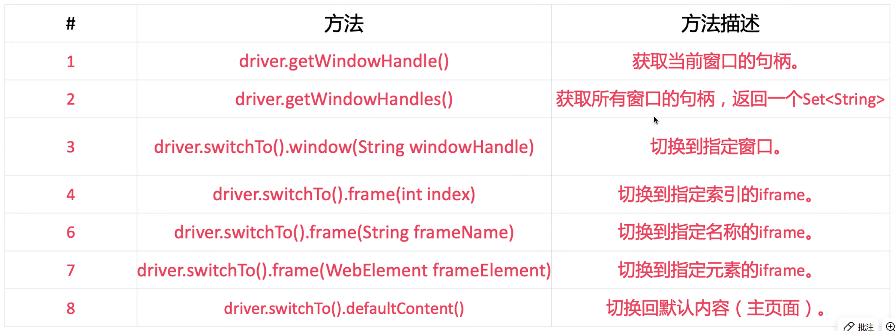

# 1. 基本概念

## 测试用例tc = 输入t + 预言o + 环境e

测试用例简称测试，一个测试用例*tc*是一个三元组<*t,o,e*>

**输入t**：构造输入

**测试预言o**：对于一个输入，我期望什么输出？

- 可以通过构建或直接采集数据的方式获得预言

**环境e**：可能存在的外界扰动（汽车行驶时的震动或是太空中的电磁波对于GPU计算的影响）

- 工程化

## 什么是测试

测试是通过设计实验性操作，观察目标对象的行为或输出，以发现缺陷、验证功能或评估性能的方法。其核心目的是：**发现缺验证功能或非功能属性**。

- **发现Bug**是**软件测试**的重要目的之一

**动态测试和静态测试**

- 主要关注动态测试，就是软件运行时的测试
- 静态成本低、速度快，但很容易误报，一般是类似于扫描代码发现问题的过程
- 动态成本高，但几乎不会误报（只要输出有问题，就一定存在某种Bug）
- 动态和静态结合，用动态的结果减少静态的误报，利用静态的结果有针对性的进行动态测试

## 测试报告与缺陷报告

测试报告通常以文本和图像形式进行存储和管理，简单的可以用excel

测试报告至少包含四部分<*θ,t,0,d*>

- θ是测试环境，通常是硬件和软件配置等
- t是测试输入，通常是输入数据和步骤
- o是测试输出，通常是输出截图或视频
- d是结果描述，通常是用于理解错误的信息

## 待测软件/待测程序/待测系统

待测软件是软件开发流程中用于测试的软件测试，包括待测程序P及相关文档，是软件质量保障的关键环节

**待测程序P（包括源代码、字节码、二进制）的通常形式化定义为元素集合**

> P是一个有序元素集合{$u_1,u_2,...,u_n$}，不同软件制品下，元素$u_i$被赋予不同含义

## 测试分类

**源代码依赖度**

- 白盒测试
- 灰盒测试
- 黑盒测试

**软件开发流程**

- 单元测试
- 集成测试
- 系统测试
- 验收测试

**软件质量属性**

- 功能测试
- 性能测试
- 安全测试
- 兼容性测试
- 易用性测试

# 2. 测试框架

### SPT

**软件工程的三大问题**

- S问题：文档生成
- P问题：代码生成
- T问题：测试生成

## 测试预言的性质

正确性

完备性

完美性

## 软件测试方法

# 实验一：Selenium测试基础

Selenium是一个自动化测试工具，用于测试web应用程序功能和用户界面，它可以模拟用户在浏览器里的操作，验证页面元素的状态和属性。

## 八大元素定位

```javascript
driver.findElement(By.id(""))
driver.findElement(By.name(""))
driver.findElement(By.cssSelector(""))
```


xpath定位

```javascript
driver.findElement(By.xpath(""))
```


## Webdriver常用方法




