# 1. 基本概念

## 1.1 测试用例tc = 输入t + 预言o + 环境θ

测试用例简称测试，一个测试用例*tc*是一个三元组<*t,o,θ*>

**输入t**：测试数据或测试输入

**测试预言o**：对于一个输入，我期望什么输出？

- 可以通过构建或直接采集数据的方式获得预言

**环境θ**：可能存在的外界扰动（汽车行驶时的震动或是太空中的电磁波对于GPU计算的影响）

- 工程化

## 1.2 什么是测试

测试是通过设计实验性操作，观察目标对象的行为或输出，以发现缺陷、验证功能或评估性能的方法。其核心目的是：**发现缺验证功能或非功能属性**。

- **发现Bug**是**软件测试**的重要目的之一

**动态测试和静态测试**

- 主要关注动态测试，就是软件运行时的测试
- 静态成本低、速度快，但很容易误报，一般是类似于扫描代码发现问题的过程
- 动态成本高，但几乎不会误报（只要输出有问题，就一定存在某种Bug）
- 动态和静态结合，用动态的结果减少静态的误报，利用静态的结果有针对性的进行动态测试

## 1.3 测试报告与缺陷报告

测试报告通常以文本和图像形式进行存储和管理，简单的可以用excel

测试报告至少包含四部分<*θ,t,0,d*>

- θ是测试环境，通常是硬件和软件配置等
- t是测试输入，通常是输入数据和步骤
- o是测试输出，通常是输出截图或视频
- d是结果描述，通常是用于理解错误的信息

## 1.4 待测软件/待测程序/待测系统

待测软件是软件开发流程中用于测试的软件测试，包括待测程序P及相关文档，是软件质量保障的关键环节

**待测程序P（包括源代码、字节码、二进制）的通常形式化定义为元素集合**

> P是一个有序元素集合{$u_1,u_2,...,u_n$}，不同软件制品下，元素$u_i$被赋予不同含义

## 1.5 测试分类

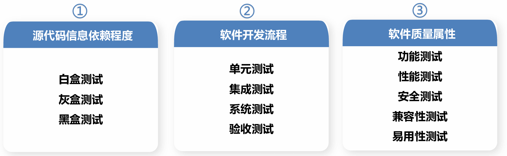

### 1.5.1 源代码信息依赖程度

#### 1.5.1.1 白盒测试

白盒测试依赖源代码信息，主要目的是测试应用程序内部的结构和运行情况。

白盒测试从程序内部角度出发进行测试用例设计，通过**程序路径覆盖**特别目标发现程序中潜在缺陷。

测试人员需要理解待测试程序的内部结构 ， 这种程序理解的先决性往往使得白盒测试**成本高昂**。

#### 1.5.1.2 黑盒测试

黑盒测试更强调从用户的角度出发，针对软件的界面、功能及外部结构进行测试，通常不考虑程序内部逻辑结构。

黑盒测试通常由测试人员根据软件规范、软件规格说明或设计文档设计而成 。

黑盒测试可用于多功能测试、性能测试、兼容性测试等，具有应用范围广泛、测试效率卓越、测试覆盖全面的优点 。

#### 1.5.1.3 灰盒测试

灰盒测试是一种介于白盒和黑盒之间的方法。相对于黑盒，灰盒测试更加注重程序的内部逻辑，但源代码信息不像白盒那样详尽。

灰盒测试通过一些表征性的现象或事件来反映内部运行状态。灰盒测试使用特定方法和工具来提取应用程序的内部知识和交互信息，进而使用内部间接信息来设计测试，以提高测试效率 。

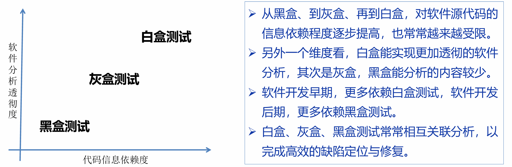

### 1.5.2 软件开发流程

#### 1.5.2.1 单元测试

单元测试是针对软件中最小可测试单元进行验证的技术。单元是指软件中最小可测试部分。一个单元可以是独立的函数和过程。

测试人员通常会使用测试框架、驱动程序、模拟对象等方式辅助完成单元测试。单元测试的基本原则是保证测试用例之间相互独立。

单元测试一般由软件的开发人员来实施，目的是检验所开发的代码功能是否符合开发者自己规定的设计要求。

#### 1.5.2.2 集成测试

集成测试将在所有的软件单元按照概要设计规格说明要求组装成模块、子系统或系统，确保各个单元部分之间的协作良好。

在集成测试之前,应该先完成单元测试。集成测试将已经测试的多个单元组装成一个局部整体进行测试。这种测试用来集成测试的目的是确认在不同单元模块之间的交互中没有出现问题。

#### 1.5.2.3 系统测试

系统测试是针对整个系统的测试，它将与系统相关的硬件与软件看作一个整体，检验系统是否符合预期。

系统测试的关注重点包括待测系统本身的使用，待测系统与相关系统间的连通，以及待测系统在真实使用环境下的表现等。

系统测试则侧重整个系统的功能验证，更加靠近业务端。除了功能测试，系统测试还包括性能测试、安全测试、兼容性测试、稳定性测试等。

#### 1.5.2.4 验收测试

验收测试也称交付测试，是针对用户需求和业务流程的测试，其目的是验证系统是否满足验收标准，并由用户或其他授权机构决定是否接受该系统。

验收测试可以分成内部验收测试和外部验收测试。内部和外部验收测试的区别主要在于测试的执行者不同。测试执行者可以是软件开发团队中软件开发和软测试活动的非直接参与者，也可以是软件的最终用户和潜在用户扮演者，在某些情况下可采取众包方式来实现。

# 2. 测试框架

## 2.1 SPT

**软件工程的三大问题**

- S问题：文档生成
- P问题：代码生成
- T问题：测试生成

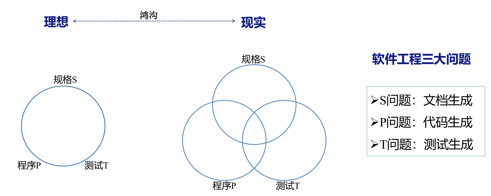

**举例：三角形程序**：

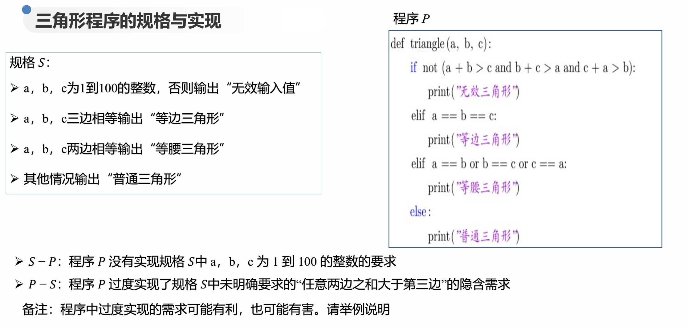

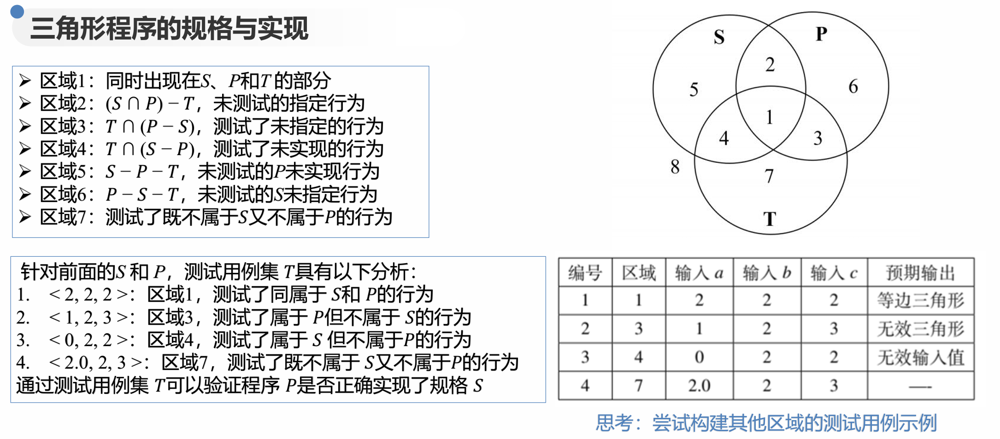

## 2.2 测试分析框架

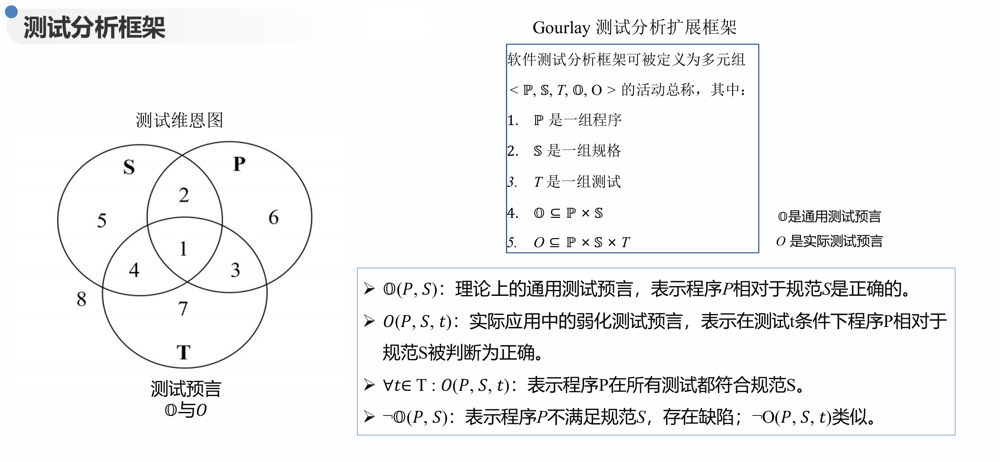

## 2.3 测试预言的性质

正确性：如果测试预言𝑂(𝑃, 𝑆, 𝑡) 成立，则程序P在测试t上确实执行正确𝑐𝑜𝑟𝑟(𝑃, 𝑆, 𝑡)。

完备性：如果程序P在测试t上执行正确𝑐𝑜𝑟𝑟(𝑃, 𝑆, 𝑡)，则测试预言𝑂(𝑃, 𝑆, 𝑡) 成立。

完美性：测试预言同时满足正确性和完备性，即𝑐𝑜𝑟𝑟(𝑃, 𝑆, 𝑡)⇔𝑂(𝑃, 𝑆, 𝑡)。

> **测试集T的局限性**：实际难以穷尽所有可能的测试集T，因此测试预言的完美性难以实现。 
>
> **测试预言过于精确**：可能导致程序实际正确但测试预言不通过（例如计算精度问题）。 
>
> 在软件工程中，如何平衡测试预言的正确性和完备性是一个复杂问题。

## 2.4 软件测试方法

### 2.4.1 软件测试

测试方法 𝑀 是一个函数：$𝑀:P×S→T$，表示基于被测程序 P 和规范 S 生成测试用例$t∈T$。生成测试集T 的测试方法：
$$
M:P×S→2^T
$$
$T_𝐶⊆P×S×2^T$表示测试准则$𝑇_𝐶$与待测程序P、规范S和测试集T的关系。
$$
C(P × S ) → 2^T
$$
$(P × S × 2^𝑇) = r,   r∈ [0, 1] $

### 2.4.2 测试预言与测试准则

$$
O_C \subseteq P × S × T_O
$$

表示测试预言$O_𝐶$与待测程序P、规范S和测试输出$T_O$的关系。

测试充分性可扩充定义为测试集和测试预言的配对充分性，即
$$
T_C \subseteq P × S × 2^T × T_O
$$

### 2.4.3 测试准则蕴含

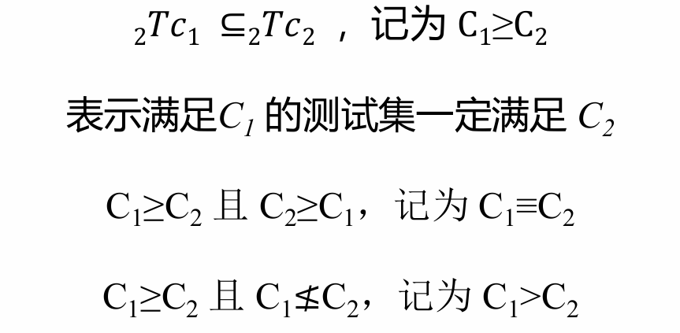

- 偏序关系，但不是全序关系
- 经验关系，但不是理论关系

### 2.4.4 测试预言的包含关系

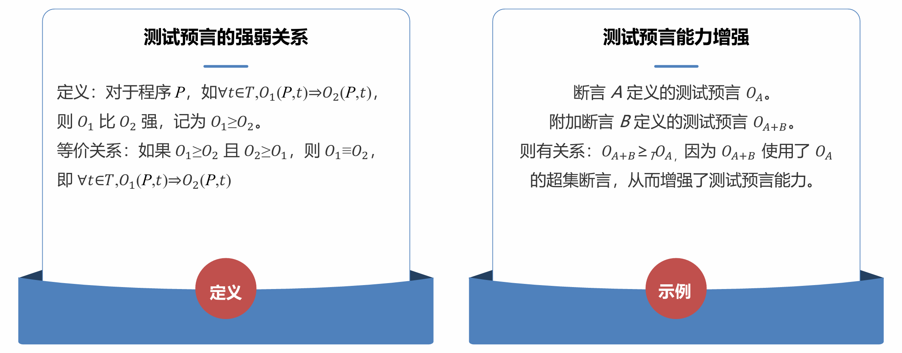

# 3. 软件Bug与PIE模型

## 3.1 PIE模型概述

1. PIE模型用于解释软件Bug的触发和传播机理。
2. **Bug的存在并不一定导致失效**，需要满足特定条件才会被软件测试人员发现。
3. PIE模型通常用于解释传统软件的Bug，但不适用深度学习等智能软件系统缺陷。

IEEE 1044-2009 标准中的定义

==Defect（缺陷）==：Defect 是指产品中不符合要求的缺陷或不足之处， 是**静态存在于程序中的问题**。 

- 例如，代码中缺少必要的功能实现部分，或存在语法错误，这都是 Defect。

==Failure（失效）==：Failure 是指产品运行未达到预期功能而终止，是**程序错误状态传播到外部被感知**的现象。 

- 例如，一个软件在执行某个功能时突然崩溃，无法继续运行，这就是 Failure。

==Fault（故障）==：Fault 用来补充解释和细分 Defect 的含义，也是程序中存在的问题，但更侧重于故障状态。 

- 例如，一个变量被错误地初始化，导致后续计算可能出现问题，这就是Fault（故障）。

==Problem（问题）==：Problem 用来解释不满意的产品输出，是用户对软件运行结果不满意的情况。

- 例如，用户期望软件输出的结果是 A，但实际输出是 B，这就是 Problem。

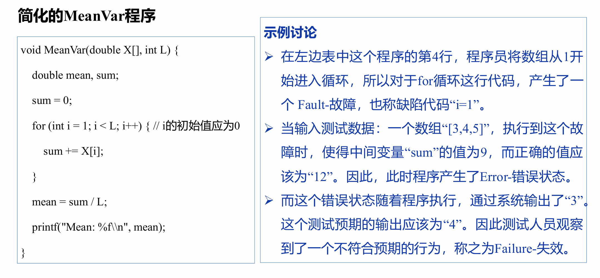

## 3.2 Bug的特性

### 3.2.1 Bug的反向定义

给定程序 𝑃 和测试 t，若 𝑃(𝑡) 失效，修改后得到新程序 𝑃‘，若 𝑃‘(𝑡) 通过，则确认程序修复位置的源代码 𝑃\𝑃’ 为故障。

### 3.2.2 不确定性

给定待测程序 𝑃 和测试 t， 𝑃(𝑡) 失效。若不同修复方法分别得到两个程序P1≠ P2，均使得测试t通过，即失效消失，从而确认了P\P1和P\P2为两个不同的故障。

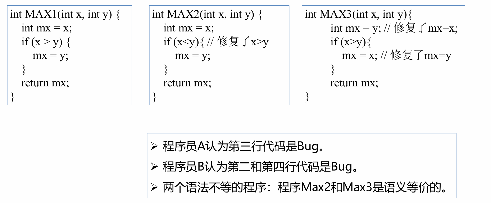

对于任意一个程序，能够构造无穷多个跟它语义相等但语法不同的程序。 这也意味着，能够定义无穷多个Bug，这导致程序修复收敛具有很大的不确定性。

为了降低这种不确定性，需要更多的工程化方法，例如要求极小化的程序修复，即尽可能少修改程序代码。

对于任意的需求规格，理论上都存在无穷的正确程序实现版本， 这些程序版本是语法不一致的。这样的编程特性，给后期测试、确定Bug、进而调试和修复带来极大的挑战。

### 3.2.3 非单调性

单调性指函数值与自变量变化趋势一致。例如，随着自变量增大，函数值也增大。 

非单调性指函数值变化与自变量变化不一致。例如，自变量增大时，函数值可能减小，当然也可能增大。 

开发者经验增加，代码质量通常提高，这是单调性。系统复杂性与可维护性关系可能是非单调的，复杂性增加到一定程度，可维护性反而下降。

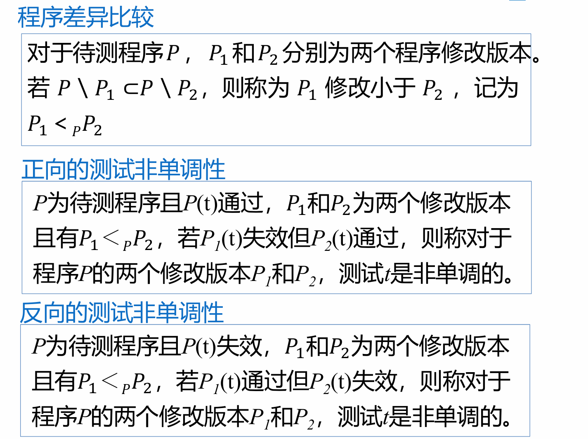

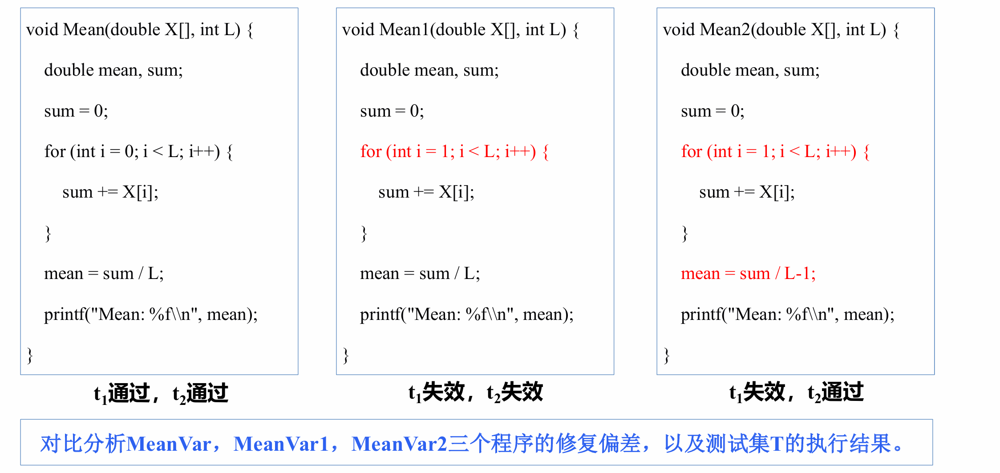

**软件的复杂性常常带来Bug的非单调性**

1. 代码层面的复杂性
   - 一个Fault可能涉及多行不连续代码，增加了修复的难度。 修复时需考虑代码间的逻辑关联，避免引入新的问题。
2. 外部引用的复杂性
   - Bug可能涉及其他函数的外部引用，修复时需考虑整体架构。外部引用的修改可能引发连锁反应，导致新的问题出现。
3. 非单调性现象
   - 在修复过程中，可能遇到 “越修越坏”的情况，失效的测试数量增加。只有完整修复程序后，测试集才能全部通过，过程充满挑战。

### 3.2.4 Bug间的干涉性

在软件开发实践中，软件通常存在多个故障 （Bug）共存的情况，而非单一故障。

多个 Bug 可能使软件的不同功能之间产生冲突， 不同 Bug 相互作用还可能引发原本单个 Bug 不会出现的新问题。

多个 Bug 同时出现时，**产生的错误信息可能会相互混淆**，使开发人员难以准确判断问题的根源，这增加了测试和调试的难度。

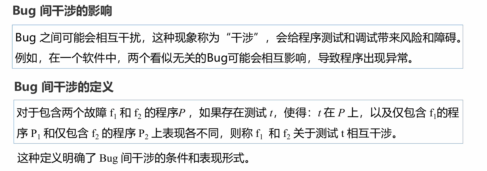

- 如果在同一程序中，𝑓1 和 𝑓2 同时存在时导致测试 𝑡 失效， 而单独存在 𝑓1 或 𝑓2 时测试 𝑡 通过，这种现象称为==相长干涉==。 
  - 例如，两个 Bug 分别导致数据读取错误和数据写入错误，当它们同时存在时，会导致程序完全崩溃。
- 如果包含故障 𝑓1 的程序在测试 𝑡上失效，但当添加另一个故障 𝑓2 后，测试 𝑡 不再失效，这种现象称为==相消干涉==。 
  - 例如，一个 Bug 导致程序运行缓慢，另一个 Bug 导致程序提前退出，两者同时存在时，程序反而正常运行。

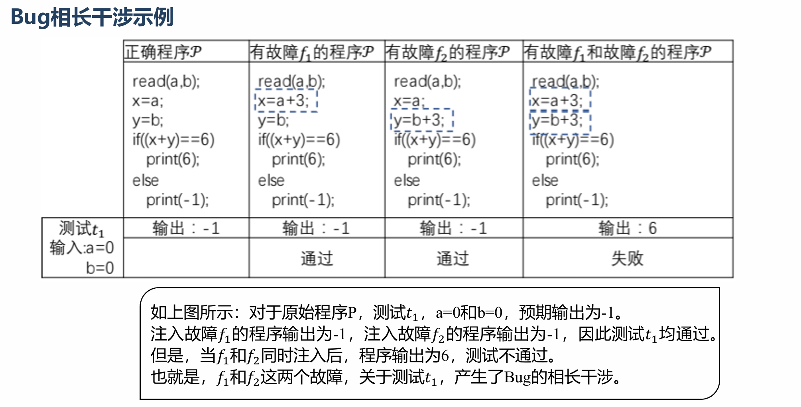

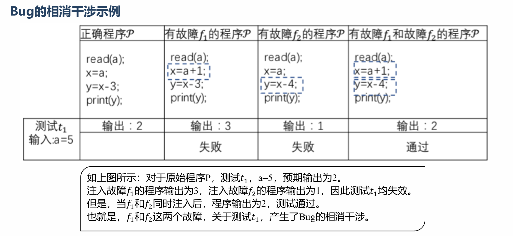

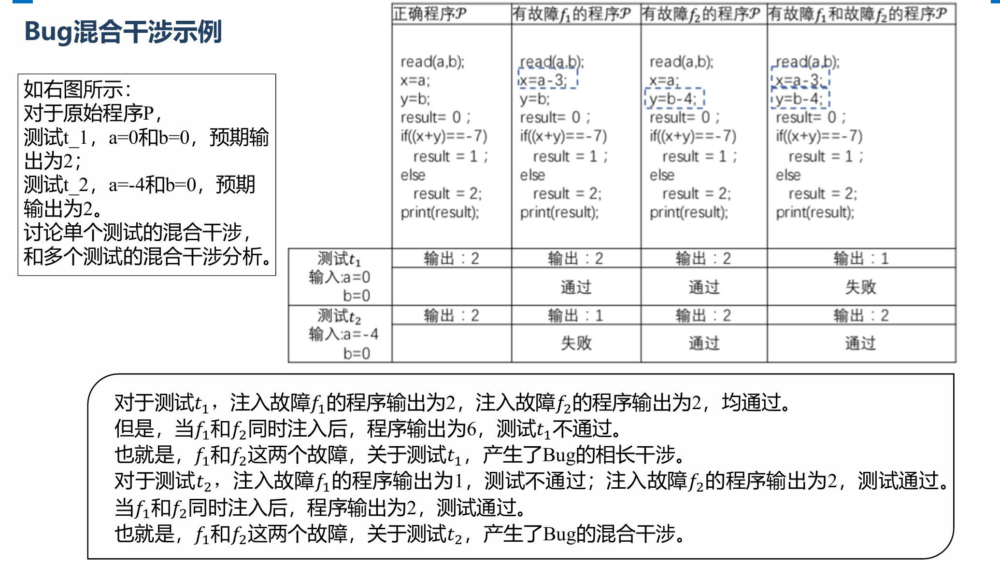

Fault，Error，Failure

```python
def mul(a,b):
	c = a + b;
    return c > 0 ? true:false
	
def test1():
	expected = true
	actual = mul(2, 2)
	assert actual == expected // 存在Fault，但是没有Error的中间状态
	
def test2():
	expected = true
	actual = mul(2,3)
	assert actual == expected // 存在Error，但是没有反映到系统边界
	
def test3():
	expected = true
	actual = mul(-2,-3)
	assert actual == expected // 存在Failure
```

相长干涉，相消干涉

```python
def P(a, b):
    x = a
    y = b
    if x + y = 6:
        return true
    return false
    
def P1(a, b):
    x = a
    y = b
    if x + y = 6:
        return true
    return false

def P2(a, b):
    x = a
    y = b
    if x + y = 6:
        return true
    return false

def P3(a, b):
    x = a
    y = b
    if x + y = 6:
        return true
    return false

def T1():
    expected = 6
    print("P :", P(2, 3))   # 正确 6
    print("P1:", P1(2, 3))  # 错误 5
    print("P2:", P2(2, 3))  # 错误 -1
    print("P3:", P3(2, 3))  # (2+3) - (2-3) = 5 - (-1) = 6 ✅ 恢复正确

def T2():
    expected = 12
    print("P :", P(3, 4))   # 正确 12
    print("P1:", P1(3, 4))  # 错误 7
    print("P2:", P2(3, 4))  # 错误 -1
    print("P3:", P3(3, 4))  # (3+4) - (3-4) = 7 - (-1) = 8 ❌ 错的更离谱

```

# 4. 随机测试

## 4.1 随机测试概述

随机测试是一种最简单的多样性测试方法。**测试数据通过随机抽样生成**，通常基于概率分布生成， 也可用于模仿用户对软件的使用场景。

随机测试能够低成本生成大量的测试，以发现隐藏的缺陷。随机测试可以用于不同的测试场景， 具有很强的适用性和很高的易用 性，广泛应用于各类测试。

随机测试的缺陷检测效率瓶颈问题严重，随着测试进行，效率提升困难。后期能力提升困难，结合程序分析和其他测试方法改进 是主要研究方向。

**随机测试的定义**：针对输入空间 Ω，随机测试以**概率分布 F** 进行随机抽样获得测试集 T。 

- 默认情况下 F 是均匀分布。 
- 实际应用中通常采用**有放回抽样**以简化实现。

## 4.2 简单随机测试

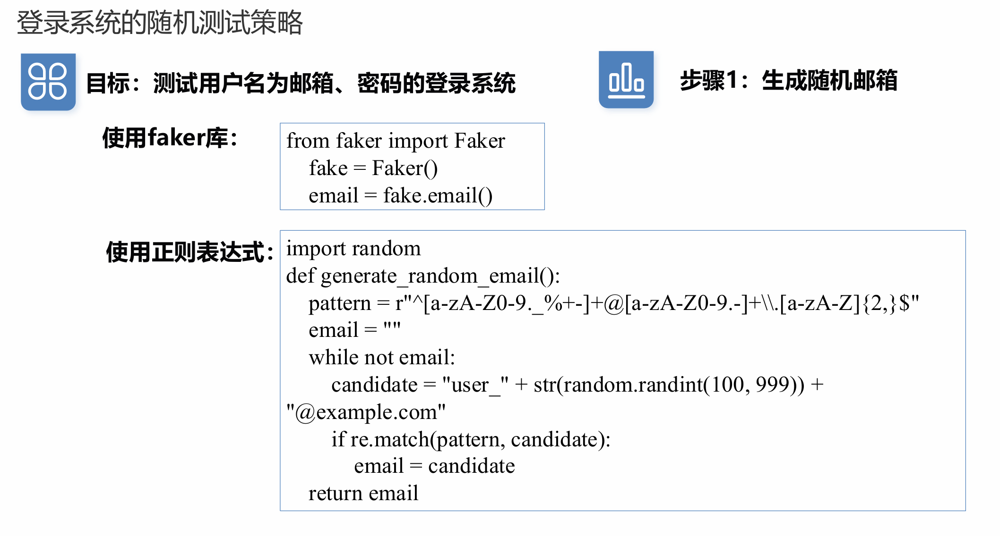

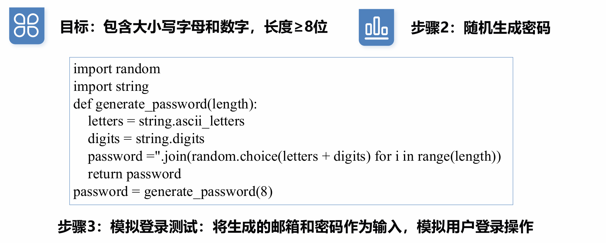

## 4.3 自适应随机测试

**随机测试的局限性与改进**：随机测试效率较低，命中故障模式的概率取决于软件故障率。 因此，可利用软件失效的故障模式信息来指导随机测试。自适应随机测试是一种有效的改进方法。

**自适应随机测试(ART)**：针对输入空间 Ω，自适应随机测试以概率分布 F 进行随机抽样，并结合距离度量反馈信息筛选获得测试集 T。

**软件失效的故障模式**
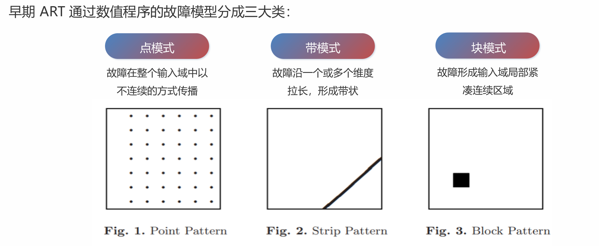

**ART的设计直觉**

- 连续故障区域的存在意味着非故障区域也是连续的。
- 测试应该更均匀地分布在整个输入域。
- 远离已执行测试的新测试更有可能导致软件失效。

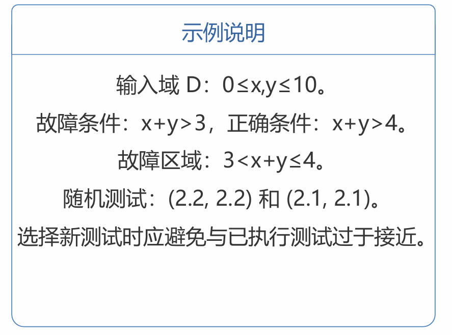

**ART主要步骤**

1. **初始化**：执行初始测试，收集程序行为信息(如输出、执行时间和覆盖率等)。
2. **执行测试**：将输入空间**分成若干子区域**，在每个子区域中随机选择一个初始测试。
3. **反馈控制**：根据执行结果更新输入空间，将相似测试归为同一子区域。
4. **选择测试**：<u>使用自适应策略选择距离已知故障最远的测试</u>。
5. **循环重复**：重复上述过程，直到满足测试终止条件。

> **执行集**:已执行但未显示失效的测试集合，最初为空。 
>
> **候选集**：无放回随机选择的测试集合，用于更新执行集。 
>
> **选择策略**：从候选集中选择离所有已执行测试最远的元素作为下一个测试。

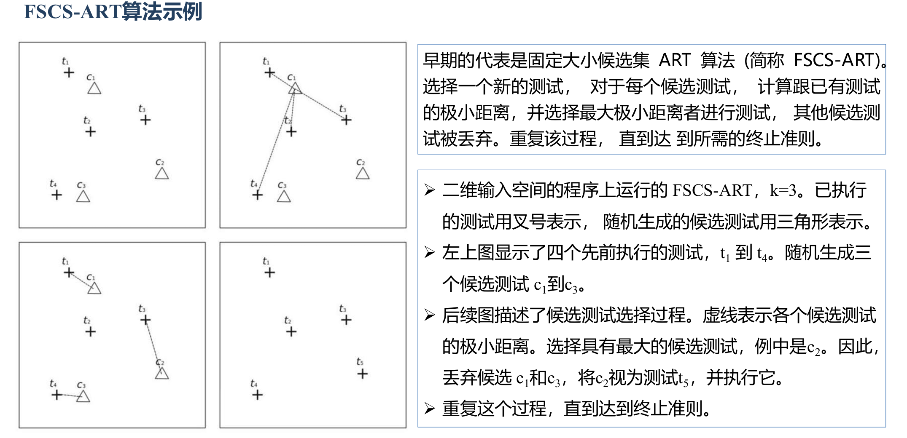

**距离度量的定义与应用**

➢欧几里得距离：可衡量数据点之间的空间距离，以判断它们的相似性。 

➢曼哈顿距离：在城市规划、交通领域有应用，如计算城市中两点之间的行车距离。 

➢余弦相似度：在文本处理中，用于计算文本之间的相似度，判断文档的主题相关性。 

➢汉明距离：在信息编码、数据传输错误检测和纠正等领域应用广泛。

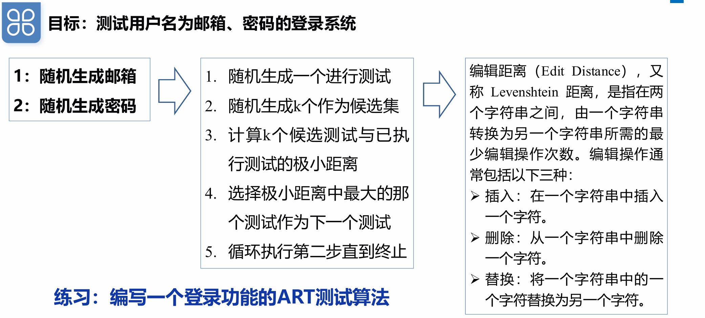

## 4.4 引导性随机测试

总体目标：选择适当的测试生成方法，快速生成测试覆盖程序的各种路径或指定路径。

### 4.4.1 符号执行(Symbolic Execution)

一种静态测试方法，通过构造符号化输入代替具体输入，探索程序路径并生成路径约束条件，最后求解这些约束条件得到程序的测试输入范围。

1. 符号化变量：使用符号值代替数字值来表示程序变量。 
2. 模拟程序执行：不执行实际程序，基于中间语言模拟程序执行。 
3. 记录路径条件：记录执行过程中经过的语句序列，即变量符号值的约束。 
4. 求解约束条件：使用约束求解器得到满足路径条件的测试输入。 
5. 生成测试用例：将求解结果转化为测试用例格式。

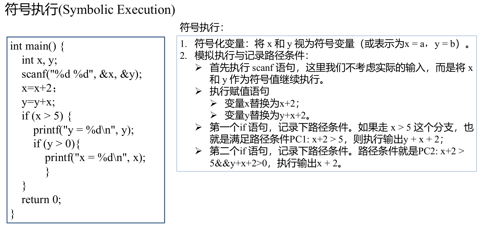

**约束求解**： 

- 求解PC1: $x+2 > 5$，即 $x>3$，例如求解或随机得到 $x=7$；不满足PC1的解为 $x<=3$，例如 $x=0$。 
- 求解PC2: $x+2 > 5$ && $y+x+2>0$，即 $x>3$&& $y+x>-2$，例如求解或随机得到 $x=4,y=0$；不满足PC2的解为 $x=4,y=-2$。

### 4.4.2 符号执行的问题

<u>**路径爆炸问题**</u>

随着程序规模的增大和分支结构的增多，程序的执行路径数量会呈指数级增长。一个包含n个独立if - else分支的程序，理论上有$2^n$条不同的执行路径。这使得符号执行在分析大型程序时，需要处理海量的路径，常常因为资源耗尽而无法完成分析。

➢**路径剪枝**：通过静态分析技术提前识别出不可行路径，将其从分析范围中排除。 

➢**启发式搜索**：采用启发式算法对路径优先分析那些更有可能发现问题的路径。 

➢**抽象解释**：结合抽象解释对程序状态进行抽象表示，减少符号执行需要处理的状态数量。

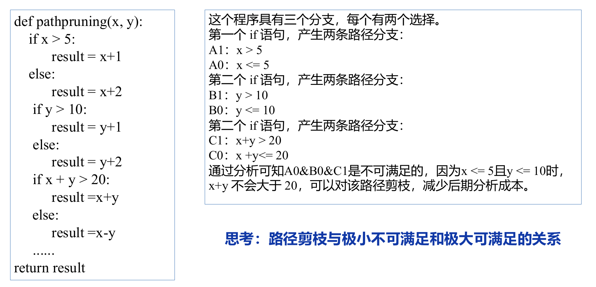

<u>**内部结构问题**</u>

数组的索引常常导致符号执行需要处理大量的可能索引值，增加了路径数量和分析的复杂性。 多维数组更是进一步加剧了这种复杂性，因为需要同时处理多个维度的索引。

➢结构复杂性：符号执行时需要跟踪每个节点的指针关系，以确定链表的结构和遍历路径。 由于链表的长度和结构可能在运行时动态变化，符号执行需要处理各种可能的情况，这增加了分析的复杂性。 

➢结构多样性：树结构具有多种类型，如二叉树、多叉树等，且树的深度和节点数量可能 在运行时动态变化。符号执行需要处理不同类型树的遍历、插入、删除等操作，同时要考虑树的平衡性、节点的层次关系等因素。 

➢哈希冲突处理：哈希表通过哈希函数将键值映射到数组的索引位置。然而，不同的键可能会产生相同的哈希值，导致哈希冲突。符号执行需要处理哈希冲突的情况，确保在插入、查找和删除操作时能够正确访问哈希表中的元素。

<u>**外部函数问题**</u>

当程序中存在外部函数调用时，符号执行很难对这些外部函数的行为进行准确建模。如操作系统、数据库等，导致符号执行无法准确地模拟程序的执行过程，影响分析结果的准确性。 

➢函数摘要：为外部函数生成函数摘要，描述函数的输入输出关系。 

➢模拟执行：对于一些常见的外部函数，可以编写模拟代码来模拟其行为。 

➢动态信息结合：结合动态执行的信息来辅助处理外部函数调用。可以在程序运行时收集外部函数的输入输出信息，然后将这些信息用于符号执行过程中，提高分析的准确性。

<u>**约束求解问题**</u>

某些复杂的约束条件可能会超出约束求解器的能力范围，导致求解时间过长或者无法求解。 例如，包含非线性算术运算、量词的约束条件，对于现有的约束求解器来说是比较困难的。 

➢简化约束条件：在符号执行过程中，对路径条件进行预处理，尽量简化约束。例如，利用代数化简、逻辑等价变换等方法，将复杂的约束转化为更容易求解的形式。 

➢使用近似求解：对于一些难以精确求解的约束条件，可以采用近似求解的方法，虽然不能保证找到所有解，但可以在可接受的时间内得到一些有用的结果。 

➢多求解器结合：不同的约束求解器在处理不同类型的约束条件时具有不同的优势，可以将多个求解器结合起来，根据约束条件的特点选择合适的求解器进行求解。

### 4.4.3 动态符号执行

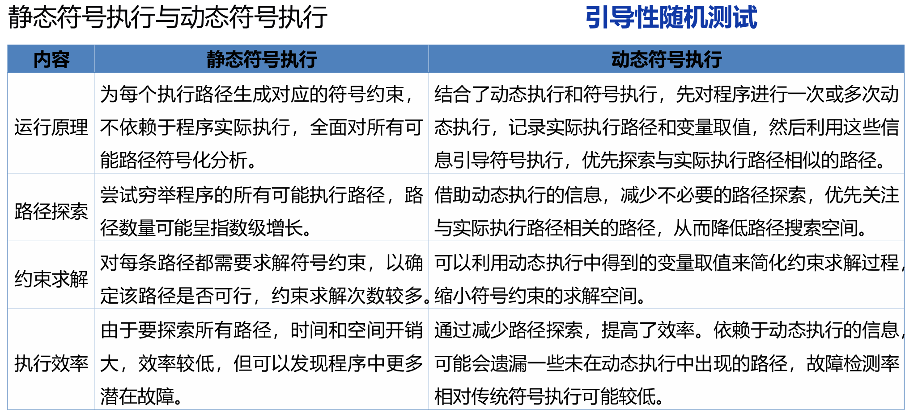

```c++
int  f( int  x)  {
	return 2 * x;
}
int  h(int  x,  int  y)  { 
	if  (x != y) {
		if  (f(x)  == x + 10) {    
		abort();  /* error  */
		}
	} 
}
```

> 路径分析: 
>
> ➢ 路径分支1: `𝑥==𝑦` →不需要测试。 
>
> ➢ 路径分支2: `𝑥≠𝑦` 
>
> ​	➢ 子路径 2a： `𝑓(𝑥)==𝑥+10` ，测试输入 `𝑥=5，𝑦=6` 
>
> ​	➢ 子路径 2b： `𝑓(𝑥) ≠ 𝑥+10`，测试输入 `𝑥=4，𝑦=6`

# 5. 等价类测试

**等价类测试方法概述** 

➢（**黑盒假设**）对于一个软件系统，输入数据通常是无穷的，对所有输入进行测试既不现实也没必要。因此，可将输入空间划分为若干等价类，从每个等价类中选取有代表性的数据作为测试用例，以此达到用少量测试达到较高的缺陷检测能力。 

➢（**能力假设**）等价类指的是输入域的一个子集，在这个子集中，各个输入对于揭露软件中 的缺陷所起的作用是等价的。也就是说，若等价类中的某个输入能够发现软件的缺陷，那么该等价类中的其他输入也有相同的可能性发现这个缺陷。

## 5.1 软件等价类划分

等价关系和等价类划分：

- 自反性：每个元素与自身等价。 
- 传递性：如果A与B等价，则B与A等价。 
- 对称性：如果A与B等价，B与C等价，则A与C等价。

设$R$是集合$A$上的等价关系，对于$a∈A$，称 $[a]R={b∈A∣(a,b)∈R}$为$a$关于$R$的等价类。所有等价类组成的集合称为$A$关于$R$的商集，记作$A/R$。

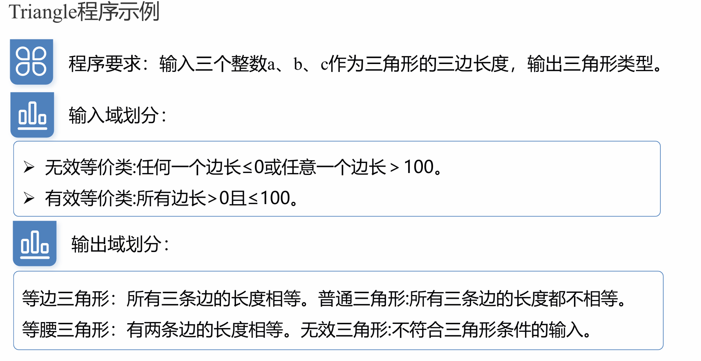

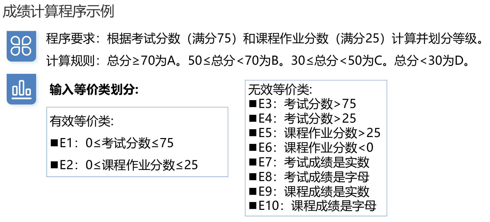

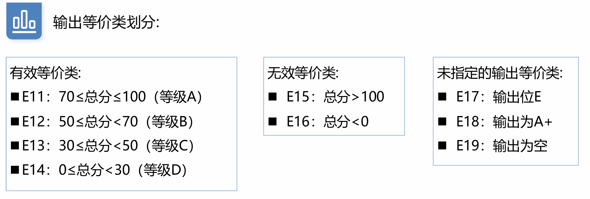

**等价类测试的类型**:

- 弱一般等价类测试: 覆盖每一个变量的有效等价类 
- 弱健壮等价类测试: 弱一般等价类上增加无效等价类 
- 强一般等价类测试: 覆盖每个变量的每个有效等价类组合 
- 强健壮等价类测试: 在强一般等价类上增加无效等价类

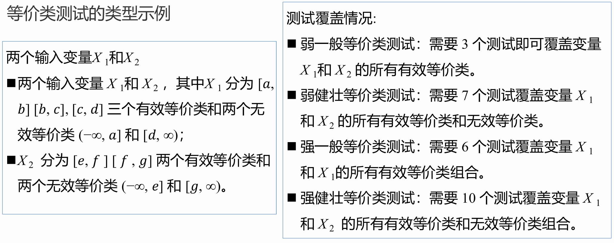

> | 类型            | 核心区别                         |
> | --------------- | -------------------------------- |
> | **弱 / 强**     | 看的是：**等价类是否要做“组合”** |
> | **一般 / 健壮** | 看的是：**是否包含“无效等价类”** |
>
> 上题中：
>
> 弱一般：max(3,2)	= 3
>
> 弱健壮：max(3,2) + 2 + 2	= 7
>
> 强一般：3 × 2	= 6
>
> 强健壮：3 × 2 + 2 + 2	= 10

## 5.2 划分随机测试方法

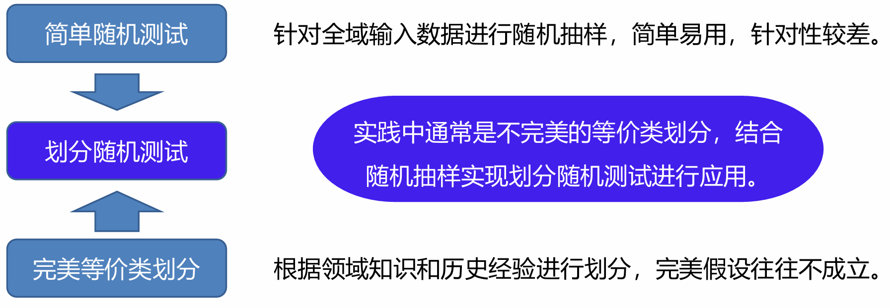

> 简单来说：先把所有可能的输入划分成若干有意义的区域（划分），再在每个区域里随机选取测试数据。

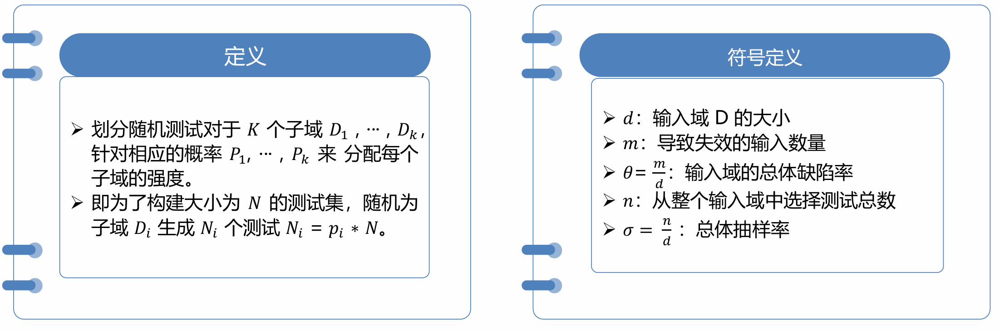

### 5.2.1 P-度量

𝑃-度量：测试集至少包含一个失效测试的概率。

简单随机测试: $𝑃_𝑟 =1−(1−𝜃)^𝑛$ 

划分随机测试: $𝑃_𝑝 =1−\Pi_{𝑖=1} ^𝑘 (1−𝜃_𝑖)^{𝑛_i}$

> p-度量关注：一次或一组测试中，发现至少一个缺陷的概率。
>
> 缺陷输入占整个输入空间的比例为 `θ`，发现缺陷的概率 = $1 − (1 − θ)^n$，测试次数越多，发现缺陷的概率越大

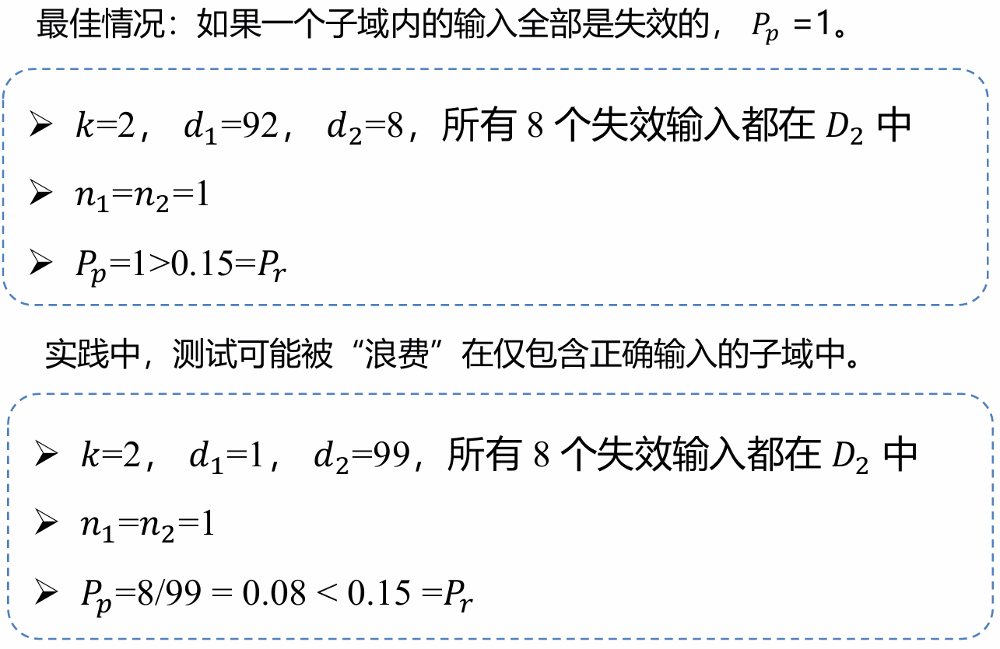

### 5.2.2 E-度量

E-度量：测试集触发软件失效次数的数学期望

简单随机测试: $𝐸_𝑟 = \frac{mn}{d} =𝑛𝜃$ 

划分随机测试: $𝐸_𝑝 =\sum_{𝑖=1} ^𝑘 \frac{𝑚_𝑖𝑛_𝑖}{𝑑_𝑖}=\sum_{i=1}^k{n_iθ_i}$

### 5.2.3 F-度量

F-度量：检测到第一个缺陷时所需的测试数量

F-度量是几何分布： $P(F=i)=(1−θ)^{i−1}θ$

早期的研究假设 P-度量和 E-度量具有正态分布。因此， 平均数、中位数和众数应该是相似的，但同时方差很高。 因此，需要大样本量才能获得可靠的估计。而F-度量常常被用来评估可靠性。

不难看出 E-度量服从二项分布 $B(l, θ)$，其中 $l$ 是测试数量， $θ$ 是触发失效的概率，当然二项分布的正态逼近可以参阅中心极限定理。随机测试中 $θ$ 的值通常很低。 $lθ$ 实际上是二项式分布随机变量 $B(l, θ)$ 的期望值。这意味着，要使 E-度量近似于正态分布，需要充分大的$l$。

### 5.2.4 平均无故障时间 (简称， MTTF)

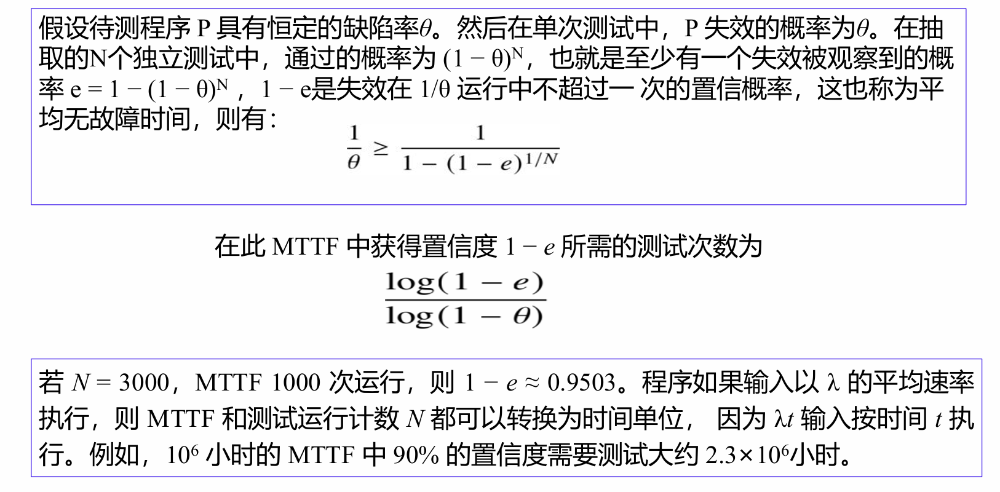

## 5.3 组合测试

组合测试适用于具有多个参数的系统， 全组合测试数目**指数级**增长。  

组合测试是一种在保证缺陷检出率的前提下，采用较低成本的测试方法。 

组合测试方法简单、对测试人员要求低、能有效处理大规模测试需求。 

组合测试的目标是**用最少用例覆盖最多参数**交互缺陷。

**参数**：参数，也称为因素，是指那些可以影响软件行为的输入变量或配置选项。 例如，在一个Web应用测试中，可能包括浏览器、操作系统、屏幕分辨率、网络等不同类型的参数组合。  

**取值**：每个参数都有一个或多个可能的取值。 例如，在一个Web应用测试中，参数取值包括浏览器类型：Chrome、Firefox、360； 操作系统类型：Windows、麒麟、统信；屏幕分辨率：1920x1080、1366x768等。

**组合强度（Coverage Strength）**：

组合强度表示需要覆盖的参数组合的数量，记为n-因素组合：

- n=1，单因素组合：覆盖每个参数的所有取值各一次即可。由于没有考虑组合，一般不纳入组合测试讨论范围。 
- n=2，双因素组合，也记为2-way或Pairwise：覆盖所有参数的两两组合。这是最常用的组合强度，因为它能够在较少的测试用例中发现大多数交互缺陷。 
- n=3，三因素组合，记为3-way：覆盖所有参数的三元组合。这种组合强度比Pairwise更严格，能够发现更复杂的交互缺陷，但需要更多的测试用例。 
- k-因素组合，记为k-way：覆盖所有参数的k元组合。k可以是任意正整数，随着k的增 加，测试数量会呈指数级增长，因此在实际应用中通常选择较低的k值。

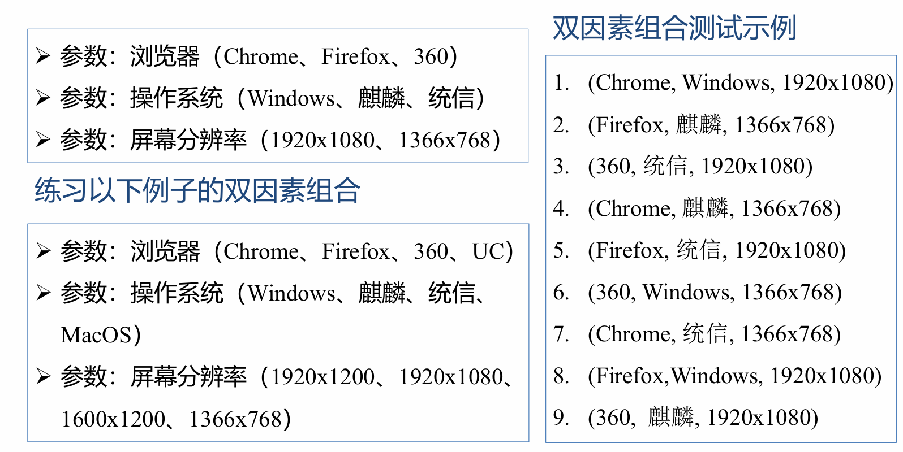

# 6. 故障假设测试

## 6.0 故障假设与边界

**故障假设**的直觉基于对软件系统复杂性和不确定性的认识。通过**主动假设软件中存在各种可能的故障情况**，可以更有针对性 地设计测试用例，从而发现那些可能被常规测试忽略的问题。

软件系统在处理**边界值**时更容易出现错误。从数学角度看，边界是不同状态或条件的分界线，在软件中，输入输出的边界值往往是系统逻辑发生变化的关键点。**边界故障假设测试**就是主动去探索这些边界情况，验证系统在边界值及其附近的表现是否符合预期，从而发现潜在的缺陷。

**数值范围边界**：对于有明确数值范围限制的输入，确定其**最小值、最大值、略小于最小值、略大于最大值的值**。例如，一个输入框要求输入 1 - 100 之间的整数，那么边界值就是 1、100、0、101。


> 正向是边界内的，负向是边界外的

## 6.1 黑盒边界故障假设

黑盒边界故障假设测试基本步骤：

1. 功能理解：分析软件的功能需求和规格说明，明确系统的输入和输出。 
2. 变量识别：准确识别出每个功能模块中涉及的所有输入和输出变量。 
3. 明确取值范围：针对每个输入和输出变量，确定其合法的取值范围。 
4. 找出边界点：在取值范围的基础上，找出边界点。边界点包括最小值、最大值、略小于最小值、略大于最大值的值。 
5. 考虑特殊情况：除了常规的数值边界，还要考虑一些**特殊的边界情况**。

> 一些隐性的边界，比如日期的组合中2月在闰年和平年的区别

➢单变量测试用例：针对每个变量的边界点，设计单独的测试用例。 

➢多变量测试用例：当系统有多个输入变量时，要考虑多个变量的边界值组合。

**边界的类型与定义**：

- **字符长度边界**：如果输入是字符串，关注其允许的最小长度和最大长度。
- 办公软件的设置页面的边距、纸张大小等参数到边界值。
- 人脸识别系统

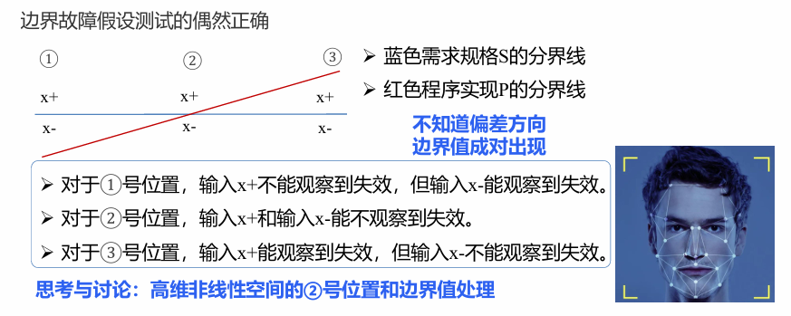

## 6.2 白盒边界故障假设

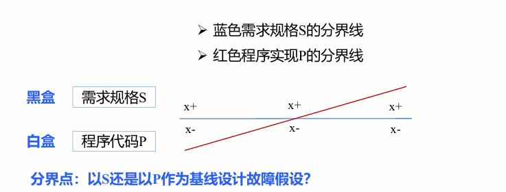

白盒边界故障假设主要关注**代码中的判定决策点**，如条件语句、循环语句，也包括更加细致的逻辑操作符。通常包括输入范围的最小值、最大值，以及刚好超出范围的值。这里的值往往是**逻辑的真假值**。

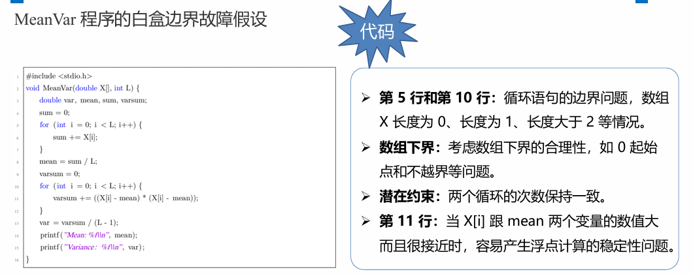

**计算稳定性**

- 浮点计算与实数运算的差异：浮点计算和实数运算之间的细微差异可能带来严重问题。
- 浮点运算采用不同的舍入模式可能导致不计算结果。
- 例如： a+(b+c)=(a+b)+c 在浮点计算不一定成立。

➢ 前向误差：结果与解的差值，$∆𝑦=𝑦'−𝑦$。 

➢ 后向误差：最小的$∆𝑥$使得$𝑓(𝑥+∆𝑥)=𝑦'$ 

➢ 混合稳定性：结合前向误差和后向误差。

## 6.3 变异分析基本概念

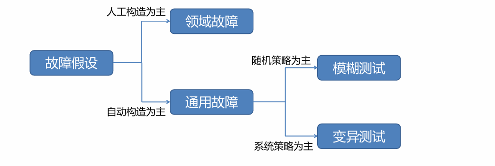

**变异分析通过将微小代码语法修改以检查测试集是否能够检测代码缺陷。**

两大假设：

1. 熟练程序员假设：熟练程序员编写的有缺陷代码与正确代码非常接近。
2. 耦合效应假设：如果测试能检测单一缺陷，则也能检测耦合的复杂缺陷。

**变异体**

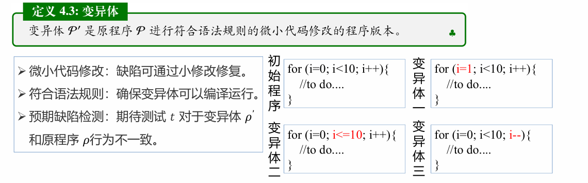

**变异体检测**

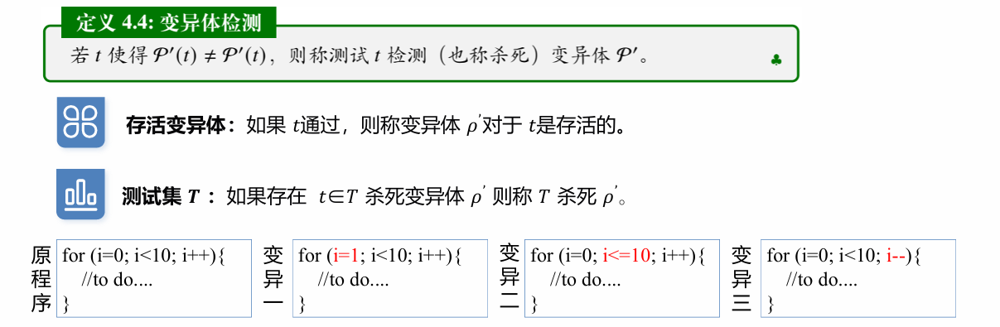

**变异分数**

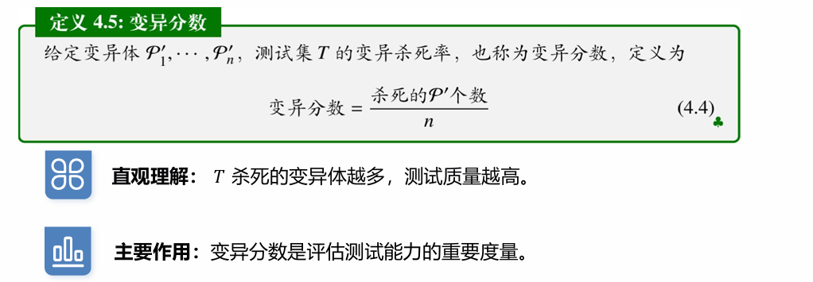

**等价变异体**

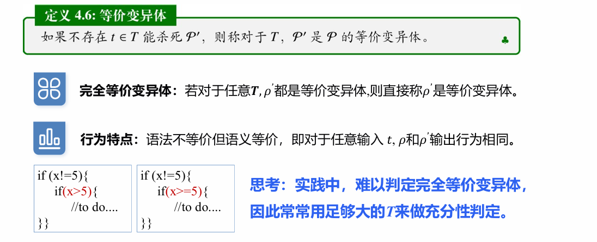

**变异算子**

- 符合程序语法规则的前提下，**变异算子定义了生成变异体的变异规则**

➢ <u>值变异</u>：改变参数或参数的值。例如，原程序𝑥=5，变异程序为𝑥=10。 

➢ <u>语句变异</u>：增加、删除、替换语句，或更改语句顺序。例如，原程序`𝑡𝑜𝑡𝑎𝑙=𝑥−𝑦`，变异程序为`𝑡𝑜𝑡𝑎𝑙=𝑥+𝑦`。 

➢ <u>决策变异</u>：变逻辑或算术运算符。例如，原程序`𝑖𝑓(𝑥>𝑦)`，变异程序为`𝑖𝑓(𝑥<𝑦)`。

**弱杀死与强杀死**

- 弱杀死：变异体的**中间状态**与原程序不同。与之对应的称之为弱变异分析。
- 强杀死：变异体的**输出结果**与原程序不同。与之对应的称之为强变异分析，也就是传 统意义的变异分析。

## 6.4 变异测试优化技术

变异测试的挑战：大量变异体带来高昂成本。

三种优化思路：

1. **变异算子选择**：从经验上相似的变异算子中选择代表性的变异算子。
2. **变异体随机选择**：从经验上相似的变异体进行均匀随机抽样得到样本。
3. **变异体聚类抽样**：对变异体进行聚类分析然后进行随机抽样得到样本。

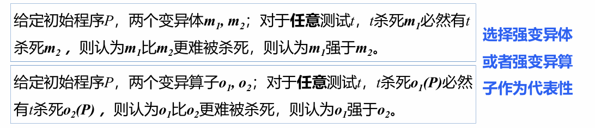

## 6.5 逻辑测试基础

逻辑故障假设是一种特殊的故障假设，属于变异故障假设的一种。

软件逻辑故障是指在程序代码中存在的**逻辑错误或不当的设计**，导致程序无法按照预期执行或出现异常行为。

**谓词逻辑**：包含个体词、谓词、量词以及逻辑运算符。

**布尔逻辑**：主要由布尔变量（取值为真或假）和逻辑运算符。

- AND：用”.”表示(可省略)
- OR：用”+”表示
- NOT：用上划线或￢表示

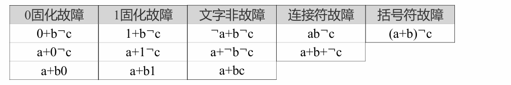

给定正确逻辑表达式 s 和带某种逻辑故障的表达式 m，
 如果存在两个测试向量 t 和 t′：

- 在 t 和 t′ 上，正确逻辑与故障逻辑的输出完全一致；
- 且 t 与 t′ 只在一个输入变量上取值不同；

那么，这对 (t,t′) 被称为一个**逻辑测试条件**，而 t 与 t′ 之间发生变化的那个输入变量，称为**逻辑测试点**。

# 7. 开发者测试

## 7.1 单元测试

单元测试构成了所有其他测试构建的基础。是一种针对应用程序代码分解为组件的测试技术，验证每个块或单元的相关数据、使用过程和功能，以确保每个块按预期工作。单元测试的准确性和彻底性是影响其他测试 的执行情况以及软件整体性能的重要因素。

其目的是检测判断**每个程序模块**的行为是否与期望一致。

**单元测试 3A 原则**：Arrange ( 准备 )、Act ( 执行 )、Assert ( 断言 )

**依赖隔离技术**：模拟（ Mock ）和存根（ Stub ）

- 模拟(Mock): **使用虚假业务逻辑的模拟对象代替真实对象**，隔离外部依赖，方便测试代码的独立验证
- 存根 (Stub):  **使用预先确定的行为代替真实行为**，实现抽象类或接口，通常用于客户端期望相同响应的场景。

**自动化单元测试**：指使用自动化测试工具或框架来执行单元测试的过程。它将测试代码的执行和结果验证自动化，无需人工干预。

**简单化单元测试**：单元测试代码也可能存在错误，尤其是在复杂性较高的情况下。应该为每个测试方法设置独立的断言，以方便后期单元测试的分析与故障诊断。

**高质量单元测试**：当待测应用程序设计用于处理金融交易，则测试数据应包括实际交易金额、日期和客户信息。开发者还应该测试边界条件，例如输入变量的最小值和最大值。通过测试正面和负面场景，可以确保代码稳健并且可以处理意外情况。

## 7.2 接口测试

接口测试是指针对软件系统中的接口进行的测试，以验证接口是否能够按照预期进行通信和数据交换。

**API测试常见任务**：

- 功能测试：验证 API 的功能是否符合预期，并针对不同的输入值返回正确的响应。
- 错误处理和输入验证：测试 API  是否能够正确处理错误情况和非法输入。
- 安全测试： 测试 API 是否存在安全漏洞，例如 SQL 注入、 XSS 攻击等。
- 性能测试： 评估 API 的性能指标，例如响应时间、吞吐量、并发处理能力等。
- 兼容性测试：验证 API 是否兼容不同的平台和操作系统
- 可扩展性测试：评估 API 的可扩展性，确保系统能够处理大量请求。

**API 覆盖率分析**：是评估测试效果的一种重要方法，它关注的是在测试过程中 API 的调用是否全面，是否所有的 API 都被充分的测试到。覆盖率高意味着测试的全面性和有效性更高，可能出现的问题被发现和解决的概率也更大。

**持续集成**：持续集成（ CI ）是一种软件开发实践，通过**频繁合并代码到主分支来尽早发现和修复集成错误**，提高软件质量。在 CI 流程中，接口测试是关键步骤之一，每次代码提交都会触发构建和测试过程。如果任何步骤失败，CI 系统会立即通知开发人员，以便在早期阶段解决问题，提高开发效率。

## 7.3 集成测试

集成测试是单元测试的延伸，用于**验证软件组件集成后的功能**。它确保组件间协作正常，并发现集成过程中出现的缺陷。集成测试旨在验证软件组件的协同工作能力，并检测系统功能性和性能问题。

- **规格问题**： 模块集成时可能因数据类型、单位等不一致导致规格问题。

- **接口缺陷**： 单元测试关注模块内部具体实现，往往会忽略模块间接口调用相关缺陷。

- **数据丢失**： 各个模块需要协同工作，按照一致的节奏发送、接收、处理数据，否则会导致数据阻塞、丢失等。

- **并发问题**： 并发程序在集成测试时易因模块运行次序不当出现同步错误、死锁等问题。

集成测试前应确保所有模块通过单元测试，以避免在集成测试中混淆模块内部和模块间交互的错误，影响测试效果并增加修复成本

**并行单元测试**：在软件开发中，集成测试在单元测试之后进行，但由于单元测试可能耗时较长，可以采取并行方式，<u>对已完成单元测试的模块先进行集成测试</u>。这种模式适用于瀑布开发环境。而在敏捷开发中，<u>每次代码提交都会触发构建和集成测试</u>。

**一次性集成**：一次性集成是指所有程序模块完成单元测试后，直接组装进行整体测试的过程。一次性集成减少了集成次 数和测试工作量，无需驱动和测试桩模块，但缺点是延长了测试和错误发现时间，且难以定位缺陷和并行测试。适用于小型、结构良好、修改少或基于可信赖构件的软件系统。

**增量式集成**：增量式集成是逐步将程序模块组装测试的过程，与一次性集成相比，它能更早、更充分地发现错误并定位缺陷，但时间和工作量更大，需要编写驱动和测试桩模块。适用于大规模、复杂、并发及采用增量或框架开发的软件系统。在实践中，增量式集成比一次性集成更常见，包括**自顶向下**和**自底向上**两种典型方法。

- 自顶向下集成是指依据程序结构图，从顶层开始由上到下逐步增加集成模块到集成测试的过程。在集成路径的选择上，还可选择广度优先和深度优先方法来添加测试模块。
- 自底向上集成是一种集成测试方法，它从软件结构图的底层开始，逐步向上增加模块进行集成测试。

> ```
>         A   ← 顶层控制模块
>       /   \
>      B     C
>     / \     \
>    D   E     F   ← 底层功能模块
> ```
>
> 自顶向下集成（Top-Down）：
>
> ```
> A
> A + B
> A + B + C
> A + B + C + D + E + F
> ```
>
> 未完成的下层模块用“桩模块（Stub）”代替
>
> 自底向上集成（Bottom-Up）：
>
> ```
> D + E
> F
> B + (D + E)
> C + F
> A + B + C
> ```
>
> 未完成的上层模块用“驱动模块（Driver）”代替

**三明治式集成**：三明治集成结合了自顶向下和自底向上集成，从软件结构图的中间层开始，同时向上和向下扩展。这种方 法允许并行测试，更早发现和修复错误，减少对测试桩模块的需求，特别适用于具有清晰中间层的大型复杂系统。

**基于调用图的集成**：基于调用图的集成就是一种用于减少驱动模块和测试桩模块的集成策略。在基于调用图的集成策略中，需预先构建程序调用图，识别各个模块间的程序调用关系。基于调用图的集成策略主要包括**成对集成**和**相邻集成**两类。 

- 成对集成是指把程序调用图中的节点对放在一起进行测试，也可理解为以程序调用图中的边为单位为单位进行测试。

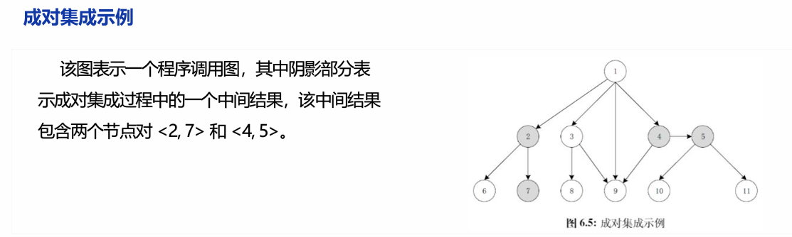

- 相邻集成是指以程序调用图的某个节点为中心，将所有调用该节点的上层节点和所有被该节点调用的下层节点放在一起进行测试。

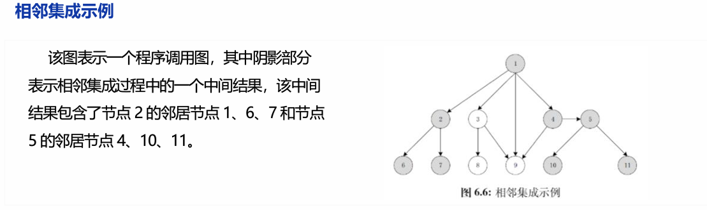

## 7.4 多样性开发者测试

多样性测试，也称为**变异测试**，是一种用于评估测试集质量的方法。它通过修改源代码生成变异体，然后运行测试集，观察测试集是否能够检测到变异体中的缺陷

代码多样性也就是常说的**代码覆盖测试**，通过遍历程序的逻辑结构，评估测试用例对代码的覆盖程度。它要求测试满足特定的覆盖标准，如语句覆盖 、 分支覆盖等 。

随机测试是一种简单易行的代码多样性策略，通过随机生成符合输入域的测试数据来评估程序的行为。它适用于各种数据类型，但通常难以达到高覆盖率，因为其与程序逻辑结构无关。

路径分析、符号执行和约束求解的组合策略：选择特定的执行路径，并通过符号执行探索程序的不同分支，再利用约束求解器生成满足路径 约束条件的输入数据，可以更有效地覆盖程序代码，发现潜在缺陷和漏洞。

## 7.5 故障假设开发者测试

故障假设是开发者测试中的一种重要方法，帮助识别应用程序中的问题和漏洞。开发者根据应用程序的特点和使用情况，提出可能的故障假设，如程序崩溃或逻辑错误，并设计测试来验证这些假设。这种方法可以与其他测试方法（如路径分析和代码可达性）结合使用，以更全面地理解应用程序的行为，提高测试效率。

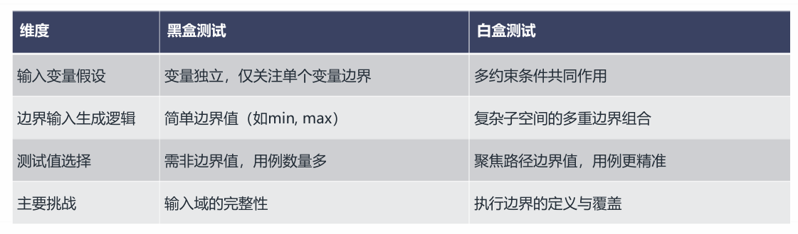

# 8. 功能测试

功能测试是一种验证软件或应用程序是否按预期工作的方法，**关注结果是否正确而非内部处理过程**。通过为每个功能提供适当的输入，并验证输出是否符合预定义要求，确保系统功能特性满足最终用户的需求。为了评估测试的完整性，功能测试使用功能需求点覆盖率，通过分析已执行的测试来确保所有需求被覆盖。

**流程：确定功能需求 设计测试用例 执行测试与验证**

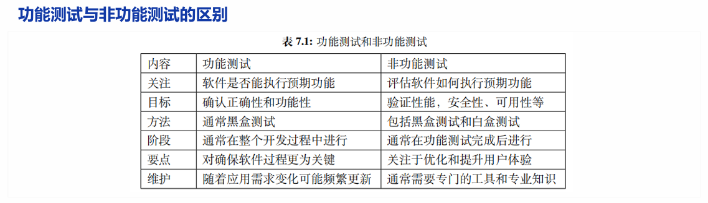

## 8.1 多样性功能测试

**等价类划分**：将输入域划分为有效与无效两个子集

**因果图**：因果图是一种系统化的测试设计技术，通过分析程序输入（原因）与输出（效果）之间的逻辑关系，帮助选择高效的测试集。

在因果图分析中，输入（原因）与输出（效果）之间的逻辑关系可以分为四种基本类型：恒等关系（ EQ ）、 逻辑非（ NOT ） 、 逻辑或（ OR ） 和 逻辑与（ AND ）。

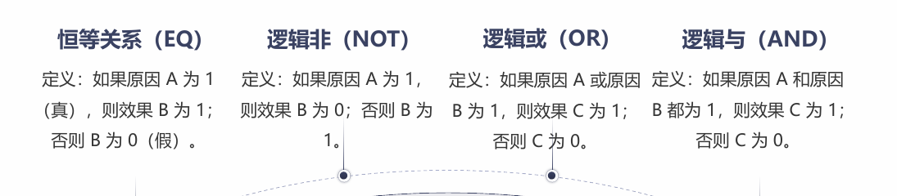

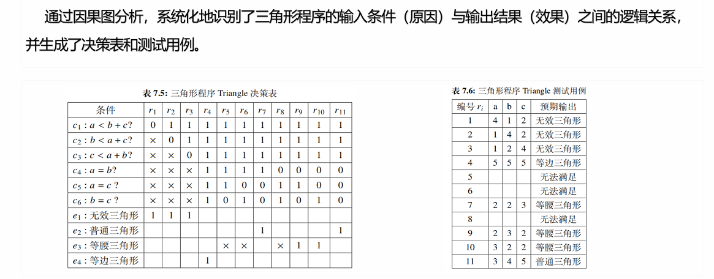

**类别划分（Category-Partition, CP）**：类别划分测试方法是一种系统化的功能测试技术，通过识别参数和环境变量，将其划分为类别，并为每个类别生成选项，最终组合成测试框架。


## 8.2 故障假设功能测试

