# 1. 基本概念

## 测试用例tc = 输入t + 预言o + 环境e

测试用例简称测试，一个测试用例*tc*是一个三元组<*t,o,e*>

**输入t**：构造输入

**测试预言o**：对于一个输入，我期望什么输出？

- 可以通过构建或直接采集数据的方式获得预言

**环境e**：可能存在的外界扰动（汽车行驶时的震动或是太空中的电磁波对于GPU计算的影响）

- 工程化

## 什么是测试

测试是通过设计实验性操作，观察目标对象的行为或输出，以发现缺陷、验证功能或评估性能的方法。其核心目的是：**发现缺验证功能或非功能属性**。

- **发现Bug**是**软件测试**的重要目的之一

**动态测试和静态测试**

- 主要关注动态测试，就是软件运行时的测试
- 静态成本低、速度快，但很容易误报，一般是类似于扫描代码发现问题的过程
- 动态成本高，但几乎不会误报（只要输出有问题，就一定存在某种Bug）
- 动态和静态结合，用动态的结果减少静态的误报，利用静态的结果有针对性的进行动态测试

## 测试报告与缺陷报告

测试报告通常以文本和图像形式进行存储和管理，简单的可以用excel

测试报告至少包含四部分<*θ,t,0,d*>

- θ是测试环境，通常是硬件和软件配置等
- t是测试输入，通常是输入数据和步骤
- o是测试输出，通常是输出截图或视频
- d是结果描述，通常是用于理解错误的信息

## 待测软件/待测程序/待测系统

待测软件是软件开发流程中用于测试的软件测试，包括待测程序P及相关文档，是软件质量保障的关键环节

**待测程序P（包括源代码、字节码、二进制）的通常形式化定义为元素集合**

> P是一个有序元素集合{$u_1,u_2,...,u_n$}，不同软件制品下，元素$u_i$被赋予不同含义

## 测试分类

**源代码依赖度**

- 白盒测试
- 灰盒测试
- 黑盒测试

**软件开发流程**

- 单元测试
- 集成测试
- 系统测试
- 验收测试

**软件质量属性**

- 功能测试
- 性能测试
- 安全测试
- 兼容性测试
- 易用性测试

# 2. 测试框架

### SPT

**软件工程的三大问题**

- S问题：文档生成
- P问题：代码生成
- T问题：测试生成

## 测试预言的性质

正确性

完备性

完美性

## 软件测试方法

# 实验一：Selenium测试基础

Selenium是一个自动化测试工具，用于测试web应用程序功能和用户界面，它可以模拟用户在浏览器里的操作，验证页面元素的状态和属性。

## 八大元素定位

**基于基本元素的定位**

```java
driver.findElement(By.id(""))
driver.findElement(By.name(""))
driver.findElement(By.cssSelector(""))
driver.findElement(By.className(""))
driver.findElement(By.tagName(""))
```

**cssSelector元素定位**

- ID选择器，以#开始，然后接着id值
- 类选择器，以.开始
- 标签选择，以标签名

```java
driver.findElement(By.cssSelector(""));
// 1）id选择器定位
 driver.findElement(By.cssSelector("#kw"))
// 2)   类选择器
driver.findElement(By.cssSelector(".s_ipt"))
// 3)   标签选择器
driver.findElement(By.cssSelector("input")) // 查找的是第一个<input>标签
```

**link_text元素定位**

```java
driver.findElement(By.linkText("地图")) // 通过完整的链接文本来定位元素
driver.findElement(By.partialLinkText("更")) // 通过部分的链接文本来定位元素
```

**xpath元素定位**

```java
driver.findElement(By.xpath(""))
```

```java
// 1) 绝对路径定位
// 语法:/html/body/div/div[2]/div[5]/div[1]/div/form/span[2]/input
// 说明:使用”/”从根元素开始一级一级向下定位，路径中使用元素的标签名和索引，不建议使用
driver.findElement(By.xpath("/html/body/div/div[2]/div[5]/div[1]/div/form/span[2]/input"));

// 2) 相对路径定位
// 语法://input[@name='wd']
// 说明:使用”//”从任意位置开始查找,[@attribute='value']用于筛选具有指定属性值的元素
driver.findElement(By.xpath("//input[@name='wd']"));

// 3) 通过文本内容定位
// 语法://*[text()='关于百度']
// 说明:使用text函数定位包含指定文本的元素
driver.findElement(By.xpath("//*[text()='关于百度']"));

// 4) 通过部分文本内容定位
// 语法://*[contains(text(),'京ICP证')]
// 说明:使用contains()函数定位包含部分文本内容的元素
driver.findElement(By.xpath("//*[contains(text(),'京ICP证')]"));

// 5) 通过元素属性定位
// 语法:[@attribute='value']
// 说明:使用[@attribute=’value’]来定位具有指定属性的元素
driver.findElement(By.xpath("//*[@value='百度一下']"));

// 6) 使用逻辑运算符
// 语法://input[@name='wd' and @class='s_ipt' and @autocomplete='off']
// 说明:使用and、or等逻辑运算符结合多个条件进行定位
driver.findElement(By.xpath("//input[@name='wd' and @class='s_ipt' and @autocomplete='off']"));

// 7) 使用函数
// 语法://input[contains(@id,"kw")]
// 说明:使用contains()函数定位包含部分文本内容的元素
driver.findElement(By.xpath("//*[contains(@id,'kw')]"))
```

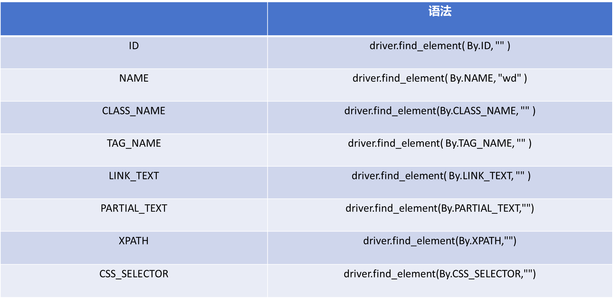

## Webdriver常用方法

### 导航方法

用于控制浏览器的导航行为

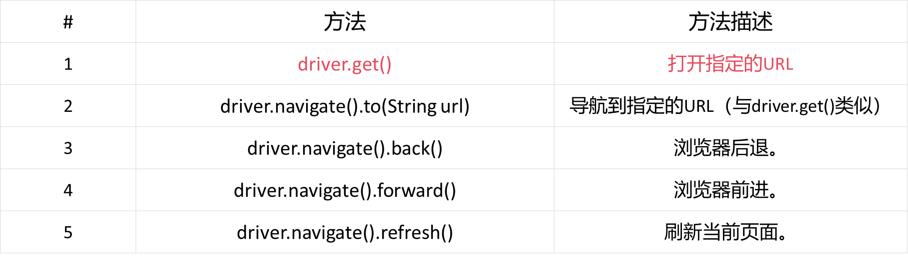

### 元素操作

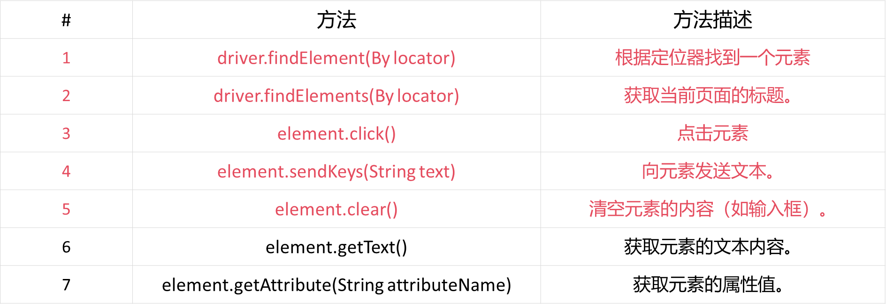

### 窗口和标签页操作

用于控制浏览器窗口和标签页

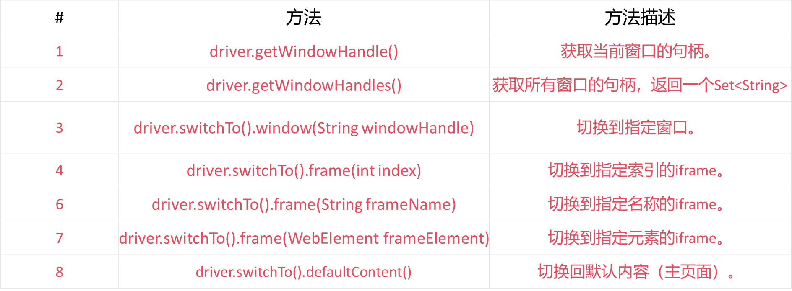

### 获取页面信息

用于获取当前页面的信息


### 关闭和退出

用于关闭浏览器和结束会话

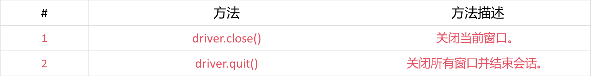

### 浏览器管理

用于管理浏览器设置

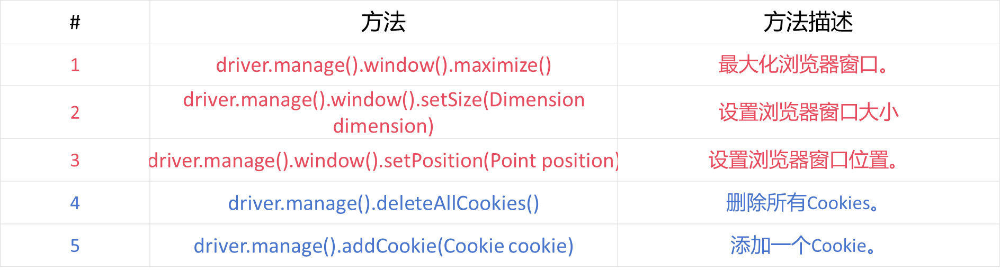

### 执行JavaScript

用于执行JavaScript代码

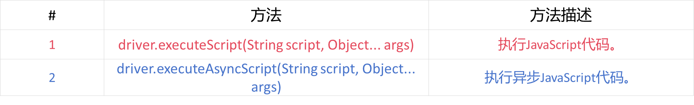

## 三大元素等待

### 固定等待（Sleep）

固定等待是通过 Thread.sleep() 方法强制等待一段时间

优点:实现简单，适用于临时调试

```java
try {
	//打开一个网页
	driver.get("https://example.com");
	//固定等待5s
	Thread.sleep(5000);
	//查找元素
	WebElement element=driver.findElement(By.id("myElement"));
	//操作元素
	element.click();
}catch(InterruptedException e){
	e.printStackTrace();
}finally{
	//关闭浏览器
	driver.quit();
}
```

### 隐式等待（Implicit Waits)

隐式等待是为 WebDriver 设置一个全局的超时时间，在此时间内，如果目标元素未出现，WebDriver 会定期轮询检查该元素是否存在。

```java
try {
	//打开一个网页
	driver.get("https://example.com");
	//固定等待5s
	driver.manage().timeouts().implicitlyWait(Duration.ofSeconds(10));
	//查找元素
	WebElement element=driver.findElement(By.id("myElement"));
	//操作元素
	element.click();
}catch(InterruptedException e){
	e.printStackTrace();
}finally{
	//关闭浏览器
	driver.quit();
}
```

### 显式等待（Explicit Waits）

显式等待是指代码会等待某个特定条件发生后再继续执行。显式等待需要配合 WebDriverWait 和 ExpectedConditions 一起使用。

```java
try {
	//打开一个网页
	driver.get("https://www.baidu.com");
	//设置显示等待
	WebDriverWait wait =new WebDriverWait(driver,Duration.ofSeconds(10));// 最长等待10秒
	WebElement element=wait.until(ExpectedConditions.visibilityOfElementLocated(By.linkText("贴吧")));
	//操作元素
	element.click();
}catch(InterruptedException e){
	e.printStackTrace();
}finally{
	//关闭浏览器
	driver.quit();
}
```

## 下拉框（Select）

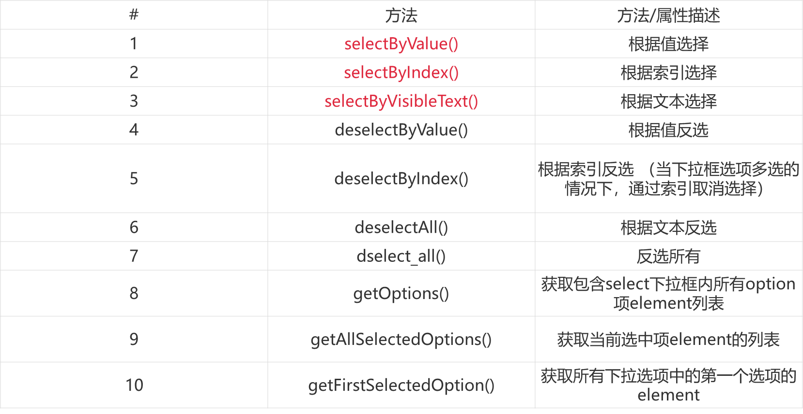

## Alert、Prompt、Confirm弹出框

1. 获取弹出框文本：使用text属性可以获取弹出框中显示的文本信息。

```java
String alertText = driver.switchTo().alert().getText();
System.out.println("Alert text: "+alertText);
```

2. 接受弹出框文本：使用accept()方法可以点击弹出框中的“确定”按钮。

```java
driver.switchTo().alert().accept();
```

3. 拒绝弹出框文本：使用dismiss()方法可以点击弹出框中的“取消”按钮。

```java
driver.switchTo().alert().dismiss();
```

4. 向Prompt弹出框输入文本：使用sendKeys(String keys)方法可以向Prompt类型的弹出框中输入文本。

```java
driver.switchTo().alert().sendKeys("Test input");    
driver.switchTo().alert().accept();
```

## 模拟鼠标键盘一系列操作

### 鼠标操作

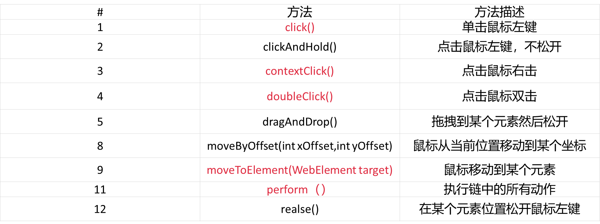

### 键盘操作


### 窗口句柄切换

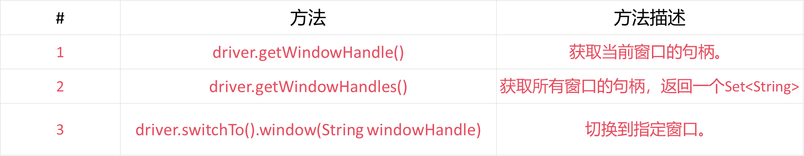

### Iframe切换

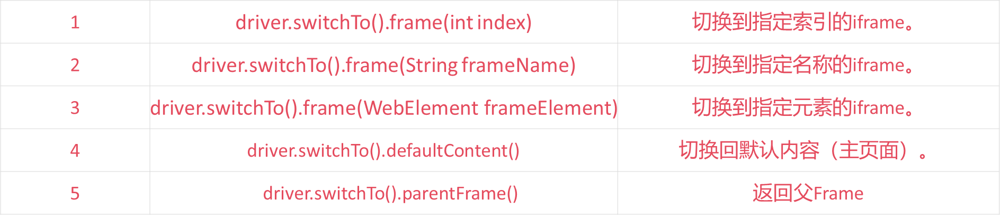

### 屏幕截图

Selenium 截图功能概述

Selenium WebDriver 提供了 TakesScreenshot 接口，用于获取当前页面的屏幕截图。通过 getScreenshotAs 方法，可以将截图保存为文件、二进制数据或 Base64 编码字符串。

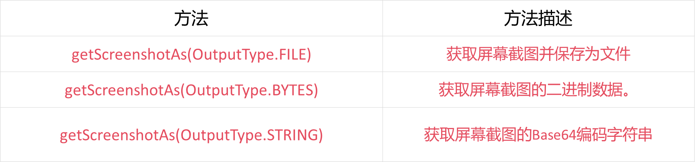


# 3. PIE模型

 

Fault，Error，Failure

```python
def mul(a,b):
	c = a + b;
    return c > 0 ? true:false
	
def test1():
	expected = true
	actual = mul(2, 2)
	assert actual == expected // 存在Fault，但是没有Error的中间状态
	
def test2():
	expected = true
	actual = mul(2,3)
	assert actual == expected // 存在Error，但是没有反映到系统边界
	
def test3():
	expected = true
	actual = mul(-2,-3)
	assert actual == expected // 存在Failure
```

相长干涉，相消干涉

```python
def P(a, b):
    x = a
    y = b
    if x + y = 6:
        return true
    return false
    
def P1(a, b):
    x = a
    y = b
    if x + y = 6:
        return true
    return false

def P2(a, b):
    x = a
    y = b
    if x + y = 6:
        return true
    return false

def P3(a, b):
    x = a
    y = b
    if x + y = 6:
        return true
    return false

def T1():
    expected = 6
    print("P :", P(2, 3))   # 正确 6
    print("P1:", P1(2, 3))  # 错误 5
    print("P2:", P2(2, 3))  # 错误 -1
    print("P3:", P3(2, 3))  # (2+3) - (2-3) = 5 - (-1) = 6 ✅ 恢复正确

def T2():
    expected = 12
    print("P :", P(3, 4))   # 正确 12
    print("P1:", P1(3, 4))  # 错误 7
    print("P2:", P2(3, 4))  # 错误 -1
    print("P3:", P3(3, 4))  # (3+4) - (3-4) = 7 - (-1) = 8 ❌ 错的更离谱

```


