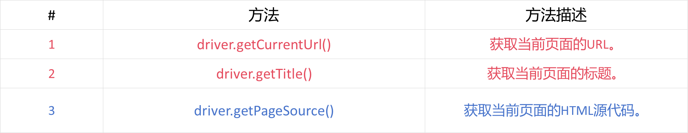

# 1. 基本概念

## 1.1 测试用例tc = 输入t + 预言o + 环境θ

测试用例简称测试，一个测试用例*tc*是一个三元组<*t,o,θ*>

**输入t**：测试数据或测试输入

**测试预言o**：对于一个输入，我期望什么输出？

- 可以通过构建或直接采集数据的方式获得预言

**环境θ**：可能存在的外界扰动（汽车行驶时的震动或是太空中的电磁波对于GPU计算的影响）

- 工程化

## 1.2 什么是测试

测试是通过设计实验性操作，观察目标对象的行为或输出，以发现缺陷、验证功能或评估性能的方法。其核心目的是：**发现缺验证功能或非功能属性**。

- **发现Bug**是**软件测试**的重要目的之一

**动态测试和静态测试**

- 主要关注动态测试，就是软件运行时的测试
- 静态成本低、速度快，但很容易误报，一般是类似于扫描代码发现问题的过程
- 动态成本高，但几乎不会误报（只要输出有问题，就一定存在某种Bug）
- 动态和静态结合，用动态的结果减少静态的误报，利用静态的结果有针对性的进行动态测试

## 1.3 测试报告与缺陷报告

测试报告通常以文本和图像形式进行存储和管理，简单的可以用excel

测试报告至少包含四部分<*θ,t,0,d*>

- θ是测试环境，通常是硬件和软件配置等
- t是测试输入，通常是输入数据和步骤
- o是测试输出，通常是输出截图或视频
- d是结果描述，通常是用于理解错误的信息

## 1.4 待测软件/待测程序/待测系统

待测软件是软件开发流程中用于测试的软件测试，包括待测程序P及相关文档，是软件质量保障的关键环节

**待测程序P（包括源代码、字节码、二进制）的通常形式化定义为元素集合**

> P是一个有序元素集合{$u_1,u_2,...,u_n$}，不同软件制品下，元素$u_i$被赋予不同含义

## 1.5 测试分类


### 1.5.1 源代码信息依赖程度

#### 1.5.1.1 白盒测试

白盒测试依赖源代码信息，主要目的是测试应用程序内部的结构和运行情况。

白盒测试从程序内部角度出发进行测试用例设计，通过**程序路径覆盖**特别目标发现程序中潜在缺陷。

测试人员需要理解待测试程序的内部结构 ， 这种程序理解的先决性往往使得白盒测试**成本高昂**。

#### 1.5.1.2 黑盒测试

黑盒测试更强调从用户的角度出发，针对软件的界面、功能及外部结构进行测试，通常不考虑程序内部逻辑结构。

黑盒测试通常由测试人员根据软件规范、软件规格说明或设计文档设计而成 。

黑盒测试可用于多功能测试、性能测试、兼容性测试等，具有应用范围广泛、测试效率卓越、测试覆盖全面的优点 。

#### 1.5.1.3 灰盒测试

灰盒测试是一种介于白盒和黑盒之间的方法。相对于黑盒，灰盒测试更加注重程序的内部逻辑，但源代码信息不像白盒那样详尽。

灰盒测试通过一些表征性的现象或事件来反映内部运行状态。灰盒测试使用特定方法和工具来提取应用程序的内部知识和交互信息，进而使用内部间接信息来设计测试，以提高测试效率 。


### 1.5.2 软件开发流程

#### 1.5.2.1 单元测试

单元测试是针对软件中最小可测试单元进行验证的技术。单元是指软件中最小可测试部分。一个单元可以是独立的函数和过程。

测试人员通常会使用测试框架、驱动程序、模拟对象等方式辅助完成单元测试。单元测试的基本原则是保证测试用例之间相互独立。

单元测试一般由软件的开发人员来实施，目的是检验所开发的代码功能是否符合开发者自己规定的设计要求。

#### 1.5.2.2 集成测试

集成测试将在所有的软件单元按照概要设计规格说明要求组装成模块、子系统或系统，确保各个单元部分之间的协作良好。

在集成测试之前,应该先完成单元测试。集成测试将已经测试的多个单元组装成一个局部整体进行测试。这种测试用来集成测试的目的是确认在不同单元模块之间的交互中没有出现问题。

#### 1.5.2.3 系统测试

系统测试是针对整个系统的测试，它将与系统相关的硬件与软件看作一个整体，检验系统是否符合预期。

系统测试的关注重点包括待测系统本身的使用，待测系统与相关系统间的连通，以及待测系统在真实使用环境下的表现等。

系统测试则侧重整个系统的功能验证，更加靠近业务端。除了功能测试，系统测试还包括性能测试、安全测试、兼容性测试、稳定性测试等。

#### 1.5.2.4 验收测试

验收测试也称交付测试，是针对用户需求和业务流程的测试，其目的是验证系统是否满足验收标准，并由用户或其他授权机构决定是否接受该系统。

验收测试可以分成内部验收测试和外部验收测试。内部和外部验收测试的区别主要在于测试的执行者不同。测试执行者可以是软件开发团队中软件开发和软测试活动的非直接参与者，也可以是软件的最终用户和潜在用户扮演者，在某些情况下可采取众包方式来实现。

# 2. 测试框架

## 2.1 SPT

**软件工程的三大问题**

- S问题：文档生成
- P问题：代码生成
- T问题：测试生成


**举例：三角形程序**：


## 2.2 测试分析框架


## 2.3 测试预言的性质

正确性：如果测试预言𝑂(𝑃, 𝑆, 𝑡) 成立，则程序P在测试t上确实执行正确𝑐𝑜𝑟𝑟(𝑃, 𝑆, 𝑡)。

完备性：如果程序P在测试t上执行正确𝑐𝑜𝑟𝑟(𝑃, 𝑆, 𝑡)，则测试预言𝑂(𝑃, 𝑆, 𝑡) 成立。

完美性：测试预言同时满足正确性和完备性，即𝑐𝑜𝑟𝑟(𝑃, 𝑆, 𝑡)⇔𝑂(𝑃, 𝑆, 𝑡)。

> **测试集T的局限性**：实际难以穷尽所有可能的测试集T，因此测试预言的完美性难以实现。 
>
> **测试预言过于精确**：可能导致程序实际正确但测试预言不通过（例如计算精度问题）。 
>
> 在软件工程中，如何平衡测试预言的正确性和完备性是一个复杂问题。

## 2.4 软件测试方法

### 2.4.1 软件测试

测试方法 𝑀 是一个函数：$𝑀:P×S→T$，表示基于被测程序 P 和规范 S 生成测试用例$t∈T$。生成测试集T 的测试方法：
$$
M:P×S→2^T
$$
$T_𝐶⊆P×S×2^T$表示测试准则$𝑇_𝐶$与待测程序P、规范S和测试集T的关系。
$$
C(P × S ) → 2^T
$$
$(P × S × 2^𝑇) = r,   r∈ [0, 1] $

### 2.4.2 测试预言与测试准则

$$
O_C \subseteq P × S × T_O
$$

表示测试预言$O_𝐶$与待测程序P、规范S和测试输出$T_O$的关系。

测试充分性可扩充定义为测试集和测试预言的配对充分性，即
$$
T_C \subseteq P × S × 2^T × T_O
$$

### 2.4.3 测试准则蕴含


- 偏序关系，但不是全序关系
- 经验关系，但不是理论关系

### 2.4.4 测试预言的包含关系


# 实验一：Selenium测试基础

Selenium是一个自动化测试工具，用于测试web应用程序功能和用户界面，它可以模拟用户在浏览器里的操作，验证页面元素的状态和属性。

## 八大元素定位

**基于基本元素的定位**

```java
driver.findElement(By.id(""))
driver.findElement(By.name(""))
driver.findElement(By.cssSelector(""))
driver.findElement(By.className(""))
driver.findElement(By.tagName(""))
```

**cssSelector元素定位**

- ID选择器，以#开始，然后接着id值
- 类选择器，以.开始
- 标签选择，以标签名

```java
driver.findElement(By.cssSelector(""));
// 1）id选择器定位
 driver.findElement(By.cssSelector("#kw"))
// 2)   类选择器
driver.findElement(By.cssSelector(".s_ipt"))
// 3)   标签选择器
driver.findElement(By.cssSelector("input")) // 查找的是第一个<input>标签
```

**link_text元素定位**

```java
driver.findElement(By.linkText("地图")) // 通过完整的链接文本来定位元素
driver.findElement(By.partialLinkText("更")) // 通过部分的链接文本来定位元素
```

**xpath元素定位**

```java
driver.findElement(By.xpath(""))
```

```java
// 1) 绝对路径定位
// 语法:/html/body/div/div[2]/div[5]/div[1]/div/form/span[2]/input
// 说明:使用”/”从根元素开始一级一级向下定位，路径中使用元素的标签名和索引，不建议使用
driver.findElement(By.xpath("/html/body/div/div[2]/div[5]/div[1]/div/form/span[2]/input"));

// 2) 相对路径定位
// 语法://input[@name='wd']
// 说明:使用”//”从任意位置开始查找,[@attribute='value']用于筛选具有指定属性值的元素
driver.findElement(By.xpath("//input[@name='wd']"));

// 3) 通过文本内容定位
// 语法://*[text()='关于百度']
// 说明:使用text函数定位包含指定文本的元素
driver.findElement(By.xpath("//*[text()='关于百度']"));

// 4) 通过部分文本内容定位
// 语法://*[contains(text(),'京ICP证')]
// 说明:使用contains()函数定位包含部分文本内容的元素
driver.findElement(By.xpath("//*[contains(text(),'京ICP证')]"));

// 5) 通过元素属性定位
// 语法:[@attribute='value']
// 说明:使用[@attribute=’value’]来定位具有指定属性的元素
driver.findElement(By.xpath("//*[@value='百度一下']"));

// 6) 使用逻辑运算符
// 语法://input[@name='wd' and @class='s_ipt' and @autocomplete='off']
// 说明:使用and、or等逻辑运算符结合多个条件进行定位
driver.findElement(By.xpath("//input[@name='wd' and @class='s_ipt' and @autocomplete='off']"));

// 7) 使用函数
// 语法://input[contains(@id,"kw")]
// 说明:使用contains()函数定位包含部分文本内容的元素
driver.findElement(By.xpath("//*[contains(@id,'kw')]"))
```


## Webdriver常用方法

### 导航方法

用于控制浏览器的导航行为


### 元素操作


### 窗口和标签页操作

用于控制浏览器窗口和标签页


### 获取页面信息

用于获取当前页面的信息



### 关闭和退出

用于关闭浏览器和结束会话


### 浏览器管理

用于管理浏览器设置


### 执行JavaScript

用于执行JavaScript代码


## 三大元素等待

### 固定等待（Sleep）

固定等待是通过 Thread.sleep() 方法强制等待一段时间

优点:实现简单，适用于临时调试

```java
try {
	//打开一个网页
	driver.get("https://example.com");
	//固定等待5s
	Thread.sleep(5000);
	//查找元素
	WebElement element=driver.findElement(By.id("myElement"));
	//操作元素
	element.click();
}catch(InterruptedException e){
	e.printStackTrace();
}finally{
	//关闭浏览器
	driver.quit();
}
```

### 隐式等待（Implicit Waits)

隐式等待是为 WebDriver 设置一个全局的超时时间，在此时间内，如果目标元素未出现，WebDriver 会定期轮询检查该元素是否存在。

```java
try {
	//打开一个网页
	driver.get("https://example.com");
	//固定等待5s
	driver.manage().timeouts().implicitlyWait(Duration.ofSeconds(10));
	//查找元素
	WebElement element=driver.findElement(By.id("myElement"));
	//操作元素
	element.click();
}catch(InterruptedException e){
	e.printStackTrace();
}finally{
	//关闭浏览器
	driver.quit();
}
```

### 显式等待（Explicit Waits）

显式等待是指代码会等待某个特定条件发生后再继续执行。显式等待需要配合 WebDriverWait 和 ExpectedConditions 一起使用。

```java
try {
	//打开一个网页
	driver.get("https://www.baidu.com");
	//设置显示等待
	WebDriverWait wait =new WebDriverWait(driver,Duration.ofSeconds(10));// 最长等待10秒
	WebElement element=wait.until(ExpectedConditions.visibilityOfElementLocated(By.linkText("贴吧")));
	//操作元素
	element.click();
}catch(InterruptedException e){
	e.printStackTrace();
}finally{
	//关闭浏览器
	driver.quit();
}
```

## 下拉框（Select）


## Alert、Prompt、Confirm弹出框

1. 获取弹出框文本：使用text属性可以获取弹出框中显示的文本信息。

```java
String alertText = driver.switchTo().alert().getText();
System.out.println("Alert text: "+alertText);
```

2. 接受弹出框文本：使用accept()方法可以点击弹出框中的“确定”按钮。

```java
driver.switchTo().alert().accept();
```

3. 拒绝弹出框文本：使用dismiss()方法可以点击弹出框中的“取消”按钮。

```java
driver.switchTo().alert().dismiss();
```

4. 向Prompt弹出框输入文本：使用sendKeys(String keys)方法可以向Prompt类型的弹出框中输入文本。

```java
driver.switchTo().alert().sendKeys("Test input");    
driver.switchTo().alert().accept();
```

## 模拟鼠标键盘一系列操作

### 鼠标操作


### 键盘操作


### 窗口句柄切换


### Iframe切换


### 屏幕截图

Selenium 截图功能概述

Selenium WebDriver 提供了 TakesScreenshot 接口，用于获取当前页面的屏幕截图。通过 getScreenshotAs 方法，可以将截图保存为文件、二进制数据或 Base64 编码字符串。


# 3. 软件Bug与PIE模型

## 3.1 PIE模型概述

1. PIE模型用于解释软件Bug的触发和传播机理。
2. **Bug的存在并不一定导致失效**，需要满足特定条件才会被软件测试人员发现。
3. PIE模型通常用于解释传统软件的Bug，但不适用深度学习等智能软件系统缺陷。

IEEE 1044-2009 标准中的定义

==Defect（缺陷）==：Defect 是指产品中不符合要求的缺陷或不足之处， 是**静态存在于程序中的问题**。 

- 例如，代码中缺少必要的功能实现部分，或存在语法错误，这都是 Defect。

==Failure（失效）==：Failure 是指产品运行未达到预期功能而终止，是**程序错误状态传播到外部被感知**的现象。 

- 例如，一个软件在执行某个功能时突然崩溃，无法继续运行，这就是 Failure。

==Fault（故障）==：Fault 用来补充解释和细分 Defect 的含义，也是程序中存在的问题，但更侧重于故障状态。 

- 例如，一个变量被错误地初始化，导致后续计算可能出现问题，这就是Fault（故障）。

==Problem（问题）==：Problem 用来解释不满意的产品输出，是用户对软件运行结果不满意的情况。

- 例如，用户期望软件输出的结果是 A，但实际输出是 B，这就是 Problem。


## 3.2 Bug的特性

### 3.2.1 Bug的反向定义

给定程序 𝑃 和测试 t，若 𝑃(𝑡) 失效，修改后得到新程序 𝑃‘，若 𝑃‘(𝑡) 通过，则确认程序修复位置的源代码 𝑃\𝑃’ 为故障。

### 3.2.2 不确定性

给定待测程序 𝑃 和测试 t， 𝑃(𝑡) 失效。若不同修复方法分别得到两个程序P1≠ P2，均使得测试t通过，即失效消失，从而确认了P\P1和P\P2为两个不同的故障。


对于任意一个程序，能够构造无穷多个跟它语义相等但语法不同的程序。 这也意味着，能够定义无穷多个Bug，这导致程序修复收敛具有很大的不确定性。

为了降低这种不确定性，需要更多的工程化方法，例如要求极小化的程序修复，即尽可能少修改程序代码。

对于任意的需求规格，理论上都存在无穷的正确程序实现版本， 这些程序版本是语法不一致的。这样的编程特性，给后期测试、确定Bug、进而调试和修复带来极大的挑战。

### 3.2.3 非单调性

单调性指函数值与自变量变化趋势一致。例如，随着自变量增大，函数值也增大。 

非单调性指函数值变化与自变量变化不一致。例如，自变量增大时，函数值可能减小，当然也可能增大。 

开发者经验增加，代码质量通常提高，这是单调性。系统复杂性与可维护性关系可能是非单调的，复杂性增加到一定程度，可维护性反而下降。


**软件的复杂性常常带来Bug的非单调性**

1. 代码层面的复杂性
   - 一个Fault可能涉及多行不连续代码，增加了修复的难度。 修复时需考虑代码间的逻辑关联，避免引入新的问题。
2. 外部引用的复杂性
   - Bug可能涉及其他函数的外部引用，修复时需考虑整体架构。外部引用的修改可能引发连锁反应，导致新的问题出现。
3. 非单调性现象
   - 在修复过程中，可能遇到 “越修越坏”的情况，失效的测试数量增加。只有完整修复程序后，测试集才能全部通过，过程充满挑战。

### 3.2.4 Bug间的干涉性

在软件开发实践中，软件通常存在多个故障 （Bug）共存的情况，而非单一故障。

多个 Bug 可能使软件的不同功能之间产生冲突， 不同 Bug 相互作用还可能引发原本单个 Bug 不会出现的新问题。

多个 Bug 同时出现时，**产生的错误信息可能会相互混淆**，使开发人员难以准确判断问题的根源，这增加了测试和调试的难度。


- 如果在同一程序中，𝑓1 和 𝑓2 同时存在时导致测试 𝑡 失效， 而单独存在 𝑓1 或 𝑓2 时测试 𝑡 通过，这种现象称为==相长干涉==。 
  - 例如，两个 Bug 分别导致数据读取错误和数据写入错误，当它们同时存在时，会导致程序完全崩溃。
- 如果包含故障 𝑓1 的程序在测试 𝑡上失效，但当添加另一个故障 𝑓2 后，测试 𝑡 不再失效，这种现象称为==相消干涉==。 
  - 例如，一个 Bug 导致程序运行缓慢，另一个 Bug 导致程序提前退出，两者同时存在时，程序反而正常运行。


Fault，Error，Failure

```python
def mul(a,b):
	c = a + b;
    return c > 0 ? true:false
	
def test1():
	expected = true
	actual = mul(2, 2)
	assert actual == expected // 存在Fault，但是没有Error的中间状态
	
def test2():
	expected = true
	actual = mul(2,3)
	assert actual == expected // 存在Error，但是没有反映到系统边界
	
def test3():
	expected = true
	actual = mul(-2,-3)
	assert actual == expected // 存在Failure
```

相长干涉，相消干涉

```python
def P(a, b):
    x = a
    y = b
    if x + y = 6:
        return true
    return false
    
def P1(a, b):
    x = a
    y = b
    if x + y = 6:
        return true
    return false

def P2(a, b):
    x = a
    y = b
    if x + y = 6:
        return true
    return false

def P3(a, b):
    x = a
    y = b
    if x + y = 6:
        return true
    return false

def T1():
    expected = 6
    print("P :", P(2, 3))   # 正确 6
    print("P1:", P1(2, 3))  # 错误 5
    print("P2:", P2(2, 3))  # 错误 -1
    print("P3:", P3(2, 3))  # (2+3) - (2-3) = 5 - (-1) = 6 ✅ 恢复正确

def T2():
    expected = 12
    print("P :", P(3, 4))   # 正确 12
    print("P1:", P1(3, 4))  # 错误 7
    print("P2:", P2(3, 4))  # 错误 -1
    print("P3:", P3(3, 4))  # (3+4) - (3-4) = 7 - (-1) = 8 ❌ 错的更离谱

```

# 4. 随机测试

## 4.1 随机测试概述

随机测试是一种最简单的多样性测试方法。**测试数据通过随机抽样生成**，通常基于概率分布生成， 也可用于模仿用户对软件的使用场景。

随机测试能够低成本生成大量的测试，以发现隐藏的缺陷。随机测试可以用于不同的测试场景， 具有很强的适用性和很高的易用 性，广泛应用于各类测试。

随机测试的缺陷检测效率瓶颈问题严重，随着测试进行，效率提升困难。后期能力提升困难，结合程序分析和其他测试方法改进 是主要研究方向。

**随机测试的定义**：针对输入空间 Ω，随机测试以**概率分布 F** 进行随机抽样获得测试集 T。 

- 默认情况下 F 是均匀分布。 
- 实际应用中通常采用**有放回抽样**以简化实现。

## 4.2 简单随机测试


## 4.3 自适应随机测试

**随机测试的局限性与改进**：随机测试效率较低，命中故障模式的概率取决于软件故障率。 因此，可利用软件失效的故障模式信息来指导随机测试。自适应随机测试是一种有效的改进方法。

**自适应随机测试(ART)**：针对输入空间 Ω，自适应随机测试以概率分布 F 进行随机抽样，并结合距离度量反馈信息筛选获得测试集 T。

**软件失效的故障模式**


**ART的设计直觉**

- 连续故障区域的存在意味着非故障区域也是连续的。
- 测试应该更均匀地分布在整个输入域。
- 远离已执行测试的新测试更有可能导致软件失效。


**ART主要步骤**

1. **初始化**：执行初始测试，收集程序行为信息(如输出、执行时间和覆盖率等)。
2. **执行测试**：将输入空间**分成若干子区域**，在每个子区域中随机选择一个初始测试。
3. **反馈控制**：根据执行结果更新输入空间，将相似测试归为同一子区域。
4. **选择测试**：<u>使用自适应策略选择距离已知故障最远的测试</u>。
5. **循环重复**：重复上述过程，直到满足测试终止条件。

> **执行集**:已执行但未显示失效的测试集合，最初为空。 
>
> **候选集**：无放回随机选择的测试集合，用于更新执行集。 
>
> **选择策略**：从候选集中选择离所有已执行测试最远的元素作为下一个测试。


**距离度量的定义与应用**

➢欧几里得距离：可衡量数据点之间的空间距离，以判断它们的相似性。 

➢曼哈顿距离：在城市规划、交通领域有应用，如计算城市中两点之间的行车距离。 

➢余弦相似度：在文本处理中，用于计算文本之间的相似度，判断文档的主题相关性。 

➢汉明距离：在信息编码、数据传输错误检测和纠正等领域应用广泛。


