# 1. 面向对象设计模式

## 1.1 前言

### 1.1.1 什么是软件设计？

**软件设计 = 需求 + 规约 + 架构 + 设计**

-  “需求”定义了系统需要满足的目标
-  “规约”定义了系统的外部可观察到的行为
-  “架构”定义了 • 系统一级的主要组成部分 • 各部分的交互方法 • 使用的技术
-  “设计”定义了 • 如何完成任务 • 需要写的代码 • 我们将专门关注OO设计

**面向对象软件设计就是将实现的约束条件应用到面向对象分析所产生的概念模型的过程**

## 1.2 概述

### 1.2.1 软件的可维护性和可复用性

一个**可维护性**(Maintainability) 较低的软件设计，通常由于如下4个原因造成： 

1. 过于僵硬(Rigidity)  
2. 过于脆弱(Fragility)  
3. 复用率低(Immobility)  
4. 黏度过高(Viscosity) 

> 当面临一个改动时，开发人员常常会发现会有多种改动的方法。其中，一些会保持设计；而另外一些会破坏设计（也就是生硬的手法） 。当那些可以保持系统设计的方法比那些生硬手法更难应用时，就表明设计具有高的粘滞性。做错误的事情是容易的，但是做正确的事情却很难。

一个好的系统设计应该具备如下三个性质： 

1. 可扩展性(Extensibility) 
2. 灵活性(Flexibility)
3. 可插入性(Pluggability)

面向对象设计复用的目标在于**实现支持可维护性的复用**。在面向对象的设计里面，可维护性复用都是以面向对象设计原则为基础的，这些设计原则首先都是复用的原则，遵循这些设计原则可以有效地提高系统的复用性，同时提高系统的可维护性。

面向对象设计原则也是对系统进行合理**重构**的指南针，重构 (Refactoring)是在不改变软件现有功能的基础上，通过调整程序代码改善软件的质量、性能，使其程序的设计模式和架构更趋合理，提高软件的扩展性和维护性。

### 1.2.2 面向对象设计原则概述

常用的面向对象设计原则包括7个，这些原则并不是孤立存在的，它们相互依赖，相互补充。

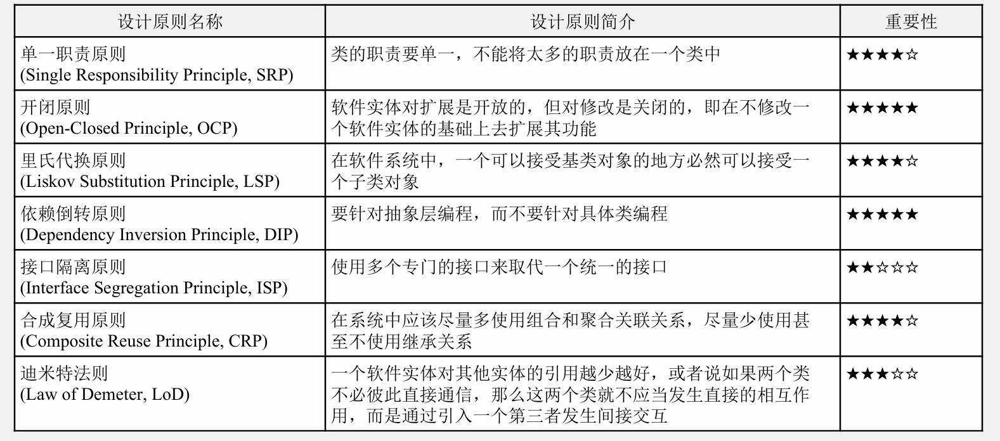

## 1.3 七个面向对象设计原则

### 1.3.1 单一职责原则

单一职责原则(Single Responsibility Principle, **SRP**)定义如下：

- 一个对象应该只包含**单一的职责**，并且该职责被完整的封装在一个类中
- （又或者是，一个类应该仅有一个引起它变化的原因）

**一个类（或者大到模块，小到方法）承担的职责越多，它被复用的可能性越小**，而且如果一个类承担的职责过多，就相当于将这些职责耦合在一起，当其中一个职责变化时，可能会影响其他职责的运作。

类的职责主要包括两个方面：**数据职责**和**行为职责**，数据职责通过其属性来体现，而行为职责通过其方法来体现。

单一职责原则是实现**高内聚、低耦合**的指导方针，在很多代码重构手法中都能找到它的存在，它是最简单但又最难运用的原则，需要设计人员发现类的不同职责并将其分离，而发现类的多重职责需要设计人员具有较强的分析设计能力和相关重构经验。

示例：用户登录

```
Login
- init():void
- display():void
- validate():void
- getConnection():Connection
- findUser(String username, String password):boolean
- main(String args[]):void
```

使用单一职责原则对其重构：

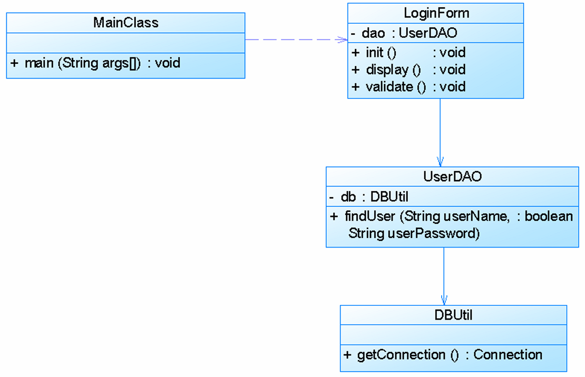

### 1.3.2 开闭原则

开闭原则(Open-Closed Principle, **OCP**)定义如下：

- 一个软件实体应该是==对扩展开放，对修改关闭==。也就是说在设计一个模块的时候，应当使这个模块在不被修改的前提下被扩展，即实现在不修改其源代码的情况下更改它的行为。

**抽象化**是开闭原则的关键。

开闭原则还可以通过一个更加具体的“对可变性封装原则”来描述，**对可变性封装原则**(Principle of  Encapsulation of Variation, EVP)要求找到系统的可变因素并将其封装起来。

示例：

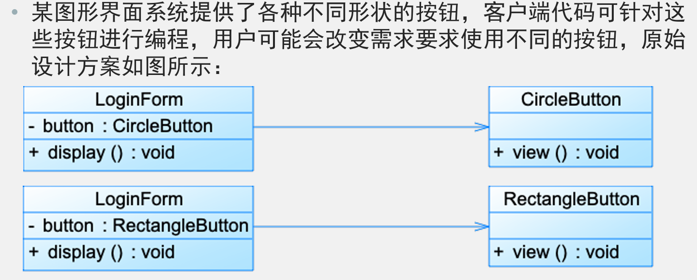

现对其进行重构：

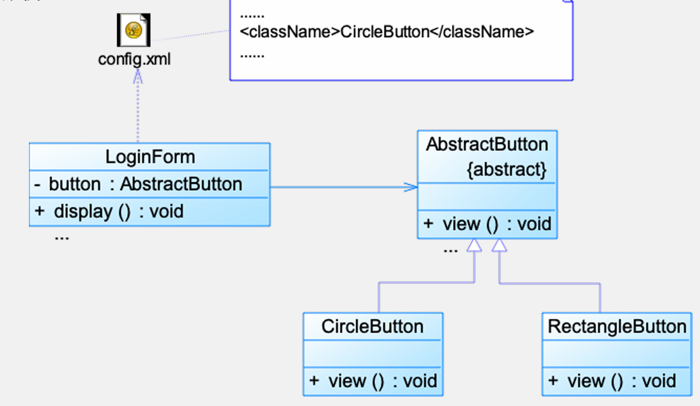

### 1.3.3 里氏代换原则

里氏代换原则(Liskov Substitution Principle, **LSP**)有两种定义方式：

- 严格定义：如果对每一个类型为S的对象o1，都有类型为T的对象o2，使得以T定义的所有程序P在所有的对象o2都替换为o1时，程序P的行为没有变化，那么类型S是类型T的子类型。
- 通俗定义：**所有引用基类（父类）的地方必须能透明地使用其子类的对象**。

里氏代换原则可以通俗表述为：在软件中如果能够使用基类对象，那么一定能够使用其子类对象。**把基类都替换成它的子类，程序将不会产生任何错误和异常**，反过来则不成立，如果一个软件实体使用的是一个子类的话，那么它不一定能够使用基类。

里氏代换原则是实现开闭原则的重要方式之一，由于使用基类对象的地方都可以使用子类对象，**因此在程序中尽量使用基类类型来对对象进行定义，而在运行时再确定其子类类型**，用子类对象来替换父类对象。

示例：

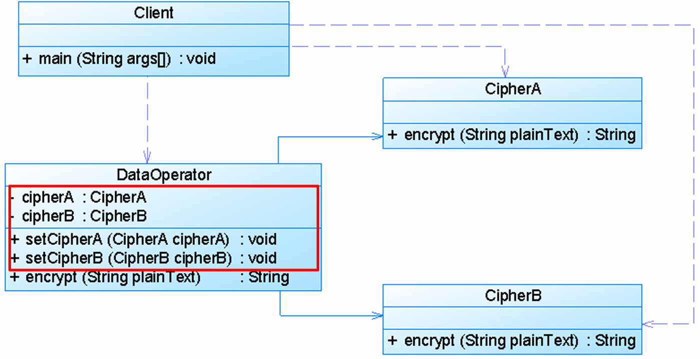

修改后：

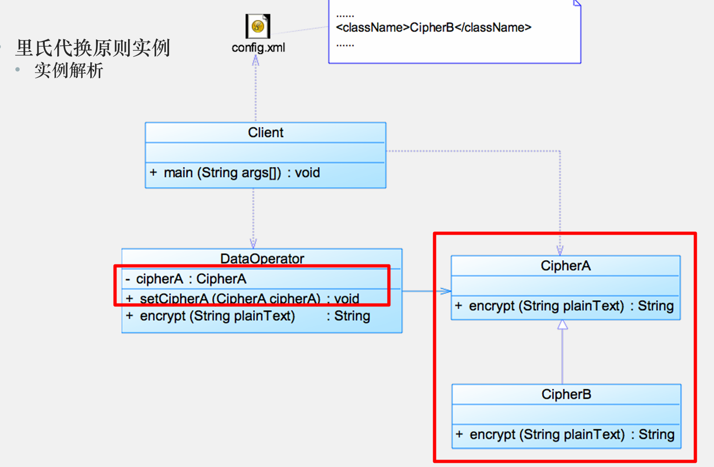

### 1.3.4 依赖倒转原则

依赖倒转原则(Dependence Inversion Principle, **DIP**)的定义如下：

- **高层模块不应该依赖低层模块**，它们都应该依赖抽象。**抽象不应该依赖于细节，细节应该依赖于抽象**。
- 要针对接口编程，不要针对实现编程。

简单来说，依赖倒转原则就是指：**代码要依赖于抽象的类，而不要依赖于具体的类；要针对接口或抽象类编程，而不是针对具体类编程。**

实现开闭原则的关键是抽象化，并且从抽象化导出具体化实现，如果说开闭原则是面向对象设计的目标的话，那么依赖倒转原则就是面向对象设计的主要手段。

依赖倒转原则的常用实现方式之一是在代码中使用抽象类，而将具体类放在配置文件中。

类之间的耦合关系：

1. 零耦合关系
2. 具体耦合关系
3. 抽象耦合关系

依赖倒转原则要求客户端依赖于**抽象耦合**，以抽象方式耦合是依赖倒转原则的关键。

示例：

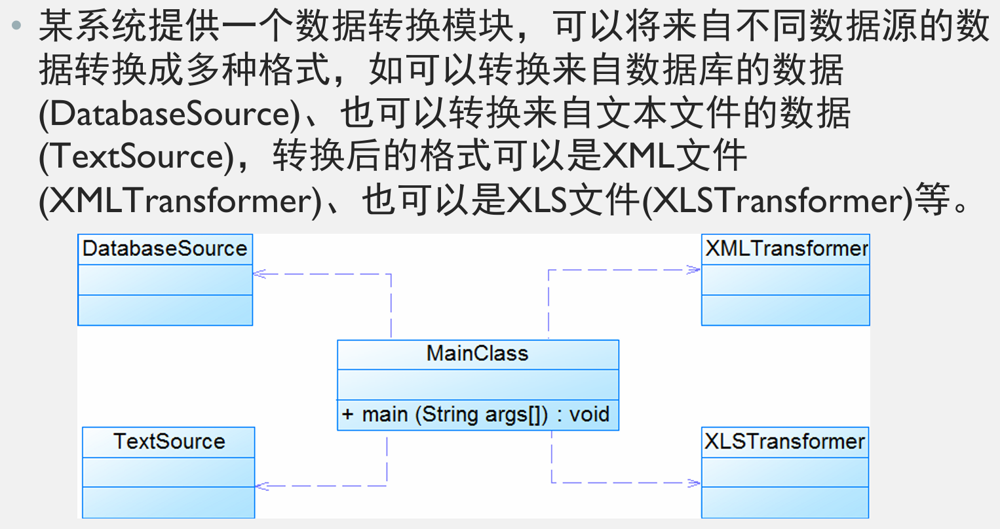

每增加新的数据源或转换格式，都需要修改main源代码，违反了开闭原则。现用依赖倒转原则进行重构：

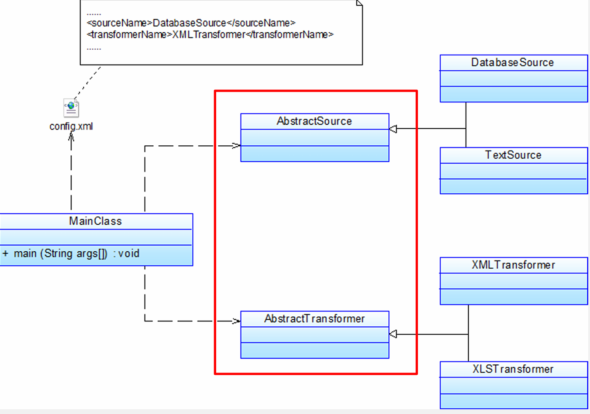

### 1.3.5 接口隔离原则

接口隔离原则(Interface Segregation Principle, **ISP**)的定义如下：

- **客户端不应该依赖那些它不需要的接口**。
- 一旦一个接口过大，则需要把它分割成一些更细小的接口，使用该接口的客户端仅需知道与之相关的方法即可。

接口隔离原则是指使用多个专门的接口，而不使用单一的总接口。每一个接口应该承担一种相对独立的角色，不多不少，不干不该干的事，该干的事都要干。

1.  一个接口就只代表一个角色，每个角色都有它特定的一个接口，此时这个原则可以叫做“角色隔离原则”。
2. 接口仅仅提供客户端需要的行为，即所需的方法，客户端不需要的行为则隐藏起来，应当为客户端提供尽可能小的单独的接口，而不要提供大的总接口。

使用接口隔离原则拆分接口时，首先必须满足单一职责原则，将一组相关的操作定义在一个接口中，且**在满足高内聚的前提下，接口中的方法越少越好**。

可以在进行系统设计时采用定制服务的方式，即为不同的客户端提供宽窄不同的接口，只提供用户需要的行为，而隐藏用户不需要的行为。

示例：

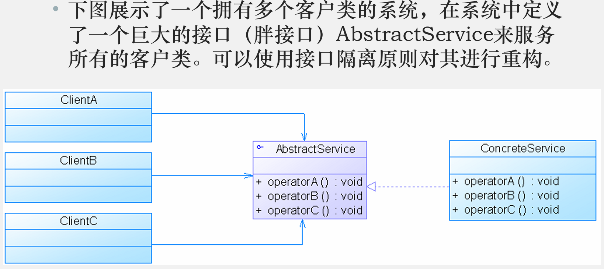

重构后：

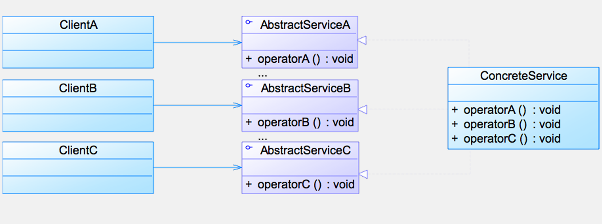

### 1.3.6 合成复用原则

合成复用原则(Composite Reuse Principle, **CRP**)又称为组合/聚合复用原则(Composition/ Aggregate Reuse Principle, CARP)，其定义如下：

- 尽量使用**对象组合**，而不是继承来达成复用的目的。

合成复用原则就是指在一个新的对象里通过**关联关系（包括组合关系和聚合关系）**来使用一些已有的对象，使之**成为新对象的一部分**；新对象通过委派调用已有对象的方法达到复用其已有功能的目的。简言之：要尽量使用组合/聚合关系，少用继承。

- **继承复用**：实现简单，易于扩展。但破坏系统的封装性；从基类继承而来的实现是静态的，不可能在运行时发生改变，没有足够的灵活性；只能在有限的环境下使用（**“白箱”复用**）
- **组合/聚合复用**：耦合度相对较低，选择性地调用成员对象的操作；可以在运行时动态进行（**“黑箱”复用**）

组合/聚合可以使系统更加灵活，类与类之间的耦合度降低，一个类的变化对其他类造成的影响相对较少，因此一般首选使用组合/聚合来实现复用 ；其次才考虑继承，在使用继承时，需要严格遵循里氏代换原则，有效使用继承会有助于对问题的理解，降低复杂度，而滥用继承反而会增加系统构建和维护的难度以及系统的复杂度，因此需要慎重使用继承复用。

示例：

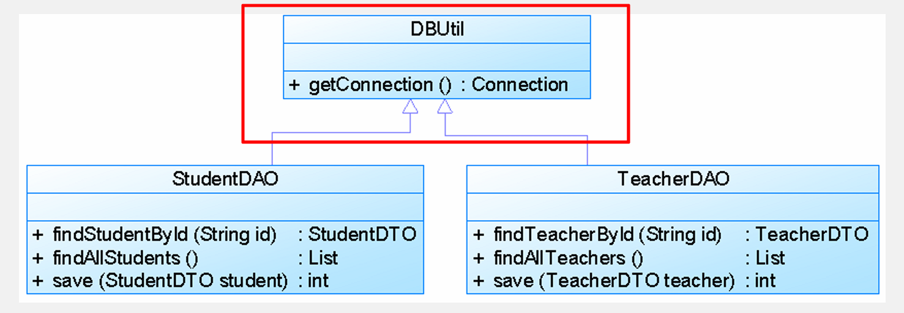

