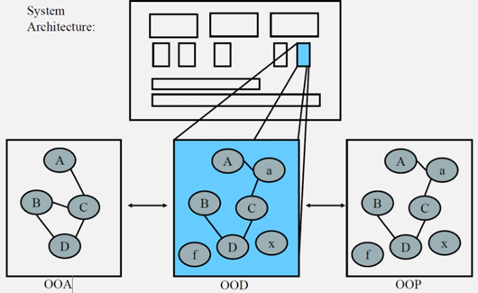
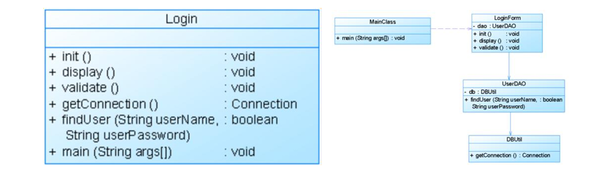
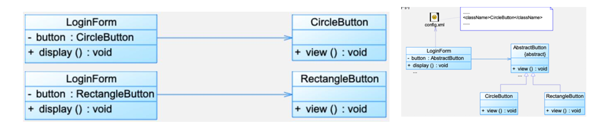
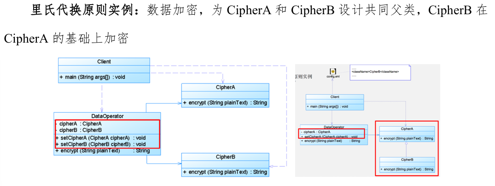

# 设计模式

## 一、软件设计引入

原文依次定义了四个概念：**需求、规约、架构、设计**。它们是从模糊到具体、从外部到内部的逐步细化过程。

### 1. 需求

> 需求定义系统需要满足的目标（用户需求指出了目标，比如在线会议的目标是能够看到人员、听到声音等）。

**理解**：需求是用户视角的“愿望清单”，只说明系统要达成什么业务效果，不涉及技术实现。例如“在线会议要能实时传输音视频”就是需求。

### 2. 规约

> 规约定义系统的<u>外部可观察行为</u>。

**理解**：规约是需求的形式化描述，规定了系统对外呈现的接口和行为，但不描述内部实现。例如“用户在点击‘加入会议’按钮后，系统应在2秒内建立连接并显示参会者画面”就是规约的一部分。规约是可测试的。

### 3. 架构

> 架构定义系统级的主要组成部分、各部分之间的互动方式、使用的技术（比如在线会议需要前端、操作系统调用功能部分、网络部分以及部分之间的联系，使用什么技术等等）。

**理解**：架构是高层次的系统分解，确定有哪些模块（组件）、模块之间如何通信、选用哪些技术栈。例如“采用微服务架构，前端用React，后端用Spring Cloud，通过WebSocket实现实时通信”属于架构决策。

### 4. 设计

> 设计定义如何完成任务、编写代码，我们关注面向对象设计。

**理解**：设计是在架构确定的框架下，具体到类、方法、数据结构、算法的层面。面向对象设计就是如何用类、对象、继承、多态等手段来实现架构规定的模块职责。

**这四个概念的递进关系**：需求→规约→架构→设计，每一步都在前一步的基础上增加技术细节和实现约束。

------

## 二、面向对象设计（OOD）

### （一）什么是面向对象设计 OOD

> 面向对象对象设计是将实现的约束条件（性能约束、应对变化的需求等）应用到面向对象分析所产生的概念模型（对应问题域，如数据库、文件、用户界面、算法等）的过程（问题驱动）。

**理解**：首先通过面向对象分析（OOA）得到**概念模型**，这个模型只反映问题域中的实体及其关系（例如“学生”、“课程”、“选课”）。然后进入OOD阶段，我们要考虑实际实现时的各种约束（性能、可扩展性、平台限制等），在概念模型的基础上添加**实现相关的类**（如数据库访问类、缓存类、接口类），最终得到一个可编码的设计模型。这个过程是问题驱动的——即为了解决特定问题（如“如何应对将来可能增加的支付方式”）而引入额外的设计元素。

### （二）系统设计步骤

原文给出了三个步骤：

1. **用方法和属性来描述用于构成系统的类，得到相应的概念模型。**
   - 这其实就是OOA的输出：识别出问题域中的核心类，并为每个类赋予属性和方法。例如“图书”类有“书名”“作者”属性，“借出”方法。
2. **在概念模型的基础上，添加明显不属于领域的类，比如抽象类和接口。**
   - 这是OOD的关键一步。领域类（如“图书”）来自业务，而抽象类、接口、辅助类（如“持久化接口”、“策略基类”、“工厂类”）是为了满足非功能性需求（可扩展、可测试、低耦合）而人为引入的，它们不属于原始问题域。
3. **描述类是如何构成组件的。**
   - 将相关类打包成更大的模块（组件），明确组件间的依赖关系和接口。这一步衔接架构设计，使设计结果可以直接映射到架构中的组件。

### （三）OOA、OOD和OOP

> 针对已有的系统架构（包含不同组件），针对问题进行面向对象分析，得到OOA的概念模型，然后进行OOD的面向对象设计添加明显不属于领域的类，最后我们将OOD得到的结果映射到OOP中。

**理解**：这是一个线性流程：

- **OOA**：从问题域出发，产出概念模型（类图，只有业务类）。
- **OOD**：在概念模型上叠加实现约束，增加辅助类、接口、抽象类，产出设计模型。
- **OOP**：将设计模型翻译成具体的编程语言代码（Java、C++等）。

三者层层递进，OOA回答“有什么”，OOD回答“怎么设计得更好”，OOP回答“怎么编码”。



### （四）面向对象设计的困难

> 面向对象设计的困难是将**系统分解成对象**。对象可能来自于分析模型、实现空间（数据库、文件、UI、IPC）等，当然也可能其他类没有这样的类（使得特殊的设计更通用，比如策略模式）。从OOA到OOD没有循序渐进的简单方式，虽然OOA以直接的方式给出了问题域组件，但是还需要经验才能完成从OOA到OOD的转变。

**理解**：分解对象没有标准算法，依赖设计者的经验。对象来源多样：有些直接来自分析模型（业务对象），有些来自实现空间（技术对象），有些则是为了通用性而创造的新类（如策略模式中的策略接口）。这种“创造性”正是设计的难点，也是设计模式发挥作用的地方——模式提供了经过验证的分解方案。

### （五）软件系统设计经验

> 经验丰富的设计师可以看到同样的老问题反复出现，每次遇到类似的问题，设计师都会从行而有效的东西（设计原则以及经典的设计经验）入手。

**理解**：设计经验和设计原则是应对重复问题的武器。通过学习设计原则和设计模式，新手也能快速获得老手的“直觉”。这也是本门课程的价值所在。

## 三、面向对象设计原则

### （〇）前置论述：为什么需要设计原则

#### —— 可维护性低的软件设计的原因

> 可维护性低的软件设计的原因：过于僵硬（硬编码）、过于脆弱（修改导致的未知影响）、复用率低（不可黑盒使用）、粘度过高（架构需要修改）

| 坏味道                  | 原文括号标注       | 含义                                                         |
| ----------------------- | ------------------ | ------------------------------------------------------------ |
| **过于僵硬 Rigidity**   | 硬编码             | 系统一旦要加新功能，发现处处写死，牵一发就要动大身——"加不动" |
| **过于脆弱 Fragility**  | 修改导致的未知影响 | 改A处，B处莫名其妙崩——"不敢改"                               |
| **复用率低 Immobility** | 不可黑盒使用       | 想把某段逻辑拿出来复用，但它跟其他东西缠死，剥不下来——"拿不走" |
| **粘度过高 Viscosity**  | 架构需要修改       | 保持原有设计意图的做法比走捷径还难，大家就开始破窗——"改歪了" |

#### —— 好的系统设计应具备的性质

> 好的系统设计应具备的性质：**可扩展性、灵活性和可插入性**。

- **可扩展性**：不伤筋动骨就能加新行为
- **灵活性**：改动不引发连锁反应
- **可插入性**：组件可替换（像插拔零件）

#### —— 软件的可维护性和可复用性

> 软件的复用或重用优点：提高软件的开发效率，提高软件质量，节约开发成本。**1.合适复用可以改善系统的可维护性。2.部分复用可能破坏系统的可维护性**，比如A和B修改C，如果A需要C多提供一个行为，而B不需要则会有问题。

**理解**：复用本身是好事，但**不健康的复用**（强耦合、不合理的继承、把不该共享的细节暴露出去）会把四个坏味道全引出来。所以原则的存在意义不是"反对复用"，而是保障**可维护性的复用**。

> 面向对象设计复用的目标在于实现**支持可维护性的复用**。在面向对象设计中，**可维护性复用都是以面向对象设计原则为基础的**。面向对象设计原则也是对系统进行合理重构的指南针。

> **重构**是在不改变软件现有功能的基础上，通过调整程序代码改善软件质量、性能，使其程序的设计模式和架构更趋合理，提高软件的扩展性和维护性。

------

### 设计原则总览表（原文完整表格）

> **表格**：

| 设计原则名称                                         | 设计原则简介                                                 | 设计原则之间关系                     |
| ---------------------------------------------------- | ------------------------------------------------------------ | ------------------------------------ |
| **单一职责原则 SRP** Single Responsibility Principle | 一个对象应该只包含单一的职责，并且该职责被**完整地封装**在一个类中。 |                                      |
| **开闭原则 OCP** Open-Closed Principle               | 一个软件实体应当对**扩展开放**，对**修改关闭**。软件实体可以是一个软件模块、一个由多个类组成的局部结构或一个单独的类。 | 开闭原则是对单一职责原则的**加强**   |
| **里氏代换原则 LSP** Liskov Substitution Principle   | **所有引用基类（父类）的地方必须能透明地使用其子类的对象。**通俗表达：软件中如果能够使用基类对象，那么一定能够使用其子类对象。 | 里氏代换原则是开闭原则的**具体实现** |
| **依赖倒转原则 DIP** Dependency Inversion Principle  | **高层模块不应该依赖于低层模块**，他们都应该**依赖抽象**。**抽象不应该依赖于细节，细节应该依赖于抽象。**另一种表述：要**针对接口编程**，而不要针对实现编程。 | 依赖倒转原则是开闭原则的**具体实现** |
| **接口隔离原则 ISP** Interface Segregation Principle | **客户不应该依赖那些它不需要的接口。**                       | 拆分时需要满足**单一职责原则**       |
| **合成复用原则 CRP** Composite Reuse Principle       | 在系统中应该**尽量多使用组合/聚合关联关系，尽量少甚至不使用继承关系**。 |                                      |
| **迪米特法则 LoD** Law of Demeter                    | 在一个软件实体对其他实体的引用越少越好，或者说**如果两个类不必彼此直接通信，那么这两个类就不应当发生直接的相互作用**，而是通过引入一个第三者发生**间接交互**。 |                                      |

- **SRP** 让每个类只背一个变化原因 → **OCP** 在此基础上要求变化被封装，通过抽象来承接扩展 → **LSP** 保证扩展后的子类真能替掉基类而不翻车 → **DIP** 给出落地手段（面向抽象、注入依赖）让 OCP+LSP 在工程上成立 → **ISP** 保证抽象接口本身不过胖、不强迫客户依赖无用东西（ISP 拆接口时还要回头看 SRP）→ **CRP** 提供"不用危险继承也能复用"的替代路径 → **LoD** 收束调用半径，压住耦合面。

------

### 1. 单一职责原则（SRP）

> 一个类（大到模块，小到方法）承担的责任越多，被复用的可能性就越小。类的职责包括**数据职责**（属性体现）和**行为职责**（方法体现）两个方面。

**理解**：

- "职责"在这里的精确定义是：**变化的原因（reason to change）**。一个类如果有两份毫不相关的变化动力（比如"认证规则变了"和"页面跳转方式变了"），就属于多个职责混在一起。
- "完整地封装"意味着：与这个职责相关的数据和行为，要收拢在同一个抽象边界内，而不是散落在外让别的类来碰它的内部状态。
- 落到代码上，SRP 最直接的表现就是**拆类 / 拆方法**：大类拆小、长方法拆步骤。它不是"一个类只能有一个方法"，而是"一个类只为一个变化原因存在"。

**记忆点**：SRP 是整个体系的**起点**——先把职责切干净，后面的 OCP / LSP / DIP 才有操作空间。



------

### 2. 开闭原则（OCP）

> 一个软件实体应当对**扩展开放**，对**修改关闭**。软件实体可以是一个软件模块、一个由多个类组成的局部结构或一个单独的类。

> 关键是**抽象化**。

> 还可以通过**可变性封装原则**（Principle of Encapsulation of Variation, EVP）来描述——把"可能变化的东西"找出来，封进一个抽象边界里。

**理解**：

- "修改关闭"不是"永远不改源码"，而是：**新增行为时不改已有核心逻辑代码**。改配置不算改逻辑；改抽象层不算动稳定代码。
- 实现 OCP 的两件套：
  1. **找变化点**（EVP）：什么东西会变？（按钮类型？支付方式？报表格式？）
  2. **用抽象关住它**：把稳定调用侧依赖的"能力契约"抽成接口/抽象类，变体实现各自子类
- 原文用"XML + 反射"只是其中一种手法（配置驱动），更常见的是：接口 + 多态 + 注册/注入，本质一样——**稳定代码依赖抽象，变体藏在抽象背后**。

**记忆点**：OCP 的判据极其实用——**你要加一个新功能，是不是只新建文件/新类就能跑，还是必须去改老文件的 {} 里？**后者的次数越多，OCP 越没落实。



------

### 3. 里氏代换原则（LSP）

> 如果对每一个类型为 S 的对象 o1，都有类型为 T 的对象 o2，使得以 T 定义的所有程序 P 在所有对象 o2 都替换成 o1 时，程序 P 的行为没有变化，那么类型 S 是类型 T 的子类型。

> 所有引用基类（父类）的地方必须能**透明地**使用其子类对象。软件中如果能够使用基类对象，那么一定能够使用其子类对象。

> 子类不应该是父类的功能的扩展（重点在"不是简单地为了捡代码而继承"），我们可以使用**组合**的方式来扩展功能。

> **原文实例指向**：数据加密，为 CipherA 和 CipherB 设计共同父类，CipherB 在 CipherA 的基础上加密——这里隐含的考点是：如果 CipherB 只是"在 CipherA 后面多一道加密"但**不破坏 CipherA 的契约**（前置/后置/异常承诺），才能当子类；否则应改成组合关系。

**理解**：

LSP 常被误读成一句废话（"子类当然能当父类用啊"），但它真正约束的是：**继承不是复制粘贴的捷径，而是契约承诺**。

具体包括（原文精神推导）：

- 子类**不应削弱**父类方法的前置条件
- 子类**不应强化**父类方法的后置条件的反面（不应产出父类不允许的结果范围）
- 子类**不应抛出新类型的异常**（除非是父类异常体系的派生）
- 子类**不应偷偷推翻**父类宣称的行为语义




------

### 4. 依赖倒转原则（DIP）

> **原文定义（两段等价表述）**：
>
> 1. **高层模块不应该依赖于低层模块，他们都应该依赖抽象。**
>
> 2. **抽象不应该依赖于细节，细节应该依赖于抽象。**
>
>    另一种表述：**要针对接口编程，而不要针对实现编程。**

> **原文补充**：常见的实现方式：在代码中使用**抽象类**，而将具体类放在**配置文件**（将抽象放进代码，将细节放进元数据）。

> **原文：类之间的耦合**包括：零耦合（最好）、具体耦合、抽象耦合关系（依赖倒转要求至少有一端是抽象的）。

> **原文：依赖注入**
>
> 1. **构造注入**：通过构造函数注入实例变量
> 2. **设值注入**：通过 Setter 方法注入实例变量
> 3. **接口注入**：通过接口方法注入实例变量

> **原文实例指向**：数据转换面临增加新的数据源和文件格式的需求。（高层转换逻辑依赖 DataSource / FileFormat 这样的抽象，而不是具体 MySQL / CSV 等类，新增源=新实现类）

**理解**：

DIP 是整个原则体系的**工程枢纽**。OCP 要"扩展不修改"，LSP 要"子类真能替"，但你怎么让高层代码**实际做到不依赖具体**？——答案是 DIP：

```
高层（业务逻辑）
    ↓ 依赖抽象接口
抽象接口（IRepository / IConverter / IService）
    ↑ 实现
低层（MySQLRepo / CsvConverter / AliPayService）
```

然后靠**依赖注入**把"具体对象"从外部送进来（构造注入最常见也最推荐，因为对象一旦建完就处于合法完整状态）。

"将抽象放进代码，将细节放进元数据"这句是说：代码中留的是接口/抽象类（稳定），具体类名、连接串、策略选择可以挪到配置/工厂里（可变）。

**记忆点**：当你看到 `new MySQLDAO()`直接写在业务方法体里，你就知道 DIP 没落实——业务类现在被 MySQLDAO 这个名字锁死了。

------

### 5. 接口隔离原则（ISP）

> **原文定义**：**客户不应该依赖 那些它不需要的接口。**

> **原文关系**：拆分时需要满足**单一职责原则**。

> **原文补充**：使用**多个专门的接口**（仅仅提供客户端需要的行为），而不使用单一的总接口，每个接口都应该承担一种**相对独立的角色**。可以在系统设计时采用**定制服务**的方式，为不同的客户端提供**宽窄不同的接口**。

> **原文实例指向**：从左侧到右侧进行接口拆分（胖接口 → 按角色拆成多个瘦接口）。

**理解**：

ISP 解决的是"胖接口污染"：一个接口塞了太多方法，实现类被迫实现一堆它不需要的方法（或空实现 / throw UnsupportedOperationException），客户类也被迫看见一堆跟自己无关的方法——后果就是**假依赖**：改一个没人用的接口方法，结果一堆实现类和客户都得跟着动。

拆法原文也给了锚点：**按角色/按客户视角**拆，不是乱拆。每个拆出来的接口对应一个"它能做什么"的明确角色（可读、可写、可配置……），这就是"定制服务"的含义——给 A 客户 A 视角，给 B 客户 B 视角。

**记忆点**：ISP 是接口层面的 SRP。"一个接口只为一个变化原因存在"≈"一个接口只服务一类客户角色"。

------

### 6. 合成复用原则（CRP）

> **原文定义**：在系统中应该**尽量多使用组合/聚合关联关系，尽量少甚至不使用继承关系**。

> **原文：聚合与组合区别**：
>
> - **聚合**（空心菱形）：独立——部分可脱离整体存在
> - **组合**（实心菱形）：局部往往不能离开总体

> **原文**：合成复用原则是在一个对象中通过**关联关系**（聚合/组合）来使用一些已有对象，使之成为新对象的一部分；新对象通过**委派**（delegation）调用已有对象的方法达到复用其已有功能的目的。

> **复用方式对比**：
>
> 1. **继承复用（"白箱"复用）**：实现简单，易于扩展，**破坏系统封装性**，静态实现灵活性不足，适用环境有限。
> 2. **组合/聚合复用（"黑箱"复用）**：耦合性低，选择性调用成员对象较为灵活。

> **原文实例指向**：教学管理系统的数据库访问。左侧（继承方案）：如果数据库连接方式变化，采用原本的 JDBC 方式连接数据库则需要修改 DBUtil 类源代码；同时如果 StudentDAO 和 TeacherDAO 数据库访问方式不同，则需要添加新的 DBUtil 类并修改 StudentDAO 和 TeacherDAO 的源代码，**违背开闭原则**。右侧即用组合/聚合替代继承。

**理解**：

这条原则补的是 LSP / DIP 背后更底层的选型问题：**is-a（继承）vs has-a（组合）**。

- 继承的问题不在"不能用"，而在于它是**编译期、静态、侵入式**的：子类看到父类 protected 甚至 public 的一切，父类的内部变化直接穿透到子类；想换一种能力就得换父类或加继承层次。
- 组合把能力变成一个**成员对象**，新对象通过委派调用它——能力可换、可拔、可动态选，而且不把成员的内部暴露给外界。

原文的 JDBC DAO 例子抓得很准：DAO **继承** DBUtil 意味着"DAO 是 DBUtil 的一种"，但 DAO 其实只需要"能拿到连接/能执行 SQL"，不是 DBUtil 的语义儿子——所以改成持有 ConnectionFactory / DataSource 成员（组合），换连接池只需换注入对象，DAO 源码不动。

**记忆点**：当你发现自己写成 `StudentDAO extends JdbcUtil`，先停一下问：**StudentDAO 真的是 JdbcUtil 吗？**如果不是，改 has-a。

------

### 7. 迪米特法则（LoD / 最少知识原则）

> **原文定义（两句话等价）**：
>
> - 在一个软件实体对其他实体的引用越少越好
> - 如果两个类不必彼此直接通信，那么这两个类就**不应当发生直接的相互作用**，而是通过引入一个**第三者**发生**间接交互**。

> **原文典型定义三条**：
>
> 1. 不要与陌生人说话
> 2. 只与你的**直接朋友**通信
> 3. 每一个软件单位对其他的单位都只有**最少的知识**，而且局限于那些与本单位**密切相关**的软件单位。

> **原文：对一个对象的朋友类别**（否则为陌生人）：
>
> 1. 当前对象**本身**
> 2. 以**参数形式传入**到当前对象方法中的对象
> 3. 当前对象的**成员变量**
> 4. 如果当前对象的成员对象是一个**集合**，那么集合中的**元素**也都是朋友
> 5. 当前对象所**创建**的对象

> **原文分类**：
>
> - **狭义迪米特法则**：如果两个类之间不必彼此直接通信，就不应当发生直接相互作用，如需方法调用则通过第三者转发（A → B → C，而不是 A 拿到 B 后 `.getC().doSomething()`）。降低耦合，但可能导致大量小方法散落（转发方法），通信效率降低。
> - **广义迪米特法则**：指对对象之间的**信息流量、流向以及信息的影响**的控制，主要是**信息隐藏**。信息隐藏使各子系统脱耦，允许独立开发、优化、使用、修改，促进复用。系统规模越大越重要。

> **原文：迪米特法则的实现**
>
> 1. 类的划分上：创建**松耦合**的类
> 2. 类的结构设计上：每一个类都尽量**降低**其成员变量和成员函数的**访问权限**
> 3. 类的设计上：如果可能，一个类型应该被设计为**不变类**
> 4. 其他类的引用上：一个对象对其他对象的引用应当降低到最低

> **原文实例指向**：从左侧变为右侧（消除链式调用/跨层穿透访问，引入中间者封装）

**理解**：

迪米特法则的精髓就一句工程白话：**别顺着 getter 一路 "."下去摸到别人的内部对象世界里**。

```
// 违例：A 知道了 B 的内部结构，又通过 B 摸到了 C
a.getB().getC().doSomething();

// 合规：B 自己提供一个方法，封装这个协作
a.getB().performSomeCoordination();
// 或引入第三者 / 门面来管这个交互
```

为什么这在大规模系统里致命？因为 `B.getC()`一旦改签名或改内部结构，所有 "." 过它的调用方全炸——这就是"粘性过高 / 脆弱"的微观来源之一。

但原文也很诚实：狭义 LoD 可能带来**转发方法膨胀**，所以要权衡——关键不是消灭所有间接层，而是**不要让一个类依赖超出它职责范围的另一个类的内部拓扑**。

**记忆点**：LoD 是所有原则的最终"收口"——SRP 切职责、OCP/LSP/DIP/ISP/CRP 管抽象与复用，LoD 管**调用边界别越界**。

## 四、具体设计模式

### 策略模式

1. **行为型模式**

1. **引入策略接口和多个具体策略实现类**；解决了同一类问题存在多种算法实现时，大量 `if-else` 判断导致代码难维护的问题。将变化的算法独立封装，使算法可以动态替换，新增策略时不需要修改原有业务代码。
2. **体现了**
   1. **开闭原则（OCP）**：新增一种算法只需要增加新的策略类，不需要修改原有代码。
   2. **单一职责原则（SRP）**：每个策略类只负责一种具体算法，避免一个类承担多个变化原因。
   3. **依赖倒置原则（DIP）**：高层模块依赖策略抽象接口，而不是依赖具体算法实现。
   4. **组合优于继承**：通过组合策略对象改变行为，而不是通过继承扩展大量子类。
3. **区分：**

- 策略模式是**客户端主动选择不同算法实现**，关注“怎么做”；
- 状态模式是**对象内部状态变化导致行为变化**，关注“当前是什么状态”。
- 工厂模式是**负责创建对象**，策略模式是**负责封装和切换算法行为**。

### 简单工厂模式

1. **创建型模式**

1. **引入工厂类（Factory）**；解决了客户端直接创建大量具体对象导致代码耦合的问题。将对象创建过程集中管理，客户端只需要传入参数获取对象，不需要关心具体对象的创建细节。
2. **体现了**
   1. **单一职责原则（SRP）**：将对象创建逻辑从业务代码中分离，由工厂类统一负责创建。
   2. **迪米特法则（最少知道原则）**：客户端只需要知道工厂和抽象产品，不需要了解具体产品类。
   3. **依赖倒置原则（DIP）**：客户端依赖抽象产品，而不是具体实现类。
3. **区分：**

- 简单工厂模式是**通过一个工厂类根据条件创建不同对象**；
- 工厂方法模式是**定义创建对象的接口，让子类决定创建哪种对象**；
- 抽象工厂模式是**创建一组相关的产品对象**，关注产品族。

### 工厂方法模式

1. **创建型模式**

1. **引入抽象工厂接口和具体工厂类**；解决了简单工厂中工厂类职责过重、增加新产品需要修改工厂代码的问题。通过让不同工厂负责创建不同产品，将对象创建逻辑分散，提高代码扩展性。
2. **体现了**
   1. **开闭原则（OCP）**：新增产品时只需要增加对应的具体工厂类，不需要修改原有工厂代码。
   2. **单一职责原则（SRP）**：每个具体工厂只负责创建一种产品。
   3. **依赖倒置原则（DIP）**：客户端依赖抽象工厂和抽象产品，而不是具体实现。
   4. **里氏替换原则（LSP）**：具体工厂可以替换抽象工厂使用，具体产品可以替换抽象产品使用。
3. **区分：**

- 简单工厂模式是**一个工厂类根据条件创建不同产品**，新增产品需要修改工厂；
- 工厂方法模式是**定义工厂接口，由不同子工厂创建不同产品**，新增产品只需扩展工厂；
- 抽象工厂模式是**创建一组相关产品的工厂**，关注产品族。

### 抽象工厂模式

1. **创建型模式**

1. **引入抽象工厂接口和多个具体工厂类**；解决了需要创建多个相关产品时，客户端直接创建具体对象导致耦合的问题。通过一个工厂负责创建一整套相关产品，保证创建出的产品之间具有一致性。
2. **体现了**
   1. **开闭原则（OCP）**：新增产品族时，只需要增加新的具体工厂，不需要修改原有代码。
   2. **单一职责原则（SRP）**：将产品创建职责交给具体工厂，避免业务类负责对象创建。
   3. **依赖倒置原则（DIP）**：客户端依赖抽象工厂和抽象产品，不依赖具体实现。
   4. **里氏替换原则（LSP）**：具体工厂可以替换抽象工厂，具体产品可以替换抽象产品。
3. **区分：**

- 简单工厂模式是**一个工厂根据条件创建一个具体产品**；
- 工厂方法模式是**一个工厂接口对应一种产品，由子工厂创建具体产品**；
- 抽象工厂模式是**一个工厂负责创建一组相关产品，解决产品族创建问题**。

### 建造者模式

1. **创建型模式**

1. **引入建造者（Builder）和指导者（Director）**；解决了复杂对象创建时构造参数过多、构建过程复杂、代码可读性差的问题。将对象的创建过程拆分成多个步骤，使同一个构建流程可以创建不同表示的对象。
2. **体现了**
   1. **单一职责原则（SRP）**：将复杂对象的创建过程从产品类中分离，由 Builder 负责构建。
   2. **开闭原则（OCP）**：新增不同对象构建方式时，可以增加新的 Builder，不需要修改原有代码。
   3. **组合复用原则**：通过组合多个构建步骤生成复杂对象，而不是依赖大量继承。
3. **区分：**

- 建造者模式是**关注复杂对象的构建过程，将创建步骤分离**；
- 工厂模式是**关注对象的创建，直接返回创建好的对象**；
- 原型模式是**通过复制已有对象创建新对象**。

### 原型模式

1. **创建型模式**

1. **引入原型接口（Prototype）和对象复制机制**；解决了创建复杂对象时初始化过程耗时、代码复杂的问题。通过复制已有对象生成新对象，可以减少创建成本，并且可以动态扩展对象类型。
2. **体现了**
   1. **开闭原则（OCP）**：新增对象类型时，可以通过扩展新的原型类，不需要修改创建逻辑。
   2. **单一职责原则（SRP）**：对象创建和业务逻辑分离，由原型负责复制。
   3. **依赖倒置原则（DIP）**：客户端依赖原型抽象接口，而不是具体对象实现。
3. **区分：**

- 原型模式是**通过复制已有对象创建新对象**；
- 工厂模式是**通过调用创建逻辑生成新对象**；
- 单例模式是**保证对象只有一个实例**；
- 建造者模式是**通过多个步骤构建复杂对象**。

### 状态模式

1. **行为型模式**

1. **引入状态接口（State）和多个具体状态类**；解决了对象存在大量状态判断（如 if-else / switch）导致代码复杂、难以维护的问题。将不同状态下的行为封装到不同状态类中，使状态转换和行为逻辑更加清晰。
2. **体现了**
   1. **开闭原则（OCP）**：新增状态时只需要增加新的状态类，不需要修改原有业务逻辑。
   2. **单一职责原则（SRP）**：每个状态类只负责处理一种状态下的行为。
   3. **依赖倒置原则（DIP）**：上下文对象依赖状态抽象接口，而不是具体状态实现。
   4. **封装变化思想**：将容易变化的状态行为独立封装，减少状态判断。
3. **区分：**

- 状态模式是**对象内部状态变化导致行为变化，由对象自己管理状态转换**；
- 策略模式是**客户端主动选择不同算法，关注算法替换**；
- 观察者模式是**对象状态变化后通知其他对象，关注对象之间的通信**。

### 命令模式

1. **行为型模式**

1. **引入命令接口（Command）、具体命令类和调用者（Invoker）**；解决了请求发送者和请求执行者直接耦合的问题。将一个操作封装成对象，使请求可以参数化、排队、记录、撤销和重做。
2. **体现了**
   1. **开闭原则（OCP）**：新增命令时只需要增加新的命令类，不需要修改调用者代码。
   2. **单一职责原则（SRP）**：调用者负责发起请求，命令类负责封装操作，执行者负责具体实现。
   3. **依赖倒置原则（DIP）**：调用者依赖命令抽象接口，而不是具体执行对象。
   4. **封装变化思想**：将变化的请求操作封装成独立对象。
3. **区分：**

- 命令模式是**将请求封装成对象，实现请求发送者和执行者解耦**；
- 策略模式是**封装算法，让不同算法可以互相替换**；
- 责任链模式是**多个处理者依次处理一个请求**；
- 观察者模式是**一个对象变化通知多个对象**。

### 观察者模式

1. **行为型模式**

1. **引入主题（Subject）和观察者（Observer）接口**；解决了对象之间紧耦合的问题。通过建立一对多的依赖关系，使主题对象只负责通知，不需要知道具体观察者的实现，观察者可以动态注册和移除。
2. **体现了**
   1. **开闭原则（OCP）**：新增观察者时只需要增加新的观察者类，不需要修改主题类。
   2. **单一职责原则（SRP）**：主题负责状态管理和通知，观察者负责响应变化。
   3. **依赖倒置原则（DIP）**：主题依赖观察者抽象接口，而不是具体观察者实现。
   4. **迪米特法则（最少知道原则）**：主题只知道观察者接口，不关心具体观察者细节。
3. **区分：**

- 观察者模式是**一个对象变化时通知多个依赖对象，关注对象之间的一对多通信**；
- 状态模式是**对象状态变化导致自身行为变化，关注内部状态切换**；
- 发布订阅模式是**通过消息中间件实现发布者和订阅者解耦，观察者模式通常直接关联对象**。

### 中介者模式

1. **行为型模式**

1. **引入中介者（Mediator）对象**；解决了多个对象之间相互引用、依赖关系复杂的问题。将对象之间的通信集中到中介者中，使对象只与中介者交互，降低对象之间的耦合。
2. **体现了**
   1. **迪米特法则（最少知道原则）**：对象不需要知道其他对象，只需要知道中介者。
   2. **单一职责原则（SRP）**：将复杂的交互逻辑从业务对象中分离，由中介者负责协调。
   3. **开闭原则（OCP）**：新增交互逻辑时，可以扩展中介者或增加组件，不需要修改大量已有对象。
   4. **依赖倒置原则（DIP）**：对象依赖抽象中介者，而不是依赖其他具体对象。
3. **区分：**

- 中介者模式是**通过引入中介对象协调多个对象之间的通信，解决对象之间网状依赖问题**；
- 观察者模式是**一个对象变化通知多个对象，形成一对多依赖关系**；
- 外观模式是**为外部提供统一接口，隐藏子系统复杂性，而中介者是协调内部对象通信**。

### 模板方法模式

1. **行为型模式**

1. **引入抽象父类（Abstract Class）和模板方法**；解决了多个子类存在相同流程但部分步骤不同导致代码重复的问题。将不变的流程放在父类中，将变化的步骤交给子类实现，实现代码复用和流程统一。
2. **体现了**
   1. **开闭原则（OCP）**：新增子类可以扩展不同实现，不需要修改父类模板流程。
   2. **单一职责原则（SRP）**：父类负责定义整体流程，子类负责具体变化步骤。
   3. **好莱坞原则（控制反转）**：父类控制整体流程，在需要时调用子类实现。
   4. **代码复用思想**：将公共逻辑提取到父类，减少重复代码。
3. **区分：**

- 模板方法模式是**父类定义算法骨架，子类实现部分步骤，关注流程复用**；
- 策略模式是**封装不同算法，让算法可以动态替换，关注算法选择**；
- 工厂方法模式是**将对象创建延迟到子类，关注对象创建过程**。

### 适配器模式

1. **结构型模式**

1. **引入适配器（Adapter）**；解决了已有类接口与当前系统需求接口不一致，无法直接使用的问题。通过包装或转换已有对象的接口，使旧代码、新代码或第三方代码能够兼容使用。
2. **体现了**
   1. **开闭原则（OCP）**：通过新增适配器扩展兼容能力，不需要修改原有类。
   2. **单一职责原则（SRP）**：适配器只负责接口转换，不负责业务逻辑。
   3. **依赖倒置原则（DIP）**：客户端依赖目标接口，而不是具体被适配对象。
   4. **组合优于继承**：对象适配器通过组合已有对象实现转换，降低继承带来的耦合。
3. **区分：**

- 适配器模式是**转换已有接口，使不兼容的对象可以协作**；
- 装饰器模式是**动态增加对象功能，不改变原接口**；
- 代理模式是**控制对象访问，不改变对象接口**；
- 外观模式是**提供统一接口，隐藏子系统复杂性**。

### 组合模式

1. **结构型模式**

> 【原因】组合模式关注的是对象之间的层次结构，通过将单个对象和组合对象统一处理，使客户端可以一致地操作它们，因此属于结构型模式。

1. **引入组合对象（Composite）和叶子对象（Leaf）**；解决了树形结构中单个对象和多个对象处理方式不一致的问题。通过统一抽象接口，使客户端不需要区分叶子节点和组合节点，提高代码的扩展性和可维护性。
2. **体现了**
   1. **开闭原则（OCP）**：新增节点类型时，只需要增加新的实现类，不需要修改已有代码。
   2. **单一职责原则（SRP）**：每个节点对象负责自己的业务逻辑和子节点管理。
   3. **依赖倒置原则（DIP）**：客户端依赖统一抽象接口，而不是具体节点类型。
   4. **组合复用原则**：通过对象组合形成复杂结构，而不是依靠继承扩展。
3. **区分：**

- 组合模式是**将叶子对象和组合对象统一处理，解决树形结构问题**；
- 装饰器模式是**动态扩展对象功能，关注功能增强**；
- 适配器模式是**转换接口，使不兼容对象可以协作**；
- 外观模式是**提供统一入口，隐藏复杂子系统**。

### 桥接模式

1. **结构型模式**

1. **引入抽象层（Abstraction）和实现层（Implementor）**；解决了多维度变化导致继承体系复杂、子类数量大量增加的问题。将变化的两个方向独立拆分，使它们可以分别扩展，再通过组合进行连接。
2. **体现了**
   1. **开闭原则（OCP）**：新增抽象或实现方式时，只需要扩展对应类，不需要修改已有代码。
   2. **单一职责原则（SRP）**：将抽象职责和实现职责分离，各自负责自己的变化。
   3. **依赖倒置原则（DIP）**：高层抽象依赖实现接口，而不是具体实现类。
   4. **组合优于继承**：通过组合对象实现扩展，减少继承层次。
3. **区分：**

- 桥接模式是**将抽象和实现分离，使两个维度可以独立变化**；
- 适配器模式是**转换已有接口，使不兼容对象可以协作**；
- 装饰器模式是**动态增加对象功能，不改变对象结构**；
- 策略模式是**封装不同算法，让算法可以互相替换**。

### 装饰者模式

1. **结构型模式**

1. **引入装饰者（Decorator）对象**；解决了通过继承扩展功能导致类数量爆炸、层次结构复杂的问题。通过对象组合，在运行时动态添加功能，提高代码灵活性。
2. **体现了**
   1. **开闭原则（OCP）**：新增功能时只需要增加新的装饰类，不需要修改原有对象。
   2. **单一职责原则（SRP）**：每个装饰类只负责增加一种额外功能。
   3. **组合优于继承**：通过组合多个装饰对象实现功能扩展，避免大量子类。
   4. **依赖倒置原则（DIP）**：装饰者和被装饰对象都依赖抽象接口。
3. **区分：**

- 装饰者模式是**动态增加对象功能，不改变对象接口**；
- 代理模式是**控制对象访问，通常增强或限制对象行为**；
- 适配器模式是**转换接口，让不兼容对象可以使用**；
- 桥接模式是**分离抽象和实现，使两个维度独立变化**。

### 外观模式

1. **结构型模式**

1. **引入外观类（Facade）**；解决了客户端直接调用多个子系统导致依赖复杂、耦合度高的问题。通过封装子系统调用流程，对外提供简单统一的接口，降低系统使用难度。
2. **体现了**
   1. **迪米特法则（最少知道原则）**：客户端只需要知道外观对象，不需要了解子系统内部细节。
   2. **单一职责原则（SRP）**：外观类负责协调子系统调用，业务逻辑由子系统完成。
   3. **依赖倒置原则（DIP）**：客户端依赖外观抽象，而不是直接依赖多个具体子系统。
   4. **封装变化思想**：将复杂子系统变化隐藏在外观层之后。
3. **区分：**

- 外观模式是**提供统一入口，隐藏复杂子系统调用**；
- 适配器模式是**转换接口，使两个不兼容接口可以协作**；
- 中介者模式是**协调多个对象之间的通信，降低对象间耦合**；
- 代理模式是**控制对目标对象的访问，并增强目标对象行为**。

### 享元模式

1. **结构型模式**

1. **引入享元对象（Flyweight）和享元工厂（Flyweight Factory）**；解决了系统中大量创建相似对象导致内存占用过高、性能下降的问题。通过共享相同对象，将不变的数据存储在享元对象中，将变化的数据由外部传入，提高资源利用率。
2. **体现了**
   1. **享元思想（资源共享）**：通过复用已有对象减少重复创建，降低内存消耗。
   2. **单一职责原则（SRP）**：将对象共享管理和业务使用分离。
   3. **开闭原则（OCP）**：新增享元类型时，可以扩展新的享元类，不需要修改已有逻辑。
   4. **组合优于继承**：通过外部状态和内部状态组合对象行为，减少对象数量。
3. **区分：**

- 享元模式是**通过共享对象减少内存消耗，关注对象复用**；
- 单例模式是**保证一个类只有一个实例，关注对象唯一性**；
- 原型模式是**通过复制已有对象创建新对象，关注对象创建效率**；
- 工厂模式是**负责创建对象，关注对象生成过程**。

### 代理模式

1. **结构型模式**

1. **引入代理对象（Proxy）**；解决了客户端直接访问目标对象导致耦合、权限控制困难或需要额外功能扩展的问题。通过代理对象控制对真实对象的访问，并可以在访问前后增加额外逻辑。
2. **体现了**
   1. **开闭原则（OCP）**：增加代理功能时不需要修改目标对象，只需要增加代理类。
   2. **单一职责原则（SRP）**：代理负责访问控制或增强逻辑，目标对象负责核心业务。
   3. **依赖倒置原则（DIP）**：客户端依赖抽象接口，而不是具体目标对象。
   4. **封装变化思想**：将访问控制、日志、权限等变化逻辑封装到代理中。
3. **区分：**

- 代理模式是**控制对象访问，并增强目标对象行为**；
- 装饰者模式是**动态增加对象功能，重点是功能扩展**；
- 适配器模式是**转换接口，使不兼容对象能够使用**。

### 单例模式

1. **创建型模式**

1. **引入私有构造方法和全局访问点**；解决了某些对象频繁创建导致资源浪费，以及需要保证对象唯一性的问题。通过限制实例化次数，使系统中始终只有一个共享对象。
2. **体现了**
   1. **单一职责原则（SRP）**：单例类只负责自身实例的创建和管理。
   2. **封装思想**：隐藏对象创建过程，统一控制实例获取。
   3. **资源复用思想**：避免重复创建对象，提高资源利用率。
3. **区分：**

- 单例模式是**保证一个类只有一个实例**；
- 原型模式是**通过复制已有对象创建新对象**；
- 工厂模式是**负责创建不同类型对象**。

### 迭代器模式

1. **行为型模式**

1. **引入迭代器（Iterator）接口**；解决了客户端直接操作集合内部结构导致耦合的问题。通过迭代器隐藏集合遍历细节，使不同集合可以使用统一方式访问。
2. **体现了**
   1. **单一职责原则（SRP）**：集合负责存储数据，迭代器负责遍历数据。
   2. **开闭原则（OCP）**：新增遍历方式时可以增加新的迭代器，不修改集合结构。
   3. **封装思想**：隐藏集合内部实现，只暴露访问接口。
3. **区分：**

- 迭代器模式是**封装集合遍历过程**；
- 访问者模式是**分离数据结构和操作行为**；
- 责任链模式是**多个对象依次处理请求**。

### 责任链模式

1. **行为型模式**

1. **引入处理者接口（Handler）和多个具体处理者**；解决了请求发送者和多个处理逻辑之间强耦合的问题。通过让多个对象依次尝试处理请求，避免大量条件判断。
2. **体现了**
   1. **开闭原则（OCP）**：新增处理者只需要增加新的处理类，不修改已有逻辑。
   2. **单一职责原则（SRP）**：每个处理者只负责自己的处理逻辑。
   3. **迪米特法则**：请求者不需要知道具体处理者，只与链结构交互。
3. **区分：**

- 责任链模式是**多个对象依次处理同一个请求**；
- 命令模式是**将请求封装成对象**；
- 观察者模式是**状态变化通知多个对象**。

### 备忘录模式

1. **行为型模式**

1. **引入备忘录（Memento）对象**；解决了对象状态恢复时需要暴露内部细节的问题。通过保存对象快照，在需要时恢复到之前状态。
2. **体现了**
   1. **封装原则**：保存对象内部状态，但不破坏对象封装性。
   2. **单一职责原则（SRP）**：对象负责业务，备忘录负责保存状态。
   3. **迪米特法则**：外部对象不直接访问内部状态。
3. **区分：**

- 备忘录模式是**保存和恢复对象状态**；
- 原型模式是**复制对象创建新对象**；
- 命令模式是**封装请求，实现撤销操作**。

### 解释器模式

1. **行为型模式**

1. **引入表达式接口（Expression）和具体表达式类**；解决了需要解析固定语法规则时，直接编写大量判断逻辑导致代码复杂的问题。通过对象结构表示语法，并按照规则解释执行。
2. **体现了**
   1. **开闭原则（OCP）**：新增语法规则可以增加新的表达式类。
   2. **单一职责原则（SRP）**：每个表达式类负责一种语法规则。
   3. **组合思想**：通过组合表达式对象构建复杂语法结构。
3. **区分：**

- 解释器模式是**定义并解释一套语言规则**；
- 策略模式是**切换不同算法实现**；
- 状态模式是**根据状态改变行为**。

### 访问者模式

1. **行为型模式**

1. **引入访问者（Visitor）对象**；解决了对象结构稳定但操作经常变化时，需要频繁修改对象类的问题。将变化的操作从对象中分离，使新增操作时不需要修改对象结构。
2. **体现了**
   1. **开闭原则（OCP）**：新增操作只需要增加新的访问者，不需要修改元素类。
   2. **单一职责原则（SRP）**：元素负责数据结构，访问者负责操作逻辑。
   3. **依赖倒置原则（DIP）**：依赖访问者抽象接口，而不是具体操作。
3. **区分：**

- 访问者模式是**分离数据结构和操作，方便增加新操作**；
- 迭代器模式是**统一遍历集合元素**；
- 装饰者模式是**动态增加对象功能**。

# 软件架构

## 架构模式演进

### 1. 最早期软件开发（1940s-1960s）

- **新约束与新矛盾**：计算资源极其稀缺，任务从“算一次”走向“重复算、稳定算、规模算”；主要矛盾是昂贵算力利用率与任务可重复性。
- **上一代的新问题**：无上一代（此为起点）；批处理模式下程序与硬件强绑定，复用性极弱。
- **结构骨架**：程序与数据组成作业，统一送入系统执行；围绕批处理与调度组织，强调吞吐与稳定；交互极弱，输出在作业完成后统一返回。
- **如何解决**：把“重复任务”写进程序，把“执行秩序”写进流程；通过调度与批处理最大化算力利用率。
- **质量属性取舍**：优先保障稳定性、可重复性、算力利用率；牺牲交互性、可修改性、复用性。

------

### 2. 主机/终端（1960s-1980s）

- **新约束与新矛盾**：企业事务数字化，大量用户需要共享同一套核心数据与事务能力；矛盾在于如何让多人共享核心事务系统。
- **上一代的新问题**：单机/批处理无法支撑多用户持续在线访问同一数据，缺少统一事务、权限与并发控制。
- **结构骨架**：主机承担全部事务处理、数据存储与权限控制；终端仅负责输入/显示；安全、审计、一致性集中在中心。
- **如何解决**：通过事务中心化，统一事务、统一安全、统一资源共享、统一运维治理，将混乱访问变为可治理的制度。
- **质量属性取舍**：优先保障一致性、安全性、可靠性、可审计性；牺牲易用性、交互响应性、局部可修改性。

------

### 3. C/S架构（1980s-1990s）

- **新约束与新矛盾**：PC与GUI普及，用户要求更丰富、更快速的桌面交互；矛盾在于如何把交互能力下放给桌面用户。
- **上一代的新问题**：主机/终端终端太“瘦”，无法支持复杂GUI与本地交互；所有变化压在中心，部门级快速建设困难；PC算力闲置不经济。
- **结构骨架**：客户端负责UI与部分本地逻辑（胖客户端），服务器负责共享数据与部分公共逻辑；前后端通过网络协作。
- **如何解决**：通过“客户端做交互、服务器保数据”的分工，将交互前移、响应更快、部门级系统快速上线。
- **质量属性取舍**：优先保障易用性、响应性、交互体验；牺牲可部署性、可维护性、兼容性、统一治理。

------

### 4. 三层/分层（1990s-2000s）

- **新约束与新矛盾**：Web成为统一入口，需要降低部署复杂度并将系统内部职责整理清楚；矛盾在于如何统一入口并把系统内职责分清。
- **上一代的新问题**：C/S客户端安装、升级、兼容成本随规模爆炸；客户端直接耦合数据层，不利于统一治理；系统内混杂展示、业务、数据处理。
- **结构骨架**：表示层（浏览器）负责接入与界面呈现；业务层承载业务规则与流程控制；数据层负责持久化与数据访问；层间单向依赖。
- **如何解决**：通过浏览器统一接入消除客户端安装成本；逻辑集中到服务端便于统一修改；分层控制变化影响局部化。
- **质量属性取舍**：优先保障可维护性、可修改性、安全性、可部署性；牺牲极致性能、跨系统协同灵活性、快速局部自治。

------

### 5. SOA（2000s）

- **新约束与新矛盾**：系统数量激增，企业需要跨系统复用业务能力并打通端到端流程；矛盾在于如何跨系统复用与集成。
- **上一代的新问题**：三层/分层系统间割裂，集成靠点对点接口；同一业务能力在不同系统重复实现；跨系统流程变动协调成本高。
- **结构骨架**：能力通过服务契约暴露；ESB/中间件负责路由、转换、编排与集成；治理体系负责版本、规范、注册、权限与生命周期。
- **如何解决**：通过“契约+总线+编排+治理”，将孤岛系统集合拉向能力网络，实现服务复用、流程编排、异构整合。
- **质量属性取舍**：优先保障互操作性、可复用性、可组合性、可治理性；牺牲简单性、响应性能、轻量部署、局部演进速度。

------

### 6. 微服务（2010s）

- **新约束与新矛盾**：交付频率大幅提升，团队需要更快迭代，但SOA重治理与粗粒度服务拖慢速度；矛盾在于如何让团队按业务能力独立演进与发布。
- **上一代的新问题**：SOA服务边界偏粗，不易与快速变化的产品边界对齐；中心治理与总线形成变更瓶颈；跨团队依赖多，难以独立发布。
- **结构骨架**：系统围绕业务能力拆成多个小服务；每个服务由独立团队负责开发、部署与运维；接口协作替代共享实现，数据尽量跟随服务边界自治。
- **如何解决**：通过更小的业务边界与独立部署，缩短交付链条；团队自洽、部署独立、扩展局部。
- **质量属性取舍**：优先保障可部署性、可扩展性、可修改性、演进速度；牺牲一致性、运维简单性、故障定位性、全局可理解性。

------

### 7. 事件驱动/云原生（2015-2020s）

- **新约束与新矛盾**：系统规模与流量波动持续放大，同步链路过长、扩缩容困难、人工运维不可持续；矛盾在于如何在大规模分布式环境中保持韧性与自动化运行。
- **上一代的新问题**：微服务全同步调用链放大尾延迟和级联故障；服务增多后发布、扩容、恢复、观测仍高度依赖人工；运行能力未平台化，规模效应难形成。
- **结构骨架**：事件驱动：生产者发布事实，消费者按需订阅处理；消息/流平台承担传递、缓冲、削峰与异步解耦；云原生平台承担编排、扩缩容、恢复、配置与观测。
- **如何解决**：通过异步事件解耦生产者和消费者；平台自动化处理扩容、恢复、调度；削峰缓冲；可观测性前置。
- **质量属性取舍**：优先保障弹性、韧性、可扩展性、可用性、自动化运维能力；牺牲可理解性、可调试性、时序可预测性、强一致性。

------

> ### 8. AI增强（2023-至今）
>
> - **新约束与新矛盾**：用户开始直接用自然语言工作，传统软件擅长规则与流程却不擅长开放式语义任务；矛盾在于如何把语义理解与知识增强接入既有软件。
> - **上一代的新问题**：事件驱动/云原生系统无法自然理解用户意图，交互仍依赖固定菜单和表单；知识获取效率低，缺乏自然语言入口。
> - **结构骨架**：现有业务系统保留主流程与主数据；新增模型调用层（prompt构造、路由、上下文组织）；RAG、工具调用、审计与评估为常见新组件。
> - **如何解决**：通过“旧系统保主流程+AI负责语义增能”，低风险接入自然语言入口、知识增强（RAG）、工具调用；治理补丁（日志、权限、评估）。
> - **质量属性取舍**：优先保障易用性、语义适应性、知识获取效率、功能可扩展性；牺牲可预测性、可测试性、成本稳定性、安全边界清晰性。
>
> ------
>
> ### 9. AI原生（2024-至今）
>
> - **新约束与新矛盾**：AI不只回答问题，还要完成任务；传统请求-响应式架构无法管理长链路、非确定性与多步协作；矛盾在于如何工程化管理机器认知、任务执行与非确定性。
> - **上一代的新问题**：AI增强只是外挂能力，无法处理多步规划、工具调用、状态跟踪；输出不稳定，缺乏显式的任务管理与评测机制。
> - **结构骨架**：Agent/编排器负责目标理解、任务规划与执行流程组织；工具、知识、状态、记忆层成为模型可调用的运行时组件；评测、守护、权限与HITL（人在回路）负责将非确定性纳入治理。
> - **如何解决**：通过将上下文、工具、状态、评测、守护显式工程化，使非确定性系统变得可控；模型成为系统运行时主体之一。
> - **质量属性取舍**：优先保障适应性、任务完成能力、人机协作效率、复杂工作流扩展能力；牺牲确定性、可验证性、成本可预测性、安全与责任边界清晰度。

## ADD 3.0


### Architectural drivers 驱动因素

上面的五个红框。包括**设计目的、主要功能、质量属性、架构关注点和约束**

> 区分于之前架构设计决定的驱动因素

### 七步

- 第 1 步**审查输入**：产出整理后的输入包、关键场景/约束清单和本轮可用驱动因素。

- 第 2 步**建立迭代目标**：产出本轮目标、优先驱动因素和判断目标是否达成的依据。

- 第 3 步**选择要细化的元素**：产出本轮要设计的系统、子系统、服务、组件或既有元素边界。

- 第 4 步**选择设计概念**：产出候选参考架构、风格、模式、战术、外部组件或技术机制。

  > - 设计概念包括 参考架构、模式、风格、战术、外部开发组件。举例：性能 驱动因素 可选缓存和负载均衡；可修改性 驱动因素 可选分层和信息隐藏；领域复杂可选 DDD 和 限界上下文。

- 第 5 步**实例化架构元素**：产出具体元素、责任分配、接口和交互关系。

- 第 6 步**绘制视图并记录决定**：产出视图草图、设计决定和设计理由。

- 第 7 步**分析当前设计**：产出目标达成判断、风险/取舍点和下一轮**迭代**动作。

### 案例

四轮**迭代**：

- 第一轮整体结构：从设计目的、主要功能、质量属性、关注点和约束中选驱动因素，先决定全局结构。可写候选设计概念：前后端分离、命令查询职责分离、微服务、API 网关、事件总线、身份服务、容器化。产物是高层组件图、元素职责表、设计决定和设计理由。
- 第二轮核心功能：围绕主要用户故事细化关键元素。可写命令侧负责修改价格/业务规则，查询侧负责价格查询，导出侧负责把价格变更推送给外部系统；同时补领域模型、接口、时序图或部署图。
- 第三轮质量属性：围绕可靠性、可用性、可伸缩性等未充分解决的驱动因素选择战术。可写事件日志、重试、冗余副本、高可用消息服务、查询侧副本、故障场景时序图和更新后的部署视图。
- 第四轮开发运维：围绕可部署性、可监控性、团队协作和发布周期。可写容器编排、持续部署流水线、日志/指标/追踪、仓库结构、环境隔离和运维活动图。
- 每一轮最后都要做第 7 步：检查哪些驱动因素已解决、部分解决或未解决，并把新的关注点或未解决项放入下一轮。

答题格式参考：

- 如果考试给“为某酒店/票务/库存类系统做架构设计”的题，可先写：我按 ADD 3.0 组织，不直接给最终图。第一轮用最高优先级驱动因素建立整体结构；第二轮细化核心功能和服务/模块；第三轮用质量属性战术补可靠性、可用性、性能或安全；第四轮补部署、监控和流水线。每轮都写目标、选中的驱动因素、设计概念、实例化元素、视图/决策/理由、分析结论。

## 微服务

### 六大特性

- **通过服务组件化**：把组件做成进程外服务，通过 Web 服务、RPC 或轻量消息通信，形成明确发布接口，降低耦合但要付出远程调用和 API 粒度成本。
- **围绕业务能力组织**：服务边界和团队边界按业务能力划分，团队具备宽栈能力，持续负责产品价值交付。
- **内聚和解耦**：每个服务内部聚合一组领域逻辑和单一责任，服务之间尽量减少直接依赖；DDD 的限界上下文可帮助确定服务边界。
- **去中心化**：包括治理去中心化和数据去中心化；服务可选择自己的技术栈，并管理自己的数据库或数据边界，同时要处理最终一致性和补偿。
- **基础设施自动化**：依赖持续集成/持续交付、构建、测试、打包、部署、监控和运维自动化，降低微服务运行复杂度。
- **服务设计与演进**：需要高可用设计、监控日志和链路追踪来容忍局部失败，也要支持频繁、可控的增量变更和服务演进。

### 权衡

**局部自治提高可修改性和交付速度，但系统级调试和一致性更难。**

### 核心模式


### 答题骨架

交代**适用原因**

> 适用原因：外卖平台适合微服务，因为用户、商家、菜单、订单、支付、骑手调度、通知和结算属于不同业务能力，访问压力和变化频率也不同，可以独立扩展和迭代。

1. 从需求或 user stories 识别 **system operations**。

   > 浏览餐厅和菜单、创建订单、支付订单、商家接单、分配骑手、更新配送状态、发送通知和结算。

2. 根据业务能力或子域识别 service。

   > 可以拆分为用户服务、商家/菜单服务、订单服务、支付服务、配送/调度服务、通知服务和结算服务。

3. 定义 service API 和协作。

   > 用户请求通过 API 网关进入。服务之间可用同步接口处理查询或短事务，用异步事件传播订单、支付、配送等状态变化。

4. 补充数据边界、部署、通信、故障处理、可观测性。

   > 虚拟机/容器。审计日志、分布式跟踪、健康检测api。如果涉及跨服务一致性，用最终一致性、Saga 或补偿处理，而不是把多个服务写成一个单体事务。

5. 说明 tradeoff：**自治与独立发布换来分布式复杂度**。

## DDD 

DDD 是解决"微服务到底该怎么拆"的最成熟方法论

- DDD 先判断**适用范围**：高业务复杂度、规则多、变化多时才值得用。

- **战略设计**：**统一语言、子域、限界上下文、上下文映射**。

  > - 统一语言：业务人员和开发人员用<u>同一套词描述业务</u>，避免“订单、交易、配送单”在不同团队里含义漂移。
  > - 子域：把业务问题拆成<u>核心子域、支撑子域和通用子域</u>。核心子域承载差异化竞争力，优先投入设计；支撑子域服务核心业务；通用子域可复用成熟方案。
  > - 限界上下文：规定一个领域模型在哪个边界内成立，例如订单上下文、支付上下文、配送上下文。同一个词在不同上下文可以有不同含义，但边界内必须一致。
  > - 上下文映射：说明上下文之间如何协作，例如客户方/供应方、防腐层、共享内核、开放主机服务。它回答模型边界之间怎么翻译、依赖和集成。
  > - 落到微服务时：限界上下文常用来指导服务边界，但不等于数据库表，也不必机械一一对应微服务。

- **战术设计**：实体、值对象、聚合、领域服务、资源库、工厂、领域事件。

  > - 实体有身份。 (Entity)
  > - 值对象靠属性相等。 (Object)
  > - 领域服务表达不属于单个对象的领域行为。 (service)
  > - 资源库封装聚合持久化。  (repository)
  > - 领域事件表达领域中已经发生的重要事实。 (CompletedEvent)
  > - 聚合是保证一致性的边界，不是把所有对象塞一起；一个 Order 聚合可以维护订单项、总价、状态流转等不变量。
  > - 跨订单、支付、配送的一致性通常用领域事件和最终一致性，而不是一个巨大聚合。

- **事件风暴**：用过去发生的领域事件串时间线，再推导命令、角色、策略、聚合和限界上下文；选座购票可写座位已锁定、订单已创建、支付已完成、座位已释放、电影票已出票。

  > - 先识别领域事件，它是过去发生的业务事实，例如 OrderCreated。
  > - 再沿时间轴梳理全量事件。
  > - 然后识别参与者，包括角色、策略、外部系统和前置事件。
  > - 接着根据事件和规则划分聚合，聚合给出一致性和事务边界。
  > - 最后划分限界上下文，并区分读模型和写模型。
  > - 设计题中，限界上下文可指导服务边界。
  > - 聚合指导服务内部事务边界，领域事件指导服务间协作。

**代码题**：先指出贫血模型、职责错置、基础设施泄漏、领域概念错层和依赖倒置问题，再把行为移回领域对象，用资源库/端口隔离外部技术，用适配器承接 POI、数据库、文件下载等基础设施。

- 评价代码时按五类问题逐条写。
- **贫血模型**：类只有字段和 getter/setter，没有业务行为，业务规则被挤到服务里。
- **职责错置**：某个服务组装或计算了本该由领域对象自己完成的行为，例如模板变量应由持有结算信息的模板对象组合。
- **基础设施泄漏**：领域层直接使用 POI、数据库连接、文件下载、HTTP 客户端等技术类，导致业务规则和技术细节耦合。
- **领域概念错层**：像 TemplateVariable 这种表达业务替换变量的概念放在基础设施层，说明模型边界没有理清。
- **依赖倒置问题**：领域服务依赖具体技术实现，而不是依赖资源库接口或端口。
- 重构时按四步写：1. 建统一语言，列领域概念；2. 把行为放回领域对象或聚合；3. 定义资源库/端口接口隔离外部资源；4. 在基础设施层用适配器实现接口。代码片段不必完整编译，但类名、方法职责、依赖方向要清楚。

## 企业架构

定义：企业架构是具有**共同目标**的**组织集合体**的基本组成部分，以及这些**组成部分**的**内外部关系**、设计原则和治理原则。

- 核心：**找结构、找关系、定原则**。
- 4A：
  - **Business Architecture**：客户、产品、渠道策略、业务流程、业务组件。
  - **Data Architecture**：逻辑/物理数据资产、数据标准、数据责任。
  - **Application Architecture**：应用蓝图、组件化设计、服务共享。
  - **Technology Architecture**：技术组件、基础设施、标准化。
- **TOGAF**：核心是 **ADM** 架构开发周期。
- **CBM**：**业务能力**是核心，业务组件是能力载体；高内聚、低耦合、可复用、可组装。
- 实施方式：自顶向下战略业务建模；自底向上通用能力沉淀和中台构建。
- 建模方法：<u>五级流程、标准动词库；5W1H 识别业务对象；A/B/C/D 分层数据设计；流程+数据聚类推导业务组件。</u>

价值与场景：解决**系统孤岛和协作**问题，推动标准化、业务再造和战略落地；适合**业务复杂**、系统规模大、**跨部门协同**和遗留系统治理场景。
