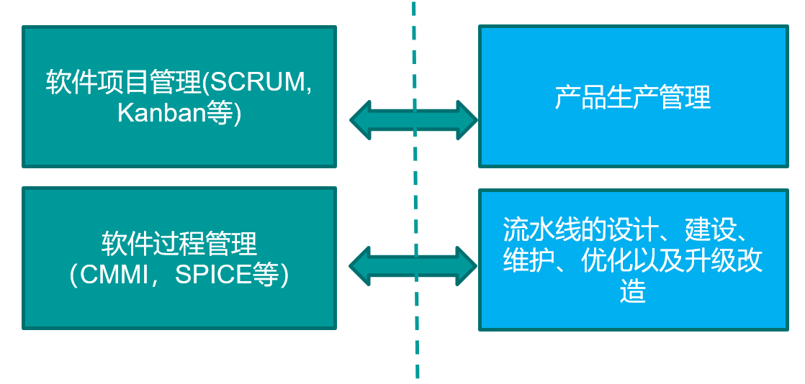

# 1. 概述

## 1.1 软件危机 VS. 软件工程

**软件危机**

- 软件危机是指**落后的软件生产方式**无法满足迅速增长的计算机软件需求，从而导致软件开发与维护过程中出现一系列严重问题的现象。

**软件工程**

- 软件工程是一门研究用**工程化方法**构建和维护有效的、实用的和高质量的软件的学科。

软件工程的两大视角

1. 管理视角——能否复制成功？

2. 技术视角——是否可以将问题解决得更好？

## 1.2 软件项目管理

### 1.2.1 概念

管理的三大关键要素：**目标、状态、纠偏**

软件项目管理

- 典型的三大目标：**成本、质量、工期**

- 软件项目管理是应用方法、工具、技术以及人员能力来完成软件项目，实现项目目标的过程。 

- 估算、计划、跟踪、风险管理、范围管理、人员管理、沟通管理，等等 

### 1.2.2 管理视角

**管理视角的核心问题：“成功是否可以复制？”**

**软件过程**

- 软件过程是为了实现一个或者多个事先定义的目标而建立起来的一组实践的集合
- 这组实践之间往往有一定的先后顺序，作为一个整体来实现事先定义的一个或者多个目标。 

生命周期模型：对软件过程的一种人为的划分

## 1.3 软件过程

广义软件过程包括**技术**、**人员**以及**狭义过程**

- 同义词：软件开发方法、软件开发过程
- 净室Cleanroom方法、极限编程方法、SCRUM方法、Gate方法；
- 而更一般的，敏捷软件过程／方法、轻量型过程／方法以及重型过程／方法等描述也是恰当的

## 1.4 生命周期模型与软件过程

1. 生命周期模型是对一个软件开发过程的人为划分
2. 生命周期模型是软件开发过程的主框架，是对软件开发过程的一种**粗粒度划分**
3. 生命周期模型往往**不包括技术实践**

典型方法：瀑布模型、迭代式模型、增量模型、螺旋模型、原型法等等

## 1.5 软件过程管理

管理的目的是为了让**软件过程**在开发效率、质量等方面有着更好**性能绩效**（performance）

**软件过程改进**：与软件过程管理意思相近

- 软件过程管理参考模型 CMM/CMMI, SPICE等

- 软件过程改进参考元模型 PDCA，IDEAL

